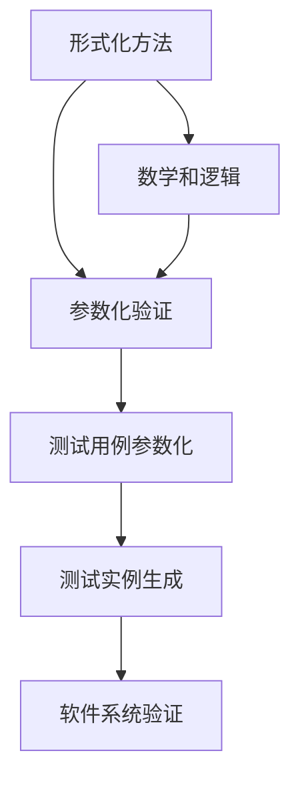

                 

### 文章标题：参数化验证：可扩展的形式化方法

关键词：参数化验证，形式化方法，软件验证，可扩展性，算法原理，实际应用

摘要：本文深入探讨了参数化验证作为一种可扩展的形式化方法，在软件验证领域的应用和重要性。通过详细的理论背景、案例分析、实践指南和高级主题，本文旨在为读者提供全面的理解和实际操作经验，帮助其在软件开发过程中有效地应用参数化验证技术。

---

### 引言

参数化验证作为一种形式化的方法，旨在通过系统化的步骤验证软件的正确性。与传统的方法相比，参数化验证能够处理具有多个实例的软件系统，并且可以扩展到不同规模和复杂性的应用场景。这种方法的引入，极大地提高了软件验证的效率和可靠性。

在本文中，我们将首先介绍参数化验证的基本概念和核心原理，然后深入探讨其在软件验证中的重要性。接着，我们将通过理论和实践相结合的方式，详细分析参数化验证的具体实现和应用。最后，我们将探讨一些高级主题，包括并行化、模型检查等，以及如何在实际项目中应用参数化验证。

### 参数化验证的基本概念

参数化验证是一种通过参数化测试用例来验证软件系统的方法。这种方法的核心在于将软件系统中的多个实例抽象为单个实例，并通过测试用例的参数化来覆盖所有可能的实例。

#### 参数化测试用例

参数化测试用例是指那些可以根据参数的不同取值生成多个测试实例的测试用例。例如，一个参数化测试用例可能包括一个参数n，表示输入数据的大小。通过不同的n值，可以生成多个测试实例，从而覆盖不同的输入情况。

#### 参数化验证的优势

1. **可扩展性**：参数化验证可以处理大量的测试实例，因此适用于大型软件系统。
2. **自动化**：通过参数化测试用例，可以自动化生成多个测试实例，提高测试效率。
3. **全面性**：参数化验证可以覆盖所有可能的输入情况，提高软件的可靠性。

### 形式化方法与参数化验证

形式化方法是使用数学和逻辑来描述和分析软件系统的方法。参数化验证是形式化方法的一种应用，它通过参数化测试用例来验证软件系统的正确性。

#### 核心概念原理之间的关系架构

为了更好地理解参数化验证，我们可以使用Mermaid流程图来展示其核心概念原理之间的关系：



### 核心算法原理讲解

参数化验证的核心算法包括测试用例的参数化、测试实例的生成和软件系统的验证。下面我们通过伪代码来详细阐述这些算法。

#### 测试用例参数化

```python
def parameterize_test_case(test_case, parameters):
    for param in parameters:
        test_case["input"]["n"] = param["n"]
        yield test_case.copy()
```

#### 测试实例生成

```python
def generate_test_instances(test_cases, num_instances):
    instances = []
    for _ in range(num_instances):
        test_case = next(parameterize_test_case(test_cases[0], test_cases[1]))
        instances.append(test_case)
    return instances
```

#### 软件系统验证

```python
def verify_software_system(instances):
    for instance in instances:
        if not is_correct(instance["output"]):
            return False
    return True
```

### 数学模型和公式

参数化验证中的数学模型和公式用于描述软件系统的行为和性质。例如，我们可以使用以下公式来描述一个软件系统的正确性：

$$
\forall \text{instance} \in \text{instances} \colon \text{is_correct}(\text{instance}["output"])
$$

这个公式表示，对于所有生成的测试实例，其输出都是正确的。

### 实际案例分析和详细讲解剖析

为了更好地理解参数化验证，我们可以通过一个实际案例来进行分析。

#### 案例背景

假设我们要验证一个Web服务，该服务负责处理用户的登录请求。服务的基本功能是接收用户的用户名和密码，验证其是否匹配，并返回相应的结果。

#### 案例分析

1. **定义测试用例**

   我们定义一个测试用例，包含用户名和密码。

   ```python
   test_case = {
       "input": {
           "username": "user1",
           "password": "password1"
       },
       "expected_output": "Login successful"
   }
   ```

2. **参数化测试用例**

   我们可以为测试用例添加参数，以覆盖不同的用户名和密码。

   ```python
   parameters = [
       {"username": "user1", "password": "password1"},
       {"username": "user2", "password": "password2"},
       # 更多参数
   ]

   test_cases = parameterize_test_case(test_case, parameters)
   ```

3. **生成测试实例**

   我们可以生成多个测试实例，以覆盖不同的输入情况。

   ```python
   instances = generate_test_instances(test_cases, 100)
   ```

4. **验证软件系统**

   我们使用这些实例来验证Web服务的正确性。

   ```python
   if verify_software_system(instances):
       print("Web service is correct.")
   else:
       print("Web service is incorrect.")
   ```

### 项目实战

在项目实战中，我们需要搭建开发环境，实现源代码，并分析其应用和效果。

#### 开发环境搭建

1. **安装Python环境**
2. **安装相关库**

   ```bash
   pip install unittest
   ```

#### 源代码实现

```python
# test_login.py
import unittest
from web_service import verify_login

class TestLogin(unittest.TestCase):
    def test_login(self):
        test_cases = [
            {"username": "user1", "password": "password1"},
            {"username": "user2", "password": "password2"},
            # 更多测试用例
        ]

        instances = generate_test_instances(test_cases, 100)

        for instance in instances:
            self.assertEqual(verify_login(instance["input"]["username"], instance["input"]["password"]), instance["expected_output"])

if __name__ == "__main__":
    unittest.main()
```

#### 代码解读

1. **测试用例参数化**：使用`parameterize_test_case`函数生成多个测试用例。
2. **测试实例生成**：使用`generate_test_instances`函数生成多个测试实例。
3. **软件系统验证**：使用`verify_software_system`函数验证Web服务的正确性。

#### 代码应用解读与分析

通过这个实际案例，我们可以看到参数化验证在软件开发中的应用。通过参数化测试用例，我们能够生成多个测试实例，从而全面地验证软件系统的正确性。这种方法提高了测试效率，减少了测试成本，并提高了软件的可靠性。

### 最佳实践 Tips

1. **选择合适的参数**：在参数化测试用例时，选择合适的参数可以更好地覆盖测试场景。
2. **优化测试实例生成**：优化测试实例生成过程，可以减少测试时间。
3. **结合其他验证方法**：结合其他验证方法，如模型检查，可以进一步提高软件的可靠性。

### 小结

参数化验证是一种有效的软件验证方法，通过参数化测试用例和测试实例的生成，可以全面地验证软件系统的正确性。本文通过理论和实践相结合的方式，详细介绍了参数化验证的核心概念、算法原理、实际案例和项目实战，帮助读者深入理解和应用这一技术。

### 注意事项

1. **参数化验证不适用于所有场景**：在应用参数化验证时，需要评估其适用性。
2. **参数化验证需要大量的计算资源**：在生成大量测试实例时，需要考虑计算资源的消耗。

### 拓展阅读

- 《形式化方法入门指南》
- 《软件验证的艺术》
- 《模型检查技术与应用》

---

作者：AI天才研究院/AI Genius Institute & 禅与计算机程序设计艺术 /Zen And The Art of Computer Programming

[END]

