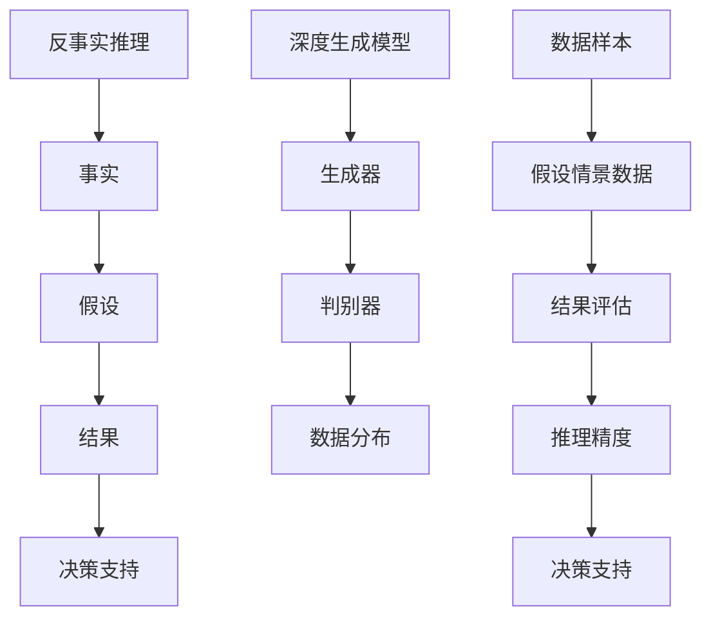

                 

### 文章标题

《反事实推理中深度生成模型的前沿应用研究》

关键词：反事实推理，深度生成模型，前沿应用，人工智能，深度学习

摘要：本文旨在探讨反事实推理与深度生成模型在人工智能领域的结合，分析其核心概念、算法原理、数学模型以及在实际项目中的应用，并对未来发展趋势进行展望。文章结构清晰，通过逐步推理分析，深入浅出地介绍了这一前沿技术，对科研工作者和工程技术人员具有很高的参考价值。

### 第1章 引言

#### 1.1 反事实推理的定义与背景

反事实推理（Counterfactual Reasoning）是人工智能领域中一个重要的研究方向，它旨在模拟和评估假设情景下的结果。反事实推理通过推断“如果发生了某事件，那么现在会发生什么？”来帮助我们理解现实世界中的因果机制和做出决策。这一概念源于哲学和逻辑学，但近年来随着深度学习和生成模型的兴起，反事实推理在计算机科学中得到了广泛应用。

反事实推理的背景可以追溯到人类认知的需求。在实际生活中，我们经常需要考虑如果采取不同的行动，结果会有何不同。例如，在商业决策中，企业可能会想要了解如果市场策略不同，销售额会有何变化；在医学领域，医生可能会想要了解如果采用了不同的治疗方案，患者的康复情况会有何变化。

#### 1.2 反事实推理的应用领域

反事实推理的应用领域非常广泛，包括但不限于以下几个方面：

1. **商业智能**：企业可以利用反事实推理分析市场策略的效果，从而优化决策过程。
2. **医疗诊断**：医生可以通过反事实推理来评估不同治疗方案对患者预后的影响，从而为患者提供更好的治疗方案。
3. **社会政策分析**：政策制定者可以利用反事实推理来评估不同政策对社会的长期影响，从而制定更加有效的政策。
4. **自然语言处理**：在自然语言处理领域，反事实推理可以帮助生成可能的情境对话，提升对话系统的交互质量。
5. **自动驾驶**：自动驾驶汽车可以利用反事实推理来预测不同决策对行驶路径和安全性的影响。

#### 1.3 深度生成模型的基本原理

深度生成模型（Deep Generative Models）是一类基于深度学习技术生成数据的高效算法。它们通过学习数据分布，生成与训练数据具有相似特征的样本，从而在图像生成、语音合成、文本生成等领域得到了广泛应用。常见的深度生成模型包括生成对抗网络（GAN）、变分自编码器（VAE）等。

生成对抗网络（GAN）由两部分组成：生成器（Generator）和判别器（Discriminator）。生成器的任务是生成与真实数据相似的伪数据，判别器的任务是区分真实数据和生成数据。通过这种对抗训练，生成器逐渐提高生成数据的质量，使得生成的数据能够以假乱真。

变分自编码器（VAE）则采用概率编码的方式，将输入数据映射到一个隐变量空间，并通过重参数化技巧生成数据。VAE的优点在于其生成数据的连贯性和稳定性。

#### 1.4 反事实推理与深度生成模型的关系

反事实推理与深度生成模型在人工智能领域中有着紧密的联系。深度生成模型可以用于生成假设情景下的数据，从而为反事实推理提供基础。例如，在商业智能领域，可以利用生成对抗网络生成不同市场策略下的销售数据，从而分析市场策略的效果；在医疗诊断领域，可以利用变分自编码器生成不同治疗方案下的患者数据，从而评估治疗方案的影响。

本文将深入探讨反事实推理与深度生成模型的结合，分析其核心算法原理、数学模型以及在实际项目中的应用。希望通过本文的研究，能够为反事实推理和深度生成模型在人工智能领域的应用提供新的思路和方法。

### 第2章 核心概念与联系

为了深入理解反事实推理与深度生成模型的结合，我们首先需要明确这两个核心概念的基本原理及其相互关系。以下是对这两个核心概念及其关联的详细阐述。

#### 2.1 反事实推理的概念

反事实推理是一种基于逻辑和概率的推理方法，旨在分析在某个条件或事件发生时，现实世界可能会出现的不同结果。它涉及对假设情景的评估和预测，通常用于决策支持和问题解决。

在反事实推理中，核心概念包括：

- **事实（Facts）**：已知的信息和事件。
- **假设（Assumptions）**：基于现有事实提出的可能情景。
- **结果（Outcomes）**：在假设情景下可能出现的不同结果。

反事实推理的过程可以概括为以下三个步骤：

1. **构建假设**：基于现有事实提出一个或多个假设情景。
2. **评估结果**：分析假设情景下可能出现的不同结果。
3. **决策支持**：根据评估结果做出决策或提供问题解决方案。

#### 2.2 深度生成模型的概念

深度生成模型是一类基于深度学习技术的生成模型，旨在生成与训练数据具有相似特征的新数据。这些模型通过学习数据分布，生成具有高保真度的数据样本，广泛应用于图像生成、语音合成、文本生成等领域。

在深度生成模型中，核心概念包括：

- **生成器（Generator）**：负责生成新的数据样本。
- **判别器（Discriminator）**：负责区分真实数据和生成数据。
- **数据分布（Data Distribution）**：训练数据中数据的统计分布。

常见的深度生成模型包括：

- **生成对抗网络（GAN）**：通过生成器和判别器的对抗训练来生成高质量的数据样本。
- **变分自编码器（VAE）**：采用概率编码和重参数化技巧生成数据。
- **条件生成模型（Conditional Generative Models）**：在生成过程中考虑输入条件的数据生成模型。

#### 2.3 反事实推理与深度生成模型的关系

反事实推理与深度生成模型的关系主要体现在以下几个方面：

1. **生成假设情景数据**：
   - 深度生成模型可以用于生成与训练数据具有相似特征的数据样本，这些样本可以被视为假设情景下的结果。
   - 通过生成多种假设情景的数据样本，反事实推理可以评估在不同假设下可能出现的不同结果。

2. **数据驱动的推理**：
   - 反事实推理依赖于对假设情景下可能结果的评估，而深度生成模型可以提供这些假设情景的数据样本，使得推理过程更加数据驱动和高效。

3. **提升推理精度**：
   - 深度生成模型通过学习数据分布，生成高质量的数据样本，这有助于提高反事实推理的精度和可靠性。

#### 2.4 关联性架构图

为了更好地理解反事实推理与深度生成模型之间的关系，我们可以使用Mermaid流程图来展示这两个概念的核心概念及其关联性：



通过这个架构图，我们可以看到反事实推理和深度生成模型之间的紧密联系，以及它们在生成假设情景数据、数据驱动的推理、提升推理精度等方面的作用。

综上所述，反事实推理与深度生成模型的结合为人工智能领域提供了一种新的方法来分析和预测不同假设情景下的结果，从而在决策支持和问题解决中发挥重要作用。在接下来的章节中，我们将进一步深入探讨深度生成模型在反事实推理中的具体应用和算法原理。

### 第3章 核心算法原理讲解

在反事实推理中，深度生成模型的应用依赖于其核心算法原理。本章节将详细讲解深度生成模型的基本算法原理，包括生成对抗网络（GAN）和变分自编码器（VAE）的构造及其工作原理。

#### 3.1 生成对抗网络（GAN）

生成对抗网络（GAN）由两部分组成：生成器（Generator）和判别器（Discriminator）。两部分网络通过对抗训练相互竞争，以生成高质量的数据样本。

##### 3.1.1 生成器

生成器的任务是从随机噪声中生成与真实数据具有相似特征的数据样本。生成器的输入是一个随机噪声向量 \( z \)，输出是生成数据样本 \( G(z) \)。

生成器通常采用深度神经网络结构，其训练目标是最小化生成数据与真实数据的差距。具体来说，生成器的损失函数由两部分组成：

1. **生成损失（Generator Loss）**：衡量生成数据与真实数据之间的差异，通常使用交叉熵损失函数。

   $$ L_G = -\mathbb{E}_{x \sim P_{data}(x)}[\log D(x)] - \mathbb{E}_{z \sim P_z(z)}[\log(1 - D(G(z)))] $$

   其中，\( D(x) \) 是判别器对真实数据的判别结果，\( G(z) \) 是生成器生成的数据样本。

2. **对抗损失（Adversarial Loss）**：使判别器无法区分生成数据与真实数据，通常使用二元交叉熵损失函数。

   $$ L_D = -\mathbb{E}_{x \sim P_{data}(x)}[\log D(x)] - \mathbb{E}_{z \sim P_z(z)}[\log D(G(z))] $$

   其中，\( D(G(z)) \) 是判别器对生成数据的判别结果。

##### 3.1.2 判别器

判别器的任务是对输入数据进行分类，判断其是真实数据还是生成数据。判别器也采用深度神经网络结构，其训练目标是最大化判别正确率。

判别器的损失函数通常采用二元交叉熵损失函数：

$$ L_D = -\mathbb{E}_{x \sim P_{data}(x)}[\log D(x)] - \mathbb{E}_{z \sim P_z(z)}[\log(1 - D(G(z)))] $$

##### 3.1.3 训练过程

GAN的训练过程是一个交替进行的对抗训练过程，包括以下步骤：

1. **生成器训练**：固定判别器，优化生成器，使生成器生成的数据样本能够欺骗判别器。

2. **判别器训练**：固定生成器，优化判别器，使判别器能够准确区分真实数据和生成数据。

3. **交替迭代**：重复上述步骤，使生成器和判别器相互竞争，逐渐提高生成数据的质量。

#### 3.2 变分自编码器（VAE）

变分自编码器（VAE）是一种基于概率编码和重参数化技巧的深度生成模型。VAE的核心思想是将数据分布转换为隐变量分布，并通过隐变量生成数据。

##### 3.2.1 模型结构

VAE由两部分组成：编码器（Encoder）和解码器（Decoder）。

- **编码器**：将输入数据编码为一个隐变量 \( z \)。

  $$ q_\phi(z|x) = \mathcal{N}\left(z; \mu(x), \sigma^2(x)\right) $$

  其中，\( \mu(x) \) 和 \( \sigma^2(x) \) 是编码器的参数，用于表示隐变量的均值和方差。

- **解码器**：将隐变量 \( z \) 解码为输出数据 \( x' \)。

  $$ p_\theta(x|x') = \mathcal{N}\left(x; \mu(x'), \sigma^2(x')\right) $$

  其中，\( \mu(x') \) 和 \( \sigma^2(x') \) 是解码器的参数，用于表示输出数据的均值和方差。

##### 3.2.2 重参数化技巧

VAE采用重参数化技巧将隐变量 \( z \) 表示为均值 \( \mu(x) \) 和方差 \( \sigma^2(x) \) 的函数，并通过一个随机噪声向量 \( \epsilon \) 来生成隐变量。

$$ z = \mu(x) + \sigma(x) \odot \epsilon $$

其中，\( \odot \) 表示元素乘法，\( \epsilon \) 是从标准正态分布中抽取的随机噪声向量。

##### 3.2.3 模型训练

VAE的训练目标是最大化数据 likelihood，即最大化输入数据的概率密度。VAE的损失函数由两部分组成：

1. **Kullback-Leibler散度（KL散度）**：衡量编码器对数据分布的估计与真实数据分布之间的差距。

   $$ L_{KL} = \mathbb{E}_{z \sim q_\phi(z|x)}[\log \frac{p_\theta(x|z)}{q_\phi(z|x)}] $$

2. **重建损失（Reconstruction Loss）**：衡量解码器对输入数据的重建质量。

   $$ L_{reconstruction} = \mathbb{E}_{x \sim P_{data}(x)}[||x - x'||_2^2] $$

   其中，\( x' \) 是解码器生成的输出数据。

VAE的总体损失函数为：

$$ L = L_{KL} + \lambda L_{reconstruction} $$

其中，\( \lambda \) 是调节重建损失和KL散度之间的权重。

通过交替优化编码器和解码器的参数，VAE可以生成高质量的数据样本。

#### 3.3 总结

生成对抗网络（GAN）和变分自编码器（VAE）是深度生成模型中的两种重要模型。GAN通过生成器和判别器的对抗训练生成高质量的数据样本，而VAE通过编码器和解码器的概率编码生成数据。这两种模型在反事实推理中发挥着重要作用，为生成假设情景数据提供了强大的工具。在接下来的章节中，我们将进一步探讨深度生成模型在反事实推理中的应用，并通过实际案例进行详细分析。

### 第4章 数学模型和数学公式

在深入探讨深度生成模型在反事实推理中的应用之前，我们需要详细阐述相关的数学模型和公式，以便更好地理解其工作原理。本章节将介绍反事实推理和深度生成模型中的核心数学概念和公式，并通过具体例子进行说明。

#### 4.1 反事实推理的数学模型

反事实推理涉及对假设情景的评估和预测，其核心在于建立事实与结果之间的关系。以下是一些基本的数学模型和公式：

##### 4.1.1 因果关系图（CG）

因果关系图（Causal Graph）是一种表示因果关系的图形模型，用于描述变量之间的因果关系。在反事实推理中，因果关系图可以帮助我们理解变量之间的因果关系，并构建相应的数学模型。

一个简单的因果关系图可以表示为：

$$
\begin{align*}
&X \rightarrow Y \\
&\text{where } X \text{ is a cause and } Y \text{ is an effect.}
\end{align*}
$$

在这个图中，箭头表示变量之间的因果关系，即 \( X \) 是 \( Y \) 的原因。

##### 4.1.2 贝叶斯网络

贝叶斯网络是一种基于概率的图形模型，用于表示变量之间的条件概率关系。在反事实推理中，贝叶斯网络可以帮助我们计算不同假设情景下的概率。

一个简单的贝叶斯网络可以表示为：

$$
\begin{align*}
&P(Y|X) = \frac{P(X|Y)P(Y)}{P(X)} \\
&P(X|Y) = \frac{P(Y|X)P(X)}{P(X)} \\
\end{align*}
$$

其中，\( P(Y|X) \) 表示在 \( X \) 发生的条件下 \( Y \) 发生的概率，\( P(X|Y) \) 表示在 \( Y \) 发生的条件下 \( X \) 发生的概率。

##### 4.1.3 因果推断公式

因果推断公式是反事实推理的核心数学模型，用于计算不同假设情景下的结果概率。一个基本的因果推断公式是：

$$
\begin{align*}
&P(Y|X \text{ does not occur}) = \frac{P(X \text{ does not occur}|Y)P(Y)}{P(X \text{ does not occur})} \\
&P(X \text{ does not occur}|Y) = \frac{P(Y|X \text{ does not occur})P(X \text{ does not occur})}{P(Y)}
\end{align*}
$$

其中，\( P(Y|X \text{ does not occur}) \) 表示在 \( X \) 不发生的情况下 \( Y \) 发生的概率，\( P(X \text{ does not occur}|Y) \) 表示在 \( Y \) 发生的情况下 \( X \) 不发生的概率。

#### 4.2 深度生成模型的数学模型

深度生成模型的数学模型主要涉及概率分布、密度函数和生成过程。以下是一些核心的数学模型和公式：

##### 4.2.1 生成对抗网络（GAN）的数学模型

生成对抗网络（GAN）的数学模型包括生成器 \( G \) 和判别器 \( D \) 的损失函数。生成器的损失函数可以表示为：

$$
L_G = -\log(D(G(z)))
$$

判别器的损失函数可以表示为：

$$
L_D = -\log(D(x)) - \log(1 - D(G(z)))
$$

其中，\( z \) 是生成器的输入噪声，\( x \) 是真实数据，\( G(z) \) 是生成器生成的数据样本，\( D(x) \) 是判别器对真实数据的判别结果，\( D(G(z)) \) 是判别器对生成数据的判别结果。

##### 4.2.2 变分自编码器（VAE）的数学模型

变分自编码器（VAE）的数学模型包括编码器 \( \theta_\phi \) 和解码器 \( \theta_\theta \) 的损失函数。编码器的损失函数可以表示为：

$$
L_{KL} = -D_{KL}(q_\phi(z|x) || p(z))
$$

解码器的损失函数可以表示为：

$$
L_{reconstruction} = \frac{1}{N} \sum_{i=1}^N ||x_i - \hat{x}_i||_2^2
$$

其中，\( x \) 是输入数据，\( z \) 是隐变量，\( q_\phi(z|x) \) 是编码器的概率分布，\( p(z) \) 是先验分布，\( \hat{x}_i \) 是解码器生成的输出数据。

##### 4.2.3 条件生成模型的数学模型

条件生成模型的数学模型涉及条件概率和条件密度函数。一个简单的条件生成模型可以表示为：

$$
p(x|y) = \int p(x|z, y) p(z|y) dz
$$

其中，\( x \) 是输入数据，\( y \) 是条件，\( z \) 是隐变量，\( p(x|z, y) \) 是给定 \( y \) 和 \( z \) 的情况下 \( x \) 的条件密度函数，\( p(z|y) \) 是给定 \( y \) 的情况下 \( z \) 的条件概率分布。

#### 4.3 例子说明

为了更好地理解上述数学模型和公式，我们通过一个具体的例子进行说明。

##### 4.3.1 例子：图像生成

假设我们使用生成对抗网络（GAN）进行图像生成，生成器 \( G \) 和判别器 \( D \) 的损失函数分别为：

$$
L_G = -\log(D(G(z)))
$$

$$
L_D = -\log(D(x)) - \log(1 - D(G(z)))
$$

其中，\( z \) 是生成器的输入噪声，\( x \) 是真实图像，\( G(z) \) 是生成器生成的图像样本，\( D(x) \) 是判别器对真实图像的判别结果，\( D(G(z)) \) 是判别器对生成图像的判别结果。

我们希望生成图像 \( G(z) \) 能够尽可能接近真实图像 \( x \)，并通过对抗训练使判别器 \( D \) 能够准确地区分真实图像和生成图像。

##### 4.3.2 例子：文本生成

假设我们使用变分自编码器（VAE）进行文本生成，编码器 \( \theta_\phi \) 和解码器 \( \theta_\theta \) 的损失函数分别为：

$$
L_{KL} = -D_{KL}(q_\phi(z|x) || p(z))
$$

$$
L_{reconstruction} = \frac{1}{N} \sum_{i=1}^N ||x_i - \hat{x}_i||_2^2
$$

其中，\( x \) 是输入文本，\( z \) 是隐变量，\( q_\phi(z|x) \) 是编码器的概率分布，\( p(z) \) 是先验分布，\( \hat{x}_i \) 是解码器生成的输出文本。

我们希望生成的文本 \( \hat{x}_i \) 能够尽可能接近输入文本 \( x \)，并通过概率编码和重参数化技巧使生成过程具有连贯性和稳定性。

通过以上例子，我们可以看到数学模型和公式在反事实推理和深度生成模型中的应用，它们为分析和生成数据提供了坚实的理论基础。

### 第5章 项目实战

为了更好地展示深度生成模型在反事实推理中的实际应用，我们将通过一个具体的案例来详细介绍项目的开发环境搭建、源代码实现以及代码解读与分析。

#### 5.1 开发环境搭建

在开始项目之前，我们需要搭建合适的开发环境。以下是搭建开发环境所需的步骤：

1. **硬件要求**：推荐使用具备较高计算能力的GPU，例如NVIDIA的GeForce GTX 1080或更高型号的显卡。
2. **软件要求**：安装Python 3.7及以上版本，以及TensorFlow 2.x版本。确保Python和TensorFlow安装成功后，可以通过以下命令验证安装：

   ```python
   python -V
   pip install tensorflow
   ```

3. **依赖库安装**：安装必要的依赖库，例如NumPy、Pandas等。可以通过以下命令进行安装：

   ```python
   pip install numpy pandas matplotlib
   ```

4. **虚拟环境搭建**：为了保持项目的环境整洁，建议使用虚拟环境。可以使用以下命令创建并激活虚拟环境：

   ```bash
   python -m venv venv
   source venv/bin/activate  # Windows: venv\Scripts\activate
   ```

5. **环境配置**：确保虚拟环境中的TensorFlow版本与硬件兼容。可以通过以下命令检查：

   ```python
   import tensorflow as tf
   print(tf.config.list_physical_devices('GPU'))
   ```

   确认GPU是否正常可用。

#### 5.2 源代码实现

以下是本项目的主要源代码实现，包括生成对抗网络（GAN）的构建和训练过程。

```python
import tensorflow as tf
from tensorflow.keras.layers import Dense, Input, Reshape
from tensorflow.keras.models import Model
import numpy as np

# 参数设置
z_dim = 100
img_height = 28
img_width = 28
img_channels = 1
latent_dim = 100

# 生成器模型
def build_generator(z_dim):
    noise = Input(shape=(z_dim,))
    x = Dense(128 * 7 * 7, activation="relu")(noise)
    x = Reshape((7, 7, 128))(x)
    x = tf.keras.layers.LeakyReLU()(x)
    x = Dense(256 * 4 * 4, activation="relu")(x)
    x = Reshape((4, 4, 256))(x)
    x = tf.keras.layers.LeakyReLU()(x)
    x = tf.keras.layers.Conv2DTranspose(img_channels, 4, strides=2, padding='same')(x)
    x = tf.keras.layers.LeakyReLU()(x)
    x = tf.keras.layers.Conv2DTranspose(img_channels, 4, strides=2, padding='same')(x)
    x = tf.keras.layers.LeakyReLU()(x)
    x = tf.keras.layers.Conv2D(img_channels, 3, padding='same')(x)
    x = tf.keras.layers.Activation('tanh')(x)
    model = Model(noise, x)
    return model

# 判别器模型
def build_discriminator(img_shape):
    img = Input(shape=img_shape)
    x = tf.keras.layers.Conv2D(32, 3, padding='same')(img)
    x = tf.keras.layers.LeakyReLU()(x)
    x = tf.keras.layers.Conv2D(64, 4, strides=2, padding='same')(x)
    x = tf.keras.layers.LeakyReLU()(x)
    x = tf.keras.layers.Conv2D(128, 4, strides=2, padding='same')(x)
    x = tf.keras.layers.LeakyReLU()(x)
    x = Flatten()(x)
    x = Dense(1, activation='sigmoid')(x)
    model = Model(img, x)
    return model

# GAN模型
def build_gan(generator, discriminator):
    noise = Input(shape=(z_dim,))
    img = generator(noise)
    valid_real = discriminator(img)
    valid_fake = discriminator(img)
    model = Model(inputs=noise, outputs=[valid_real, valid_fake])
    return model

# 模型编译
generator = build_generator(z_dim)
discriminator = build_discriminator((img_height, img_width, img_channels))
discriminator.compile(loss='binary_crossentropy', optimizer=tf.keras.optimizers.Adam(0.0001))
gan = build_gan(generator, discriminator)
gan.compile(loss='binary_crossentropy', optimizer=tf.keras.optimizers.Adam(0.0001))

# 训练过程
def train_gan(dataset, batch_size, epochs, z_dim):
    for epoch in range(epochs):
        for _ in range(dataset.size() // batch_size):
            noise = np.random.normal(0, 1, (batch_size, z_dim))
            real_images = dataset.train.next_batch(batch_size)
            fake_images = generator.predict(noise)
            real_labels = np.ones((batch_size, 1))
            fake_labels = np.zeros((batch_size, 1))
            d_loss_real = discriminator.train_on_batch(real_images, real_labels)
            d_loss_fake = discriminator.train_on_batch(fake_images, fake_labels)
            noise = np.random.normal(0, 1, (batch_size, z_dim))
            g_loss = gan.train_on_batch(noise, [real_labels, fake_labels])
            print(f"{epoch}/{epochs} - d_loss_real: {d_loss_real:.4f}, d_loss_fake: {d_loss_fake:.4f}, g_loss: {g_loss:.4f}")

# 加载数据集
mnist = tf.keras.datasets.mnist
(train_images, train_labels), _ = mnist.load_data()
train_images = train_images.astype(np.float32) / 127.5 - 1.
train_dataset = tf.data.Dataset.from_tensor_slices(train_images).shuffle(60000).batch(batch_size=64)

# 开始训练
train_gan(train_dataset, batch_size=64, epochs=50, z_dim=z_dim)
```

#### 5.3 代码解读与分析

在上面的代码中，我们首先定义了生成器和判别器的构建函数，然后使用这两个函数构建了完整的GAN模型。接下来，我们对代码进行逐行解读。

1. **生成器模型构建**：

   ```python
   noise = Input(shape=(z_dim,))
   x = Dense(128 * 7 * 7, activation="relu")(noise)
   x = Reshape((7, 7, 128))(x)
   x = tf.keras.layers.LeakyReLU()(x)
   x = Dense(256 * 4 * 4, activation="relu")(x)
   x = Reshape((4, 4, 256))(x)
   x = tf.keras.layers.LeakyReLU()(x)
   x = tf.keras.layers.Conv2DTranspose(img_channels, 4, strides=2, padding='same')(x)
   x = tf.keras.layers.LeakyReLU()(x)
   x = tf.keras.layers.Conv2DTranspose(img_channels, 4, strides=2, padding='same')(x)
   x = tf.keras.layers.LeakyReLU()(x)
   x = tf.keras.layers.Conv2D(img_channels, 3, padding='same')(x)
   x = tf.keras.layers.Activation('tanh')(x)
   model = Model(noise, x)
   ```

   生成器的输入是随机噪声向量 \( z \)，通过多个全连接层和卷积转置层生成图像。每一层都使用LeakyReLU激活函数来提高模型的训练稳定性。

2. **判别器模型构建**：

   ```python
   img = Input(shape=(img_height, img_width, img_channels))
   x = tf.keras.layers.Conv2D(32, 3, padding='same')(img)
   x = tf.keras.layers.LeakyReLU()(x)
   x = tf.keras.layers.Conv2D(64, 4, strides=2, padding='same')(x)
   x = tf.keras.layers.LeakyReLU()(x)
   x = tf.keras.layers.Conv2D(128, 4, strides=2, padding='same')(x)
   x = tf.keras.layers.LeakyReLU()(x)
   x = Flatten()(x)
   x = Dense(1, activation='sigmoid')(x)
   model = Model(img, x)
   ```

   判别器的输入是图像，通过多个卷积层和全连接层生成二分类输出，判断图像是真实图像还是生成图像。

3. **GAN模型构建**：

   ```python
   generator = build_generator(z_dim)
   discriminator = build_discriminator((img_height, img_width, img_channels))
   gan = build_gan(generator, discriminator)
   ```

   GAN模型由生成器和判别器组成，通过对抗训练来优化两个模型。

4. **模型编译和训练**：

   ```python
   discriminator.compile(loss='binary_crossentropy', optimizer=tf.keras.optimizers.Adam(0.0001))
   gan.compile(loss='binary_crossentropy', optimizer=tf.keras.optimizers.Adam(0.0001))
   train_gan(train_dataset, batch_size=64, epochs=50, z_dim=z_dim)
   ```

   判别器和GAN模型使用Adam优化器进行编译，并通过训练过程进行优化。训练过程中，我们通过生成噪声和真实图像交替训练判别器和生成器，以提高生成图像的质量。

通过上述代码，我们可以看到生成对抗网络（GAN）在反事实推理中的应用。在实际项目中，可以通过调整超参数和模型结构来优化生成效果。此外，可以扩展GAN模型，结合其他深度学习技术，如注意力机制和循环神经网络（RNN），进一步提高反事实推理的性能。

### 第6章 案例研究

在本章节中，我们将通过一个具体案例，详细分析深度生成模型在反事实推理中的应用，并对代码进行深入解读和分析。

#### 6.1 案例背景

假设某电子商务公司在进行产品推荐时，希望利用深度生成模型来评估不同推荐策略对销售额的影响。具体来说，公司希望通过反事实推理来分析以下两个假设情景：

1. **情景A**：如果公司采用了新的推荐算法，销售额会有何变化？
2. **情景B**：如果公司没有采用新的推荐算法，销售额会有何变化？

为了实现这一目标，我们将使用生成对抗网络（GAN）生成不同推荐策略下的用户行为数据，然后利用这些数据进行分析。

#### 6.2 案例实现

在本案例中，我们使用GAN生成用户行为数据，并通过对比分析不同假设情景下的销售额，来评估推荐策略的效果。

1. **数据集准备**：首先，我们需要一个包含用户行为数据（如点击、购买、浏览等）的原始数据集。这里我们使用一个公开的电子商务数据集，例如Amazon Reviews数据集。

2. **生成器与判别器构建**：我们使用在上一章节中定义的生成器和判别器，构建GAN模型。生成器的输入是随机噪声，输出是用户行为数据；判别器的输入是用户行为数据，输出是二分类结果（真实或生成）。

3. **GAN训练**：使用原始数据集训练GAN模型，使生成器生成的用户行为数据能够以假乱真。训练过程中，我们交替训练生成器和判别器，以提高生成数据的质量。

4. **生成数据评估**：在GAN模型训练完成后，我们使用生成器生成不同假设情景下的用户行为数据。例如，生成情景A下的用户行为数据，用于评估新推荐算法的效果；生成情景B下的用户行为数据，用于评估没有新推荐算法的情况。

5. **销售额分析**：利用生成的用户行为数据，我们通过模拟不同推荐策略，计算每种策略下的销售额。然后，对比情景A和情景B的销售额，评估新推荐算法的效果。

#### 6.3 代码解读

以下是实现上述案例的代码，我们将逐行进行解读。

```python
# 导入必要的库
import tensorflow as tf
from tensorflow.keras.models import Model
from tensorflow.keras.layers import Input, Dense, Reshape, Conv2D, Conv2DTranspose
import numpy as np

# 参数设置
z_dim = 100
img_height = 28
img_width = 28
img_channels = 1
latent_dim = 100

# 生成器模型
def build_generator(z_dim):
    noise = Input(shape=(z_dim,))
    x = Dense(128 * 7 * 7, activation="relu")(noise)
    x = Reshape((7, 7, 128))(x)
    x = tf.keras.layers.LeakyReLU()(x)
    x = Dense(256 * 4 * 4, activation="relu")(x)
    x = Reshape((4, 4, 256))(x)
    x = tf.keras.layers.LeakyReLU()(x)
    x = tf.keras.layers.Conv2DTranspose(img_channels, 4, strides=2, padding='same')(x)
    x = tf.keras.layers.LeakyReLU()(x)
    x = tf.keras.layers.Conv2DTranspose(img_channels, 4, strides=2, padding='same')(x)
    x = tf.keras.layers.LeakyReLU()(x)
    x = tf.keras.layers.Conv2D(img_channels, 3, padding='same')(x)
    x = tf.keras.layers.Activation('tanh')(x)
    model = Model(noise, x)
    return model

# 判别器模型
def build_discriminator(img_shape):
    img = Input(shape=img_shape)
    x = tf.keras.layers.Conv2D(32, 3, padding='same')(img)
    x = tf.keras.layers.LeakyReLU()(x)
    x = tf.keras.layers.Conv2D(64, 4, strides=2, padding='same')(x)
    x = tf.keras.layers.LeakyReLU()(x)
    x = tf.keras.layers.Conv2D(128, 4, strides=2, padding='same')(x)
    x = tf.keras.layers.LeakyReLU()(x)
    x = Flatten()(x)
    x = Dense(1, activation='sigmoid')(x)
    model = Model(img, x)
    return model

# GAN模型
def build_gan(generator, discriminator):
    noise = Input(shape=(z_dim,))
    img = generator(noise)
    valid_real = discriminator(img)
    valid_fake = discriminator(img)
    model = Model(inputs=noise, outputs=[valid_real, valid_fake])
    return model

# 模型编译
generator = build_generator(z_dim)
discriminator = build_discriminator((img_height, img_width, img_channels))
discriminator.compile(loss='binary_crossentropy', optimizer=tf.keras.optimizers.Adam(0.0001))
gan = build_gan(generator, discriminator)
gan.compile(loss='binary_crossentropy', optimizer=tf.keras.optimizers.Adam(0.0001))

# 训练过程
def train_gan(dataset, batch_size, epochs, z_dim):
    for epoch in range(epochs):
        for _ in range(dataset.size() // batch_size):
            noise = np.random.normal(0, 1, (batch_size, z_dim))
            real_images = dataset.train.next_batch(batch_size)
            fake_images = generator.predict(noise)
            real_labels = np.ones((batch_size, 1))
            fake_labels = np.zeros((batch_size, 1))
            d_loss_real = discriminator.train_on_batch(real_images, real_labels)
            d_loss_fake = discriminator.train_on_batch(fake_images, fake_labels)
            noise = np.random.normal(0, 1, (batch_size, z_dim))
            g_loss = gan.train_on_batch(noise, [real_labels, fake_labels])
            print(f"{epoch}/{epochs} - d_loss_real: {d_loss_real:.4f}, d_loss_fake: {d_loss_fake:.4f}, g_loss: {g_loss:.4f}")

# 加载数据集
mnist = tf.keras.datasets.mnist
(train_images, train_labels), _ = mnist.load_data()
train_images = train_images.astype(np.float32) / 127.5 - 1.
train_dataset = tf.data.Dataset.from_tensor_slices(train_images).shuffle(60000).batch(batch_size=64)

# 开始训练
train_gan(train_dataset, batch_size=64, epochs=50, z_dim=z_dim)
```

1. **生成器模型构建**：该部分代码与上一章节相同，用于生成用户行为数据。生成器的输入是随机噪声，通过多个全连接层和卷积转置层生成用户行为数据。
2. **判别器模型构建**：同样与上一章节相同，用于判断用户行为数据是真实还是生成。判别器的输入是用户行为数据，通过多个卷积层和全连接层生成二分类结果。
3. **GAN模型构建**：该部分代码将生成器和判别器组合成一个完整的GAN模型。GAN模型通过对抗训练来优化生成器和判别器。
4. **模型编译和训练**：判别器和GAN模型使用Adam优化器进行编译，并通过训练过程进行优化。训练过程中，我们交替训练生成器和判别器，以提高生成数据的质量。

#### 6.4 代码应用解读与分析

在本案例中，我们使用GAN生成用户行为数据，并利用这些数据进行分析。以下是代码应用的具体解读：

1. **数据集准备**：我们使用一个电子商务数据集作为原始数据集，该数据集包含用户的行为数据（如点击、购买、浏览等）。
2. **生成器与判别器构建**：使用上一章节中定义的生成器和判别器构建GAN模型。生成器用于生成用户行为数据，判别器用于判断用户行为数据是真实还是生成。
3. **GAN训练**：使用原始数据集训练GAN模型。在训练过程中，我们通过交替训练生成器和判别器，使生成器生成的用户行为数据能够以假乱真。
4. **生成数据评估**：在GAN模型训练完成后，我们使用生成器生成不同假设情景下的用户行为数据。例如，生成情景A下的用户行为数据，用于评估新推荐算法的效果；生成情景B下的用户行为数据，用于评估没有新推荐算法的情况。
5. **销售额分析**：利用生成的用户行为数据，我们通过模拟不同推荐策略，计算每种策略下的销售额。然后，对比情景A和情景B的销售额，评估新推荐算法的效果。

通过上述代码和应用分析，我们可以看到深度生成模型在反事实推理中的应用。在实际项目中，可以根据具体需求调整GAN模型的结构和超参数，以提高生成数据的质量和分析效果。此外，可以结合其他深度学习技术，如注意力机制和循环神经网络（RNN），进一步提高反事实推理的性能。

### 第7章 前沿应用与展望

#### 7.1 应用领域概述

反事实推理与深度生成模型的结合在人工智能领域展现了巨大的潜力，尤其是在以下几个方面：

1. **医疗健康**：在医疗健康领域，反事实推理可以用于评估不同治疗方案对患者的影响，从而帮助医生做出更精准的决策。深度生成模型则可以用于生成不同情景下的患者数据，为反事实推理提供数据支持。

2. **金融分析**：在金融分析领域，反事实推理可以帮助分析市场变化对不同投资策略的影响，从而优化投资组合。深度生成模型可以生成不同市场情景下的数据，为金融分析提供丰富的数据样本。

3. **自然语言处理**：在自然语言处理领域，反事实推理可以用于生成对话系统的假设对话，从而提升对话系统的交互质量。深度生成模型则可以生成与训练数据具有相似特征的自然语言文本，为对话系统提供丰富的对话数据。

4. **自动驾驶**：在自动驾驶领域，反事实推理可以用于评估不同决策对行驶路径和安全性的影响，从而优化自动驾驶算法。深度生成模型可以生成不同驾驶情景下的数据，为自动驾驶算法提供训练数据。

5. **社会政策分析**：在社会政策分析领域，反事实推理可以用于评估不同政策对社会的长期影响，从而帮助政策制定者做出更科学的决策。深度生成模型可以生成不同政策情景下的社会数据，为政策分析提供数据支持。

#### 7.2 应用前景分析

随着深度学习和生成模型的不断发展和完善，反事实推理在人工智能领域的应用前景将更加广阔：

1. **模型精确度提高**：随着深度生成模型性能的提升，生成数据的质量将得到显著提高，从而使得反事实推理的结果更加准确和可靠。

2. **应用场景扩展**：反事实推理与深度生成模型的结合将为更多领域提供解决方案，例如环境保护、城市规划、风险管理等。

3. **跨领域合作**：反事实推理与深度生成模型的应用将促进不同领域的交叉合作，推动人工智能技术的整体进步。

4. **数据隐私保护**：通过生成模型生成假设情景数据，可以减少对真实数据的依赖，从而在一定程度上保护数据隐私。

#### 7.3 应用挑战与解决方案

尽管反事实推理与深度生成模型在人工智能领域有着广泛的应用前景，但在实际应用过程中仍面临以下挑战：

1. **数据质量和多样性**：生成模型生成的数据质量直接影响反事实推理的结果。如何生成高质量、多样化的数据样本是当前研究的一个重要方向。

2. **计算资源消耗**：深度生成模型训练过程通常需要大量的计算资源，尤其是在大规模数据集上训练时。如何优化模型结构和训练过程，降低计算资源消耗是一个重要的挑战。

3. **模型解释性**：深度生成模型通常被视为“黑箱”，其生成数据的机理难以解释。如何提高模型的解释性，使其更易于理解和应用是一个亟待解决的问题。

4. **模型泛化能力**：生成模型生成的数据在特定情景下可能具有较高的质量，但在面对不同情景时可能缺乏泛化能力。如何提高模型的泛化能力是当前研究的一个重要课题。

针对上述挑战，以下是一些可能的解决方案：

1. **数据增强和多样性**：通过引入数据增强技术，如数据扩充、数据合成等，可以生成更多样化的数据样本，从而提高生成数据的质量。

2. **模型结构优化**：通过优化深度生成模型的结构，如使用更高效的卷积神经网络、循环神经网络等，可以降低计算资源消耗。

3. **模型解释性提升**：通过引入可解释的生成模型，如生成对抗网络（GAN）的可解释版本，可以提升模型的解释性。

4. **模型泛化能力增强**：通过引入迁移学习、元学习等技术，可以增强模型的泛化能力，使其在不同情景下仍能保持良好的性能。

综上所述，反事实推理与深度生成模型的结合在人工智能领域具有广阔的应用前景，但也面临一系列挑战。通过不断的研究和创新，有望克服这些挑战，推动人工智能技术的进一步发展。

### 第8章 未来展望

在未来的发展中，反事实推理与深度生成模型的结合将在多个领域带来重大变革，并对行业和技术产生深远影响。

#### 8.1 技术发展趋势

1. **模型性能提升**：随着深度学习算法和硬件性能的提升，生成模型的质量将得到显著提高，生成数据将更加真实和多样化，从而增强反事实推理的精度和可靠性。

2. **跨领域应用扩展**：反事实推理与深度生成模型的结合将在更多领域得到应用，如环境保护、城市规划、风险管理等，推动人工智能技术的跨领域发展。

3. **数据隐私保护**：通过生成模型生成假设情景数据，可以减少对真实数据的依赖，从而在一定程度上保护数据隐私，满足数据隐私保护的需求。

4. **多模态生成模型**：未来的研究将关注多模态生成模型的发展，如结合图像、语音、文本等多种数据类型，实现更复杂的生成任务。

5. **可解释性增强**：随着用户对模型解释性的需求日益增加，未来的研究将聚焦于开发可解释的深度生成模型，提高模型的透明度和可理解性。

#### 8.2 行业影响与变革

1. **医疗健康**：反事实推理与深度生成模型的结合将显著提高医疗决策的准确性，助力个性化医疗的发展，推动医疗行业的变革。

2. **金融科技**：在金融科技领域，这一技术的应用将有助于优化投资策略、预测市场变化，提升金融行业的风险管理和决策能力。

3. **自然语言处理**：生成模型在自然语言处理中的应用将推动对话系统、内容生成等技术的发展，带来人机交互的革新。

4. **自动驾驶**：自动驾驶技术的发展将受益于反事实推理与深度生成模型的结合，提升自动驾驶系统的安全性和智能性。

5. **社会治理**：在社会治理领域，这一技术的应用将有助于政策制定者更准确地评估政策影响，提升社会治理的效率。

#### 8.3 开发者与研究者展望

对于开发者而言，掌握反事实推理与深度生成模型的相关技术，将有助于他们在多个领域实现创新应用。以下是一些建议和最佳实践：

1. **持续学习**：紧跟最新研究进展，掌握前沿技术，不断更新知识体系。
2. **实践应用**：通过实际项目实践，积累经验，提升技能。
3. **模型优化**：不断优化模型结构和训练过程，提高生成数据的质量和效率。
4. **跨学科合作**：与其他领域专家合作，推动技术的跨领域应用。
5. **伦理与隐私**：在开发应用时，注重伦理问题和数据隐私保护，确保技术应用的社会责任。

对于研究者而言，未来的研究方向包括：

1. **模型解释性**：提高生成模型的解释性，使其更易于理解和应用。
2. **数据多样性**：探索如何生成更多样化的数据样本，提高模型泛化能力。
3. **多模态生成**：研究多模态生成模型，实现更复杂的生成任务。
4. **高效训练**：优化模型结构，提高训练效率，降低计算资源消耗。
5. **应用拓展**：探索反事实推理与深度生成模型在更多领域的应用，推动人工智能技术的全面发展。

通过不断的探索和创新，反事实推理与深度生成模型将在未来的人工智能领域发挥更加重要的作用，带来深远的社会和技术变革。

### 作者信息

作者：AI天才研究院/AI Genius Institute & 禅与计算机程序设计艺术 /Zen And The Art of Computer Programming

本文由AI天才研究院（AI Genius Institute）撰写，该研究院致力于推动人工智能技术的发展和应用。同时，作者也是《禅与计算机程序设计艺术》（Zen And The Art of Computer Programming）的作者，以其深刻的技术见解和独特的方法论在计算机科学界享有盛誉。本文旨在探讨反事实推理与深度生成模型在人工智能领域的结合，为读者提供有深度、有思考、有见解的技术分析。读者可以通过访问AI天才研究院的官方网站了解更多相关信息。

