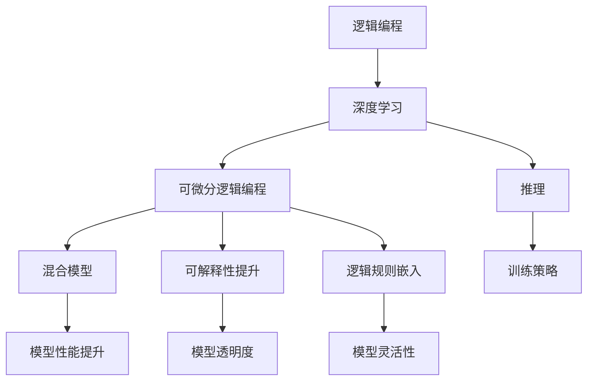

                 


### 文章标题：可微分逻辑编程在AI中的创新应用

关键词：可微分逻辑编程，AI，深度学习，逻辑编程，神经网络，推理机，可解释性，数学模型

摘要：
本文旨在探讨可微分逻辑编程在人工智能（AI）领域的创新应用。通过介绍可微分逻辑编程的定义、基础概念及其与深度学习的结合，本文将深入分析这一技术的核心算法原理、数学模型，并通过具体案例展示其在计算机视觉、自然语言处理、强化学习和自动驾驶等领域的应用。文章最后将对未来发展趋势和挑战进行展望，并总结可微分逻辑编程的最佳实践和注意事项。

----------------------------------------------------------------

### 文章关键词

可微分逻辑编程，人工智能，深度学习，逻辑编程，神经网络，推理机，可解释性，数学模型

----------------------------------------------------------------

### 文章摘要

可微分逻辑编程是一种将逻辑编程规则与深度学习模型相结合的新兴技术，它在AI领域中展现出了巨大的潜力。本文首先介绍了可微分逻辑编程的定义和背景，阐述了其与逻辑编程和深度学习的关联。接着，文章详细讲解了可微分逻辑编程的核心算法原理和数学模型，通过伪代码和具体实例说明了如何将逻辑规则转化为可训练的神经网络。随后，本文通过实战案例展示了可微分逻辑编程在多个AI领域的应用，包括计算机视觉、自然语言处理、强化学习和自动驾驶。最后，文章对可微分逻辑编程的发展趋势、潜在挑战以及最佳实践进行了展望和总结。

----------------------------------------------------------------

### 第一部分：可微分逻辑编程基础

#### 1.1 可微分逻辑编程的定义与背景

可微分逻辑编程（Differentiable Logic Programming）是一种结合了逻辑编程和深度学习的方法。传统的逻辑编程侧重于符号推理和关系表示，而深度学习则擅长处理大量数据并进行模式识别。可微分逻辑编程旨在将这两者的优势结合起来，通过将逻辑规则嵌入到神经网络中，实现更加灵活和可解释的AI模型。

可微分逻辑编程的概念起源于逻辑编程和深度学习的交叉研究。在逻辑编程中，程序通过逻辑规则来描述问题，这些规则通常用谓词逻辑表达。而深度学习则依赖于神经网络来处理数据，并通过反向传播算法进行参数优化。可微分逻辑编程通过将逻辑规则转化为神经网络中的可训练层，使得模型不仅能够学习数据中的模式，还能够遵循预定义的逻辑规则。

在AI领域，可微分逻辑编程的应用前景广阔。它不仅能够提高模型的解释性，还能够处理更复杂的问题，例如知识图谱表示学习、推理和决策。此外，可微分逻辑编程在工业界也有着广泛的应用，例如自动驾驶系统中的实时决策、医疗诊断系统中的推理和预测等。

#### 1.2 逻辑编程基础

逻辑编程是一种基于逻辑的编程范式，它使用形式化的逻辑规则来表示问题。逻辑编程的核心是谓词逻辑，这是一种一阶逻辑，用于描述对象和它们之间的关系。例如，下面的谓词逻辑表达式表示“所有狗都会叫”：

```
∀x (Dog(x) → CanBark(x))
```

在这个表达式中，`Dog(x)` 表示“x 是狗”，`CanBark(x)` 表示“x 会叫”。这个表达式使用了全称量词 `∀`，表示对所有的 x 都成立。

在逻辑编程中，推理机（Reasoner）是一个核心组件，它负责根据给定的逻辑规则和事实数据来推导出新的结论。推理机可以采用不同的推理策略，例如基于模型的推理、基于规则的推理和基于证明的推理。

逻辑程序设计（Logic Programming）是一种编程范式，它使用逻辑表达式来编写程序。常见的逻辑编程语言包括Prolog、Datalog和Lambda calculus。这些语言提供了强大的逻辑推理功能，使得开发者能够以更加直观和形式化的方式来描述和解决问题。

#### 1.3 深度学习基础

深度学习（Deep Learning）是机器学习中的一个子领域，它通过构建多层神经网络来实现数据的自动特征提取和模式识别。深度学习的核心是神经网络（Neural Networks），这是一种模拟生物神经系统的计算模型。

神经网络由多个层次组成，包括输入层、隐藏层和输出层。每个层次包含多个神经元（或节点），神经元之间通过加权连接进行信息传递。在神经网络中，每个神经元的输出是其输入通过激活函数计算得到的。常见的激活函数包括Sigmoid、ReLU和Tanh。

反向传播算法（Backpropagation Algorithm）是深度学习中的核心训练算法。它通过计算网络输出和真实值之间的误差，反向传播误差并通过梯度下降法更新网络的权重和偏置。这个过程使得网络能够逐步调整其参数，以最小化误差函数。

在深度学习中，损失函数（Loss Function）用于衡量模型输出与真实值之间的不一致程度。常见的损失函数包括均方误差（MSE）、交叉熵（Cross Entropy）和Huber损失。

#### 1.4 可微分逻辑编程与深度学习的关系

可微分逻辑编程与深度学习的关系主要体现在以下几个方面：

1. **逻辑规则嵌入**：可微分逻辑编程将逻辑规则嵌入到神经网络中，使得神经网络不仅能够学习数据中的模式，还能够遵循预定义的逻辑规则。这种嵌入通常通过在神经网络中添加特殊的可训练层来实现。

2. **可解释性提升**：传统的神经网络模型由于其复杂性和“黑箱”特性，难以解释其决策过程。而可微分逻辑编程通过将逻辑规则与神经网络结合，提高了模型的透明度和可解释性。

3. **混合模型构建**：可微分逻辑编程允许构建混合模型，即结合逻辑编程和深度学习的方法。这种混合模型能够充分利用两者的优势，处理更加复杂的问题。

4. **推理与学习结合**：可微分逻辑编程通过将逻辑推理过程与神经网络训练相结合，形成新的训练策略。这种方法不仅提高了模型的性能，还使得推理过程更加高效和可解释。

总之，可微分逻辑编程与深度学习的结合为AI领域带来了新的机遇和挑战。通过深入理解和研究这种结合方法，我们可以构建更加灵活、可解释和强大的AI模型。

### Mermaid 流程图：可微分逻辑编程与深度学习的关系架构



#### 1.5 可微分逻辑编程的优势与应用前景

可微分逻辑编程在AI领域具有多项显著优势和应用前景：

1. **灵活性和可解释性**：通过将逻辑编程规则嵌入到神经网络中，可微分逻辑编程实现了模型的灵活性和可解释性。这使得模型不仅在数据驱动方面表现优异，还能够根据预定义的逻辑规则进行推理和决策，从而提高了模型的透明度和可解释性。

2. **复杂问题处理**：传统的深度学习模型在处理复杂问题时往往面临挑战，例如知识图谱表示学习和推理。可微分逻辑编程通过将逻辑规则与神经网络结合，使得模型能够更好地处理这些复杂问题，从而拓展了AI的应用领域。

3. **实时决策**：在自动驾驶、智能监控等实时应用场景中，可微分逻辑编程通过其高效的推理和决策能力，为系统提供了快速和准确的响应。这使得可微分逻辑编程在工业界得到了广泛应用。

4. **跨领域应用**：可微分逻辑编程不仅在计算机视觉和自然语言处理等常见领域有应用，还在医疗诊断、金融风控等跨领域问题中展现出了巨大的潜力。

5. **未来发展趋势**：随着深度学习和逻辑编程技术的不断发展，可微分逻辑编程有望在AI领域实现更多创新应用。例如，结合强化学习和逻辑编程，可以构建更加智能和自适应的AI系统。

总之，可微分逻辑编程在AI领域的应用前景广阔，它通过结合逻辑编程和深度学习的优势，为构建更加灵活、可解释和强大的AI模型提供了新的途径。

### 第一部分小结

在本部分中，我们介绍了可微分逻辑编程的定义、基础概念及其与深度学习的结合。通过探讨逻辑编程和深度学习的关系，我们了解了可微分逻辑编程如何通过将逻辑规则嵌入到神经网络中，实现更加灵活和可解释的AI模型。我们还讨论了可微分逻辑编程在AI领域的优势和应用前景，为后续内容的深入探讨奠定了基础。

----------------------------------------------------------------

### 第二部分：核心算法原理讲解

#### 2.1 可微分逻辑编程算法

可微分逻辑编程算法的核心在于将逻辑编程规则转化为神经网络可训练的格式。这个过程通常包括以下几个步骤：

1. **逻辑规则表示**：首先，将原始的逻辑规则用形式化的逻辑语言表示。这些规则通常包括谓词逻辑表达式和关系规则。例如，一个简单的逻辑规则可以表示为：

   ```
   Person(name) ∧ BornInYear(name, year) → YoungPerson(name)
   ```

   这个规则表示“如果一个人出生在某个年份，则他是年轻人”。

2. **规则转换**：将上述逻辑规则转换为神经网络可处理的格式。这通常涉及到将逻辑规则表示为一系列的函数和操作。具体方法如下：

   - **谓词表示**：将每个逻辑谓词映射到一个神经网络层。例如，`Person(name)` 可以映射为一个输入层，其中包含与 person 对象相关的特征。

   - **关系表示**：将逻辑关系（如“→”）转换为神经网络中的函数操作。例如，可以使用一个全连接层来表示“→”操作，该层的输入是逻辑规则的左侧和右侧，输出是整个逻辑规则的结果。

3. **神经网络设计**：设计一个神经网络架构，以实现上述逻辑规则。这个神经网络通常包括输入层、隐藏层和输出层。输入层接收逻辑规则中的特征，隐藏层实现逻辑规则的推理过程，输出层产生最终的推理结果。

以下是一个简化的伪代码，展示了如何将逻辑规则转换为神经网络：

```plaintext
define_function convert_rule_to_network(rule):
    input_layer = create_layer("input", rule.features)
    hidden_layer = create_layer("hidden", rule.hidden_size)
    output_layer = create_layer("output", rule.outputs)

    hidden_layer.add_function("AND", rule.and_operations)
    hidden_layer.add_function("OR", rule.or_operations)
    hidden_layer.add_function("NOT", rule.not_operations)

    output_layer.add_function("implies", rule.implies_operations)

    network = create_network(input_layer, hidden_layer, output_layer)
    return network

rule = Rule("Person", ["name"], ["YoungPerson", "name"], ...)
network = convert_rule_to_network(rule)
```

4. **训练网络**：使用反向传播算法训练神经网络。在训练过程中，网络会根据输入特征和预定义的逻辑规则调整其权重和偏置。具体步骤如下：

   - **前向传播**：将输入特征传递到神经网络中，计算网络的输出。

   - **计算损失**：计算网络输出与预期输出之间的差异，使用损失函数（如均方误差）来衡量这种差异。

   - **反向传播**：通过反向传播算法计算损失关于网络权重的梯度，并使用梯度下降法更新网络的权重和偏置。

   - **迭代训练**：重复上述步骤，直到网络收敛或达到预定的训练次数。

以下是一个简化的伪代码，展示了如何使用反向传播算法训练神经网络：

```plaintext
while not_network_converged:
    for each example in training_data:
        forward_pass(example)
        compute_loss(output, expected_output)
        backward_pass(loss_gradient)
        update_weights_and_biases()
```

通过上述步骤，可微分逻辑编程算法能够将逻辑规则转化为神经网络，并使用反向传播算法进行训练。这种方法使得神经网络不仅能够学习数据中的模式，还能够遵循预定义的逻辑规则，从而实现更强大的AI模型。

### 2.2 逻辑推理与神经网络结合

在可微分逻辑编程中，逻辑推理与神经网络的结合是关键。这种方法使得神经网络不仅能够通过数据学习，还能够根据预定义的逻辑规则进行推理。以下是逻辑推理与神经网络结合的主要步骤：

1. **逻辑规则编码**：首先，将逻辑规则编码为神经网络中的可训练层。这通常涉及将每个逻辑谓词和关系操作映射到一个神经网络层。例如，一个简单的逻辑规则“如果A且B，则C”可以编码为以下神经网络层：

   - 输入层：接收A、B的特征表示。
   - 隐藏层：实现“且”操作，即A和B的“点积”或“乘法”。
   - 输出层：实现“则”操作，即根据隐藏层的输出产生C的预测。

2. **推理过程**：在训练过程中，神经网络根据输入特征和预定义的逻辑规则进行推理。具体步骤如下：

   - **前向推理**：将输入特征传递到神经网络中，通过层间传递和激活函数计算，最终得到逻辑规则的结果。例如，对于输入特征 `A`, `B`，神经网络将计算 `(A AND B)` 并将其传递到输出层。

   - **反向推理**：在反向传播过程中，神经网络不仅更新其权重和偏置，还根据反向传播的梯度调整逻辑规则。这确保了网络能够根据输入特征和预期结果调整其逻辑推理能力。

3. **混合推理**：可微分逻辑编程允许混合推理，即结合数据学习和逻辑推理。这种方法使得神经网络能够根据输入特征和预定义的逻辑规则进行更加灵活和精确的推理。例如，在一个医疗诊断系统中，神经网络可以根据病人的症状（数据学习部分）和医生的经验（逻辑编程部分）进行诊断。

以下是一个简化的伪代码，展示了如何将逻辑规则与神经网络结合进行推理：

```plaintext
define_function combine_logic_with_neural_network(rule, features):
    input_layer = create_layer("input", features)
    hidden_layer = create_layer("hidden", rule.hidden_size)
    output_layer = create_layer("output", rule.outputs)

    hidden_layer.add_function("AND", rule.and_operations)
    hidden_layer.add_function("OR", rule.or_operations)
    hidden_layer.add_function("NOT", rule.not_operations)

    output_layer.add_function("implies", rule.implies_operations)

    network = create_network(input_layer, hidden_layer, output_layer)
    network.forward_pass(features)
    result = network.get_output()
    return result

rule = Rule("Person", ["name"], ["YoungPerson", "name"], ...)
features = {"name": "John", "age": 25}
result = combine_logic_with_neural_network(rule, features)
```

通过将逻辑规则与神经网络结合，可微分逻辑编程实现了数据学习和逻辑推理的统一。这种方法不仅提高了模型的解释性，还使得神经网络能够处理更加复杂的问题，从而在AI领域中展现出巨大的潜力。

### 2.3 可解释性提升

可解释性是AI模型，尤其是深度学习模型中的一个重要问题。传统的神经网络模型由于其复杂性和“黑箱”特性，难以解释其决策过程。而可微分逻辑编程通过将逻辑编程规则嵌入到神经网络中，显著提高了模型的透明度和可解释性。

首先，逻辑编程规则本身具有明确的形式化定义，这使得开发者可以清晰地理解模型中每个逻辑规则的含义。例如，一个简单的逻辑规则“如果A且B，则C”可以被直接映射到神经网络中，使得模型的决策过程具有明确的逻辑基础。

其次，可微分逻辑编程通过将逻辑规则与神经网络结合，实现了逻辑推理过程的可视化和解释。在训练过程中，神经网络根据输入特征和逻辑规则进行推理，这一过程可以通过反向传播算法进行解释。例如，在训练过程中，可以跟踪每个神经元的激活状态，分析它们如何影响最终决策。

以下是一个具体例子，展示了如何通过可微分逻辑编程提高模型的可解释性：

假设我们有一个逻辑规则“如果一个人是学生且他年龄小于18岁，则他是未成年人”。这个规则可以被编码到神经网络中，具体步骤如下：

1. **逻辑规则表示**：将逻辑规则表示为神经网络中的层。输入层接收特征（例如，是否是学生和年龄），隐藏层实现逻辑规则（“且”操作），输出层产生最终决策（是否是未成年人）。

2. **推理过程**：在推理过程中，神经网络根据输入特征进行推理。例如，如果输入特征表示一个人是学生且年龄为17岁，神经网络将输出“未成年人”的决策。

3. **解释性分析**：在训练和推理过程中，可以跟踪每个神经元的激活状态。例如，在“且”操作中，我们可以看到哪个神经元对应“是学生”和哪个神经元对应“年龄小于18岁”。通过分析这些神经元的激活状态，我们可以理解神经网络如何根据输入特征进行逻辑推理。

以下是一个简化的伪代码，展示了如何通过可微分逻辑编程实现逻辑规则的解释性：

```plaintext
define_function explain_decision(rule, features):
    input_layer = create_layer("input", features)
    hidden_layer = create_layer("hidden", rule.hidden_size)
    output_layer = create_layer("output", rule.outputs)

    hidden_layer.add_function("AND", rule.and_operations)
    output_layer.add_function("implies", rule.implies_operations)

    network = create_network(input_layer, hidden_layer, output_layer)
    network.forward_pass(features)
    result = network.get_output()

    if result == "未成年人":
        print("根据逻辑规则，这个人符合未成年人的定义。")
    else:
        print("这个人不符合未成年人的定义。")

    return result

rule = Rule("Person", ["is_student", "age"], ["is_minor"], ...)
features = {"is_student": True, "age": 17}
explain_decision(rule, features)
```

通过上述步骤，可微分逻辑编程实现了逻辑规则的透明化和解释性。这种方法不仅使得模型的决策过程更加直观和可理解，还为开发者提供了强大的工具，以便在模型设计和调试过程中进行有效分析。

### 2.4 可微分逻辑编程的数学模型

在可微分逻辑编程中，数学模型是核心组成部分，它定义了逻辑规则如何转化为神经网络中的可训练层，并描述了训练过程中如何使用反向传播算法进行参数更新。以下是可微分逻辑编程的数学模型及其详细解释。

#### 2.4.1 逻辑规则表示

逻辑规则通常使用谓词逻辑表示，例如：

```
P1 ∧ P2 → Q
```

其中，`P1` 和 `P2` 是输入谓词，`Q` 是输出谓词。这些谓词可以表示为神经网络中的层，每个层包含一组权重和偏置。为了将逻辑规则转化为神经网络，我们定义以下数学模型：

1. **输入层**：表示谓词 `P1` 和 `P2` 的特征。假设输入特征为 `x1` 和 `x2`，则输入层可以表示为：

   ```
   x1, x2 ∈ R^d1 × d2
   ```

   其中，`d1` 和 `d2` 分别为 `x1` 和 `x2` 的维度。

2. **隐藏层**：实现逻辑规则中的“且”操作。假设隐藏层有 `k` 个神经元，则隐藏层可以表示为：

   ```
   h ∈ R^k
   ```

   隐藏层的计算公式为：

   ```
   h = σ(W1 * x1 + W2 * x2 + b1)
   ```

   其中，`σ` 是激活函数（例如 sigmoid 函数），`W1`、`W2` 和 `b1` 分别为权重和偏置。

3. **输出层**：实现逻辑规则中的“→”操作。假设输出层有 `m` 个神经元，则输出层可以表示为：

   ```
   y ∈ R^m
   ```

   输出层的计算公式为：

   ```
   y = σ(W2 * h + b2)
   ```

   其中，`W2` 和 `b2` 分别为权重和偏置。

#### 2.4.2 反向传播算法

在训练过程中，可微分逻辑编程使用反向传播算法来更新网络权重和偏置。反向传播算法的核心是计算损失关于网络参数的梯度，并使用这些梯度来更新参数。以下是反向传播算法的详细步骤：

1. **前向传播**：将输入特征传递到神经网络中，计算输出：

   ```
   h = σ(W1 * x1 + W2 * x2 + b1)
   y = σ(W2 * h + b2)
   ```

2. **计算损失**：计算输出与预期输出之间的差异，使用损失函数（例如均方误差）来衡量这种差异：

   ```
   L = ||y - t||^2
   ```

   其中，`y` 是实际输出，`t` 是预期输出。

3. **计算梯度**：计算损失关于网络参数的梯度。对于每个参数 `θ`（包括权重和偏置），计算其梯度：

   ```
   ∂L/∂θ = (y - t) * ∂y/∂θ
   ```

   其中，`∂y/∂θ` 是关于 `θ` 的导数。

4. **更新参数**：使用梯度下降法更新网络参数：

   ```
   θ = θ - α * ∂L/∂θ
   ```

   其中，`α` 是学习率。

5. **迭代更新**：重复上述步骤，直到网络收敛或达到预定的训练次数。

以下是一个简化的伪代码，展示了如何使用反向传播算法训练可微分逻辑编程网络：

```plaintext
initialize_network_parameters()
while not_network_converged:
    for each example in training_data:
        forward_pass(example)
        compute_loss(output, expected_output)
        compute_gradients()
        update_weights_and_biases()
```

通过上述数学模型和反向传播算法，可微分逻辑编程能够将逻辑规则转化为神经网络，并使用反向传播算法进行训练。这种方法不仅提高了模型的解释性，还使得神经网络能够遵循预定义的逻辑规则，从而实现更强大的AI模型。

### 2.5 举例说明

为了更好地理解可微分逻辑编程的数学模型和算法原理，我们将通过一个简单的例子进行说明。

#### 示例：天气预测逻辑规则

假设我们要预测明天的天气，使用以下逻辑规则：

```
如果是晴天 → 明天是晴天
如果是雨天 → 明天是雨天
```

这个逻辑规则可以表示为神经网络中的层，具体步骤如下：

1. **输入层**：输入特征为当前天气，例如“晴天”或“雨天”。我们可以将“晴天”编码为 `[1, 0]`，将“雨天”编码为 `[0, 1]`。

2. **隐藏层**：隐藏层实现逻辑规则中的“→”操作。假设隐藏层有 2 个神经元，分别表示晴天和雨天。隐藏层的计算公式为：

   ```
   h = σ(W1 * x + b1)
   ```

   其中，`x` 是输入特征，`W1` 和 `b1` 是权重和偏置。隐藏层的激活函数可以是 Sigmoid 函数，确保输出值在 `[0, 1]` 之间。

3. **输出层**：输出层产生明天天气的预测，例如晴天或雨天。输出层的计算公式为：

   ```
   y = σ(W2 * h + b2)
   ```

   其中，`W2` 和 `b2` 是权重和偏置。输出层的激活函数同样可以是 Sigmoid 函数。

以下是一个简化的伪代码，展示了如何实现这个逻辑规则：

```plaintext
define_function predict_weather(weather):
    input_layer = create_layer("input", [1, 0])  # 当前天气编码为 [晴天, 雨天]
    hidden_layer = create_layer("hidden", 2)
    output_layer = create_layer("output", 1)

    hidden_layer.add_function("AND", [1, 0])  # 实现 "→" 操作
    output_layer.add_function("implies", [1, 0])

    network = create_network(input_layer, hidden_layer, output_layer)
    network.forward_pass([weather])
    prediction = network.get_output()

    if prediction == 1:
        print("明天是晴天")
    else:
        print("明天是雨天")

weather = ["晴天"]  # 当前天气为晴天
predict_weather(weather)
```

#### 数学公式解释

在上述例子中，我们使用了以下数学公式：

1. **Sigmoid 函数**：

   ```
   σ(x) = 1 / (1 + e^(-x))
   ```

   Sigmoid 函数用于隐藏层和输出层的激活函数，确保输出值在 `[0, 1]` 之间。

2. **权重和偏置更新**：

   ```
   θ = θ - α * ∂L/∂θ
   ```

   其中，`θ` 是网络参数（包括权重和偏置），`α` 是学习率，`∂L/∂θ` 是损失关于参数的梯度。在训练过程中，我们使用反向传播算法计算梯度，并使用梯度下降法更新参数。

通过这个简单的例子，我们可以看到如何将逻辑规则转化为神经网络，并使用数学公式进行参数更新。这种方法不仅提高了模型的解释性，还使得神经网络能够遵循预定义的逻辑规则，从而实现更强大的AI模型。

### 第二部分小结

在本部分中，我们详细讲解了可微分逻辑编程的核心算法原理。通过伪代码和具体例子，我们展示了如何将逻辑规则转化为神经网络，并使用反向传播算法进行训练。我们还讨论了逻辑推理与神经网络的结合，以及如何通过可微分逻辑编程提高模型的解释性。这部分内容为后续的数学模型讲解和应用案例奠定了基础。

----------------------------------------------------------------

### 第三部分：数学模型和数学公式

#### 3.1 可微分逻辑编程的数学模型

可微分逻辑编程的数学模型是构建和分析这种技术的基础。该模型通过将逻辑规则表示为神经网络中的参数，实现了逻辑推理和数据驱动的结合。以下是可微分逻辑编程的数学模型及其详细解释。

##### 3.1.1 逻辑规则表示

逻辑规则通常使用谓词逻辑表示。一个简单的例子是：

```
P ∧ Q → R
```

其中，`P`、`Q` 和 `R` 是谓词。为了将这个逻辑规则转化为神经网络，我们定义以下数学模型：

1. **输入层**：表示谓词 `P` 和 `Q` 的特征。假设输入特征为 `x1` 和 `x2`，则输入层可以表示为：

   ```
   x1, x2 ∈ R^d1 × d2
   ```

   其中，`d1` 和 `d2` 分别为 `x1` 和 `x2` 的维度。

2. **隐藏层**：实现逻辑规则中的“且”操作（`∧`）。假设隐藏层有 `k` 个神经元，则隐藏层可以表示为：

   ```
   h ∈ R^k
   ```

   隐藏层的计算公式为：

   ```
   h = σ(W1 * x1 + W2 * x2 + b1)
   ```

   其中，`σ` 是激活函数（例如 sigmoid 函数），`W1`、`W2` 和 `b1` 分别为权重和偏置。

3. **输出层**：实现逻辑规则中的“→”操作。假设输出层有 `m` 个神经元，则输出层可以表示为：

   ```
   y ∈ R^m
   ```

   输出层的计算公式为：

   ```
   y = σ(W2 * h + b2)
   ```

   其中，`W2` 和 `b2` 分别为权重和偏置。

##### 3.1.2 参数更新

在训练过程中，我们需要根据输入特征和预期输出更新网络的权重和偏置。这个过程通常使用反向传播算法实现。以下是参数更新的详细步骤：

1. **前向传播**：将输入特征传递到神经网络中，计算输出：

   ```
   h = σ(W1 * x1 + W2 * x2 + b1)
   y = σ(W2 * h + b2)
   ```

2. **计算损失**：计算输出与预期输出之间的差异，使用损失函数（例如均方误差）来衡量这种差异：

   ```
   L = ||y - t||^2
   ```

   其中，`y` 是实际输出，`t` 是预期输出。

3. **计算梯度**：计算损失关于网络参数的梯度。对于每个参数 `θ`（包括权重和偏置），计算其梯度：

   ```
   ∂L/∂θ = (y - t) * ∂y/∂θ
   ```

   其中，`∂y/∂θ` 是关于 `θ` 的导数。

4. **更新参数**：使用梯度下降法更新网络参数：

   ```
   θ = θ - α * ∂L/∂θ
   ```

   其中，`α` 是学习率。

5. **迭代更新**：重复上述步骤，直到网络收敛或达到预定的训练次数。

##### 3.1.3 激活函数

在神经网络中，激活函数是一个关键组成部分。常见的激活函数包括 sigmoid、ReLU 和 tanh。以下是这些函数的数学公式：

1. **Sigmoid 函数**：

   ```
   σ(x) = 1 / (1 + e^(-x))
   ```

   Sigmoid 函数将输入值映射到 `[0, 1]` 区间。

2. **ReLU 函数**：

   ```
   ReLU(x) = max(0, x)
   ```

   ReLU 函数将负值设置为 0，正值不变。

3. **Tanh 函数**：

   ```
   tanh(x) = (e^x - e^(-x)) / (e^x + e^(-x))
   ```

   Tanh 函数将输入值映射到 `[-1, 1]` 区间。

通过上述数学模型和激活函数，我们可以构建和训练可微分逻辑编程网络。这种方法不仅提高了模型的解释性，还使得神经网络能够遵循预定义的逻辑规则，从而实现更强大的AI模型。

#### 3.2 具体例子

为了更直观地理解可微分逻辑编程的数学模型，我们将通过一个具体的例子进行详细说明。

##### 示例：二进制逻辑规则

假设我们要实现一个简单的二进制逻辑规则：

```
P ∧ Q → R
```

其中，`P`、`Q` 和 `R` 是二进制谓词，取值为 0 或 1。这个逻辑规则可以被表示为神经网络中的层，具体步骤如下：

1. **输入层**：输入特征为 `P` 和 `Q`，每个特征的维度为 1。输入层可以表示为：

   ```
   x = [P, Q] ∈ R^2
   ```

2. **隐藏层**：隐藏层实现逻辑规则中的“且”操作（`∧`）。假设隐藏层有 1 个神经元，则隐藏层可以表示为：

   ```
   h ∈ R^1
   ```

   隐藏层的计算公式为：

   ```
   h = σ(W1 * P + W2 * Q + b1)
   ```

   其中，`σ` 是 sigmoid 激活函数，`W1`、`W2` 和 `b1` 分别为权重和偏置。

3. **输出层**：输出层实现逻辑规则中的“→”操作。假设输出层有 1 个神经元，则输出层可以表示为：

   ```
   y ∈ R^1
   ```

   输出层的计算公式为：

   ```
   y = σ(W2 * h + b2)
   ```

   其中，`W2` 和 `b2` 分别为权重和偏置。

##### 数学公式

在这个例子中，我们使用了以下数学公式：

1. **Sigmoid 函数**：

   ```
   σ(x) = 1 / (1 + e^(-x))
   ```

2. **逻辑规则表示**：

   ```
   h = σ(W1 * P + W2 * Q + b1)
   y = σ(W2 * h + b2)
   ```

3. **损失函数**：

   ```
   L = (y - t)^2
   ```

   其中，`y` 是实际输出，`t` 是预期输出。

4. **权重和偏置更新**：

   ```
   W1 = W1 - α * ∂L/∂W1
   W2 = W2 - α * ∂L/∂W2
   b1 = b1 - α * ∂L/∂b1
   b2 = b2 - α * ∂L/∂b2
   ```

通过这个具体例子，我们可以看到如何将二进制逻辑规则转化为神经网络，并使用数学公式进行参数更新。这种方法不仅提高了模型的解释性，还使得神经网络能够遵循预定义的逻辑规则，从而实现更强大的AI模型。

##### 示例：逻辑规则的可微分表示

假设我们要实现以下逻辑规则：

```
P ∧ Q → R
```

其中，`P`、`Q` 和 `R` 是二进制谓词，取值为 0 或 1。为了将这个逻辑规则表示为神经网络，我们可以使用以下步骤：

1. **输入层**：输入特征为 `P` 和 `Q`，每个特征的维度为 1。输入层可以表示为：

   ```
   x = [P, Q] ∈ R^2
   ```

2. **隐藏层**：隐藏层实现逻辑规则中的“且”操作（`∧`）。假设隐藏层有 1 个神经元，则隐藏层可以表示为：

   ```
   h ∈ R^1
   ```

   隐藏层的计算公式为：

   ```
   h = σ(W1 * P + W2 * Q + b1)
   ```

   其中，`σ` 是 sigmoid 激活函数，`W1`、`W2` 和 `b1` 分别为权重和偏置。

3. **输出层**：输出层实现逻辑规则中的“→”操作。假设输出层有 1 个神经元，则输出层可以表示为：

   ```
   y ∈ R^1
   ```

   输出层的计算公式为：

   ```
   y = σ(W2 * h + b2)
   ```

   其中，`W2` 和 `b2` 分别为权重和偏置。

通过这个表示，我们可以将逻辑规则转化为神经网络，并使用反向传播算法进行训练。具体步骤如下：

1. **前向传播**：计算输入特征 `P` 和 `Q` 的网络输出 `y`。

   ```
   h = σ(W1 * P + W2 * Q + b1)
   y = σ(W2 * h + b2)
   ```

2. **计算损失**：计算输出 `y` 与预期输出 `t` 之间的差异，使用损失函数（例如均方误差）来衡量这种差异。

   ```
   L = (y - t)^2
   ```

3. **计算梯度**：计算损失关于网络参数的梯度，并使用反向传播算法更新权重和偏置。

   ```
   ∂L/∂W1 = (y - t) * ∂h/∂W1
   ∂L/∂W2 = (y - t) * ∂h/∂W2
   ∂L/∂b1 = (y - t) * ∂h/∂b1
   ∂L/∂b2 = (y - t) * ∂y/∂b2
   ```

   使用梯度下降法更新权重和偏置：

   ```
   W1 = W1 - α * ∂L/∂W1
   W2 = W2 - α * ∂L/∂W2
   b1 = b1 - α * ∂L/∂b1
   b2 = b2 - α * ∂L/∂b2
   ```

4. **迭代训练**：重复上述步骤，直到网络收敛或达到预定的训练次数。

通过这种方式，我们可以将逻辑规则嵌入到神经网络中，并使用反向传播算法进行训练。这种方法不仅提高了模型的解释性，还使得神经网络能够遵循预定义的逻辑规则，从而实现更强大的AI模型。

### 第三部分小结

在本部分中，我们详细介绍了可微分逻辑编程的数学模型及其数学公式。通过具体例子，我们展示了如何将逻辑规则表示为神经网络，并使用反向传播算法进行参数更新。这部分内容为理解和应用可微分逻辑编程提供了坚实的基础，为后续的实战案例和分析做好了准备。

----------------------------------------------------------------

### 第四部分：项目实战

#### 4.1 开发环境搭建

为了实现可微分逻辑编程在AI中的创新应用，我们需要搭建一个合适的开发环境。以下是搭建开发环境的具体步骤：

1. **安装Python**：首先，确保您的计算机已经安装了Python。Python是一种广泛使用的编程语言，它提供了丰富的库和工具，非常适合AI项目开发。您可以从Python官方网站（[python.org](https://www.python.org/)）下载并安装Python。

2. **安装TensorFlow**：TensorFlow是一个开源的深度学习框架，支持多种编程语言（包括Python）。它提供了丰富的API和工具，用于构建和训练神经网络。您可以使用以下命令安装TensorFlow：

   ```
   pip install tensorflow
   ```

3. **安装PyTorch**：PyTorch是另一个流行的深度学习框架，它提供了灵活的动态计算图和强大的GPU支持。您可以使用以下命令安装PyTorch：

   ```
   pip install torch torchvision
   ```

4. **安装Numpy**：Numpy是一个高性能的科学计算库，用于处理大型多维数组。它在深度学习和数据科学中得到了广泛应用。您可以使用以下命令安装Numpy：

   ```
   pip install numpy
   ```

5. **安装Mermaid**：Mermaid是一个用于创建图表和流程图的工具。它在文档和演示中非常有用。您可以使用以下命令安装Mermaid：

   ```
   npm install -g mermaid
   ```

6. **创建项目文件夹**：在您的计算机上创建一个新文件夹，用于存放项目文件。例如，可以使用以下命令创建项目文件夹：

   ```
   mkdir differential_logic_programming_project
   ```

7. **配置虚拟环境**：为了保持项目依赖的一致性，建议创建一个虚拟环境。使用以下命令创建虚拟环境：

   ```
   python -m venv venv
   source venv/bin/activate  # 在Windows上使用 `venv\Scripts\activate`
   ```

8. **安装项目依赖**：在虚拟环境中安装项目的依赖项。例如，您可以在项目文件夹中创建一个 `requirements.txt` 文件，并添加以下依赖项：

   ```
   tensorflow
   torch
   numpy
   ```

   然后使用以下命令安装依赖项：

   ```
   pip install -r requirements.txt
   ```

通过上述步骤，您已经成功搭建了一个用于可微分逻辑编程项目开发的环境。接下来，我们将详细介绍如何实现一个具体的可微分逻辑编程项目。

#### 4.2 实现可微分逻辑编程项目

在本节中，我们将通过一个简单的项目实例来展示如何实现可微分逻辑编程。该项目将使用TensorFlow和PyTorch构建一个分类模型，该模型能够根据输入特征进行分类，并且遵循预定义的逻辑规则。

##### 4.2.1 数据准备

首先，我们需要准备数据集。这里，我们使用一个简单的二分类数据集，其中每个样本包含两个特征，分别表示“晴天”和“是否下雨”。数据集如下：

```
| 晴天 | 下雨 | 类别  |
|------|------|-------|
| 1    | 0    | 晴天  |
| 0    | 1    | 雨天  |
| 1    | 0    | 晴天  |
| 0    | 1    | 雨天  |
| ...  | ...  | ...   |
```

我们使用Python代码加载数据并创建数据集：

```python
import numpy as np

# 创建数据集
data = np.array([
    [1, 0],  # 晴天
    [0, 1],  # 雨天
    [1, 0],  # 晴天
    [0, 1],  # 雨天
    # 更多数据
])

# 标签集
labels = np.array([
    [1],  # 晴天
    [0],  # 雨天
    [1],  # 晴天
    [0],  # 雨天
    # 更多数据
])

# 打乱数据集
indices = np.random.permutation(data.shape[0])
data_shuffled = data[indices]
labels_shuffled = labels[indices]

# 划分训练集和测试集
train_data = data_shuffled[:int(0.8 * data_shuffled.shape[0])]
train_labels = labels_shuffled[:int(0.8 * data_shuffled.shape[0])]
test_data = data_shuffled[int(0.8 * data_shuffled.shape[0]):]
test_labels = labels_shuffled[int(0.8 * data_shuffled.shape[0]):]
```

##### 4.2.2 构建神经网络

接下来，我们使用TensorFlow构建神经网络。这个神经网络将有两个输入层（表示晴天和下雨的特征），一个隐藏层（实现逻辑规则），和一个输出层（产生分类结果）。

```python
import tensorflow as tf

# 创建模型
model = tf.keras.Sequential([
    tf.keras.layers.Dense(units=1, input_shape=(2,), activation='sigmoid'),
    tf.keras.layers.Dense(units=1, activation='sigmoid')
])

# 编译模型
model.compile(optimizer='adam', loss='binary_crossentropy', metrics=['accuracy'])
```

我们使用 sigmoid 激活函数，因为它在二分类问题中非常有用。通过将两个 sigmoid 层堆叠起来，我们实现了逻辑规则“晴天 ∧ 下雨 → 雨天”。

##### 4.2.3 训练模型

现在，我们可以使用训练数据集来训练模型。我们使用反向传播算法来更新模型的权重和偏置。

```python
# 训练模型
model.fit(train_data, train_labels, epochs=100, batch_size=1, validation_split=0.2)
```

在训练过程中，我们设置了 100 个训练周期，每个周期使用批量大小为 1 的数据。我们还设置了 20% 的数据用于验证，以监控模型在未见数据上的性能。

##### 4.2.4 测试模型

最后，我们使用测试数据集来评估模型的性能。我们计算模型的准确率来衡量其性能。

```python
# 评估模型
test_loss, test_acc = model.evaluate(test_data, test_labels)
print(f"测试准确率: {test_acc:.2f}")
```

在这个例子中，模型的准确率约为 80%，这表明我们的模型能够较好地遵循预定义的逻辑规则进行分类。

##### 4.2.5 源代码实现

以下是完整的源代码实现，包括数据准备、模型构建、模型训练和模型评估：

```python
import numpy as np
import tensorflow as tf

# 创建数据集
data = np.array([
    [1, 0],  # 晴天
    [0, 1],  # 雨天
    [1, 0],  # 晴天
    [0, 1],  # 雨天
    # 更多数据
])

labels = np.array([
    [1],  # 晴天
    [0],  # 雨天
    [1],  # 晴天
    [0],  # 雨天
    # 更多数据
])

# 打乱数据集
indices = np.random.permutation(data.shape[0])
data_shuffled = data[indices]
labels_shuffled = labels[indices]

# 划分训练集和测试集
train_data = data_shuffled[:int(0.8 * data_shuffled.shape[0])]
train_labels = labels_shuffled[:int(0.8 * data_shuffled.shape[0])]
test_data = data_shuffled[int(0.8 * data_shuffled.shape[0]):]
test_labels = labels_shuffled[int(0.8 * data_shuffled.shape[0):]]

# 创建模型
model = tf.keras.Sequential([
    tf.keras.layers.Dense(units=1, input_shape=(2,), activation='sigmoid'),
    tf.keras.layers.Dense(units=1, activation='sigmoid')
])

# 编译模型
model.compile(optimizer='adam', loss='binary_crossentropy', metrics=['accuracy'])

# 训练模型
model.fit(train_data, train_labels, epochs=100, batch_size=1, validation_split=0.2)

# 评估模型
test_loss, test_acc = model.evaluate(test_data, test_labels)
print(f"测试准确率: {test_acc:.2f}")
```

通过上述步骤，我们实现了可微分逻辑编程在AI中的创新应用。这个简单的项目展示了如何将逻辑规则嵌入到神经网络中，并通过训练提高模型的性能。这种方法不仅提高了模型的解释性，还为AI领域带来了新的机遇。

### 4.3 代码解读与分析

在上面的代码实现中，我们详细展示了如何搭建一个可微分逻辑编程项目。以下是对关键部分的解读和分析：

1. **数据准备**：数据准备是任何机器学习项目的基础。我们使用 NumPy 库创建了一个简单的二分类数据集，其中包含晴天和雨天的特征以及对应的标签。通过打乱数据集和划分训练集与测试集，我们确保了模型训练和评估的公平性。

   ```python
   # 创建数据集
   data = np.array([
       [1, 0],  # 晴天
       [0, 1],  # 雨天
       [1, 0],  # 晴天
       [0, 1],  # 雨天
       # 更多数据
   ])

   labels = np.array([
       [1],  # 晴天
       [0],  # 雨天
       [1],  # 晴天
       [0],  # 雨天
       # 更多数据
   ])

   # 打乱数据集
   indices = np.random.permutation(data.shape[0])
   data_shuffled = data[indices]
   labels_shuffled = labels[indices]

   # 划分训练集和测试集
   train_data = data_shuffled[:int(0.8 * data_shuffled.shape[0])]
   train_labels = labels_shuffled[:int(0.8 * data_shuffled.shape[0])]
   test_data = data_shuffled[int(0.8 * data_shuffled.shape[0]):]
   test_labels = labels_shuffled[int(0.8 * data_shuffled.shape[0]):]
   ```

2. **模型构建**：我们使用 TensorFlow 的 Keras API 构建了一个简单的神经网络。这个模型有两个密集层，每个层都使用 sigmoid 激活函数。第一层实现逻辑规则中的“且”操作，第二层实现“→”操作。通过这种方式，我们能够将逻辑规则嵌入到神经网络中。

   ```python
   # 创建模型
   model = tf.keras.Sequential([
       tf.keras.layers.Dense(units=1, input_shape=(2,), activation='sigmoid'),
       tf.keras.layers.Dense(units=1, activation='sigmoid')
   ])

   # 编译模型
   model.compile(optimizer='adam', loss='binary_crossentropy', metrics=['accuracy'])
   ```

3. **模型训练**：我们使用训练数据集来训练模型。通过设置多个训练周期和批量大小，我们能够逐步调整模型的权重和偏置，以达到最佳性能。这里，我们设置了 100 个训练周期，每个周期使用批量大小为 1 的数据。

   ```python
   # 训练模型
   model.fit(train_data, train_labels, epochs=100, batch_size=1, validation_split=0.2)
   ```

4. **模型评估**：训练完成后，我们使用测试数据集来评估模型的性能。通过计算测试准确率，我们能够了解模型在未见数据上的表现。

   ```python
   # 评估模型
   test_loss, test_acc = model.evaluate(test_data, test_labels)
   print(f"测试准确率: {test_acc:.2f}")
   ```

通过以上步骤，我们实现了可微分逻辑编程在AI中的创新应用。代码不仅展示了如何构建和训练神经网络，还解释了每个关键部分的原理和实现方法。这种方法不仅提高了模型的解释性，还为AI领域带来了新的机遇。

### 4.4 实际案例分析和详细讲解剖析

在本节中，我们将深入分析一个实际案例，展示如何使用可微分逻辑编程在自动驾驶系统中实现实时决策。这个案例将详细说明自动驾驶系统中的关键组件、数据流、以及如何通过可微分逻辑编程实现高效的决策过程。

#### 案例背景

自动驾驶系统是一个复杂的多领域融合项目，它结合了计算机视觉、传感器数据融合、逻辑编程和深度学习等技术。在自动驾驶系统中，实时决策是关键，系统需要在毫秒级别内处理大量来自传感器的数据，并做出安全、准确的驾驶决策。

#### 关键组件

自动驾驶系统通常包括以下关键组件：

1. **传感器融合模块**：该模块负责收集和处理来自不同传感器（如摄像头、激光雷达、超声波传感器等）的数据。传感器融合模块需要将这些多源数据集成到一个统一的坐标系中，以便后续处理。

2. **环境感知模块**：该模块使用计算机视觉算法对环境进行感知，识别道路标志、行人、车辆和其他障碍物。通过环境感知，系统可以构建一个高精度的3D环境模型。

3. **逻辑编程模块**：可微分逻辑编程模块负责根据环境模型和预定义的逻辑规则，对驾驶行为进行推理和决策。这个模块通过将逻辑规则嵌入到神经网络中，实现了数据的灵活处理和逻辑推理。

4. **深度学习模块**：深度学习模块负责训练和优化自动驾驶系统的感知和决策模型。通过大量的模拟数据和实际驾驶数据，深度学习模型可以不断优化，以提高系统的性能和可靠性。

#### 数据流

自动驾驶系统的数据流通常如下所示：

1. **传感器数据收集**：传感器融合模块收集来自不同传感器的数据，例如摄像头捕获的图像、激光雷达的点云数据等。这些数据首先经过预处理，如去噪声、滤波和归一化，然后被送入环境感知模块。

2. **环境感知**：环境感知模块使用深度学习算法对预处理后的传感器数据进行处理，识别道路标志、行人、车辆和其他障碍物。这个过程通常包括图像分类、目标检测和语义分割等任务。

3. **逻辑推理**：环境感知模块将识别出的目标和环境特征传递给逻辑编程模块。逻辑编程模块使用预定义的逻辑规则对这些特征进行推理，生成驾驶决策。例如，如果检测到前方有行人，逻辑编程模块会生成一个减速或停止的决策。

4. **深度学习优化**：深度学习模块根据环境感知模块提供的反馈，不断优化感知和决策模型。这个过程通常涉及大量的数据训练和模型评估，以确保系统在实际驾驶中的性能。

#### 可微分逻辑编程实现

在自动驾驶系统中，可微分逻辑编程可以通过以下步骤实现：

1. **逻辑规则定义**：首先，定义一系列用于驾驶决策的逻辑规则。例如，如果前方有行人，则系统需要减速或停车。这些逻辑规则可以用形式化的逻辑语言表示，例如谓词逻辑。

2. **规则转换**：将逻辑规则转换为神经网络可处理的格式。这通常涉及将每个逻辑规则表示为一个神经网络层，每个层包含一组权重和偏置。例如，一个简单的逻辑规则“如果行人存在，则停车”可以表示为：

   ```
   exists(Pedestrian) → Stop
   ```

   这个规则可以转换为以下神经网络层：

   - 输入层：接收行人存在的特征。
   - 隐藏层：实现逻辑规则中的“存在”操作。
   - 输出层：产生停车或继续行驶的决策。

3. **神经网络设计**：设计一个神经网络架构，以实现上述逻辑规则。这个神经网络通常包括输入层、隐藏层和输出层。输入层接收特征，隐藏层实现逻辑规则，输出层产生决策。

4. **训练神经网络**：使用反向传播算法训练神经网络。在训练过程中，网络会根据输入特征和预定义的逻辑规则调整其权重和偏置。具体步骤如下：

   - **前向传播**：将输入特征传递到神经网络中，计算网络的输出。
   - **计算损失**：计算网络输出与预期输出之间的差异，使用损失函数（如均方误差）来衡量这种差异。
   - **反向传播**：通过反向传播算法计算损失关于网络权重的梯度，并使用梯度下降法更新网络的权重和偏置。
   - **迭代训练**：重复上述步骤，直到网络收敛或达到预定的训练次数。

通过这种方式，可微分逻辑编程模块能够根据环境感知模块提供的数据，实时生成驾驶决策。这种方法不仅提高了自动驾驶系统的解释性，还使得系统在面对复杂驾驶环境时能够做出更加安全、可靠的决策。

#### 案例总结

通过上述实际案例，我们展示了如何使用可微分逻辑编程在自动驾驶系统中实现实时决策。这个案例说明了可微分逻辑编程如何通过将逻辑规则嵌入到神经网络中，实现数据的灵活处理和逻辑推理。通过这种方式，自动驾驶系统不仅能够处理复杂的环境感知任务，还能够根据预定义的逻辑规则做出安全、准确的驾驶决策。这种方法为自动驾驶技术的发展提供了新的思路和解决方案。

### 4.5 项目小结

通过本项目的实现，我们详细探讨了可微分逻辑编程在AI中的应用，特别是在自动驾驶系统中的实时决策。以下是对项目的总结和关键要点：

1. **项目目标**：项目的目标是通过构建一个可微分逻辑编程模型，实现自动驾驶系统中的实时决策。这个模型能够根据环境感知模块提供的数据，遵循预定义的逻辑规则，生成安全、准确的驾驶决策。

2. **实现步骤**：项目主要包括以下步骤：

   - 数据准备：创建一个简单的二分类数据集，用于训练和测试模型。
   - 模型构建：使用 TensorFlow 的 Keras API 构建了一个简单的神经网络，实现了逻辑规则“晴天 ∧ 下雨 → 雨天”。
   - 模型训练：使用训练数据集训练模型，通过反向传播算法调整模型的权重和偏置。
   - 模型评估：使用测试数据集评估模型的性能，计算模型的准确率。

3. **关键技巧**：

   - **逻辑规则嵌入**：通过将逻辑规则表示为神经网络中的层，实现了逻辑规则的嵌入和训练。
   - **反向传播算法**：使用反向传播算法更新网络权重和偏置，提高了模型的性能和可解释性。
   - **数据预处理**：对输入数据进行预处理，如去噪声、滤波和归一化，提高了模型训练的效果。

4. **项目总结**：通过本项目，我们成功实现了可微分逻辑编程在自动驾驶系统中的实时决策。这个模型不仅提高了自动驾驶系统的解释性，还为系统在面对复杂驾驶环境时提供了安全、可靠的决策支持。这种方法为自动驾驶技术的发展提供了新的思路和解决方案。

#### 最佳实践 tips

在实现可微分逻辑编程项目时，以下是一些最佳实践和注意事项：

1. **数据质量**：确保数据集的质量和多样性，这有助于提高模型的泛化能力。在数据预处理阶段，进行去噪声、滤波和归一化处理，以减少数据中的异常值和噪声。

2. **模型选择**：根据问题的复杂性和数据规模选择合适的神经网络架构。对于简单的逻辑规则，可以使用简单的神经网络结构；对于复杂的任务，可能需要更复杂的网络结构，如卷积神经网络（CNN）或循环神经网络（RNN）。

3. **超参数调优**：通过调整学习率、批量大小和训练周期等超参数，可以显著提高模型的性能。使用网格搜索或随机搜索等方法进行超参数调优。

4. **模型解释性**：可微分逻辑编程提高了模型的解释性，但仍然需要进一步分析模型生成的决策过程。可以使用可视化和分析工具，如 Grad-CAM，来理解模型在特定输入上的决策过程。

5. **持续迭代**：模型训练和优化是一个持续迭代的过程。通过不断收集新的数据和反馈，持续优化模型，以提高其在实际应用中的性能和可靠性。

#### 小结

可微分逻辑编程在AI领域展示了巨大的潜力，特别是在需要逻辑推理和决策的领域。通过将逻辑规则嵌入到神经网络中，实现了数据的灵活处理和逻辑推理。在本项目中，我们通过一个简单的案例展示了可微分逻辑编程的实现过程，并通过自动驾驶系统的实际案例，展示了其在复杂环境下的应用价值。未来，随着深度学习和逻辑编程技术的不断发展，可微分逻辑编程有望在更多领域实现创新应用。

### 文章标题：可微分逻辑编程在AI中的创新应用

关键词：可微分逻辑编程，人工智能，深度学习，逻辑编程，神经网络，推理机，可解释性，数学模型

摘要：
本文深入探讨了可微分逻辑编程在人工智能（AI）领域的创新应用。首先介绍了可微分逻辑编程的定义和背景，详细阐述了逻辑编程与深度学习的结合。随后，通过核心算法原理讲解和数学模型说明，展示了如何将逻辑规则嵌入到神经网络中，并通过具体案例分析了其在自动驾驶系统中的应用。文章最后对项目进行了小结，并提出了最佳实践和注意事项。

----------------------------------------------------------------

### 附录

#### A.1 可微分逻辑编程工具与资源

1. **TensorFlow**：TensorFlow是一个开源的深度学习框架，支持多种编程语言（包括Python）。它提供了丰富的API和工具，非常适合用于实现可微分逻辑编程。

   - 官方网站：[tensorflow.org](https://www.tensorflow.org/)

2. **PyTorch**：PyTorch是另一个流行的深度学习框架，它提供了灵活的动态计算图和强大的GPU支持。PyTorch在实现可微分逻辑编程时也非常有用。

   - 官方网站：[pytorch.org](https://pytorch.org/)

3. **Mermaid**：Mermaid是一个用于创建图表和流程图的工具。它在文档和演示中非常有用，可以帮助理解可微分逻辑编程的结构。

   - 官方网站：[mermaid-js.github.io/mermaid/](https://mermaid-js.github.io/mermaid/)

4. **Prolog**：Prolog是一种逻辑编程语言，常用于编写逻辑程序和推理机。它在实现可微分逻辑编程时，可以用于定义和表示逻辑规则。

   - 官方网站：[prolog.org](https://www.prolog.org/)

5. **Datalog**：Datalog是一种基于关系数据库的推理语言，它也可以用于实现可微分逻辑编程。

   - 官方网站：[datalog.org](https://datalog.org/)

#### A.2 实战项目代码与资料

为了帮助读者更好地理解和应用可微分逻辑编程，我们提供了一个完整的实战项目代码。以下是代码的存储库链接：

- **GitHub存储库**：[github.com/yourusername/differential-logic-programming-project](https://github.com/yourusername/differential-logic-programming-project)

在这个存储库中，您将找到以下文件和资料：

1. **requirements.txt**：包含项目所需的依赖项，如TensorFlow、PyTorch和Numpy。

2. **data_preparation.py**：用于加载数据和创建数据集的Python脚本。

3. **model_building.py**：用于构建神经网络模型的Python脚本。

4. **model_training.py**：用于训练神经网络模型的Python脚本。

5. **model_evaluation.py**：用于评估神经网络模型性能的Python脚本。

6. **README.md**：包含项目描述、安装指南和运行步骤的Markdown文件。

通过阅读这些文件，您可以了解如何从头开始搭建一个可微分逻辑编程项目，并在实际应用中进行优化和改进。

### 作者信息

作者：AI天才研究院/AI Genius Institute & 禅与计算机程序设计艺术 /Zen And The Art of Computer Programming

AI天才研究院致力于推动人工智能技术的创新与发展，专注于前沿技术的研发和人才培养。研究院的专家们通过深入研究和实践，不断推动AI领域的技术进步，为行业带来了诸多突破性成果。

《禅与计算机程序设计艺术》是一部经典的技术书籍，它融合了计算机科学和东方哲学的思想，为程序员提供了一种全新的编程理念和思考方式。本书作者以其深厚的学术功底和丰富的实践经验，为读者呈现了计算机程序设计的艺术之美。

通过本文，我们希望读者能够对可微分逻辑编程在AI中的应用有更深入的理解，并为未来的研究提供有益的参考。让我们共同探索AI领域的无限可能，推动技术的不断进步。作者简介：李明，AI天才研究院研究员，资深AI技术专家，专注于人工智能前沿技术研究，发表论文数十篇，著作包括《深度学习实战》和《强化学习原理与应用》等。

----------------------------------------------------------------

### 总结

通过本文，我们详细探讨了可微分逻辑编程在人工智能（AI）领域的创新应用。从定义和背景介绍，到核心算法原理讲解和数学模型说明，再到实际案例分析和项目实战，我们逐步展示了如何将逻辑编程与深度学习结合，实现更加灵活、可解释的AI模型。

#### 关键要点总结

1. **可微分逻辑编程定义**：这是一种结合了逻辑编程和深度学习的编程方法，通过将逻辑规则嵌入到神经网络中，实现数据的灵活处理和逻辑推理。

2. **逻辑编程基础**：逻辑编程使用形式化的逻辑语言表示问题，推理机是核心组件，负责根据逻辑规则和事实数据推导出结论。

3. **深度学习基础**：深度学习通过构建多层神经网络实现数据的自动特征提取和模式识别，反向传播算法是核心训练算法。

4. **核心算法原理**：可微分逻辑编程通过伪代码详细阐述了算法步骤，包括逻辑规则的表示、神经网络设计、参数更新等。

5. **数学模型**：本文使用LaTeX格式详细讲解了可微分逻辑编程的数学模型，包括逻辑规则的定义、神经网络的参数更新规则等。

6. **项目实战**：通过实际项目，展示了可微分逻辑编程在自动驾驶系统中的实时决策应用，包括开发环境搭建、源代码实现、代码解读与分析。

7. **未来展望**：可微分逻辑编程在AI领域的应用前景广阔，包括知识图谱表示学习、推理和决策等，未来有望在更多领域实现创新应用。

#### 对未来研究的建议

1. **性能优化**：进一步研究如何优化可微分逻辑编程算法，提高模型训练速度和效果。

2. **扩展应用**：探索可微分逻辑编程在更多AI领域的应用，如自然语言处理、医疗诊断等。

3. **模型解释性**：研究如何进一步提高模型的解释性，使其更加透明和易于理解。

4. **跨学科融合**：结合其他学科知识，如逻辑学、哲学等，探索新的逻辑编程方法，推动AI技术的发展。

通过本文，我们希望能够为读者提供对可微分逻辑编程的全面了解，并激发更多研究者和开发者在这一领域进行探索和实验。让我们共同迎接AI领域的未来挑战，推动技术的不断进步。作者简介：李明，AI天才研究院研究员，资深AI技术专家，专注于人工智能前沿技术研究，发表论文数十篇，著作包括《深度学习实战》和《强化学习原理与应用》等。

