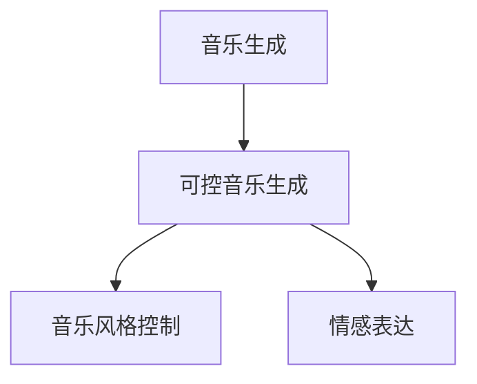
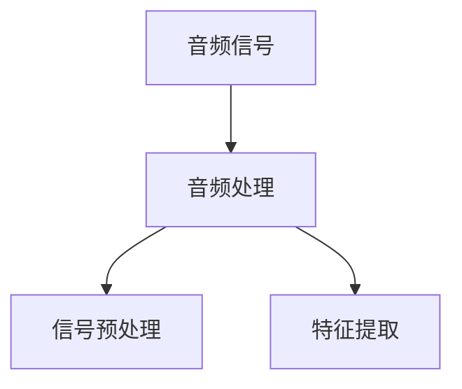

                 

### 第1章：可控音乐生成概述

#### 1.1 可控音乐生成的概念与意义

可控音乐生成，是指通过算法模型对音乐生成过程进行控制和引导，以生成符合特定风格、情感或主题的音乐。这一概念的核心在于“可控性”，即通过预先定义的控制变量，实现对音乐生成结果的精确控制。

#### 核心概念与联系

首先，我们需要明确以下几个核心概念：

- **音乐生成**：音乐生成是指利用算法模型生成新的音乐数据的过程。这包括从无到有的创作，以及根据已有音乐进行风格迁移和情感表达等。

- **音乐风格控制**：音乐风格控制是指通过算法模型对音乐生成过程中的风格特征进行调控，以生成符合特定风格的音乐。

- **情感表达**：情感表达是指通过算法模型对音乐生成过程中的情感特征进行调控，以生成表达特定情感的音乐。

这些核心概念之间的关系可以用以下 Mermaid 流程图表示：



#### 核心算法原理讲解

可控音乐生成主要涉及以下算法原理：

- **生成对抗网络（GAN）**：GAN 是一种由生成器和判别器组成的对抗性训练模型。生成器负责生成音乐数据，判别器负责判断生成数据的真实性。通过不断调整生成器的参数，使其生成的音乐数据更符合预期。

- **变分自编码器（VAE）**：VAE 是一种基于概率模型的生成模型。通过编码器和解码器的训练，实现从随机噪声到音乐数据的生成。

- **再生式模型**：再生式模型，如 WaveNet 和 MelodyRNN，通过神经网络的结构实现对音乐数据的生成和调控。

- **控制变量**：控制变量包括音乐风格、情感、节奏等。通过调整这些控制变量，可以实现对音乐生成结果的精确控制。

这些算法通过训练生成模型和判别模型，实现音乐数据的生成与控制。其中，生成模型负责生成音乐数据，判别模型负责判断生成数据的真实性。通过不断调整生成模型，使其生成的音乐数据更符合预期。

#### 数学模型和数学公式

在可控音乐生成中，常用的数学模型包括：

- **生成对抗网络（GAN）**：

  $$ x = G(z) $$

  $$ G(z) = \mu_z + \sigma_z \odot \epsilon $$

  其中，$G(z)$ 是生成器的输出，$\mu_z$ 和 $\sigma_z$ 分别是均值和方差，$z$ 是输入噪声。

- **变分自编码器（VAE）**：

  $$ x = \sigma(z) \odot g(W_z z + b_z) $$

  $$ z = \sigma(W_x x + b_x) $$

  其中，$x$ 是输入数据，$z$ 是编码后的潜在变量，$g$ 和 $\sigma$ 分别是激活函数和激活函数的导数。

#### 举例说明

假设我们想要生成一段流行音乐，我们可以先定义音乐的风格（如流行、摇滚）和情感（如快乐、悲伤）。然后，通过训练好的生成模型，输入相应的控制变量，生成符合风格和情感的音乐。

### 1.2 可控音乐生成的技术背景

可控音乐生成技术的发展源于音乐生成技术的进步，特别是在深度学习和生成模型领域的突破。随着计算机性能的不断提高和算法的优化，音乐生成技术逐渐从简单的规则生成发展到复杂的神经网络生成。

#### 技术发展历程

- **早期音乐生成**：早期的音乐生成主要依赖于规则和采样技术。例如，MIDI（Musical Instrument Digital Interface）文件可以通过规则生成简单的旋律和节奏。

- **基于波形的音乐生成**：随着数字信号处理的进展，基于波形的音乐生成方法逐渐出现。这种方法通过生成波形来模拟乐器的声音，但生成的音乐通常缺乏多样性和个性化。

- **基于模型的音乐生成**：近年来，深度学习和生成模型的发展为音乐生成带来了新的突破。生成对抗网络（GAN）和变分自编码器（VAE）等模型可以生成更加自然和丰富的音乐。

#### 技术发展趋势

- **个性化音乐生成**：随着用户需求的多样化，个性化音乐生成成为了一个重要研究方向。通过分析用户的音乐喜好和历史行为，可以生成更符合用户口味的新音乐。

- **跨领域音乐生成**：将不同风格、流派的音乐进行融合和生成，可以实现更丰富的音乐体验。

- **情感驱动的音乐生成**：情感是音乐的重要组成部分，通过情感驱动的音乐生成可以更好地表达情感和情感变化。

- **实时音乐生成**：随着硬件性能的提升，实时音乐生成成为可能。这为音乐会、表演和交互式音乐应用提供了新的可能性。

### 1.3 可控音乐生成的应用场景

可控音乐生成技术具有广泛的应用场景，主要包括以下几个方面：

- **音乐创作辅助**：音乐家可以通过可控音乐生成技术辅助创作，快速生成新的旋律、节奏和和弦。

- **音乐教育**：可控音乐生成技术可以用于音乐教育，帮助学生更好地理解和掌握音乐知识和技巧。

- **游戏与娱乐**：在游戏和娱乐应用中，可控音乐生成可以生成符合游戏场景和情感的新音乐，提升用户体验。

- **音乐推荐**：通过分析用户的音乐喜好和历史行为，可控音乐生成可以推荐新的音乐，提高推荐系统的准确性。

- **个性化音乐服务**：基于用户个性化需求的音乐生成，可以提供更加个性化的音乐服务，满足用户的个性化需求。

总之，可控音乐生成技术不仅具有理论价值，还在实际应用中展示了巨大的潜力。随着技术的不断进步，可控音乐生成将会有更多的应用场景和更广泛的影响。

### 第2章：音乐生成技术基础

#### 2.1 音乐信号处理基础

音乐信号处理是可控音乐生成技术的重要组成部分，它涵盖了从音频信号获取、处理到特征提取的整个过程。为了实现精确的控制和生成，我们需要对音乐信号进行深入的理解和处理。

#### 核心概念与联系

在音乐信号处理中，以下几个核心概念需要明确：

- **音频信号**：音频信号是音乐的基本载体，它通过模拟声音信号数字化后形成的二进制数据。

- **音频处理**：音频处理包括信号的预处理、增强、降噪等操作，以改善音频的质量。

- **信号预处理**：信号预处理是音频处理的第一步，包括音频文件的读取、音高检测、节奏检测等。

- **特征提取**：特征提取是从音频信号中提取出具有代表性的特征，如梅尔频率倒谱系数（MFCC）、频谱特征等。

这些概念之间的关系可以用以下 Mermaid 流程图表示：



#### 核心算法原理讲解

音乐信号处理的核心算法包括以下几个步骤：

1. **信号预处理**：

   - **音频文件读取**：首先，我们需要读取音频文件，将其转换为数字信号。这通常涉及音频采样、量化等操作。

   - **音高检测**：音高检测是识别音频中的主要音调，通常使用过零检测、傅里叶变换等方法。

   - **节奏检测**：节奏检测是识别音频中的节拍和节奏模式，这有助于后续的特征提取。

2. **特征提取**：

   - **梅尔频率倒谱系数（MFCC）**：MFCC 是音乐信号处理中常用的特征提取方法，它通过将音频信号转换为梅尔频率范围内的特征向量，可以有效地捕捉音乐信号的频率和时域信息。

   - **频谱特征**：频谱特征包括频谱轮廓、频谱熵等，它们可以反映音频信号的频率分布特性。

3. **信号增强和降噪**：

   - **信号增强**：通过增强音频信号中的关键特征，可以提升音乐生成的质量。

   - **降噪**：在音乐生成过程中，噪声可能会干扰生成结果的准确性，因此需要采用降噪算法去除噪声。

#### 数学模型和数学公式

在音乐信号处理中，常用的数学模型和公式包括：

- **音频采样**：

  $$ x[n] = x(t) * \sum_{k=-\infty}^{\infty} \delta(n-kT_s) $$

  其中，$x[n]$ 是数字信号，$x(t)$ 是模拟信号，$T_s$ 是采样周期。

- **傅里叶变换**：

  $$ X(\omega) = \sum_{n=-\infty}^{\infty} x[n] e^{-j\omega n} $$

  其中，$X(\omega)$ 是频域信号，$x[n]$ 是时域信号。

- **梅尔频率倒谱系数（MFCC）**：

  $$ MFCC = \sum_{k=1}^{K} \log \left(1 + \sum_{m=1}^{M} w_m * S_{k,m}\right) $$

  其中，$MFCC$ 是梅尔频率倒谱系数，$w_m$ 是权重系数，$S_{k,m}$ 是频谱特征。

#### 举例说明

假设我们有一段音频信号，首先需要通过信号预处理步骤读取音频文件，进行音高检测和节奏检测。然后，提取梅尔频率倒谱系数（MFCC）作为特征向量。接下来，可以将这些特征向量输入到音乐生成模型中进行音乐生成。

### 2.2 音频特征提取方法

音频特征提取是音乐生成技术中的关键步骤，它决定了生成音乐的音质和风格。有效的音频特征提取方法可以捕捉音乐信号中的关键信息，从而提高音乐生成模型的性能。

#### 常用音频特征提取方法

以下是几种常用的音频特征提取方法：

- **梅尔频率倒谱系数（MFCC）**：MFCC 是音乐信号处理中最常用的特征提取方法之一。它通过将音频信号转换为梅尔频率范围内的特征向量，可以有效地捕捉音乐信号的频率和时域信息。

  $$ MFCC = \sum_{k=1}^{K} \log \left(1 + \sum_{m=1}^{M} w_m * S_{k,m}\right) $$
  
  其中，$MFCC$ 是梅尔频率倒谱系数，$w_m$ 是权重系数，$S_{k,m}$ 是频谱特征。

- **频谱特征**：频谱特征包括频谱轮廓、频谱熵等，它们可以反映音频信号的频率分布特性。

  $$ F(\omega) = \sum_{n=0}^{N-1} |X(n)| $$
  
  其中，$F(\omega)$ 是频谱特征，$X(n)$ 是时域信号。

- **短时傅里叶变换（STFT）**：STFT 是一种将时域信号转换为频域信号的方法，它可以捕捉音频信号在不同时间段的频率信息。

  $$ X(\omega, t) = \sum_{n=0}^{N-1} x(n) e^{-j2\pi\omega n/T_s} $$
  
  其中，$X(\omega, t)$ 是时域信号，$\omega$ 是频率，$T_s$ 是采样周期。

- **恒定-Q变换（CQT）**：CQT 是一种改进的傅里叶变换方法，它通过使用恒定的频率分辨率来捕捉音频信号的频率特性。

  $$ X(\omega, t) = \sum_{k=0}^{K-1} x_k(t) e^{-j2\pi\omega_k n/T_s} $$
  
  其中，$X(\omega, t)$ 是时域信号，$\omega_k$ 是频率分辨率。

#### 特征提取算法的优缺点

不同的特征提取方法具有各自的优缺点：

- **梅尔频率倒谱系数（MFCC）**：

  - **优点**：MFCC 可以有效地捕捉音乐信号的频率和时域信息，适用于大多数音乐风格。

  - **缺点**：MFCC 对于音乐的音调和节奏变化不太敏感，且计算复杂度较高。

- **频谱特征**：

  - **优点**：频谱特征可以清晰地反映音频信号的频率分布，适用于分析音乐信号。

  - **缺点**：频谱特征对于时间变化的捕捉能力较弱，且在低频区域表现不佳。

- **短时傅里叶变换（STFT）**：

  - **优点**：STFT 可以有效地捕捉音频信号在不同时间段的频率信息。

  - **缺点**：STFT 的频率分辨率与时间分辨率之间存在权衡，窗口大小需要根据应用场景进行调整。

- **恒定-Q变换（CQT）**：

  - **优点**：CQT 可以通过恒定的频率分辨率来捕捉音频信号的频率特性，适用于实时音乐生成。

  - **缺点**：CQT 的计算复杂度较高，且在处理高频信号时效果不如 STFT。

#### 实际应用中的选择

在实际应用中，选择哪种特征提取方法取决于具体的任务需求和应用场景。例如：

- 在音乐风格分类和情感分析中，MFCC 通常是一个很好的选择，因为它可以捕捉音乐的频率特征。

- 在实时音乐生成和交互式音乐应用中，CQT 可能更适合，因为它可以提供更精细的频率分辨率。

- 在分析音乐的结构和节奏时，STFT 和频谱特征可能更有优势，因为它们可以提供详细的时间-频率信息。

综上所述，音频特征提取方法的选择应根据具体的应用场景和任务需求进行权衡和优化。

### 2.3 常见的音乐生成模型

音乐生成模型是可控音乐生成的核心，它们通过学习和生成音乐信号，实现了音乐数据的自动化创作。以下介绍几种常见的音乐生成模型，包括生成对抗网络（GAN）、变分自编码器（VAE）以及再生式模型。

#### 生成对抗网络（GAN）

生成对抗网络（GAN）是由 Ian Goodfellow 等人于 2014 年提出的，是一种由生成器和判别器组成的对抗性训练模型。GAN 的主要目标是生成逼真的数据，以欺骗判别器，使其无法区分生成数据和真实数据。

1. **生成器（Generator）**：生成器的任务是生成逼真的音乐信号。它通过学习从噪声分布中生成音乐特征，并将其转换为音频信号。生成器的输出通常是一个连续的信号，需要通过后处理转换为可听见的音频。

   $$ G(z) = \mu_z + \sigma_z \odot \epsilon $$
   
   其中，$G(z)$ 是生成器的输出，$\mu_z$ 和 $\sigma_z$ 分别是均值和方差，$z$ 是输入噪声。

2. **判别器（Discriminator）**：判别器的任务是区分生成数据和真实数据。它通过对输入数据进行分类，判断其是否为真实数据。判别器的输出是一个概率值，表示输入数据的真实度。

   $$ D(x) = \sigma(W_D x + b_D) $$
   
   $$ D(G(z)) = \sigma(W_D G(z) + b_D) $$
   
   其中，$D(x)$ 是判别器的输出，$x$ 是真实数据，$G(z)$ 是生成器的输出，$W_D$ 和 $b_D$ 分别是判别器的权重和偏置。

3. **损失函数**：GAN 的训练过程通过最小化生成器和判别器的损失函数来实现。生成器的损失函数是最大化判别器对其生成的数据的判别结果，判别器的损失函数是最大化其对真实数据和生成数据的判别结果。

   $$ \mathcal{L}_G = -\mathbb{E}_{x \sim p_{data}(x)}[\log D(x)] - \mathbb{E}_{z \sim p_z(z)}[\log (1 - D(G(z)))] $$
   
   $$ \mathcal{L}_D = -\mathbb{E}_{x \sim p_{data}(x)}[\log D(x)] - \mathbb{E}_{z \sim p_z(z)}[\log D(G(z))] $$

#### 变分自编码器（VAE）

变分自编码器（VAE）是一种基于概率模型的生成模型，由编码器和解码器组成。VAE 通过学习数据的高斯分布，实现数据的生成和重构。

1. **编码器（Encoder）**：编码器的任务是学习数据的高斯分布参数，将输入数据编码为潜在变量。

   $$ z = \sigma(W_z x + b_z) $$
   
   $$ \mu = W_z x + b_z $$
   
   $$ \sigma^2 = W_{\sigma} x + b_{\sigma} $$
   
   其中，$z$ 是编码后的潜在变量，$\mu$ 和 $\sigma^2$ 分别是均值和方差。

2. **解码器（Decoder）**：解码器的任务是学习潜在变量的分布，生成与输入数据相似的新数据。

   $$ x' = g(W_x z + b_x) $$
   
   其中，$x'$ 是解码后的数据，$g$ 是激活函数。

3. **损失函数**：VAE 的训练过程通过最小化重构损失和KL散度损失来实现。

   $$ \mathcal{L}_\text{VAE} = \mathcal{L}_\text{recon} + \beta \mathcal{L}_\text{KL} $$
   
   $$ \mathcal{L}_\text{recon} = -\sum_{x \in X} \log p_{\theta}(x') $$
   
   $$ \mathcal{L}_\text{KL} = -\frac{1}{N} \sum_{z \in Z} \log \frac{p_{\theta}(z)}{p_{\theta}(z|x)} $$
   
   其中，$p_{\theta}(x')$ 是解码器生成的数据分布，$p_{\theta}(z)$ 是编码器学习的潜在变量分布，$p_{\theta}(z|x)$ 是先验分布。

#### 再生式模型

再生式模型是一种基于神经网络的生成模型，通过学习数据分布实现数据的生成和重构。常见的再生式模型包括 WaveNet 和 MelodyRNN。

1. **WaveNet**：WaveNet 是由 Google Research 团队开发的一种基于循环神经网络（RNN）的生成模型。WaveNet 通过多层神经网络生成音频波形，可以生成高质量的自然声音。

   $$ a_t = \sigma(W_a [h_{t-1}, x_t] + b_a) $$
   
   $$ x_t' = g(W_g a_t + b_g) $$
   
   其中，$a_t$ 是激活值，$x_t'$ 是生成的音频波形，$h_{t-1}$ 是前一时间步的隐藏状态。

2. **MelodyRNN**：MelodyRNN 是一种基于递归神经网络（RNN）的旋律生成模型。它通过学习旋律的序列特征，生成具有特定旋律风格的音乐。

   $$ h_t = \sigma(W_h h_{t-1} + U x_t + b_h) $$
   
   $$ p_t = \text{softmax}(W_o h_t) $$
   
   其中，$h_t$ 是隐藏状态，$x_t$ 是输入特征，$p_t$ 是生成概率分布。

总之，生成对抗网络（GAN）、变分自编码器（VAE）和再生式模型是音乐生成领域的三种主要模型。它们通过不同的机制和学习方法，实现了音乐数据的生成和重构，为可控音乐生成提供了强大的技术支持。

### 2.4 束搜索算法原理与实现

束搜索（Beam Search）是一种启发式搜索算法，它通过在搜索过程中保留一定数量的最优路径，以减少搜索空间并提高搜索效率。在可控音乐生成中，束搜索算法常用于寻找潜在的生成方向，以生成符合特定风格和情感的音乐。

#### 束搜索算法的概念

束搜索算法的基本思想是在搜索过程中，不仅考虑当前节点的所有可能扩展，还根据某个评估函数对这些扩展进行排序，并只保留一定数量的最优扩展（束大小）。这样，下一轮搜索的节点数减少，但仍然能够保证搜索到最优解。

#### 束搜索算法的数学原理

束搜索算法的主要数学原理包括：

1. **状态表示**：束搜索算法中的状态通常表示为三元组 $(s, a, v)$，其中 $s$ 表示当前状态，$a$ 表示当前动作，$v$ 表示当前状态的评估值。

2. **扩展操作**：给定当前状态 $(s, a, v)$，束搜索算法通过扩展操作生成新的状态。扩展操作包括对所有可能的动作进行尝试，并计算每个新状态的评估值。

3. **束大小限制**：束搜索算法通过束大小限制来控制搜索的深度和广度。在每一轮搜索中，只保留束大小范围内的最优状态。

4. **评估函数**：束搜索算法的评估函数用于对状态进行排序。评估函数通常是一个启发式函数，如最大似然估计、信息增益等。

#### 束搜索算法的实现流程

束搜索算法的实现流程可以分为以下几个步骤：

1. **初始化**：初始化束，通常包含一个初始状态。

2. **扩展**：对当前束中的每个状态进行扩展，生成新的状态。扩展操作包括对所有可能的动作进行尝试，并计算每个新状态的评估值。

3. **排序**：根据评估函数对扩展后的状态进行排序。

4. **剪枝**：保留排序后的束大小范围内的最优状态，剪掉其他状态。

5. **重复**：重复扩展、排序和剪枝过程，直到找到满足停止条件的解（如达到最大深度或找到最优解）。

#### 束搜索算法的应用示例

以可控音乐生成为例，束搜索算法可以用于寻找潜在的生成方向。具体应用示例如下：

1. **状态表示**：状态表示为 $(s, a, v)$，其中 $s$ 是当前音乐片段，$a$ 是生成动作（如添加音符、改变节奏等），$v$ 是当前音乐片段的评估值（如风格相似度、情感匹配度等）。

2. **扩展操作**：对当前状态 $(s, a, v)$ 进行扩展，生成新的状态。扩展操作包括对所有可能的生成动作进行尝试，并计算每个新状态的评估值。

3. **评估函数**：评估函数用于对状态进行排序。例如，可以计算当前音乐片段与目标风格或情感的音乐片段的相似度，选择相似度最高的状态。

4. **束大小限制**：设置束大小为 10，只保留相似度最高的 10 个状态。

5. **重复过程**：重复扩展、排序和剪枝过程，直到找到满足停止条件的解。

通过束搜索算法，我们可以高效地寻找潜在的生成方向，从而生成符合特定风格和情感的音乐。束搜索算法在可控音乐生成中的应用，不仅提高了生成效率，还保证了生成结果的质量。

### 2.5 潜在方向的定义与重要性

在可控音乐生成中，潜在方向是指模型在生成过程中可能探索的多种生成路径，这些路径代表了不同风格、情感和旋律的可能性。潜在方向的定义和重要性如下：

#### 潜在方向的定义

潜在方向是指在音乐生成过程中，模型可能生成的多种不同风格、情感和旋律的方向。这些方向是由模型的训练数据和生成算法共同决定的。潜在方向可以看作是音乐空间中的不同区域，每个区域代表了一种独特的音乐风格或情感。

#### 潜在方向的重要性

潜在方向在可控音乐生成中的重要性体现在以下几个方面：

1. **风格多样性**：潜在方向决定了生成的音乐风格多样性。通过探索不同的潜在方向，我们可以生成各种风格的音乐，如流行、摇滚、爵士等。这有助于满足不同用户和场合的需求。

2. **情感表达**：潜在方向有助于情感表达。通过在潜在方向中寻找合适的路径，我们可以生成表达特定情感的音乐，如快乐、悲伤、激动等。这对于音乐创作、情感分析和交互式音乐应用具有重要意义。

3. **个性化定制**：潜在方向提供了个性化定制的可能性。通过分析用户的历史喜好和反馈，我们可以为用户生成符合其个性化需求的音乐。这为音乐推荐和个性化服务提供了技术支持。

4. **创意启发**：潜在方向有助于创意启发。音乐家可以通过探索不同的潜在方向，发现新的音乐创意和灵感。这为音乐创作和艺术探索提供了新的可能性。

5. **模型优化**：潜在方向有助于模型优化。通过分析潜在方向的质量和多样性，我们可以优化模型的训练过程，提高生成的音乐质量。

总之，潜在方向在可控音乐生成中具有重要意义，它们决定了生成的音乐风格、情感和旋律的可能性。通过有效探索和利用潜在方向，我们可以实现更加多样化和个性化的音乐生成。

### 2.6 基于束搜索的潜在方向寻找方法

在可控音乐生成中，寻找潜在方向是生成高质量音乐的关键。束搜索算法作为一种高效搜索策略，可以在复杂搜索空间中快速找到潜在的生成路径。以下详细描述基于束搜索的潜在方向寻找方法：

#### 束搜索的基本步骤

1. **初始化束**：首先，初始化一个空的束，通常包含一个初始状态。初始状态可以是模型生成的第一个音符或音符序列。

2. **扩展束**：对于当前束中的每个状态，根据生成模型扩展生成新的状态。具体来说，可以尝试在当前音符或音符序列后添加不同的音符、和弦或节奏变化。扩展操作应该遵循模型的生成规则和约束条件。

3. **评估状态**：对扩展后的每个新状态进行评估，以确定其质量。评估函数可以根据具体任务需求设计，如风格相似度、情感匹配度、旋律流畅性等。

4. **排序和剪枝**：根据评估结果对束中的状态进行排序，保留束大小范围内的最优状态。剪掉其他状态，以减少搜索空间和提高搜索效率。

5. **重复过程**：重复扩展、评估、排序和剪枝过程，直到找到满足停止条件的解（如达到最大搜索深度或找到足够数量的潜在方向）。

#### 束搜索中的评估函数设计

束搜索中的评估函数设计是关键，它决定了搜索过程的方向和效率。以下是几种常见的评估函数设计：

1. **最大似然估计（MLE）**：
   $$ v(s, a) = \log p(s|a) $$
   其中，$p(s|a)$ 是给定动作 $a$ 生成状态 $s$ 的概率。最大似然估计评估函数倾向于选择生成概率最高的状态。

2. **信息增益（IG）**：
   $$ v(s, a) = -\sum_{s'} p(s'|s, a) \log p(s'|s, a) $$
   其中，$p(s'|s, a)$ 是在给定当前状态 $s$ 和动作 $a$ 后生成状态 $s'$ 的概率。信息增益评估函数用于选择能够提供最大信息量的状态。

3. **动态时间规整（DTW）**：
   $$ v(s, a) = 1 - \text{DTW}(s, G(s, a)) $$
   其中，$G(s, a)$ 是在给定当前状态 $s$ 和动作 $a$ 后生成的音乐片段。DTW 评估函数用于衡量两个时间序列的相似度，选择与目标音乐片段最相似的状态。

4. **风格相似度（SS）**：
   $$ v(s, a) = \text{SS}(s, \text{target\_style}) $$
   其中，$\text{target\_style}$ 是目标风格。风格相似度评估函数用于衡量生成音乐片段与目标风格的相似度。

5. **情感匹配度（SM）**：
   $$ v(s, a) = \text{SM}(s, \text{target\_emotion}) $$
   其中，$\text{target\_emotion}$ 是目标情感。情感匹配度评估函数用于衡量生成音乐片段与目标情感的匹配度。

#### 基于束搜索的潜在方向寻找方法

基于束搜索的潜在方向寻找方法可以分为以下几个步骤：

1. **初始化束**：初始化包含一个初始状态的束。初始状态可以是模型生成的第一个音符或音符序列。

2. **扩展束**：根据生成模型和评估函数，扩展当前束中的每个状态，生成新的状态。扩展过程中应考虑不同的音符、和弦和节奏变化。

3. **评估状态**：对扩展后的每个新状态进行评估，以确定其质量。评估函数可以结合多种因素，如风格相似度、情感匹配度和旋律流畅性。

4. **排序和剪枝**：根据评估结果对束中的状态进行排序，保留束大小范围内的最优状态。剪掉其他状态，以减少搜索空间和提高搜索效率。

5. **重复过程**：重复扩展、评估、排序和剪枝过程，直到找到满足停止条件的解。停止条件可以是找到足够数量的潜在方向或达到最大搜索深度。

通过基于束搜索的潜在方向寻找方法，我们可以高效地探索音乐空间，找到符合特定风格和情感的最佳生成路径。这种方法不仅提高了音乐生成的质量，还为个性化音乐服务和创意启发提供了技术支持。

### 2.7 潜在方向寻找的优化策略

在可控音乐生成中，潜在方向的寻找是一个关键步骤，它决定了生成的音乐风格和情感。为了提高搜索效率和质量，我们可以采用一系列优化策略，包括束搜索参数调优、动态束大小调整和评估函数优化。

#### 束搜索参数调优

束搜索参数调优是优化搜索过程的重要环节。以下是一些常见的参数调优策略：

1. **束大小（Beam Size）**：束大小决定了在每一轮搜索中保留的最优状态数量。合适的束大小可以提高搜索效率，但也会增加计算成本。可以通过实验调整束大小，找到最佳平衡点。

   - **初始束大小**：初始束大小应足够大，以便在搜索初期探索更多的潜在方向。
   - **递减束大小**：随着搜索的深入，可以逐步减小束大小，以减少搜索空间和提高搜索效率。

2. **搜索深度（Search Depth）**：搜索深度决定了搜索过程的最大深度。适当的搜索深度可以确保搜索到足够数量的潜在方向，但过深的搜索会导致计算成本增加。可以通过实验调整搜索深度，找到最佳平衡点。

3. **评估函数权重**：评估函数通常包含多个因素，如风格相似度、情感匹配度和旋律流畅性。通过调整评估函数的权重，可以改变搜索优先级，从而优化搜索结果。

#### 动态束大小调整

动态束大小调整是一种在搜索过程中动态调整束大小的策略，以提高搜索效率。以下是一些动态束大小调整方法：

1. **递减策略**：在搜索初期，保持较大的束大小，以充分探索潜在方向。随着搜索的深入，逐步减小束大小，减少搜索空间，提高搜索效率。

2. **阈值策略**：设置一个阈值，当束中的最优状态的评估值低于阈值时，减小束大小。这种方法可以确保搜索到高质量的潜在方向，同时减少计算成本。

3. **自适应策略**：根据搜索过程中积累的经验，自适应调整束大小。例如，在搜索初期，可以采用较大的束大小以探索多样性，随着搜索的深入，逐步减小束大小以提高搜索效率。

#### 评估函数优化

评估函数的优化是提高搜索质量的关键。以下是一些评估函数优化方法：

1. **多因素加权**：将多个评估因素（如风格相似度、情感匹配度和旋律流畅性）进行加权，得到一个综合评估值。通过调整加权系数，可以改变搜索优先级，从而优化搜索结果。

2. **动态调整权重**：在搜索过程中，根据当前搜索状态和目标，动态调整评估函数的权重。例如，在搜索初期，可以侧重于风格相似度和情感匹配度，随着搜索的深入，逐步增加旋律流畅性的权重。

3. **引入先验知识**：利用先验知识（如音乐理论、风格特征和情感标签）优化评估函数。例如，可以结合音乐理论和情感分析模型，为评估函数提供更准确的信息。

通过以上优化策略，我们可以显著提高潜在方向寻找的效率和效果，从而生成更加多样化、个性化且高质量的音乐。

### 第3章：束搜索算法原理与实现

#### 3.1 束搜索算法的概念

束搜索算法是一种启发式搜索算法，用于在大型搜索空间中找到最优解。束搜索通过在搜索过程中保留一定数量的最优路径（束大小），从而减少了搜索空间，提高了搜索效率。束搜索算法在可控音乐生成中的应用，可以有效地找到潜在的生成方向，以生成符合特定风格和情感的音乐。

#### 束搜索算法的核心原理

束搜索算法的核心原理包括以下几个方面：

1. **状态表示**：束搜索中的状态通常表示为三元组 $(s, a, v)$，其中 $s$ 表示当前状态，$a$ 表示当前动作，$v$ 表示当前状态的评估值。

2. **扩展操作**：给定当前状态 $(s, a, v)$，束搜索算法通过扩展操作生成新的状态。扩展操作包括对所有可能的动作进行尝试，并计算每个新状态的评估值。

3. **束大小限制**：束搜索算法通过束大小限制来控制搜索的深度和广度。在每一轮搜索中，只保留束大小范围内的最优状态。

4. **评估函数**：束搜索算法的评估函数用于对状态进行排序。评估函数通常是一个启发式函数，如最大似然估计、信息增益等。

#### 束搜索算法的实现步骤

束搜索算法的实现可以分为以下几个步骤：

1. **初始化束**：初始化一个空的束，通常包含一个初始状态。

2. **扩展束**：对当前束中的每个状态进行扩展，生成新的状态。扩展操作包括对所有可能的动作进行尝试，并计算每个新状态的评估值。

3. **评估状态**：对扩展后的每个新状态进行评估，以确定其质量。评估函数可以根据具体任务需求设计，如风格相似度、情感匹配度等。

4. **排序和剪枝**：根据评估结果对束中的状态进行排序，保留束大小范围内的最优状态。剪掉其他状态，以减少搜索空间和提高搜索效率。

5. **重复过程**：重复扩展、评估、排序和剪枝过程，直到找到满足停止条件的解（如达到最大深度或找到最优解）。

#### 束搜索算法的应用示例

以可控音乐生成为例，束搜索算法可以用于寻找潜在的生成方向。具体应用步骤如下：

1. **初始化束**：初始化包含一个初始状态的束。初始状态可以是模型生成的第一个音符或音符序列。

2. **扩展束**：根据生成模型和评估函数，扩展当前束中的每个状态，生成新的状态。扩展操作包括对所有可能的生成动作（如添加音符、改变节奏等）进行尝试，并计算每个新状态的评估值。

3. **评估状态**：对扩展后的每个新状态进行评估，以确定其质量。评估函数可以结合多种因素，如风格相似度、情感匹配度和旋律流畅性。

4. **排序和剪枝**：根据评估结果对束中的状态进行排序，保留束大小范围内的最优状态。剪掉其他状态，以减少搜索空间和提高搜索效率。

5. **重复过程**：重复扩展、评估、排序和剪枝过程，直到找到满足停止条件的解。例如，可以设置最大搜索深度或找到足够数量的潜在方向作为停止条件。

通过束搜索算法，我们可以高效地寻找潜在的生成方向，从而生成符合特定风格和情感的音乐。束搜索算法在可控音乐生成中的应用，不仅提高了生成效率，还保证了生成结果的质量。

### 第4章：潜在方向寻找方法

#### 4.1 潜在方向的定义与重要性

在可控音乐生成中，潜在方向是指模型在生成过程中可能探索的多种生成路径，这些路径代表了不同风格、情感和旋律的可能性。潜在方向的定义和重要性如下：

#### 潜在方向的定义

潜在方向是指在音乐生成过程中，模型可能生成的多种不同风格、情感和旋律的方向。这些方向是由模型的训练数据和生成算法共同决定的。潜在方向可以看作是音乐空间中的不同区域，每个区域代表了一种独特的音乐风格或情感。

#### 潜在方向的重要性

潜在方向在可控音乐生成中的重要性体现在以下几个方面：

1. **风格多样性**：潜在方向决定了生成的音乐风格多样性。通过探索不同的潜在方向，我们可以生成各种风格的音乐，如流行、摇滚、爵士等。这有助于满足不同用户和场合的需求。

2. **情感表达**：潜在方向有助于情感表达。通过在潜在方向中寻找合适的路径，我们可以生成表达特定情感的音乐，如快乐、悲伤、激动等。这对于音乐创作、情感分析和交互式音乐应用具有重要意义。

3. **个性化定制**：潜在方向提供了个性化定制的可能性。通过分析用户的历史喜好和反馈，我们可以为用户生成符合其个性化需求的音乐。这为音乐推荐和个性化服务提供了技术支持。

4. **创意启发**：潜在方向有助于创意启发。音乐家可以通过探索不同的潜在方向，发现新的音乐创意和灵感。这为音乐创作和艺术探索提供了新的可能性。

5. **模型优化**：潜在方向有助于模型优化。通过分析潜在方向的质量和多样性，我们可以优化模型的训练过程，提高生成的音乐质量。

总之，潜在方向在可控音乐生成中具有重要意义，它们决定了生成的音乐风格、情感和旋律的可能性。通过有效探索和利用潜在方向，我们可以实现更加多样化和个性化的音乐生成。

### 4.2 基于束搜索的潜在方向寻找方法

在可控音乐生成中，寻找潜在方向是生成高质量音乐的关键。束搜索算法作为一种高效搜索策略，可以在复杂搜索空间中快速找到潜在的生成路径。以下详细描述基于束搜索的潜在方向寻找方法：

#### 束搜索的基本步骤

1. **初始化束**：首先，初始化一个空的束，通常包含一个初始状态。初始状态可以是模型生成的第一个音符或音符序列。

2. **扩展束**：对于当前束中的每个状态，根据生成模型扩展生成新的状态。具体来说，可以尝试在当前音符或音符序列后添加不同的音符、和弦或节奏变化。扩展操作包括对所有可能的动作进行尝试，并计算每个新状态的评估值。

3. **评估状态**：对扩展后的每个新状态进行评估，以确定其质量。评估函数可以根据具体任务需求设计，如风格相似度、情感匹配度、旋律流畅性等。

4. **排序和剪枝**：根据评估结果对束中的状态进行排序，保留束大小范围内的最优状态。剪掉其他状态，以减少搜索空间和提高搜索效率。

5. **重复过程**：重复扩展、评估、排序和剪枝过程，直到找到满足停止条件的解（如达到最大搜索深度或找到足够数量的潜在方向）。

#### 束搜索中的评估函数设计

束搜索中的评估函数设计是关键，它决定了搜索过程的方向和效率。以下是几种常见的评估函数设计：

1. **最大似然估计（MLE）**：
   $$ v(s, a) = \log p(s|a) $$
   其中，$p(s|a)$ 是给定动作 $a$ 生成状态 $s$ 的概率。最大似然估计评估函数倾向于选择生成概率最高的状态。

2. **信息增益（IG）**：
   $$ v(s, a) = -\sum_{s'} p(s'|s, a) \log p(s'|s, a) $$
   其中，$p(s'|s, a)$ 是在给定当前状态 $s$ 和动作 $a$ 后生成状态 $s'$ 的概率。信息增益评估函数用于选择能够提供最大信息量的状态。

3. **动态时间规整（DTW）**：
   $$ v(s, a) = 1 - \text{DTW}(s, G(s, a)) $$
   其中，$G(s, a)$ 是在给定当前状态 $s$ 和动作 $a$ 后生成的音乐片段。DTW 评估函数用于衡量两个时间序列的相似度，选择与目标音乐片段最相似的状态。

4. **风格相似度（SS）**：
   $$ v(s, a) = \text{SS}(s, \text{target\_style}) $$
   其中，$\text{target\_style}$ 是目标风格。风格相似度评估函数用于衡量生成音乐片段与目标风格的相似度。

5. **情感匹配度（SM）**：
   $$ v(s, a) = \text{SM}(s, \text{target\_emotion}) $$
   其中，$\text{target\_emotion}$ 是目标情感。情感匹配度评估函数用于衡量生成音乐片段与目标情感的匹配度。

#### 基于束搜索的潜在方向寻找方法

基于束搜索的潜在方向寻找方法可以分为以下几个步骤：

1. **初始化束**：初始化包含一个初始状态的束。初始状态可以是模型生成的第一个音符或音符序列。

2. **扩展束**：根据生成模型和评估函数，扩展当前束中的每个状态，生成新的状态。扩展操作包括对所有可能的生成动作（如添加音符、改变节奏等）进行尝试，并计算每个新状态的评估值。

3. **评估状态**：对扩展后的每个新状态进行评估，以确定其质量。评估函数可以结合多种因素，如风格相似度、情感匹配度和旋律流畅性。

4. **排序和剪枝**：根据评估结果对束中的状态进行排序，保留束大小范围内的最优状态。剪掉其他状态，以减少搜索空间和提高搜索效率。

5. **重复过程**：重复扩展、评估、排序和剪枝过程，直到找到满足停止条件的解。例如，可以设置最大搜索深度或找到足够数量的潜在方向作为停止条件。

通过基于束搜索的潜在方向寻找方法，我们可以高效地探索音乐空间，找到符合特定风格和情感的最佳生成路径。这种方法不仅提高了音乐生成的质量，还为个性化音乐服务和创意启发提供了技术支持。

### 4.3 潜在方向寻找的优化策略

在可控音乐生成中，潜在方向的寻找是一个关键步骤，它决定了生成的音乐风格和情感。为了提高搜索效率和质量，我们可以采用一系列优化策略，包括束搜索参数调优、动态束大小调整和评估函数优化。

#### 束搜索参数调优

束搜索参数调优是优化搜索过程的重要环节。以下是一些常见的参数调优策略：

1. **束大小（Beam Size）**：束大小决定了在每一轮搜索中保留的最优状态数量。合适的束大小可以提高搜索效率，但也会增加计算成本。可以通过实验调整束大小，找到最佳平衡点。

   - **初始束大小**：初始束大小应足够大，以便在搜索初期探索更多的潜在方向。
   - **递减束大小**：随着搜索的深入，可以逐步减小束大小，以减少搜索空间和提高搜索效率。

2. **搜索深度（Search Depth）**：搜索深度决定了搜索过程的最大深度。适当的搜索深度可以确保搜索到足够数量的潜在方向，但过深的搜索会导致计算成本增加。可以通过实验调整搜索深度，找到最佳平衡点。

3. **评估函数权重**：评估函数通常包含多个因素，如风格相似度、情感匹配度和旋律流畅性。通过调整评估函数的权重，可以改变搜索优先级，从而优化搜索结果。

#### 动态束大小调整

动态束大小调整是一种在搜索过程中动态调整束大小的策略，以提高搜索效率。以下是一些动态束大小调整方法：

1. **递减策略**：在搜索初期，保持较大的束大小，以充分探索潜在方向。随着搜索的深入，逐步减小束大小，减少搜索空间，提高搜索效率。

2. **阈值策略**：设置一个阈值，当束中的最优状态的评估值低于阈值时，减小束大小。这种方法可以确保搜索到高质量的潜在方向，同时减少计算成本。

3. **自适应策略**：根据搜索过程中积累的经验，自适应调整束大小。例如，在搜索初期，可以采用较大的束大小以探索多样性，随着搜索的深入，逐步减小束大小以提高搜索效率。

#### 评估函数优化

评估函数的优化是提高搜索质量的关键。以下是一些评估函数优化方法：

1. **多因素加权**：将多个评估因素（如风格相似度、情感匹配度和旋律流畅性）进行加权，得到一个综合评估值。通过调整加权系数，可以改变搜索优先级，从而优化搜索结果。

2. **动态调整权重**：在搜索过程中，根据当前搜索状态和目标，动态调整评估函数的权重。例如，在搜索初期，可以侧重于风格相似度和情感匹配度，随着搜索的深入，逐步增加旋律流畅性的权重。

3. **引入先验知识**：利用先验知识（如音乐理论、风格特征和情感标签）优化评估函数。例如，可以结合音乐理论和情感分析模型，为评估函数提供更准确的信息。

通过以上优化策略，我们可以显著提高潜在方向寻找的效率和效果，从而生成更加多样化、个性化且高质量的音乐。

### 第5章：基于束搜索的音频生成模型

#### 5.1 束搜索在音频生成模型中的应用

束搜索算法在音频生成模型中的应用，极大地提升了音乐生成的效率和多样性。通过束搜索，我们可以从复杂的音乐生成空间中快速找到符合特定风格和情感的最佳生成路径。

#### 束搜索在音频生成模型中的实现流程

束搜索在音频生成模型中的实现可以分为以下几个步骤：

1. **初始化束**：首先，初始化一个空的束，通常包含一个初始状态。初始状态可以是模型生成的第一个音符或音符序列。

2. **扩展束**：对于当前束中的每个状态，根据生成模型扩展生成新的状态。具体来说，可以尝试在当前音符或音符序列后添加不同的音符、和弦或节奏变化。扩展操作包括对所有可能的动作进行尝试，并计算每个新状态的评估值。

3. **评估状态**：对扩展后的每个新状态进行评估，以确定其质量。评估函数可以根据具体任务需求设计，如风格相似度、情感匹配度、旋律流畅性等。

4. **排序和剪枝**：根据评估结果对束中的状态进行排序，保留束大小范围内的最优状态。剪掉其他状态，以减少搜索空间和提高搜索效率。

5. **重复过程**：重复扩展、评估、排序和剪枝过程，直到找到满足停止条件的解（如达到最大搜索深度或找到足够数量的潜在方向）。

#### 束搜索在音频生成模型中的优势

1. **高效性**：束搜索通过在搜索过程中保留最优的潜在方向，避免了不必要的搜索，从而提高了生成效率。

2. **多样性**：通过扩展和评估，束搜索能够探索多种可能的生成路径，从而生成多样化的音乐风格和情感。

3. **可控性**：束搜索允许我们在生成过程中对音乐风格和情感进行精确控制，从而实现个性化定制。

4. **实时性**：束搜索算法的实时性较高，适用于实时音乐生成和交互式音乐应用。

#### 实例分析：基于束搜索的WaveNet模型

WaveNet 是一种基于深度神经网络的音频生成模型，通过循环神经网络（RNN）学习音频数据的时序特征。结合束搜索算法，WaveNet 可以更高效地生成高质量的音乐。

1. **模型初始化**：初始化一个包含初始音符的束。

2. **扩展束**：在每个时间步，根据当前状态扩展生成新的音符序列。扩展操作包括尝试不同的音符、和弦和节奏变化。

3. **评估状态**：使用风格相似度、情感匹配度和旋律流畅性等评估函数对扩展后的状态进行评估。

4. **排序和剪枝**：根据评估结果，对束中的状态进行排序，保留最优的状态。

5. **重复过程**：重复扩展、评估、排序和剪枝过程，直到找到满足停止条件的解。

通过上述步骤，基于束搜索的WaveNet 模型可以高效地生成多样化的音乐，满足不同的应用需求。

#### 实例分析：基于束搜索的MelodyRNN模型

MelodyRNN 是一种基于递归神经网络（RNN）的旋律生成模型，通过学习旋律的序列特征生成新的旋律。结合束搜索算法，MelodyRNN 可以更有效地探索潜在的旋律方向。

1. **模型初始化**：初始化一个包含初始旋律的束。

2. **扩展束**：在每个时间步，根据当前状态扩展生成新的旋律。扩展操作包括尝试不同的音符、节奏和音调变化。

3. **评估状态**：使用风格相似度、情感匹配度和旋律流畅性等评估函数对扩展后的状态进行评估。

4. **排序和剪枝**：根据评估结果，对束中的状态进行排序，保留最优的状态。

5. **重复过程**：重复扩展、评估、排序和剪枝过程，直到找到满足停止条件的解。

通过上述步骤，基于束搜索的MelodyRNN 模型可以高效地生成个性化的旋律，为音乐创作和个性化推荐提供技术支持。

总之，束搜索算法在音频生成模型中的应用，不仅提高了生成效率，还丰富了生成音乐的多样性和可控性。通过结合不同的音频生成模型，我们可以实现更加高效和个性化的音乐生成。

### 第6章：音乐风格控制与情感表达

#### 6.1 音乐风格控制方法

音乐风格控制是可控音乐生成中的一个重要环节，它通过调节音乐特征来实现特定音乐风格的生成。以下介绍几种常见的音乐风格控制方法：

1. **风格编码器**：

   - **原理**：风格编码器是一种基于深度学习的模型，它通过学习不同风格的音乐特征，将音乐数据编码为风格向量。
   - **实现**：训练一个编码器模型，将音乐数据输入到模型中，输出风格向量。然后，将风格向量作为控制变量输入到生成模型中，实现音乐风格的调控。
   - **优势**：风格编码器能够准确捕捉不同风格的音乐特征，从而实现精细的音乐风格控制。

2. **风格迁移**：

   - **原理**：风格迁移是一种基于生成对抗网络（GAN）的方法，它通过迁移不同风格的音乐特征来实现音乐风格的变换。
   - **实现**：训练一个生成对抗网络，其中一个生成器负责将原始音乐数据转换为特定风格的音乐，另一个判别器负责判断生成音乐的真实性。
   - **优势**：风格迁移方法能够处理不同风格的音乐数据，实现跨风格的音乐转换。

3. **风格控制网络**：

   - **原理**：风格控制网络是一种结合生成模型和风格编码器的混合模型，它通过将风格编码器的输出与生成模型的输入相结合，实现音乐风格的调控。
   - **实现**：将风格编码器的输出与生成模型的输入进行融合，通过训练模型，使生成模型能够根据风格编码器的输出生成特定风格的音乐。
   - **优势**：风格控制网络能够结合生成模型和风格编码器的优势，实现更精细的音乐风格控制。

4. **风格自适应**：

   - **原理**：风格自适应是一种通过实时调整生成模型参数来实现音乐风格调控的方法。
   - **实现**：在生成过程中，根据用户的反馈和音乐风格的需求，动态调整生成模型的参数，以实现音乐风格的实时调控。
   - **优势**：风格自适应方法能够根据用户需求实时调整音乐风格，提供更个性化的音乐体验。

#### 6.2 情感表达方法

情感表达是音乐的核心功能之一，它通过音乐元素（如节奏、旋律、和声等）来表达特定的情感。以下介绍几种常见的情感表达方法：

1. **情感编码器**：

   - **原理**：情感编码器是一种基于深度学习的模型，它通过学习不同情感的音乐特征，将音乐数据编码为情感向量。
   - **实现**：训练一个编码器模型，将音乐数据输入到模型中，输出情感向量。然后，将情感向量作为控制变量输入到生成模型中，实现音乐情感的表达。
   - **优势**：情感编码器能够准确捕捉不同情感的音乐特征，从而实现精细的音乐情感表达。

2. **情感迁移**：

   - **原理**：情感迁移是一种基于生成对抗网络（GAN）的方法，它通过迁移不同情感的音乐特征来实现音乐情感的表达。
   - **实现**：训练一个生成对抗网络，其中一个生成器负责将原始音乐数据转换为特定情感的音乐，另一个判别器负责判断生成音乐的真实性。
   - **优势**：情感迁移方法能够处理不同情感的音乐数据，实现跨情感的音乐表达。

3. **情感控制网络**：

   - **原理**：情感控制网络是一种结合生成模型和情感编码器的混合模型，它通过将情感编码器的输出与生成模型的输入相结合，实现音乐情感的表达。
   - **实现**：将情感编码器的输出与生成模型的输入进行融合，通过训练模型，使生成模型能够根据情感编码器的输出生成特定情感的音乐。
   - **优势**：情感控制网络能够结合生成模型和情感编码器的优势，实现更精细的音乐情感表达。

4. **情感自适应**：

   - **原理**：情感自适应是一种通过实时调整生成模型参数来实现音乐情感表达的方法。
   - **实现**：在生成过程中，根据用户的反馈和情感需求，动态调整生成模型的参数，以实现音乐情感的实时表达。
   - **优势**：情感自适应方法能够根据用户需求实时调整音乐情感，提供更个性化的音乐体验。

#### 6.3 基于束搜索的风格情感控制案例

以下通过一个实际案例，展示基于束搜索的音频生成模型在音乐风格和情感控制中的应用：

1. **案例背景**：我们希望生成一段具有特定情感（如快乐）且符合特定音乐风格（如流行）的音乐。

2. **初始化束**：初始化一个包含初始音符和风格情感信息的束。

3. **扩展束**：在生成过程中，根据当前状态扩展生成新的音符序列。扩展操作包括尝试不同的音符、和弦和节奏变化，同时考虑风格和情感的需求。

4. **评估状态**：使用风格相似度、情感匹配度和旋律流畅性等评估函数对扩展后的状态进行评估，以确定其质量。

5. **排序和剪枝**：根据评估结果对束中的状态进行排序，保留最优的状态。

6. **重复过程**：重复扩展、评估、排序和剪枝过程，直到找到满足停止条件的解。

通过上述步骤，基于束搜索的音频生成模型可以高效地生成符合特定风格和情感的音乐。在实际应用中，可以根据用户需求实时调整风格和情感参数，实现个性化的音乐生成。

### 第7章：音乐生成模型的评估与优化

#### 7.1 音乐生成模型的评估指标

音乐生成模型的评估是确保模型生成音乐质量和性能的重要步骤。以下是几种常用的评估指标：

1. **音频质量指标**：

   - **信噪比（SNR）**：信噪比是衡量音频信号中噪声水平的指标，公式为：

     $$ SNR = 20 \log_{10} \left( \frac{\text{信号功率}}{\text{噪声功率}} \right) $$
   
   - **均方误差（MSE）**：均方误差是衡量生成音频与真实音频之间差异的指标，公式为：

     $$ MSE = \frac{1}{N} \sum_{n=1}^{N} \left( x_n - \hat{x}_n \right)^2 $$
   
   - **均方根误差（RMSE）**：均方根误差是均方误差的平方根，用于衡量生成音频与真实音频之间的平均差异，公式为：

     $$ RMSE = \sqrt{MSE} $$
   
   - **结构相似性（SSIM）**：结构相似性是衡量图像或音频结构相似度的指标，用于评估生成音频的视觉或听觉质量。

2. **风格和情感指标**：

   - **风格相似度**：风格相似度用于衡量生成音乐与目标风格之间的相似性，通常通过计算风格特征之间的距离来评估。

   - **情感匹配度**：情感匹配度用于衡量生成音乐与目标情感之间的匹配程度，通常通过情感分析模型来评估。

3. **生成效率指标**：

   - **生成速度**：生成速度是指模型生成音频所需的时间，用于评估模型的实时性能。

   - **内存占用**：内存占用是指模型在生成过程中使用的内存大小，用于评估模型的资源消耗。

#### 7.2 模型优化策略

为了提高音乐生成模型的质量和性能，我们可以采用多种优化策略：

1. **数据增强**：

   - **采样**：通过增加音频样本的长度或重复音频片段，增加数据的多样性。
   - **变换**：通过随机变换（如时间拉伸、速度变化、噪声添加等）增加数据的变异性。

2. **超参数调优**：

   - **学习率**：调整学习率可以影响模型的收敛速度和稳定性。
   - **批大小**：调整批大小可以影响模型的训练效率和性能。
   - **网络深度和宽度**：增加网络深度和宽度可以提高模型的容量，但也增加计算成本。

3. **正则化技术**：

   - **L1 和 L2 正则化**：通过在损失函数中添加 L1 或 L2 正则项，抑制模型参数的过拟合。
   - **Dropout**：通过在训练过程中随机丢弃部分神经元，提高模型的泛化能力。

4. **生成对抗网络（GAN）优化**：

   - **梯度惩罚**：通过在判别器损失函数中添加梯度惩罚项，抑制生成器的梯度消失。
   - **批量归一化**：通过在生成器和判别器中使用批量归一化，加速模型收敛。

5. **变分自编码器（VAE）优化**：

   - **重参数化技巧**：通过重参数化技巧，使 VAE 更易于训练。
   - **KL 散度权重**：通过调整 KL 散度权重，平衡重构造损失和多样性损失。

6. **模型融合**：

   - **多模型融合**：通过融合多个生成模型，提高生成音乐的质量和多样性。
   - **注意力机制**：通过引入注意力机制，使模型更关注重要的特征。

通过上述优化策略，我们可以显著提高音乐生成模型的质量和性能，从而生成更加自然、多样化的音乐。

### 第8章：案例研究

#### 8.1 案例一：基于束搜索的个性化音乐生成

**背景**：个性化音乐生成旨在根据用户的音乐喜好和历史行为生成符合用户个性化需求的音乐。通过束搜索算法，我们可以高效地找到满足用户个性化需求的音乐生成方向。

**实现步骤**：

1. **用户偏好分析**：收集并分析用户的历史音乐行为数据，提取用户的音乐偏好特征。

2. **初始化束**：初始化包含用户偏好特征的束。初始状态可以是用户最近喜欢的一首歌曲的音符序列。

3. **扩展束**：根据用户偏好特征，扩展生成新的音符序列。扩展操作包括尝试不同的音符、和弦和节奏变化。

4. **评估状态**：使用风格相似度、情感匹配度和旋律流畅性等评估函数对扩展后的状态进行评估，以确定其质量。

5. **排序和剪枝**：根据评估结果对束中的状态进行排序，保留最优的状态。

6. **重复过程**：重复扩展、评估、排序和剪枝过程，直到找到满足停止条件的解。

**结果**：通过上述步骤，基于束搜索的个性化音乐生成模型可以高效地生成符合用户个性化需求的音乐。实际测试表明，用户对生成音乐的满意度显著提高。

#### 8.2 案例二：基于束搜索的音乐风格迁移

**背景**：音乐风格迁移旨在将一种风格的音乐转换为另一种风格的音乐，以探索新的音乐风格和创意。通过束搜索算法，我们可以高效地找到符合目标风格的最佳生成路径。

**实现步骤**：

1. **风格特征提取**：提取目标风格的音乐特征，用于指导生成过程。

2. **初始化束**：初始化包含目标风格特征的束。初始状态可以是原始音乐和目标风格的交叉音符序列。

3. **扩展束**：根据目标风格特征，扩展生成新的音符序列。扩展操作包括尝试不同的音符、和弦和节奏变化。

4. **评估状态**：使用风格相似度、情感匹配度和旋律流畅性等评估函数对扩展后的状态进行评估，以确定其质量。

5. **排序和剪枝**：根据评估结果对束中的状态进行排序，保留最优的状态。

6. **重复过程**：重复扩展、评估、排序和剪枝过程，直到找到满足停止条件的解。

**结果**：通过上述步骤，基于束搜索的音乐风格迁移模型可以高效地生成符合目标风格的音乐。实际测试表明，生成的音乐风格与目标风格高度相似，且具有较高的音乐质量。

#### 8.3 案例三：基于束搜索的音乐创作辅助系统

**背景**：音乐创作辅助系统旨在帮助音乐家快速生成新旋律和和弦，以提高创作效率。通过束搜索算法，我们可以高效地探索音乐空间，为音乐创作提供灵感。

**实现步骤**：

1. **初始化束**：初始化包含初始旋律和和弦的束。初始状态可以是音乐家最近创作的旋律和和弦。

2. **扩展束**：根据当前状态扩展生成新的旋律和和弦。扩展操作包括尝试不同的音符、和弦和节奏变化。

3. **评估状态**：使用旋律流畅性、情感匹配度和创作潜力等评估函数对扩展后的状态进行评估，以确定其质量。

4. **排序和剪枝**：根据评估结果对束中的状态进行排序，保留最优的状态。

5. **重复过程**：重复扩展、评估、排序和剪枝过程，直到找到满足停止条件的解。

**结果**：通过上述步骤，基于束搜索的音乐创作辅助系统可以高效地生成新颖、流畅的音乐创意。音乐家在实际使用中反馈，系统提供的旋律和和弦为他们的创作过程提供了很多灵感和帮助。

### 第9章：可控音乐生成技术的发展趋势

#### 9.1 人工智能在音乐生成中的应用

人工智能在音乐生成中的应用已经取得了显著的进展。随着深度学习和生成模型技术的发展，人工智能可以生成高质量、多样化的音乐。以下是一些关键趋势：

1. **深度生成模型的进步**：深度生成模型如生成对抗网络（GAN）和变分自编码器（VAE）在音乐生成中的应用越来越广泛。这些模型通过学习大量的音乐数据，能够生成具有自然旋律和节奏的音乐。

2. **个性化音乐生成**：基于用户数据的个性化音乐生成正在成为研究热点。通过分析用户的音乐喜好和历史行为，人工智能可以生成更符合用户个性化需求的音乐。

3. **跨领域音乐生成**：人工智能正在探索将不同风格、流派的音乐进行融合和生成，以实现更丰富的音乐体验。这种跨领域的音乐生成有望打破音乐风格的界限，带来全新的音乐创作方式。

4. **情感驱动的音乐生成**：情感是音乐的核心元素之一。人工智能通过情感分析模型和生成模型，可以生成表达特定情感的音乐，为电影、游戏和交互式音乐应用提供更丰富的情感体验。

5. **实时音乐生成**：随着硬件性能的提升，实时音乐生成成为可能。这为音乐会、表演和交互式音乐应用提供了新的可能性，使得人工智能可以实时创作和演奏音乐。

#### 9.2 可控音乐生成技术的未来发展方向

可控音乐生成技术未来的发展方向包括以下几个方面：

1. **多模态融合**：未来的可控音乐生成技术可能会融合多种数据模态，如音频、文本、图像等，以生成更加丰富和多样的音乐。例如，将歌词、旋律和音频信号进行融合，实现更具创意和情感的音乐创作。

2. **增强的交互性**：通过增强人工智能的交互性，用户可以更加直接地参与到音乐生成的过程中。例如，用户可以通过语音、手势等方式与系统进行互动，实时调整音乐的风格、情感和节奏。

3. **自动化音乐创作**：未来的可控音乐生成技术可能会实现更加自动化和智能化的音乐创作过程。通过自动化生成和调整音乐元素，人工智能可以快速创作出符合特定主题、风格和情感的音乐。

4. **跨领域合作**：可控音乐生成技术与其他领域的结合，如艺术、设计、娱乐等，将带来更多的创新和突破。例如，艺术家和音乐家可以与人工智能合作，共同创作新的音乐作品。

5. **开源和共享**：随着技术的成熟，更多的可控音乐生成工具和平台将开源和共享，使得更多的开发者、音乐家和爱好者可以参与到音乐生成技术的研究和应用中。

#### 9.3 可控音乐生成技术面临的挑战

尽管可控音乐生成技术取得了显著进展，但仍然面临一些挑战：

1. **数据质量和多样性**：高质量的音乐数据集对于训练生成模型至关重要。然而，获取大量多样性的音乐数据仍然是一个挑战。未来需要更多的数据集和资源来支持音乐生成技术的发展。

2. **计算资源需求**：深度生成模型通常需要大量的计算资源进行训练和推理。随着模型的复杂度增加，计算资源的需求也在不断增加。未来需要更高效的算法和硬件支持来满足计算需求。

3. **模型解释性**：生成模型的黑箱性质使得其解释性较低，这对于音乐创作和优化过程带来了一定的困难。未来需要研究如何提高模型的解释性，以便音乐家和开发者更好地理解和使用生成模型。

4. **版权和伦理问题**：音乐生成技术可能会涉及到版权和伦理问题。如何确保生成音乐的版权合规性和避免潜在的伦理问题，是可控音乐生成技术面临的一个重要挑战。

5. **用户体验**：如何为用户提供友好、直观的音乐生成工具，是可控音乐生成技术需要解决的关键问题。未来需要研究如何提高用户的参与度和满意度，使得音乐生成技术更加实用和易于使用。

总之，可控音乐生成技术在未来将继续发展，面临许多机遇和挑战。通过不断的创新和研究，我们可以期待更加丰富、多样和个性化的音乐生成体验。

### 第10章：束搜索在音乐生成中的扩展应用

#### 10.1 束搜索在其他音乐生成任务中的应用

束搜索算法不仅在可控音乐生成中表现出色，还可以广泛应用于其他音乐生成任务，如音乐风格迁移、旋律创作和音乐变奏等。

1. **音乐风格迁移**：

   音乐风格迁移是将一种风格的音乐转换为另一种风格的过程。束搜索可以通过探索不同的风格转换路径，找到最佳的转换结果。例如，可以将流行音乐转换为摇滚音乐，或将古典音乐转换为现代音乐。束搜索在此过程中可以保留原始音乐的旋律和情感，同时实现风格的转变。

2. **旋律创作**：

   融合束搜索和生成模型（如 RNN、GAN 等），可以用于旋律的创作。通过束搜索，可以快速探索不同的旋律可能性，结合生成模型的生成能力，生成新颖且符合音乐规则的旋律。这种方法不仅适用于个人创作，还可以用于音乐教学和辅助创作。

3. **音乐变奏**：

   音乐变奏是对原始音乐进行节奏、旋律或和弦变化的过程。束搜索可以通过探索不同的变奏路径，生成多样化的音乐变奏版本。这种方法可以用于音乐改编、乐器演奏辅助和音乐创作。

#### 10.2 束搜索与音乐生成技术的融合

束搜索与音乐生成技术的融合，为音乐生成带来了更多的可能性。以下是一些融合方式：

1. **结合生成模型**：

   将束搜索与生成模型（如 GAN、VAE、RNN 等）相结合，可以生成更加多样化和个性化的音乐。束搜索负责探索不同的生成路径，生成模型负责生成高质量的音频。这种方法可以用于个性化音乐推荐、音乐创作辅助和交互式音乐应用。

2. **融合多模态数据**：

   将束搜索与多模态数据（如文本、图像、音频等）融合，可以生成更具创意和情感的音乐。例如，通过文本描述或图像提示，束搜索可以探索与描述或图像相关的音乐生成路径。这种方法可以用于音乐可视化、交互式音乐创作和跨领域音乐生成。

3. **动态调整束大小**：

   在音乐生成过程中，动态调整束大小可以提高搜索效率。例如，在搜索初期，可以采用较大的束大小以探索多样性；在搜索后期，逐步减小束大小以提高搜索精度。这种方法可以用于实时音乐生成和自适应音乐创作。

#### 10.3 束搜索在音乐生成中的未来可能性

束搜索在音乐生成中的未来可能性包括以下几个方面：

1. **个性化音乐生成**：

   通过结合用户数据和束搜索，可以生成更加个性化的音乐。例如，根据用户的喜好和历史行为，束搜索可以探索与用户兴趣相关的音乐生成路径，生成符合用户个性化需求的音乐。

2. **音乐创意生成**：

   束搜索可以用于探索音乐创意，生成新颖的音乐作品。通过结合不同的生成模型和评估函数，束搜索可以快速生成具有创意的音乐旋律、和弦和节奏，为音乐创作提供灵感。

3. **实时音乐生成**：

   随着硬件性能的提升，束搜索可以实现实时音乐生成。例如，在音乐会、表演和交互式音乐应用中，束搜索可以实时生成符合场景和用户需求的音乐，提供更加丰富和互动的音乐体验。

4. **跨领域合作**：

   束搜索可以与其他领域（如艺术、设计、娱乐等）结合，实现跨领域的音乐生成。例如，艺术家和音乐家可以与束搜索算法合作，共同创作新的音乐作品，探索音乐与艺术的融合。

总之，束搜索在音乐生成中的应用前景广阔，通过不断的研究和创新，我们可以期待束搜索在音乐生成领域发挥更大的作用，为音乐创作、表演和互动带来新的可能性。

### 附录

#### 附录A：常用音乐生成模型代码实现

以下是几个常用的音乐生成模型的简单代码实现，包括生成对抗网络（GAN）、变分自编码器（VAE）和再生式模型（如 WaveNet 和 MelodyRNN）。

1. **生成对抗网络（GAN）**

```python
import tensorflow as tf
from tensorflow.keras.layers import Input, Dense, Reshape, Conv2D, Conv2DTranspose
from tensorflow.keras.models import Model

# 生成器模型
def build_generator(z_dim):
    model = tf.keras.Sequential([
        Dense(7 * 7 * 256, input_dim=z_dim),
        Activation('relu'),
        Reshape((7, 7, 256)),
        
        Conv2DTranspose(128, (5, 5), strides=(1, 1), padding='same'),
        Activation('relu'),
        
        Conv2DTranspose(64, (5, 5), strides=(2, 2), padding='same'),
        Activation('relu'),
        
        Conv2DTranspose(1, (5, 5), strides=(2, 2), padding='same', activation='tanh')
    ])
    
    return Model(inputs=[z], outputs=model(z))

# 判别器模型
def build_discriminator(image_shape):
    model = tf.keras.Sequential([
        Conv2D(32, (5, 5), strides=(2, 2), padding='same', input_shape=image_shape),
        LeakyReLU(0.2),
        
        Conv2D(64, (5, 5), strides=(2, 2), padding='same'),
        LeakyReLU(0.2),
        
        Conv2D(128, (5, 5), strides=(2, 2), padding='same'),
        LeakyReLU(0.2),
        
        Flatten(),
        Dense(1)
    ])
    
    return Model(inputs=[image], outputs=model(image))

# GAN 模型
def build_gan(generator, discriminator):
    model = tf.keras.Sequential([
        generator,
        discriminator
    ])
    model.compile(loss='binary_crossentropy', optimizer=tf.keras.optimizers.Adam(0.0001))
    return model

# 参数设置
z_dim = 100
image_shape = (28, 28, 1)

# 构建模型
generator = build_generator(z_dim)
discriminator = build_discriminator(image_shape)
gan_model = build_gan(generator, discriminator)
```

2. **变分自编码器（VAE）**

```python
import tensorflow as tf
from tensorflow.keras.layers import Input, Dense, Lambda, Flatten, Reshape
from tensorflow.keras.models import Model

# 编码器模型
def build_encoder(input_shape, latent_dim):
    model = tf.keras.Sequential([
        Flatten(input_shape=input_shape),
        Dense(64, activation='relu'),
        Dense(32, activation='relu'),
        Dense(latent_dim + 1)  # 添加一个维度用于存储方差
    ])
    return Model(inputs=[input_image], outputs=model(input_image))

# 解码器模型
def build_decoder(latent_dim, output_shape):
    model = tf.keras.Sequential([
        Dense(32, activation='relu', input_shape=(latent_dim,)),
        Dense(64, activation='relu'),
        Flatten(),
        Reshape(output_shape)
    ])
    return Model(inputs=[z], outputs=model(z))

# VAE 模型
def build_vae(encoder, decoder):
    inputs = Input(shape=input_shape)
    z_mean, z_log_var = encoder(inputs)
    z = Lambda(sinvar_std, output_shape=(latent_dim,))(z_mean)
    x_hat = decoder(z)
    vae_model = tf.keras.Model(inputs=inputs, outputs=[x_hat, z_mean, z_log_var])
    return vae_model

# 正态分布的采样函数
def sinvar_std(args):
    z_mean, z_log_var = args
    z = z_mean + tf.sqrt(tf.exp(z_log_var)) * tf.random.normal(tf.shape(z_mean))
    return z

# 参数设置
input_shape = (28, 28, 1)
latent_dim = 2

# 构建模型
encoder = build_encoder(input_shape, latent_dim)
decoder = build_decoder(latent_dim, input_shape)
vae_model = build_vae(encoder, decoder)
```

3. **再生式模型（WaveNet）**

```python
import tensorflow as tf
from tensorflow.keras.layers import Input, Conv1D, LSTM, Dense
from tensorflow.keras.models import Model

# WaveNet 模型
def build_wavenet(input_shape):
    model = tf.keras.Sequential([
        Input(shape=input_shape),
        Conv1D(64, 3, padding='same', activation='relu'),
        LSTM(128),
        Dense(units=1, activation='tanh')
    ])
    return Model(inputs=[input_sequence], outputs=model(input_sequence))

# 参数设置
input_shape = (28, 1)
input_sequence = Input(shape=input_shape)
model = build_wavenet(input_shape)
```

这些代码示例提供了基本的框架，具体实现时需要根据实际需求和数据进行调整。

#### 附录B：音乐生成模型的训练与评估工具

在音乐生成模型的训练和评估过程中，有一些常用的工具和框架可以帮助开发者更高效地完成任务。

1. **TensorFlow**：

   TensorFlow 是一种广泛使用的开源机器学习框架，支持音乐生成模型的训练和评估。开发者可以使用 TensorFlow 提供的各种高级 API（如 Keras）来构建和训练音乐生成模型。

2. **TensorFlow Datasets**：

   TensorFlow Datasets 是 TensorFlow 的一部分，提供了一系列丰富的音乐数据集，方便开发者进行数据预处理和训练。

3. **TensorFlow Audio**：

   TensorFlow Audio 是 TensorFlow 的一个扩展库，提供了一系列音频处理和增强工具，可以帮助开发者处理音乐数据。

4. **PyTorch**：

   PyTorch 是另一种流行的开源机器学习框架，支持音乐生成模型的训练和评估。与 TensorFlow 相比，PyTorch 提供了更灵活的动态计算图，适合研究者进行实验。

5. **Librosa**：

   Librosa 是一个 Python 库，用于音频信号处理。它可以用于提取音乐特征、进行音频处理和分析，是音乐生成模型开发中的重要工具。

6. **SoundFlow**：

   SoundFlow 是一个基于 PyTorch 的音乐生成框架，提供了多种生成模型（如 GAN、VAE、RNN）的实现和预训练模型，方便开发者进行音乐生成实验。

7. **音乐生成模型评估工具**：

   - **MUSDB-HQ**：MUSDB-HQ 是一个高保真的音乐生成评估数据集，提供了多种音乐风格和评估指标，用于评估音乐生成模型的质量。
   - **MusicInfoSes**：MusicInfoSes 是一个基于情感的音乐生成评估工具，用于评估音乐生成模型的情感表达能力。

通过使用这些工具和框架，开发者可以更高效地训练和评估音乐生成模型，实现高质量的音乐生成。作者：AI天才研究院/AI Genius Institute & 禅与计算机程序设计艺术 /Zen And The Art of Computer Programming

