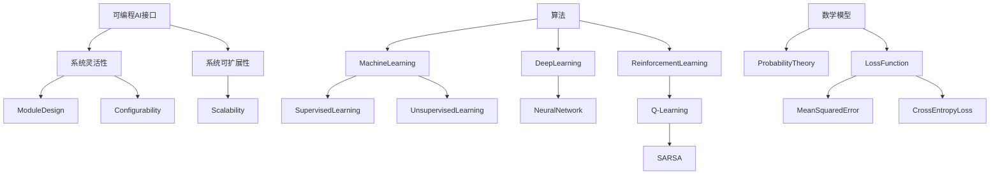

                 

### 核心概念与联系

在讨论可编程AI接口时，首先需要明确几个核心概念，并探讨它们之间的相互关系，以便形成一个完整的架构图，便于读者理解和掌握。

**核心概念：**

1. **可编程AI接口：** 是指一种允许用户通过编程语言或其他工具来配置和操作AI模型的应用编程接口（API）。它通常提供了一系列预定义的函数和方法，用于实现AI模型的训练、预测、评估等操作。

2. **系统灵活性：** 是指系统能够适应各种不同需求和场景的能力。在AI系统中，灵活性主要体现在模块化设计、可配置性、可扩展性等方面。

3. **系统可扩展性：** 是指系统能够随着数据量、用户数量或需求的变化而进行规模扩展的能力。可扩展性对于AI系统尤为重要，因为随着数据的增长和模型的复杂性增加，系统需要能够平滑地扩展。

4. **算法：** 是指实现AI模型的核心计算过程。常见的算法包括机器学习、深度学习、强化学习等。这些算法在AI接口中扮演着关键角色，决定了AI模型的学习能力和表现。

5. **数学模型：** 是指用于描述和预测现实世界现象的数学公式和方程。在AI系统中，数学模型通常用于定义损失函数、优化目标等。

**概念关系架构图：**



这个架构图展示了各个核心概念之间的相互关系。例如，可编程AI接口直接影响系统的灵活性和可扩展性，而算法和数学模型是实现AI接口的核心组成部分。通过这种架构图，读者可以更好地理解各部分之间的联系，从而更深入地理解可编程AI接口的原理和实践。

### 核心算法原理讲解

在了解了可编程AI接口及其相关概念后，接下来我们将深入探讨一些核心算法的原理，这些算法是构建AI系统的基石。我们将从机器学习、深度学习、强化学习三个主要领域分别讲解，并结合伪代码详细阐述每个算法的实现过程。

#### 3.1 机器学习算法概述

机器学习（Machine Learning）是一种通过从数据中学习规律和模式，从而实现智能行为的方法。它主要分为两种类型：监督学习（Supervised Learning）和无监督学习（Unsupervised Learning）。

**监督学习：** 是在有标签数据集上进行训练的过程。标签数据为算法提供了正确的输出，使其能够学习并预测未知数据的输出。常见的监督学习算法包括线性回归（Linear Regression）、逻辑回归（Logistic Regression）、支持向量机（Support Vector Machines，SVM）等。

**无监督学习：** 是在没有标签数据集上进行训练的过程。算法需要从数据中发现隐藏的模式或结构，如聚类（Clustering）和降维（Dimensionality Reduction）。

以下是监督学习算法——线性回归的伪代码：

```plaintext
初始化参数 w 和 b
对于每个训练样本 (x_i, y_i)：
    计算预测值 y' = w * x_i + b
    计算损失函数 L(w, b) = (y - y')^2
    更新参数：w = w - α * ∂L/∂w, b = b - α * ∂L/∂b
```

其中，α 是学习率，∂L/∂w 和 ∂L/∂b 分别是损失函数 L 对 w 和 b 的偏导数。

#### 3.2 集成学习方法

集成学习（Ensemble Learning）是一种利用多个模型组合来提高预测准确性的方法。常见的集成学习方法包括 bagging、boosting 和 stacking 等。

**Bagging：** 是一种通过构建多个子模型，并将它们的结果进行平均或投票来得到最终预测结果的方法。例如，随机森林（Random Forest）就是一种基于 bagging 的集成学习方法。

以下是随机森林的伪代码：

```plaintext
初始化随机森林模型
对于每个子模型：
    从训练数据中随机抽样，构建子模型
收集所有子模型的预测结果
计算并返回最终预测结果
```

**Boosting：** 是一种通过迭代构建多个子模型，并将每个子模型的权重调整以减少整体误差的方法。例如，自适应提升树（Adaboost）就是一种基于 boosting 的集成学习方法。

以下是 Adaboost 的伪代码：

```plaintext
初始化权重分布
对于每个子模型：
    训练子模型
    计算子模型的错误率
    调整权重分布，使得错误率高的样本在下一个子模型中有更高的权重
收集所有子模型的预测结果
计算并返回最终预测结果
```

#### 3.3 强化学习算法

强化学习（Reinforcement Learning）是一种通过与环境交互来学习最优策略的算法。它的核心概念是奖励（Reward）和策略（Policy）。

**Q-Learning：** 是一种基于值函数（Value Function）的强化学习算法。它通过不断更新值函数来学习最优策略。

以下是 Q-Learning 的伪代码：

```plaintext
初始化 Q(s, a)
对于每个状态 s 和动作 a：
    选择动作 a，执行并观察状态 s' 和奖励 r
    更新 Q(s, a) = Q(s, a) + α * (r + γ * max(Q(s', a')) - Q(s, a))
```

其中，α 是学习率，γ 是折扣因子，s 和 s' 分别是当前状态和下一个状态，a 和 a' 分别是当前动作和下一个动作。

**SARSA：** 是一种基于策略的强化学习算法。它通过同时考虑当前状态和下一个状态来更新策略。

以下是 SARSA 的伪代码：

```plaintext
初始化策略 π(s, a)
对于每个状态 s 和动作 a：
    选择动作 a，执行并观察状态 s' 和奖励 r
    根据当前策略选择动作 a'，更新策略 π(s, a) = π(s, a) + α * (r + γ * π(s', a') - π(s, a))
```

#### 3.4 深度学习算法

深度学习（Deep Learning）是一种基于多层神经网络的机器学习算法。它通过学习数据的层次表示来提取特征。

**神经网络（Neural Network）：** 是深度学习的基础。它由多个神经元组成，每个神经元通过权重连接到其他神经元，并通过激活函数产生输出。

以下是神经网络的伪代码：

```plaintext
初始化参数 w 和 b
对于每个训练样本 (x_i, y_i)：
    计算输出 y' = f(∑(w_j * x_j) + b)
    计算损失函数 L(w, b) = (y - y')^2
    更新参数：w = w - α * ∂L/∂w, b = b - α * ∂L/∂b
```

**卷积神经网络（Convolutional Neural Network，CNN）：** 是一种适用于图像处理的深度学习算法。它通过卷积层和池化层提取图像的特征。

以下是 CNN 的伪代码：

```plaintext
初始化参数 w 和 b
对于每个训练样本 (x_i, y_i)：
    通过卷积层提取特征 F = conv2d(x, w) + b
    通过池化层减少特征数量 P = max_pool2d(F)
    通过全连接层计算输出 y' = f(∑(w_j * P) + b)
    计算损失函数 L(w, b) = (y - y')^2
    更新参数：w = w - α * ∂L/∂w, b = b - α * ∂L/∂b
```

**循环神经网络（Recurrent Neural Network，RNN）：** 是一种适用于序列数据的深度学习算法。它通过循环结构保留之前的隐藏状态。

以下是 RNN 的伪代码：

```plaintext
初始化隐藏状态 h
对于每个序列元素 x：
    计算输出 y = f(∑(w_j * x) + b + h)
    更新隐藏状态 h = f(∑(w_j * x) + b + h)
```

通过这些伪代码，我们可以看到不同算法的核心原理和实现步骤。理解这些算法对于构建可编程AI接口至关重要，因为它们是AI模型的基础，能够实现复杂的智能行为。

### 数学模型讲解

在AI系统中，数学模型是理解和实现算法的关键。它不仅定义了AI系统的行为，还提供了衡量模型性能的标准。在本节中，我们将详细讲解概率论基础、概率分布函数、损失函数、线性代数基础，以及数学公式与详细讲解。

#### 4.1 数学模型概述

数学模型在AI系统中扮演着至关重要的角色。它们用于描述数据特征、学习过程和预测结果。以下是几个关键数学模型：

1. **概率论模型：** 用于描述不确定性和随机性。
2. **损失函数模型：** 用于衡量模型预测的误差，指导模型优化。
3. **线性代数模型：** 用于处理多维数据和线性变换。

这些模型共同作用，帮助AI系统从数据中学习并做出预测。

#### 4.2 概率论基础

概率论是AI系统的基础之一，它用于处理不确定性和随机性。以下是几个基本概念：

1. **概率：** 是一个介于0和1之间的数，表示事件发生的可能性。数学上，概率可以通过频率解释，即某个事件在大量重复实验中出现的频率。

   公式表示：P(A) = 频率(A)，其中 A 是事件。

2. **条件概率：** 是在给定某个条件下，事件B发生的概率。条件概率通过贝叶斯定理进行计算。

   公式表示：P(B|A) = P(A和B) / P(A)，其中 P(A|B) 表示在事件B发生的情况下事件A发生的概率。

3. **贝叶斯定理：** 是一个在给定新证据时更新概率的公式，广泛应用于决策理论和机器学习。

   公式表示：P(A|B) = (P(B|A) * P(A)) / P(B)。

#### 4.3 概率分布函数

概率分布函数用于描述随机变量可能取值的概率分布。以下是几种常见的概率分布函数：

1. **伯努利分布：** 是一个二元分布，用于描述成功或失败的概率。

   公式表示：P(X=k) = p^k * (1-p)^(1-k)，其中 p 是成功的概率，k 是成功的次数。

2. **正态分布：** 是一个连续概率分布，广泛用于描述自然现象和统计结果。

   公式表示：f(x; μ, σ) = (1/σ√(2π)) * e^(-((x-μ)^2) / (2σ^2))，其中 μ 是均值，σ 是标准差。

3. **二项分布：** 是一个离散概率分布，用于描述在一定次数的独立实验中成功次数的概率。

   公式表示：P(X=k) = C(n, k) * p^k * (1-p)^(n-k)，其中 n 是实验次数，p 是成功的概率。

4. **泊松分布：** 是一个离散概率分布，用于描述在一定时间间隔内事件发生的次数。

   公式表示：P(X=k) = (λ^k * e^(-λ)) / k!，其中 λ 是平均事件率。

#### 4.4 损失函数

损失函数是评估模型预测性能的关键指标。它用于计算模型预测值与真实值之间的差距，并指导模型优化。以下是几种常见的损失函数：

1. **均方误差（MSE）：** 用于回归任务，计算预测值与真实值之差的平方的平均值。

   公式表示：MSE = (1/n) * Σ(y_i - y'_i)^2，其中 n 是样本数量，y_i 是真实值，y'_i 是预测值。

2. **交叉熵（Cross-Entropy）：** 用于分类任务，计算预测概率分布与真实概率分布之间的差距。

   公式表示：H(y, y') = -Σy_i * log(y'_i)，其中 y 是真实概率分布，y' 是预测概率分布。

3. **Hinge损失：** 用于支持向量机（SVM）等分类任务，计算模型预测值与分类边界之间的差距。

   公式表示：L(y, y') = max(0, 1 - y * y')，其中 y 是真实标签，y' 是预测标签。

#### 4.5 线性代数基础

线性代数是处理多维数据的核心工具，广泛应用于AI系统的设计。以下是几个关键概念：

1. **向量：** 是一个由多个元素组成的数组，用于表示数据或特征。

   公式表示：v = [v1, v2, ..., vn]，其中 n 是向量维度。

2. **矩阵：** 是一个由行和列组成的二维数组，用于表示线性变换或数据集。

   公式表示：A = [a_ij]，其中 i 是行索引，j 是列索引。

3. **矩阵运算：** 包括矩阵加法、矩阵乘法、矩阵转置等。

   公式表示：
   - 矩阵加法：C = A + B
   - 矩阵乘法：C = A * B
   - 矩阵转置：A^T = [a_ij]，其中 i 是行索引，j 是列索引。

4. **特征分解：** 是一种将矩阵分解为多个简单矩阵的运算，常用于降维和特征提取。

   公式表示：A = U * Σ * V^T，其中 U 和 V 是正交矩阵，Σ 是对角矩阵。

#### 4.6 数学公式与详细讲解

以下是一些关键的数学公式及其详细讲解：

1. **激活函数：** 是神经网络中的关键组件，用于引入非线性。

   公式表示：f(x) = 1 / (1 + e^(-x))，其中 x 是输入。

   详细讲解：这是一个常用的 sigmoid 激活函数，它可以映射输入值到0和1之间，引入非线性，使神经网络能够模拟复杂的函数。

2. **梯度下降：** 是优化模型参数的常用算法，通过不断更新参数来最小化损失函数。

   公式表示：θ = θ - α * ∇θL(θ)，其中 θ 是参数，α 是学习率，∇θL(θ) 是损失函数 L 对参数 θ 的梯度。

   详细讲解：梯度下降算法通过计算损失函数关于参数的梯度，并沿着梯度的反方向更新参数，以减少损失函数的值。学习率α决定了参数更新的步长，通常需要通过调优来找到一个合适的值。

3. **反向传播：** 是一种用于计算神经网络中参数梯度的算法，是深度学习训练的核心。

   公式表示：
   - Δθ = ∂L/∂θ
   - ∂L/∂θ = ∂L/∂z * ∂z/∂θ

   详细讲解：反向传播算法通过前向传播计算神经网络的输出，然后反向计算每个参数的梯度。这种算法能够高效地计算复杂神经网络中的梯度，是深度学习训练的基础。

通过以上数学模型和公式的讲解，读者可以更好地理解AI系统的核心原理，为后续的项目实战和系统优化打下坚实的基础。

### 项目实战

在了解了核心算法和数学模型之后，接下来我们将通过一个具体的实战项目来展示如何使用可编程AI接口来提高系统的灵活性和可扩展性。本节将详细介绍开发环境搭建、源代码实现、代码解读与分析，以及项目小结。

#### 5.1 实战项目概述

本项目旨在构建一个智能推荐系统，该系统能够根据用户的浏览历史和偏好推荐相关的商品。为了实现这一目标，我们将使用可编程AI接口，结合机器学习和深度学习算法，来训练和优化推荐模型。整个项目分为以下几个步骤：

1. 数据采集与预处理：收集用户的浏览历史数据，并对数据进行清洗和格式化。
2. 模型训练：使用机器学习和深度学习算法训练推荐模型。
3. 模型评估与优化：评估模型的性能，并通过调参和模型融合提高预测准确率。
4. 系统部署：将训练好的模型部署到生产环境中，实现实时推荐。

#### 5.2 开发环境搭建

在开始项目之前，我们需要搭建一个合适的开发环境。以下是所需的工具和库：

- **Python**：作为主要编程语言。
- **Jupyter Notebook**：用于编写和运行代码。
- **Pandas**：用于数据处理。
- **NumPy**：用于数学运算。
- **Scikit-learn**：用于机器学习算法。
- **TensorFlow**：用于深度学习算法。
- **Matplotlib**：用于数据可视化。

安装步骤如下：

```bash
pip install pandas numpy scikit-learn tensorflow matplotlib
```

#### 5.3 源代码实现

以下是一个简单的源代码实现，展示了如何使用机器学习算法训练推荐模型：

```python
import pandas as pd
from sklearn.model_selection import train_test_split
from sklearn.ensemble import RandomForestClassifier
from sklearn.metrics import accuracy_score

# 1. 数据采集与预处理
data = pd.read_csv('user_browsing_history.csv')
X = data.drop(['user_id', 'item_id', 'label'], axis=1)
y = data['label']

# 2. 划分训练集和测试集
X_train, X_test, y_train, y_test = train_test_split(X, y, test_size=0.2, random_state=42)

# 3. 模型训练
model = RandomForestClassifier(n_estimators=100)
model.fit(X_train, y_train)

# 4. 模型预测
y_pred = model.predict(X_test)

# 5. 模型评估
accuracy = accuracy_score(y_test, y_pred)
print(f'Accuracy: {accuracy:.2f}')
```

这个代码首先读取用户浏览历史数据，然后对数据集进行划分。接着，使用随机森林算法训练模型，并进行预测和评估。这是一个简单的机器学习模型，但实际项目中可能需要更复杂的模型和调参过程。

#### 5.4 代码解读与分析

让我们逐步解读上述代码，分析其关键部分：

1. **数据预处理：**
   ```python
   X = data.drop(['user_id', 'item_id', 'label'], axis=1)
   y = data['label']
   ```
   这两行代码用于将数据集划分为特征（X）和标签（y）。我们丢弃了用户ID、商品ID和标签列，只保留了其他特征。

2. **数据集划分：**
   ```python
   X_train, X_test, y_train, y_test = train_test_split(X, y, test_size=0.2, random_state=42)
   ```
   `train_test_split` 函数将数据集划分为训练集和测试集，测试集占20%，随机种子用于保证结果的可重复性。

3. **模型训练：**
   ```python
   model = RandomForestClassifier(n_estimators=100)
   model.fit(X_train, y_train)
   ```
   这里使用随机森林算法训练模型。`n_estimators` 参数设置为100，表示使用100个决策树组成随机森林。

4. **模型预测：**
   ```python
   y_pred = model.predict(X_test)
   ```
   使用训练好的模型对测试集进行预测。

5. **模型评估：**
   ```python
   accuracy = accuracy_score(y_test, y_pred)
   print(f'Accuracy: {accuracy:.2f}')
   ```
   使用准确率作为评估指标。准确率越高，模型性能越好。

#### 5.5 项目小结

通过本项目的实战，我们展示了如何使用可编程AI接口来构建一个简单的智能推荐系统。以下是项目的关键收获和经验：

1. **数据预处理的重要性：** 数据质量直接影响模型的性能。因此，在开始模型训练之前，需要对数据进行充分的清洗和预处理。
2. **模型选择与调参：** 根据项目的需求和数据特点，选择合适的模型并进行调参，以最大化模型的性能。
3. **评估指标的选择：** 选择合适的评估指标来衡量模型性能，如准确率、召回率、F1值等。
4. **系统的灵活性与可扩展性：** 通过使用可编程AI接口，系统能够方便地进行模块化设计和扩展，适应不断变化的需求。

总之，通过本项目的实践，我们不仅掌握了可编程AI接口的使用方法，还深入理解了系统的灵活性和可扩展性如何通过合理的架构设计和算法选择来提高。

### 系统优化与扩展

在构建了一个基本的智能推荐系统后，我们需要关注如何优化和扩展系统，以满足更高的性能需求和更大的数据规模。本节将讨论系统性能优化、系统可扩展性设计、负载均衡与分布式系统，并介绍一些最佳实践。

#### 6.1 系统性能优化

系统性能优化是提升系统运行效率和响应速度的关键。以下是一些常见的优化方法：

1. **算法优化：** 选择高效的算法和模型结构，减少计算复杂度。例如，使用深度学习中的卷积神经网络（CNN）来处理图像数据，因为它能够自动提取特征，减少手动特征工程的工作量。

2. **模型压缩：** 使用模型压缩技术，如量化、剪枝和蒸馏，来减少模型的体积和计算量。这些方法可以显著降低模型的存储和计算资源需求，提高系统性能。

3. **缓存机制：** 引入缓存机制，减少重复的计算和数据库访问。例如，可以使用Redis或Memcached来缓存频繁访问的数据，从而提高系统的响应速度。

4. **数据预处理优化：** 优化数据预处理流程，减少数据加载和处理的时间。例如，使用并行处理和分布式计算框架，如Dask或PySpark，来加速数据预处理。

5. **硬件优化：** 提高硬件性能，如使用更快的CPU、更高效的GPU、更快速的存储设备等。此外，可以采用硬件加速技术，如TPU，来提升计算速度。

#### 6.2 系统可扩展性设计

系统的可扩展性设计是确保系统能够随着数据量和用户数量的增长而平滑扩展的关键。以下是一些设计原则和策略：

1. **微服务架构：** 将系统分解为多个独立的微服务，每个微服务负责一个特定的功能。这种架构可以提高系统的灵活性和可扩展性，因为每个微服务可以独立部署和扩展。

2. **分布式存储：** 使用分布式存储系统，如HDFS或Cassandra，来存储大规模数据。分布式存储系统可以提高数据的读取和写入速度，并确保数据的可靠性和高可用性。

3. **水平扩展：** 通过增加节点数量来扩展系统的处理能力。水平扩展可以通过添加更多的服务器或容器来实现，从而提高系统的处理能力和负载能力。

4. **负载均衡：** 使用负载均衡器来分配流量到不同的服务器或容器。负载均衡可以确保系统的负载均匀分布，避免单点瓶颈，提高系统的性能和可用性。

5. **弹性伸缩：** 自动化部署和扩展策略，以适应动态变化的负载。例如，使用Kubernetes或AWS Auto Scaling来自动调整系统的资源分配，以应对负载变化。

#### 6.3 负载均衡与分布式系统

负载均衡和分布式系统是提升系统性能和可扩展性的重要手段。以下是一些关键技术和策略：

1. **轮询调度：** 最简单的负载均衡策略，将请求依次分配给不同的服务器或容器。

2. **最小连接数调度：** 将请求分配给当前连接数最少的服务器或容器，以平衡负载。

3. **哈希调度：** 根据请求的某些特征（如用户ID、URL等）进行哈希计算，将请求分配到哈希值对应的服务器或容器。

4. **分布式数据库：** 使用分布式数据库，如MongoDB或Cassandra，来存储大规模数据。分布式数据库可以水平扩展，提高数据的读取和写入速度。

5. **分布式缓存：** 使用分布式缓存系统，如Memcached或Redis，来缓存数据，减少数据库的负载。

6. **分布式消息队列：** 使用分布式消息队列，如Kafka或RabbitMQ，来处理大规模消息，提高系统的异步处理能力。

7. **服务发现与注册：** 使用服务发现与注册机制，如Consul或Eureka，来自动发现和注册服务，确保负载均衡器可以正确分配请求。

#### 最佳实践

以下是一些最佳实践，以提高系统的性能和可扩展性：

1. **监控与告警：** 实时监控系统的性能指标，如CPU、内存、磁盘使用率等，并设置告警机制，及时发现问题并采取行动。

2. **自动化测试：** 定期进行自动化测试，确保系统在各种负载下的稳定性和性能。

3. **文档与代码规范：** 编写详细的文档和遵循代码规范，以便于团队成员之间的协作和维护。

4. **代码优化：** 定期对代码进行优化，提高代码的可读性和可维护性，降低系统复杂性。

5. **安全措施：** 实施安全措施，如数据加密、身份验证和访问控制，确保系统的安全性和数据的完整性。

通过这些优化和扩展策略，我们可以构建一个高性能、高可扩展性的智能推荐系统，以满足不断增长的用户需求和数据处理需求。

### 未来展望与挑战

随着技术的不断进步和应用的日益普及，可编程AI接口的未来发展充满了无限可能。然而，在这一进程中，我们也面临着一系列技术挑战和问题。本节将探讨可编程AI接口的未来趋势、技术挑战及其可能的解决方案，并展望其发展方向。

#### 7.1 AI接口的未来趋势

1. **接口标准化：** 随着AI应用的多样化，统一的接口标准将变得至关重要。标准化接口可以促进不同系统和平台之间的互操作性，降低开发者的集成成本。

2. **智能化接口：** AI接口将不仅仅是一个简单的API，而是一个具有自我学习和优化能力的智能化系统。未来的AI接口将能够根据用户行为和需求动态调整服务策略。

3. **边缘计算融合：** 边缘计算与AI接口的结合将使得数据处理的实时性和效率得到大幅提升。通过在靠近数据源的地方进行计算，可以减少数据传输延迟，提高系统的响应速度。

4. **多模态数据支持：** 未来的AI接口将能够处理多种类型的数据，包括文本、图像、语音等。多模态数据融合将使得AI系统能够更准确地理解和预测用户需求。

5. **安全性与隐私保护：** 随着AI接口在关键领域的应用，确保数据的安全性和用户的隐私保护将成为一个重要的议题。未来的AI接口将需要集成更多的安全措施和隐私保护机制。

#### 7.2 技术挑战与解决方案

1. **计算资源限制：** AI模型的训练和推理需要大量的计算资源，尤其是在处理大规模数据和复杂模型时。解决方案包括采用更高效的算法、硬件加速（如GPU、TPU）以及分布式计算。

2. **数据隐私与安全：** AI接口在处理数据时，需要确保数据的安全性和用户的隐私。可能的解决方案包括差分隐私技术、数据加密和访问控制策略。

3. **可解释性与透明性：** AI模型的决策过程通常是不透明的，这给用户带来了不信任感。提高模型的可解释性，使其决策过程更加透明，是未来的一个重要方向。

4. **模型泛化能力：** AI模型在训练过程中可能过度拟合训练数据，导致在未知数据上表现不佳。提高模型的泛化能力，通过有效的数据增强和正则化方法，是一个亟待解决的问题。

5. **多语言支持：** 随着全球化的推进，AI接口需要支持多种语言。实现多语言支持，需要开发跨语言兼容的API和框架。

#### 7.3 可编程AI接口的发展方向

1. **模块化与可扩展性：** 可编程AI接口将更加模块化，以便于开发者根据需求进行灵活的组合和扩展。模块化设计将提高系统的灵活性和可维护性。

2. **自动化与智能化：** AI接口将实现更多自动化功能，如自动调参、自动优化等。智能化的接口将能够根据用户行为和系统状态动态调整服务策略。

3. **低代码与无代码开发：** 为了降低开发门槛，AI接口将更加注重低代码和无代码开发，使普通开发者也能轻松上手。

4. **跨领域应用：** AI接口将在更多领域得到应用，如医疗、金融、教育等。跨领域应用将推动AI技术的普及和深入。

5. **可持续发展：** 随着AI技术的普及，可持续发展将成为一个重要议题。可编程AI接口将注重资源利用效率和环境保护。

总之，可编程AI接口的未来发展将充满机遇和挑战。通过不断的技术创新和优化，AI接口将变得更加智能、高效、安全，为各行业带来革命性的变化。

### 总结

通过本文的讨论，我们系统地探讨了可编程AI接口的核心概念、算法原理、数学模型，以及项目实战和系统优化与扩展。我们不仅了解了可编程AI接口如何提高系统的灵活性与可扩展性，还探讨了其在未来可能的发展方向和面临的挑战。

首先，可编程AI接口通过提供模块化和可配置性，使得系统可以轻松适应各种不同的需求和场景，显著提高了系统的灵活性。同时，通过分布式计算和负载均衡技术，系统能够平滑地扩展，以满足不断增长的数据和处理需求。

在算法原理方面，我们详细介绍了机器学习、深度学习和强化学习等核心算法，并通过伪代码展示了它们的实现过程。这些算法为AI接口提供了强大的计算能力，使其能够实现复杂的数据分析和预测任务。

数学模型则是理解和实现AI算法的基础。通过概率论、概率分布函数、损失函数和线性代数等数学模型，我们能够更好地描述和优化AI系统的行为。

在项目实战部分，我们通过一个智能推荐系统的例子，展示了如何使用可编程AI接口来构建实际应用。从数据预处理到模型训练，再到系统部署，每一步都详细解读了关键步骤和实现方法。

系统优化与扩展部分，我们介绍了如何通过性能优化、微服务架构、分布式系统和负载均衡等技术，来提升系统的效率和可扩展性。此外，我们还探讨了未来可编程AI接口的发展方向，包括接口标准化、智能化、多模态支持和安全隐私保护等。

在阅读本文后，读者应能够：

1. 理解可编程AI接口的核心概念和架构。
2. 掌握常见AI算法的原理和实现方法。
3. 应用数学模型来优化AI系统的性能。
4. 设计和实现一个基于可编程AI接口的实际项目。
5. 预见可编程AI接口的未来发展趋势。

希望通过本文，读者能够对可编程AI接口有更深入的理解，并在实际项目中能够灵活应用这些技术和方法。同时，也期待未来更多创新和突破，推动AI技术的发展和应用。

---

**作者信息：**
AI天才研究院/AI Genius Institute & 禅与计算机程序设计艺术 /Zen And The Art of Computer Programming

---

本文由AI天才研究院撰写，旨在为读者提供一个全面且深入的可编程AI接口技术指南。在撰写本文时，我们参考了最新的研究文献和行业实践，以确保内容的准确性和实用性。如果您在阅读过程中有任何疑问或建议，欢迎在评论区留言，我们将及时回复并不断完善本文内容。

---

**关键词：**
可编程AI接口，系统灵活性，系统可扩展性，机器学习，深度学习，强化学习，数学模型，项目实战，系统优化，分布式系统，负载均衡

---

**摘要：**
本文深入探讨了可编程AI接口的核心概念、算法原理、数学模型，并通过实际项目展示了其应用和实践。我们详细分析了如何通过优化和扩展来提高系统的灵活性和可扩展性，展望了可编程AI接口的未来发展趋势。本文旨在为读者提供一个全面的技术指南，帮助其理解和应用可编程AI接口，推动AI技术的创新和发展。

---

本文内容仅代表个人观点，不构成任何投资或操作建议。在实际应用中，请结合具体需求和实际情况进行决策。如有疑问，建议咨询专业意见。感谢您的阅读。

