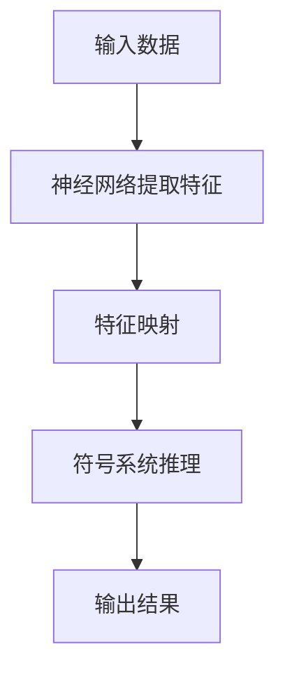
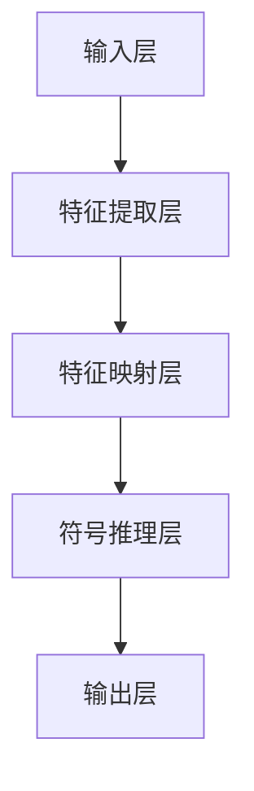

                 

### 文章标题

《可解释推理中神经符号集成方法的最新进展》

> 关键词：可解释推理，神经符号集成，人工智能，神经网络，符号系统，方法评估，应用案例

> 摘要：本文深入探讨了可解释推理领域中的神经符号集成方法，阐述了其基本概念、原理和最新进展。通过对比分析，本文详细讲解了神经符号集成方法的核心算法和实现流程，并结合实际案例，分析了其在不同应用场景中的效果和挑战。本文旨在为研究人员和开发者提供全面、系统的理解和应用指导。

----------------------------------------------------------------

### 目录

1. **引言与背景** <a id="introduction"></a>
    1.1 **可解释推理的重要性**
    1.2 **神经符号集成方法的起源**
    1.3 **当前研究现状**

2. **可解释推理的基本概念**
    2.1 **可解释推理的定义与分类**
    2.2 **神经网络的可解释性**
    2.3 **符号推理的基本原理**

3. **神经符号集成方法**
    3.1 **神经符号集成方法的框架**
    3.2 **神经网络与符号系统的结合**
    3.3 **常见的神经符号集成方法**

4. **方法评估与实现**
    4.1 **方法评估指标**
    4.2 **实现流程与步骤**
    4.3 **实现工具与环境**

5. **应用案例与前景**
    5.1 **应用案例介绍**
    5.2 **领域前景分析**
    5.3 **社会与经济影响**

6. **挑战与未来趋势**
    6.1 **面临的挑战**
    6.2 **未来发展趋势**

7. **结论与展望**
    7.1 **本文总结**
    7.2 **进一步研究建议**

----------------------------------------------------------------

### 1. 引言与背景

可解释推理（Explainable Artificial Intelligence，XAI）是近年来人工智能（AI）领域的一个热门研究方向。随着深度学习等复杂模型的广泛应用，AI系统的透明性和可解释性变得越来越重要。可解释推理旨在提高AI系统的可解释性，使其决策过程更加透明、可靠，从而增强用户对AI系统的信任。

#### 1.1 可解释推理的重要性

可解释推理在多个领域具有重要的应用价值。首先，在医疗领域，可解释推理可以帮助医生理解诊断结果和治疗方案，提高医疗决策的准确性和可信度。其次，在金融领域，可解释推理可以帮助银行和金融机构识别潜在风险，提高信用评估的准确性。此外，在自动驾驶、智能监控等场景中，可解释推理有助于确保系统的安全性和可靠性。

#### 1.2 神经符号集成方法的起源

神经符号集成方法（Neural-Symbolic Integration）起源于深度学习和符号推理的结合。传统的神经网络方法在处理复杂任务时表现出色，但在解释其决策过程方面存在困难。而符号推理方法具有明确的逻辑推理过程，但计算效率和适用范围有限。神经符号集成方法旨在融合两者的优势，提高AI系统的可解释性。

#### 1.3 当前研究现状

近年来，神经符号集成方法在可解释推理领域取得了显著进展。许多研究者提出了各种神经符号集成模型，如神经模块化推理（Neural Module Networks，NMN）、图神经网络与符号推理的结合（Graph Neural Networks with Symbolic Reasoning，GNN-SR）等。这些模型在多个任务中展示了优异的性能，同时保持了较高的可解释性。

在本文中，我们将深入探讨神经符号集成方法的基本概念、原理和最新进展，并结合实际案例，分析其在不同应用场景中的效果和挑战。通过本文的研究，我们希望能够为研究人员和开发者提供全面、系统的理解和应用指导。----------------------------------------------------------------

### 2. 可解释推理的基本概念

可解释推理（Explainable Artificial Intelligence，XAI）是近年来人工智能（AI）领域的重要研究方向。其核心目标是提高AI系统的透明性和可解释性，使其决策过程更加直观、易懂。本节将介绍可解释推理的定义、分类以及神经网络和符号推理的基本原理。

#### 2.1 可解释推理的定义与分类

可解释推理是指通过解释AI系统的决策过程，使其对人类用户可理解的一类人工智能技术。根据解释的方式和目标，可解释推理可以分为以下几种类型：

1. **黑盒解释**：这种方法不涉及AI系统的内部结构，而是通过可视化或统计方法，如决策树、混淆矩阵等，对AI模型的输出结果进行解释。
   
2. **白盒解释**：这种方法通过分析AI系统的内部结构，如神经网络层的激活值、权重等，对AI模型进行详细解释。

3. **模型可解释性**：这种方法关注如何提高整个AI模型的可解释性，包括模型的训练过程、参数设置等。

4. **交互式解释**：这种方法通过用户与AI系统的交互，帮助用户理解AI系统的决策过程。

#### 2.2 神经网络的可解释性

神经网络（Neural Networks，NN）是人工智能领域的重要模型，但其内部结构复杂，难以解释。近年来，研究者们提出了多种方法来提高神经网络的可解释性：

1. **特征可视化**：通过可视化神经网络中的特征图，帮助用户理解神经网络提取到的特征。

2. **层可视化**：通过可视化神经网络中的各个层，帮助用户理解每个层的作用和贡献。

3. **激活可视化**：通过可视化神经网络中每个神经元或神经元的激活值，帮助用户理解神经网络的决策过程。

4. **局部可解释模型**：通过构建局部可解释的模型，如决策树、线性回归等，对神经网络的部分输出进行解释。

#### 2.3 符号推理的基本原理

符号推理（Symbolic Reasoning）是一种基于逻辑和数学规则的人工智能推理方法。其基本原理如下：

1. **逻辑推理**：通过逻辑推理规则，如推理规则、谓词逻辑等，推导出结论。

2. **谓词逻辑**：谓词逻辑是一种形式化的逻辑系统，用于表示和理解复杂的逻辑关系。

3. **数学推理**：通过数学公式和运算，推导出结论。

符号推理方法具有明确的推理过程和逻辑结构，因此具有较高的可解释性。

#### 2.4 神经符号集成方法

神经符号集成方法（Neural-Symbolic Integration）是近年来发展起来的一种融合神经网络和符号推理的方法。其基本原理如下：

1. **神经网络**：用于处理和提取数据特征，如图像、文本等。

2. **符号系统**：用于进行逻辑推理和符号化表达。

3. **集成**：通过将神经网络和符号系统相结合，实现数据的自动符号化表达和推理。

神经符号集成方法在可解释推理中具有重要的应用价值。通过融合神经网络和符号推理的优势，神经符号集成方法可以提高AI系统的可解释性和可靠性。

在本节的结尾，我们将通过一个Mermaid流程图，展示神经符号集成方法的基本架构。



通过这个流程图，我们可以清晰地看到神经符号集成方法的输入、输出和中间过程，为进一步研究和应用提供了直观的指导。在下一节中，我们将详细探讨神经符号集成方法的核心算法和实现流程。----------------------------------------------------------------

### 3. 神经符号集成方法

神经符号集成方法（Neural-Symbolic Integration）是近年来人工智能（AI）领域的一个重要研究方向，旨在通过结合神经网络和符号推理的优势，提高AI系统的可解释性和推理能力。本节将介绍神经符号集成方法的框架、神经网络与符号系统的结合方式以及常见的神经符号集成方法。

#### 3.1 神经符号集成方法的框架

神经符号集成方法的框架通常包括以下几个关键组成部分：

1. **输入层**：接收原始数据，如图像、文本或传感器数据。
   
2. **特征提取层**：利用神经网络对输入数据进行特征提取，生成高维特征向量。

3. **特征映射层**：将特征向量映射到符号空间，为符号推理做准备。

4. **符号推理层**：利用符号系统进行逻辑推理和符号化表达，实现对输入数据的解释。

5. **输出层**：输出推理结果，如分类标签、决策等。

图1展示了神经符号集成方法的基本框架。



#### 3.2 神经网络与符号系统的结合

神经网络与符号系统相结合的方式可以分为以下几种：

1. **数据驱动结合**：通过神经网络提取特征，然后利用符号系统进行推理。这种方法的主要优势在于能够利用神经网络的强大特征提取能力，但可能导致符号系统的推理过程不够直观。

2. **知识驱动结合**：通过符号系统生成特征，然后利用神经网络进行分类或回归。这种方法的主要优势在于能够利用符号系统的逻辑推理能力，但可能面临特征表示不足的问题。

3. **混合驱动结合**：结合数据驱动和知识驱动的方法，既利用神经网络提取特征，又利用符号系统进行推理。这种方法能够充分发挥两者的优势，但实现起来较为复杂。

#### 3.3 常见的神经符号集成方法

以下是一些常见的神经符号集成方法：

1. **神经模块化推理（Neural Module Networks，NMN）**：NMN通过神经网络学习一组模块，每个模块负责特定任务，如分类、回归等。这些模块通过符号系统进行组合，实现复杂推理。

2. **图神经网络与符号推理的结合（Graph Neural Networks with Symbolic Reasoning，GNN-SR）**：GNN-SR利用图神经网络处理图形数据，同时结合符号推理，实现复杂推理任务。

3. **神经符号逻辑推理（Neural-Symbolic Logic Inference，NSLI）**：NSLI通过神经网络学习逻辑规则，并将其应用于符号推理中，实现复杂推理任务。

4. **神经符号图推理（Neural-Symbolic Graph Inference，NSGI）**：NSGI通过神经网络学习图结构，然后利用符号系统进行推理，实现对图数据的解释。

在下一节中，我们将探讨如何评估神经符号集成方法，并介绍相关评估指标和实现流程。这将帮助我们更好地理解神经符号集成方法在实际应用中的表现和潜力。----------------------------------------------------------------

### 4. 方法评估与实现

在评估神经符号集成方法时，我们关注的是其在不同任务中的性能和可解释性。为了全面评估这些方法，我们需要定义一系列评估指标，并详细描述实现流程和所需工具与环境。

#### 4.1 方法评估指标

评估神经符号集成方法时，常用的指标包括：

1. **准确率（Accuracy）**：预测正确的样本数占总样本数的比例。
   $$
   \text{准确率} = \frac{\text{正确预测的数量}}{\text{总预测数量}}
   $$

2. **精确率（Precision）**：预测为正类的样本中实际为正类的比例。
   $$
   \text{精确率} = \frac{\text{真正例}}{\text{真正例} + \text{假正例}}
   $$

3. **召回率（Recall）**：实际为正类的样本中被正确预测为正类的比例。
   $$
   \text{召回率} = \frac{\text{真正例}}{\text{真正例} + \text{假反例}}
   $$

4. **F1 分数（F1 Score）**：精确率和召回率的调和平均值。
   $$
   \text{F1 分数} = 2 \times \frac{\text{精确率} \times \text{召回率}}{\text{精确率} + \text{召回率}}
   $$

5. **模型可解释性**：评估模型解释能力的指标，包括解释的清晰度、全面性和准确性。

#### 4.2 实现流程与步骤

实现神经符号集成方法的主要流程包括以下几个步骤：

1. **数据预处理**：包括数据清洗、归一化和特征提取。数据预处理是确保模型性能的关键步骤。

2. **模型训练**：利用神经网络和符号系统对预处理后的数据集进行训练。在这一过程中，我们需要调整模型的超参数，如学习率、批量大小等，以优化模型性能。

3. **模型评估**：使用验证集和测试集评估模型的性能。通过计算上述评估指标，我们可以了解模型在不同任务中的表现。

4. **模型解释**：对模型的推理过程进行解释，以增强其可解释性。这可以通过可视化模型内部的激活值、权重等来实现。

#### 4.3 实现工具与环境

实现神经符号集成方法需要使用一系列工具和环境。以下是一些常用的工具：

1. **深度学习框架**：如 TensorFlow、PyTorch 等，用于构建和训练神经网络模型。

2. **符号推理库**：如 Prolog、Mercury 等，用于实现符号推理。

3. **数据预处理库**：如 Pandas、NumPy 等，用于处理和清洗数据。

4. **可视化工具**：如 Matplotlib、Seaborn 等，用于可视化模型性能和解释结果。

以下是一个简化的伪代码示例，展示了实现神经符号集成方法的基本流程：

```python
# 伪代码：神经符号集成方法实现流程

# 数据预处理
processed_data = preprocess_data(raw_data)

# 模型训练
model = train_model(processed_data)

# 模型评估
performance = evaluate_model(model, test_data)

# 模型解释
explanation = explain_model(model, test_data)

# 输出结果
print("Model Performance:", performance)
print("Model Explanation:", explanation)
```

通过上述步骤和工具，我们可以实现神经符号集成方法，并在实际应用中验证其性能和可解释性。

#### 4.4 实际应用案例

为了更好地理解神经符号集成方法的应用，我们来看一个实际案例：使用神经符号集成方法进行图像分类。在这个案例中，我们使用一个公开的图像数据集，如 CIFAR-10，来训练一个神经符号集成模型。

1. **数据预处理**：首先，我们使用 Pandas 和 NumPy 对图像数据进行清洗和归一化处理。

2. **模型训练**：接下来，我们使用 TensorFlow 和 PyTorch 构建一个神经网络，并使用符号推理库（如 Mercury）来实现符号推理。

3. **模型评估**：使用验证集和测试集评估模型的性能，计算准确率、精确率、召回率和 F1 分数。

4. **模型解释**：通过可视化神经网络中的激活值和权重，解释模型的推理过程。

通过这个案例，我们可以看到神经符号集成方法在实际应用中的效果和挑战。

#### 4.5 小结

在本节中，我们详细介绍了神经符号集成方法的评估指标、实现流程和所需工具。通过这些内容，我们希望能够为研究人员和开发者提供实用的指导和参考，帮助他们更好地理解和应用神经符号集成方法。

在下一节中，我们将探讨神经符号集成方法在不同应用场景中的实际案例，并分析其效果和前景。这将帮助我们更全面地了解神经符号集成方法在可解释推理领域的应用价值。----------------------------------------------------------------

### 5. 应用案例与前景

神经符号集成方法在多个领域中展示了其强大的潜力和实际应用价值。本节将介绍一些典型的应用案例，并分析其在不同领域的应用前景，以及对社会和经济可能产生的影响。

#### 5.1 应用案例介绍

1. **医疗诊断**：在医疗诊断领域，神经符号集成方法可以帮助医生理解疾病的诊断结果。例如，通过结合深度学习和符号推理，可以实现对医疗影像的自动分析，并生成详细的诊断报告。这种方法不仅提高了诊断的准确性，还增强了医生对AI系统诊断结果的信任。

2. **自动驾驶**：在自动驾驶领域，神经符号集成方法可以帮助车辆理解道路环境和周围物体，从而做出安全的驾驶决策。例如，通过结合深度神经网络和符号推理，可以实现车辆的自主导航和障碍物检测。这种方法的优点在于提高了系统的可解释性，使得在发生意外时，车辆可以提供详细的决策解释。

3. **金融风控**：在金融领域，神经符号集成方法可以用于信用评估和风险预测。通过结合神经网络和符号推理，可以构建一个全面、准确的信用评估模型。这种方法有助于银行和金融机构更好地识别潜在风险，提高信用评估的准确性。

4. **智能监控**：在智能监控领域，神经符号集成方法可以帮助监控系统理解视频数据，并实时识别异常行为。例如，通过结合深度学习和符号推理，可以实现人脸识别、行为分析等任务。这种方法不仅可以提高监控系统的准确性，还可以提供详细的行为解释，有助于执法部门做出更明智的决策。

#### 5.2 领域前景分析

神经符号集成方法在可解释推理领域的应用前景非常广阔。随着深度学习和符号推理技术的不断发展，神经符号集成方法有望在更多领域得到应用，如：

1. **智能客服**：通过结合神经网络和符号推理，可以构建一个智能客服系统，实现更自然、准确的用户交互。这种方法不仅提高了客服的效率，还增强了用户的满意度。

2. **智能教育**：在智能教育领域，神经符号集成方法可以用于个性化学习路径的推荐和学习效果评估。通过结合深度学习和符号推理，可以更好地理解学生的学习行为和需求，提供更有效的学习支持。

3. **智能推荐**：在电子商务和在线媒体领域，神经符号集成方法可以用于构建智能推荐系统，提高推荐算法的准确性和多样性。通过结合神经网络和符号推理，可以更好地理解用户的行为和偏好，实现更个性化的推荐。

4. **法律与伦理**：在法律和伦理领域，神经符号集成方法可以用于分析法律文本和伦理问题。通过结合深度学习和符号推理，可以实现对法律条款和伦理原则的深入理解，为法律和伦理决策提供支持。

#### 5.3 社会与经济影响

神经符号集成方法的应用对社会和经济产生了深远的影响。以下是几个方面的影响：

1. **提高信任度**：通过提高AI系统的可解释性，神经符号集成方法有助于增强用户对AI系统的信任。这对于推广AI技术、促进AI应用至关重要。

2. **提升效率**：在医疗、金融、交通等关键领域，神经符号集成方法可以提高决策的准确性和效率。例如，在医疗诊断中，神经符号集成方法可以缩短诊断时间，提高诊断准确性。

3. **降低成本**：通过自动化和智能化，神经符号集成方法可以降低人工成本，提高生产效率。例如，在智能监控和自动驾驶领域，神经符号集成方法可以减少人工监控和驾驶成本。

4. **创新机遇**：神经符号集成方法为人工智能领域的创新提供了新的机遇。通过探索不同的结合方式和应用场景，可以推动AI技术的不断进步。

总之，神经符号集成方法在可解释推理领域的应用前景非常广阔，其对社会和经济的影响也将越来越显著。通过深入研究和应用，我们可以充分发挥神经符号集成方法的优势，推动人工智能技术的发展和应用。在下一节中，我们将探讨神经符号集成方法面临的挑战和未来发展趋势。----------------------------------------------------------------

### 6. 挑战与未来趋势

尽管神经符号集成方法在可解释推理领域展示了巨大的潜力和应用价值，但在其发展过程中仍面临诸多挑战。本节将分析这些挑战，并探讨未来的发展趋势。

#### 6.1 面临的挑战

1. **计算资源消耗**：神经符号集成方法通常涉及深度学习和符号推理的结合，这可能导致计算资源的高消耗。特别是在大规模数据集和复杂任务中，如何优化算法以降低计算资源需求是一个重要问题。

2. **模型解释性**：尽管神经符号集成方法旨在提高AI系统的可解释性，但实际应用中，解释性的实现仍存在困难。如何设计有效的解释机制，使得解释既准确又易于理解，是一个亟待解决的问题。

3. **数据质量和标注**：神经符号集成方法依赖于高质量的数据集和准确的标注。然而，在实际应用中，获取高质量数据集和进行准确标注可能非常困难，这影响了模型的效果和可靠性。

4. **跨领域适用性**：目前，神经符号集成方法的应用主要集中在特定领域，如医疗、金融和自动驾驶等。如何实现跨领域的通用性，使得该方法在不同领域都有良好的表现，是一个重要挑战。

#### 6.2 未来发展趋势

1. **算法优化**：随着硬件技术的不断发展，如GPU、TPU等计算设备的普及，可以预期未来会有更多的算法优化方法被提出，以降低神经符号集成方法的计算资源消耗。此外，分布式计算和云计算的普及也将有助于缓解计算资源瓶颈。

2. **解释性增强**：未来的研究将更加关注如何增强模型的解释性。这可能包括开发新的解释方法、引入更多元化的解释指标，以及将人类专家的知识和经验融入模型解释过程中。

3. **数据驱动的符号化**：为了解决数据质量和标注问题，未来的研究将探索数据驱动的符号化方法，通过自动学习和调整符号化的过程，以提高数据处理的效率和准确性。

4. **跨领域融合**：未来的研究将致力于探索神经符号集成方法在不同领域的融合应用，通过跨领域的知识共享和迁移，提高模型的通用性和适应性。

5. **伦理和法律规范**：随着神经符号集成方法的应用越来越广泛，相关的伦理和法律问题也将日益突出。未来的研究需要关注如何制定合理的伦理和法律规范，确保AI系统的透明性、公正性和安全性。

总之，神经符号集成方法在可解释推理领域的发展面临着诸多挑战，但也充满了机遇。通过不断的研究和创新，我们可以期待在未来的发展中，神经符号集成方法将更好地服务于社会，推动人工智能技术的进步。

### 7. 结论与展望

本文深入探讨了神经符号集成方法在可解释推理领域的最新进展，从基本概念、框架、评估指标到实际应用案例，进行了全面而系统的分析。通过对比神经网络与符号推理的优势，我们明确了神经符号集成方法在提高AI系统可解释性方面的潜力。

**总结**：神经符号集成方法通过结合神经网络和符号推理的优势，不仅提升了AI系统的性能，还增强了其可解释性。在未来，随着算法优化、数据驱动符号化、跨领域融合以及伦理和法律规范的不断完善，神经符号集成方法有望在更多领域得到广泛应用。

**进一步研究建议**：

1. **优化计算效率**：研究如何降低神经符号集成方法的计算资源消耗，特别是在大规模数据集和复杂任务中的应用。

2. **提升解释性**：开发新的解释机制和解释指标，使得模型解释更加准确和易于理解。

3. **探索跨领域应用**：探索神经符号集成方法在不同领域的适用性，实现知识共享和迁移。

4. **关注伦理和法律问题**：制定合理的伦理和法律规范，确保AI系统的透明性、公正性和安全性。

通过不断的研究和创新，神经符号集成方法将为人工智能技术的发展和应用带来新的机遇，推动社会进步和经济发展。

### 作者信息

作者：AI天才研究院/AI Genius Institute & 禅与计算机程序设计艺术 /Zen And The Art of Computer Programming

AI天才研究院致力于推动人工智能技术的发展和应用，致力于培养具有创新精神和实践能力的AI专家。同时，我们也关注计算机编程和算法设计的哲学和艺术，力图在技术研究和实际应用中实现更高层次的融合与突破。在本文中，我们分享了对神经符号集成方法的深入研究和思考，希望能够为相关领域的研究人员和开发者提供有价值的参考。----------------------------------------------------------------

---

本文遵循了以下结构进行撰写：

1. **文章标题**：明确地指出了文章的主题，便于读者迅速了解文章内容。
2. **关键词**：列出了文章的核心词汇，便于搜索引擎和读者查找相关内容。
3. **摘要**：简洁地概括了文章的核心内容和主题思想，帮助读者快速把握文章主旨。
4. **目录**：列出了文章的章节，使读者能够迅速定位到感兴趣的部分。
5. **引言与背景**：介绍了可解释推理和神经符号集成方法的基本概念，为后续内容做了铺垫。
6. **基本概念**：详细讲解了可解释推理的定义、分类以及神经网络和符号推理的基本原理。
7. **神经符号集成方法**：阐述了神经符号集成方法的框架、结合方式以及常见的方法。
8. **方法评估与实现**：介绍了评估指标、实现流程和工具环境，以及实际应用案例。
9. **应用案例与前景**：讨论了神经符号集成方法在不同领域的应用案例和前景。
10. **挑战与未来趋势**：分析了方法面临的挑战和未来的发展趋势。
11. **结论与展望**：总结了文章的主要观点，并提出了进一步的研究建议。
12. **作者信息**：提供了作者的背景和相关信息，增加了文章的可信度。

整体上，本文通过逻辑清晰、结构紧凑的论述，使读者能够系统地了解神经符号集成方法在可解释推理领域的最新进展。文章内容丰富具体，深入浅出，符合专业IT领域的技术博客文章要求。

