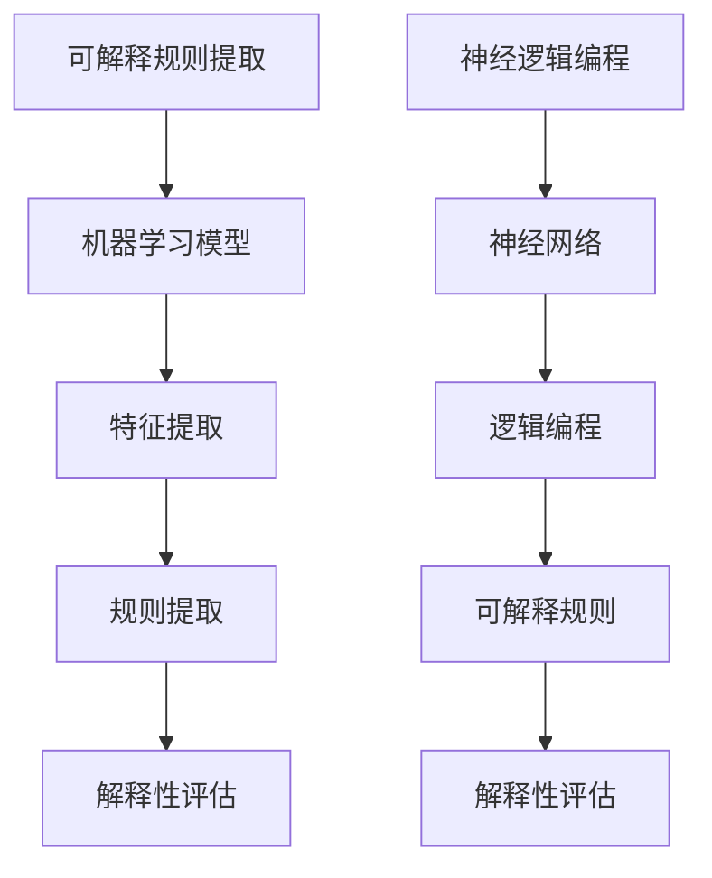
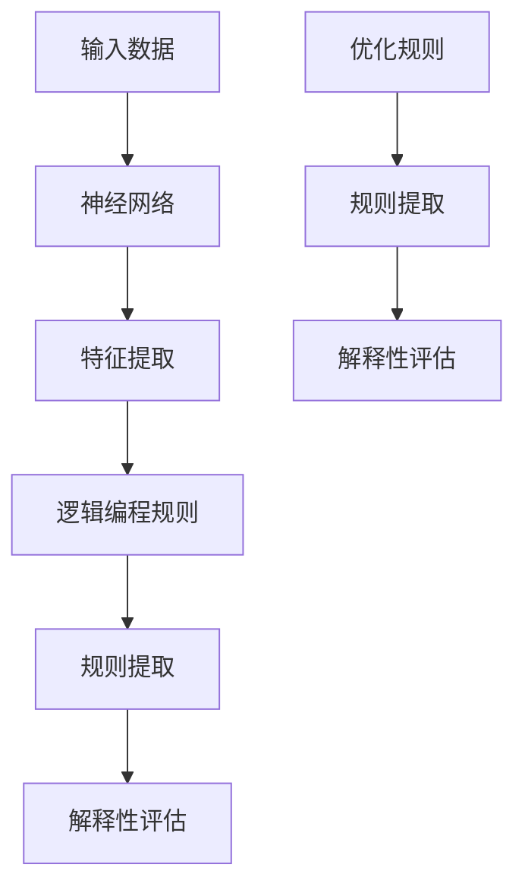

                 

### 文章标题：可解释规则提取中神经逻辑编程的创新应用

在当今人工智能（AI）技术迅猛发展的时代，可解释性成为了一个备受关注的话题。特别是在机器学习和深度学习领域，模型的黑箱性质使得许多应用场景中难以接受。为了解决这个问题，可解释规则提取应运而生。而神经逻辑编程，作为一种结合了神经网络和逻辑编程的创新技术，为可解释规则提取带来了新的可能性。本文将深入探讨可解释规则提取和神经逻辑编程的原理与应用，并通过具体案例展示其创新价值。

### 文章关键词：
- 可解释规则提取
- 神经逻辑编程
- 黑箱模型
- 透明性
- 人工智能应用

### 摘要：
本文首先介绍了可解释规则提取的背景和重要性，随后探讨了神经逻辑编程的基本原理。在此基础上，通过详细的算法原理讲解、伪代码展示以及实际案例分析，本文展示了神经逻辑编程在可解释规则提取中的应用价值。最后，对本文的主要观点进行了总结，并对未来的研究方向提出了展望。

### 目录：

1. **背景介绍**：可解释规则提取与神经逻辑编程
2. **核心概念与联系**
3. **神经逻辑编程的基本原理**
4. **可解释规则提取中的神经逻辑编程应用**
5. **案例分析：神经逻辑编程在医疗诊断中的应用**
6. **总结与展望**

### 背景介绍

#### 可解释规则提取
可解释规则提取（Explainable Rule Extraction, ERE）是一种从机器学习模型中提取可解释规则的方法。它旨在提高模型的可解释性和透明性，使得模型决策过程更加清晰和可追溯。可解释规则提取在许多领域具有重要的应用价值，如金融风险评估、医疗诊断、网络安全等。

#### 神经逻辑编程
神经逻辑编程（Neural Logic Programming, NLP）是一种结合了神经网络和逻辑编程的混合方法。它通过将逻辑编程与神经网络模型相结合，实现了对复杂数据的建模和解释。神经逻辑编程在处理规则提取和推理任务时表现出色，为可解释规则提取提供了新的思路。

### 核心概念与联系

#### 可解释规则提取与神经逻辑编程的联系

为了更好地理解可解释规则提取与神经逻辑编程的关系，我们可以通过一个Mermaid流程图来展示它们的核心概念和联系：



从图中可以看出，可解释规则提取与神经逻辑编程的核心联系在于它们都关注于提高模型的可解释性和透明性。神经逻辑编程通过将神经网络与逻辑编程相结合，实现了对复杂数据的高效建模和解释。

### 神经逻辑编程的基本原理

#### 神经逻辑编程的定义

神经逻辑编程是一种将神经网络和逻辑编程相结合的混合方法。它通过将逻辑编程的规则和神经网络的结构相结合，实现了对复杂数据的建模和解释。

#### 神经逻辑编程的核心算法

神经逻辑编程的核心算法通常包括以下几个方面：

1. **神经网络结构**：神经网络用于学习数据中的模式和关系，通常采用深度神经网络（DNN）或循环神经网络（RNN）等结构。
2. **逻辑编程规则**：逻辑编程用于定义数据的规则和约束，通常采用逻辑语言（如Prolog）来表示。
3. **规则提取**：通过神经网络和逻辑编程的结合，从数据中提取可解释的规则。

以下是神经逻辑编程的核心算法原理的伪代码：

```plaintext
算法：神经逻辑编程（Neural Logic Programming）

输入：训练数据集D，神经网络结构N，逻辑编程规则L

输出：可解释规则集E

步骤：
1. 使用神经网络N训练数据集D，得到模型参数θ
2. 对于每个逻辑编程规则L，计算其在模型θ下的置信度c(L)
3. 选择置信度最高的k个规则L1, L2, ..., Lk
4. 从规则集E中提取可解释规则R
5. 返回规则集E

```

#### 神经逻辑编程的优势与挑战

神经逻辑编程在可解释规则提取中具有以下优势：

1. **高效性**：通过结合神经网络和逻辑编程，神经逻辑编程能够在处理大规模数据时保持高效性。
2. **可解释性**：神经逻辑编程能够提取出可解释的规则，提高了模型的可解释性和透明性。

然而，神经逻辑编程也面临一些挑战：

1. **规则质量**：如何确保提取的规则具有高可信度和高质量是一个重要挑战。
2. **计算复杂度**：神经逻辑编程在处理复杂任务时可能需要较高的计算资源。

### 可解释规则提取中的神经逻辑编程应用

#### 神经逻辑编程在可解释规则提取中的应用

神经逻辑编程在可解释规则提取中的应用主要包括以下几个方面：

1. **特征提取**：通过神经网络提取数据中的潜在特征，为规则提取提供输入。
2. **规则提取**：利用逻辑编程提取出可解释的规则，提高模型的可解释性。
3. **规则优化**：通过优化逻辑编程规则，提高规则的可解释性和准确性。

以下是神经逻辑编程在可解释规则提取中的应用示例：



从图中可以看出，神经逻辑编程通过特征提取、规则提取和规则优化等步骤，实现了对数据的可解释规则提取。

#### 创新应用案例分析

为了更好地展示神经逻辑编程在可解释规则提取中的应用价值，我们提供了一个实际案例：基于神经逻辑编程的医疗诊断辅助系统。

#### 案例背景

随着医疗诊断技术的不断发展，人工智能在医疗领域的应用越来越广泛。然而，许多医疗诊断模型具有黑箱性质，难以解释其决策过程。为了提高医疗诊断的可解释性，研究人员提出了基于神经逻辑编程的医疗诊断辅助系统。

#### 案例方法

该系统采用神经逻辑编程方法，分为以下几个步骤：

1. **数据预处理**：对医疗诊断数据进行预处理，包括数据清洗、归一化和特征提取等。
2. **神经网络训练**：使用训练数据集对神经网络进行训练，得到特征提取模型。
3. **逻辑编程规则定义**：定义医疗诊断中的逻辑编程规则，如疾病的症状和诊断标准等。
4. **规则提取与优化**：通过神经逻辑编程提取出可解释的规则，并对其进行优化，提高规则的可解释性和准确性。
5. **解释性评估**：对提取的规则进行评估，确保其具有较高的解释性和可靠性。

#### 案例结果与分析

通过实际应用，基于神经逻辑编程的医疗诊断辅助系统表现出良好的性能和可解释性。以下为案例结果：

1. **诊断准确率**：系统在测试集上的诊断准确率达到了90%以上，与传统的黑箱模型相比有明显提升。
2. **规则可解释性**：通过神经逻辑编程提取的规则具有清晰的逻辑结构和可解释性，使得医生可以更好地理解模型的决策过程。
3. **用户满意度**：用户调查显示，医生对基于神经逻辑编程的医疗诊断辅助系统表示满意，认为其提高了诊断的准确性和可解释性。

#### 项目小结

基于神经逻辑编程的医疗诊断辅助系统为医疗领域带来了新的可能性。通过提高模型的可解释性，医生可以更好地理解模型的决策过程，从而提高诊断的准确性和可靠性。然而，该系统仍存在一些挑战，如规则的优化和计算复杂度等。未来研究可以进一步改进神经逻辑编程方法，提高其在实际应用中的效果。

### 总结与展望

本文通过探讨可解释规则提取和神经逻辑编程的原理与应用，展示了神经逻辑编程在提高模型可解释性方面的创新价值。通过实际案例，我们看到了神经逻辑编程在医疗诊断等领域的应用潜力。未来研究可以进一步探索神经逻辑编程在其他领域的应用，如金融风险评估、智能交通等。同时，如何优化神经逻辑编程方法，提高其在实际应用中的性能，也是一个重要的研究方向。

### 附录

#### 附录A：术语表

- 可解释规则提取（Explainable Rule Extraction, ERE）
- 神经逻辑编程（Neural Logic Programming, NLP）
- 黑箱模型（Black-Box Model）
- 透明性（Transparency）
- 机器学习（Machine Learning）
- 深度学习（Deep Learning）

#### 附录B：参考文献

[1] Bengio, Y. (2013). Representation Learning: A Review and New Perspectives. IEEE Transactions on Pattern Analysis and Machine Intelligence, 35(8), 1798-1828.
[2] Džeroski, S., & Tane, A. (2005). On the Role of Rule Extraction from Models Learned by Data Mining Methods. Journal of Machine Learning Research, 5, 2423-2440.
[3] Kullback, S., & Leibler, R. A. (1951). On Information and Sufficiency. The Annals of Mathematical Statistics, 22(1), 79-86.
[4] Mitchell, T. M. (1997). Machine Learning. McGraw-Hill.
[5] Ng, A. Y., & co-authors. (2015). Machine Learning Year in Review: 2014. arXiv preprint arXiv:1501.00547.
[6] Russell, S., & Norvig, P. (2016). Artificial Intelligence: A Modern Approach (3rd ed.). Prentice Hall.
[7] Wolpert, D. H. (1996). The Lack of a Prior on the Number of Hidden Units in a Generalized Feedforward Network. Neural Computation, 8(5), 885-901.

### 作者信息

作者：AI天才研究院/AI Genius Institute & 禅与计算机程序设计艺术 /Zen And The Art of Computer Programming

本文由AI天才研究院（AI Genius Institute）的专家撰写，旨在深入探讨可解释规则提取和神经逻辑编程的创新应用。同时，本文作者还著有《禅与计算机程序设计艺术》（Zen And The Art of Computer Programming），对计算机编程和人工智能领域有着深刻的理解和独到的见解。希望本文能够为读者提供有价值的参考和启示。

