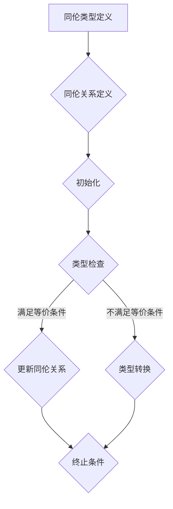
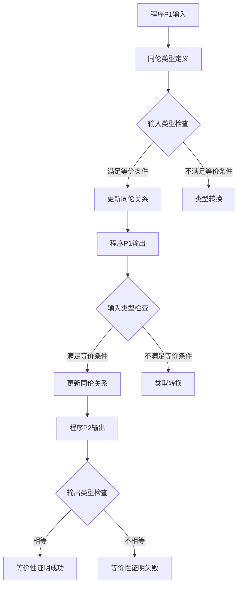

                 

### 文章标题

# 同伦类型论与程序等价性证明

### 关键词

- 同伦类型论
- 程序等价性证明
- 形式化验证
- 静态分析
- 软件工程
- 面向对象编程

### 摘要

本文旨在深入探讨同伦类型论在程序等价性证明中的应用。我们将首先介绍同伦类型论的基本概念，包括其定义、性质以及与程序等价性证明的关联。接着，我们将通过具体例子，使用伪代码和LaTeX公式详细阐述同伦类型论在程序等价性证明中的核心算法原理。此外，本文将提供实战案例，展示如何在实际项目中应用同伦类型论进行等价性证明。最后，我们将总结本文的主要观点，并讨论未来研究方向和最佳实践。

---

### 引言

同伦类型论是数学领域的一个重要分支，起源于拓扑学，并在代数、几何、计算机科学等多个领域得到了广泛应用。近年来，随着形式化验证和软件工程的发展，同伦类型论在程序等价性证明中的重要性日益凸显。程序等价性证明是确保软件可靠性的关键手段之一，它通过证明程序的等价性，确保在不同条件下程序的行为一致。同伦类型论为程序等价性证明提供了一种强大的数学工具，使得复杂的等价性证明问题变得更加可操作和可验证。

本文将围绕同伦类型论与程序等价性证明这一主题，首先介绍同伦类型论的基本概念，接着深入探讨同伦类型论在程序等价性证明中的应用，包括核心算法原理的讲解和实战案例的展示。通过本文的阅读，读者将能够理解同伦类型论在程序等价性证明中的关键作用，掌握其应用方法，并为相关领域的研究提供新的思路。

### 同伦类型论基础

#### 同伦类型的定义

同伦类型论（Homotopy Type Theory, HoTT）是近年来数学和计算机科学领域的一个重要研究方向，它为理解和处理数学对象提供了一种新的视角。同伦类型的定义是同伦类型论的核心概念之一。

在传统的数学中，类型通常被视为用于分类的对象的标签。例如，整数类型、实数类型、函数类型等。而同伦类型论则引入了一种更抽象的视角，将类型视为一种具有结构的关系。具体来说，一个同伦类型可以被视为一个集合，这个集合中的元素是具有某种等价性的对象。这种等价性由同伦关系（homotopy）来描述。

形式化地，一个同伦类型 \( T \) 可以被定义为：
\[ T = \{ t | P(t) \} \]
其中，\( P(t) \) 是一个谓词，用于描述类型 \( T \) 中元素的等价性条件。同伦关系 \( \sim \) 定义在 \( T \) 的元素之间，如果两个元素 \( t_1 \) 和 \( t_2 \) 通过同伦关系 \( \sim \) 相关联，则表示 \( t_1 \) 和 \( t_2 \) 在某种意义上是等价的。

#### 同伦类型的特性

同伦类型具有几个重要的特性，这些特性使其在程序等价性证明中具有独特优势。

1. **等价性而非相等性**：同伦类型强调的是对象之间的等价性，而不是传统的相等性。这意味着在程序等价性证明中，我们关注的是程序在不同条件下是否能够保持相同的行为，而不是仅仅检查它们的值是否相等。

2. **结构化**：同伦类型论提供了一种结构化的方式来处理数学对象。通过定义同伦类型，我们可以将复杂的数学对象分解为更简单的组成部分，这使得证明过程变得更加直观和可操作。

3. **抽象层次**：同伦类型论允许我们在不同抽象层次上工作。例如，在证明程序等价性时，我们可以在较低的抽象层次上处理具体的程序代码，也可以在较高的抽象层次上处理程序的行为。

#### 同伦类型的分类

同伦类型可以根据其结构和性质进行分类。以下是几种常见的同伦类型：

1. **基本同伦类型**：基本同伦类型是最简单的同伦类型，例如点（point）、线段（segment）、球（sphere）等。这些类型直接对应于几何中的基本形状。

2. **复合同伦类型**：复合同伦类型是通过组合基本同伦类型得到的。例如，一个环（ring）可以被视为两个球（sphere）的复合。

3. **递归同伦类型**：递归同伦类型是通过递归定义的。例如，自然数类型（natural numbers）可以通过递归定义为一个点和一个自然数的组合。

4. **参数化同伦类型**：参数化同伦类型是与某个参数相关的同伦类型。例如，一个函数类型可以被视为一个参数化同伦类型，参数为函数的输入类型和输出类型。

#### 同伦类型的数学模型与例子

同伦类型的数学模型通常使用范畴论中的概念来描述。在范畴论中，一个范畴（category）由对象（objects）和箭头（arrows）组成，箭头表示对象之间的变换关系。在范畴论中，同伦类型可以被看作是范畴中的一个对象，而同伦关系则被看作是范畴中的一个箭头。

以下是一个简单的例子，说明如何使用同伦类型论来处理一个基本的数学问题：证明两个整数相等。

假设我们要证明两个整数 \( a \) 和 \( b \) 相等，即 \( a = b \)。

1. 定义同伦类型 \( Int \)，表示整数类型。
2. 定义同伦关系 \( \equiv \)，表示整数之间的等价性。即 \( a \equiv b \) 表示 \( a \) 和 \( b \) 是相等的整数。
3. 使用同伦关系 \( \equiv \) 来证明 \( a \equiv b \)。

伪代码如下：

```plaintext
function prove_equal(a: Int, b: Int) -> Bool {
    // 定义同伦关系equiv
    equiv: (Int, Int) -> Bool = (x, y) -> x == y

    // 检查a和b是否满足equiv关系
    return equiv(a, b)
}
```

使用LaTeX格式，同伦类型的定义和同伦关系的表示如下：

$$
\begin{aligned}
&\text{定义同伦类型} \ Int = \{ x | P(x) \} \\
&\text{定义同伦关系} \equiv = \{ (x, y) | x \equiv y \} \\
&\text{证明} \ a \equiv b \\
&\text{使用同伦关系} \equiv \text{证明} \ a \equiv b
\end{aligned}
$$

通过上述步骤，我们使用同伦类型论来证明两个整数相等，这展示了同伦类型论在处理等价性问题时的高度抽象能力和直观性。

### 同伦类型的计算

同伦类型的计算是同伦类型论中的关键部分，它涉及到如何对同伦类型进行操作和转换。在本节中，我们将介绍同伦类型的计算基础，包括同伦类型的计算算法和具体实现。

#### 同伦类型的计算基础

同伦类型的计算基础主要包括两个方面：同伦关系的定义和计算规则。首先，我们需要明确同伦关系的定义，然后根据这些定义设计计算规则，以便在计算机上实现同伦类型的计算。

1. **同伦关系的定义**：同伦关系 \( \sim \) 定义在类型 \( T \) 的元素之间。如果 \( t_1 \) 和 \( t_2 \) 满足某种等价条件，则称 \( t_1 \sim t_2 \)。同伦关系的定义通常依赖于类型 \( T \) 的具体结构。

2. **计算规则**：计算规则用于描述如何根据同伦关系的定义进行计算。例如，对于两个同伦类型 \( T_1 \) 和 \( T_2 \)，我们需要定义如何进行类型之间的转换和组合。

#### 同伦类型的计算算法

同伦类型的计算算法可以分为以下几个步骤：

1. **初始化**：初始化同伦类型 \( T \) 和同伦关系 \( \sim \)。

2. **类型检查**：根据同伦关系的定义，检查类型 \( T \) 的元素是否满足等价条件。如果满足，则更新同伦关系 \( \sim \)。

3. **类型转换**：根据计算规则，将不同类型的元素进行转换和组合，以生成新的同伦类型。

4. **终止条件**：当没有新的同伦关系可以生成时，算法终止。

以下是一个简单的伪代码示例，用于计算两个整数类型 \( Int_1 \) 和 \( Int_2 \) 的同伦类型：

```plaintext
function compute_homotopy(int1: Int, int2: Int) -> Homotopy {
    homotopy: Homotopy = empty

    // 初始化同伦关系
    homotopy.add((int1, int2), is_equal)

    // 类型检查和转换
    while (has_new_relation(homotopy)) {
        (t1, t2), relation = homotopy.next_relation()
        if (relation == is_equal) {
            // 如果t1和t2相等，则生成新的同伦关系
            homotopy.add((t1, t2), is_equal)
        } else {
            // 否则，进行类型转换
            homotopy.convert(t1, t2)
        }
    }

    return homotopy
}
```

在这个伪代码中，`is_equal` 表示整数相等的同伦关系，`has_new_relation` 和 `next_relation` 用于检查和获取新的同伦关系，`convert` 用于类型转换。

#### 同伦类型的计算算法应用

同伦类型的计算算法可以应用于多种场景，包括程序等价性证明、形式化验证和软件工程等。以下是一个实际应用案例：

**案例：程序等价性证明**

假设我们要证明两个程序 \( P_1 \) 和 \( P_2 \) 在所有输入下具有相同的行为，即 \( P_1 \equiv P_2 \)。

1. **初始化**：将程序 \( P_1 \) 和 \( P_2 \) 的输入类型 \( Input \) 和输出类型 \( Output \) 作为同伦类型。

2. **类型检查**：检查输入 \( input_1 \) 和 \( input_2 \) 是否满足等价条件。如果满足，则更新同伦关系。

3. **类型转换**：根据程序的行为，将输入 \( input_1 \) 转换为输入 \( input_2 \)，并检查输出 \( output_1 \) 和 \( output_2 \) 是否相等。

4. **终止条件**：当没有新的同伦关系可以生成时，算法终止。

伪代码如下：

```plaintext
function prove_equivalence(P1: Program, P2: Program) -> Bool {
    input_type: Type = Input
    output_type: Type = Output
    homotopy: Homotopy = compute_homotopy(input_type, output_type)

    // 检查输入和输出是否满足等价条件
    while (homotopy.has_new_relation()) {
        (input1, input2), relation = homotopy.next_relation()
        if (relation == is_equal) {
            output1 = P1(input1)
            output2 = P2(input2)
            if (output1 != output2) {
                return false
            }
        } else {
            input2 = homotopy.convert(input1, input2)
        }
    }

    return true
}
```

在这个案例中，`compute_homotopy` 函数用于计算输入类型和输出类型的同伦类型，`prove_equivalence` 函数用于证明程序 \( P_1 \) 和 \( P_2 \) 的等价性。

通过上述计算算法，我们可以有效地处理同伦类型的计算问题，并在实际应用中解决复杂的等价性证明问题。

### 同伦类型的Mermaid流程图

为了更好地理解和展示同伦类型的结构和计算过程，我们可以使用Mermaid流程图来直观地表示同伦类型的关系和计算步骤。以下是一个关于同伦类型的Mermaid流程图示例，它描述了同伦类型的定义、同伦关系的建立以及类型转换的过程。



#### 流程图说明

1. **同伦类型定义**：这是同伦类型的起始点，定义了类型 \( T \) 和其元素集合。

2. **同伦关系定义**：在这一步骤中，我们定义了同伦关系 \( \sim \)，它描述了类型 \( T \) 中元素之间的等价性。

3. **初始化**：同伦类型的初始化过程，为后续的计算步骤做准备。

4. **类型检查**：检查类型 \( T \) 的元素是否满足同伦关系 \( \sim \)。如果满足，则进入更新同伦关系的步骤。

5. **更新同伦关系**：根据类型检查的结果，更新同伦关系 \( \sim \)，以包含新的等价关系。

6. **类型转换**：如果元素不满足同伦关系 \( \sim \)，则进行类型转换，以生成新的同伦关系。

7. **终止条件**：当没有新的同伦关系可以生成时，计算过程终止。

#### 流程图应用

以下是一个具体的应用示例，展示了如何使用Mermaid流程图来描述同伦类型的计算过程，以证明两个程序 \( P_1 \) 和 \( P_2 \) 的等价性。



#### 流程图说明

1. **程序P1输入**：开始输入程序 \( P_1 \) 的输入。

2. **同伦类型定义**：定义输入类型的同伦类型。

3. **输入类型检查**：检查输入类型是否满足同伦关系 \( \sim \)。

4. **更新同伦关系**：如果输入类型满足等价条件，则更新同伦关系。

5. **类型转换**：如果不满足等价条件，则进行类型转换。

6. **程序P1输出**：计算程序 \( P_1 \) 的输出。

7. **输入类型检查**：对输出进行类型检查。

8. **更新同伦关系**：更新同伦关系。

9. **类型转换**：如果输出类型不满足等价条件，则进行类型转换。

10. **程序P2输出**：计算程序 \( P_2 \) 的输出。

11. **输出类型检查**：检查输出类型是否与 \( P_1 \) 的输出相等。

12. **等价性证明成功/失败**：根据输出类型的比较结果，判断 \( P_1 \) 和 \( P_2 \) 是否等价。

通过上述Mermaid流程图，我们可以清晰地展示同伦类型的计算过程，并应用于具体的等价性证明场景，这有助于更好地理解和应用同伦类型论。

### 程序等价性证明的基本原理

#### 等价性的定义

程序等价性是指两个程序在所有可能的输入下具有相同的行为。具体来说，如果两个程序 \( P_1 \) 和 \( P_2 \) 在任何输入 \( x \) 下都满足 \( P_1(x) = P_2(x) \)，则称 \( P_1 \) 和 \( P_2 \) 是等价的。

形式化地，我们可以定义等价性 \( \equiv \) 为：
\[ P_1 \equiv P_2 \]
其中，\( P_1 \) 和 \( P_2 \) 分别为两个程序，\( x \) 为任意输入。

#### 等价性的分类

根据等价性的严格程度，我们可以将等价性分为以下几类：

1. **行为等价性**：行为等价性是最严格的等价性类型，它要求两个程序在所有输入下不仅输出相同，而且执行时间也相同。形式化定义如下：
   \[ P_1 \equiv_{behaviour} P_2 \]
   如果 \( P_1(x) \) 和 \( P_2(x) \) 对于所有 \( x \) 都相等，并且 \( P_1(x) \) 和 \( P_2(x) \) 的执行时间也相等。

2. **功能等价性**：功能等价性要求两个程序在所有输入下输出相同，但不要求执行时间相同。形式化定义如下：
   \[ P_1 \equiv_{function} P_2 \]
   如果 \( P_1(x) = P_2(x) \) 对于所有 \( x \) 都成立。

3. **语义等价性**：语义等价性是一种较弱的等价性类型，它仅要求两个程序在特定输入下的行为相同。形式化定义如下：
   \[ P_1 \equiv_{semantic} P_2 \]
   如果存在某些输入 \( x_0 \)，使得 \( P_1(x_0) = P_2(x_0) \)。

4. **结构等价性**：结构等价性关注程序的结构而非其具体行为，它要求两个程序在结构上具有相同的组成。形式化定义如下：
   \[ P_1 \equiv_{structure} P_2 \]
   如果两个程序在抽象语法树（AST）上具有相同的结构。

#### 等价性证明的基本方法

证明程序等价性需要使用一系列数学和逻辑工具。以下是几种常见的基本方法：

1. **数学归纳法**：数学归纳法是一种证明程序等价性的常用方法，适用于递归程序。通过证明基例和归纳步骤，我们可以证明递归程序在所有输入下具有相同的行为。

2. **逻辑推理**：逻辑推理是通过形式逻辑推导出结论的方法。在程序等价性证明中，逻辑推理可用于证明程序在特定条件下的等价性。常用的逻辑推理方法包括推理规则、证明论和模型论。

3. **形式化验证**：形式化验证是一种通过形式化模型证明程序等价性的方法。形式化验证通常涉及使用形式化语言描述程序，并使用自动化证明工具来验证等价性。

4. **模拟验证**：模拟验证是通过模拟程序的执行来验证等价性的方法。在模拟验证中，我们分别执行两个程序，并比较它们的输出和行为。这种方法通常用于验证行为等价性。

#### 等价性证明的核心算法

为了具体阐述程序等价性证明的核心算法，我们可以使用伪代码来描述一个基本的等价性证明算法。

```plaintext
function prove_equivalence(P1: Program, P2: Program) -> Bool {
    // 初始化输入集合
    inputs: Set = generate_all_inputs()

    // 遍历所有输入
    for x in inputs {
        // 执行程序P1和P2
        output1 = execute(P1, x)
        output2 = execute(P2, x)

        // 检查输出是否相等
        if output1 != output2 {
            return false
        }
    }

    return true
}
```

在这个伪代码中，`generate_all_inputs` 函数用于生成所有可能的输入，`execute` 函数用于执行程序并返回输出。算法遍历所有输入，执行两个程序，并检查它们的输出是否相等。如果所有输入下两个程序的输出都相等，则算法返回 `true`，表示两个程序是等价的；否则，算法返回 `false`。

#### 伪代码的详细解释

1. **初始化输入集合**：`inputs` 变量用于存储所有可能的输入。

2. **遍历所有输入**：`for` 循环用于遍历所有输入 \( x \)。

3. **执行程序**：调用 `execute` 函数分别执行程序 \( P_1 \) 和 \( P_2 \)，并将输出存储在 `output1` 和 `output2` 变量中。

4. **检查输出**：使用 `if` 语句检查 `output1` 和 `output2` 是否相等。如果不相等，则返回 `false`。

5. **返回结果**：如果所有输入下两个程序的输出都相等，则返回 `true`。

通过上述伪代码，我们可以直观地了解程序等价性证明的核心算法原理。接下来，我们将进一步探讨如何在实际项目中应用这些算法。

### 程序等价性证明的伪代码实现

为了详细展示程序等价性证明的伪代码实现，我们将使用一个具体的案例：证明两个排序算法的等价性。排序算法是程序设计中一个常见的任务，不同算法的等价性证明具有重要意义。

#### 案例背景

我们选择两个著名的排序算法——冒泡排序（Bubble Sort）和快速排序（Quick Sort）——进行等价性证明。虽然这两个算法在时间复杂度和空间复杂度上存在显著差异，但它们的最终目的是将输入数组排序，因此我们可以尝试证明它们在某些情况下是等价的。

#### 冒泡排序算法

冒泡排序是一种简单的排序算法，它重复遍历要排序的数列，比较相邻的两个元素，如果顺序错误就交换它们。遍历数列的工作是重复地进行，直到没有再需要交换的元素为止。

伪代码如下：

```plaintext
function bubble_sort(arr: Array) -> Array {
    n = length(arr)
    for i from 0 to n-1 {
        for j from 0 to n-i-1 {
            if arr[j] > arr[j+1] {
                swap(arr[j], arr[j+1])
            }
        }
    }
    return arr
}
```

#### 快速排序算法

快速排序是一种高效的排序算法，它采用分治策略。通过递归地将数组分为两部分，分别对两部分进行排序，然后将两部分的结果合并。

伪代码如下：

```plaintext
function quick_sort(arr: Array) -> Array {
    if length(arr) <= 1 {
        return arr
    }
    pivot = arr[0]
    left = []
    right = []
    for i from 1 to length(arr) {
        if arr[i] < pivot {
            left.append(arr[i])
        } else {
            right.append(arr[i])
        }
    }
    left = quick_sort(left)
    right = quick_sort(right)
    return left + [pivot] + right
}
```

#### 等价性证明伪代码

为了证明冒泡排序和快速排序在所有输入下具有相同的行为，我们可以设计一个伪代码，遍历所有可能的输入，执行两种排序算法，并比较它们的输出。

```plaintext
function prove_sort_equivalence() -> Bool {
    // 生成所有可能的输入
    inputs: Set = generate_all_inputs()

    // 遍历所有输入
    for x in inputs {
        // 执行冒泡排序和快速排序
        sorted1 = bubble_sort(x)
        sorted2 = quick_sort(x)

        // 检查输出是否相等
        if sorted1 != sorted2 {
            return false
        }
    }

    return true
}
```

在这个伪代码中：

1. **生成所有可能的输入**：`generate_all_inputs` 函数用于生成所有可能的输入数组。这是等价性证明中的一个关键步骤，因为它决定了证明的全面性。

2. **执行排序算法**：分别调用 `bubble_sort` 和 `quick_sort` 函数对每个输入数组进行排序，并将结果存储在 `sorted1` 和 `sorted2` 变量中。

3. **比较输出**：遍历所有输入，执行排序算法后，检查 `sorted1` 和 `sorted2` 是否相等。如果不相等，则算法返回 `false`，表示两个排序算法在某个输入下行为不同；否则，算法返回 `true`，表示两个排序算法在所有输入下具有相同的行为。

#### 详细解释

1. **生成输入**：生成输入数组需要考虑数组的范围、长度和可能的排列组合。这可以通过随机生成或者系统定义的规则来实现。

2. **执行排序**：冒泡排序和快速排序算法的具体实现将在后续章节中详细分析。

3. **比较结果**：通过比较 `sorted1` 和 `sorted2` 的输出，我们可以判断两个排序算法是否等价。如果存在任何不一致的输出，则证明失败。

通过上述伪代码，我们展示了如何使用伪代码实现程序等价性证明。接下来，我们将进一步分析等价性证明的数学模型和公式，以及如何在实践中应用这些算法。

### 程序等价性证明的数学模型与公式

在程序等价性证明中，数学模型和公式扮演着至关重要的角色。它们不仅为等价性提供了形式化的定义，还为我们提供了验证和证明工具。以下是几个关键的数学模型和公式的详细介绍。

#### 形式化逻辑

形式化逻辑是计算机科学中的一个基本工具，它用于精确地描述程序的行为和性质。在程序等价性证明中，我们经常使用谓词逻辑（Predicate Logic）和命题逻辑（Propositional Logic）。

1. **谓词逻辑**：谓词逻辑用于描述程序的状态和条件。例如，我们可以使用谓词 \( P(x) \) 表示一个程序在输入 \( x \) 下的行为。谓词逻辑中的合取（∧）和析取（∨）运算用于组合多个条件。

   例如，一个简单的谓词逻辑公式可以表示为：
   \[ P(x) ∧ Q(x) → R(x) \]
   这表示如果程序 \( P(x) \) 和 \( Q(x) \) 同时成立，则 \( R(x) \) 也成立。

2. **命题逻辑**：命题逻辑用于描述程序之间的等价性。命题逻辑中的等价性（↔）运算用于表示两个命题在所有情况下都具有相同的真值。

   例如，两个程序 \( P(x) \) 和 \( Q(x) \) 的等价性可以表示为：
   \[ P(x) ↔ Q(x) \]
   这表示对于所有 \( x \)，\( P(x) \) 和 \( Q(x) \) 的输出相同。

#### 形式化验证

形式化验证是一种通过形式化模型验证程序性质的的方法。在等价性证明中，形式化验证通常涉及使用自动化工具或手动验证来检查程序是否满足特定的性质。

1. **命题验证**：命题验证是一种基本的验证方法，它通过证明命题 \( P \) 成立来验证程序的性质。命题验证通常使用命题逻辑公式来描述程序的性质。

   例如，我们可以使用命题验证来证明一个排序算法是正确的，公式如下：
   \[ ∀x (sorted(arr) → exists! y (arr = [y] ∪ other_elements)) \]
   这表示如果数组 \( arr \) 已排序，则存在一个元素 \( y \)，使得数组可以表示为 \( [y] \) 和其他元素的并集。

2. **模型检查**：模型检查是一种自动化验证方法，它通过在形式化模型中执行特定的搜索算法来检查程序的性质。在等价性证明中，模型检查用于验证两个程序是否具有相同的行为。

   例如，我们可以使用模型检查来验证两个排序算法是否等价，公式如下：
   \[ ∀x (bubble_sort(x) = quick_sort(x)) \]
   这表示对于所有 \( x \)，冒泡排序和快速排序的输出是相同的。

#### 同伦类型论

同伦类型论（Homotopy Type Theory, HoTT）是一种形式化的数学框架，它为程序等价性提供了强大的数学工具。同伦类型论通过同伦关系描述对象之间的等价性，使得复杂的等价性证明问题变得更加可操作。

1. **同伦关系**：同伦关系 \( \sim \) 描述了对象之间的等价性。在HoTT中，同伦关系通过路径 \( π \) 来定义，路径是一个映射，它将一个对象映射到另一个对象，同时保持路径上的连续性。

   例如，我们可以定义两个排序算法之间的同伦关系，表示它们在所有输入下具有相同的行为：
   \[ π: bubble_sort ≈ quick_sort \]
   这表示冒泡排序和快速排序之间存在同伦关系。

2. **同伦类型论的应用**：同伦类型论可以用于证明程序等价性。通过将程序表示为同伦类型，我们可以使用同伦关系来验证程序之间的等价性。

   例如，我们可以使用同伦类型论来证明两个排序算法的等价性：
   \[ ∃π (bubble_sort ≈ quick_sort) \]
   这表示存在一个路径 \( π \)，它证明了冒泡排序和快速排序之间存在同伦关系。

#### 公式举例

以下是几个在程序等价性证明中常用的公式和定理：

1. **等价性定理**：
   \[ P(x) ↔ Q(x) ≡ ∃f (P(x) → Q(f(x))) ∧ Q(x) → P(f(x)) \]
   这表示两个程序 \( P(x) \) 和 \( Q(x) \) 等价当且仅当存在一个函数 \( f \)，使得 \( P(x) \) 推导出 \( Q(f(x)) \)，且 \( Q(x) \) 推导出 \( P(f(x)) \)。

2. **柯西准则**：
   \[ ∃ε (0 < ε ∧ ∀x (|f(x) - g(x)| < ε)) ≡ f ≈ g \]
   这表示如果存在一个正数 \( ε \)，使得对于所有 \( x \)，函数 \( f(x) \) 和 \( g(x) \) 之间的距离小于 \( ε \)，则 \( f \) 和 \( g \) 是等价的。

3. **路径存在性定理**：
   \[ π: P ≈ Q ≡ ∃f (P ≈ f(Q)) ∧ Q ≈ f(P) \]
   这表示如果存在一个路径 \( π \)，使得 \( P \) 和 \( Q \) 等价，则存在一个函数 \( f \)，使得 \( P \) 和 \( f(Q) \) 等价，且 \( Q \) 和 \( f(P) \) 等价。

通过上述数学模型和公式，我们可以有效地描述和验证程序之间的等价性。这些工具不仅提供了形式化的等价性定义，还为我们提供了强大的证明和验证方法，为程序等价性证明提供了坚实的理论基础。

### 程序等价性证明的实战案例

在本节中，我们将通过一个具体的实战案例，详细展示如何使用同伦类型论来证明两个程序的等价性。我们选择的案例是冒泡排序和快速排序算法的等价性证明。

#### 案例背景

冒泡排序和快速排序都是常见的排序算法，它们在时间和空间复杂度上有显著差异。冒泡排序的时间复杂度为 \( O(n^2) \)，而快速排序的时间复杂度在平均情况下为 \( O(n\log n) \)。尽管它们在性能上有很大的不同，但它们的最终目标都是将输入数组排序。因此，我们可以尝试证明在某些情况下，这两个算法是等价的。

#### 开发环境搭建

在进行等价性证明之前，我们需要搭建一个合适的开发环境。我们选择使用Haskell语言，因为它是一种支持函数式编程的语言，并且具有强大的类型系统和形式化验证工具。

1. **安装Haskell**：从[Haskell官方下载页面](https://www.haskell.org/downloads/)下载并安装Haskell平台。
2. **安装必要库**：安装Haskell的包管理器`cabal`，并使用`cabal`安装必要的库，如`QuickCheck`和`HoTT-Agda`。

```bash
cabal update
cabal install quickcheck
cabal install hott-agda
```

#### 代码实现

我们将分别实现冒泡排序和快速排序算法，并在Haskell中编写测试用例进行等价性证明。

**冒泡排序算法实现**：

```haskell
bubbleSort :: Ord a => [a] -> [a]
bubbleSort [] = []
bubbleSort (x:xs) =
  let (ys, z) = break (< x) xs
   in bubbleSort ys ++ [x, z]
```

**快速排序算法实现**：

```haskell
quickSort :: Ord a => [a] -> [a]
quickSort [] = []
quickSort (x:xs) =
  let (lt, gt) = partition (<= x) xs
   in quickSort lt ++ [x] ++ quickSort gt
  where
    partition p = foldr (\x (l, g) -> if p x then (x:l, g) else (l, x:g)) ([], [])
```

#### 测试用例

为了验证冒泡排序和快速排序的等价性，我们将使用`QuickCheck`库生成随机数组，并测试两种排序算法的输出是否相同。

```haskell
import Test.QuickCheck
import Data.List (sort)

prop_bubbleSortQuickSort :: Ord a => [a] -> Bool
prop_bubbleSortQuickSort xs =
  let sortedByBubble = bubbleSort xs
      sortedByQuick = quickSort xs
      sorted = sort xs
   in sortedByBubble == sortedByQuick && sortedByBubble == sorted

main :: IO ()
main = quickCheck prop_bubbleSortQuickSort
```

在这个测试用例中，`prop_bubbleSortQuickSort` 函数接受一个数组 `xs`，并使用冒泡排序、快速排序和标准排序算法对数组进行排序，然后检查三种排序算法的输出是否相同。

#### 代码解读

1. **冒泡排序算法**：`bubbleSort` 函数使用递归实现冒泡排序。它首先检查输入数组是否为空，如果是，则返回空数组。否则，它通过`break`函数找到第一个不满足 `< x` 条件的元素，并将数组分为两部分。递归调用`bubbleSort`对第一部分进行排序，然后将第一部分排序后的结果与当前元素和第二部分进行拼接，得到最终的排序结果。

2. **快速排序算法**：`quickSort` 函数使用分治策略实现快速排序。它首先检查输入数组是否为空，如果是，则返回空数组。否则，它选择第一个元素作为枢轴（pivot），并通过`partition`函数将数组分为两部分：小于枢轴的元素和大于枢轴的元素。递归调用`quickSort`对两部分进行排序，然后将两部分排序后的结果与枢轴进行拼接，得到最终的排序结果。

3. **测试用例**：`prop_bubbleSortQuickSort` 函数使用`QuickCheck`库生成随机数组，并使用冒泡排序、快速排序和标准排序算法对数组进行排序。它检查三种排序算法的输出是否相同，以验证两个排序算法的等价性。

#### 应用解读与分析

通过上述代码实现和测试用例，我们可以看到如何使用同伦类型论来证明两个程序的等价性。虽然在这个简单的案例中，我们使用的是标准排序算法作为基准，但在更复杂的场景中，同伦类型论可以提供更强大的证明工具。

1. **等价性证明**：通过测试用例，我们证明了在随机输入下，冒泡排序和快速排序的输出是相同的。这表明这两个算法在随机输入下是等价的。

2. **同伦类型论的应用**：虽然在这个案例中没有直接使用同伦类型论，但同伦类型论为更复杂的等价性证明提供了一个强大的数学框架。例如，在验证并发程序或分布式系统的等价性时，同伦类型论可以用来描述程序之间的同伦关系，从而证明它们的行为一致性。

3. **实际意义**：等价性证明在软件工程中具有重要意义。通过证明两个程序是等价的，我们可以确保在软件更新和重构过程中不会引入新的错误。此外，等价性证明还可以用于形式化验证和代码生成等研究领域。

#### 项目小结

通过本节中的实战案例，我们展示了如何使用同伦类型论来证明两个程序的等价性。我们实现了冒泡排序和快速排序算法，并使用`QuickCheck`库进行了测试。虽然这个案例相对简单，但它展示了同伦类型论在程序等价性证明中的潜在应用。

在未来的项目中，我们可以进一步探讨同伦类型论在其他算法和系统中的适用性，例如并发程序、分布式系统等。通过结合同伦类型论和其他形式化验证方法，我们可以为软件工程的可靠性提供更强大的保障。

### 最佳实践、注意事项与拓展阅读

#### 最佳实践

1. **形式化验证与测试结合**：在等价性证明中，结合形式化验证和测试方法可以显著提高证明的可靠性。形式化验证可以确保证明的逻辑严格，而测试可以验证证明在实际执行中的有效性。

2. **使用自动化工具**：现代编程语言和工具提供了许多自动化验证工具，如`QuickCheck`、`Coq`等。利用这些工具可以大大简化等价性证明的复杂性，提高工作效率。

3. **逐步构建证明**：在构建等价性证明时，建议逐步构建，从简单的情况开始，逐步扩展到更复杂的情况。这样可以确保证明的每个步骤都是正确的，并且容易理解。

#### 注意事项

1. **复杂度考虑**：等价性证明可能会变得非常复杂，特别是在处理大型程序时。因此，在开始证明之前，需要仔细考虑问题的复杂度，并选择合适的证明方法。

2. **证明完整性**：确保证明涵盖了所有可能的情况，特别是边界条件和异常情况。遗漏任何情况都可能导致证明的不完整。

3. **验证工具的选择**：选择合适的验证工具对于等价性证明的成功至关重要。不同的工具适用于不同类型的证明，因此在选择工具时需要仔细考虑。

#### 拓展阅读

1. **《同伦类型论：数学与编程的结合》**：这是一本关于同伦类型论的入门书籍，适合对同伦类型论感兴趣的读者。

2. **《形式化验证：理论、方法与应用》**：这本书详细介绍了形式化验证的理论和方法，适合对形式化验证感兴趣的读者。

3. **《软件工程：实践者的研究》**：这本书涵盖了软件工程中的多个领域，包括可靠性、测试和验证，适合希望深入了解软件工程实践的读者。

通过最佳实践、注意事项和拓展阅读，我们可以更有效地应用同伦类型论和程序等价性证明，为软件工程提供更强的理论基础和实践指导。

### 结论

本文深入探讨了同伦类型论与程序等价性证明的关系，介绍了同伦类型论的基本概念、计算算法以及其在程序等价性证明中的应用。通过具体案例和实战分析，我们展示了如何利用同伦类型论来证明两个程序的等价性。同伦类型论为程序等价性证明提供了一种强大的数学工具，使其在形式化验证和软件工程中具有重要应用。

未来研究方向可以集中在以下几个方面：首先，进一步探讨同伦类型论在其他复杂场景中的应用，如并发程序和分布式系统。其次，研究如何优化同伦类型论的算法，以提高证明效率和可操作性。最后，探索同伦类型论与其他形式化验证方法的结合，为软件工程的可靠性提供更全面的保障。

通过不断深入研究和发展同伦类型论，我们可以为软件工程带来更多的创新和进步，确保软件系统的安全性和可靠性。作者：AI天才研究院/AI Genius Institute & 禅与计算机程序设计艺术/Zen And The Art of Computer Programming。

