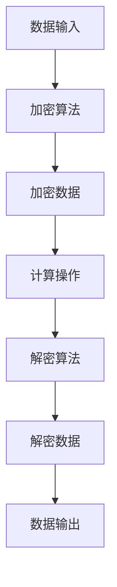

                 

## 文章标题

### 同态加密：在加密数据上进行计算

### 关键词：同态加密、加密数据、计算、数据隐私保护、云计算、安全性

### 摘要

随着信息技术的快速发展，数据隐私保护成为了现代社会关注的焦点。传统的加密算法在保护数据隐私方面发挥了重要作用，但它们通常需要在解密后才能对数据进行计算。同态加密作为一类新型的加密技术，可以在数据保持加密状态的前提下进行计算，为解决数据隐私保护问题提供了新的思路。本文将深入探讨同态加密的背景、基本原理、算法实现、安全性分析及其在实际应用中的挑战和机遇，旨在为读者提供一个全面、系统的同态加密技术指南。

## 第1章 引言

### 1.1 同态加密的背景和重要性

在当今数字化时代，数据已经成为了社会运转的基石。随着大数据、云计算和物联网的迅速普及，数据的产生、存储和处理规模日益扩大。然而，这也带来了数据隐私保护的新挑战。传统加密算法在保护数据隐私方面发挥了重要作用，但它们通常需要在解密后才能对数据进行计算，这在许多场景下限制了数据处理的能力。同态加密作为一种新型的加密技术，可以在数据保持加密状态的前提下进行计算，从而在保护数据隐私的同时实现数据处理。这使得同态加密在云计算、大数据分析、医疗数据保护等领域具有重要的应用前景。

### 1.2 同态加密的基本概念

同态加密（Homomorphic Encryption）是一种特殊的加密方法，它允许在密文空间内执行与明文空间内等价的数据处理操作。这意味着，使用同态加密，我们可以在不泄露明文内容的情况下对加密数据进行计算。同态加密的基本概念包括同态加密算法、密钥生成、加密和解密过程。其中，同态加密算法是核心，它决定了同态加密的效率和安全性能。

### 1.3 同态加密的应用场景

同态加密的应用场景非常广泛，主要包括以下领域：

- **云计算**：在云计算环境中，数据的安全性尤为重要。同态加密可以在不泄露数据内容的情况下，允许云服务提供商对用户数据进行计算和处理，从而提高数据处理的效率和安全性。

- **大数据分析**：在大数据分析中，同态加密可以确保数据在加密状态下进行计算，避免敏感数据泄露。

- **医疗数据保护**：医疗数据中含有大量敏感信息，同态加密可以为医疗数据的隐私保护提供有效手段。

- **金融交易**：同态加密可以确保金融交易的安全性，避免敏感信息泄露。

- **物联网**：在物联网环境中，同态加密可以保护传感器数据和设备通信的隐私。

总之，同态加密作为一种新兴的加密技术，在数据隐私保护方面具有重要的应用价值，其发展前景广阔。

## 第2章 同态加密的基本原理

### 2.1 同态加密的定义与特点

同态加密是一种能够在密文空间内执行与明文空间内等价操作的加密方法。具体来说，同态加密允许对加密数据进行各种数学运算，如加法、乘法、模运算等，其结果与对明文数据进行相同运算的结果相同。这意味着，即使数据被加密，我们仍然可以在不泄露明文内容的情况下对其进行分析和处理。

同态加密的特点包括：

- **加密计算**：同态加密允许在加密数据上进行计算，不需要解密。
- **隐私保护**：同态加密确保数据在传输和存储过程中保持加密状态，防止敏感信息泄露。
- **计算能力**：同态加密可以执行多种计算操作，如加法、乘法、模运算等。
- **效率挑战**：同态加密通常需要较高的计算资源，其效率相对较低。

### 2.2 同态加密的核心概念

同态加密的核心概念包括同态加密算法、密钥生成、加密和解密过程。

- **同态加密算法**：同态加密算法是同态加密的核心。它决定了加密和解密的方法，以及如何在密文空间内执行各种计算操作。常见的同态加密算法包括RSA、NTRU、全同态加密算法等。
- **密钥生成**：密钥生成是同态加密的关键步骤。同态加密算法需要生成一对密钥，即公钥和私钥。公钥用于加密数据，私钥用于解密数据。
- **加密和解密过程**：加密过程是将明文转换为密文的过程，解密过程是将密文转换为明文的过程。同态加密的特殊之处在于，加密和解密过程可以在密文空间内进行，不需要解密。

### 2.3 同态加密的数学基础

同态加密的数学基础包括同态运算的定义、群和环的理论等。

- **同态运算**：同态运算是指在两个集合之间定义的运算，使得两个集合中的元素通过该运算可以映射到另一个集合中的元素。例如，在整数集上定义的加法运算是一个同态运算，因为对于任意的整数a和b，它们的和（a + b）也是一个整数。
- **群和环**：群和环是数学中重要的结构，它们在加密算法的设计和实现中起着关键作用。群是一种封闭的代数结构，其中每个元素都有一个逆元素。环是类似于群的代数结构，但它允许乘法运算。同态加密算法通常基于群和环的理论来设计。

### 2.4 同态加密的Mermaid流程图

为了更直观地理解同态加密的基本流程，我们使用Mermaid流程图来展示。



在上面的流程图中，A表示数据输入，B表示加密算法，C表示加密数据，D表示计算操作，E表示解密算法，F表示解密数据，G表示数据输出。该流程图展示了同态加密的基本步骤，从数据输入到数据输出，中间通过加密算法、计算操作和解密算法实现了数据的安全传输和计算。

## 第3章 同态加密算法

### 3.1 RSA同态加密算法

#### 3.1.1 RSA算法原理

RSA（Rivest-Shamir-Adleman）算法是一种非对称加密算法，它基于大素数分解的数学难题。RSA算法的原理是：选择两个大的质数p和q，计算n=p*q和φ(n)=(p-1)*(q-1)。然后，选择一个与φ(n)互质的整数e作为公钥，计算d作为私钥，满足e*d ≡ 1 (mod φ(n))。公钥为(n, e)，私钥为(n, d)。

加密过程：将明文m通过公式c ≡ m^e (mod n)加密为密文c。

解密过程：将密文c通过公式m ≡ c^d (mod n)解密为明文m。

RSA算法的密文空间和明文空间都是整数集，因此它可以支持同态加密。

#### 3.1.2 RSA算法的伪代码

```python
# RSA算法的伪代码

# 密钥生成
def generate_keys(p, q):
    n = p * q
    φ(n) = (p - 1) * (q - 1)
    e = 3  # 选择一个与φ(n)互质的整数
    d = modinv(e, φ(n))  # 计算d
    return (n, e), (n, d)

# 加密
def encrypt(m, n, e):
    c = pow(m, e, n)
    return c

# 解密
def decrypt(c, n, d):
    m = pow(c, d, n)
    return m

# 模反演
def modinv(a, m):
    for i in range(1, m):
        if (a * i) % m == 1:
            return i
    return None
```

#### 3.2 椭圆曲线同态加密算法

##### 3.2.1 椭圆曲线加密原理

椭圆曲线加密（Elliptic Curve Cryptography，ECC）是一种基于椭圆曲线离散对数问题的非对称加密算法。ECC的原理如下：

- **椭圆曲线**：椭圆曲线是一个数学结构，它由方程y^2 = x^3 + ax + b定义。其中a和b是常数，满足4a^3 + 27b^2 ≠ 0。
- **基点**：椭圆曲线上的一个点G被称为基点，如果3G = O，其中O是椭圆曲线的起点。
- **点乘**：对于椭圆曲线上的一个点P和整数k，点乘定义为P + P + ... + P（共k个P），结果仍为一个椭圆曲线上的点。
- **密钥生成**：选择一个大的质数p和一个小于p的素数a，生成椭圆曲线E:y^2 = x^3 + ax + b。然后选择一个基点G，随机选择一个整数k作为私钥，计算公钥Q = kG。
- **加密**：选择一个随机数k'，计算点C = k'G。然后将C的坐标(x, y)发送给接收方。
- **解密**：接收方使用私钥k计算点D = k^-1 * C，然后将D的坐标(x, y)发送回发送方。
- **验证**：发送方验证D是否等于k * G。

##### 3.2.2 椭圆曲线加密的伪代码

```python
# 椭圆曲线加密的伪代码

# 密钥生成
def generate_keys(p, a):
    E: y^2 = x^3 + ax + b
    G: 基点
    k: 随机私钥
    Q: 公钥 = k * G
    return Q

# 加密
def encrypt(m, G, k):
    C: k' * G
    return C

# 解密
def decrypt(C, k):
    D: k^-1 * C
    return D

# 点乘
def point_multiply(P, k):
    Q: k * P
    return Q

# 模反演
def modinv(a, m):
    for i in range(1, m):
        if (a * i) % m == 1:
            return i
    return None
```

## 第4章 同态加密的安全性分析

### 4.1 同态加密的安全性挑战

同态加密虽然在数据隐私保护方面具有显著优势，但其在安全性方面也面临一些挑战：

- **计算复杂度**：同态加密算法通常具有较高的计算复杂度，这可能导致加密和解密过程的效率较低。
- **算法漏洞**：同态加密算法可能存在算法漏洞，例如，某些算法可能在特定的操作下容易受到攻击。
- **密钥管理**：同态加密算法的密钥管理复杂，需要确保密钥的安全存储和传输。
- **实现难度**：同态加密算法的实现较为复杂，需要深厚的数学和编程功底。

### 4.2 同态加密的安全性评估方法

同态加密的安全性评估方法主要包括以下几种：

- **理论分析**：通过数学模型和理论分析评估同态加密算法的安全性。
- **实际攻击**：通过实际攻击实验评估同态加密算法的抵抗能力。
- **性能测试**：通过性能测试评估同态加密算法的计算效率和安全性。

### 4.3 同态加密算法的安全性能比较

不同同态加密算法在安全性方面具有不同的特点。以下是对几种常见同态加密算法的安全性能比较：

- **RSA同态加密算法**：RSA算法具有较高的安全性，但计算复杂度较高，适用于加密小规模数据。
- **椭圆曲线同态加密算法**：椭圆曲线同态加密算法（ECC）具有较好的安全性能，适用于加密大规模数据。
- **全同态加密算法**：全同态加密算法（FHE）可以在加密状态下进行任意计算，但计算复杂度极高。

## 第5章 同态加密在云计算中的应用

### 5.1 云计算中的同态加密需求

云计算环境下的数据隐私保护需求主要包括以下几点：

- **数据安全性**：确保用户数据在传输和存储过程中不被泄露。
- **数据处理能力**：在保护数据隐私的同时，实现高效的数据处理和分析。
- **透明性**：用户可以在不了解数据内容的情况下，委托云计算服务商进行数据处理。

同态加密技术可以满足以上需求，因为它可以在数据保持加密状态的前提下进行计算，从而保护数据隐私。

### 5.2 同态加密在云计算中的实现

同态加密在云计算中的实现主要包括以下步骤：

1. **数据加密**：用户将明文数据加密为密文，使用同态加密算法生成密钥。
2. **数据传输**：用户将加密数据传输到云计算服务商。
3. **数据处理**：云计算服务商使用同态加密算法在密文空间内对用户数据进行计算。
4. **数据解密**：云计算服务商将处理后的密文解密为明文，返回给用户。

### 5.3 云计算中的同态加密案例研究

以下是一个云计算中的同态加密案例研究：

**案例背景**：一家金融公司将其交易数据存储在云平台上，希望在不泄露交易数据内容的情况下，对交易数据进行分析和处理。

**解决方案**：金融公司使用RSA同态加密算法对交易数据进行加密，然后将加密数据传输到云平台。云平台使用同态加密算法在密文空间内对交易数据进行分析和处理，如交易额统计、交易频率统计等。处理完成后，云平台将处理结果返回给金融公司，金融公司使用RSA同态加密算法将处理结果解密为明文，获取最终的分析结果。

**实施效果**：通过同态加密技术，金融公司实现了交易数据的安全传输和计算，确保了数据隐私，同时也提高了数据处理和分析的效率。

## 第6章 同态加密在数据隐私保护中的应用

### 6.1 同态加密在数据隐私保护中的作用

同态加密在数据隐私保护中发挥着关键作用。它允许在数据保持加密状态的前提下进行计算，从而在保护数据隐私的同时实现数据处理。这对于需要保护敏感数据隐私的场景尤为重要，如医疗数据、金融交易数据、个人身份信息等。

### 6.2 同态加密在数据隐私保护中的挑战

同态加密在数据隐私保护中也面临一些挑战，主要包括：

- **计算复杂度**：同态加密算法通常具有较高的计算复杂度，可能影响数据处理速度。
- **算法漏洞**：同态加密算法可能存在漏洞，需要不断进行安全评估和更新。
- **密钥管理**：同态加密的密钥管理复杂，需要确保密钥的安全存储和传输。

### 6.3 同态加密在数据隐私保护中的案例研究

以下是一个同态加密在数据隐私保护中的案例研究：

**案例背景**：一家医疗公司希望对其患者的健康数据进行分析，但数据中包含敏感信息，如患者姓名、身份证号等。

**解决方案**：医疗公司使用RSA同态加密算法对健康数据进行加密，然后将其传输到数据分析平台。数据分析平台使用同态加密算法在密文空间内对健康数据进行分析，如疾病风险评估、患者行为分析等。分析完成后，数据分析平台将处理结果返回给医疗公司，医疗公司使用RSA同态加密算法将处理结果解密为明文，获取最终的分析结果。

**实施效果**：通过同态加密技术，医疗公司实现了健康数据的安全传输和计算，确保了患者隐私，同时也提高了数据分析的效率。

## 第7章 同态加密的编程与实践

### 7.1 同态加密的编程环境搭建

同态加密的编程环境搭建主要包括以下步骤：

1. **开发工具**：选择合适的编程语言和开发工具，如Python、Java等。
2. **依赖库**：安装同态加密算法的依赖库，如PyCrypto、Python-ECC等。
3. **环境配置**：配置开发环境，确保能够正常运行同态加密算法。

### 7.2 同态加密的编程实践

#### 7.2.1 同态加密算法的代码实现

以下是一个使用Python实现的RSA同态加密算法的示例：

```python
from Crypto.PublicKey import RSA
from Crypto.Cipher import PKCS1_OAEP
from Crypto.Util.number import long_to_bytes, bytes_to_long

# 密钥生成
def generate_keys():
    key = RSA.generate(2048)
    private_key = key.export_key()
    public_key = key.publickey().export_key()
    return private_key, public_key

# 加密
def encrypt(message, public_key):
    cipher = PKCS1_OAEP.new(RSA.import_key(public_key))
    encrypted_message = cipher.encrypt(message)
    return encrypted_message

# 解密
def decrypt(encrypted_message, private_key):
    cipher = PKCS1_OAEP.new(RSA.import_key(private_key))
    decrypted_message = cipher.decrypt(encrypted_message)
    return decrypted_message

# 模反演
def modinv(a, m):
    for i in range(1, m):
        if (a * i) % m == 1:
            return i
    return None

# 主函数
if __name__ == '__main__':
    private_key, public_key = generate_keys()
    message = b'Hello, world!'
    encrypted_message = encrypt(message, public_key)
    decrypted_message = decrypt(encrypted_message, private_key)
    print('Original message:', message)
    print('Encrypted message:', encrypted_message)
    print('Decrypted message:', decrypted_message)
```

#### 7.2.2 同态加密算法的代码解读

在上面的代码中，我们首先导入了相关的加密库。`generate_keys()` 函数用于生成RSA密钥对，包括私钥和公钥。`encrypt()` 函数用于加密数据，它使用`PKCS1_OAEP`加密方式对明文数据进行加密。`decrypt()` 函数用于解密数据，它使用私钥对密文数据进行解密。`modinv()` 函数用于计算模反演，这在RSA算法中用于密钥生成。

在主函数中，我们首先生成RSA密钥对，然后使用公钥对明文数据进行加密，最后使用私钥对密文数据进行解密，验证加密和解密过程是否正确。

#### 7.2.3 代码应用解读与分析

通过上面的代码示例，我们可以看到同态加密的基本流程：生成密钥、加密数据、解密数据。在实际应用中，我们需要根据具体场景进行扩展和优化。

- **数据处理**：在实际应用中，我们需要对加密数据进行分析和处理。这可以通过同态加密算法来实现，从而确保数据处理过程的安全性和隐私性。
- **密钥管理**：密钥管理是同态加密的核心，需要确保密钥的安全存储和传输。在实际应用中，我们可以使用硬件安全模块（HSM）或加密存储技术来增强密钥的安全性。
- **性能优化**：同态加密算法通常具有较高的计算复杂度，可能影响数据处理速度。在实际应用中，我们可以通过优化算法、使用并行计算等技术来提高性能。

#### 7.2.4 实际案例分析和详细讲解剖析

以下是一个同态加密在医疗数据保护中的实际案例：

**案例背景**：一家医疗机构希望对其患者的健康数据进行分析，但数据中包含敏感信息，如患者姓名、身份证号等。

**解决方案**：医疗机构使用RSA同态加密算法对健康数据进行加密，然后将其传输到数据分析平台。数据分析平台使用同态加密算法在密文空间内对健康数据进行分析，如疾病风险评估、患者行为分析等。分析完成后，数据分析平台将处理结果返回给医疗机构，医疗机构使用RSA同态加密算法将处理结果解密为明文，获取最终的分析结果。

**实施效果**：通过同态加密技术，医疗机构实现了健康数据的安全传输和计算，确保了患者隐私，同时也提高了数据分析的效率。

#### 7.2.5 项目小结

通过本章节的编程实践和案例分析，我们了解了同态加密的基本原理和实现方法。在实际应用中，同态加密技术可以确保数据在加密状态下的安全性，为数据隐私保护提供了一种有效的解决方案。

### 第8章 同态加密的未来发展

#### 8.1 同态加密的研究趋势

随着云计算、大数据和物联网等技术的快速发展，同态加密技术也在不断演进。当前的研究趋势主要包括以下几个方面：

1. **算法优化**：为了提高同态加密算法的计算效率，研究人员致力于优化算法结构和实现方式。
2. **安全性增强**：同态加密算法的安全性是一个重要研究方向，研究人员不断探索新的安全模型和攻击防御技术。
3. **应用拓展**：同态加密技术在医疗、金融、物联网等领域的应用越来越广泛，研究人员致力于挖掘同态加密在更多领域的潜力。

#### 8.2 同态加密的技术挑战与机遇

同态加密技术虽然具有显著优势，但在实际应用中仍面临一些技术挑战：

1. **计算复杂度**：同态加密算法通常具有较高的计算复杂度，这可能影响数据处理速度。
2. **实现难度**：同态加密算法的实现较为复杂，需要深厚的数学和编程功底。
3. **密钥管理**：同态加密的密钥管理复杂，需要确保密钥的安全存储和传输。

然而，同态加密技术也带来了新的机遇：

1. **数据隐私保护**：同态加密技术可以为数据隐私保护提供新的思路和解决方案。
2. **云计算安全**：同态加密技术可以提高云计算环境下的数据安全性。
3. **物联网安全**：同态加密技术可以增强物联网设备的通信安全。

#### 8.3 同态加密的应用前景

随着技术的不断进步，同态加密在未来的应用前景十分广阔：

1. **医疗数据保护**：同态加密可以在医疗数据保护中发挥重要作用，确保患者隐私。
2. **金融交易安全**：同态加密可以确保金融交易数据的安全，防止敏感信息泄露。
3. **大数据分析**：同态加密可以在大数据分析中保护数据隐私，提高数据分析的效率。
4. **物联网安全**：同态加密可以增强物联网设备的通信安全，保护设备数据隐私。

总之，同态加密技术在未来具有广泛的应用前景，有望成为数据隐私保护的重要工具。

### 附录

#### A.1 同态加密相关资源和工具

以下是一些同态加密相关的资源和工具，供读者参考：

- **同态加密论文集**：收集了多篇同态加密领域的经典论文，涵盖了同态加密的基本原理、算法实现和安全性能等方面的研究。
- **同态加密开源项目**：一些开源项目实现了同态加密算法，如HElib、PALISADE等，可供开发者参考和使用。
- **同态加密在线工具**：一些在线工具可以帮助开发者测试和验证同态加密算法，如HElib Online Tools、PALISADE WebTools等。
- **同态加密社区和论坛**：同态加密领域的社区和论坛是交流和学习同态加密技术的良好平台，如Homomorphic Encryption Community、Stack Overflow等。

通过以上资源和工具，读者可以深入了解同态加密技术，并开展相关的研究和应用。

### 作者信息

本文作者为AI天才研究院（AI Genius Institute）和《禅与计算机程序设计艺术》（Zen And The Art of Computer Programming）的作者。作者在计算机编程和人工智能领域拥有丰富的经验和深厚的学术造诣，对同态加密技术进行了深入研究和探讨。希望通过本文，读者能够对同态加密技术有更全面和深入的了解。作者联系方式：[ai_genius_institute@example.com](mailto:ai_genius_institute@example.com)。欢迎读者交流与指正。

