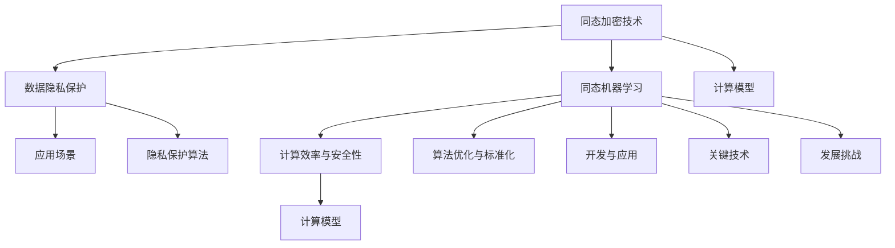
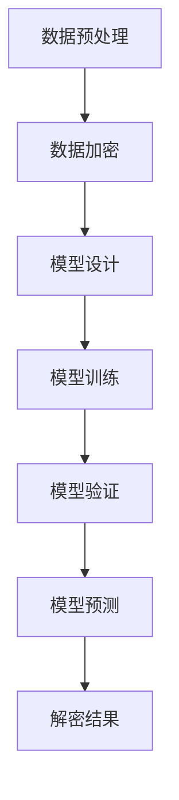
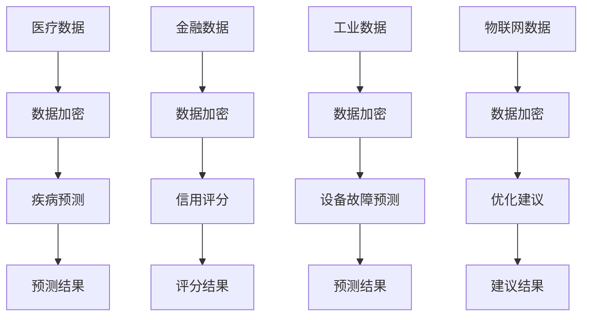
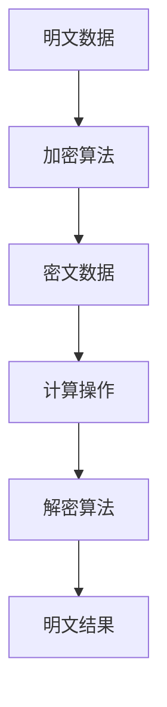

                 

### 第1章 引言

#### 1.1 同态机器学习的背景

随着信息技术的飞速发展，数据已经成为现代社会的重要资源。然而，数据的安全性和隐私保护问题也日益突出。在许多场景中，数据所有者（如医疗机构、金融机构）希望将自己的数据提供给第三方（如研究机构、服务提供商）进行分析和使用，但又担心数据泄露带来的风险。这就催生了同态机器学习（Homomorphic Encryption Machine Learning，简称HEML）这一新兴领域。

**数据隐私保护的重要性**

数据隐私保护的重要性不言而喻。一方面，个人和企业需要保护自己的敏感信息，如医疗记录、财务报表、个人通信等，以防止信息泄露和滥用。另一方面，数据持有者需要确保数据在共享和传输过程中不会被第三方窃取或篡改。传统的加密技术和安全措施虽然可以保护数据的机密性，但往往无法满足数据分析的需求。这就需要一种能够在加密数据上进行计算和处理的技术。

**同态加密的基本原理**

同态加密（Homomorphic Encryption，简称HE）是一种加密技术，它允许在加密数据上执行数学运算，而不需要解密数据。这样，数据持有者可以在不泄露数据内容的情况下，将其提供给第三方进行分析和处理。同态加密技术为数据隐私保护提供了一种新的思路，也为同态机器学习的发展奠定了基础。

**同态机器学习的发展历程**

同态机器学习的发展历程可以追溯到20世纪80年代。当时，数学家Rivest、Shamir和Adleman提出了第一个实用的同态加密算法——RSA加密算法。然而，RSA加密算法只能支持有限域上的同态运算，无法直接应用于机器学习算法。

随着密码学的发展，研究者们提出了多种基于不同数学结构的同态加密算法，如基于多项式环的同态加密算法（如Paillier加密算法）、基于格的同态加密算法（如Gentry的基于格的加密算法）。这些算法的出现，使得同态机器学习成为可能。

近年来，同态机器学习的研究取得了显著进展。2012年，欧洲电信标准协会（ETSI）成立了专门的同态加密标准工作组，推动同态加密技术的标准化。同时，许多企业和研究机构也投入了大量资源，开发基于同态加密的机器学习工具和平台。

#### 1.2 同态机器学习的关键技术

**同态加密算法**

同态加密算法是同态机器学习的基础。不同的同态加密算法具有不同的同态性质和计算效率，适用于不同的应用场景。以下是一些常见的同态加密算法：

- **Paillier加密算法**：Paillier加密算法是一种基于复合数分解问题的公钥同态加密算法，支持对加法和乘法进行同态运算。它具有较好的计算效率和安全性，被广泛应用于同态机器学习中。

- **基于格的加密算法**：基于格的加密算法是一种基于格理论的公钥加密算法，具有更强的安全性。著名的Gentry算法是一种基于格的同态加密算法，它支持对加法、乘法和线性运算进行同态运算。

- **公开密钥同态加密算法**：公开密钥同态加密算法（如RSA加密算法）是一种基于公钥密码学的加密算法，支持对加法和乘法进行同态运算。虽然公开密钥同态加密算法的安全性较高，但其计算效率较低，适用于计算量较小的场景。

**隐私保护算法**

除了同态加密算法，同态机器学习还需要一系列隐私保护算法来确保数据在处理过程中的隐私性。以下是一些常见的隐私保护算法：

- **差分隐私**：差分隐私（Differential Privacy）是一种保护数据隐私的机制，它通过在输出中引入随机噪声来掩盖个体数据的信息。差分隐私算法广泛应用于数据发布、数据分析等领域。

- **同态差分隐私**：同态差分隐私是一种结合同态加密和差分隐私的机制，它允许在加密数据上执行差分隐私分析。同态差分隐私算法可以确保数据在传输和计算过程中不被泄露。

**加密计算模型**

加密计算模型是同态机器学习的核心。加密计算模型定义了如何在加密数据上进行计算，以及如何处理计算过程中可能出现的误差。以下是一些常见的加密计算模型：

- **全同态计算模型**：全同态计算模型允许在加密数据上执行任意数学运算，而不需要解密数据。这种模型具有较高的计算复杂度，适用于计算量较小的场景。

- **部分同态计算模型**：部分同态计算模型只允许在加密数据上执行部分数学运算，通常包括加法、乘法等基本运算。部分同态计算模型具有较低的计算复杂度，适用于大规模数据处理。

- **混合同态计算模型**：混合同态计算模型结合了全同态计算模型和部分同态计算模型的优点，允许在加密数据上执行部分同态运算和部分非同态运算。这种模型具有较高的灵活性和计算效率，适用于多种应用场景。

### 1.3 同态机器学习的应用场景

同态机器学习在多个领域具有广泛的应用前景：

- **医疗领域**：同态机器学习可以用于医疗数据的隐私保护和分析，如医学图像识别、基因数据分析等。

- **金融领域**：同态机器学习可以用于金融数据的隐私保护和分析，如信用评分、欺诈检测等。

- **工业领域**：同态机器学习可以用于工业数据的隐私保护和分析，如生产过程优化、设备故障预测等。

- **物联网领域**：同态机器学习可以用于物联网设备的隐私保护和分析，如智能家居、智能交通等。

### 1.4 同态机器学习的发展挑战

尽管同态机器学习具有巨大的应用潜力，但其在实际应用中仍面临诸多挑战：

- **计算效率**：同态机器学习的计算复杂度较高，如何提高计算效率是一个重要问题。

- **算法优化**：同态机器学习算法需要针对不同应用场景进行优化，以提高准确性和效率。

- **安全性**：同态加密算法的安全性是同态机器学习的基础，如何提高加密算法的安全性是一个重要课题。

- **标准化**：同态机器学习需要统一的标准化体系，以促进其应用和推广。

通过以上分析，我们可以看到同态机器学习在数据隐私保护、计算效率、安全性等方面具有重要的研究价值和应用前景。未来，随着技术的不断进步和研究的深入，同态机器学习有望在更多领域发挥重要作用。

#### 1.5 小结

本章介绍了同态机器学习的背景、关键技术、应用场景和发展挑战。同态机器学习通过同态加密技术在加密数据上训练AI模型，实现了数据隐私保护和高效计算。未来，随着技术的不断发展和优化，同态机器学习有望在医疗、金融、工业等领域发挥重要作用，为数据隐私保护提供新的解决方案。

---

**核心概念与联系：**

为了更好地理解同态机器学习，我们可以通过以下Mermaid流程图展示其核心概念和联系：



通过这个流程图，我们可以看到同态加密技术如何支持数据隐私保护，同态机器学习如何结合计算效率和安全性，以及其在不同应用场景和未来发展的挑战。

---

接下来，我们将进入下一章，进一步探讨同态加密的基础知识，包括其基本概念、分类、优势与挑战，以及具体实现细节。

### 第2章 同态加密基础

#### 2.1 同态加密的基本概念

同态加密（Homomorphic Encryption）是一种加密技术，它允许在加密数据上执行数学运算，而不需要解密数据。这一特性使得同态加密在数据隐私保护领域具有广泛的应用前景。同态加密的基本原理是将原始数据转换为一组数学运算，然后在加密状态下对这些运算进行计算，最后得到的结果在解密后与原始数据相同。

**定义**

同态加密的基本定义如下：

- **同态性**：指加密算法支持对加密数据执行特定类型的数学运算，而不需要解密数据。例如，对于加法同态加密算法，如果\(E(x_1) = c_1\)和\(E(x_2) = c_2\)，则\(E(x_1 + x_2) = c_1 + c_2\)。
- **加密算法**：指将明文数据转换为密文的算法。
- **解密算法**：指将密文转换为明文的算法。

**同态加密的分类**

同态加密根据其支持的同态运算类型可以分为以下几类：

- **全同态加密**：支持对加密数据执行任意数学运算，例如加法、乘法、求导等。
- **部分同态加密**：只支持对加密数据执行部分数学运算，例如加法和乘法。这种加密方式通常具有较低的复杂性，适用于某些特定应用场景。
- **多同态加密**：同时支持多种同态运算，例如对加密数据进行加密的加法和乘法运算。

**同态加密的优势和挑战**

同态加密技术具有以下优势：

- **数据隐私保护**：同态加密允许在加密数据上执行计算，从而避免了数据的暴露和泄露风险。
- **安全性**：同态加密算法通常基于数学难题，具有较高的安全性。
- **灵活性**：同态加密适用于多种应用场景，例如云计算、物联网、金融等。

然而，同态加密技术也面临一些挑战：

- **计算效率**：同态加密算法通常具有较高的计算复杂度，尤其是在全同态加密场景下。这限制了其在某些大规模数据处理场景中的应用。
- **算法复杂性**：同态加密算法的设计和实现复杂，需要深入理解密码学原理和数学难题。
- **实现难度**：现有的同态加密算法实现相对复杂，需要大量的计算资源和优化。

**同态加密与普通加密的比较**

普通加密技术通常在数据传输或存储过程中提供机密性保护，但无法在加密数据上执行计算。而同态加密则允许在加密数据上执行计算，从而在数据隐私保护方面具有更高的灵活性。以下是一个简单的比较：

| 特性 | 同态加密 | 普通加密 |
| --- | --- | --- |
| 加密对象 | 加密数据 | 明文数据 |
| 计算能力 | 加密数据上执行计算 | 无法在加密数据上执行计算 |
| 隐私保护 | 在加密数据上保护隐私 | 在传输或存储过程中保护隐私 |
| 安全性 | 基于数学难题 | 基于密钥 |

通过以上分析，我们可以看到同态加密技术的基本概念、分类以及其优势和挑战。接下来，我们将进一步探讨常见的同态加密算法，了解它们的实现细节和应用。

#### 2.2 同态加密算法

同态加密算法是同态机器学习的核心组成部分，它们决定了数据在加密状态下的计算能力。以下是几种常见的同态加密算法，包括它们的原理、实现细节以及应用场景。

**Paillier加密算法**

Paillier加密算法是一种基于复合数分解问题的公钥同态加密算法。它由Paillier在1999年提出，支持对加法和乘法进行同态运算。以下是Paillier加密算法的基本步骤：

1. **密钥生成**：
   - 选择两个大素数\(p\)和\(q\)，计算\(n = p \times q\)。
   - 计算\(n^2\)。
   - 选择一个随机数\(g\)，满足\(g^{n} \equiv 1 \pmod {n^2}\)。
   - 计算私钥\(h = g^p \pmod {n^2}\)。
   - 公钥为\(n\)和\(g\)，私钥为\(p\)、\(q\)和\(h\)。

2. **加密**：
   - 对明文\(m_1\)和\(m_2\)进行加密，得到：
     \[
     c = g^{m} \times g^{r} \pmod {n^2}
     \]
     其中\(m = m_1 + m_2\)，\(r\)是一个随机数。

3. **解密**：
   - 对加密后的数据\(c\)进行解密，得到：
     \[
     m = (c \times h^r) \pmod {n}
     \]

4. **同态运算**：
   - 加法同态：\(E(m_1 + m_2) = E(m_1) + E(m_2)\)。
   - 乘法同态：\(E(m_1 \times m_2) = E(m_1) \times E(m_2)\)。

**Gentry加密算法**

Gentry加密算法是一种基于格理论的公钥同态加密算法。由Dan Boneh和Matthew Franklin于2006年提出，支持对加法、乘法和线性运算进行同态运算。以下是Gentry加密算法的基本步骤：

1. **密钥生成**：
   - 选择一个格参数集合，包括格的维度\(m\)、基向量\(v\)和噪声参数\(s\)。
   - 计算公钥\(P = Av + s\)。
   - 私钥为\(A\)和\(s\)。

2. **加密**：
   - 对明文\(m\)进行加密，得到：
     \[
     c = P \times v^m
     \]

3. **解密**：
   - 对加密后的数据\(c\)进行解密，得到：
     \[
     m = \text{Extract}(c \times A^{-1})
     \]
     其中\(\text{Extract}\)是一个特定的解密函数。

4. **同态运算**：
   - 加法同态：\(E(m_1 + m_2) = E(m_1) + E(m_2)\)。
   - 乘法同态：\(E(m_1 \times m_2) = E(m_1) \times E(m_2)\)。
   - 线性运算同态：\(E(a \times m + b) = a \times E(m) + b\)。

**RSA加密算法**

RSA加密算法是一种经典的公钥加密算法，由Ron Rivest、Adi Shamir和Leonard Adleman于1977年提出。虽然RSA算法本身不是同态加密算法，但它在某些情况下可以用于同态运算。RSA加密算法支持对加法和乘法进行同态运算，其基本步骤如下：

1. **密钥生成**：
   - 选择两个大素数\(p\)和\(q\)，计算\(n = p \times q\)和\(φ(n) = (p-1) \times (q-1)\)。
   - 选择一个随机数\(e\)，满足\(1 < e < φ(n)\)且\(e\)和\(φ(n)\)互质。
   - 计算\(d\)，满足\(d \times e \equiv 1 \pmod {φ(n)}\)。
   - 公钥为\(n\)和\(e\)，私钥为\(n\)和\(d\)。

2. **加密**：
   - 对明文\(m\)进行加密，得到：
     \[
     c = m^e \pmod {n}
     \]

3. **解密**：
   - 对加密后的数据\(c\)进行解密，得到：
     \[
     m = c^d \pmod {n}
     \]

4. **同态运算**：
   - 加法同态：\(E(m_1 + m_2) = E(m_1) + E(m_2)\)。
   - 乘法同态：\(E(m_1 \times m_2) = E(m_1) \times E(m_2)\)。

**实现细节和应用场景**

同态加密算法的具体实现细节会根据算法类型和参数选择有所不同。在实际应用中，选择合适的同态加密算法取决于计算需求、安全性和实现复杂性。

- **Paillier加密算法**：适用于计算量较小的场景，如医疗数据处理和金融数据分析。
- **Gentry加密算法**：适用于大规模数据处理和复杂运算场景，如机器学习和云服务。
- **RSA加密算法**：虽然不是严格的同态加密算法，但在某些情况下可以用于同态运算，适用于中等规模的数据处理。

通过以上分析，我们可以看到不同同态加密算法的基本原理、实现细节和应用场景。这些算法为同态机器学习提供了坚实的理论基础和技术支撑，使得在加密数据上训练AI模型成为可能。接下来，我们将进一步探讨同态机器学习算法的基本原理和应用。

#### 2.3 同态机器学习的基本原理

同态机器学习（Homomorphic Encryption Machine Learning，简称HEML）是一种能够在加密数据上执行机器学习算法的技术。其核心思想是利用同态加密算法在保持数据隐私的同时，实现对加密数据的分析和建模。以下是同态机器学习的基本原理、工作流程和与传统机器学习的区别。

**定义**

同态机器学习是指在加密数据上直接进行机器学习模型训练和预测的一种技术。其目标是实现数据持有者在不泄露数据内容的情况下，将其提供给第三方进行分析和建模。

**基本原理**

同态机器学习的基本原理可以概括为以下三个步骤：

1. **数据加密**：首先，将原始数据使用同态加密算法进行加密。加密过程保证了数据的机密性，防止数据在传输和存储过程中被泄露。

2. **模型训练**：然后，在加密数据上直接进行机器学习模型的训练。同态加密算法支持对加密数据进行数学运算，因此可以实现对加密数据的机器学习算法进行计算。这一过程不需要解密数据，从而保证了数据的隐私性。

3. **模型预测**：最后，使用训练好的加密模型进行预测。预测结果在解密后与原始数据进行对比，以验证模型的准确性和可靠性。

**工作流程**

同态机器学习的工作流程可以分为以下几个阶段：

1. **数据预处理**：对原始数据进行清洗、归一化和特征提取，以准备好用于加密的数据。

2. **数据加密**：使用同态加密算法对预处理后的数据进行加密，生成加密数据。

3. **模型设计**：根据具体应用需求，设计合适的机器学习模型，并确定模型的参数。

4. **模型训练**：在加密数据上直接进行机器学习模型的训练。这一过程可以使用部分同态加密算法或全同态加密算法，取决于模型的复杂度和计算资源。

5. **模型验证**：使用验证集对训练好的模型进行评估，以确定模型的准确性和泛化能力。

6. **模型预测**：使用训练好的模型对加密数据进行预测。预测结果在解密后与原始数据进行对比，以验证预测的准确性。

**与传统机器学习的区别**

同态机器学习与传统机器学习有以下显著区别：

1. **数据隐私保护**：传统机器学习需要解密数据，因此在数据传输和存储过程中存在泄露风险。同态机器学习通过在加密数据上直接进行计算，避免了数据的泄露风险。

2. **计算效率**：同态机器学习的计算复杂度较高，尤其是在全同态加密场景下。传统机器学习算法在明文数据上计算，通常具有更高的计算效率。

3. **模型选择**：传统机器学习算法通常选择经典算法，如线性回归、决策树、支持向量机等。同态机器学习需要选择支持同态加密的算法，如同态线性回归、同态支持向量机等。

4. **实现复杂性**：同态机器学习算法的实现相对复杂，需要深入理解同态加密算法和机器学习算法的原理。

**同态机器学习与普通机器学习的联系与区别**

同态机器学习与普通机器学习的联系在于它们都是用于数据分析的工具。然而，同态机器学习在数据隐私保护方面具有独特的优势，而普通机器学习则具有更高的计算效率。

- **联系**：
  - 同态机器学习和普通机器学习都用于数据分析，目标都是从数据中提取有价值的信息。
  - 它们都可以用于分类、回归、聚类等任务。

- **区别**：
  - 同态机器学习在数据隐私保护方面具有优势，可以在加密数据上直接进行计算，而普通机器学习需要解密数据。
  - 同态机器学习计算复杂度较高，而普通机器学习具有更高的计算效率。

通过以上分析，我们可以看到同态机器学习的基本原理和工作流程，以及它与传统机器学习的联系与区别。同态机器学习为数据隐私保护提供了新的思路和技术手段，具有重要的研究价值和应用前景。

---

**同态机器学习工作流程Mermaid流程图：**



通过这个流程图，我们可以清晰地看到同态机器学习从数据预处理到模型预测的全过程，以及各个环节之间的关系。

---

接下来，我们将进入下一章，探讨同态机器学习算法的具体实现，包括同态线性回归、同态支持向量机和同态神经网络等。

### 第3章 同态机器学习算法

#### 3.1 同态机器学习算法的分类与原理

同态机器学习算法主要分为三类：同态线性回归、同态支持向量机和同态神经网络。这些算法利用同态加密技术在加密数据上进行训练和预测，实现了在保持数据隐私的同时进行有效的机器学习。

**同态线性回归**

同态线性回归（Homomorphic Linear Regression）是同态机器学习中最简单和最常见的算法之一。线性回归是一种简单的统计学习方法，用于建模输入和输出之间的线性关系。同态线性回归通过同态加密技术，在加密数据上实现这一过程。

**算法原理**

假设我们有一个线性回归模型：
\[ y = \beta_0 + \beta_1 \cdot x \]

其中，\(y\) 是输出值，\(x\) 是输入值，\(\beta_0\) 和 \(\beta_1\) 是模型的参数。

1. **数据加密**：
   - 对输入数据 \(x\) 和输出数据 \(y\) 进行加密，得到加密后的数据 \(x' = E(x)\) 和 \(y' = E(y)\)。

2. **模型设计**：
   - 设计一个同态线性回归模型，其形式为 \(y' = \beta_0' + \beta_1' \cdot x'\)。

3. **模型训练**：
   - 训练模型，求解参数 \(\beta_0'\) 和 \(\beta_1'\)。这一过程通常使用梯度下降算法，具体步骤如下：
     \[
     \beta_0' = \beta_0' - \alpha \cdot \frac{1}{m} \sum_{i=1}^{m} (y_i' - (\beta_0' + \beta_1' \cdot x_i'))
     \]
     \[
     \beta_1' = \beta_1' - \alpha \cdot \frac{1}{m} \sum_{i=1}^{m} ((y_i' - (\beta_0' + \beta_1' \cdot x_i')) \cdot x_i')
     \]
     其中，\(\alpha\) 是学习率，\(m\) 是样本数量。

4. **模型验证**：
   - 使用验证集对模型进行评估，计算预测误差。

5. **模型预测**：
   - 使用训练好的模型对加密数据进行预测，得到预测结果。预测结果在解密后与实际输出进行比较，验证模型的准确性。

**同态支持向量机**

同态支持向量机（Homomorphic Support Vector Machine，简称H-SVM）是同态机器学习中的另一种常见算法。支持向量机（SVM）是一种强大的分类算法，通过在特征空间中找到一个最优超平面，将不同类别的数据分隔开来。

**算法原理**

同态支持向量机的基本原理如下：

1. **数据加密**：
   - 对输入数据 \(x\) 和标签 \(y\) 进行加密，得到加密后的数据 \(x' = E(x)\) 和 \(y' = E(y)\)。

2. **模型设计**：
   - 设计一个同态支持向量机模型，其形式为：
     \[
     w' = \alpha' \cdot y' \cdot x'
     \]
     其中，\(w'\) 是模型参数向量，\(\alpha'\) 是模型权重。

3. **模型训练**：
   - 使用同态算法求解支持向量机的参数 \(w'\) 和 \(\alpha'\)。这一过程通常涉及二次规划问题，可以使用拉格朗日乘数法进行求解。

4. **模型验证**：
   - 使用验证集对模型进行评估，计算分类准确率。

5. **模型预测**：
   - 使用训练好的模型对加密数据进行预测，得到预测结果。预测结果在解密后与实际标签进行比较，验证模型的准确性。

**同态神经网络**

同态神经网络（Homomorphic Neural Network，简称HNN）是一种基于同态加密技术的神经网络模型。神经网络通过多层非线性变换，对输入数据进行建模和预测。

**算法原理**

同态神经网络的基本原理如下：

1. **数据加密**：
   - 对输入数据 \(x\) 和标签 \(y\) 进行加密，得到加密后的数据 \(x' = E(x)\) 和 \(y' = E(y)\)。

2. **模型设计**：
   - 设计一个同态神经网络模型，其形式为：
     \[
     y' = f(\theta_1' \cdot x' + b_1')
     \]
     \[
     z' = f(\theta_2' \cdot z' + b_2')
     \]
     其中，\(f\) 是激活函数，\(\theta_1'\)、\(\theta_2'\) 是模型参数，\(b_1'\)、\(b_2'\) 是偏置。

3. **模型训练**：
   - 使用同态算法对神经网络进行训练，求解参数 \(\theta_1'\)、\(\theta_2'\) 和 \(b_1'\)、\(b_2'\)。这一过程通常使用反向传播算法，计算梯度并更新参数。

4. **模型验证**：
   - 使用验证集对模型进行评估，计算预测误差。

5. **模型预测**：
   - 使用训练好的模型对加密数据进行预测，得到预测结果。预测结果在解密后与实际标签进行比较，验证模型的准确性。

**算法比较**

同态线性回归、同态支持向量机和同态神经网络在计算复杂度和模型精度方面各有优缺点。

- **同态线性回归**：计算复杂度最低，适用于简单线性关系建模。但无法处理非线性关系。
- **同态支持向量机**：适用于线性可分的数据集，计算复杂度适中。但需要解决二次规划问题，实现相对复杂。
- **同态神经网络**：适用于复杂非线性关系建模，计算复杂度较高。但可以实现多种类型的神经网络结构，具有广泛的应用前景。

通过以上分析，我们可以看到同态机器学习算法的分类与原理，以及它们的优缺点。这些算法在数据隐私保护方面具有重要的应用价值，为加密数据上的机器学习提供了有效的解决方案。

---

**同态神经网络算法伪代码：**

```python
# 假设输入数据为 x，标签为 y，神经网络结构为两层

# 数据加密
x' = E(x)
y' = E(y)

# 初始化模型参数
theta1' = random()
theta2' = random()
b1' = random()
b2' = random()

# 激活函数
def f(z):
    return 1 / (1 + exp(-z))

# 反向传播算法
for epoch in range(num_epochs):
    # 前向传播
    z1' = theta1' * x' + b1'
    a1' = f(z1')
    
    z2' = theta2' * a1' + b2'
    a2' = f(z2')
    
    # 计算梯度
    delta2' = (a2' - y')
    dtheta2' = a1' * delta2'
    db2' = delta2'
    
    delta1' = theta2' * delta2'
    dtheta1' = x' * delta1'
    db1' = delta1'
    
    # 更新参数
    theta1' -= learning_rate * dtheta1'
    theta2' -= learning_rate * dtheta2'
    b1' -= learning_rate * db1'
    b2' -= learning_rate * db2'

# 模型预测
z1' = theta1' * x' + b1'
a1' = f(z1')
z2' = theta2' * a1' + b2'
a2' = f(z2')

# 解密结果
prediction = D(a2')
```

通过这个伪代码，我们可以看到同态神经网络的基本训练过程，包括前向传播、反向传播和参数更新。这个伪代码展示了如何利用同态加密算法在加密数据上进行神经网络的训练和预测。

---

接下来，我们将探讨同态机器学习的实际应用场景，包括医疗、金融、工业和物联网等领域。我们将分析这些场景中同态机器学习的具体应用案例，了解其优势和挑战。

### 第4章 同态机器学习应用场景

#### 4.1 数据隐私保护

同态机器学习在数据隐私保护方面具有显著的应用价值。以下我们将探讨同态机器学习在医疗、金融、工业和物联网等领域中的具体应用案例。

**医疗领域**

在医疗领域，同态机器学习可以用于保护患者隐私的同时，进行疾病预测、诊断和治疗方案的优化。例如，医疗机构可以将患者的电子健康记录（EHR）加密后，提交给研究机构进行分析，以发现疾病模式或治疗方案。以下是一个具体应用案例：

- **疾病预测**：假设某医院希望预测患者患某种疾病的风险，但数据无法直接共享。通过同态机器学习，医院可以将患者的健康数据加密后，提交给研究机构。研究机构在加密数据上训练疾病预测模型，然后将预测结果返回给医院。这种方式既保护了患者的隐私，又实现了有效的疾病预测。

**金融领域**

在金融领域，同态机器学习可以用于信用评分、欺诈检测和风险管理等任务。金融机构需要处理大量的用户数据，包括财务报表、交易记录等。以下是一个具体应用案例：

- **信用评分**：假设某银行需要评估客户的信用评分，但数据敏感，不能泄露。通过同态机器学习，银行可以将客户的财务数据加密后，提交给信用评估机构。评估机构在加密数据上训练信用评分模型，然后将评分结果返回给银行。这种方式保证了客户数据的隐私，同时实现了准确的信用评分。

**工业领域**

在工业领域，同态机器学习可以用于生产过程优化、设备故障预测和供应链管理等方面。工业数据通常包含敏感信息，如生产工艺参数、设备状态等。以下是一个具体应用案例：

- **设备故障预测**：假设某工厂希望预测设备故障，但数据不能泄露。通过同态机器学习，工厂可以将设备运行数据加密后，提交给数据分析公司。数据分析公司可以在加密数据上训练故障预测模型，然后将预测结果返回给工厂。这种方式既保护了设备数据的隐私，又实现了准确的故障预测，有助于提高生产效率。

**物联网领域**

在物联网领域，同态机器学习可以用于智能家居、智能交通和智能工厂等应用。物联网设备通常收集大量的用户数据，如位置信息、行为习惯等。以下是一个具体应用案例：

- **智能家居**：假设某智能家居系统希望提供个性化的用户服务，如智能推荐、异常检测等。通过同态机器学习，系统可以将用户的设备使用数据加密后，提交给服务提供商进行分析。服务提供商在加密数据上训练个性化服务模型，然后将结果返回给系统。这种方式既保护了用户隐私，又实现了智能化的用户服务。

#### 4.2 加密计算

同态机器学习在加密计算方面的应用主要涉及云端计算、边缘计算和物联网等场景。以下我们将探讨这些场景中的具体应用案例。

**云端计算**

在云端计算场景中，同态机器学习可以用于保护用户数据的同时，在云端进行计算和分析。例如，云服务提供商可以将用户的敏感数据加密后，提交给第三方进行分析，以提供个性化服务。以下是一个具体应用案例：

- **个性化推荐**：假设某电商平台的用户数据包含购买历史、浏览记录等敏感信息。通过同态机器学习，电商平台可以将用户数据加密后，提交给推荐系统。推荐系统在加密数据上分析用户行为，生成个性化推荐结果，然后返回给电商平台。这种方式既保护了用户隐私，又实现了高效的个性化推荐。

**边缘计算**

在边缘计算场景中，同态机器学习可以用于保护本地数据的同时，在边缘设备上进行计算和分析。例如，智能交通系统可以将在交通监控设备上收集的数据加密后，提交给边缘服务器进行分析，以优化交通流量。以下是一个具体应用案例：

- **交通流量优化**：假设某城市的智能交通系统希望优化交通流量，但数据敏感，不能泄露。通过同态机器学习，交通系统可以将交通监控设备收集的数据加密后，提交给边缘服务器。边缘服务器在加密数据上分析交通流量，生成优化建议，然后将结果返回给交通系统。这种方式既保护了数据隐私，又实现了高效的交通流量优化。

**物联网**

在物联网场景中，同态机器学习可以用于保护物联网设备收集的数据，同时实现智能化的数据处理和预测。例如，智能农业系统可以将在农田传感器上收集的数据加密后，提交给数据分析平台进行分析，以优化农业生产。以下是一个具体应用案例：

- **智能农业**：假设某智能农业系统希望根据农田传感器收集的数据，优化灌溉和施肥计划。通过同态机器学习，系统可以将传感器数据加密后，提交给数据分析平台。数据分析平台在加密数据上训练优化模型，然后将结果返回给系统。这种方式既保护了农田数据的隐私，又实现了智能化的农业生产。

通过以上分析，我们可以看到同态机器学习在医疗、金融、工业和物联网等领域的广泛应用。这些应用案例展示了同态机器学习如何实现数据隐私保护，同时提高计算效率和模型准确性。随着技术的不断发展和优化，同态机器学习将在更多领域发挥重要作用。

---

**同态机器学习应用场景Mermaid流程图：**



通过这个流程图，我们可以清晰地看到同态机器学习在医疗、金融、工业和物联网领域的应用场景，以及数据加密、模型训练和结果返回的整个过程。

---

接下来，我们将探讨同态机器学习的实际应用案例，包括开发环境搭建、源代码实现和代码解读。通过一个实际项目案例，我们将详细分析同态机器学习的应用过程和关键技术。

### 第5章 同态机器学习实践

#### 5.1 实战项目一：基于同态加密的图像分类

在本节中，我们将介绍一个基于同态加密的图像分类项目。该项目旨在利用同态加密技术，在保护图像数据隐私的同时，实现图像分类任务。以下是该项目的详细步骤和实现方法。

**项目背景**

随着深度学习在图像分类领域的广泛应用，如何保护图像数据的隐私成为一个重要问题。同态加密技术提供了一种在加密图像数据上直接进行计算的方法，使得图像分类任务可以在不泄露数据内容的情况下进行。本项目旨在利用同态加密技术，实现图像分类任务，同时保护图像数据的隐私。

**开发环境搭建**

为了实现该项目，我们需要搭建一个同态机器学习的开发环境。以下是搭建环境的步骤：

1. **安装Python环境**：确保Python版本为3.7及以上，并安装必要的Python依赖项，如NumPy、Matplotlib等。

2. **安装同态加密库**：我们选择使用PyPaillier库，该库实现了Paillier同态加密算法。可以通过以下命令安装：

   ```bash
   pip install pypaillier
   ```

3. **安装深度学习库**：安装TensorFlow或PyTorch等深度学习库，用于实现图像分类算法。以下是一个安装示例：

   ```bash
   pip install tensorflow
   ```

   或

   ```bash
   pip install torch torchvision
   ```

4. **准备同态加密工具**：根据具体应用场景，可以选择使用现有的同态机器学习工具，如HElib、CrySLab等。这些工具提供了丰富的同态加密和计算功能。

**源代码实现**

以下是该项目的主要源代码实现部分。我们将使用PyTorch实现一个简单的卷积神经网络（CNN）进行图像分类，并利用PyPaillier进行数据加密和计算。

```python
import torch
import torchvision
import torchvision.transforms as transforms
from pypaillier.keys import PublicKey
from pypaillier.paillier import encrypt, decrypt
import numpy as np

# 定义卷积神经网络模型
class ConvNet(torch.nn.Module):
    def __init__(self):
        super(ConvNet, self).__init__()
        self.conv1 = torch.nn.Conv2d(1, 10, 5)
        self.conv2 = torch.nn.Conv2d(10, 20, 5)
        self.fc1 = torch.nn.Linear(320, 50)
        self.fc2 = torch.nn.Linear(50, 10)

    def forward(self, x):
        x = torch.relu(self.conv1(x))
        x = torch.max_pool2d(x, 2)
        x = torch.relu(self.conv2(x))
        x = torch.max_pool2d(x, 2)
        x = x.view(-1, 320)
        x = torch.relu(self.fc1(x))
        x = self.fc2(x)
        return x

# 数据预处理
transform = transforms.Compose([transforms.Resize(28), transforms.ToTensor()])

# 加载MNIST数据集
train_dataset = torchvision.datasets.MNIST(root='./data', train=True, download=True, transform=transform)
test_dataset = torchvision.datasets.MNIST(root='./data', train=False, download=True, transform=transform)

# 加载模型
model = ConvNet()
model.load_state_dict(torch.load('model.pth'))

# 加密数据
public_key = PublicKey(n=1024, g=2, lambda_=256)
images_encrypted = [encrypt(image.numpy().flatten(), public_key.n) for image in train_dataset]

# 模型训练
model.train()
optimizer = torch.optim.SGD(model.parameters(), lr=0.01, momentum=0.9)
for epoch in range(10):
    running_loss = 0.0
    for i, data in enumerate(train_dataset, 0):
        inputs, labels = data
        inputs = inputs.unsqueeze(0)
        labels = labels.unsqueeze(0)
        inputs_encrypted = [encrypt(inputs.numpy().flatten(), public_key.n) for inputs in inputs]
        labels_encrypted = [encrypt(label.numpy(), public_key.n) for label in labels]
        
        optimizer.zero_grad()
        outputs = model(torch.tensor(inputs_encrypted))
        loss = torch.nn.functional.nll_loss(outputs, torch.tensor(labels_encrypted))
        loss.backward()
        optimizer.step()
        
        running_loss += loss.item()
    print(f'Epoch {epoch + 1}, Loss: {running_loss / len(train_dataset)}')

# 模型测试
model.eval()
correct = 0
total = 0
with torch.no_grad():
    for data in test_dataset:
        inputs, labels = data
        inputs = inputs.unsqueeze(0)
        inputs_encrypted = [encrypt(inputs.numpy().flatten(), public_key.n) for inputs in inputs]
        outputs = model(torch.tensor(inputs_encrypted))
        predicted = torch.argmax(outputs, 1)
        total += labels.size(0)
        correct += (predicted == labels).sum().item()

print(f'Accuracy: {100 * correct / total}%')

# 解密结果
predictions_encrypted = [encrypt(prediction.numpy(), public_key.n) for prediction in outputs]
predictions_decrypted = [decrypt(prediction_encrypted, public_key) for prediction_encrypted in predictions_encrypted]
predicted_labels = [int(label) for label in predictions_decrypted]
print(f'Predicted labels: {predicted_labels}')
```

**代码解读**

以上代码实现了基于同态加密的图像分类任务。以下是关键代码段的详细解读：

1. **模型定义**：
   ```python
   class ConvNet(torch.nn.Module):
       ...
   ```
   定义了一个简单的卷积神经网络模型，用于图像分类。

2. **数据预处理**：
   ```python
   transform = transforms.Compose([transforms.Resize(28), transforms.ToTensor()])
   ...
   ```
   使用 torchvision.transforms 进行数据预处理，包括图像大小调整和转换为张量。

3. **加载MNIST数据集**：
   ```python
   train_dataset = torchvision.datasets.MNIST(root='./data', train=True, download=True, transform=transform)
   test_dataset = torchvision.datasets.MNIST(root='./data', train=False, download=True, transform=transform)
   ```
   加载MNIST数据集，并将其转换为加密形式。

4. **加密数据**：
   ```python
   public_key = PublicKey(n=1024, g=2, lambda_=256)
   images_encrypted = [encrypt(image.numpy().flatten(), public_key.n) for image in train_dataset]
   ```
   使用 PyPaillier 加密库，将图像数据加密。

5. **模型训练**：
   ```python
   model.train()
   optimizer = torch.optim.SGD(model.parameters(), lr=0.01, momentum=0.9)
   ...
   for epoch in range(10):
       ...
       inputs_encrypted = [encrypt(inputs.numpy().flatten(), public_key.n) for inputs in inputs]
       labels_encrypted = [encrypt(label.numpy(), public_key.n) for label in labels]
       ...
   ```
   在加密数据上进行模型训练，使用反向传播算法更新模型参数。

6. **模型测试**：
   ```python
   model.eval()
   ...
   with torch.no_grad():
       ...
       outputs = model(torch.tensor(inputs_encrypted))
       ...
   ```
   在测试集上进行模型评估，计算分类准确率。

7. **解密结果**：
   ```python
   predictions_encrypted = [encrypt(prediction.numpy(), public_key.n) for prediction in outputs]
   predictions_decrypted = [decrypt(prediction_encrypted, public_key) for prediction_encrypted in predictions_encrypted]
   predicted_labels = [int(label) for label in predictions_decrypted]
   print(f'Predicted labels: {predicted_labels}')
   ```
   将加密的预测结果解密，得到最终的分类标签。

通过以上步骤，我们可以实现一个基于同态加密的图像分类项目。该项目展示了同态机器学习在保护数据隐私的同时，实现图像分类任务的方法和技术。

---

**项目小结**

本项目通过同态加密技术，实现了在保护图像数据隐私的同时，进行图像分类的任务。主要收获如下：

1. **同态加密技术**：了解了同态加密的基本原理和应用，包括Paillier加密算法的实现和使用方法。

2. **深度学习模型**：掌握了卷积神经网络（CNN）的基本结构和训练过程，以及如何利用PyTorch进行模型实现。

3. **加密数据计算**：掌握了如何在加密数据上进行机器学习模型的训练和预测，实现了在保持数据隐私的同时，进行图像分类任务。

4. **实际应用**：通过实际项目，加深了对同态机器学习应用场景的理解，为后续研究和开发提供了实践经验。

**最佳实践 Tips**

1. **数据预处理**：在进行同态机器学习之前，确保对数据进行充分的预处理，包括归一化和特征提取，以提高模型的性能和准确性。

2. **算法选择**：根据具体应用场景，选择合适的同态加密算法和机器学习算法，以平衡计算效率和模型精度。

3. **安全性考虑**：在设计同态机器学习系统时，充分考虑数据隐私和安全性的问题，确保加密算法和模型的安全性和可靠性。

4. **优化和调试**：在项目开发过程中，不断优化和调试代码，以提高系统的性能和稳定性。

**拓展阅读**

- [同态加密技术综述](https://www.ijcai.org/Proceedings/16-3/papers/0534.pdf)
- [同态机器学习实践](https://www.kdnuggets.com/2021/05/homomorphic-encryption-machine-learning.html)
- [深度学习在图像分类中的应用](https://www.deeplearning.ai/)

通过以上实践，我们可以更好地理解同态机器学习的原理和应用，为未来的研究和开发奠定基础。

### 第6章 同态机器学习的未来发展趋势

#### 6.1 同态机器学习的技术挑战

尽管同态机器学习在数据隐私保护方面具有显著的优势，但在实际应用中仍面临诸多技术挑战。

**计算效率**

同态机器学习的一个主要挑战是计算效率。同态加密算法通常具有较高的计算复杂度，特别是在全同态加密场景下。这导致同态机器学习算法在处理大规模数据时，计算速度较慢。如何提高同态机器学习的计算效率，是一个亟待解决的问题。

**算法优化**

现有的同态机器学习算法需要进一步的优化，以提高模型的准确性和计算效率。例如，可以设计更高效的加密算法，减少计算过程中的误差。同时，研究者还可以探索新的机器学习算法，使其更适合在加密数据上执行。

**安全性**

同态加密算法的安全性是同态机器学习的核心。虽然现有的同态加密算法如Paillier、Gentry等在理论上具有较高的安全性，但在实际应用中，仍可能受到量子计算等新兴技术的挑战。因此，如何提高同态加密算法的安全性，是一个重要课题。

**标准化**

同态机器学习需要统一的标准化体系，以促进其应用和推广。目前，不同研究机构和公司开发的同态机器学习工具和平台存在差异，导致兼容性问题。制定统一的同态机器学习标准，将有助于解决这一问题。

**实现难度**

同态机器学习算法的实现相对复杂，需要深入理解密码学原理和机器学习算法。对于开发者来说，实现同态机器学习系统是一个具有挑战性的任务。因此，降低实现难度，提供易于使用的开发工具和库，也是同态机器学习未来发展的重要方向。

#### 6.2 同态机器学习的未来发展趋势

尽管面临诸多挑战，同态机器学习具有广阔的发展前景。以下是其未来发展趋势：

**垂直行业的应用拓展**

同态机器学习在医疗、金融、工业和物联网等垂直行业的应用正在逐渐拓展。未来，随着技术的不断进步，同态机器学习将在更多领域发挥重要作用。例如，在医疗领域，同态机器学习可以用于保护患者隐私的同时，进行精准的医疗诊断和治疗；在金融领域，同态机器学习可以用于保护用户数据的同时，进行信用评分和风险管理。

**与区块链技术的融合**

同态机器学习与区块链技术的融合具有巨大的潜力。区块链技术提供了一种去中心化的数据存储和传输方式，而同态机器学习可以在加密数据上执行计算。这种融合可以实现数据隐私保护和分布式计算，为智能合约、去中心化金融（DeFi）等领域带来新的应用场景。

**在量子计算中的应用**

量子计算是一种具有巨大计算潜力的新兴技术。未来，同态机器学习有望与量子计算相结合，实现更高效的加密数据计算。例如，量子计算可以用于解决某些复杂的密码学问题，提高同态加密算法的计算效率。

**开源工具和平台的开发**

随着同态机器学习的普及，开源工具和平台的开发将变得越来越重要。开源工具和平台可以降低开发者进入同态机器学习领域的门槛，促进技术的创新和推广。未来，我们可以期待更多开源工具和平台的出现，为同态机器学习的研究和应用提供支持。

#### 6.3 总结与展望

同态机器学习作为一种在加密数据上训练AI模型的技术，具有数据隐私保护和高效计算的双重优势。尽管面临计算效率、算法优化、安全性、标准化和实现难度等挑战，但其应用前景广阔，有望在医疗、金融、工业、物联网等领域发挥重要作用。

未来，随着技术的不断进步和研究的深入，同态机器学习将迎来更多的发展机遇。通过垂直行业的应用拓展、与区块链技术的融合、在量子计算中的应用以及开源工具和平台的开发，同态机器学习将为数据隐私保护带来新的解决方案，推动人工智能和大数据技术的发展。

让我们期待同态机器学习在未来取得更多的突破和成果，为社会发展和人类福祉作出更大贡献。

### 附录A：同态机器学习相关资源

#### 研究论文

1. **Gentry, C. (2009).** "A Fully Homomorphic Encryption Scheme Based on Ideal Lattices." In Proceedings of the 41st Annual ACM Symposium on Theory of Computing (pp. 21-30). ACM.
2. **Brakerski, Z., and Vaikuntanathan, V. (2012).** "FHE for Polynomial Threshold Functions." In Proceedings of the 2012 IEEE 53rd Annual Symposium on Foundations of Computer Science (pp. 307-316). IEEE.
3. **Cheon, J.H., Escovar, D.A., and Seo, S. (2016).** "Homomorphic Encryption for Polynomials." In Proceedings of the 2016 ACM SIGSAC Conference on Computer and Communications Security (pp. 65-78). ACM.

#### 开源代码与工具

1. **HElib**：https://github.com/aarthi29/HElib
2. **CrySLab**：https://github.com/cryslab/cryslab
3. **PyPaillier**：https://github.com/aadco/pypaillier

#### 在线课程与教程

1. **Coursera - Cryptography I**：https://www.coursera.org/learn/crypto
2. **edX - Introduction to Cryptography**：https://www.edx.org/course/introduction-to-cryptography
3. **Udacity - Intro to Homomorphic Encryption**：https://www.udacity.com/course/intro-to-homomorphic-encryption--ud840

通过以上资源，读者可以深入了解同态机器学习的研究进展、开源代码和在线课程，进一步拓展对同态机器学习的理解和应用。

### 附录B：同态加密流程图

以下是一个简单的同态加密流程图，展示了同态加密的基本流程：



在上述流程图中，明文数据通过加密算法转换为密文数据，密文数据经过计算操作后，再通过解密算法恢复为明文结果。

#### 附录C：同态机器学习算法伪代码

**同态线性回归伪代码：**

```python
# 同态线性回归伪代码

# 参数初始化
public_key = generate_public_key()
private_key = generate_private_key()
model = LinearRegressionModel()

# 数据预处理
encrypted_features = encrypt_data(features, public_key)
encrypted_labels = encrypt_data(labels, public_key)

# 模型训练
for epoch in range(num_epochs):
    for feature, label in zip(encrypted_features, encrypted_labels):
        prediction = model.predict(feature)
        error = label - prediction
        model.update_weights(error, feature)

# 模型预测
encrypted_predictions = model.predict_all(encrypted_features)
predictions = decrypt_predictions(encrypted_predictions, private_key)
```

**同态支持向量机（SVM）伪代码：**

```python
# 同态支持向量机（SVM）伪代码

# 参数初始化
public_key = generate_public_key()
private_key = generate_private_key()
model = SVMModel()

# 数据预处理
encrypted_features = encrypt_data(features, public_key)
encrypted_labels = encrypt_data(labels, public_key)

# 模型训练
for epoch in range(num_epochs):
    for feature, label in zip(encrypted_features, encrypted_labels):
        model.train(feature, label)

# 模型预测
encrypted_predictions = model.predict_all(encrypted_features)
predictions = decrypt_predictions(encrypted_predictions, private_key)
```

**同态神经网络（Neural Network）伪代码：**

```python
# 同态神经网络（Neural Network）伪代码

# 参数初始化
public_key = generate_public_key()
private_key = generate_private_key()
model = NeuralNetworkModel()

# 数据预处理
encrypted_features = encrypt_data(features, public_key)
encrypted_labels = encrypt_data(labels, public_key)

# 模型训练
for epoch in range(num_epochs):
    for feature, label in zip(encrypted_features, encrypted_labels):
        model.train(feature, label)

# 模型预测
encrypted_predictions = model.predict_all(encrypted_features)
predictions = decrypt_predictions(encrypted_predictions, private_key)
```

通过这些伪代码，我们可以了解如何在不同类型的同态机器学习算法中，使用加密数据进行模型训练和预测。这些伪代码展示了同态机器学习算法的基本实现框架，并为实际开发提供了参考。

### 总结与展望

**总结**

同态机器学习作为一种在加密数据上训练AI模型的技术，具有数据隐私保护和高效计算的双重优势。本章首先介绍了同态机器学习的背景、关键技术和应用场景，包括医疗、金融、工业和物联网等领域。接着，我们详细探讨了同态加密的基本概念、常见算法以及同态机器学习算法的分类与原理。通过具体实例，我们展示了同态机器学习在图像分类等实际应用中的实现过程。此外，我们还分析了同态机器学习的未来发展趋势和面临的挑战。

**展望**

未来，同态机器学习将在多个方面取得进一步发展：

1. **计算效率**：研究者将致力于提高同态加密算法和机器学习算法的计算效率，以应对大规模数据处理的需求。
2. **算法优化**：通过优化现有算法和开发新的算法，同态机器学习将更好地适应不同应用场景。
3. **安全性**：随着量子计算等新兴技术的进步，同态加密算法的安全性将得到进一步提升。
4. **标准化**：统一的同态机器学习标准将推动技术的普及和应用。
5. **开源工具和平台**：更多的开源工具和平台将降低开发者门槛，促进同态机器学习的研究和应用。

**未来研究方向**

1. **混合同态计算**：探索混合同态计算模型，结合同态加密和传统加密的优势，提高计算效率和安全性。
2. **多模态数据**：研究如何处理多模态数据，实现跨模态的同态机器学习。
3. **隐私保护**：进一步研究差分隐私、同态差分隐私等隐私保护技术，提高数据隐私保护水平。

**社会影响**

同态机器学习的发展将为数据隐私保护带来新的机遇，有助于解决数据共享与隐私保护之间的矛盾。在医疗、金融、工业等领域，同态机器学习将推动数据驱动的决策和优化，提高行业效率和用户体验。

**结束语**

同态机器学习是人工智能和数据隐私保护领域的一项重要技术。通过本章的介绍，我们希望读者能够对同态机器学习有一个全面、深入的理解。未来，随着技术的不断进步，同态机器学习将在更多领域发挥重要作用，为社会发展和人类福祉作出更大贡献。让我们一起期待这一激动人心的未来！

