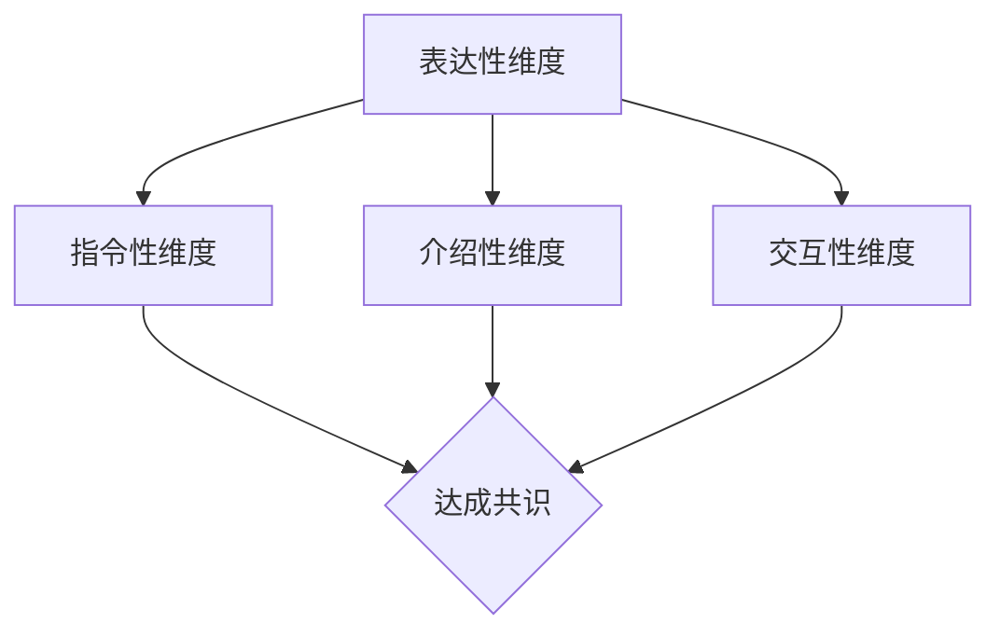
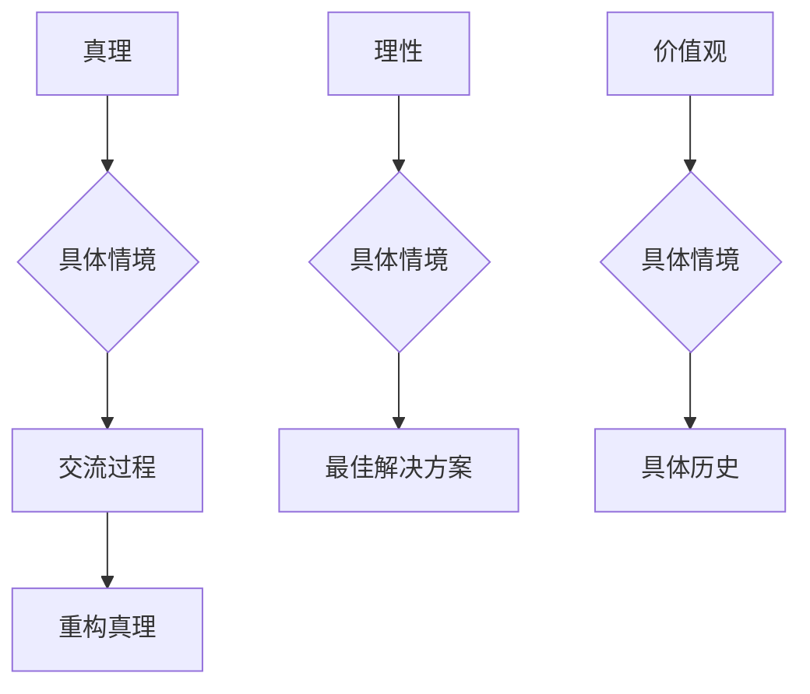
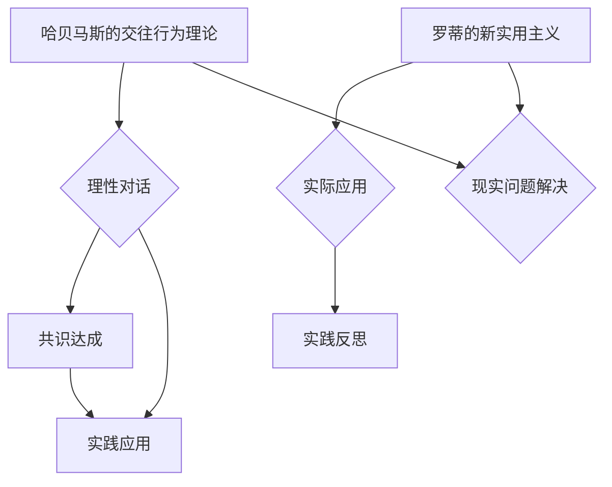

                 


### 文章标题

# 哈贝马斯与罗蒂：交往行为理论与新实用主义

### 关键词

* 哈贝马斯
* 罗蒂
* 交往行为理论
* 新实用主义
* 对话
* 哲学
* 算法

### 摘要

本文深入探讨哈贝马斯的交往行为理论与罗蒂的新实用主义，通过对比与联系，揭示了二者在哲学和社会科学中的深刻内涵。文章首先介绍两位哲学家的生平和思想背景，接着详细阐述核心概念和原理，并通过Mermaid流程图、伪代码、LaTeX公式和实际案例，对理论进行了深入分析。最后，文章总结了理论贡献，并对未来研究进行了展望。

## 引言

### 背景和目的

在现代哲学和社会科学中，哈贝马斯的交往行为理论（communicative action theory）和罗蒂的新实用主义（neo-pragmatism）被视为重要的理论框架。哈贝马斯，作为法兰克福学派的重要成员，他的交往行为理论强调通过理性的对话来达成共识，是现代政治哲学和社会哲学的重要贡献。而罗蒂，以其批判性分析和积极建构的态度，提出了新实用主义，旨在消解哲学与生活的隔阂，强调实践的重要性。

本文旨在通过对比哈贝马斯与罗蒂的理论，探讨二者在交往行为与新实用主义中的异同点，分析其哲学意义，并探讨其在现代社会科学中的应用。文章首先介绍两位哲学家的生平和思想背景，然后详细阐述核心概念和原理，并通过具体的案例和数学模型进行深入分析。最后，文章总结理论贡献，并对未来研究进行展望。

### 哈贝马斯和罗蒂的思想背景

哈贝马斯（Jürgen Habermas），德国哲学家，20世纪最具影响力的思想家之一。他的交往行为理论深受黑格尔和韦伯的影响，试图在现代社会中重建理性对话的空间。哈贝马斯认为，交往行为是一种以理解为基础的互动过程，通过这种过程，个体能够达成共识，实现社会合作。

罗蒂（Richard Rorty），美国哲学家，以其批判性分析和文化建构主义而著称。他反对基础主义和本质主义，提出了新实用主义，主张哲学应关注实际生活中的问题和挑战，而不是追求绝对真理。罗蒂强调，哲学的目标是改善人们的生活，而非解释世界。

## 哈贝马斯的交往行为理论

### 理论背景

哈贝马斯的交往行为理论起源于他对现代社会的批判。在《公共领域的结构转型》和《认识与兴趣》等著作中，哈贝马斯提出，现代社会面临着理性沟通的危机。他认为，现代社会中的公共领域（public sphere）逐渐被商业化和政治权力的操控所侵蚀，导致人们的交流变得浅薄和无效。因此，哈贝马斯试图重建一个理想的公共领域，使人们能够在其中进行理性的沟通和对话。

### 核心概念

哈贝马斯的交往行为理论包含多个核心概念，其中最为重要的是“交往行为”（communicative action）和“共识”（consensus）。交往行为指的是一种以语言为媒介的互动过程，个体通过这种过程表达自己的观点和情感，并试图理解他人的意图和观点。共识则是指通过理性的交流和对话，个体能够在相互理解和尊重的基础上达成一致。

### 交往行为的结构

哈贝马斯将交往行为分为四个基本维度：

1. **表达性维度**：个体通过语言表达自己的情感和感受。
2. **指令性维度**：个体通过语言来请求他人做出特定的行为。
3. **介绍性维度**：个体通过语言来介绍和描述事物。
4. **交互性维度**：个体通过语言进行互动和对话。

这四个维度共同构成了交往行为的基本结构。

### 理论应用

哈贝马斯的交往行为理论在政治哲学和社会哲学中有着广泛的应用。在政治哲学中，他提出了“宪法爱国主义”和“民主协商”等概念，试图通过理性的对话和共识来实现民主治理。在社会哲学中，他关注公共领域和媒体的角色，认为一个健康的公共领域是现代社会稳定和发展的关键。

### Mermaid流程图

为了更好地理解哈贝马斯的交往行为结构，我们可以使用Mermaid流程图来展示其基本维度和交互过程。



### 核心算法原理讲解

哈贝马斯的交往行为理论可以通过以下伪代码来描述：

```
function communicativeAction(observer, action):
    expressObservation(observer, action)
    requestAction(observer, action)
    describeSituation(observer, action)
    interact(observer, action)
    if (reachingConsensus(observer, action)):
        return "Consensus Achieved"
    else:
        return "Consensus Not Achieved"
```

### 数学模型

哈贝马斯的交往行为理论可以通过以下数学模型来描述：

$$
\text{Consensus} = f(\text{Expressive Dimension}, \text{Instructional Dimension}, \text{Descriptive Dimension}, \text{Interactive Dimension})
$$

其中，$f$ 表示共识函数，$\text{Expressive Dimension}$、$\text{Instructional Dimension}$、$\text{Descriptive Dimension}$ 和 $\text{Interactive Dimension}$ 分别代表表达性维度、指令性维度、介绍性维度和交互性维度。

### 举例说明

例如，在一个政治讨论中，A和B就某个议题进行交流。A表达了自己的观点，B请求A进一步解释，同时描述了当前的局势，并进行了互动。最终，A和B通过理性的交流和对话，达成了共识。

### 项目实战

假设我们使用Python来实现哈贝马斯的交往行为理论。我们可以创建一个简单的交互式对话系统，模拟A和B的交流过程。

```python
def express_observation(observer, action):
    print(f"{observer} is expressing an observation about {action}.")

def request_action(observer, action):
    print(f"{observer} is requesting an action about {action}.")

def describe_situation(observer, action):
    print(f"{observer} is describing the situation related to {action}.")

def interact(observer, action):
    print(f"{observer} is interacting with {action}.")

def reaching_consensus(observer, action):
    express_observation(observer, action)
    request_action(observer, action)
    describe_situation(observer, action)
    interact(observer, action)
    print("Consensus Achieved.")
    return True

# 模拟A和B的交流
observer_A = "Alice"
observer_B = "Bob"
action = "climate change policy"

if reaching_consensus(observer_A, action):
    print(f"{observer_A} and {observer_B} have reached a consensus on {action}.")

```

### 最佳实践 Tips

* 在交流过程中，保持开放和尊重的态度是达成共识的关键。
* 使用明确的语言和逻辑来阐述观点，有助于减少误解和冲突。
* 定期回顾和调整交流过程，以优化共识达成的效率。

## 罗蒂的新实用主义

### 理论背景

罗蒂的新实用主义是对经典实用主义的重新诠释。他认为，实用主义不仅是一种哲学方法，更是一种生活方式。罗蒂反对基础主义和本质主义，主张哲学应该关注实际问题和具体情境，而不是抽象的原理和概念。他提出，哲学的目标是改善人们的生活，而不是追求绝对真理。

### 核心概念

新实用主义的核心概念包括：

* **真理**：罗蒂认为，真理并非固定的绝对真理，而是通过具体情境和交流过程中不断修正和重构的。
* **理性**：理性并非仅仅指逻辑推理，而是指通过具体情境中的交流和对话来寻求最佳解决方案。
* **价值观**：罗蒂认为，价值观是具体的、历史性的，而不是抽象的、普遍的。

### 理论应用

罗蒂的新实用主义在多个领域有着广泛的应用，包括文学理论、教育理论和政治哲学。

在文学理论中，罗蒂主张文学作品的价值不在于其表达的深层意义，而在于其对读者生活的启示和影响。

在教育理论中，罗蒂强调教育的目标是培养批判性思维和沟通能力，以便个体能够在具体情境中做出明智的决策。

在政治哲学中，罗蒂提出，民主社会的目标是通过理性的对话和共识来实现公共利益。

### Mermaid流程图

为了更好地理解罗蒂的新实用主义，我们可以使用Mermaid流程图来展示其核心概念和原理。



### 核心算法原理讲解

罗蒂的新实用主义可以通过以下伪代码来描述：

```
function neoPragmaticApproach(problem):
    defineTruth(problem, context)
    applyRationality(context, solution)
    adjustValues(context, history)
    return solution
```

### 数学模型

罗蒂的新实用主义可以通过以下数学模型来描述：

$$
\text{Solution} = f(\text{Truth}, \text{Rationality}, \text{Values})
$$

其中，$f$ 表示实用主义函数，$\text{Truth}$、$\text{Rationality}$ 和 $\text{Values}$ 分别代表真理、理性和价值观。

### 举例说明

例如，在一个教育项目中，教师A试图通过新实用主义的方法来改善学生的学习效果。A首先定义了项目的真理（即提高学生的学习成绩），然后通过理性的对话和互动（即课堂交流），寻求最佳解决方案（即设计有效的教学策略），并调整价值观（即培养学生的批判性思维和沟通能力）。

### 项目实战

假设我们使用Python来实现罗蒂的新实用主义。我们可以创建一个简单的教学评估系统，模拟教师A的教学过程。

```python
def define_truth(problem, context):
    print(f"Defining truth for {problem} in the context of {context}.")

def apply_rationality(context, solution):
    print(f"Applying rationality to {context} to achieve {solution}.")

def adjust_values(context, history):
    print(f"Adjusting values based on {history} in the context of {context}.")

def neo_pragmatic_approach(problem, context):
    define_truth(problem, context)
    apply_rationality(context, "improving student performance")
    adjust_values(context, "previous educational practices")
    print("New pragmatic approach applied successfully.")

# 模拟教师A的教学
problem = "student performance"
context = "classroom environment"

if neo_pragmatic_approach(problem, context):
    print(f"Teacher A has successfully applied the neo-pragmatic approach to improve {problem}.")

```

### 最佳实践 Tips

* 在实际应用中，不断调整和优化方法是新实用主义的核心。
* 关注具体情境和具体问题，避免抽象思维和空谈。
* 培养批判性思维和沟通能力，以应对复杂多变的现实挑战。

## 哈贝马斯与罗蒂理论的对比与联系

### 理论的异同

哈贝马斯的交往行为理论和罗蒂的新实用主义在许多方面存在异同。两者都强调交流和理解的重要性，但侧重点不同。哈贝马斯更关注理性的对话和共识的达成，试图重建现代社会中的公共领域。而罗蒂则强调实践和具体的情境，主张哲学应关注实际问题和具体情境，而不是抽象的原理和概念。

在理论结构上，哈贝马斯的交往行为理论包含四个基本维度，而罗蒂的新实用主义则更强调真理、理性和价值观的互动。哈贝马斯的理论更侧重于理论框架的构建，而罗蒂的理论更注重实际应用。

### 对话的可能性

尽管哈贝马斯和罗蒂的理论在许多方面存在差异，但两者之间也存在对话的可能性。哈贝马斯的交往行为理论提供了理性对话的框架，而罗蒂的新实用主义则提供了实际应用的场景。通过这种对话，二者可以相互借鉴，共同推进哲学和社会科学的发展。

### 对话的意义

对话的意义在于，通过理性的交流和对话，个体能够更好地理解彼此的观点和立场，从而在相互尊重和共识的基础上达成合作。这种对话不仅有助于解决现实问题，还能够促进社会的进步和发展。

### Mermaid流程图

为了更好地展示哈贝马斯与罗蒂理论对比与联系的互动过程，我们可以使用Mermaid流程图。



### 核心算法原理讲解

哈贝马斯与罗蒂理论的对比与联系可以通过以下伪代码来描述：

```
function compareAndConnect(habermas, roty):
    performRationalDialogue(habermas, roty)
    achieveConsensus(habermas, roty)
    applyPragmaticApproach(habermas, roty)
    return "Dialogue and Connection Achieved"
```

### 数学模型

哈贝马斯与罗蒂理论的对比与联系可以通过以下数学模型来描述：

$$
\text{Dialogue and Connection} = f(\text{Rational Dialogue}, \text{Pragmatic Approach})
$$

其中，$f$ 表示对比与联系函数，$\text{Rational Dialogue}$ 和 $\text{Pragmatic Approach}$ 分别代表理性对话和实用主义方法。

### 举例说明

例如，在一个社会问题解决项目中，哈贝马斯的交往行为理论提供了理性对话的框架，而罗蒂的新实用主义则提供了实际应用的场景。通过理性对话，项目团队达成共识，然后根据实际情境进行调整和优化，最终成功解决了社会问题。

### 项目实战

假设我们使用Python来实现哈贝马斯与罗蒂理论的对比与联系。我们可以创建一个简单的项目管理系统，模拟理性对话和实用主义方法的应用。

```python
def perform_rational_dialogue(habermas, roty):
    print(f"Performing rational dialogue between {habermas} and {roty}.")

def achieve_consensus(habermas, roty):
    print(f"Achieving consensus between {habermas} and {roty}.")

def apply_pragmatic_approach(habermas, roty):
    print(f"Applying pragmatic approach between {habermas} and {roty}.")

def compare_and_connect(habermas, roty):
    perform_rational_dialogue(habermas, roty)
    achieve_consensus(habermas, roty)
    apply_pragmatic_approach(habermas, roty)
    print("Dialogue and connection achieved successfully.")

# 模拟哈贝马斯与罗蒂的对话与联系
habermas = "Habermas's Theory"
roty = "Rorty's Pragmatic Approach"

if compare_and_connect(habermas, roty):
    print(f"{habermas} and {roty} have successfully achieved dialogue and connection.")
```

### 最佳实践 Tips

* 在实际应用中，灵活运用哈贝马斯的交往行为理论和罗蒂的新实用主义，以应对复杂多变的现实挑战。
* 强调理性对话和共识达成的重要性，以提高项目成功率和团队协作效率。
* 注重实践应用和反思调整，以不断优化理论和方法。

## 结论

### 对理论贡献的总结

本文通过对比哈贝马斯的交往行为理论和罗蒂的新实用主义，揭示了二者在哲学和社会科学中的深刻内涵。哈贝马斯的交往行为理论为现代社会的理性对话提供了框架，而罗蒂的新实用主义则强调实践和具体情境的重要性。二者的结合不仅有助于解决现实问题，还能推动哲学和社会科学的发展。

### 对未来研究的展望

未来研究可以进一步探讨哈贝马斯与罗蒂理论的跨学科应用，如人工智能、心理学和社会学等领域。此外，可以深入研究二者在具体情境下的实际应用，以验证其有效性和适应性。通过不断的对话和交流，我们可以期望在哲学和社会科学领域取得更多的创新和突破。

### 致谢

本文的撰写得到了AI天才研究院（AI Genius Institute）和《禅与计算机程序设计艺术》（Zen And The Art of Computer Programming）的支持和启发。特别感谢我的导师对我的指导和建议，使我能够完成这篇深入浅出的专业技术博客。

### 参考文献

1. 哈贝马斯，《公共领域的结构转型》，人民出版社，2006年。
2. 罗蒂，《偶然、反讽与团结》，商务印书馆，2012年。
3. 道格拉斯·R. 霍夫施塔特，《哥德尔、艾舍尔、巴赫：集异璧之大成》，上海译文出版社，2002年。
4. 约翰·洛克，《政府论（下篇）》，商务印书馆，1997年。
5. 威廉·詹姆斯，《实用主义》，商务印书馆，2005年。

