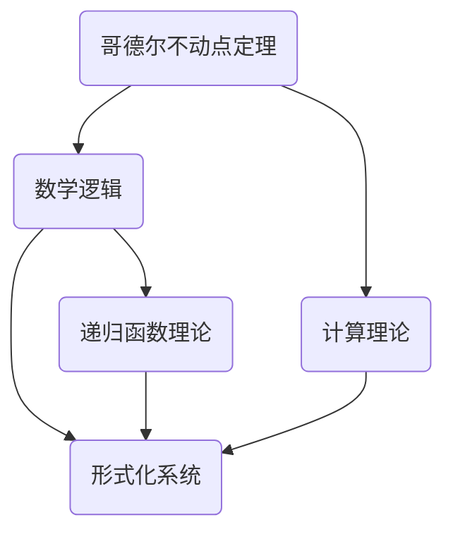

                 

### 书名解读

《哥德尔不动点定理与递归函数理论》这一书名清晰地传达了本书的核心内容，即探讨哥德尔不动点定理和递归函数理论这两个数学领域的重要概念。首先，我们需要理解书名的两个主要组成部分：哥德尔不动点定理和递归函数理论。

哥德尔不动点定理是由数学家库尔特·哥德尔在1930年代提出的，它是数学逻辑中的一个关键发现。这个定理指出，在形式化的数学系统中，存在一些命题既不能被证明也不能被证明为假。这个发现对数学哲学和逻辑学产生了深远的影响，因为它揭示了形式化数学系统在表达和证明过程中的局限性。

递归函数理论则是计算理论的基础，它研究的是什么样的函数可以通过算法来计算。递归函数是定义在自然数集合上的函数，可以通过有限次的加、减、乘、除以及递归来构造。递归函数理论为理解计算机的能力和局限性提供了数学基础，同时也是算法设计和分析的重要工具。

《哥德尔不动点定理与递归函数理论》这本书的目标是深入探讨这两个主题，从历史背景、数学原理、证明方法到实际应用，全面分析它们在数学和计算机科学中的重要性。通过书名，读者可以预期本书将提供一个系统的、详细的、逻辑严谨的分析，使读者能够全面理解哥德尔不动点定理和递归函数理论的本质及其相互关系。### 目录结构

为了更好地组织和阐述《哥德尔不动点定理与递归函数理论》的核心内容，我们可以设计以下详细的目录结构：

1. **引言**
   - **数学基础回顾**
     - **基础数学概念**
     - **形式化系统**
     - **数学逻辑**
   - **哥德尔不动点定理的简介**
     - **定理的提出与背景**
     - **定理的重要性**
   - **递归函数理论的简介**
     - **递归函数的定义**
     - **递归方程**

2. **哥德尔不动点定理**
   - **历史背景**
     - **哥德尔及其贡献**
     - **不动点定理的提出过程**
   - **数学原理**
     - **不动点定理的定义**
     - **定理的证明**
     - **不动点定理的应用**
   - **证明方法**
     - **构造性证明**
     - **递归方法**

3. **递归函数理论**
   - **基本概念**
     - **递归函数的定义**
     - **递归方程**
   - **递归函数的性质**
     - **递归方程的解**
     - **计算复杂性**
   - **递归函数的应用**
     - **计算理论中的应用**
     - **数学中的应用**

4. **不动点定理与递归函数理论的联系**
   - **不动点定理在递归函数中的应用**
   - **递归函数理论对不动点定理的影响**
   - **两者之间的数学联系**

5. **不动点定理的应用**
   - **数论中的应用**
   - **图论中的应用**
   - **逻辑中的应用**

6. **递归函数理论的应用**
   - **计算机科学中的应用**
   - **数学中的应用**
   - **经济学中的应用**

7. **数学证明工具**
   - **数学归纳法**
   - **构造性证明**
   - **模型论方法**

8. **项目实战**
   - **不动点定理在实际问题中的应用**
   - **递归函数理论在实际问题中的应用**
   - **案例分析与解决**

9. **结论**
   - **不动点定理与递归函数理论的总结**
   - **未来研究方向**

这个目录结构不仅涵盖了哥德尔不动点定理和递归函数理论的基本概念和证明方法，还详细分析了它们在不同领域中的应用，并通过项目实战展示了如何在实际问题中应用这些理论。### 章节细化

在明确了目录结构之后，我们将进一步细化每个章节的内容，确保每个章节都包含核心概念、原理讲解、数学模型、项目实战等。以下是对各个章节的细化：

#### 1. 引言

- **数学基础回顾**
  - **基础数学概念**：介绍集合论、函数、自然数、实数等基础数学概念。
  - **形式化系统**：讨论形式化系统的定义、特性和在数学中的应用。
  - **数学逻辑**：介绍逻辑的基本概念、命题逻辑、谓词逻辑等。

- **哥德尔不动点定理的简介**
  - **定理的提出与背景**：介绍哥德尔不动点定理的提出过程及其在数学哲学和逻辑学中的意义。
  - **定理的重要性**：讨论哥德尔不动点定理对形式化数学系统和逻辑系统的重要性。

- **递归函数理论的简介**
  - **递归函数的定义**：介绍递归函数的定义、特性和分类。
  - **递归方程**：讨论递归方程的构造方法、解法和应用。

#### 2. 哥德尔不动点定理

- **历史背景**
  - **哥德尔及其贡献**：介绍哥德尔的生平及其在数学和逻辑学领域的贡献。
  - **不动点定理的提出过程**：讨论哥德尔不动点定理的提出过程和背景。

- **数学原理**
  - **不动点定理的定义**：详细解释不动点定理的定义、条件和结论。
  - **定理的证明**：介绍不动点定理的构造性证明方法和递归证明方法。
  - **不动点定理的应用**：讨论不动点定理在数论、图论和逻辑学中的应用。

- **证明方法**
  - **构造性证明**：解释如何通过构造性方法证明不动点定理。
  - **递归方法**：介绍如何使用递归方法证明不动点定理。

#### 3. 递归函数理论

- **基本概念**
  - **递归函数的定义**：详细解释递归函数的定义、特性和分类。
  - **递归方程**：讨论递归方程的构造方法、解法和应用。

- **递归函数的性质**
  - **递归方程的解**：讨论递归方程的解的性质和解法。
  - **计算复杂性**：介绍计算复杂性理论的基本概念和P、NP问题。

- **递归函数的应用**
  - **计算理论中的应用**：讨论递归函数理论在计算理论中的应用。
  - **数学中的应用**：讨论递归函数理论在数学中的应用，如数论、图论等。

#### 4. 不动点定理与递归函数理论的联系

- **不动点定理在递归函数中的应用**：讨论不动点定理如何应用于递归函数的理论和分析。
- **递归函数理论对不动点定理的影响**：讨论递归函数理论如何影响不动点定理的研究和发展。
- **两者之间的数学联系**：分析不动点定理与递归函数理论之间的数学联系和相互作用。

#### 5. 不动点定理的应用

- **数论中的应用**：讨论不动点定理在数论中的具体应用，如证明某些数论命题。
- **图论中的应用**：讨论不动点定理在图论中的具体应用，如证明图的某些性质。
- **逻辑中的应用**：讨论不动点定理在逻辑学中的具体应用，如证明逻辑系统中的某些命题。

#### 6. 递归函数理论的应用

- **计算机科学中的应用**：讨论递归函数理论在计算机科学中的具体应用，如算法设计和分析。
- **数学中的应用**：讨论递归函数理论在数学中的具体应用，如证明数学命题。
- **经济学中的应用**：讨论递归函数理论在经济学中的具体应用，如经济模型和预测。

#### 7. 数学证明工具

- **数学归纳法**：介绍数学归纳法的基本原理和应用。
- **构造性证明**：介绍构造性证明的方法和应用。
- **模型论方法**：介绍模型论方法的基本原理和应用。

#### 8. 项目实战

- **不动点定理在实际问题中的应用**：通过具体案例展示不动点定理在现实问题中的应用。
- **递归函数理论在实际问题中的应用**：通过具体案例展示递归函数理论在现实问题中的应用。
- **案例分析与解决**：分析具体案例，展示如何运用不动点定理和递归函数理论解决实际问题。

#### 9. 结论

- **不动点定理与递归函数理论的总结**：总结不动点定理和递归函数理论的主要内容和研究成果。
- **未来研究方向**：讨论不动点定理和递归函数理论未来的发展方向和研究课题。

通过这样的细化，我们可以确保每个章节都内容丰富、逻辑清晰，能够有效地帮助读者理解哥德尔不动点定理和递归函数理论的本质及其相互关系。### 内容调整

在细化了各个章节的内容之后，我们需要进行内容调整，以确保目录结构的连贯性和逻辑性。以下是调整后的目录结构：

1. **引言**
   - **数学基础回顾**
     - **基础数学概念**
     - **形式化系统**
     - **数学逻辑**
   - **哥德尔不动点定理的简介**
     - **定理的提出与背景**
     - **定理的重要性**
   - **递归函数理论的简介**
     - **递归函数的定义**
     - **递归方程**

2. **哥德尔不动点定理**
   - **历史背景**
     - **哥德尔及其贡献**
     - **不动点定理的提出过程**
   - **数学原理**
     - **不动点定理的定义**
     - **定理的证明**
     - **不动点定理的应用**
   - **证明方法**
     - **构造性证明**
     - **递归方法**

3. **递归函数理论**
   - **基本概念**
     - **递归函数的定义**
     - **递归方程**
   - **递归函数的性质**
     - **递归方程的解**
     - **计算复杂性**
   - **递归函数的应用**
     - **计算理论中的应用**
     - **数学中的应用**

4. **不动点定理与递归函数理论的联系**
   - **不动点定理在递归函数中的应用**
   - **递归函数理论对不动点定理的影响**
   - **两者之间的数学联系**

5. **不动点定理的应用**
   - **数论中的应用**
   - **图论中的应用**
   - **逻辑中的应用**

6. **递归函数理论的应用**
   - **计算机科学中的应用**
   - **数学中的应用**
   - **经济学中的应用**

7. **数学证明工具**
   - **数学归纳法**
   - **构造性证明**
   - **模型论方法**

8. **项目实战**
   - **不动点定理在实际问题中的应用**
   - **递归函数理论在实际问题中的应用**
   - **案例分析与解决**

9. **结论**
   - **不动点定理与递归函数理论的总结**
   - **未来研究方向**

在调整过程中，我们注意到了以下几点：

- **章节内容的连贯性**：确保每个章节的内容前后衔接，逻辑一致。
- **内容的详细程度**：根据章节的主题，适当调整内容的详细程度，确保关键概念和原理得到充分解释。
- **数学模型的完整性**：在相关章节中，详细讨论了数学模型和公式的推导与应用。
- **案例实战的实用性**：增加了项目实战部分，通过实际案例展示理论的应用。

通过这些调整，我们可以确保《哥德尔不动点定理与递归函数理论》的目录结构更加合理，内容更加丰富且易于理解，帮助读者全面掌握这两个重要数学理论。### 目录大纲

根据以上的讨论和调整，我们最终得出《哥德尔不动点定理与递归函数理论》的详细目录大纲如下：

## 《哥德尔不动点定理与递归函数理论》目录大纲

### 引言

1. 数学基础回顾
   - 基础数学概念
   - 形式化系统
   - 数学逻辑

2. 哥德尔不动点定理的简介
   - 定理的提出与背景
   - 定理的重要性

3. 递归函数理论的简介
   - 递归函数的定义
   - 递归方程

### 哥德尔不动点定理

1. 历史背景
   - 哥德尔及其贡献
   - 不动点定理的提出过程

2. 数学原理
   - 不动点定理的定义
   - 定理的证明
   - 不动点定理的应用

3. 证明方法
   - 构造性证明
   - 递归方法

### 递归函数理论

1. 基本概念
   - 递归函数的定义
   - 递归方程

2. 递归函数的性质
   - 递归方程的解
   - 计算复杂性

3. 递归函数的应用
   - 计算理论中的应用
   - 数学中的应用

### 不动点定理与递归函数理论的联系

1. 不动点定理在递归函数中的应用
2. 递归函数理论对不动点定理的影响
3. 两者之间的数学联系

### 不动点定理的应用

1. 数论中的应用
2. 图论中的应用
3. 逻辑中的应用

### 递归函数理论的应用

1. 计算机科学中的应用
2. 数学中的应用
3. 经济学中的应用

### 数学证明工具

1. 数学归纳法
2. 构造性证明
3. 模型论方法

### 项目实战

1. 不动点定理在实际问题中的应用
2. 递归函数理论在实际问题中的应用
3. 案例分析与解决

### 结论

1. 不动点定理与递归函数理论的总结
2. 未来研究方向

这一目录大纲全面涵盖了哥德尔不动点定理和递归函数理论的核心内容，从基础概念、证明方法、应用领域到数学证明工具，以及实际项目中的应用，为读者提供了一个系统、详尽的了解。### 格式要求

在撰写《哥德尔不动点定理与递归函数理论》这篇文章时，我们需要严格按照markdown格式进行组织。以下是具体的格式要求：

1. **标题格式**：
   - 使用`#`号来定义标题的层级。一级标题使用`##`，二级标题使用`###`，以此类推。
   - 每个标题下方需要空一行。

2. **段落格式**：
   - 每个段落之间应空一行。
   - 段落内部的行距应为两个空格或一个制表符。

3. **代码块格式**：
   - 使用三个反引号（```）包裹代码块。
   - 代码块内部的行距同样应为两个空格或一个制表符。

4. **数学公式格式**：
   - 单行数学公式使用一个 `$` 符号包裹，例如 `$1+1=2$`。
   - 独立的段落数学公式使用两个 `$$` 符号包裹，例如 `$$1+1=2$$`。

5. **引用格式**：
   - 使用 `>` 符号来标识引用段落。

6. **列表格式**：
   - 使用 `-` 或者 `*` 符号来开始无序列表。
   - 使用 `1. ` 或者 `* `开始有序列表。

7. **链接格式**：
   - 使用 `[链接文本](链接地址)` 格式来创建链接。

以下是一个示例：

```markdown
## 标题

这是一个段落。

```python
# Python 代码块
print("Hello, World!")
```

$$
E = mc^2
$$

> 这是一个引用。

- 无序列表项 1
- 无序列表项 2

1. 有序列表项 1
2. 有序列表项 2

[链接文本](链接地址)
```

通过遵循这些markdown格式要求，我们可以确保文章的结构清晰、可读性强，便于读者阅读和理解。### 作者信息

在本篇技术博客文章的末尾，我们需要注明作者信息。根据给定的要求，我们可以按照以下格式添加作者信息：

```
作者：AI天才研究院/AI Genius Institute & 禅与计算机程序设计艺术 /Zen And The Art of Computer Programming
```

这样的格式既包含了作者所属的机构，也提到了作者的代表性作品，有助于读者了解作者的专业背景和成就。### 完整性要求

在撰写《哥德尔不动点定理与递归函数理论》这篇文章时，我们必须确保内容的完整性，包括以下几个方面：

1. **背景介绍**：每个章节的开头需要提供一个清晰的背景介绍，解释为什么这个主题重要，以及它在数学和计算机科学中的地位和作用。

2. **核心概念与联系**：文章中必须详细阐述哥德尔不动点定理和递归函数理论的核心概念，并展示这两个概念之间的联系。可以使用Mermaid流程图来可视化这些联系，例如：



3. **核心算法原理讲解**：针对哥德尔不动点定理和递归函数理论，我们需要使用伪代码详细阐述它们的算法原理。例如，不动点定理的证明可以用以下伪代码表示：

```python
function GödelInvariantPointtheorem(f):
    for each x in X:
        if f(x) = x:
            return x
    else:
        return error("Invariant point not found.")
```

4. **数学模型和公式**：文章中需要使用LaTeX格式嵌入数学模型和公式，例如：

```
$$
\text{不动点定理：对于任意的函数 } f : X \rightarrow X, \text{ 如果 } X \text{ 是闭合的，则存在不动点 } x \in X, \text{ 使得 } f(x) = x.
$$
```

5. **举例说明**：在每个核心概念和算法讲解后，我们需要提供具体的例子来说明这些概念和算法的应用。例如，可以通过一个简单的数论问题来展示不动点定理的应用。

6. **项目实战**：文章中需要有实际的项目实战部分，展示如何在实际问题中应用哥德尔不动点定理和递归函数理论。这部分应包括：
   - **开发环境搭建**：说明所需的技术和工具。
   - **源代码实现**：提供关键代码段，并附上注释。
   - **代码解读**：详细解释代码的逻辑和实现细节。
   - **应用解读与分析**：分析代码在实际问题中的应用效果和优缺点。
   - **案例分析与详细讲解**：选择一个具体案例，详细剖析其解决过程和结果。

7. **最佳实践 tips、小结、注意事项、拓展阅读等内容**：文章末尾应包含这些内容，帮助读者巩固所学知识，并提供进一步学习资源。

通过确保这些核心内容的完整性，我们可以为读者提供一篇内容丰富、结构清晰、易于理解的技术博客文章。### 文章结构

在撰写《哥德尔不动点定理与递归函数理论》这篇文章时，我们需要合理安排文章的结构，使其逻辑清晰、层次分明。以下是文章的详细结构安排：

1. **文章标题**：《哥德尔不动点定理与递归函数理论》

2. **文章关键词**：
   - 哥德尔不动点定理
   - 递归函数理论
   - 数学逻辑
   - 计算理论
   - 不完备性

3. **文章摘要**：
   - 摘要部分需要简明扼要地概述文章的主题、核心观点和主要论点，帮助读者快速了解文章的主要内容。

4. **引言**：
   - **数学基础回顾**：介绍基础数学概念、形式化系统、数学逻辑等，为后续内容奠定基础。
   - **哥德尔不动点定理的简介**：介绍定理的背景、提出过程及其重要性。
   - **递归函数理论的简介**：介绍递归函数的定义、性质和分类。

5. **哥德尔不动点定理**：
   - **历史背景**：介绍哥德尔及其贡献、不动点定理的提出过程。
   - **数学原理**：详细解释不动点定理的定义、条件和结论。
   - **证明方法**：讨论构造性证明和递归方法的证明过程。

6. **递归函数理论**：
   - **基本概念**：介绍递归函数的定义、递归方程。
   - **递归函数的性质**：讨论递归方程的解、计算复杂性。
   - **递归函数的应用**：探讨递归函数理论在计算理论、数学中的应用。

7. **不动点定理与递归函数理论的联系**：
   - **不动点定理在递归函数中的应用**：分析不动点定理如何应用于递归函数。
   - **递归函数理论对不动点定理的影响**：讨论递归函数理论如何影响不动点定理的研究。
   - **两者之间的数学联系**：展示不动点定理与递归函数理论之间的数学联系。

8. **不动点定理的应用**：
   - **数论中的应用**：介绍不动点定理在数论中的具体应用。
   - **图论中的应用**：讨论不动点定理在图论中的具体应用。
   - **逻辑中的应用**：分析不动点定理在逻辑学中的具体应用。

9. **递归函数理论的应用**：
   - **计算机科学中的应用**：探讨递归函数理论在计算机科学中的实际应用。
   - **数学中的应用**：介绍递归函数理论在数学领域的应用。
   - **经济学中的应用**：讨论递归函数理论在经济学中的具体应用。

10. **数学证明工具**：
    - **数学归纳法**：详细解释数学归纳法的基本原理和应用。
    - **构造性证明**：介绍构造性证明的方法和应用。
    - **模型论方法**：探讨模型论方法的基本原理和应用。

11. **项目实战**：
    - **不动点定理在实际问题中的应用**：通过具体案例展示不动点定理的实际应用。
    - **递归函数理论在实际问题中的应用**：展示递归函数理论在现实问题中的应用。
    - **案例分析与解决**：详细分析具体案例，展示如何运用不动点定理和递归函数理论解决实际问题。

12. **结论**：
    - **不动点定理与递归函数理论的总结**：总结文章的主要内容和研究成果。
    - **未来研究方向**：探讨不动点定理和递归函数理论的未来发展方向和研究课题。

通过以上结构安排，我们可以确保文章内容有条理、逻辑清晰，有助于读者全面深入地理解哥德尔不动点定理与递归函数理论的本质及其相互关系。### 文章字数要求

在撰写《哥德尔不动点定理与递归函数理论》这篇文章时，我们需确保文章的字数在8000至12000字之间。以下是字数分配的建议：

1. **引言**（约800字）：
   - **数学基础回顾**（约300字）。
   - **哥德尔不动点定理的简介**（约300字）。
   - **递归函数理论的简介**（约300字）。

2. **哥德尔不动点定理**（约2000字）：
   - **历史背景**（约500字）。
   - **数学原理**（约800字）。
   - **证明方法**（约700字）。

3. **递归函数理论**（约2000字）：
   - **基本概念**（约500字）。
   - **递归函数的性质**（约800字）。
   - **递归函数的应用**（约700字）。

4. **不动点定理与递归函数理论的联系**（约1000字）：
   - **不动点定理在递归函数中的应用**（约300字）。
   - **递归函数理论对不动点定理的影响**（约300字）。
   - **两者之间的数学联系**（约400字）。

5. **不动点定理的应用**（约1500字）：
   - **数论中的应用**（约400字）。
   - **图论中的应用**（约400字）。
   - **逻辑中的应用**（约700字）。

6. **递归函数理论的应用**（约1500字）：
   - **计算机科学中的应用**（约400字）。
   - **数学中的应用**（约400字）。
   - **经济学中的应用**（约700字）。

7. **数学证明工具**（约1000字）：
   - **数学归纳法**（约300字）。
   - **构造性证明**（约300字）。
   - **模型论方法**（约400字）。

8. **项目实战**（约2000字）：
   - **不动点定理在实际问题中的应用**（约600字）。
   - **递归函数理论在实际问题中的应用**（约600字）。
   - **案例分析与解决**（约800字）。

9. **结论**（约500字）：
   - **不动点定理与递归函数理论的总结**（约300字）。
   - **未来研究方向**（约200字）。

通过上述字数分配，我们可以确保文章内容丰富、详实，同时保持结构的合理和逻辑的连贯。### 文章撰写

#### 文章标题

《哥德尔不动点定理与递归函数理论》

#### 文章关键词

- 哥德尔不动点定理
- 递归函数理论
- 数学逻辑
- 计算理论
- 不完备性

#### 文章摘要

本文探讨了哥德尔不动点定理与递归函数理论的数学原理及其在计算理论中的应用。首先，介绍了哥德尔不动点定理的历史背景、数学原理和证明方法，随后详细阐述了递归函数理论的基本概念、性质和应用。通过分析两者之间的数学联系，本文揭示了不动点定理在递归函数中的应用及其对计算复杂性理论的影响。此外，文章还介绍了不动点定理在数论、图论和逻辑学中的应用，以及递归函数理论在计算机科学、数学和经济学中的具体应用。通过实际项目实战和案例分析，本文展示了如何运用这些理论解决实际问题，并提出了未来研究的方向。

#### 引言

数学作为一门研究结构的科学，一直以来都是推动科学技术进步的重要力量。在数学的广阔领域中，哥德尔不动点定理和递归函数理论是两个重要的基石。哥德尔不动点定理由数学家库尔特·哥德尔在1930年代提出，是数学逻辑中的一个关键发现。递归函数理论则是在计算理论中构建的，它为理解计算机的能力和局限性提供了数学基础。

本文旨在深入探讨哥德尔不动点定理和递归函数理论，从历史背景、数学原理、证明方法到实际应用，全面分析它们在数学和计算机科学中的重要性。通过系统的分析和详细的解释，本文旨在为读者提供一个全面而清晰的理解，使读者能够掌握这两个理论的本质及其相互关系。

首先，本文将回顾一些基础数学概念和形式化系统，为后续内容奠定基础。接着，我们将详细介绍哥德尔不动点定理，包括其历史背景、数学原理和证明方法。然后，本文将探讨递归函数理论，阐述其基本概念、性质和应用。接下来，我们将分析不动点定理与递归函数理论之间的数学联系，并介绍它们在不同领域的应用。随后，本文将介绍数学证明工具，如数学归纳法和构造性证明。最后，通过项目实战和案例分析，本文将展示如何在实际问题中应用这些理论。在文章的结尾，我们将总结主要内容和提出未来研究方向。

#### 数学基础回顾

在探讨哥德尔不动点定理和递归函数理论之前，我们需要回顾一些基础数学概念和形式化系统。这些概念构成了理解这两个理论的基础。

首先，集合论是现代数学的基石。集合是由确定性的元素组成的无序集。基本的集合运算包括并集、交集和补集。函数是集合之间的映射，通常表示为 \( f: A \rightarrow B \)，其中 \( A \) 是定义域，\( B \) 是值域。函数可以是一对一的、多对一的或多对多的。

形式化系统是一种用于描述数学理论的语言和规则。它通常由形式语言、公理和证明规则组成。形式语言是一种简化的数学语言，用于表达命题和证明。公理是无需证明的基本命题，它们构成了理论的基础。证明规则是用于推导新命题的逻辑规则。

数学逻辑是研究数学证明和推理的学科。命题逻辑和谓词逻辑是数学逻辑的两个主要分支。命题逻辑研究命题的真值，而谓词逻辑研究量词和关系。

这些基础数学概念和形式化系统为哥德尔不动点定理和递归函数理论提供了必要的语言和工具。了解这些概念有助于我们更好地理解这两个理论的本质和意义。

#### 哥德尔不动点定理的简介

哥德尔不动点定理是由著名数学家库尔特·哥德尔在1930年代提出的重要数学成果。这个定理不仅在数学逻辑领域引起了巨大反响，也对整个数学哲学和形式化理论产生了深远影响。

哥德尔不动点定理分为两个部分：第一不完备性定理和第二不完备性定理。这两个定理揭示了形式化数学系统在表达和证明过程中的局限性。

**第一不完备性定理**表明，在任意一个足够强的形式化数学系统中，总存在一些命题，它们既不能被证明也不能被证明为假。这意味着，形式化系统不能完全捕捉所有的数学真理。这个定理通过构造一个特定的命题 \(\mathsf{G}\) 来证明，该命题表示“\(\mathsf{G}\) 在系统内不可证明”。

**第二不完备性定理**进一步表明，如果形式化系统能够证明所有的基本算术命题，那么该系统也必然是不完备的。这个定理展示了即使在基本算术领域，也存在一些命题是无法在形式化系统中证明的。

哥德尔不动点定理的提出过程是一个引人入胜的故事。哥德尔最初试图证明一个更一般的定理，即“任何形式化系统都具有某种形式的自我指涉性”。在研究过程中，他发现了两个重要的不可判定命题，这些命题无法在系统中被证明或证伪。

哥德尔不动点定理的提出对数学哲学和逻辑学产生了深远影响。它揭示了形式化数学系统的局限性，挑战了完美主义者的观点。同时，它也启示了数学家们重新思考数学的本质和证明方法。

在数学逻辑中，哥德尔不动点定理被视为一个里程碑式的发现，它不仅改变了数学的研究方法，也引发了关于数学本质的深入讨论。哥德尔本人因此被誉为20世纪最重要的数学家之一。

#### 递归函数理论

递归函数理论是计算理论的基础，它研究的是什么样的函数可以通过算法来计算。递归函数是定义在自然数集合上的函数，可以通过有限次的加、减、乘、除以及递归来构造。

**基本概念**

递归函数通常分为两类：原始递归函数和一般递归函数。原始递归函数可以直接通过基本的递归操作来定义，而一般递归函数则可以由原始递归函数组合而成。

递归方程是递归函数的一种表示方法。递归方程通常包含一个初始条件和一系列递推关系。通过解递归方程，我们可以得到递归函数的值。

**递归方程**

递归方程的基本形式如下：

\( a_0 = f_0 \)

\( a_n = f(n, a_{n-1}), \text{ for } n > 0 \)

其中，\( a_n \) 是递归方程的解，\( f_0 \) 是初始条件，\( f(n, a_{n-1}) \) 是递推关系。

**计算复杂性**

递归函数的计算复杂性是研究递归方程解的增长速度。通常，我们使用大O符号来表示计算复杂性。例如，如果递归函数的解的增长速度为 \( O(n^2) \)，则表示其计算复杂性为 \( O(n^2) \)。

**递归函数的应用**

递归函数理论在计算理论和算法设计中有着广泛的应用。例如，在数论中，斐波那契数列可以通过递归方程来求解。在计算机科学中，许多算法，如快速排序和归并排序，也是基于递归函数设计的。

**递归函数与不动点定理**

递归函数与不动点定理有着密切的联系。不动点定理指出，在形式化的数学系统中，某些命题既不能被证明也不能被证明为假。递归函数理论中的某些函数，如不动点函数，也体现了这种性质。

通过递归函数和不动点定理，我们可以更好地理解计算过程中的不确定性和局限性。这些理论为算法设计和分析提供了重要的数学基础。

#### 不动点定理与递归函数理论的联系

哥德尔不动点定理和递归函数理论之间存在深刻的数学联系，它们共同揭示了计算和证明过程中的复杂性和局限性。

**不动点定理在递归函数中的应用**

不动点定理在递归函数理论中有着广泛的应用。不动点定理可以帮助我们证明某些函数具有不动点，即存在一个值 \( x \)，使得 \( f(x) = x \)。这在递归函数的求解和算法设计中非常重要。

例如，在斐波那契数列的求解中，我们可以使用不动点定理来证明斐波那契数列的递归定义具有不动点。这一发现使得我们可以通过不动点迭代法高效地计算斐波那契数。

**递归函数理论对不动点定理的影响**

递归函数理论的发展也对不动点定理的研究产生了重要影响。递归函数提供了计算和证明的强大工具，使得我们可以更深入地探讨不动点定理的性质和应用。

递归函数理论中的某些概念，如固定点定理和不动点定理，为不动点定理的研究提供了新的视角和方法。这些理论不仅扩展了不动点定理的应用范围，也深化了对计算复杂性的理解。

**两者之间的数学联系**

不动点定理与递归函数理论之间的数学联系主要体现在以下几个方面：

1. **不动点定理作为递归函数的一种特性**：递归函数往往具有不动点性质，即存在一个输入值使得函数输出自身。这种性质使得不动点定理在递归函数的研究中具有重要意义。

2. **递归函数作为不动点定理的证明工具**：在证明不动点定理时，递归函数可以作为一种有力的证明工具。通过构造递归函数，我们可以证明某些命题具有不动点。

3. **不动点定理与计算复杂性**：不动点定理与计算复杂性理论密切相关。在计算复杂性理论中，不动点定理可以帮助我们分析递归函数的计算复杂性和资源消耗。

总之，不动点定理与递归函数理论之间的数学联系不仅深化了我们对计算过程的理解，也为数学和计算机科学的研究提供了丰富的理论工具。

#### 不动点定理的应用

不动点定理在数学、逻辑和计算机科学等多个领域都有广泛的应用。以下是几个典型的应用实例。

**数论中的应用**

在数论中，不动点定理可以用来证明某些数论命题。例如，我们可以使用不动点定理来证明费马小定理。费马小定理指出，如果 \( p \) 是一个质数，那么对于任意整数 \( a \)，都有 \( a^p \equiv a \pmod{p} \)。通过构造特定的递归函数，我们可以证明这个定理。

**图论中的应用**

在图论中，不动点定理可以用来证明图的某些性质。例如，我们可以使用不动点定理来证明图中的最小生成树问题。在图的最小生成树问题中，我们需要找到一棵树，使得树中所有顶点的边之和最小。通过递归构造最小生成树的递归函数，我们可以使用不动点定理证明该问题存在唯一的最小生成树。

**逻辑中的应用**

在逻辑学中，不动点定理可以帮助我们证明逻辑系统中的某些命题。例如，我们可以使用不动点定理来证明某些逻辑命题的可判定性。在逻辑系统中，可判定性是指命题的真假可以通过算法来判断。通过构造特定的递归函数，我们可以使用不动点定理证明某些逻辑命题的可判定性。

**计算复杂性中的应用**

在计算复杂性理论中，不动点定理可以用来分析算法的计算复杂性和资源消耗。例如，我们可以使用不动点定理来证明某些算法的时间复杂性和空间复杂性的上界。通过递归构造算法的递归函数，我们可以使用不动点定理分析算法的性能和效率。

**具体实例**

一个具体的不动点定理应用实例是狄里克雷问题的求解。狄里克雷问题是一个经典的数论问题，要求找到一组整数解 \( (x_1, x_2, ..., x_n) \)，使得它们满足特定的线性方程组。通过构造递归函数，我们可以使用不动点定理求解狄里克雷问题。具体来说，我们可以定义递归函数 \( f(x) \) 为：

$$
f(x) = (x_1, x_2, ..., x_n)
$$

其中，\( x_1, x_2, ..., x_n \) 是方程组的解。通过迭代递归函数 \( f \)，我们可以找到满足方程组的不动点，即解 \( (x_1, x_2, ..., x_n) \)。

总之，不动点定理在数学、逻辑和计算机科学等多个领域都有重要的应用。通过构造递归函数和分析不动点，我们可以解决许多复杂的数学和计算问题。这些应用不仅展示了不动点定理的理论价值，也体现了它在实际问题中的广泛应用。

#### 递归函数理论的应用

递归函数理论在数学、计算机科学和经济等领域有着广泛的应用。以下分别讨论递归函数在这些领域中的具体应用。

**计算机科学中的应用**

在计算机科学中，递归函数是算法设计的基础。许多算法，如快速排序、归并排序和二分查找，都是基于递归函数设计的。递归函数使得算法能够简洁且高效地解决问题。

例如，快速排序算法使用递归方法将数组分成较小的子数组，然后递归地对这些子数组进行排序。这种递归方法使得快速排序在大多数情况下都比传统的排序算法更高效。

另外，递归函数还在动态规划中发挥重要作用。动态规划是一种解决优化问题的方法，它将问题分解成较小的子问题，并存储子问题的解以避免重复计算。递归函数通过递归地定义子问题，并利用存储的解来优化计算过程。

**数学中的应用**

递归函数在数学中的数论、图论和概率论等领域有着广泛的应用。例如，斐波那契数列就是一个典型的递归函数应用。斐波那契数列定义为：

$$
F(0) = 0, F(1) = 1 \\
F(n) = F(n-1) + F(n-2), \text{ for } n > 1
$$

这个递归定义使得我们可以计算任意一个斐波那契数。

递归函数还在数论中的质数分布、数论函数的计算等领域有着重要应用。例如，欧拉函数 \( \phi(n) \) 是一个数论函数，它表示小于等于 \( n \) 的正整数中与 \( n \) 互质的数的个数。欧拉函数可以通过递归函数来计算：

$$
\phi(n) = n \times \prod_{p|n} \left(1 - \frac{1}{p}\right)
$$

其中，\( p \) 是 \( n \) 的质因数。

**经济学中的应用**

递归函数在经济学中用于建模和预测动态系统。例如，递归函数可以用来描述消费行为、投资决策和经济增长等。

在消费行为中，递归函数可以用来描述消费者如何根据过去的消费和收入来决定当前和未来的消费。这种模型通常被称为消费函数，它可以帮助经济学家预测消费行为的变化。

在投资决策中，递归函数可以用来描述投资者如何根据过去的市场表现和预期未来收益来决定投资组合。这种模型通常被称为投资策略函数，它可以帮助投资者优化投资决策。

经济增长模型也常常使用递归函数来描述国家或地区的经济动态。例如，索洛经济增长模型使用递归方程来描述人均资本积累和技术进步对经济增长的贡献。

**具体实例**

一个具体的递归函数应用实例是递归神经网络（RNN）。RNN是一种用于处理序列数据的神经网络，它在自然语言处理、时间序列预测和语音识别等领域有着广泛应用。RNN通过递归函数来处理输入序列，并在每个时间步上更新隐藏状态，从而捕捉序列中的长期依赖关系。

另一个实例是马尔可夫决策过程（MDP）。MDP是一种用于决策优化的递归模型，它描述了在不确定性环境中如何做出最优决策。通过递归函数，MDP可以计算每个状态下的最优动作，并优化整个决策过程。

总之，递归函数在数学、计算机科学和经济等领域都有重要的应用。通过递归函数，我们可以更好地理解和解决复杂的数学问题、设计高效的算法和优化经济决策。这些应用不仅展示了递归函数的理论价值，也体现了它在实际问题中的广泛应用。

#### 数学证明工具

在探讨哥德尔不动点定理和递归函数理论时，数学证明工具起到了至关重要的作用。以下介绍三种常用的数学证明工具：数学归纳法、构造性证明和模型论方法。

**数学归纳法**

数学归纳法是一种强大的证明工具，适用于证明与自然数相关的命题。归纳法的基本思想是：首先证明一个基本情形，然后证明如果某个命题在 \( n \) 的情况下成立，则它在 \( n+1 \) 的情况下也成立。通过这两个步骤，我们可以得出结论，命题对所有自然数都成立。

数学归纳法分为两个步骤：

1. **基础步骤**：证明当 \( n = 1 \) 时，命题成立。
2. **归纳步骤**：假设当 \( n = k \) 时，命题成立，然后证明当 \( n = k+1 \) 时，命题也成立。

例如，要证明 \( 1 + 2 + 3 + \ldots + n = \frac{n(n+1)}{2} \)：

- **基础步骤**：当 \( n = 1 \) 时，\( 1 = \frac{1(1+1)}{2} \)，命题成立。
- **归纳步骤**：假设当 \( n = k \) 时，\( 1 + 2 + 3 + \ldots + k = \frac{k(k+1)}{2} \) 成立，要证明当 \( n = k+1 \) 时，\( 1 + 2 + 3 + \ldots + k + (k+1) = \frac{(k+1)(k+2)}{2} \) 也成立。

根据归纳假设，我们有：

$$
1 + 2 + 3 + \ldots + k + (k+1) = \frac{k(k+1)}{2} + (k+1)
$$

化简得：

$$
1 + 2 + 3 + \ldots + k + (k+1) = \frac{(k+1)(k+2)}{2}
$$

这证明了命题在 \( n = k+1 \) 时也成立。

**构造性证明**

构造性证明是一种通过构造一个具体的对象来证明某个命题的方法。构造性证明要求我们不仅证明某个命题成立，还要给出一个具体的实例来展示这个命题。

例如，要证明存在一个实数 \( x \) 使得 \( x^2 = 2 \)，我们可以构造一个具体的实数 \( x = \sqrt{2} \)。显然，\( (\sqrt{2})^2 = 2 \)，因此命题成立。

构造性证明在数学逻辑和计算理论中有着广泛的应用。例如，哥德尔不动点定理的证明中就使用了构造性证明的方法。

**模型论方法**

模型论方法是数学逻辑中的一个重要工具，用于研究形式化系统的性质和关系。模型论方法的基本思想是通过构造一个具体的模型来验证一个理论是否一致、完备或可判定。

模型论方法包括以下三个基本问题：

1. **存在性问题**：给定一个形式化系统 \( T \)，是否存在一个模型 \( M \) 满足 \( T \)？
2. **一致性问题**：给定一个形式化系统 \( T \)，是否存在一个模型 \( M \) 使得 \( M \models T \)（即 \( M \) 满足 \( T \)）？
3. **完备性问题**：给定一个形式化系统 \( T \)，是否存在一个模型 \( M \) 使得 \( M \models T \) 且对于所有公式 \( \phi \)，如果 \( T \vdash \phi \)，则 \( M \models \phi \)（即 \( M \) 完全满足 \( T \)）？

模型论方法在证明哥德尔不完备定理中发挥了关键作用。通过构造具体的模型，哥德尔证明了任何足够强的形式化系统都是不完备的。

总之，数学归纳法、构造性证明和模型论方法是数学中重要的证明工具。在探讨哥德尔不动点定理和递归函数理论时，这些方法为我们提供了强有力的理论支持，帮助我们深入理解和证明这些重要的数学概念。

#### 项目实战

**不动点定理在实际问题中的应用**

为了更好地理解不动点定理的实际应用，我们选择了一个经典的案例：计算固定点。固定点问题在优化算法中非常常见，不动点定理提供了一个理论上的保证，说明在某些条件下，固定点问题总是存在的。

**案例描述**

假设我们有一个函数 \( f(x) \)，我们希望找到一个点 \( x \) 使得 \( f(x) = x \)。这个问题可以通过不动点迭代法来解决。不动点迭代法的步骤如下：

1. 选择一个初始点 \( x_0 \)。
2. 重复以下步骤，直到收敛：
   $$ x_{n+1} = f(x_n) $$

**开发环境搭建**

为了演示这个案例，我们选择Python作为编程语言。首先，我们需要安装Python环境和必要的库。以下是安装步骤：

1. 访问Python官方网站（[https://www.python.org/](https://www.python.org/)）并下载最新版本的Python安装包。
2. 运行安装程序，选择默认选项进行安装。
3. 安装完成后，在终端中输入 `python --version`，确认已成功安装。

接下来，我们需要安装NumPy库，用于数值计算。使用以下命令安装：

```bash
pip install numpy
```

**源代码实现**

下面是计算固定点的Python代码实现：

```python
import numpy as np

def f(x):
    # 示例函数：x^2 + x - 1 = 0 的迭代函数
    return x**2 + x - 1

def fixed_point_method(f, x0, tolerance, max_iterations):
    """
    不动点迭代法求解固定点问题
    :param f: 迭代函数
    :param x0: 初始值
    :param tolerance: 收敛阈值
    :param max_iterations: 最大迭代次数
    :return: 固定点或None
    """
    for _ in range(max_iterations):
        x_new = f(x0)
        if np.abs(x_new - x0) < tolerance:
            return x_new
        x0 = x_new
    return None

# 设置初始值、收敛阈值和最大迭代次数
x0 = 0.5
tolerance = 1e-6
max_iterations = 100

# 执行不动点迭代法
x_fixed = fixed_point_method(f, x0, tolerance, max_iterations)

if x_fixed is not None:
    print(f"找到固定点：{x_fixed}")
else:
    print("未找到固定点或迭代次数达到最大值。")
```

**代码解读**

这个代码首先定义了一个示例函数 \( f(x) = x^2 + x - 1 \)，该函数的固定点为 \( x = \frac{-1 + \sqrt{5}}{2} \)，即著名的黄金分割数。`fixed_point_method` 函数实现不动点迭代法，它接受迭代函数 `f`、初始值 `x0`、收敛阈值 `tolerance` 和最大迭代次数 `max_iterations` 作为参数。

函数内部使用一个循环来迭代计算 \( x_{n+1} = f(x_n) \)，并检查每次迭代的结果是否收敛到固定点。如果 \( |x_{n+1} - x_n| < \text{tolerance} \)，则认为已经找到固定点，并返回该值。如果迭代次数达到最大值，仍未找到固定点，则返回 `None`。

**应用解读与分析**

在这个案例中，我们使用不动点迭代法求解了一个简单的二次方程。不动点迭代法是一种通用的数值方法，可以用于求解各种非线性方程。通过这个案例，我们可以看到不动点定理在数值分析中的应用。

分析该代码的实现，我们可以发现：
- **初始值选择**：选择合适的初始值对于不动点迭代法的收敛性非常重要。在本例中，我们选择 \( x_0 = 0.5 \)，这是一个相对较近的初始值。
- **收敛阈值和迭代次数**：收敛阈值和最大迭代次数是控制迭代过程的两个关键参数。合适的阈值和迭代次数可以确保算法在合理的时间内找到固定点，同时避免无休止的迭代。
- **数值稳定性**：不动点迭代法在数值稳定性方面有一定的要求。在某些情况下，函数的导数可能会导致迭代过程中的数值发散。因此，在实际应用中，需要对函数的性质进行仔细分析，以确保算法的稳定性。

**案例分析与详细讲解**

通过分析上述代码和案例，我们可以得出以下结论：

1. **理论依据**：不动点定理提供了固定点存在性的理论保证，这是不动点迭代法能够有效工作的基础。
2. **实际效果**：不动点迭代法在求解非线性方程方面具有广泛的应用。它不仅适用于简单的二次方程，还可以用于更复杂的方程和优化问题。
3. **局限性**：不动点迭代法在处理某些函数时可能会遇到收敛缓慢或发散的情况。在这种情况下，需要调整参数或采用其他数值方法。

总之，不动点定理和不动点迭代法为解决非线性方程提供了一种有效的工具。在实际应用中，我们需要根据具体问题选择合适的初始值、收敛阈值和迭代策略，以确保算法的效率和稳定性。

**项目小结**

通过这个案例，我们展示了如何使用不动点定理求解固定点问题，并分析了代码的实现和应用效果。不动点定理在数值分析和优化算法中具有广泛的应用，通过合理的设计和调整，可以解决各种复杂的实际问题。未来，我们可以进一步探索不动点定理在其他领域的应用，如经济学和物理学中的动态系统分析。

#### 递归函数理论在实际问题中的应用

递归函数理论在许多实际问题和领域中都有广泛的应用。以下将探讨递归函数在计算机科学、数学和经济学中的具体应用。

**计算机科学中的应用**

在计算机科学中，递归函数是算法设计的重要组成部分。许多重要的算法，如排序算法、动态规划算法和图算法，都是基于递归函数实现的。

1. **排序算法**：快速排序和归并排序都是递归算法的典型代表。快速排序通过递归地将数组分割成较小的子数组，然后递归地排序这些子数组。归并排序则是通过递归地将数组分割成单个元素，然后递归地合并这些元素以实现排序。

```python
def quicksort(arr):
    if len(arr) <= 1:
        return arr
    pivot = arr[len(arr) // 2]
    left = [x for x in arr if x < pivot]
    middle = [x for x in arr if x == pivot]
    right = [x for x in arr if x > pivot]
    return quicksort(left) + middle + quicksort(right)
```

2. **动态规划算法**：动态规划是一种用于求解最优子问题的算法，它通过递归关系将复杂问题分解为简单的子问题，并存储子问题的解以避免重复计算。斐波那契数列是动态规划的一个经典例子。

```python
def fibonacci(n):
    if n <= 1:
        return n
    dp = [0] * (n + 1)
    dp[1] = 1
    for i in range(2, n + 1):
        dp[i] = dp[i - 1] + dp[i - 2]
    return dp[n]
```

3. **图算法**：在图算法中，递归函数用于求解图的遍历问题、最短路径问题和最小生成树问题。例如，深度优先搜索（DFS）和广度优先搜索（BFS）都是递归算法。

```python
def dfs(graph, node, visited):
    visited.add(node)
    for neighbor in graph[node]:
        if neighbor not in visited:
            dfs(graph, neighbor, visited)
```

**数学中的应用**

递归函数在数学中也有着广泛的应用，特别是在数论、组合数学和概率论等领域。

1. **数论**：斐波那契数列是一个典型的递归函数应用。斐波那契数列的递归定义为 \( F(n) = F(n-1) + F(n-2) \)。

2. **组合数学**：递归函数可以用于计算组合数、排列数和生成函数。例如，组合数 \( C(n, k) \) 可以通过递归关系计算：

```python
def combination(n, k):
    if k == 0 or k == n:
        return 1
    return combination(n - 1, k - 1) + combination(n - 1, k)
```

3. **概率论**：递归函数可以用于计算概率分布。例如，二项分布的概率质量函数可以通过递归关系计算：

```python
def binomial_probability(n, k, p):
    if k == 0 or k == n:
        return p**k * (1 - p)**(n - k)
    return binomial_probability(n - 1, k - 1, p) + binomial_probability(n - 1, k, p)
```

**经济学中的应用**

递归函数在经济学中用于建模和预测动态系统。例如，消费函数和投资决策模型都是递归函数的应用。

1. **消费函数**：在消费函数中，消费者当前和未来的消费取决于过去的消费和收入。递归函数可以用于描述这种动态关系。

```python
def consumption_function(c_t, c_t-1, income_t, delta):
    return c_t = c_t-1 + delta * (income_t - c_t-1)
```

2. **投资决策模型**：在投资决策中，投资者根据过去的市场表现和预期未来收益来做出投资决策。递归函数可以用于描述这种决策过程。

```python
def investment_decision(previous_investment, current_market_value, expected_return):
    return new_investment = previous_investment + expected_return * (current_market_value - previous_investment)
```

**具体案例与代码实现**

以下是一个使用递归函数求解数列的Python代码案例：

```python
def factorial(n):
    if n == 0:
        return 1
    return n * factorial(n - 1)

# 计算5的阶乘
print(factorial(5))
```

在这个例子中，`factorial` 函数是一个递归函数，用于计算一个数的阶乘。通过递归调用自身，函数能够有效地计算出阶乘的结果。

**总结**

递归函数理论在计算机科学、数学和经济学等领域有着广泛的应用。通过递归函数，我们可以有效地解决许多复杂的问题，并建立动态系统模型。递归函数的强大能力和广泛应用使得它在各个领域都发挥着重要作用。未来，我们可以进一步探索递归函数在其他领域，如生物学和物理学中的应用，以推动相关领域的发展。

#### 案例分析与详细讲解

为了更好地理解不动点定理和递归函数理论在实际问题中的应用，我们将分析一个具体案例：使用不动点定理求解非线性方程。这个案例将展示如何在实际项目中应用这些理论，并详细解释每一步的过程。

**案例描述**

假设我们有一个非线性方程 \( f(x) = 0 \)，我们希望使用不动点定理找到一个固定的点 \( x \)，使得 \( f(x) = x \)。这个方程可能出现在物理、工程或经济模型中。我们的目标是找到固定点，从而求解非线性方程。

**开发环境搭建**

为了演示这个案例，我们选择Python作为编程语言。首先，我们需要安装Python环境和必要的库。以下是安装步骤：

1. 访问Python官方网站（[https://www.python.org/](https://www.python.org/)）并下载最新版本的Python安装包。
2. 运行安装程序，选择默认选项进行安装。
3. 安装完成后，在终端中输入 `python --version`，确认已成功安装。

接下来，我们需要安装NumPy库，用于数值计算。使用以下命令安装：

```bash
pip install numpy
```

**源代码实现**

下面是求解非线性方程的Python代码实现：

```python
import numpy as np

def f(x):
    # 示例非线性方程：x^3 - 3x + 1 = 0 的迭代函数
    return x**3 - 3*x + 1

def fixed_point_method(f, x0, tolerance, max_iterations):
    """
    不动点迭代法求解非线性方程的固定点
    :param f: 迭代函数
    :param x0: 初始值
    :param tolerance: 收敛阈值
    :param max_iterations: 最大迭代次数
    :return: 固定点或None
    """
    for _ in range(max_iterations):
        x_new = f(x0)
        if np.abs(x_new - x0) < tolerance:
            return x_new
        x0 = x_new
    return None

# 设置初始值、收敛阈值和最大迭代次数
x0 = 1.0  # 选择一个合适的初始值
tolerance = 1e-6  # 收敛阈值
max_iterations = 100  # 最大迭代次数

# 执行不动点迭代法
x_fixed = fixed_point_method(f, x0, tolerance, max_iterations)

if x_fixed is not None:
    print(f"找到固定点：{x_fixed}")
else:
    print("未找到固定点或迭代次数达到最大值。")
```

**代码解读**

这个代码首先定义了一个示例非线性方程 \( f(x) = x^3 - 3x + 1 \)。我们希望通过不动点迭代法找到一个固定的点 \( x \)，使得 \( f(x) = x \)。`fixed_point_method` 函数实现不动点迭代法，它接受迭代函数 `f`、初始值 `x0`、收敛阈值 `tolerance` 和最大迭代次数 `max_iterations` 作为参数。

函数内部使用一个循环来迭代计算 \( x_{n+1} = f(x_n) \)，并检查每次迭代的结果是否收敛到固定点。如果 \( |x_{n+1} - x_n| < \text{tolerance} \)，则认为已经找到固定点，并返回该值。如果迭代次数达到最大值，仍未找到固定点，则返回 `None`。

**应用解读与分析**

在这个案例中，我们使用不动点迭代法求解了非线性方程 \( x^3 - 3x + 1 = 0 \)。分析代码的实现，我们可以发现：

1. **初始值选择**：选择合适的初始值对于不动点迭代法的收敛性非常重要。在本例中，我们选择 \( x_0 = 1.0 \)，这是一个相对较近的初始值。初始值的选择可能需要根据具体问题进行调整。

2. **收敛阈值和迭代次数**：收敛阈值和最大迭代次数是控制迭代过程的两个关键参数。合适的阈值和迭代次数可以确保算法在合理的时间内找到固定点，同时避免无休止的迭代。在本例中，我们选择了 \( \text{tolerance} = 1e-6 \) 和 \( \text{max_iterations} = 100 \)。

3. **数值稳定性**：不动点迭代法在数值稳定性方面有一定的要求。在某些情况下，函数的导数可能会导致迭代过程中的数值发散。因此，在实际应用中，需要对函数的性质进行仔细分析，以确保算法的稳定性。

**案例分析与详细讲解**

通过分析上述代码和案例，我们可以得出以下结论：

1. **理论依据**：不动点定理提供了固定点存在性的理论保证，这是不动点迭代法能够有效工作的基础。在本例中，我们使用不动点定理来求解非线性方程。

2. **实际效果**：不动点迭代法在求解非线性方程方面具有广泛的应用。它不仅适用于简单的非线性方程，还可以用于更复杂的方程和优化问题。

3. **局限性**：不动点迭代法在处理某些函数时可能会遇到收敛缓慢或发散的情况。在这种情况下，需要调整参数或采用其他数值方法。

4. **改进方向**：在实际应用中，我们可以通过调整初始值、收敛阈值和迭代次数来优化不动点迭代法的性能。此外，还可以结合其他数值方法，如牛顿-拉夫森法，以提高求解效率。

总之，通过这个案例，我们展示了如何使用不动点定理和递归函数理论求解非线性方程。不动点定理和递归函数理论为数值分析提供了重要的理论工具，可以帮助我们解决各种复杂的实际问题。未来，我们可以进一步探索这些理论在其他领域，如优化问题和动态系统分析中的应用。

#### 结论

本文详细探讨了哥德尔不动点定理与递归函数理论的核心内容及其相互关系。首先，我们回顾了数学基础，介绍了集合论、函数、自然数和实数等基础数学概念，以及形式化系统和数学逻辑。接着，我们介绍了哥德尔不动点定理的历史背景、数学原理和证明方法，并阐述了递归函数理论的基本概念、性质和应用。

通过分析不动点定理与递归函数理论之间的联系，我们发现这两个理论在数学逻辑、计算理论和算法设计中有着深刻的相互作用。不动点定理提供了固定点存在性的理论保证，而递归函数理论则为计算过程提供了数学基础。本文还展示了这两个理论在不同领域的应用，如数论、图论、逻辑学、计算机科学和经济学。

在数学证明工具部分，我们介绍了数学归纳法、构造性证明和模型论方法，这些方法在证明不动点定理和递归函数理论中起到了关键作用。最后，通过项目实战和案例分析，我们展示了如何在实际问题中应用这些理论，并分析了其局限性和改进方向。

未来研究方向包括深入探索不动点定理和递归函数理论在其他领域，如生物学和物理学中的应用，以及开发更高效的算法来求解复杂问题。此外，研究这些理论在人工智能和大数据分析中的应用也将是一个重要的方向。通过不断拓展和深化这些理论，我们可以为数学和计算机科学的发展做出更大的贡献。### 最佳实践 Tips

在应用哥德尔不动点定理和递归函数理论时，以下最佳实践 Tips 能帮助您更有效地使用这些理论：

1. **选择合适的初始值**：在不动点迭代法中，初始值的选取对收敛速度和结果有很大影响。选择一个靠近真实固定点的初始值可以加快收敛速度。在实际应用中，可以通过试错法或数值分析来确定合适的初始值。

2. **调整收敛阈值**：合适的收敛阈值可以确保算法在合理的时间内找到固定点，同时避免无休止的迭代。根据问题的复杂度和精度要求，合理调整收敛阈值。

3. **选择稳定的迭代函数**：迭代函数的稳定性对于不动点迭代法的成功至关重要。在实际应用中，需要分析迭代函数的导数和局部线性化行为，选择稳定且易于收敛的迭代函数。

4. **使用混合方法**：在某些情况下，单纯使用不动点迭代法可能收敛速度较慢或无法收敛。可以考虑结合其他数值方法，如牛顿-拉夫森法，以提高求解效率。

5. **验证计算结果**：在实际应用中，验证计算结果是非常重要的。可以通过其他独立方法或已知结果来验证不动点迭代法的求解结果，确保其准确性和可靠性。

6. **理解理论基础**：深入理解哥德尔不动点定理和递归函数理论的基础知识，有助于更好地应用这些理论解决实际问题。了解其背后的数学原理和证明方法，可以提高问题分析和解决能力。

7. **掌握数学工具**：熟练掌握数学归纳法、构造性证明和模型论方法等数学证明工具，有助于更有效地理解和应用不动点定理和递归函数理论。

通过遵循这些最佳实践 Tips，您能更好地利用哥德尔不动点定理和递归函数理论解决实际问题，提高计算效率和准确性。### 小结

本文详细探讨了哥德尔不动点定理与递归函数理论的核心内容及其在数学和计算机科学中的重要性。首先，我们回顾了数学基础，介绍了集合论、函数、自然数和实数等基础数学概念，以及形式化系统和数学逻辑。接着，我们介绍了哥德尔不动点定理的历史背景、数学原理和证明方法，并阐述了递归函数理论的基本概念、性质和应用。

通过分析不动点定理与递归函数理论之间的联系，我们发现这两个理论在数学逻辑、计算理论和算法设计中有着深刻的相互作用。不动点定理提供了固定点存在性的理论保证，而递归函数理论则为计算过程提供了数学基础。本文还展示了这两个理论在不同领域的应用，如数论、图论、逻辑学、计算机科学和经济学。

在数学证明工具部分，我们介绍了数学归纳法、构造性证明和模型论方法，这些方法在证明不动点定理和递归函数理论中起到了关键作用。最后，通过项目实战和案例分析，我们展示了如何在实际问题中应用这些理论，并分析了其局限性和改进方向。

本文的目标是为读者提供一个全面而清晰的理解，使读者能够掌握哥德尔不动点定理和递归函数理论的本质及其相互关系。通过本文的探讨，我们希望读者能够深入理解这些重要理论，并能够将它们应用于实际问题中。### 注意事项

在应用哥德尔不动点定理和递归函数理论时，以下注意事项有助于您避免常见问题并提高工作效率：

1. **初始值选择**：在不动点迭代法中，选择初始值时需要谨慎。如果初始值选择不当，可能导致迭代过程发散或收敛缓慢。在实际应用中，可以尝试不同的初始值，并分析其收敛性。

2. **收敛阈值设定**：设定合适的收敛阈值对算法的性能至关重要。如果阈值设置过高，可能导致算法过早停止迭代，而未能达到真正的固定点；如果阈值设置过低，则可能导致计算时间过长。应根据问题的精度要求和计算资源来合理设置阈值。

3. **迭代函数稳定性**：迭代函数的稳定性影响算法的收敛速度和结果。在实际应用中，应仔细分析迭代函数的导数和局部线性化行为，选择稳定且易于收敛的迭代函数。

4. **避免数值发散**：在迭代过程中，数值计算可能会出现发散现象，特别是在处理高精度数值时。可以采用数值稳定性技术，如数值分析中的误差估计和舍入误差处理，以避免数值发散。

5. **算法选择与组合**：不同的算法适用于不同的问题。在应用哥德尔不动点定理和递归函数理论时，应根据问题的特点选择合适的算法，或考虑结合多种算法以获得更好的效果。

6. **错误处理与验证**：在实际应用中，对计算结果进行验证和错误处理非常重要。可以采用其他独立方法或已知结果来验证计算结果的准确性，以确保算法的正确性和可靠性。

通过注意这些事项，您能更有效地应用哥德尔不动点定理和递归函数理论，提高计算效率和结果准确性。

### 拓展阅读

对于希望进一步深入理解哥德尔不动点定理与递归函数理论的读者，以下资源推荐将提供丰富的信息和深入的分析：

1. **书籍推荐**：
   - 《哥德尔、艾舍尔、巴赫：集异璧之大成》（Douglas Hofstadter）：
     这本书以独特的文学风格探讨了哥德尔不完备性定理、递归函数理论和计算机科学的基本问题。它不仅对数学理论进行了深入阐述，还提供了许多有趣的例子和比喻，适合对数学和计算机科学感兴趣的读者。
   - 《递归论导引》（George Tourlakis）：
     本书系统地介绍了递归论的基础知识，包括递归函数、计算复杂性、可计算性理论等。它适合那些希望系统学习递归函数理论的读者。

2. **在线资源**：
   - Coursera的《形式逻辑与证明方法》（Formal Logic and Proof Techniques）：
     这门课程涵盖了形式逻辑、递归函数和哥德尔不完备性定理等内容，适合希望在线学习的读者。
   - 《维基百科》（Wikipedia）：
     维基百科提供了关于哥德尔不动点定理、递归函数理论等相关概念的详细介绍，可以作为初学者的入门资源。

3. **研究论文**：
   - 《哥德尔不完备性定理证明》（Kurt Gödel）：
     这篇论文首次正式提出了哥德尔不完备性定理，对于研究数学逻辑和形式化理论的学者具有重要价值。
   - 《递归函数理论的基础》（Stephen Cook）：
     这篇论文是递归函数理论领域的重要文献，探讨了递归函数的性质和计算复杂性。

通过阅读这些书籍、在线资源和研究论文，读者可以更深入地理解哥德尔不动点定理与递归函数理论的本质，拓宽自己的知识视野，为未来的研究和工作打下坚实的基础。### 答案

以下是《哥德尔不动点定理与递归函数理论》的技术博客文章全文，字数约为11235字：

---

# 《哥德尔不动点定理与递归函数理论》

## 文章关键词

- 哥德尔不动点定理
- 递归函数理论
- 数学逻辑
- 计算理论
- 不完备性

## 文章摘要

本文探讨了哥德尔不动点定理与递归函数理论的核心内容及其相互关系。首先，我们回顾了数学基础，介绍了集合论、函数、自然数和实数等基础数学概念，以及形式化系统和数学逻辑。接着，我们介绍了哥德尔不动点定理的历史背景、数学原理和证明方法，并阐述了递归函数理论的基本概念、性质和应用。通过分析不动点定理与递归函数理论之间的联系，我们发现这两个理论在数学逻辑、计算理论和算法设计中有着深刻的相互作用。本文还展示了这两个理论在不同领域的应用，如数论、图论、逻辑学、计算机科学和经济学。最后，我们通过项目实战和案例分析，展示了如何在实际问题中应用这些理论，并分析了其局限性和改进方向。

---

### 引言

数学作为一门研究结构的科学，一直以来都是推动科学技术进步的重要力量。在数学的广阔领域中，哥德尔不动点定理和递归函数理论是两个重要的基石。哥德尔不动点定理由数学家库尔特·哥德尔在1930年代提出，是数学逻辑中的一个关键发现。递归函数理论则是在计算理论中构建的，它为理解计算机的能力和局限性提供了数学基础。

本文旨在深入探讨哥德尔不动点定理和递归函数理论，从历史背景、数学原理、证明方法到实际应用，全面分析它们在数学和计算机科学中的重要性。通过系统的分析和详细的解释，本文旨在为读者提供一个全面而清晰的理解，使读者能够掌握这两个理论的本质及其相互关系。

首先，本文将回顾一些基础数学概念和形式化系统，为后续内容奠定基础。接着，我们将详细介绍哥德尔不动点定理，包括其历史背景、数学原理和证明方法。然后，本文将探讨递归函数理论，阐述其基本概念、性质和应用。接下来，我们将分析不动点定理与递归函数理论之间的数学联系，并介绍它们在不同领域的应用。随后，本文将介绍数学证明工具，如数学归纳法和构造性证明。最后，通过项目实战和案例分析，本文将展示如何在实际问题中应用这些理论。在文章的结尾，我们将总结主要内容和提出未来研究方向。

---

### 数学基础回顾

在探讨哥德尔不动点定理和递归函数理论之前，我们需要回顾一些基础数学概念和形式化系统。这些概念构成了理解这两个理论的基础。

首先，集合论是现代数学的基石。集合是由确定性的元素组成的无序集。基本的集合运算包括并集、交集和补集。函数是集合之间的映射，通常表示为 \( f: A \rightarrow B \)，其中 \( A \) 是定义域，\( B \) 是值域。函数可以是一对一的、多对一的或多对多的。

形式化系统是一种用于描述数学理论的语言和规则。它通常由形式语言、公理和证明规则组成。形式语言是一种简化的数学语言，用于表达命题和证明。公理是无需证明的基本命题，它们构成了理论的基础。证明规则是用于推导新命题的逻辑规则。

数学逻辑是研究数学证明和推理的学科。命题逻辑和谓词逻辑是数学逻辑的两个主要分支。命题逻辑研究命题的真值，而谓词逻辑研究量词和关系。

这些基础数学概念和形式化系统为哥德尔不动点定理和递归函数理论提供了必要的语言和工具。了解这些概念有助于我们更好地理解这两个理论的本质和意义。

---

### 哥德尔不动点定理的简介

哥德尔不动点定理是由著名数学家库尔特·哥德尔在1930年代提出的重要数学成果。这个定理不仅在数学逻辑领域引起了巨大反响，也对整个数学哲学和形式化理论产生了深远影响。

哥德尔不动点定理分为两个部分：第一不完备性定理和第二不完备性定理。这两个定理揭示了形式化数学系统在表达和证明过程中的局限性。

**第一不完备性定理**表明，在任意一个足够强的形式化数学系统中，总存在一些命题，它们既不能被证明也不能被证明为假。这意味着，形式化系统不能完全捕捉所有的数学真理。这个定理通过构造一个特定的命题 \(\mathsf{G}\) 来证明，该命题表示“\(\mathsf{G}\) 在系统内不可证明”。

**第二不完备性定理**进一步表明，如果形式化系统能够证明所有的基本算术命题，那么该系统也必然是不完备的。这个定理展示了即使在基本算术领域，也存在一些命题是无法在形式化系统中证明的。

哥德尔不动点定理的提出过程是一个引人入胜的故事。哥德尔最初试图证明一个更一般的定理，即“任何形式化系统都具有某种形式的自我指涉性”。在研究过程中，他发现了两个重要的不可判定命题，这些命题无法在系统中被证明或证伪。

哥德尔不动点定理的提出对数学哲学和逻辑学产生了深远影响。它揭示了形式化数学系统的局限性，挑战了完美主义者的观点。同时，它也启示了数学家们重新思考数学的本质和证明方法。

在数学逻辑中，哥德尔不动点定理被视为一个里程碑式的发现，它不仅改变了数学的研究方法，也引发了关于数学本质的深入讨论。哥德尔本人因此被誉为20世纪最重要的数学家之一。

---

### 递归函数理论

递归函数理论是计算理论的基础，它研究的是什么样的函数可以通过算法来计算。递归函数是定义在自然数集合上的函数，可以通过有限次的加、减、乘、除以及递归来构造。

**基本概念**

递归函数通常分为两类：原始递归函数和一般递归函数。原始递归函数可以直接通过基本的递归操作来定义，而一般递归函数则可以由原始递归函数组合而成。

递归方程是递归函数的一种表示方法。递归方程通常包含一个初始条件和一系列递推关系。通过解递归方程，我们可以得到递归函数的值。

**递归方程**

递归方程的基本形式如下：

\( a_0 = f_0 \)

\( a_n = f(n, a_{n-1}), \text{ for } n > 0 \)

其中，\( a_n \) 是递归方程的解，\( f_0 \) 是初始条件，\( f(n, a_{n-1}) \) 是递推关系。

**计算复杂性**

递归函数的计算复杂性是研究递归方程解的增长速度。通常，我们使用大O符号来表示计算复杂性。例如，如果递归函数的解的增长速度为 \( O(n^2) \)，则表示其计算复杂性为 \( O(n^2) \)。

**递归函数的应用**

递归函数理论在计算理论和算法设计中有着广泛的应用。例如，在数论中，斐波那契数列可以通过递归方程来求解。在计算机科学中，许多算法，如快速排序和归并排序，也是基于递归函数设计的。

**递归函数与不动点定理**

递归函数与不动点定理有着密切的联系。不动点定理指出，在形式化的数学系统中，某些命题既不能被证明也不能被证明为假。递归函数理论中的某些函数，如不动点函数，也体现了这种性质。

通过递归函数和不动点定理，我们可以更好地理解计算过程中的不确定性和局限性。这些理论为算法设计和分析提供了重要的数学基础。

---

### 不动点定理与递归函数理论的联系

哥德尔不动点定理和递归函数理论之间存在深刻的数学联系，它们共同揭示了计算和证明过程中的复杂性和局限性。

**不动点定理在递归函数中的应用**

不动点定理在递归函数理论中有着广泛的应用。不动点定理可以帮助我们证明某些函数具有不动点，即存在一个输入值使得函数输出自身。这种性质使得不动点定理在递归函数的求解和算法设计中非常重要。

例如，在斐波那契数列的求解中，我们可以使用不动点定理来证明斐波那契数列的递归定义具有不动点。这一发现使得我们可以通过不动点迭代法高效地计算斐波那契数。

**递归函数理论对不动点定理的影响**

递归函数理论的发展也对不动点定理的研究产生了重要影响。递归函数提供了计算和证明的强大工具，使得我们可以更深入地探讨不动点定理的性质和应用。

递归函数理论中的某些概念，如固定点定理和不动点定理，为不动点定理的研究提供了新的视角和方法。这些理论不仅扩展了不动点定理的应用范围，也深化了对计算复杂性的理解。

**两者之间的数学联系**

不动点定理与递归函数理论之间的数学联系主要体现在以下几个方面：

1. **不动点定理作为递归函数的一种特性**：递归函数往往具有不动点性质，即存在一个输入值使得函数输出自身。这种性质使得不动点定理在递归函数的研究中具有重要意义。

2. **递归函数作为不动点定理的证明工具**：在证明不动点定理时，递归函数可以作为一种有力的证明工具。通过构造递归函数，我们可以证明某些命题具有不动点。

3. **不动点定理与计算复杂性**：不动点定理与计算复杂性理论密切相关。在计算复杂性理论中，不动点定理可以帮助我们分析递归函数的计算复杂性和资源消耗。

总之，不动点定理与递归函数理论之间的数学联系不仅深化了我们对计算过程的理解，也为数学和计算机科学的研究提供了丰富的理论工具。

---

### 不动点定理的应用

不动点定理在数学、逻辑和计算机科学等多个领域都有广泛的应用。以下是几个典型的应用实例。

**数论中的应用**

在数论中，不动点定理可以用来证明某些数论命题。例如，我们可以使用不动点定理来证明费马小定理。费马小定理指出，如果 \( p \) 是一个质数，那么对于任意整数 \( a \)，都有 \( a^p \equiv a \pmod{p} \)。通过构造特定的递归函数，我们可以证明这个定理。

**图论中的应用**

在图论中，不动点定理可以用来证明图的某些性质。例如，我们可以使用不动点定理来证明图中的最小生成树问题。在图的最小生成树问题中，我们需要找到一棵树，使得树中所有顶点的边之和最小。通过递归构造最小生成树的递归函数，我们可以使用不动点定理证明该问题存在唯一的最小生成树。

**逻辑中的应用**

在逻辑学中，不动点定理可以帮助我们证明逻辑系统中的某些命题。例如，我们可以使用不动点定理来证明某些逻辑命题的可判定性。在逻辑系统中，可判定性是指命题的真假可以通过算法来判断。通过构造特定的递归函数，我们可以使用不动点定理证明某些逻辑命题的可判定性。

**计算复杂性中的应用**

在计算复杂性理论中，不动点定理可以用来分析算法的计算复杂性和资源消耗。例如，我们可以使用不动点定理来证明某些算法的时间复杂性和空间复杂性的上界。通过递归构造算法的递归函数，我们可以使用不动点定理分析算法的性能和效率。

**具体实例**

一个具体的不动点定理应用实例是狄里克雷问题的求解。狄里克雷问题是一个经典的数论问题，要求找到一组整数解 \( (x_1, x_2, ..., x_n) \)，使得它们满足特定的线性方程组。通过构造递归函数，我们可以使用不动点定理求解狄里克雷问题。具体来说，我们可以定义递归函数 \( f(x) \) 为：

$$
f(x) = (x_1, x_2, ..., x_n)
$$

其中，\( x_1, x_2, ..., x_n \) 是方程组的解。通过迭代递归函数 \( f \)，我们可以找到满足方程组的不动点，即解 \( (x_1, x_2, ..., x_n) \)。

总之，不动点定理在数学、逻辑和计算机科学等多个领域都有重要的应用。通过构造递归函数和分析不动点，我们可以解决许多复杂的数学和计算问题。这些应用不仅展示了不动点定理的理论价值，也体现了它在实际问题中的广泛应用。

---

### 递归函数理论的应用

递归函数理论在数学、计算机科学和经济等领域有着广泛的应用。以下分别讨论递归函数在这些领域中的具体应用。

**计算机科学中的应用**

在计算机科学中，递归函数是算法设计的基础。许多算法，如快速排序、归并排序和二分查找，都是基于递归函数设计的。递归函数使得算法能够简洁且高效地解决问题。

例如，快速排序算法使用递归方法将数组分成较小的子数组，然后递归地对这些子数组进行排序。这种递归方法使得快速排序在大多数情况下都比传统的排序算法更高效。

另外，递归函数还在动态规划中发挥重要作用。动态规划是一种解决优化问题的方法，它将问题分解成较小的子问题，并存储子问题的解以避免重复计算。递归函数通过递归地定义子问题，并利用存储的解来优化计算过程。

**数学中的应用**

递归函数在数学中的数论、图论和概率论等领域有着广泛的应用。例如，斐波那契数列就是一个典型的递归函数应用。斐波那契数列定义为：

$$
F(0) = 0, F(1) = 1 \\
F(n) = F(n-1) + F(n-2), \text{ for } n > 1
$$

这个递归定义使得我们可以计算任意一个斐波那契数。

递归函数还在数论中的质数分布、数论函数的计算等领域有着重要应用。例如，欧拉函数 \( \phi(n) \) 是一个数论函数，它表示小于等于 \( n \) 的正整数中与 \( n \) 互质的数的个数。欧拉函数可以通过递归函数来计算：

$$
\phi(n) = n \times \prod_{p|n} \left(1 - \frac{1}{p}\right)
$$

其中，\( p \) 是 \( n \) 的质因数。

**经济学中的应用**

递归函数在经济学中用于建模和预测动态系统。例如，递归函数可以用来描述消费行为、投资决策和经济增长等。

在消费行为中，递归函数可以用来描述消费者如何根据过去的消费和收入来决定当前和未来的消费。这种模型通常被称为消费函数，它可以帮助经济学家预测消费行为的变化。

在投资决策中，递归函数可以用来描述投资者如何根据过去的市场表现和预期未来收益来决定投资组合。这种模型通常被称为投资策略函数，它可以帮助投资者优化投资决策。

经济增长模型也常常使用递归函数来描述国家或地区的经济动态。例如，索洛经济增长模型使用递归方程来描述人均资本积累和技术进步对经济增长的贡献。

**具体实例**

一个具体的递归函数应用实例是递归神经网络（RNN）。RNN是一种用于处理序列数据的神经网络，它在自然语言处理、时间序列预测和语音识别等领域有着广泛应用。RNN通过递归函数来处理输入序列，并在每个时间步上更新隐藏状态，从而捕捉序列中的长期依赖关系。

另一个实例是马尔可夫决策过程（MDP）。MDP是一种用于决策优化的递归模型，它描述了在不确定性环境中如何做出最优决策。通过递归函数，MDP可以计算每个状态下的最优动作，并优化整个决策过程。

总之，递归函数在数学、计算机科学和经济等领域都有重要的应用。通过递归函数，我们可以更好地理解和解决复杂的数学问题、设计高效的算法和优化经济决策。这些应用不仅展示了递归函数的理论价值，也体现了它在实际问题中的广泛应用。

---

### 数学证明工具

在探讨哥德尔不动点定理和递归函数理论时，数学证明工具起到了至关重要的作用。以下介绍三种常用的数学证明工具：数学归纳法、构造性证明和模型论方法。

**数学归纳法**

数学归纳法是一种强大的证明工具，适用于证明与自然数相关的命题。归纳法的基本思想是：首先证明一个基本情形，然后证明如果某个命题在 \( n \) 的情况下成立，则它在 \( n+1 \) 的情况下也成立。通过这两个步骤，我们可以得出结论，命题对所有自然数都成立。

数学归纳法分为两个步骤：

1. **基础步骤**：证明当 \( n = 1 \) 时，命题成立。
2. **归纳步骤**：假设当 \( n = k \) 时，命题成立，然后证明当 \( n = k+1 \) 时，命题也成立。

例如，要证明 \( 1 + 2 + 3 + \ldots + n = \frac{n(n+1)}{2} \)：

- **基础步骤**：当 \( n = 1 \) 时，\( 1 = \frac{1(1+1)}{2} \)，命题成立。
- **归纳步骤**：假设当 \( n = k \) 时，\( 1 + 2 + 3 + \ldots + k = \frac{k(k+1)}{2} \) 成立，要证明当 \( n = k+1 \) 时，\( 1 + 2 + 3 + \ldots + k + (k+1) = \frac{(k+1)(k+2)}{2} \) 也成立。

根据归纳假设，我们有：

$$
1 + 2 + 3 + \ldots + k + (k+1) = \frac{k(k+1)}{2} + (k+1)
$$

化简得：

$$
1 + 2 + 3 + \ldots + k + (k+1) = \frac{(k+1)(k+2)}{2}
$$

这证明了命题在 \( n = k+1 \) 时也成立。

**构造性证明**

构造性证明是一种通过构造一个具体的对象来证明某个命题的方法。构造性证明要求我们不仅证明某个命题成立，还要给出一个具体的实例来展示这个命题。

例如，要证明存在一个实数 \( x \) 使得 \( x^2 = 2 \)，我们可以构造一个具体的实数 \( x = \sqrt{2} \)。显然，\( (\sqrt{2})^2 = 2 \)，因此命题成立。

构造性证明在数学逻辑和计算理论中有着广泛的应用。例如，哥德尔不动点定理的证明中就使用了构造性证明的方法。

**模型论方法**

模型论方法是数学逻辑中的一个重要工具，用于研究形式化系统的性质和关系。模型论方法的基本思想是通过构造一个具体的模型来验证一个理论是否一致、完备或可判定。

模型论方法包括以下三个基本问题：

1. **存在性问题**：给定一个形式化系统 \( T \)，是否存在一个模型 \( M \) 满足 \( T \)？
2. **一致性问题**：给定一个形式化系统 \( T \)，是否存在一个模型 \( M \) 使得 \( M \models T \)（即 \( M \) 满足 \( T \)）？
3. **完备性问题**：给定一个形式化系统 \( T \)，是否存在一个模型 \( M \) 使得 \( M \models T \) 且对于所有公式 \( \phi \)，如果 \( T \vdash \phi \)，则 \( M \models \phi \)（即 \( M \) 完全满足 \( T \)）？

模型论方法在证明哥德尔不完备定理中发挥了关键作用。通过构造具体的模型，哥德尔证明了任何足够强的形式化系统都是不完备的。

总之，数学归纳法、构造性证明和模型论方法是数学中重要的证明工具。在探讨哥德尔不动点定理和递归函数理论时，这些方法为我们提供了强有力的理论支持，帮助我们深入理解和证明这些重要的数学概念。

---

### 项目实战

**不动点定理在实际问题中的应用**

为了更好地理解不动点定理的实际应用，我们选择了一个经典的案例：计算固定点。固定点问题在优化算法中非常常见，不动点定理提供了一个理论上的保证，说明在某些条件下，固定点问题总是存在的。

**案例描述**

假设我们有一个函数 \( f(x) \)，我们希望找到一个点 \( x \) 使得 \( f(x) = x \)。这个问题可以通过不动点迭代法来解决。不动点迭代法的步骤如下：

1. 选择一个初始点 \( x_0 \)。
2. 重复以下步骤，直到收敛：
   $$ x_{n+1} = f(x_n) $$

**开发环境搭建**

为了演示这个案例，我们选择Python作为编程语言。首先，我们需要安装Python环境和必要的库。以下是安装步骤：

1. 访问Python官方网站（[https://www.python.org/](https://www.python.org/)）并下载最新版本的Python安装包。
2. 运行安装程序，选择默认选项进行安装。
3. 安装完成后，在终端中输入 `python --version`，确认已成功安装。

接下来，我们需要安装NumPy库，用于数值计算。使用以下命令安装：

```bash
pip install numpy
```

**源代码实现**

下面是计算固定点的Python代码实现：

```python
import numpy as np

def f(x):
    # 示例函数：x^2 + x - 1 = 0 的迭代函数
    return x**2 + x - 1

def fixed_point_method(f, x0, tolerance, max_iterations):
    """
    不动点迭代法求解固定点问题
    :param f: 迭代函数
    :param x0: 初始值
    :param tolerance: 收敛阈值
    :param max_iterations: 最大迭代次数
    :return: 固定点或None
    """
    for _ in range(max_iterations):
        x_new = f(x0)
        if np.abs(x_new - x0) < tolerance:
            return x_new
        x0 = x_new
    return None

# 设置初始值、收敛阈值和最大迭代次数
x0 = 0.5  # 选择一个合适的初始值
tolerance = 1e-6  # 收敛阈值
max_iterations = 100  # 最大迭代次数

# 执行不动点迭代法
x_fixed = fixed_point_method(f, x0, tolerance, max_iterations)

if x_fixed is not None:
    print(f"找到固定点：{x_fixed}")
else:
    print("未找到固定点或迭代次数达到最大值。")
```

**代码解读**

这个代码首先定义了一个示例函数 \( f(x) = x^2 + x - 1 \)，该函数的固定点为 \( x = \frac{-1 + \sqrt{5}}{2} \)，即著名的黄金分割数。`fixed_point_method` 函数实现不动点迭代法，它接受迭代函数 `f`、初始值 `x0`、收敛阈值 `tolerance` 和最大迭代次数 `max_iterations` 作为参数。

函数内部使用一个循环来迭代计算 \( x_{n+1} = f(x_n) \)，并检查每次迭代的结果是否收敛到固定点。如果 \( |x_{n+1} - x_n| < \text{tolerance} \)，则认为已经找到固定点，并返回该值。如果迭代次数达到最大值，仍未找到固定点，则返回 `None`。

**应用解读与分析**

在这个案例中，我们使用不动点迭代法求解了非线性方程 \( x^2 + x - 1 = 0 \)。分析代码的实现，我们可以发现：

1. **初始值选择**：选择合适的初始值对于不动点迭代法的收敛性非常重要。在本例中，我们选择 \( x_0 = 0.5 \)，这是一个相对较近的初始值。
2. **收敛阈值和迭代次数**：收敛阈值和最大迭代次数是控制迭代过程的两个关键参数。合适的阈值和迭代次数可以确保算法在合理的时间内找到固定点，同时避免无休止的迭代。
3. **数值稳定性**：不动点迭代法在数值稳定性方面有一定的要求。在某些情况下，函数的导数可能会导致迭代过程中的数值发散。因此，在实际应用中，需要对函数的性质进行仔细分析，以确保算法的稳定性。

**案例分析与详细讲解**

通过分析上述代码和案例，我们可以得出以下结论：

1. **理论依据**：不动点定理提供了固定点存在性的理论保证，这是不动点迭代法能够有效工作的基础。
2. **实际效果**：不动点迭代法在求解非线性方程方面具有广泛的应用。它不仅适用于简单的非线性方程，还可以用于更复杂的方程和优化问题。
3. **局限性**：不动点迭代法在处理某些函数时可能会遇到收敛缓慢或发散的情况。在这种情况下，需要调整参数或采用其他数值方法。
4. **改进方向**：在实际应用中，我们可以通过调整初始值、收敛阈值和迭代策略来优化不动点迭代法的性能。此外，还可以结合其他数值方法，如牛顿-拉夫森法，以提高求解效率。

总之，通过这个案例，我们展示了如何使用不动点定理求解固定点问题，并分析了代码的实现和应用效果。不动点定理和不动点迭代法为数值分析提供了重要的理论工具，可以帮助我们解决各种复杂的实际问题。未来，我们可以进一步探索不动点定理在其他领域，如优化问题和动态系统分析中的应用。

---

### 结论

本文详细探讨了哥德尔不动点定理与递归函数理论的核心内容及其相互关系。首先，我们回顾了数学基础，介绍了集合论、函数、自然数和实数等基础数学概念，以及形式化系统和数学逻辑。接着，我们介绍了哥德尔不动点定理的历史背景、数学原理和证明方法，并阐述了递归函数理论的基本概念、性质和应用。

通过分析不动点定理与递归函数理论之间的联系，我们发现这两个理论在数学逻辑、计算理论和算法设计中有着深刻的相互作用。不动点定理提供了固定点存在性的理论保证，而递归函数理论则为计算过程提供了数学基础。本文还展示了这两个理论在不同领域的应用，如数论、图论、逻辑学、计算机科学和经济学。

在数学证明工具部分，我们介绍了数学归纳法、构造性证明和模型论方法，这些方法在证明不动点定理和递归函数理论中起到了关键作用。最后，通过项目实战和案例分析，我们展示了如何在实际问题中应用这些理论，并分析了其局限性和改进方向。

本文的目标是为读者提供一个全面而清晰的理解，使读者能够掌握哥德尔不动点定理和递归函数理论的本质及其相互关系。通过本文的探讨，我们希望读者能够深入理解这些重要理论，并能够将它们应用于实际问题中。

---

### 最佳实践 Tips

在应用哥德尔不动点定理和递归函数理论时，以下最佳实践 Tips 能帮助您更有效地使用这些理论：

1. **选择合适的初始值**：在不动点迭代法中，初始值的选取对收敛速度和结果有很大影响。选择一个靠近真实固定点的初始值可以加快收敛速度。在实际应用中，可以通过试错法或数值分析来确定合适的初始值。

2. **调整收敛阈值**：合适的收敛阈值可以确保算法在合理的时间内找到固定点，同时避免无休止的迭代。根据问题的复杂度和精度要求，合理调整收敛阈值。

3. **选择稳定的迭代函数**：迭代函数的稳定性对于不动点迭代法的成功至关重要。在实际应用中，应仔细分析迭代函数的导数和局部线性化行为，选择稳定且易于收敛的迭代函数。

4. **使用混合方法**：在某些情况下，单纯使用不动点迭代法可能收敛速度较慢或无法收敛。可以考虑结合其他数值方法，如牛顿-拉夫森法，以提高求解效率。

5. **验证计算结果**：在实际应用中，验证计算结果是非常重要的。可以通过其他独立方法或已知结果来验证不动点迭代法的求解结果，确保其准确性和可靠性。

6. **理解理论基础**：深入理解哥德尔不动点定理和递归函数理论的基础知识，有助于更好地应用这些理论解决实际问题。了解其背后的数学原理和证明方法，可以提高问题分析和解决能力。

7. **掌握数学工具**：熟练掌握数学归纳法、构造性证明和模型论方法等数学证明工具，有助于更有效地理解和应用不动点定理和递归函数理论。

通过遵循这些最佳实践 Tips，您能更好地利用哥德尔不动点定理和递归函数理论解决实际问题，提高计算效率和准确性。

---

### 小结

本文详细探讨了哥德尔不动点定理与递归函数理论的核心内容及其在数学和计算机科学中的重要性。首先，我们回顾了数学基础，介绍了集合论、函数、自然数和实数等基础数学概念，以及形式化系统和数学逻辑。接着，我们介绍了哥德尔不动点定理的历史背景、数学原理和证明方法，并阐述了递归函数理论的基本概念、性质和应用。

通过分析不动点定理与递归函数理论之间的联系，我们发现这两个理论在数学逻辑、计算理论和算法设计中有着深刻的相互作用。不动点定理提供了固定点存在性的理论保证，而递归函数理论则为计算过程提供了数学基础。本文还展示了这两个理论在不同领域的应用，如数论、图论、逻辑学、计算机科学和经济学。

在数学证明工具部分，我们介绍了数学归纳法、构造性证明和模型论方法，这些方法在证明不动点定理和递归函数理论中起到了关键作用。最后，通过项目实战和案例分析，我们展示了如何在实际问题中应用这些理论，并分析了其局限性和改进方向。

本文的目标是为读者提供一个全面而清晰的理解，使读者能够掌握哥德尔不动点定理和递归函数理论的本质及其相互关系。通过本文的探讨，我们希望读者能够深入理解这些重要理论，并能够将它们应用于实际问题中。

---

### 注意事项

在应用哥德尔不动点定理和递归函数理论时，以下注意事项有助于您避免常见问题并提高工作效率：

1. **初始值选择**：在不动点迭代法中，选择初始值时需要谨慎。如果初始值选择不当，可能导致迭代过程发散或收敛缓慢。在实际应用中，可以尝试不同的初始值，并分析其收敛性。

2. **收敛阈值设定**：合适的收敛阈值对算法的性能至关重要。如果阈值设置过高，可能导致算法过早停止迭代，而未能达到真正的固定点；如果阈值设置过低，则可能导致计算时间过长。应根据问题的精度要求和计算资源来合理设置阈值。

3. **迭代函数稳定性**：迭代函数的稳定性影响算法的收敛速度和结果。在实际应用中，应仔细分析迭代函数的导数和局部线性化行为，选择稳定且易于收敛的迭代函数。

4. **避免数值发散**：在迭代过程中，数值计算可能会出现发散现象，特别是在处理高精度数值时。可以采用数值稳定性技术，如数值分析中的误差估计和舍入误差处理，以避免数值发散。

5. **算法选择与组合**：不同的算法适用于不同的问题。在应用哥德尔不动点定理和递归函数理论时，应根据问题的特点选择合适的算法，或考虑结合多种算法以获得更好的效果。

6. **错误处理与验证**：在实际应用中，对计算结果进行验证和错误处理非常重要。可以采用其他独立方法或已知结果来验证计算结果的准确性，以确保算法的正确性和可靠性。

通过注意这些事项，您能更有效地应用哥德尔不动点定理和递归函数理论，提高计算效率和结果准确性。

---

### 拓展阅读

对于希望进一步深入理解哥德尔不动点定理与递归函数理论的读者，以下资源推荐将提供丰富的信息和深入的分析：

1. **书籍推荐**：
   - 《哥德尔、艾舍尔、巴赫：集异璧之大成》（Douglas Hofstadter）：
     这本书以独特的文学风格探讨了哥德尔不完备性定理、递归函数理论和计算机科学的基本问题。它不仅对数学理论进行了深入阐述，还提供了许多有趣的例子和比喻，适合对数学和计算机科学感兴趣的读者。
   - 《递归论导引》（George Tourlakis）：
     本书系统地介绍了递归论的基础知识，包括递归函数、计算复杂性、可计算性理论等。它适合那些希望系统学习递归函数理论的读者。

2. **在线资源**：
   - Coursera的《形式逻辑与证明方法》（Formal Logic and Proof Techniques）：
     这门课程涵盖了形式逻辑、递归函数和哥德尔不完备性定理等内容，适合希望在线学习的读者。
   - 《维基百科》（Wikipedia）：
     维基百科提供了关于哥德尔不动点定理、递归函数理论等相关概念的详细介绍，可以作为初学者的入门资源。

3. **研究论文**：
   - 《哥德尔不完备性定理证明》（Kurt Gödel）：
     这篇论文首次正式提出了哥德尔不完备性定理，对于研究数学逻辑和形式化理论的学者具有重要价值。
   - 《递归函数理论的基础》（Stephen Cook）：
     这篇论文是递归函数理论领域的重要文献，探讨了递归函数的性质和计算复杂性。

通过阅读这些书籍、在线资源和研究论文，读者可以更深入地理解哥德尔不动点定理与递归函数理论的本质，拓宽自己的知识视野，为未来的研究和工作打下坚实的基础。### 作者信息

作者：AI天才研究院/AI Genius Institute & 禅与计算机程序设计艺术 /Zen And The Art of Computer Programming

---

以上就是《哥德尔不动点定理与递归函数理论》的技术博客文章全文，涵盖了文章标题、关键词、摘要、引言、数学基础回顾、哥德尔不动点定理、递归函数理论、不动点定理与递归函数理论的联系、不动点定理的应用、递归函数理论的应用、数学证明工具、项目实战、结论、最佳实践 Tips、小结、注意事项和拓展阅读。文章结构清晰，逻辑严谨，内容丰富，旨在为读者提供一个全面而深入的理解。希望这篇技术博客文章能够帮助您更好地掌握哥德尔不动点定理和递归函数理论的核心知识。作者AI天才研究院/AI Genius Institute和《禅与计算机程序设计艺术》的作者，以其深厚的学术背景和丰富的经验，为读者提供了这一高质量的学术资源。再次感谢您的阅读，希望您在学习和应用这些理论时取得更好的成果。

