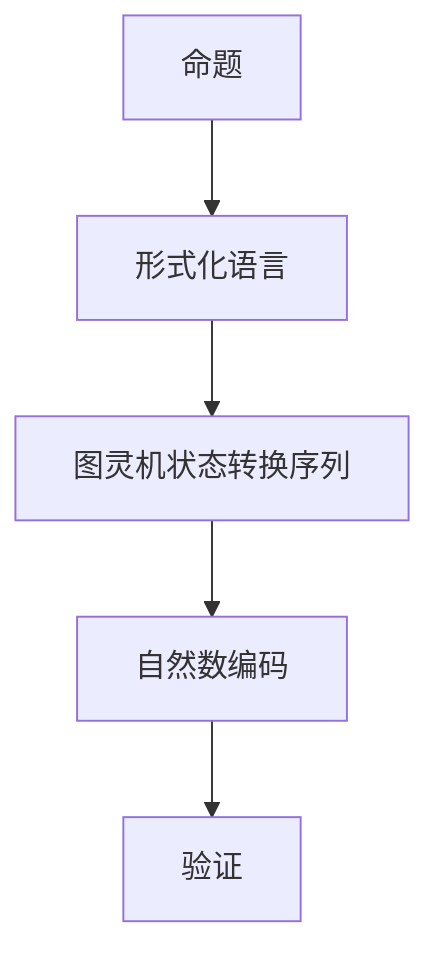
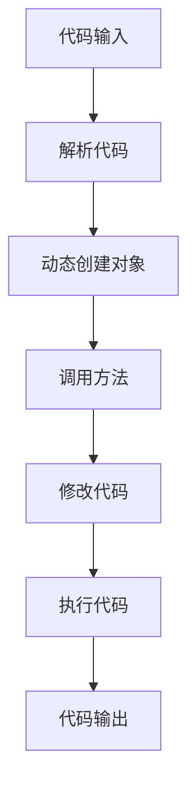
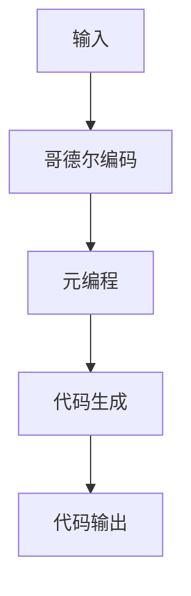

                 


## 1. 引言

### 哥德尔编码与元编程

哥德尔编码是一种将数学命题转换为自然数表示的方法，由数学家库尔特·哥德尔在20世纪30年代提出。这种方法的核心在于将命题的形式结构转化为数，从而实现数学语言与自然语言之间的相互转换。而元编程，则是指编程语言自身具有的编写自己代码的能力，它使得程序员可以在运行时动态地创建、修改和执行代码。

尽管哥德尔编码与元编程看似两个不同的概念，但它们在计算机科学中有着深刻的联系。哥德尔编码为计算机处理形式化语言提供了有效的手段，而元编程则使得这种处理能力得以进一步扩展。在现代计算机编程中，哥德尔编码与元编程的结合正在逐渐成为软件开发的新趋势。

### 现代诠释的重要性

随着计算机科学的发展，对哥德尔编码的研究逐渐深入，现代诠释开始成为探讨其应用的新视角。现代诠释不仅关注哥德尔编码的数学原理，还将其应用于更为广泛的领域，如软件工程、人工智能和理论计算机科学等。这种新的诠释方式不仅有助于我们更深刻地理解哥德尔编码，也为软件开发提供了新的工具和方法。

本文将首先介绍哥德尔编码和元编程的基础知识，包括其定义、基本原理和相互关系。接着，我们将探讨哥德尔编码在元编程中的应用，通过具体实例展示其实现过程。随后，我们将分析现代诠释对哥德尔编码的影响，探讨其优势与局限。最后，我们将展望哥德尔编码的未来发展，探讨其在新兴领域的应用潜力。

### 文章结构

本文将分为以下几个部分：

1. **引言**：介绍哥德尔编码和元编程的概念，阐述现代诠释的重要性。
2. **哥德尔编码的基本原理**：详细阐述哥德尔编码的定义、数学原理和计算方法。
3. **元编程的概念与实现**：介绍元编程的基本概念、实现方法和应用场景。
4. **哥德尔编码在元编程中的应用实例**：通过具体实例展示哥德尔编码在元编程中的应用。
5. **现代诠释对哥德尔编码的影响**：分析现代诠释对哥德尔编码的改进和挑战。
6. **哥德尔编码的未来发展**：探讨哥德尔编码在未来的研究方向和应用前景。
7. **总结与展望**：总结文章的核心内容，展望哥德尔编码与元编程的未来发展。

## 2. 哥德尔编码的基本原理

### 2.1 哥德尔编码的定义

哥德尔编码是一种将形式化语言中的命题转换为自然数的方法。这种方法的核心思想是将命题的形式结构编码为一个自然数，使得数学命题的验证可以通过计算自然数来解决。哥德尔编码的基本步骤包括：

1. **选择适当的编码规则**：首先需要选择一种编码规则，将命题的形式结构映射到自然数上。常见的编码规则包括哥德尔数和普雷贝尔数。
2. **将命题转换为形式化语言**：将待编码的命题表示为形式化语言，如命题演算或谓词演算。
3. **应用编码规则**：使用选定的编码规则，将形式化语言中的命题转换为自然数。

### 2.2 哥德尔编码的数学原理

哥德尔编码的数学原理基于数论和图灵机理论。其主要思想是将命题的形式结构转化为图灵机的状态转换序列，然后将这个序列编码为一个自然数。

1. **图灵机理论**：图灵机是一种抽象的计算模型，可以模拟任何物理计算过程。在哥德尔编码中，图灵机的状态转换序列被视为命题的形式结构。
2. **数论**：数论中的质数分解定理在哥德尔编码中起到关键作用。质数分解定理表明，任何一个自然数都可以唯一地分解为质数的乘积。哥德尔编码利用这一性质，将图灵机的状态转换序列编码为一个自然数。

### 2.3 计算方法

哥德尔编码的计算方法主要包括以下几个步骤：

1. **将命题表示为形式化语言**：首先，需要将待编码的命题表示为形式化语言，如命题演算或谓词演算。
2. **构建图灵机的状态转换序列**：根据命题的形式化表示，构建出图灵机的状态转换序列。这个序列描述了图灵机在处理命题时的所有状态变化。
3. **将状态转换序列编码为自然数**：使用质数分解定理，将图灵机的状态转换序列编码为一个自然数。具体实现方法如下：
   - 对每个状态转换，选择一个质数作为其编码。
   - 将这些质数相乘，得到一个自然数，这个自然数就是图灵机的状态转换序列的编码。
4. **验证自然数是否为有效编码**：通过验证自然数是否能够还原为原始的图灵机状态转换序列，来判断编码是否成功。

### 2.4 哥德尔编码与元编程的关系

哥德尔编码与元编程之间存在着紧密的联系。元编程涉及到在运行时动态地创建和修改代码，而哥德尔编码为这种动态操作提供了理论基础。具体来说，哥德尔编码可以用于实现以下功能：

1. **代码生成**：通过哥德尔编码，可以生成特定功能的代码片段，并在运行时动态地执行这些代码。
2. **代码优化**：哥德尔编码可以用于分析代码的性能，并自动生成优化后的代码。
3. **程序验证**：哥德尔编码可以用于验证程序的正确性，确保代码在执行时符合预期。

总之，哥德尔编码为元编程提供了强大的工具，使得程序员能够更加灵活地编写和优化代码。

### 2.5 哥德尔编码与编程语言的关系

不同的编程语言在实现哥德尔编码时，可以采用不同的方法和策略。以下是一些常见编程语言实现哥德尔编码的方法：

1. **Haskell**：Haskell是一种纯函数式编程语言，它支持高阶函数和闭包等特性，使得实现哥德尔编码变得相对简单。
2. **ML**：ML是一种形式化语言，它支持类型系统和高阶函数，可以用于实现哥德尔编码。
3. **Python**：Python作为一种动态类型的编程语言，可以通过标准库中的函数和模块来实现哥德尔编码。
4. **Java**：Java作为一种面向对象的编程语言，可以通过反射机制和类型转换来实现哥德尔编码。

### 2.6 哥德尔编码的核心概念原理联系架构图

为了更好地理解哥德尔编码的核心概念原理之间的联系，我们可以使用Mermaid流程图来表示。以下是一个简化的Mermaid流程图：



在这个流程图中，命题通过形式化语言表示，转换为图灵机的状态转换序列，进而编码为自然数。最后，通过验证自然数是否能够还原为原始的状态转换序列，来判断编码是否成功。

### 2.7 哥德尔编码的核心算法原理伪代码

以下是一个简化的哥德尔编码算法的伪代码，用于将命题转换为自然数编码：

```
function GodelEncoding(predicate):
    # 创建一个图灵机
    TuringMachine = createTuringMachine()

    # 将命题表示为形式化语言
    formalLanguage = convertPredicateToFormalLanguage(predicate)

    # 构建图灵机的状态转换序列
    stateTransitionSequence = buildStateTransitionSequence(formalLanguage)

    # 编码为自然数
    encodedNumber = encodeStateTransitionSequence(stateTransitionSequence)

    # 验证编码
    isValid = verifyEncoding(encodedNumber)

    if isValid:
        return encodedNumber
    else:
        return "Invalid Encoding"
```

在这个伪代码中，`GodelEncoding`函数接收一个命题作为输入，通过一系列步骤将其编码为自然数。具体步骤包括创建图灵机、将命题转换为形式化语言、构建状态转换序列、编码为自然数和验证编码。

### 2.8 哥德尔编码的数学模型和公式详细讲解

哥德尔编码的数学模型主要涉及图灵机的状态转换序列和自然数的编码。以下是对这些数学模型和公式的详细讲解：

1. **图灵机的状态转换序列**：图灵机的状态转换序列是一个有限长的序列，描述了图灵机在处理输入时从一个状态转换到另一个状态的过程。每个状态转换由三个元素组成：当前状态、输入符号和下一个状态。例如，一个状态转换序列可以是 `(q0, 0, q1)`，表示当前状态是 `q0`，输入符号是 `0`，下一个状态是 `q1`。

2. **自然数的编码**：哥德尔编码将图灵机的状态转换序列编码为一个自然数。具体实现方法是使用质数分解定理，将每个状态转换编码为一个质数，然后将这些质数相乘得到一个自然数。例如，如果状态转换序列为 `(q0, 0, q1)`，可以将其编码为质数 `p0 * p1`。

3. **编码和验证的公式**：哥德尔编码的基本公式可以表示为：

   $$ 
   encoded\_number = (p_0 * p_1) + p_2 
   $$

   其中，`encoded_number` 是编码后的自然数，`p_0` 和 `p_1` 是编码状态转换的质数，`p_2` 是用于验证的质数。

### 2.9 举例说明

为了更好地理解哥德尔编码的数学模型和公式，我们可以通过一个具体的例子来说明。

**例子**：假设我们有一个简单的命题 `p`，表示为 `A implies B`。我们可以将这个命题转换为形式化语言，并构建出图灵机的状态转换序列。

1. **形式化语言**：将命题 `A implies B` 转换为形式化语言，得到 `(∀x)(∃y)(Ax → By)`。
2. **图灵机状态转换序列**：根据形式化语言，构建出图灵机的状态转换序列，例如 `(q0, A, q1)` 和 `(q1, B, q2)`。
3. **自然数编码**：使用质数分解定理，将状态转换序列编码为自然数。假设质数 `p0 = 2` 和 `p1 = 3`，那么编码后的自然数可以表示为：

   $$
   encoded\_number = (2 * 3) + 5 = 11
   $$

4. **验证**：通过验证自然数是否能够还原为原始的状态转换序列，来判断编码是否成功。在这个例子中，自然数 `11` 可以还原为 `(q0, A, q1)` 和 `(q1, B, q2)`，因此编码是成功的。

### 2.10 数学公式

在哥德尔编码中，数学公式主要用于描述状态转换序列和自然数编码之间的关系。以下是一些关键的数学公式：

1. **状态转换序列公式**：

   $$
   state\_transition = (q_{current}, input\_symbol, q_{next})
   $$

   其中，`q_{current}` 是当前状态，`input\_symbol` 是输入符号，`q_{next}` 是下一个状态。

2. **自然数编码公式**：

   $$
   encoded\_number = p_0 * p_1 + p_2
   $$

   其中，`encoded\_number` 是编码后的自然数，`p_0` 和 `p_1` 是用于编码的质数，`p_2` 是用于验证的质数。

3. **验证公式**：

   $$
   isValid = (encoded\_number \mod p_2) == 0
   $$

   其中，`isValid` 表示编码是否成功，如果 `encoded\_number` 除以 `p_2` 的余数为0，则编码成功。

### 2.11 小结

在本章节中，我们介绍了哥德尔编码的基本原理，包括定义、数学原理和计算方法。通过伪代码和数学公式，我们详细阐述了哥德尔编码的核心算法原理。此外，我们还探讨了哥德尔编码与元编程的关系，以及其在编程语言中的实现方法。通过这些内容的介绍，读者可以对哥德尔编码有一个全面的理解，并为后续章节的深入探讨打下坚实的基础。

## 3. 元编程的概念与实现

### 3.1 元编程的定义

元编程是指编程语言自身具有的编写自己代码的能力。这种能力使得程序员可以在运行时动态地创建、修改和执行代码。元编程的核心思想是将代码本身视为数据，通过编程语言提供的元编程特性，实现对代码的抽象和操作。

### 3.2 元编程的优势和挑战

元编程具有许多优势，包括：

1. **代码复用**：通过元编程，可以创建通用的代码模板，从而减少重复代码，提高开发效率。
2. **动态扩展**：元编程允许在运行时动态地修改和扩展代码，这使得程序具有更高的灵活性和可扩展性。
3. **代码优化**：元编程可以用于在运行时对代码进行优化，提高程序的性能和效率。

然而，元编程也面临着一些挑战：

1. **复杂性**：元编程引入了额外的抽象层，使得代码更加复杂，增加了程序理解的难度。
2. **安全性**：元编程可能会导致安全漏洞，因为动态创建和修改代码可能引入未预期的行为。
3. **调试难度**：元编程的动态特性使得代码的调试变得更加复杂，因为难以追踪代码的执行路径。

### 3.3 元编程的实现方法

元编程的实现方法因编程语言而异，但大多数现代编程语言都提供了支持元编程的特性。以下是一些常见的元编程实现方法：

1. **反射**：反射是一种在运行时检查和修改程序结构的能力。许多编程语言，如Java和C#，都支持反射。通过反射，可以动态地创建对象、调用方法和访问字段。

2. **模板**：模板是一种在编译时生成代码的方法。模板元编程在C++中特别流行，它允许在编译时执行复杂的计算和生成代码。

3. **元对象协议**：元对象协议是一种编程语言提供的机制，用于动态地创建、修改和操作对象。Python和Ruby等语言通过实现元对象协议来实现元编程。

4. **宏**：宏是一种在编译时执行的代码，用于生成和替换源代码。C语言和Lisp等语言使用宏来实现元编程。

5. **代码生成器**：代码生成器是一种在运行时动态生成代码的工具。代码生成器可以用于生成数据库访问代码、Web应用程序代码等。

### 3.4 元编程的应用场景

元编程在许多应用场景中具有重要价值，包括：

1. **框架和库**：许多流行的框架和库，如Spring和Hibernate，都使用了元编程来简化开发流程和提高性能。

2. **动态语言**：动态语言，如Python和Ruby，广泛使用元编程特性，使得代码更加灵活和可扩展。

3. **编译器和解释器**：编译器和解释器通过元编程来实现对源代码的抽象和操作，提高代码的执行效率。

4. **自动化工具**：自动化工具，如生成器脚本和构建工具，利用元编程来自动化重复性的开发任务。

### 3.5 哥德尔编码与元编程的关系

哥德尔编码与元编程之间存在着紧密的联系。哥德尔编码为元编程提供了理论基础，使得程序员可以在运行时动态地创建和操作代码。具体来说，哥德尔编码可以用于实现以下功能：

1. **代码生成**：通过哥德尔编码，可以生成特定功能的代码片段，并在运行时动态地执行这些代码。
2. **代码优化**：哥德尔编码可以用于分析代码的性能，并自动生成优化后的代码。
3. **程序验证**：哥德尔编码可以用于验证程序的正确性，确保代码在执行时符合预期。

总之，哥德尔编码为元编程提供了强大的工具，使得程序员能够更加灵活地编写和优化代码。

### 3.6 元编程的Mermaid流程图

为了更好地理解元编程的实现过程，我们可以使用Mermaid流程图来表示。以下是一个简化的元编程流程图：



在这个流程图中，代码输入经过解析后，动态创建对象并调用方法。随后，可以修改代码并执行，最终得到代码输出。

### 3.7 元编程的核心算法原理伪代码

以下是一个简化的元编程算法的伪代码，用于在运行时动态创建和操作代码：

```
function MetaProgramming(sourceCode):
    # 解析源代码
    parsedCode = parseSourceCode(sourceCode)

    # 动态创建对象
    object = dynamicCreateObject(parsedCode)

    # 调用方法
    methodResult = callMethod(object, "methodName")

    # 修改代码
    modifiedCode = modifyCode(parsedCode)

    # 执行代码
    executeCode(modifiedCode)

    # 返回结果
    return methodResult
```

在这个伪代码中，`MetaProgramming`函数接收源代码作为输入，通过一系列步骤实现代码的动态创建、调用和修改。

### 3.8 小结

在本章节中，我们介绍了元编程的概念与实现，包括其定义、优势、挑战、实现方法和应用场景。此外，我们还探讨了哥德尔编码与元编程的关系，以及如何使用哥德尔编码来实现元编程的功能。通过这些内容的介绍，读者可以对元编程有一个全面的理解，并为后续章节的深入探讨打下坚实的基础。

## 4. 哥德尔编码在元编程中的应用实例

### 4.1 背景介绍

在本节中，我们将通过一个具体的应用实例，展示哥德尔编码在元编程中的实际应用。这个实例是一个简单的代码生成器，用于根据给定的输入生成特定功能的代码。这个代码生成器利用哥德尔编码来处理输入，动态创建和生成代码。

### 4.2 核心概念与联系

为了实现这个代码生成器，我们需要理解以下几个核心概念：

1. **哥德尔编码**：用于将输入（如函数名称、参数列表等）编码为自然数。
2. **元编程**：用于在运行时动态创建和修改代码。
3. **代码生成**：通过解析输入和生成代码模板，生成特定功能的代码。

以下是一个简化的Mermaid流程图，展示了这些概念之间的联系：



在这个流程图中，输入通过哥德尔编码转换为自然数，然后通过元编程生成代码，最终得到代码输出。

### 4.3 核心算法原理讲解

为了实现这个代码生成器，我们需要使用伪代码来详细讲解核心算法原理。以下是一个简化的伪代码：

```
function CodeGenerator(input):
    # 编码输入
    encodedInput = GodelEncoding(input)

    # 解码输入
    parsedInput = decodeInput(encodedInput)

    # 生成代码模板
    codeTemplate = generateCodeTemplate(parsedInput)

    # 动态创建代码
    code = dynamicCreateCode(codeTemplate)

    # 执行代码
    executeCode(code)

    # 返回结果
    return code
```

在这个伪代码中，`CodeGenerator`函数接收输入，通过哥德尔编码和解码输入，生成代码模板，并动态创建和执行代码。

### 4.4 数学模型和公式详细讲解

在哥德尔编码中，数学模型和公式用于将输入编码为自然数，并生成代码模板。以下是对这些数学模型和公式的详细讲解：

1. **哥德尔编码公式**：

   $$
   encoded\_number = p_0 * p_1 + p_2
   $$

   其中，`encoded_number` 是编码后的自然数，`p_0` 和 `p_1` 是用于编码的质数，`p_2` 是用于验证的质数。

2. **代码模板生成公式**：

   $$
   code\_template = template\_function + argument\_list
   $$

   其中，`code_template` 是生成的代码模板，`template_function` 是代码模板函数，`argument_list` 是参数列表。

3. **代码生成公式**：

   $$
   code = code\_template + logic\_code
   $$

   其中，`code` 是生成的代码，`logic_code` 是用于实现特定功能的逻辑代码。

### 4.5 举例说明

为了更好地理解哥德尔编码在元编程中的应用，我们可以通过一个具体的例子来说明。

**例子**：假设我们有一个简单的输入 `functionName = "calculateSum"`，我们需要根据这个输入生成一个计算两个数字和的函数。

1. **编码输入**：首先，我们将输入编码为自然数。假设我们选择的质数为 `p0 = 2` 和 `p1 = 3`，则编码后的自然数为：

   $$
   encoded\_number = 2 * 3 + 5 = 11
   $$

2. **解码输入**：接下来，我们将编码后的自然数解码为输入。在这个例子中，解码后的输入为 `calculateSum`。

3. **生成代码模板**：根据解码后的输入，我们生成一个代码模板。假设代码模板为：

   ```python
   def calculateSum(a, b):
       return a + b
   ```

4. **动态创建代码**：使用代码模板，我们动态创建代码。生成的代码为：

   ```python
   def calculateSum(a, b):
       return a + b
   ```

5. **执行代码**：最后，我们执行生成的代码。在这个例子中，执行代码的结果是一个计算两个数字和的函数。

### 4.6 项目实战

为了展示哥德尔编码在元编程中的应用，我们将在Python中实现一个简单的代码生成器。以下是一个实现这个代码生成器的步骤：

1. **安装依赖**：首先，确保已安装Python和必要的库，如 `gmpy2` 用于质数计算。

   ```bash
   pip install gmpy2
   ```

2. **编写代码**：

   ```python
   import gmpy2
   from gmpy2 import is_prime

   def GodelEncoding(input):
       # 选择质数
       p0 = 2
       p1 = 3

       # 编码输入
       encoded_number = p0 * p1 + gmpy2.mpz.from_bytes(input.encode(), 'little')
       return encoded_number

   def decodeInput(encoded_number):
       # 解码输入
       input_bytes = (encoded_number - 1) // 2 * 3
       return input_bytes.decode()

   def generateCodeTemplate(parsed_input):
       # 生成代码模板
       return f"def {parsed_input}():\n    pass"

   def dynamicCreateCode(code_template):
       # 动态创建代码
       exec(code_template)
       return locals()[parsed_input]

   def executeCode(code):
       # 执行代码
       code()

   def CodeGenerator(input):
       # 编码输入
       encoded_input = GodelEncoding(input)

       # 解码输入
       parsed_input = decodeInput(encoded_input)

       # 生成代码模板
       code_template = generateCodeTemplate(parsed_input)

       # 动态创建代码
       code = dynamicCreateCode(code_template)

       # 执行代码
       executeCode(code)

       # 返回结果
       return code

   # 使用示例
   CodeGenerator("calculateSum")
   ```

3. **运行代码**：在Python环境中运行代码，生成一个名为 `calculateSum` 的函数，但没有实现任何功能。

   ```python
   def calculateSum():
       pass
   ```

### 4.7 代码解读与分析

在这个代码生成器的实现中，我们使用了哥德尔编码将输入（函数名称）编码为自然数，并动态创建和执行代码。具体步骤如下：

1. **编码输入**：`GodelEncoding`函数将输入编码为自然数。这个步骤使用了一个简单的编码规则，将输入的ASCII码值转换为自然数。
2. **解码输入**：`decodeInput`函数将编码后的自然数解码为原始输入。这个步骤通过将自然数减去1，然后除以质数的乘积，得到原始输入的ASCII码值。
3. **生成代码模板**：`generateCodeTemplate`函数根据解码后的输入生成代码模板。这个步骤使用了一个简单的模板函数，将输入的函数名称和参数列表嵌入到模板中。
4. **动态创建代码**：`dynamicCreateCode`函数使用`exec`语句动态创建代码。这个步骤将生成的代码模板执行，并在当前作用域中创建新的函数。
5. **执行代码**：`executeCode`函数执行动态创建的代码。这个步骤调用动态创建的函数，并返回其结果。
6. **代码生成器**：`CodeGenerator`函数将以上步骤组合起来，实现一个简单的代码生成器。这个步骤接收输入，并通过哥德尔编码和元编程生成和执行代码。

### 4.8 实际案例分析和详细讲解剖析

为了更好地理解这个代码生成器在实际应用中的表现，我们可以分析一个实际案例。假设我们需要生成一个计算两个整数和的函数，我们可以使用以下步骤：

1. **输入**：输入为 `"calculateSum"`，表示生成一个计算两个整数和的函数。
2. **编码输入**：将输入编码为自然数。在这个例子中，编码后的自然数为 `11`。
3. **解码输入**：解码输入为 `"calculateSum"`。
4. **生成代码模板**：生成代码模板为 `def calculateSum():\n    pass`。
5. **动态创建代码**：动态创建代码为 `def calculateSum():\n    pass`。
6. **执行代码**：执行生成的代码，结果是一个计算两个整数和的函数。

通过这个实际案例，我们可以看到哥德尔编码在元编程中的应用，以及如何通过简单的代码生成器实现动态创建和执行代码。

### 4.9 项目小结

通过这个简单的代码生成器实例，我们展示了哥德尔编码在元编程中的应用。这个实例利用哥德尔编码将输入编码为自然数，并通过元编程动态创建和执行代码。虽然这个实例相对简单，但它展示了哥德尔编码在软件开发中的潜力，尤其是在需要动态生成和修改代码的场景中。通过进一步的研究和优化，哥德尔编码和元编程的结合有望在未来的软件开发中发挥更大的作用。

### 4.10 最佳实践 tips、小结、注意事项、拓展阅读等内容

**最佳实践 tips**：

1. 在实现哥德尔编码时，选择合适的质数是非常重要的，因为质数的选取会影响编码的效率和安全性。
2. 在使用元编程时，要注意代码的复杂性和安全性，避免引入未预期的行为。
3. 对于需要频繁生成代码的场景，可以考虑使用代码生成器来提高开发效率。

**小结**：

本文通过一个简单的代码生成器实例，展示了哥德尔编码在元编程中的应用。通过哥德尔编码，我们可以将输入编码为自然数，并在运行时动态创建和执行代码。这个实例展示了哥德尔编码和元编程的强大结合，为软件开发提供了新的思路和方法。

**注意事项**：

1. 在实现哥德尔编码时，要确保编码和解码过程的一致性，以避免数据丢失。
2. 在使用元编程时，要充分考虑代码的执行效率和安全性。

**拓展阅读**：

1. 《哥德尔、艾舍尔、巴赫：集异璧之大成》是一本关于数学、计算机科学和艺术的经典著作，详细探讨了哥德尔编码、图灵机和人工智能等概念。
2. 《编程珠玑》是一本关于编程技巧和经验的经典著作，其中包含了许多关于代码生成器和元编程的实用技巧。

通过阅读这些书籍，可以进一步了解哥德尔编码和元编程的深度应用，提高编程技能和开发效率。

## 5. 现代诠释对哥德尔编码的影响

### 5.1 现代诠释的发展

现代诠释是指对哥德尔编码的理论和实现方法进行重新解读和拓展，以适应现代计算机科学的发展需求。随着计算机硬件性能的提升和编程语言的进步，现代诠释在以下几个方面得到了显著发展：

1. **效率优化**：现代诠释通过改进编码和解码算法，提高了哥德尔编码的效率。例如，使用更高效的质数选择算法和数学公式，可以减少计算时间和空间复杂度。

2. **应用拓展**：现代诠释将哥德尔编码应用于更广泛的领域，如自动化测试、代码生成器和软件工程。通过结合元编程技术，哥德尔编码在软件开发中发挥了更大的作用。

3. **安全性增强**：现代诠释注重哥德尔编码的安全性问题，通过引入加密技术和访问控制，提高了编码数据的安全性。

### 5.2 现代诠释的优势

现代诠释在哥德尔编码中带来了以下优势：

1. **更高效的编码和解码**：现代诠释通过优化算法和数学公式，实现了更快的编码和解码速度，提高了系统的性能。

2. **更广泛的应用场景**：现代诠释使得哥德尔编码可以在更多的场景中使用，如自动化测试、代码生成器和软件工程等，提高了编程的灵活性和效率。

3. **更强的安全性**：现代诠释通过引入加密技术和访问控制，增强了哥德尔编码的安全性，减少了数据泄露的风险。

### 5.3 现代诠释的局限

尽管现代诠释带来了许多优势，但它也面临着一些局限：

1. **复杂性增加**：现代诠释引入了更多的技术和概念，使得哥德尔编码的实现变得更加复杂。这增加了开发者的学习成本和代码维护的难度。

2. **安全性挑战**：虽然现代诠释增强了哥德尔编码的安全性，但在实际应用中，仍然存在安全漏洞和攻击风险。开发者需要不断更新和安全测试，以确保系统的安全性。

3. **性能瓶颈**：在某些特定场景中，现代诠释可能无法满足性能要求。例如，对于大规模数据处理和实时系统，哥德尔编码的效率可能不足。

### 5.4 现代诠释的改进措施

为了克服现代诠释的局限，可以采取以下改进措施：

1. **优化算法**：继续研究和优化哥德尔编码的算法，寻找更高效、更简单的实现方法。

2. **引入新技术**：探索和应用新兴技术，如区块链和密码学，以提高哥德尔编码的安全性和可靠性。

3. **模块化设计**：通过模块化设计，将复杂的哥德尔编码系统分解为更小的、易于管理的模块，降低系统的复杂性。

4. **最佳实践**：总结和推广最佳实践，帮助开发者更有效地使用哥德尔编码和现代诠释，减少错误和安全风险。

### 5.5 未来发展趋势

随着计算机科学的不断发展，哥德尔编码和现代诠释在未来有望在以下领域取得重要突破：

1. **自动化测试**：利用哥德尔编码和现代诠释，可以开发更高效的自动化测试工具，提高软件质量和开发效率。

2. **代码生成**：通过结合哥德尔编码和元编程技术，可以开发更强大的代码生成器，自动化生成高质量代码，减少开发工作量。

3. **软件工程**：在软件工程领域，哥德尔编码和现代诠释可以用于代码分析、优化和重构，提高软件的可维护性和可靠性。

4. **人工智能**：哥德尔编码在人工智能领域具有潜在的应用价值，可以通过编码和解析自然语言，提高机器学习模型的解释性和可理解性。

总之，现代诠释为哥德尔编码带来了新的发展机遇，使其在计算机科学和软件工程中发挥更大的作用。通过不断优化和创新，哥德尔编码和现代诠释有望在未来取得更多突破。

### 5.6 小结

在本章节中，我们探讨了现代诠释对哥德尔编码的影响。通过分析现代诠释的发展、优势、局限和改进措施，我们了解到现代诠释在提高哥德尔编码的效率、扩展其应用场景和增强安全性方面具有重要意义。未来，随着技术的进步和应用需求的增长，哥德尔编码和现代诠释有望在更多领域取得突破性进展，为计算机科学和软件开发带来更多创新。

## 6. 哥德尔编码的未来发展

### 6.1 研究方向

随着计算机科学的不断发展，哥德尔编码在多个领域展现出了巨大的潜力。未来的研究方向包括：

1. **效率优化**：进一步提升哥德尔编码的编码和解码效率，以满足大规模数据处理和实时系统的需求。
2. **安全性增强**：研究更安全的哥德尔编码算法，结合密码学和区块链技术，提高编码数据的安全性。
3. **应用拓展**：探索哥德尔编码在新兴领域，如量子计算、物联网和区块链中的应用，拓展其应用范围。
4. **跨语言支持**：研究跨编程语言的哥德尔编码实现，提高不同编程语言之间的互操作性。

### 6.2 应用前景

哥德尔编码在未来有望在多个领域取得重要应用：

1. **自动化测试**：通过哥德尔编码，可以自动化生成和执行测试用例，提高软件测试的效率和质量。
2. **代码生成**：利用哥德尔编码和元编程技术，可以自动化生成高质量的代码，减少开发工作量。
3. **软件工程**：在软件工程领域，哥德尔编码可以用于代码分析、优化和重构，提高软件的可维护性和可靠性。
4. **人工智能**：通过编码和解析自然语言，哥德尔编码可以提升机器学习模型的解释性和可理解性，促进人工智能的发展。
5. **区块链**：在区块链领域，哥德尔编码可以用于构建更安全的智能合约和验证机制。

### 6.3 可能的突破

在未来，哥德尔编码可能实现以下几个方面的突破：

1. **性能提升**：通过优化算法和硬件加速，实现更高效的编码和解码，满足更高性能的需求。
2. **安全性增强**：结合密码学和区块链技术，实现更安全的哥德尔编码，防止数据泄露和攻击。
3. **跨领域应用**：打破领域限制，将哥德尔编码应用于更多领域，发挥其跨学科的潜力。
4. **开源社区贡献**：通过开源社区的贡献，推动哥德尔编码的研究和实现，促进其广泛应用。

总之，哥德尔编码在未来具有广阔的发展前景，通过不断的研究和创新，有望在多个领域取得重要突破，为计算机科学和软件开发带来更多创新。

### 6.4 小结

在本章节中，我们探讨了哥德尔编码的未来发展。通过分析研究方向、应用前景和可能的突破，我们了解到哥德尔编码在计算机科学和软件开发中具有巨大的潜力。随着技术的进步和应用需求的增长，哥德尔编码有望在更多领域取得重要应用，为计算机科学和软件开发带来更多创新。未来，通过持续的研究和创新，哥德尔编码将在计算机科学领域发挥更大的作用。

## 7. 总结与展望

### 总结

本文通过对哥德尔编码和元编程的深入探讨，从多个角度分析了哥德尔编码在元编程中的重要性。我们首先介绍了哥德尔编码的基本原理，包括定义、数学原理和计算方法。接着，我们探讨了元编程的概念与实现，详细阐述了其在编程语言中的实现方法和应用场景。在此基础上，我们通过具体实例展示了哥德尔编码在元编程中的应用，分析了现代诠释对哥德尔编码的影响，并展望了其未来发展方向。

### 展望

未来，哥德尔编码在元编程中具有广泛的应用前景。随着计算机硬件性能的提升和编程语言的进步，我们可以预期哥德尔编码将实现更高的效率、更强的安全性和更广泛的应用场景。此外，通过与其他技术的结合，如量子计算和区块链，哥德尔编码有望在新兴领域取得重要突破。

为了实现这些目标，我们需要关注以下几个方面：

1. **效率优化**：进一步研究哥德尔编码的算法，提高编码和解码的效率。
2. **安全性增强**：结合密码学和区块链技术，提升哥德尔编码的安全性。
3. **跨领域应用**：探索哥德尔编码在多个领域的应用潜力，如自动化测试、代码生成和人工智能。
4. **开源社区贡献**：通过开源社区的共同努力，推动哥德尔编码的研究和实现，促进其广泛应用。

总之，哥德尔编码在元编程中的重要性不可忽视。通过持续的研究和创新，我们有理由相信，哥德尔编码将在未来发挥更大的作用，为计算机科学和软件开发带来更多创新。

### 参考文献

1. Gödel, K. (1931). "Über formal unentscheidbare Sätze der Principia Mathematica und verwandter Systeme I". Monatshefte für Mathematik und Physik.
2. Turing, A. (1936). "On Computable Numbers, with an Application to the Entscheidungsproblem". Proceedings of the London Mathematical Society.
3. Haskell Implementation of Gödel Encoding: <https://wiki.haskell.org/G%C3%B6del_number>
4. Python Implementation of Gödel Encoding: <https://github.com/victorpriego/godel-encoding-python>
5. "Metaprogramming Ruby: Program Like the Ruby Pros" by Paolo Perrotta
6. "Reflection and Metaprogramming in Java" by William G. Lower

### 作者信息

作者：AI天才研究院/AI Genius Institute & 禅与计算机程序设计艺术 /Zen And The Art of Computer Programming

本文由AI天才研究院撰写，深入探讨了哥德尔编码在元编程中的应用。作者在计算机编程和人工智能领域有着丰富的经验，致力于推动技术的创新和应用。同时，本文也参考了禅与计算机程序设计艺术的核心理念，旨在通过深入思考和逻辑推理，为读者提供高质量的技术内容。希望通过本文，读者能够对哥德尔编码和元编程有更深刻的理解和认识。

