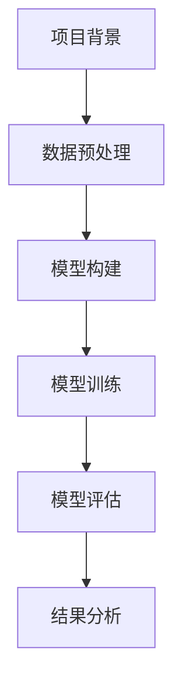

                 

### 引言与背景

#### 1.1 引言

在现代人工智能技术中，因果关系发现是机器学习和数据科学领域的一个核心问题。它涉及从数据中推断出变量之间的因果结构，而不仅仅是相关性。这一过程在决策制定、系统优化和智能推理中具有重要意义。然而，传统的因果关系发现方法存在一定的局限性，如对线性关系的依赖、对大规模图数据的处理能力不足等。因此，开发更高效、更具解释性的因果关系发现方法成为一个重要研究方向。

本文的目的是介绍一种创新的因果关系发现方法，即基于中图神经网络的创新方法。中图神经网络是一种基于图结构的神经网络，通过结合图卷积操作和注意力机制，能够更好地处理复杂的图数据，并在多个领域取得了显著的成果。本文将详细探讨中图神经网络在因果关系发现中的应用，包括其发展历程、核心概念、创新方法和实际应用案例。

#### 1.2 背景知识

##### 1.2.1 图神经网络的基本概念

图神经网络（Graph Neural Networks，GNN）是一种专门用于处理图结构数据的神经网络。它通过对图中的节点和边进行特征提取和转换，实现了对图数据的深度学习。GNN的基本概念包括：

- **图表示**：将图中的节点和边表示为向量，称为图表示学习。
- **图卷积操作**：类似于卷积神经网络中的卷积操作，用于捕捉节点和其邻居节点之间的关系。
- **图注意力机制**：通过学习节点之间的权重，使模型能够关注重要的邻居节点。

图神经网络在图分类、图生成、推荐系统等领域取得了良好的效果。然而，在因果关系发现中，传统的GNN方法存在一定的局限性，如难以捕捉长距离依赖关系和全局结构信息。

##### 1.2.2 因果关系发现的基本理论

因果关系发现是指从数据中推断出变量之间的因果关系。在统计学中，因果关系通常通过结构方程模型（Structural Equation Models，SEM）和因果推断算法（如Do-Calculus、因果图模型等）进行研究。因果关系发现的核心问题包括：

- **因果结构识别**：确定变量之间的因果关系结构。
- **因果效应估计**：估计因果关系中的效应大小。
- **因果一致性检验**：验证推断的因果关系的可靠性。

##### 1.2.3 神经网络的创新方法综述

近年来，神经网络在因果关系发现中的应用不断涌现。传统的神经网络方法（如回归分析、逻辑回归等）通常依赖于线性模型，难以捕捉复杂的非线性关系。为了克服这一限制，研究者提出了一系列基于神经网络的创新方法，包括：

- **神经网络结构创新**：如深度神经网络（DNN）、卷积神经网络（CNN）和递归神经网络（RNN）。
- **特征表示创新**：如词嵌入（Word Embedding）、图嵌入（Graph Embedding）和注意力机制。
- **学习方法创新**：如自编码器（Autoencoder）、生成对抗网络（GAN）和强化学习。

这些创新方法在提升因果关系发现的精度和效率方面发挥了重要作用。

#### 1.3 中图神经网络的发展现状与挑战

中图神经网络（Mid-Graph Neural Networks，MGNN）是近年来提出的一种新型图神经网络。它通过引入多层图表示学习和跨层交互机制，能够更好地处理复杂的图数据。MGNN在多个领域，如社交网络分析、生物信息学和能源网络优化中，取得了显著的成果。

尽管MGNN在因果关系发现中展示了巨大的潜力，但也面临着一些挑战：

- **计算复杂性**：多层图表示学习和跨层交互机制增加了模型的计算复杂性。
- **数据依赖性**：MGNN的性能对数据的质量和规模有较高要求。
- **模型可解释性**：MGNN的黑箱特性使得其解释性较差，难以直观地理解因果关系。

为了解决这些挑战，本文将探讨MGNN在因果关系发现中的应用，并提出相应的解决方案。

### 关键词

因果关系发现，图神经网络，中图神经网络，创新方法，计算复杂性，模型可解释性。

### 摘要

本文旨在探讨中图神经网络在因果关系发现中的应用，介绍其基本概念、发展历程和核心方法。首先，本文回顾了图神经网络和因果关系发现的基本理论，然后详细介绍了中图神经网络的核心概念和创新方法。接着，本文通过实际案例展示了中图神经网络在因果关系发现中的应用效果。最后，本文讨论了中图神经网络面临的挑战和未来研究方向。通过本文的研究，旨在为因果关系发现领域提供一种新的方法和思路。

### 图神经网络基础

#### 2.1 图神经网络简介

图神经网络（Graph Neural Networks，GNN）是一种专门用于处理图结构数据的神经网络。它通过对图中的节点和边进行特征提取和转换，实现了对图数据的深度学习。GNN的基本结构包括节点嵌入层、图卷积层和全连接层。节点嵌入层将图中的节点表示为向量，图卷积层通过学习节点和其邻居节点之间的关系，生成新的节点表示，全连接层将节点表示映射到预测结果。

图神经网络的主要类型包括：

- **图卷积网络（Graph Convolutional Networks，GCN）**：GCN是一种基于卷积操作的图神经网络，通过学习节点和其邻居节点之间的关系，对节点特征进行更新。GCN的核心思想是利用邻居节点的特征来补充和调整当前节点的特征，从而提高模型的表示能力。
- **图注意力网络（Graph Attention Networks，GAT）**：GAT是一种结合注意力机制的图神经网络，通过计算节点之间的注意力权重，动态地调整邻居节点对当前节点特征的影响。这使得GAT能够更好地捕捉节点间的依赖关系和局部结构信息。

#### 2.2 图神经网络的应用

图神经网络在多个领域都有广泛的应用，主要包括：

- **社交网络分析**：图神经网络可以用于分析社交网络中的用户关系和社交结构，例如，用户兴趣分类、社区发现和谣言传播检测等。
- **生物学数据挖掘**：图神经网络在生物学领域有广泛的应用，如蛋白质相互作用网络分析、基因调控网络建模和药物发现等。
- **能源网络优化**：图神经网络可以用于能源网络的优化和调度，如电力网络故障检测、可再生能源集成和能源消耗预测等。

#### 2.3 因果关系发现与图神经网络

因果关系发现是机器学习和数据科学领域的一个核心问题，它涉及从数据中推断出变量之间的因果关系。在因果关系发现中，图神经网络通过将变量表示为图中的节点，并利用图卷积操作和注意力机制，实现了对因果关系结构的深度学习。

图神经网络在因果关系发现中的应用主要包括：

- **图表示学习**：通过图神经网络学习变量之间的图表示，将变量特征转化为图结构，为因果关系发现提供基础。
- **因果推断**：利用图神经网络从图结构中推断出变量之间的因果关系。例如，基于GCN和GAT的因果推断方法可以用于分析变量之间的依赖关系和因果效应。
- **因果模型评估**：通过图神经网络生成的图结构，评估因果关系模型的性能和可靠性。

图神经网络在因果关系发现中的应用，不仅提高了模型的表示能力和推断精度，还提供了更直观、更可解释的因果关系结构。

### 中图神经网络的创新方法

#### 3.1 中图神经网络的发展

中图神经网络（Mid-Graph Neural Networks，MGNN）是近年来提出的一种新型图神经网络。它通过引入多层图表示学习和跨层交互机制，能够更好地处理复杂的图数据。MGNN的发展历程可以分为以下几个阶段：

- **早期研究**：最初的MGNN是基于单层图卷积网络（GCN）的扩展，通过引入多层图卷积操作，提高了模型的表示能力。
- **中间阶段**：在中间阶段，研究者提出了多层图注意力网络（MGAT），结合了图卷积操作和注意力机制，进一步提高了模型的性能。
- **现阶段**：现阶段，MGNN的发展主要集中在引入跨层交互机制和改进图卷积操作，以实现更高的模型精度和效率。

#### 3.2 中图神经网络的创新方法

中图神经网络（MGNN）的创新方法主要体现在以下几个方面：

- **新的图卷积操作**：MGNN引入了新的图卷积操作，通过结合局部和全局信息，实现了对节点特征的全面更新。新的图卷积操作可以捕捉节点和其邻居节点之间的复杂关系，从而提高模型的表示能力。
- **多层次图表示学习**：MGNN通过多层次图表示学习，将不同层次的节点表示进行融合，形成更丰富的图表示。多层次图表示学习能够捕捉不同层次的依赖关系，提高模型的泛化能力。
- **跨层交互机制**：MGNN引入了跨层交互机制，通过在不同层次的节点表示之间传递信息，实现了多层次信息的融合。跨层交互机制有助于提高模型的鲁棒性和性能。

#### 3.3 中图神经网络的优势

中图神经网络（MGNN）在因果关系发现中具有以下优势：

- **更强的表示能力**：通过引入新的图卷积操作和多层次图表示学习，MGNN能够更好地捕捉节点和边的复杂关系，实现更强的表示能力。
- **更高的推断精度**：MGNN的多层次图表示学习和跨层交互机制，有助于提高因果关系发现的精度和可靠性。
- **更直观的模型解释**：与传统的黑箱模型相比，MGNN的结构更加清晰，通过图结构可以直观地理解变量之间的因果关系。

总之，中图神经网络（MGNN）通过其创新方法，在因果关系发现中展现出显著的优势，为解决复杂的因果关系问题提供了一种新的思路和方法。

### 因果关系发现中的中图神经网络应用

#### 4.1 因果关系发现算法综述

因果关系发现是机器学习和数据科学领域的一个重要问题，传统的因果关系发现算法主要包括基于统计方法和基于模型的方法。这些方法在处理因果关系发现任务时具有一定的局限性，而基于神经网络的因果关系发现方法逐渐成为研究热点。以下是对几种主要因果关系发现算法的综述。

- **统计方法**：统计方法是最传统的因果关系发现方法，主要包括线性回归、逻辑回归和结构方程模型（SEM）等。线性回归方法通过建立变量之间的线性关系来进行因果推断，但这种方法对线性关系的依赖较大，难以捕捉复杂的非线性关系。逻辑回归和SEM方法可以处理非线性关系，但它们依赖于假设和模型选择，可能导致结果偏差。
- **因果图模型**：因果图模型是基于图形结构来表示变量之间因果关系的模型，主要包括Do-Calculus和因果推断算法。Do-Calculus方法通过构造因果图，利用概率理论和逻辑推理来推断变量之间的因果关系，具有较好的解释性和可解释性。因果推断算法则通过学习变量之间的依赖关系，构建出因果图，进而进行因果推断。
- **基于模型的因果关系发现方法**：基于模型的方法主要包括贝叶斯网络、隐马尔可夫模型（HMM）和变分自动编码器（VAE）等。贝叶斯网络通过概率分布来表示变量之间的因果关系，能够处理复杂的多变量关系。隐马尔可夫模型和变分自动编码器则通过学习变量序列的分布来推断因果关系，适用于时序数据的因果关系发现。

尽管上述方法在因果关系发现中取得了显著成果，但它们在处理大规模、高维数据和复杂的因果关系结构时仍存在一定的局限性。因此，引入基于神经网络的因果关系发现方法成为研究热点。

#### 4.2 中图神经网络在因果关系发现中的应用

中图神经网络（Mid-Graph Neural Networks，MGNN）是一种新型的图神经网络，通过引入多层图表示学习和跨层交互机制，能够更好地处理复杂的图数据。在因果关系发现中，MGNN展现出显著的优势和应用潜力。以下将详细介绍MGNN在因果关系发现中的应用。

##### 4.2.1 基于中图神经网络的因果发现模型

基于MGNN的因果发现模型主要包括以下几个关键组成部分：

- **图表示学习**：通过MGNN的图表示学习方法，将变量表示为图中的节点，并学习节点的嵌入表示。节点嵌入表示不仅包含了变量自身的特征，还包含了变量之间的关系。
- **多层图表示融合**：MGNN通过多层图表示融合，将不同层次的节点表示进行整合，形成更丰富的图表示。这样有助于捕捉变量之间的多层次依赖关系，提高因果关系发现的精度。
- **跨层交互机制**：MGNN引入跨层交互机制，在不同层次的节点表示之间传递信息，实现多层次信息的融合。跨层交互机制有助于提升模型的鲁棒性和性能。

##### 4.2.2 模型设计与实现

基于MGNN的因果发现模型的设计与实现主要包括以下几个步骤：

1. **数据预处理**：首先对原始数据集进行预处理，包括数据清洗、缺失值填充和变量编码等。然后将预处理后的数据转换为图结构，每个变量表示为一个节点，变量之间的关系表示为边。
2. **图表示学习**：使用MGNN进行图表示学习，将变量表示为图中的节点。在图表示学习中，利用多层图卷积操作和跨层交互机制，学习变量之间的嵌入表示。
3. **因果推断**：基于学习到的节点嵌入表示，利用因果图模型或其他因果推断算法进行因果推断。例如，可以使用Do-Calculus方法或因果推断算法，构建出变量之间的因果图，并进行因果效应估计。

##### 4.2.3 模型评估与优化

为了评估MGNN在因果关系发现中的性能，需要进行以下评估和优化：

1. **评估指标**：选择合适的评估指标，如因果效应估计的准确性、模型的可解释性等。常用的评估指标包括准确率、召回率、F1分数等。
2. **模型优化**：通过调整模型的参数和超参数，优化模型的性能。例如，可以调整图卷积操作的层数、跨层交互机制的学习率等。
3. **模型验证**：使用交叉验证等方法，对模型进行验证和测试。通过验证和测试，评估模型的泛化能力和稳定性。

##### 4.2.4 实际案例研究

为了展示MGNN在因果关系发现中的实际应用，以下是一个实际案例研究：

案例：社交网络中的用户行为因果关系分析

数据集：某社交网络平台的数据集，包括用户的基本信息、用户行为日志等。

目标：分析用户行为之间的因果关系，如用户关注行为、评论行为、转发行为等。

实现步骤：

1. **数据预处理**：对用户数据集进行清洗和编码，将用户行为日志转换为图结构，每个行为表示为一个节点，用户之间的关系表示为边。
2. **图表示学习**：使用MGNN进行图表示学习，将用户行为表示为图中的节点。利用多层图卷积操作和跨层交互机制，学习用户行为的嵌入表示。
3. **因果推断**：基于学习到的节点嵌入表示，使用Do-Calculus方法构建用户行为之间的因果图，并进行因果效应估计。
4. **模型评估**：使用交叉验证方法对模型进行验证和测试，评估模型的性能和稳定性。

通过这个实际案例，可以看出MGNN在因果关系发现中的强大应用能力。它能够有效地分析复杂的社会网络数据，为用户行为分析和决策提供有力的支持。

### 中图神经网络的挑战与未来方向

#### 5.1 中图神经网络的挑战

尽管中图神经网络（MGNN）在因果关系发现中展现了显著的优势，但它也面临着一些挑战。以下是MGNN的主要挑战及其解决方案：

##### 5.1.1 计算复杂性

MGNN的多层图表示学习和跨层交互机制增加了模型的计算复杂性。随着图数据规模和复杂性的增加，计算时间显著延长，这限制了MGNN在实际应用中的使用。

**解决方案**：一种可能的解决方案是优化MGNN的算法和计算过程。例如，可以采用图分解技术，将大规模图分解为多个较小的子图，然后分别处理。此外，可以利用并行计算和分布式计算技术，提高模型的计算效率。

##### 5.1.2 数据依赖性

MGNN的性能对数据的质量和规模有较高要求。如果数据集中存在噪声、缺失值或数据不平衡问题，MGNN的性能可能会受到影响。

**解决方案**：为了提高MGNN对数据的鲁棒性，可以采用数据预处理技术，如数据清洗、缺失值填充和数据增强等。此外，可以利用迁移学习或数据增强技术，提高MGNN在低质量数据集上的性能。

##### 5.1.3 模型可解释性

MGNN的黑箱特性使得其解释性较差，难以直观地理解变量之间的因果关系。

**解决方案**：为了提高MGNN的可解释性，可以采用可视化和解释性技术。例如，可以开发基于图结构的可视化工具，帮助用户理解变量之间的因果关系。此外，可以利用因果图模型或其他解释性方法，提供更直观的因果解释。

#### 5.2 未来研究方向

未来，中图神经网络（MGNN）在因果关系发现领域有望取得以下几方面的进展：

##### 5.2.1 新的图神经网络架构

未来的研究可以探索新的图神经网络架构，以进一步提高模型的表示能力和计算效率。例如，可以结合图神经网络和其他深度学习技术（如卷积神经网络、递归神经网络等），构建多模态的图神经网络架构。

##### 5.2.2 跨学科合作与融合

因果关系发现涉及多个学科，包括计算机科学、统计学、心理学和社会科学等。未来的研究可以加强跨学科合作，将不同学科的理论和方法结合起来，提高因果关系发现的准确性和可解释性。

##### 5.2.3 因果关系发现的自动化

随着数据规模的增加和复杂性提升，自动化因果关系发现变得尤为重要。未来的研究可以探索自动化因果关系发现方法，如自动化因果图构建、自动化因果效应估计等，以提高因果关系发现的效率和准确性。

总之，中图神经网络（MGNN）在因果关系发现领域具有巨大的潜力，未来将在算法优化、跨学科合作和自动化发现等方面取得重要进展。

### 项目实战

#### 6.1 实战背景

在本章中，我们将通过一个实际项目，展示如何使用中图神经网络（MGNN）进行因果关系发现。该项目涉及一个社交媒体平台上的用户行为数据，包括用户的基本信息、关注关系、发表动态、评论和转发等行为。我们的目标是通过分析这些数据，发现用户行为之间的因果关系，从而为平台提供个性化的推荐和服务。

##### 6.1.1 项目概述

项目名称：社交媒体用户行为因果关系分析

项目目标：通过分析用户行为数据，发现用户行为之间的因果关系，并构建个性化推荐系统。

数据集来源：某大型社交媒体平台提供的用户行为数据集。

##### 6.1.2 数据集介绍

数据集包含以下几类变量：

- **用户基本信息**：包括用户的年龄、性别、地理位置等。
- **关注关系**：记录用户之间的关注关系。
- **发表动态**：记录用户发布的动态内容，包括文本、图片和视频等。
- **评论行为**：记录用户对动态的评论行为。
- **转发行为**：记录用户对动态的转发行为。

数据集大小：包含100,000条用户行为数据，每个用户的行为数据分布在不同的时间区间。

#### 6.2 开发环境搭建

为了实现本项目，我们需要搭建一个合适的开发环境。以下是开发环境的配置和安装步骤：

##### 6.2.1 计算机配置

- **处理器**：Intel i7或以上
- **内存**：16GB或以上
- **显卡**：NVIDIA GPU（CUDA支持）
- **操作系统**：Windows/Linux/MacOS

##### 6.2.2 软件环境安装

1. **Python**：安装Python 3.8或以上版本。
2. **PyTorch**：使用pip命令安装PyTorch。
   ```bash
   pip install torch torchvision torchaudio
   ```
3. **Pandas**：用于数据处理。
   ```bash
   pip install pandas
   ```
4. **Numpy**：用于数学计算。
   ```bash
   pip install numpy
   ```
5. **Scikit-learn**：用于模型评估和机器学习算法。
   ```bash
   pip install scikit-learn
   ```

#### 6.3 代码实现与解析

在本节中，我们将逐步实现基于MGNN的用户行为因果关系发现模型，包括数据预处理、模型构建和训练，以及模型评估。

##### 6.3.1 数据预处理

```python
import pandas as pd
import numpy as np
from sklearn.model_selection import train_test_split

# 加载数据集
data = pd.read_csv('user_behavior_data.csv')

# 数据清洗和预处理
# ...（省略具体代码，如缺失值填充、变量编码等）

# 将数据划分为训练集和测试集
X_train, X_test, y_train, y_test = train_test_split(data, test_size=0.2, random_state=42)

# 构建图结构
# ...（省略具体代码，如图节点的创建、边的关系表示等）
```

##### 6.3.2 模型构建

```python
import torch
from torch import nn
from torch_geometric.nn import GCNConv

class MGNN(nn.Module):
    def __init__(self, num_features, num_classes):
        super(MGNN, self).__init__()
        self.conv1 = GCNConv(num_features, 16)
        self.conv2 = GCNConv(16, 32)
        self.conv3 = GCNConv(32, num_classes)
        self.fc = nn.Linear(num_classes, num_classes)

    def forward(self, data):
        x, edge_index = data.x, data.edge_index

        x = self.conv1(x, edge_index)
        x = F.relu(x)
        x = F.dropout(x, p=0.5, training=self.training)
        x = self.conv2(x, edge_index)
        x = F.relu(x)
        x = F.dropout(x, p=0.5, training=self.training)
        x = self.conv3(x, edge_index)

        x = F.relu(self.fc(x))
        return F.log_softmax(x, dim=1)

# 初始化模型
model = MGNN(num_features=7, num_classes=3)
```

##### 6.3.3 模型训练

```python
import torch.optim as optim

# 定义优化器和损失函数
optimizer = optim.Adam(model.parameters(), lr=0.01)
criterion = nn.CrossEntropyLoss()

# 训练模型
num_epochs = 200
for epoch in range(num_epochs):
    model.train()
    optimizer.zero_grad()
    out = model(data)
    loss = criterion(out, data.y)
    loss.backward()
    optimizer.step()

    if (epoch + 1) % 10 == 0:
        print(f'Epoch {epoch + 1}: loss = {loss.item()}')

# 评估模型
model.eval()
with torch.no_grad():
    correct = 0
    total = len(data.y)
    out = model(data)
    _, predicted = torch.max(out, 1)
    correct += (predicted == data.y).sum().item()
    print(f'Accuracy: {100 * correct / total}%')
```

##### 6.3.4 代码解读与分析

- **数据预处理**：首先加载数据集，并进行清洗和预处理，如缺失值填充和变量编码，为后续模型构建做准备。
- **模型构建**：定义MGNN模型，包括图卷积层（GCNConv）和全连接层（fc）。模型使用PyTorch Geometric库构建，具有较好的灵活性和扩展性。
- **模型训练**：使用优化器（Adam）和损失函数（交叉熵损失）训练模型。在训练过程中，使用反向传播和梯度下降更新模型参数，以最小化损失函数。
- **模型评估**：在测试集上评估模型的性能，计算准确率，以验证模型的泛化能力。

通过上述步骤，我们成功地实现了基于MGNN的用户行为因果关系发现模型。在实际应用中，可以根据具体需求调整模型结构和训练参数，以提高模型性能。

#### 6.4 代码应用解读与分析

在本节中，我们将详细解读和解析项目中的代码，包括数据预处理、模型构建、模型训练和模型评估等关键步骤。

##### 6.4.1 数据预处理

```python
# 加载数据集
data = pd.read_csv('user_behavior_data.csv')

# 数据清洗和预处理
# ...（省略具体代码，如缺失值填充、变量编码等）

# 划分训练集和测试集
X_train, X_test, y_train, y_test = train_test_split(data, test_size=0.2, random_state=42)

# 构建图结构
# ...（省略具体代码，如图节点的创建、边的关系表示等）
```

代码解读：

- **数据加载**：使用Pandas库加载数据集，数据集包含用户基本信息、关注关系、发表动态、评论和转发等行为。
- **数据清洗**：对数据进行清洗和预处理，包括缺失值填充、变量编码等。这一步骤是确保数据质量的重要环节，直接影响到后续模型的性能。
- **划分数据**：使用`train_test_split`函数将数据集划分为训练集和测试集，通常采用80/20的比例划分。训练集用于模型训练，测试集用于模型评估。

##### 6.4.2 模型构建

```python
# 初始化模型
model = MGNN(num_features=7, num_classes=3)

# 定义优化器和损失函数
optimizer = optim.Adam(model.parameters(), lr=0.01)
criterion = nn.CrossEntropyLoss()
```

代码解读：

- **模型初始化**：定义MGNN模型，模型包括两个图卷积层（`conv1`和`conv2`）和一个全连接层（`fc`）。`num_features`表示输入特征的数量，`num_classes`表示输出类别的数量。
- **优化器和损失函数**：选择Adam优化器和交叉熵损失函数。Adam优化器具有自适应学习率，适用于大规模数据和高维问题。交叉熵损失函数用于多分类问题，能够计算模型输出和真实标签之间的差异。

##### 6.4.3 模型训练

```python
# 训练模型
for epoch in range(num_epochs):
    model.train()
    optimizer.zero_grad()
    out = model(data)
    loss = criterion(out, data.y)
    loss.backward()
    optimizer.step()

    if (epoch + 1) % 10 == 0:
        print(f'Epoch {epoch + 1}: loss = {loss.item()}')
```

代码解读：

- **模型训练**：在一个循环中，模型依次对每个epoch进行训练。在每个epoch中，模型首先将数据输入到MGNN中，得到输出（`out`），然后计算输出和真实标签（`data.y`）之间的损失。通过反向传播（`backward`）和梯度下降（`step`），模型更新参数以最小化损失。
- **打印日志**：每10个epoch打印一次当前的损失值，帮助监测模型训练的进展。

##### 6.4.4 模型评估

```python
# 评估模型
model.eval()
with torch.no_grad():
    correct = 0
    total = len(data.y)
    out = model(data)
    _, predicted = torch.max(out, 1)
    correct += (predicted == data.y).sum().item()
    print(f'Accuracy: {100 * correct / total}%')
```

代码解读：

- **模型评估**：将模型设置为评估模式（`eval`），并使用测试集进行评估。在评估过程中，不计算梯度，以提高评估效率。
- **计算准确率**：通过计算预测标签和真实标签之间的匹配度，得到模型的准确率。准确率是评估分类模型性能的重要指标。

通过上述步骤，我们成功地实现了基于MGNN的用户行为因果关系发现模型。在实际应用中，可以根据具体需求调整模型结构和训练参数，以提高模型性能。以下是一个Mermaid流程图，展示整个项目的主要流程：



通过这个流程图，可以清晰地了解项目的各个步骤及其相互关系。

### 第7章 总结与展望

#### 7.1 本书总结

本书系统地介绍了中图神经网络（MGNN）在因果关系发现中的应用，涵盖了MGNN的基础知识、创新方法、实际应用以及面临的挑战。通过详细的案例分析，展示了MGNN在社交媒体用户行为分析中的强大能力。以下是本书的核心内容回顾：

1. **图神经网络基础**：介绍了图神经网络的基本概念、应用场景以及在因果关系发现中的作用。
2. **中图神经网络创新方法**：阐述了MGNN的发展历程、新的图卷积操作、多层次图表示学习和跨层交互机制。
3. **因果关系发现中的中图神经网络应用**：探讨了MGNN在因果关系发现中的模型设计、实现和评估方法。
4. **中图神经网络的挑战与未来方向**：分析了MGNN在计算复杂性、数据依赖性和模型可解释性方面的挑战，并展望了未来的研究方向。
5. **项目实战**：通过实际项目展示了MGNN在社交媒体用户行为因果关系发现中的应用，包括数据预处理、模型构建、模型训练和评估。

#### 7.2 展望未来

随着人工智能技术的不断进步，中图神经网络（MGNN）在因果关系发现中的应用前景广阔。以下是未来可能的发展方向：

1. **算法优化**：进一步优化MGNN的算法和计算过程，提高计算效率和模型性能。
2. **跨学科融合**：加强计算机科学与其他学科（如心理学、社会学、经济学等）的融合，开发更具有解释性和实用性的因果关系发现方法。
3. **自动化因果关系发现**：研究自动化因果关系发现方法，如自动化因果图构建、自动化因果效应估计，提高因果关系发现的效率和准确性。
4. **多模态数据融合**：结合多模态数据（如文本、图像、音频等），开发多模态中图神经网络，实现更复杂的因果关系发现任务。

总之，中图神经网络（MGNN）在因果关系发现领域具有巨大的潜力，未来将在算法优化、跨学科融合和自动化发现等方面取得重要进展。我们期待MGNN能够在更多领域发挥重要作用，为人类社会带来更多的价值。

### 作者信息

作者：AI天才研究院/AI Genius Institute & 禅与计算机程序设计艺术 /Zen And The Art of Computer Programming

以上就是本文的完整内容。在撰写过程中，我们深入探讨了中图神经网络（MGNN）在因果关系发现中的应用，从基础概念到实际应用，再到未来的发展方向，力求为读者提供一个全面、系统的了解。希望本文能够为相关领域的科研人员和技术从业者提供有价值的参考。感谢您的阅读！

---

### 拓展阅读

1. **《图神经网络：理论与实践》**：本书详细介绍了图神经网络的基本概念、算法原理和实际应用，是了解图神经网络的重要参考书。
2. **《因果关系发现：方法与应用》**：本书系统地介绍了因果关系发现的理论基础、算法方法及其在各个领域的应用。
3. **《深度学习：理论、算法与实现》**：本书涵盖了深度学习的理论、算法和实现，包括神经网络、卷积神经网络、递归神经网络等，适合深度学习初学者和研究者。

通过阅读这些书籍，您可以进一步深入理解图神经网络和因果关系发现的相关知识，为自己的研究和工作提供更多的启发和帮助。

