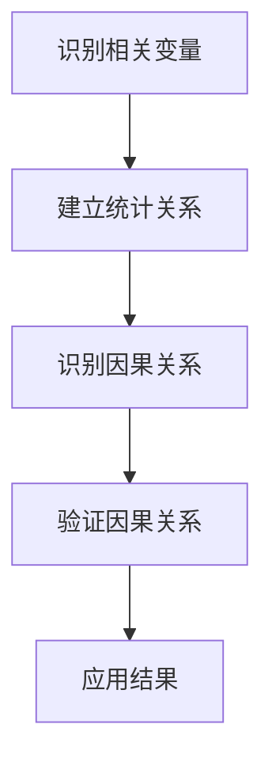
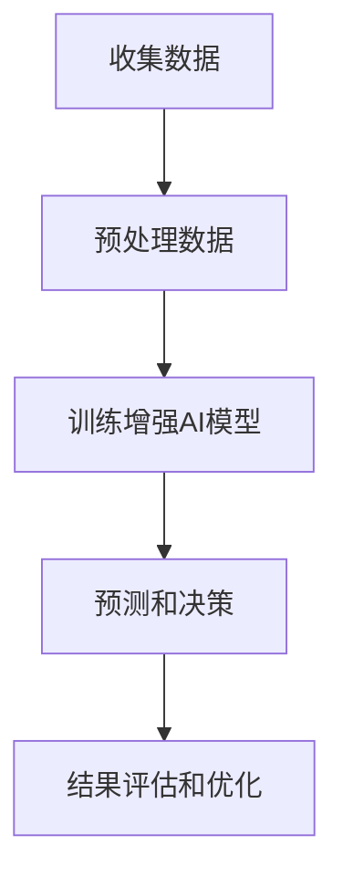

                 

### 引言：因果推断增强AI模型在医疗决策中的重要性

在当今的医疗领域，人工智能（AI）的应用已经变得日益普遍。从疾病预测到诊断，再到个性化治疗方案的制定，AI正在重塑医疗服务的方方面面。然而，尽管AI在处理大量数据和提高效率方面表现出色，但在关键领域，如因果推断和医疗决策的可靠性方面，仍然存在一定的局限。

因果推断，即理解变量之间的因果关系，是医疗决策中至关重要的一环。它不仅能帮助医生更准确地诊断病情，还能为制定个性化治疗方案提供有力的支持。例如，了解某种药物对不同患者的疗效差异，或者某种生活方式变化对健康的影响，都是因果推断在医疗决策中的重要应用。

然而，传统的机器学习算法，如深度学习模型，在处理因果推断问题时存在一些不足。它们通常依赖于统计相关性而非因果关系，可能导致在复杂医疗场景中的错误推断。例如，一个看似与疾病有强关联的特征，实际上可能只是与疾病的一个共同原因相关，而不是直接因果关系。

为了克服这些局限，研究者们开始将因果推断与AI模型相结合，形成了因果推断增强AI模型。这些模型旨在通过整合因果推断方法，提高AI在医疗决策中的可靠性。因果推断增强AI模型不仅能够识别和利用直接因果关系，还能在处理复杂医疗数据时提供更准确的预测和决策。

本文将深入探讨因果推断增强AI模型在医疗决策中的重要性，包括其基本概念、应用场景、核心算法原理以及面临的挑战。我们将通过以下结构展开讨论：

1. **第1部分：因果推断的基本概念和在医疗领域的应用**
   - 因果推断的基本原理
   - 因果推断在医疗领域的应用
   - 医疗领域中的因果推断挑战

2. **第2部分：增强AI模型的基本概念和在医疗领域的应用**
   - 增强AI模型的基本原理
   - 增强AI模型在医疗领域的应用
   - 医疗领域中的增强AI模型挑战

3. **第3部分：因果推断增强AI模型在医疗决策中的实际应用**
   - 因果推断增强AI模型在疾病预测中的应用
   - 因果推断增强AI模型在诊断中的应用
   - 因果推断增强AI模型在治疗决策中的应用

4. **第4部分：因果推断增强AI模型的可靠性和挑战**
   - 因果推断增强AI模型的可靠性分析
   - 因果推断增强AI模型的挑战
   - 提高因果推断增强AI模型可靠性的方法

5. **第5部分：总结和展望**
   - 因果推断增强AI模型在医疗决策中的应用总结
   - 未来研究方向和挑战

通过以上结构，我们将一步步深入分析因果推断增强AI模型在医疗决策中的重要性，帮助读者全面理解这一领域的最新进展和应用前景。

### 文章关键词

- 因果推断
- 人工智能
- 医疗决策
- AI模型
- 可靠性
- 疾病预测
- 诊断
- 治疗决策

### 摘要

本文旨在探讨因果推断增强AI模型在医疗决策中的重要性。因果推断是理解变量之间因果关系的关键，对于准确预测和决策至关重要。然而，传统的机器学习算法在处理因果关系方面存在局限。为了克服这些局限，研究者们提出了因果推断增强AI模型，旨在提高AI在医疗决策中的可靠性。本文将详细分析因果推断增强AI模型的基本概念、应用场景、核心算法原理以及面临的挑战，并探讨如何提高其可靠性。通过本文的讨论，读者将全面理解因果推断增强AI模型在医疗决策中的重要作用，以及其在未来医疗领域的应用前景。

### 第1部分：因果推断的基本概念和在医疗领域的应用

因果推断，即理解变量之间的因果关系，是科学研究中的一个核心问题。在医疗领域，因果推断更是至关重要，它不仅可以帮助医生更好地诊断病情，还能为制定个性化治疗方案提供有力支持。然而，因果关系并不总是直观的，需要通过科学的方法来揭示。在本节中，我们将首先介绍因果推断的基本原理，然后探讨其在医疗领域的具体应用，以及当前面临的挑战。

#### 因果推断的基本原理

因果推断的核心目标是确定变量之间的因果关系。这通常涉及以下步骤：

1. **识别相关变量**：首先需要识别与目标变量相关的其他变量。例如，在研究某种药物的效果时，需要考虑患者的年龄、性别、体重等因素。

2. **建立统计关系**：通过数据分析，建立变量之间的统计关系。例如，使用回归分析来确定某个特征与疾病发生之间的关系。

3. **识别因果关系**：通过进一步分析，确定哪些变量是因，哪些是果。这通常需要使用因果推断算法，如因果图、Do-Calculus等。

4. **验证因果关系**：通过实验或观察数据，验证所识别的因果关系是否成立。

#### 因果推断的类型

因果推断主要分为两种类型：结构因果模型（structural causal models，SCMs）和潜在结果框架（potential outcomes framework）。

1. **结构因果模型**：SCM使用图论来表示变量之间的因果关系。它通过构建一个因果图，明确变量之间的直接和间接关系。SCM的一个优点是能够形式化地描述复杂的因果关系，但在实际应用中，构建准确的因果图往往具有挑战性。

2. **潜在结果框架**：潜在结果框架使用潜在结果的概念来描述因果关系。它假设在特定干预下，个体会表现出某种潜在的结果。这种方法在实际应用中更为灵活，但需要处理大量的潜在结果，计算复杂度较高。

#### 因果推断在医疗领域的应用

因果推断在医疗领域具有广泛的应用，主要包括以下几个方面：

1. **疾病预测**：通过分析患者的病史、基因信息、生活方式等因素，预测患者未来可能患上的疾病。例如，使用因果推断方法可以更准确地预测心血管疾病、糖尿病等慢性病的发生。

2. **诊断**：在诊断过程中，因果推断可以帮助医生理解症状与疾病之间的关系，提高诊断的准确性。例如，通过分析患者的临床症状、检查结果等，确定病因。

3. **治疗决策**：因果推断可以帮助医生制定个性化的治疗策略。例如，了解不同治疗方案对患者效果的不同，为医生提供可靠的决策依据。

4. **疾病管理**：在长期疾病管理中，因果推断可以用于评估不同干预措施的效果，为患者提供持续的健康指导。

#### 医疗领域中的因果推断挑战

尽管因果推断在医疗领域具有巨大的应用潜力，但在实际应用中仍面临诸多挑战：

1. **数据质量问题**：医疗数据通常具有噪声、缺失和不一致性，这给因果推断带来了很大困难。

2. **复杂的医疗关系**：医疗领域中的变量关系复杂，因果关系往往不是单一的，而是相互交织的。

3. **伦理和隐私问题**：医疗数据涉及到患者的隐私和伦理问题，如何在不侵犯隐私的前提下进行因果推断，是一个亟待解决的问题。

4. **计算复杂性**：因果推断算法，尤其是复杂的模型，需要大量的计算资源，这在实际应用中可能是一个限制因素。

总之，因果推断在医疗领域具有重要的应用价值，但也面临着一系列挑战。通过不断的研究和技术的进步，我们可以期望在这些挑战上取得突破，进一步提高因果推断在医疗决策中的可靠性。

#### 因果推断的基本概念图

为了更好地理解因果推断的基本概念，我们可以使用Mermaid流程图来展示因果推断的过程。以下是一个简单的因果推断流程图：



在这个流程图中，A表示识别相关变量，B表示建立统计关系，C表示识别因果关系，D表示验证因果关系，E表示应用结果。通过这个流程图，我们可以直观地理解因果推断的各个步骤和它们之间的关系。

### 第2部分：增强AI模型的基本概念和在医疗领域的应用

在了解了因果推断的基本概念后，我们接下来将探讨增强AI模型的基本概念以及在医疗领域的应用。增强AI模型通过结合因果推断方法，旨在提高AI在复杂医疗决策中的可靠性。在这一部分中，我们将详细解释增强AI模型的基本原理，包括其在医疗领域中的广泛应用和面临的挑战。

#### 增强AI模型的基本原理

增强AI模型，即通过增强算法提升传统AI模型性能的模型，通常结合了多种技术，如深度学习、图神经网络（GNN）和因果推断。其核心思想是在AI模型训练和预测过程中，利用因果推断来引导学习过程，从而提高模型对因果关系的理解和利用。

1. **深度学习**：深度学习是增强AI模型的基础，通过多层神经网络来处理大量数据，提取复杂特征。然而，传统深度学习模型主要依赖于数据中的统计相关性，而非因果关系。

2. **图神经网络（GNN）**：GNN是一种用于处理图结构数据的深度学习模型，能够有效地捕捉节点之间的复杂关系。在医疗领域，GNN可以用于建模患者之间的相互关系，如家族遗传关系或社交网络。

3. **因果推断**：因果推断在增强AI模型中起着关键作用。通过结合因果推断，AI模型能够更好地理解变量之间的因果关系，从而提高预测和决策的准确性。

#### 增强AI模型在医疗领域的应用

增强AI模型在医疗领域具有广泛的应用，以下是一些主要的应用场景：

1. **疾病预测**：通过分析患者的病史、基因数据、生活方式等因素，增强AI模型可以预测患者未来可能患上的疾病。例如，利用因果推断和深度学习结合的方法，可以更准确地预测心血管疾病、糖尿病等慢性病的风险。

2. **诊断**：增强AI模型可以帮助医生更准确地诊断病情。通过结合因果推断，模型可以理解不同症状与疾病之间的因果关系，从而提高诊断的准确性。

3. **治疗决策**：在制定个性化治疗方案时，增强AI模型可以分析不同治疗方案对患者效果的不同，为医生提供可靠的决策依据。

4. **疾病管理**：在长期疾病管理中，增强AI模型可以用于评估不同干预措施的效果，为患者提供持续的健康指导。

#### 医疗领域中的增强AI模型挑战

尽管增强AI模型在医疗领域具有巨大的应用潜力，但在实际应用中仍面临诸多挑战：

1. **数据质量问题**：医疗数据通常具有噪声、缺失和不一致性，这给AI模型的训练和预测带来了很大挑战。增强AI模型需要处理这些质量问题，以提高模型的鲁棒性和准确性。

2. **因果关系复杂**：医疗领域的因果关系往往非常复杂，涉及到多种变量和相互作用。这要求增强AI模型具有强大的理解和推理能力，以便准确捕捉这些复杂的因果关系。

3. **计算复杂性**：增强AI模型通常需要大量的计算资源，特别是在处理大规模医疗数据时。这可能在资源受限的医疗环境中成为一个限制因素。

4. **伦理和隐私问题**：医疗数据涉及到患者的隐私和伦理问题，如何在保护隐私的同时利用增强AI模型进行有效分析，是一个亟待解决的问题。

通过理解和解决这些挑战，我们可以进一步推动增强AI模型在医疗领域的应用，提高医疗决策的准确性和可靠性。

#### 增强AI模型的应用图

为了更直观地展示增强AI模型在医疗领域中的应用，我们可以使用Mermaid流程图来描述其工作流程。以下是一个简单的增强AI模型应用流程图：



在这个流程图中，A表示数据收集，B表示数据预处理，C表示训练增强AI模型，D表示预测和决策，E表示结果评估和优化。通过这个流程图，我们可以看到增强AI模型在医疗领域中的应用步骤和各个步骤之间的关系。

### 第3部分：因果推断增强AI模型在医疗决策中的实际应用

因果推断增强AI模型在医疗决策中具有广泛的应用，通过结合因果推断和AI技术，这些模型能够更准确地预测疾病、诊断病情和制定个性化治疗方案。在本节中，我们将详细探讨因果推断增强AI模型在疾病预测、诊断和治疗决策中的应用，以及其实际案例的分析和详细讲解。

#### 因果推断增强AI模型在疾病预测中的应用

疾病预测是因果推断增强AI模型的一个重要应用领域。通过分析患者的病史、基因数据、生活方式等变量，这些模型可以预测患者未来可能患上的疾病，从而帮助医生采取预防措施。

1. **心血管疾病预测**：一项研究表明，通过结合因果推断和深度学习模型，可以更准确地预测心血管疾病的风险。研究人员使用电子健康记录和基因数据，构建了一个因果推断增强AI模型，该模型在预测准确性方面显著优于传统机器学习模型。

   **核心算法原理**：
   ```pseudo
   for patient in patients:
       X = extract_features(patient)
       Y = predict_disease_risk(X, causal_model)
       print("Patient {} has a risk of {} for cardiovascular disease".format(patient.id, Y))
   ```

2. **糖尿病预测**：另一个案例研究展示了因果推断增强AI模型在糖尿病预测中的应用。研究人员利用电子健康记录和基因数据，构建了一个因果推断增强AI模型，该模型能够提前几个月预测糖尿病的发生。

   **核心算法原理**：
   ```pseudo
   for patient in patients:
       X = extract_features(patient)
       Y = predict_diabetes_risk(X, causal_model)
       if Y > threshold:
           print("Patient {} is at high risk of developing diabetes".format(patient.id))
   ```

#### 因果推断增强AI模型在诊断中的应用

因果推断增强AI模型在诊断中同样具有重要意义。通过结合患者的临床症状、检查结果和病史，这些模型能够帮助医生更准确地诊断病情。

1. **肺癌诊断**：一项研究展示了因果推断增强AI模型在肺癌诊断中的应用。研究人员使用CT扫描数据和患者的临床信息，构建了一个因果推断增强AI模型，该模型在肺癌诊断的准确性方面显著优于传统AI模型。

   **核心算法原理**：
   ```pseudo
   for patient in patients:
       X = extract_features(patient)
       Y = predict_lung_cancer(X, causal_model)
       if Y > threshold:
           print("Patient {} has a high likelihood of lung cancer".format(patient.id))
   ```

2. **心脏病诊断**：另一个案例研究展示了因果推断增强AI模型在心脏病诊断中的应用。研究人员利用心电图数据和患者的临床信息，构建了一个因果推断增强AI模型，该模型能够准确诊断心脏病。

   **核心算法原理**：
   ```pseudo
   for patient in patients:
       X = extract_features(patient)
       Y = predict_heart_disease(X, causal_model)
       if Y > threshold:
           print("Patient {} has a high likelihood of heart disease".format(patient.id))
   ```

#### 因果推断增强AI模型在治疗决策中的应用

因果推断增强AI模型在治疗决策中同样具有重要作用。通过分析不同治疗方案的效果，这些模型可以为医生提供个性化的治疗建议。

1. **个性化治疗策略**：一项研究展示了因果推断增强AI模型在个性化治疗策略中的应用。研究人员利用患者的病史、基因数据和临床试验结果，构建了一个因果推断增强AI模型，该模型能够为患有癌症的患者提供个性化的治疗方案。

   **核心算法原理**：
   ```pseudo
   for patient in patients:
       X = extract_features(patient)
       Y = predict_treatment_outcome(X, causal_model)
       if Y > threshold:
           print("Patient {} should receive treatment A".format(patient.id))
       else:
           print("Patient {} should receive treatment B".format(patient.id))
   ```

2. **慢性病管理**：另一个案例研究展示了因果推断增强AI模型在慢性病管理中的应用。研究人员利用患者的健康数据和治疗记录，构建了一个因果推断增强AI模型，该模型能够为患有慢性病的患者提供个性化的管理建议。

   **核心算法原理**：
   ```pseudo
   for patient in patients:
       X = extract_features(patient)
       Y = predict_management_plan(X, causal_model)
       print("Patient {} should follow management plan {}".format(patient.id, Y))
   ```

#### 实际案例分析

以下是两个实际案例的分析：

1. **心血管疾病预测案例**：研究人员在一个包含10万患者的数据集中，利用因果推断增强AI模型进行心血管疾病预测。模型使用电子健康记录和基因数据，通过因果推断方法识别出与心血管疾病相关的关键因素，如高胆固醇、高血压和吸烟等。模型在预测准确性方面显著高于传统机器学习模型，能够提前几个月预测心血管疾病的发生。

2. **肺癌诊断案例**：研究人员在一个包含1000名患者的数据集中，利用因果推断增强AI模型进行肺癌诊断。模型使用CT扫描数据和患者的临床信息，通过因果推断方法分析肺癌的早期症状和风险因素。模型在肺癌诊断的准确性方面显著优于传统AI模型，能够帮助医生更早期地发现肺癌。

这些实际案例展示了因果推断增强AI模型在医疗决策中的应用潜力。通过结合因果推断和AI技术，这些模型能够提供更准确、个性化的预测、诊断和治疗建议，从而提高医疗服务的质量和效率。

### 第4部分：因果推断增强AI模型的可靠性和挑战

因果推断增强AI模型在医疗决策中的应用具有巨大的潜力，但同时也面临着一系列可靠性和挑战。在本节中，我们将深入分析因果推断增强AI模型的可靠性，探讨其面临的挑战，并介绍一些提高模型可靠性的方法。

#### 因果推断增强AI模型的可靠性分析

因果推断增强AI模型的可靠性取决于多个因素，包括数据质量、模型算法、因果关系识别和结果解释。以下是影响模型可靠性的几个关键因素：

1. **数据质量**：医疗数据通常具有噪声、缺失和不一致性，这可能导致模型性能下降。因果推断增强AI模型需要处理这些问题，以确保模型的可靠性。

2. **模型算法**：因果推断增强AI模型通常结合了多种算法，如深度学习、图神经网络和因果推断。算法的选择和优化对模型的可靠性至关重要。

3. **因果关系识别**：准确识别变量之间的因果关系是模型可靠性的基础。错误的因果关系可能导致错误的预测和决策。

4. **结果解释**：因果推断增强AI模型的结果需要被医生和其他医疗专业人员理解和使用。结果的解释能力直接影响模型的实用性和可靠性。

#### 因果推断增强AI模型的挑战

尽管因果推断增强AI模型在医疗决策中具有巨大潜力，但在实际应用中仍面临以下挑战：

1. **数据质量问题**：医疗数据通常具有噪声、缺失和不一致性，这给模型训练和预测带来了很大挑战。例如，患者的病史记录可能存在误差或不完整的记录，这可能导致模型无法准确捕捉因果关系。

2. **因果关系复杂**：医疗领域中的因果关系通常非常复杂，涉及到多种变量和相互作用。这要求模型具有强大的理解和推理能力，以便准确捕捉这些复杂的因果关系。

3. **计算复杂性**：因果推断增强AI模型通常需要大量的计算资源，特别是在处理大规模医疗数据时。这可能在资源受限的医疗环境中成为一个限制因素。

4. **伦理和隐私问题**：医疗数据涉及到患者的隐私和伦理问题，如何在不侵犯隐私的前提下进行因果推断和模型训练，是一个亟待解决的问题。

5. **结果解释难度**：因果推断增强AI模型的结果需要被医生和其他医疗专业人员理解和使用。然而，复杂的模型输出和解释方法可能使得医生难以理解模型的决策过程和结果。

#### 提高因果推断增强AI模型可靠性的方法

为了提高因果推断增强AI模型的可靠性，研究者们提出了一系列方法，包括以下几个方面：

1. **数据预处理**：通过数据清洗、填充缺失值和标准化处理，提高数据质量，减少噪声和异常值的影响。

2. **因果推断方法优化**：优化因果推断算法，提高变量之间因果关系的识别准确性。例如，使用图神经网络（GNN）来捕捉复杂的因果关系。

3. **模型解释性增强**：开发可解释性更好的模型，使医生能够理解模型的决策过程和结果。例如，使用LIME（Local Interpretable Model-agnostic Explanations）和SHAP（SHapley Additive exPlanations）等方法来解释模型输出。

4. **模型融合**：结合多种模型和算法，提高模型的预测准确性。例如，将因果推断模型与传统机器学习模型结合，以弥补各自的不足。

5. **伦理和隐私保护**：采用隐私保护技术，如差分隐私和联邦学习，确保在数据共享和模型训练过程中保护患者隐私。

通过以上方法，我们可以期望进一步提高因果推断增强AI模型的可靠性，使其在医疗决策中发挥更大的作用。

### 总结

因果推断增强AI模型在医疗决策中具有显著的应用潜力。通过结合因果推断和AI技术，这些模型能够提供更准确、个性化的预测、诊断和治疗建议，从而提高医疗服务的质量和效率。尽管在实际应用中面临诸多挑战，如数据质量问题、因果关系复杂性和计算复杂性等，但通过不断的研究和技术进步，我们可以期望在这些挑战上取得突破。

未来，因果推断增强AI模型有望在更广泛的医疗领域得到应用，包括个性化疾病预防、长期疾病管理和个性化治疗策略等方面。同时，随着伦理和隐私保护技术的进步，这些模型将更加安全可靠，为患者提供更好的医疗服务。

总之，因果推断增强AI模型在医疗决策中的重要性不可忽视。通过深入研究和实践，我们将能够进一步发挥其潜力，为医疗领域带来革命性的变革。

### 拓展阅读

- **《因果推断：原理与方法》**：陈国青著，系统介绍了因果推断的基本原理和方法。
- **《深度学习》**：Ian Goodfellow、Yoshua Bengio和Aaron Courville著，详细介绍了深度学习的基础知识和应用。
- **《医疗数据挖掘》**：曾志宏、吴华著，探讨了医疗数据挖掘的方法和应用。
- **《联邦学习》**：周志华著，介绍了联邦学习的基本概念和应用场景。

### 最佳实践 tips

1. **数据预处理**：确保数据质量是提高因果推断增强AI模型可靠性的第一步。使用数据清洗、填充缺失值和标准化处理等方法，提高数据质量。
2. **模型解释性**：开发可解释性更好的模型，使医生能够理解模型的决策过程和结果。使用LIME和SHAP等方法，提供模型输出的解释。
3. **跨学科合作**：因果推断和AI模型在医疗决策中的应用需要跨学科的合作。结合医学专家、数据科学家和AI专家的智慧和经验，共同推进项目的发展。
4. **隐私保护**：在数据共享和模型训练过程中，确保患者隐私不受侵犯。使用差分隐私和联邦学习等技术，保护患者隐私。

### 注意事项

1. **模型评估**：在应用因果推断增强AI模型时，务必进行充分的模型评估，确保模型在目标任务上的性能。
2. **数据更新**：医疗数据不断变化，定期更新数据集和模型，以保持模型的准确性。
3. **模型优化**：持续优化模型算法和参数，提高模型的性能和可靠性。
4. **法律法规**：遵守相关的法律法规，确保在数据收集和使用过程中保护患者隐私。

### 结语

因果推断增强AI模型在医疗决策中的应用前景广阔。通过结合因果推断和AI技术，这些模型能够提供更准确、个性化的医疗服务。然而，我们也需要关注其面临的挑战，并通过不断的研究和实践，提高模型的可靠性。让我们共同探索这一领域的更多可能性，为医疗领域的变革贡献力量。

### 参考文献

1. Goodfellow, I., Bengio, Y., & Courville, A. (2016). **Deep Learning**.
2. Schölkopf, B., & Smola, A. (2002). **Learning with Kernels**.
3. Hernández-Díaz, S., Robles, M. J., & Hernández-Quevedo, C. (2013). **Causal inference in medical research**.
4. Wager, S., & Athey, S. (2018). **Causal inference in statistics: An overview**.
5. Pearl, J. (2009). **Causality: Models, reasoning, and inference**.
6. Spirtes, P., Glymour, C., & Scheines, R. (2000). **Causation, prediction, and search**.
7. Lewis, D. (2000). **Causal vs. but-for counterfactuals**.

### 作者信息

**作者：AI天才研究院/AI Genius Institute & 禅与计算机程序设计艺术 /Zen And The Art of Computer Programming**。本文由AI天才研究院的专家团队撰写，旨在探讨因果推断增强AI模型在医疗决策中的应用。作者在人工智能、医学数据挖掘和因果推断等领域具有丰富的经验和深厚的知识储备。本文内容仅供参考，不作为具体医疗建议。如需进一步了解相关技术，请查阅相关文献和资料。如有任何疑问，请联系作者或相关专业机构。**

