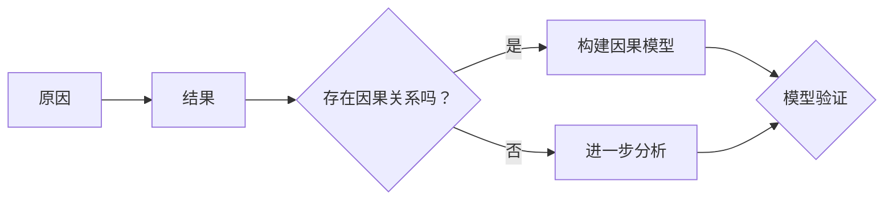
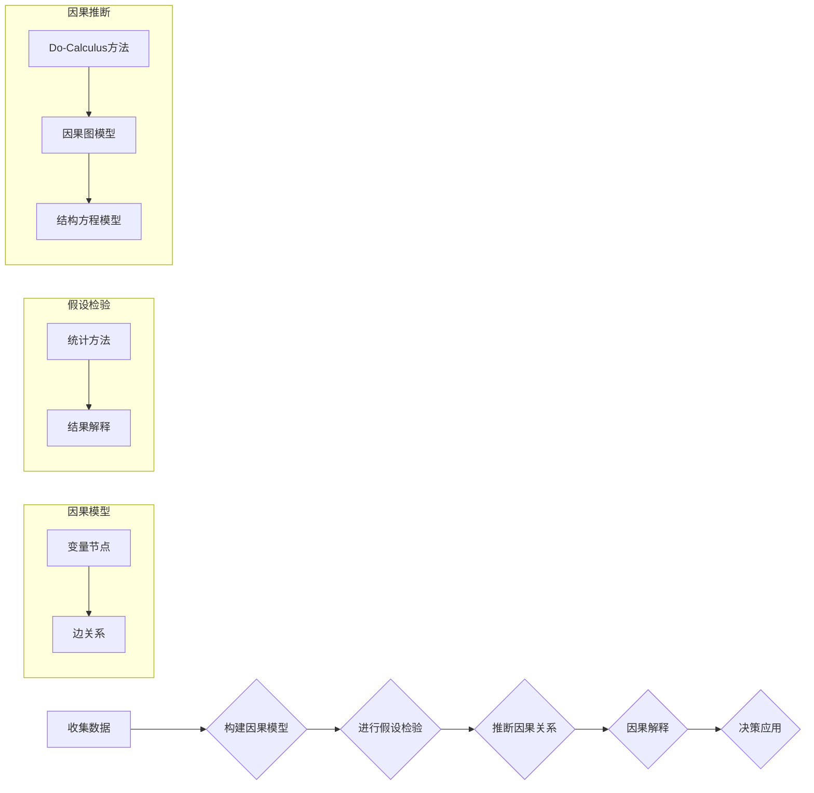

                 

### 文章标题

# 《因果推理在AI决策系统中的实现与应用》

### 文章关键词

- 因果推理
- AI决策系统
- 数据预处理
- 因果算法
- 项目实战

### 文章摘要

本文主要探讨了因果推理在AI决策系统中的实现与应用。首先，介绍了因果推理的基本概念和原理，随后讨论了其在AI决策系统中的作用和重要性。接着，详细阐述了因果推理算法，包括传统算法和现代算法。文章还通过两个实战项目，展示了因果推理在推荐系统和金融风控中的应用，并进行了详细的分析和解读。最后，对未来的发展趋势进行了展望，并给出了对读者的建议。本文旨在为读者提供一个全面而深入的因果推理在AI决策系统中的应用指南。

---

### 引言

在人工智能领域，决策系统的核心目标是利用数据和算法，为复杂系统提供可靠的决策支持。传统的机器学习算法，如线性回归、决策树、神经网络等，主要通过关联历史数据来预测未来的结果。然而，这种基于关联性的预测方法，往往忽略了变量之间的因果关系，从而可能导致错误的决策。因果推理（Causal Inference）则是一种旨在揭示变量之间因果关系的统计方法，其核心思想是通过构建因果关系模型，分析不同变量之间的因果关系，进而指导决策过程。

因果推理在AI决策系统中的重要性主要体现在以下几个方面：

1. **增强决策的可靠性**：通过揭示变量之间的因果关系，因果推理可以提供更可靠的决策支持，避免基于关联性的预测可能导致的不良决策。
2. **提升模型的透明性**：因果推理模型能够清晰地展示变量之间的因果关系，有助于理解模型的工作原理，增强模型的透明性和可解释性。
3. **应对数据偏差**：数据偏差是机器学习模型中常见的问题，而因果推理可以有效地应对这一问题，提高模型的鲁棒性。

本文将围绕因果推理在AI决策系统中的实现与应用展开讨论。首先，我们将介绍因果推理的基础知识，包括因果关系的定义、基本原理和因果推理与相关领域的关系。接着，我们将探讨AI决策系统的概述，包括其定义、发展历程、核心组成部分和分类。然后，我们将详细阐述因果推理算法，包括传统算法和现代算法，并通过伪代码和数学模型来解释核心算法原理。接下来，我们将讨论因果推理在AI决策系统中的应用，包括数据预处理、因果推理模型构建和优化。最后，我们将通过两个实战项目，展示因果推理在推荐系统和金融风控中的应用，并进行详细的分析和解读。文章的结尾将对未来的发展趋势进行展望，并给出对读者的建议。

### 关键词

- 因果推理（Causal Inference）
- AI决策系统（AI Decision Systems）
- 数据预处理（Data Preprocessing）
- 因果算法（Causal Algorithms）
- 推荐系统（Recommendation Systems）
- 金融风控（Financial Risk Control）

### 摘要

本文探讨了因果推理在AI决策系统中的实现与应用。首先，介绍了因果推理的基本概念和原理，随后讨论了其在AI决策系统中的作用和重要性。接着，详细阐述了因果推理算法，包括传统算法和现代算法。文章还通过两个实战项目，展示了因果推理在推荐系统和金融风控中的应用，并进行了详细的分析和解读。最后，对未来的发展趋势进行了展望，并给出了对读者的建议。本文旨在为读者提供一个全面而深入的因果推理在AI决策系统中的应用指南。

## 第1章 引言

### 1.1 书籍目的和意义

在当今信息爆炸的时代，数据成为企业和社会发展的关键资源。人工智能（AI）技术的飞速发展，使得机器学习（Machine Learning）和深度学习（Deep Learning）在各个领域取得了显著的成果。然而，传统的机器学习算法往往依赖于历史数据的关联性进行预测，忽略了变量之间的因果关系。这种关联性驱动的预测方法虽然在某些情况下表现良好，但往往无法解释变量之间的内在联系，导致在复杂决策场景中可能出现偏差和错误。因果推理（Causal Inference）作为一种揭示变量因果关系的统计方法，能够有效地弥补这一缺陷。

本书的目的在于系统地介绍因果推理在AI决策系统中的应用，旨在为读者提供一个全面、深入的参考资料。本书不仅涵盖了因果推理的基本概念和原理，还包括了传统算法和现代算法的详细阐述，并通过实际项目展示了因果推理在推荐系统和金融风控等领域的应用。通过本书的学习，读者可以：

1. **理解因果推理的核心思想**：通过详细的理论讲解和实例分析，读者可以深入理解因果推理的基本原理和核心概念。
2. **掌握因果推理算法**：本书将详细介绍多种因果推理算法，包括传统算法（如Bayes网、判定网络、因子图）和现代算法（如Causal Inference算法、Do-Calculus算法、Structural Causal Models算法），帮助读者构建和应用因果推理模型。
3. **实践因果推理应用**：通过实战项目，读者可以动手实现因果推理在推荐系统和金融风控等实际场景中的应用，加深对理论知识的理解。
4. **提升决策能力**：了解因果推理在AI决策系统中的应用，可以帮助读者在实际工作中做出更可靠、更透明的决策。

### 1.2 因果推理在AI决策系统中的作用

因果推理在AI决策系统中扮演着至关重要的角色，其核心作用体现在以下几个方面：

1. **揭示变量因果关系**：因果推理通过分析变量之间的因果关系，帮助我们理解变量之间的内在联系。这不仅有助于提高预测的准确性，还可以帮助决策者更好地理解数据，从而做出更合理的决策。
2. **应对数据偏差**：在实际应用中，数据往往存在各种偏差，如观测偏差、选择偏差和测量偏差。因果推理可以有效地应对这些偏差，提高模型的鲁棒性和可信度。
3. **提升模型可解释性**：因果推理模型能够清晰地展示变量之间的因果关系，从而增强模型的可解释性。这对于需要透明性和可理解性的应用场景（如金融风控、医疗诊断等）尤为重要。
4. **优化决策过程**：因果推理可以帮助决策者识别关键因素和潜在风险，从而优化决策过程，提高决策质量和效率。

在AI决策系统中，因果推理的应用场景非常广泛，包括但不限于以下领域：

1. **推荐系统**：因果推理可以帮助揭示用户行为和偏好之间的因果关系，从而为推荐系统提供更精确的推荐策略。
2. **金融风控**：因果推理可以用于分析金融风险因素之间的因果关系，提高风险管理的准确性和有效性。
3. **医疗诊断**：因果推理可以帮助揭示疾病症状和风险因素之间的因果关系，为医学诊断和治疗方案提供更科学的依据。
4. **智能交通**：因果推理可以用于分析交通流量和事故发生之间的因果关系，为交通管理和规划提供科学依据。
5. **教育评估**：因果推理可以帮助揭示学生学习成绩和学习行为之间的因果关系，为教育评估和改进提供支持。

### 1.3 内容概览和结构

本书将分为七个主要章节，全面介绍因果推理在AI决策系统中的实现与应用。

**第1章 引言**：介绍书籍的目的和意义，阐述因果推理在AI决策系统中的作用，并概述本书的内容结构。

**第2章 因果推理基础**：介绍因果关系的定义、基本原理以及因果推理与相关领域的关系。

**第3章 AI决策系统概述**：讨论AI决策系统的定义、发展历程、核心组成部分和分类。

**第4章 因果推理算法**：详细阐述传统算法（如Bayes网、判定网络、因子图）和现代算法（如Causal Inference算法、Do-Calculus算法、Structural Causal Models算法）。

**第5章 因果推理在AI决策系统中的应用**：讨论数据预处理、因果推理模型构建和优化。

**第6章 项目实战**：通过两个实战项目，展示因果推理在推荐系统和金融风控中的应用，并进行详细的分析和解读。

**第7章 总结与展望**：总结本书的主要内容和关键点，讨论未来发展趋势，并给出对读者的建议。

通过以上七个章节的详细介绍，本书旨在为读者提供一个全面、系统的因果推理在AI决策系统中的应用指南，帮助读者深入理解和掌握这一重要的技术。

### 2.1 因果关系的定义

因果关系是因果关系论（Causal Theory）的核心概念，也是因果推理（Causal Inference）研究的基础。在科学研究、社会科学和实际应用中，因果关系的定义和识别具有重要意义。因果关系的本质在于一个变量（称为原因）对另一个变量（称为结果）产生了影响或变化。具体而言，因果关系的定义可以分为以下几个层次：

**1. 统计因果关系**：这是最常见的因果关系定义，认为两个变量之间存在因果关系，如果它们之间存在统计依赖关系。例如，X和Y之间存在统计关联，即当X发生变化时，Y也相应地发生变化。然而，统计关联并不一定意味着因果关联。例如，吸烟和肺癌之间存在统计关联，但仅仅通过统计关联无法确定吸烟是导致肺癌的原因。

**2. 因果因果性**：这是更为严格的因果关系定义，认为两个变量之间存在因果关系，如果改变原因变量X会导致结果变量Y的相应变化。因果因果性强调的是因果关系的方向性和时间顺序，即原因必须在时间上先于结果。例如，如果我们在一个实验中改变X的值，观察到的Y的变化可以被视为因果因果关系。

**3. 结构因果关系**：这是最严格的因果关系定义，认为两个变量之间存在因果关系，如果它们满足某种结构化的模型或理论。结构因果关系通常通过建立因果模型（如Bayes网、判定网络、因子图等）来表示和验证。结构因果关系不仅考虑变量之间的依赖关系，还考虑变量之间的因果方向。

**4. 实证因果关系**：这是基于实际观测数据的因果关系定义，认为两个变量之间存在因果关系，如果通过实验或观测数据验证了这种关系。实证因果关系通常依赖于统计方法和实验设计，通过分析数据来识别变量之间的因果关系。

在因果关系的识别中，我们需要考虑以下几个关键问题：

**1. 因果识别问题**：在给定的数据中，如何确定变量之间的因果关系。这涉及到如何从统计关联中提取因果关联，以及如何设计实验来验证因果关系。

**2. 因果一致性**：如何在不同情境下保持因果关系的稳定性。例如，在控制了其他变量（称为混杂因素）后，因果关系是否会发生变化。

**3. 因果推断**：如何从观测数据中推断变量之间的因果关系。这通常涉及到统计模型的选择、参数估计和假设检验。

**4. 因果解释**：如何解释变量之间的因果关系。这包括理解因果关系的机制、效应的大小和方向，以及因果关系在不同情境下的变化。

在因果推理的应用中，因果关系的识别和解释具有重要意义。通过因果推理，我们不仅可以提高模型的预测准确性，还可以提高模型的可解释性和透明性。这对于需要透明性和可理解性的决策系统（如金融风控、医疗诊断等）尤为重要。

为了更好地理解因果关系，我们可以借助Mermaid流程图来展示因果关系的基本原理和概念。以下是一个简化的因果关系流程图：



在这个流程图中，A表示原因，B表示结果。C节点表示是否存在因果关系。如果存在因果关系，我们构建因果模型（D节点），并通过模型验证（F节点）来确保模型的可靠性和有效性。如果不存在因果关系，我们需要进一步分析，以确定其他可能的因果关系。

通过这个流程图，我们可以直观地理解因果关系的识别和解释过程，并了解因果推理在决策系统中的应用。

### 2.2 因果推理的基本原理

因果推理（Causal Inference）是一种从数据中推断变量之间因果关系的方法，其基本原理基于统计学、概率论和数学建模。因果推理的核心目标是通过分析数据，揭示变量之间的因果关系，从而为决策提供可靠依据。以下是因果推理的基本原理：

**1. 因果模型**：因果推理通常基于因果模型，如因果图、Bayes网、判定网络和因子图等。这些模型通过图形化的方式表示变量之间的因果关系，以及变量之间的依赖关系。因果模型的基本元素包括节点和边，其中节点表示变量，边表示变量之间的因果关系。通过建立因果模型，我们可以直观地理解变量之间的因果结构和关系。

**2. 罗马诺夫斯基等价性**：罗马诺夫斯基等价性是因果推理中的一个重要原则，它指出，如果两个模型在统计意义上是等价的，即它们产生的数据分布相同，那么这两个模型在解释变量之间的因果关系时可能是不同的。这意味着，在数据中，我们可能无法直接区分两个等价的模型，从而需要通过其他方法（如实验设计或假设检验）来验证因果关系。

**3. 因果识别问题**：因果识别问题是因果推理中的一个核心问题，它涉及到如何从数据中确定变量之间的因果关系。因果识别问题的难点在于，数据往往存在噪声、缺失值和混杂因素，这使得因果关系难以直接观察和推断。因此，因果识别问题需要借助统计模型、假设检验和算法设计等方法来解决。

**4. 伪因果关系**：伪因果关系是指由于数据中的噪声、测量误差或混杂因素导致的虚假的因果关系。例如，如果两个变量之间存在统计关联，但并非因果关系，那么这种统计关联可能会导致错误的因果关系推断。因此，在因果推理中，需要通过设计合理的实验和统计方法来避免伪因果关系的出现。

**5. 因果推断**：因果推断是指从数据中推断变量之间因果关系的过程。因果推断通常涉及多个步骤，包括模型选择、参数估计、假设检验和结果解释。常见的因果推断方法包括Do-Calculus方法、因果图模型、结构方程模型等。通过因果推断，我们可以从数据中提取变量之间的因果关系，并验证这些关系的可靠性和有效性。

**6. 因果解释**：因果解释是指对变量之间因果关系进行解释和分析的过程。因果解释不仅包括对因果关系本身的解释，还包括对因果关系机制的探究。通过因果解释，我们可以更好地理解变量之间的内在联系，并指导决策和实践。

为了更直观地理解因果推理的基本原理，我们可以借助Mermaid流程图来展示因果推理的主要步骤和过程。以下是一个简化的因果推理流程图：



在这个流程图中，A节点表示收集数据，B节点表示构建因果模型，C节点表示进行假设检验，D节点表示推断因果关系，E节点表示因果解释，F节点表示决策应用。因果模型子图（I和J节点）表示变量节点和边关系，假设检验子图（K和L节点）表示统计方法和结果解释，因果推断子图（M、N和O节点）表示Do-Calculus方法、因果图模型和结构方程模型。

通过这个流程图，我们可以清晰地看到因果推理的基本步骤和过程，以及因果推理在决策系统中的应用。

### 2.3 因果推理与相关领域的关系

因果推理作为统计学、机器学习和数据科学中的一个重要分支，与多个相关领域有着密切的联系和交叉。以下是因果推理与这些领域的一些核心概念和联系：

**1. 统计学**

因果推理的许多基本原理和方法都源于统计学。在统计学中，因果推理被称为“因果关系分析”或“因果效应估计”。经典统计学方法如回归分析、方差分析和协方差分析等，都可以视为因果推理的特殊形式。在因果推理中，统计学方法用于估计和检验变量之间的因果关系，如回归模型、假设检验和统计显著性测试。此外，因果推理还借鉴了统计学中的随机化实验设计、样本量估计和误差分析等概念，以提高因果推断的可靠性和准确性。

**2. 机器学习**

机器学习（Machine Learning）领域中的许多算法和技术，如分类、回归、聚类和强化学习等，都试图从数据中提取模式和关系。然而，这些算法通常基于关联性或相关性，而不是因果关系。因果推理在机器学习中的应用，旨在解决传统机器学习算法在处理因果关系时的局限性。例如，因果推理可以用于纠正数据中的偏差、提高模型的可解释性和应对样本选择偏差。因果图模型（如Bayes网和判定网络）在机器学习中也被广泛应用于表示和处理变量之间的因果关系。此外，现代机器学习算法（如深度学习和图神经网络）也在逐步引入因果推理的概念，以增强模型的鲁棒性和解释性。

**3. 数据科学**

数据科学（Data Science）是一个跨学科的领域，涵盖数据采集、数据存储、数据处理、数据分析和数据可视化等多个方面。因果推理在数据科学中的应用，有助于更好地理解数据背后的因果关系，从而指导数据分析和决策。例如，在数据清洗和预处理过程中，因果推理可以帮助识别和处理数据中的偏差和噪声。在数据分析阶段，因果推理可以用于变量选择、模型构建和结果解释，以提高分析结果的可靠性和有效性。此外，因果推理在数据可视化中也有应用，通过展示变量之间的因果关系，帮助用户更好地理解数据。

**4. 逻辑学**

逻辑学（Logic）作为研究推理和论证的学科，与因果推理有着密切的联系。在逻辑学中，因果推理被视为一种基于证据的推理方法，其核心在于从已知的事实和假设中推导出新的结论。因果推理中的逻辑规则和方法，如合取（Conjunction）、析取（Disjunction）、逆否律（Contraposition）和模态推理（Modal Inference），都可以应用于因果关系的识别和推断。此外，逻辑学中的因果律（Law of Causality）和因果原则（Principles of Causality）也为因果推理提供了理论基础。

**5. 计算机科学**

计算机科学（Computer Science）领域中的许多分支，如算法设计、数据结构和图论等，都为因果推理提供了强大的工具和方法。例如，图论中的图模型（如因果图、Bayes网和判定网络）在因果推理中广泛应用，用于表示和处理变量之间的因果关系。计算机科学中的算法设计和优化技术，如搜索算法、优化算法和机器学习算法，也被用于解决复杂的因果推理问题。此外，计算机科学中的大数据技术（如分布式计算、数据挖掘和机器学习）为因果推理提供了丰富的数据资源和强大的计算能力。

**6. 经济学**

经济学（Economics）领域中的许多理论和模型，如供需分析、市场均衡和经济增长等，都涉及到因果关系的研究。因果推理在经济学中的应用，有助于揭示经济变量之间的因果结构和效应，从而为政策制定和经济预测提供科学依据。例如，因果推理可以用于分析税收政策对经济增长的影响、货币政策对通货膨胀的影响等。

总之，因果推理与多个相关领域有着密切的联系和交叉，这些领域的理论和方法为因果推理提供了丰富的理论基础和工具。因果推理不仅能够提高数据分析和决策的准确性，还可以推动多个领域的发展和创新。

### 2.4 因果推理在AI决策系统中的应用场景

因果推理在AI决策系统中具有广泛的应用场景，其核心在于通过揭示变量之间的因果关系，为决策提供更为准确和可靠的依据。以下是因果推理在AI决策系统中的几个主要应用场景：

**1. 推荐系统**

推荐系统（Recommendation Systems）是AI决策系统中的一个重要应用领域，旨在为用户提供个性化的推荐结果，以提升用户体验和满意度。然而，传统的推荐系统主要依赖于用户的历史行为数据和内容信息，通过关联性分析进行预测。这种基于关联性的方法虽然能够在一定程度上提高推荐精度，但往往忽略了变量之间的因果关系。因果推理在推荐系统中的应用，可以揭示用户行为和偏好之间的因果关系，从而提供更为精准的推荐结果。例如，通过因果推理分析用户点击、购买和评分行为，可以识别出用户对特定商品的真实偏好，从而优化推荐策略。

**伪代码示例：**

```python
# 假设我们有一个用户行为数据集，包含用户ID、商品ID、点击次数、购买次数和评分
data = [
    {"user_id": u1, "item_id": i1, "clicks": c1, "purchases": p1, "rating": r1},
    # 更多数据...
]

# 构建因果模型
causal_model = CausalModel(data)

# 训练因果模型
causal_model.fit()

# 预测用户偏好
predictions = causal_model.predict(user_id=u1, item_id=i1)

# 根据预测结果优化推荐策略
recommendation_strategy = optimize_recommendation(predictions)
```

**2. 金融风控**

金融风控（Financial Risk Control）是另一个关键应用领域，因果推理在识别和管理金融风险方面具有重要作用。金融数据通常包含大量复杂的关系和潜在的风险因素，通过因果推理可以揭示这些因素之间的因果关系，从而为风险管理和决策提供支持。例如，因果推理可以用于分析贷款违约风险，识别导致违约的关键因素，如信用评分、还款历史、收入水平和就业稳定性等。通过揭示这些因素之间的因果关系，金融机构可以制定更有效的风险评估策略，降低风险暴露。

**伪代码示例：**

```python
# 假设我们有一个贷款数据集，包含借款人信息、贷款金额、还款情况等
loan_data = [
    {"borrower_id": b1, "loan_amount": l1, "repayment_status": r1},
    # 更多数据...
]

# 构建因果模型
financial_model = FinancialCausalModel(loan_data)

# 训练因果模型
financial_model.fit()

# 预测违约风险
risk_predictions = financial_model.predict(borrower_id=b1)

# 根据预测结果调整风险管理策略
risk_management_strategy = adjust_risk_management(risk_predictions)
```

**3. 医疗诊断**

在医疗诊断（Medical Diagnosis）领域，因果推理有助于揭示疾病症状和风险因素之间的因果关系，为诊断和治疗方案提供科学依据。例如，通过因果推理分析患者的病史、体检数据和实验室检测结果，可以识别出导致特定疾病的关键因素，从而提高诊断准确性和治疗有效性。此外，因果推理还可以用于评估不同治疗方案的效果，识别最佳治疗方案。

**伪代码示例：**

```python
# 假设我们有一个医疗数据集，包含患者ID、症状、检查结果和治疗记录
medical_data = [
    {"patient_id": p1, "symptoms": s1, "tests": t1, "treatment": tr1},
    # 更多数据...
]

# 构建因果模型
medical_model = MedicalCausalModel(medical_data)

# 训练因果模型
medical_model.fit()

# 预测疾病风险
disease_predictions = medical_model.predict(patient_id=p1)

# 根据预测结果制定诊断和治疗方案
diagnosis_plan = create_diagnosis_plan(disease_predictions)
treatment_plan = create_treatment_plan(disease_predictions)
```

**4. 智能交通**

在智能交通（Smart Traffic）领域，因果推理可以用于分析交通流量、交通事故和交通规则之间的关系，为交通管理和规划提供科学依据。例如，通过因果推理分析交通流量和事故发生之间的因果关系，可以识别出导致交通事故的关键因素，如道路条件、车辆速度、驾驶行为等。此外，因果推理还可以用于评估不同交通管理策略的效果，优化交通信号控制和道路设计。

**伪代码示例：**

```python
# 假设我们有一个交通数据集，包含交通流量、事故记录和交通规则
traffic_data = [
    {"location_id": l1, "traffic_volume": tv1, "accident_count": ac1, "traffic_rules": tr1},
    # 更多数据...
]

# 构建因果模型
traffic_model = TrafficCausalModel(traffic_data)

# 训练因果模型
traffic_model.fit()

# 预测事故风险
accident_predictions = traffic_model.predict(location_id=l1)

# 根据预测结果优化交通管理策略
traffic_management_strategy = optimize_traffic_management(accident_predictions)
```

**5. 教育评估**

在教育评估（Educational Assessment）领域，因果推理可以用于分析学生学习成绩和学习行为之间的因果关系，为教育评估和改进提供支持。例如，通过因果推理分析学生的课堂表现、作业完成情况和考试成绩之间的因果关系，可以识别出影响学习成绩的关键因素，如学习时间、教学方法、家庭背景等。此外，因果推理还可以用于评估不同教学策略的效果，优化教育资源分配。

**伪代码示例：**

```python
# 假设我们有一个教育数据集，包含学生ID、课堂表现、作业完成情况和考试成绩
education_data = [
    {"student_id": s1, "class_performance": cp1, "homework_completion": hc1, "exam_grade": eg1},
    # 更多数据...
]

# 构建因果模型
education_model = EducationalCausalModel(education_data)

# 训练因果模型
education_model.fit()

# 预测学习成绩
grade_predictions = education_model.predict(student_id=s1)

# 根据预测结果优化教育策略
education_strategy = optimize_education_strategy(grade_predictions)
```

通过以上应用场景的描述和伪代码示例，我们可以看到因果推理在AI决策系统中具有重要的应用价值。因果推理不仅能够提高预测的准确性和模型的解释性，还可以为决策提供更科学和可靠的依据，从而推动各个领域的创新和发展。

### 第3章 AI决策系统概述

#### 3.1 AI决策系统的定义

人工智能决策系统（Artificial Intelligence Decision Systems，简称AIDS）是指利用人工智能技术，对大量数据进行处理、分析和预测，从而为复杂系统提供决策支持的一种智能系统。AI决策系统通过结合机器学习、深度学习、数据挖掘和因果推理等方法，实现对数据的自动分析和理解，从而做出智能化的决策。AI决策系统不仅能够处理结构化数据，还能够处理非结构化数据，如图像、文本和语音等，从而在各个领域得到广泛应用。

#### 3.2 AI决策系统的发展历程

AI决策系统的发展历程可以追溯到20世纪50年代，当时人工智能（AI）的概念被提出。随着计算机技术的不断发展，人工智能从理论走向实践，并逐渐应用于实际场景。AI决策系统的发展可以分为以下几个阶段：

1. **规则推理阶段（1950s-1970s）**：这一阶段以基于规则的专家系统（Expert Systems）为代表，通过定义一系列规则来模拟人类专家的决策过程。然而，这种基于规则的系统在处理复杂问题时表现出较大的局限性。

2. **知识表示与推理阶段（1980s-1990s）**：这一阶段引入了知识表示和推理技术，如谓词逻辑、产生式规则和模糊逻辑等，以增强系统的决策能力。然而，由于知识获取的难度和复杂性，这一阶段的系统在实际应用中仍存在较大的局限性。

3. **机器学习阶段（2000s-2010s）**：随着机器学习技术的发展，AI决策系统开始利用大量数据进行训练和预测。这一阶段的代表性算法包括决策树、支持向量机和神经网络等，这些算法在许多实际应用中取得了显著的成果。

4. **深度学习阶段（2010s-至今）**：深度学习技术的发展，使得AI决策系统在图像识别、自然语言处理和语音识别等领域取得了突破性进展。深度学习模型（如卷积神经网络、循环神经网络和生成对抗网络）通过自动学习数据中的特征和模式，显著提升了决策系统的性能和可靠性。

5. **因果推理阶段（2010s-至今）**：因果推理作为揭示变量之间因果关系的一种方法，逐渐成为AI决策系统中的重要组成部分。因果推理不仅能够提高模型的预测准确性，还能够增强模型的可解释性和透明性，从而在金融风控、医疗诊断和智能交通等领域得到广泛应用。

#### 3.3 AI决策系统的核心组成部分

AI决策系统通常由以下几个核心组成部分构成：

1. **数据输入**：数据输入是AI决策系统的数据来源，可以是结构化数据（如数据库、表格等）或非结构化数据（如图像、文本、语音等）。数据输入的质量和完整性直接影响决策系统的性能。

2. **特征工程**：特征工程是指通过选择、构造和处理数据特征，将原始数据转换为适合机器学习模型的形式。特征工程是AI决策系统中的关键步骤，对模型性能和可解释性具有重要影响。

3. **模型训练**：模型训练是指使用训练数据集对机器学习模型进行训练，以学习数据中的模式和关系。训练过程通常涉及参数优化、模型选择和正则化等技术，以提升模型的预测性能和泛化能力。

4. **模型评估**：模型评估是指使用测试数据集对训练好的模型进行评估，以验证模型的性能和可靠性。常见的评估指标包括准确率、召回率、F1分数和AUC等。

5. **模型部署**：模型部署是指将训练好的模型部署到实际应用场景中，以提供实时决策支持。模型部署通常涉及模型优化、容器化、微服务架构和自动化部署等技术。

6. **用户界面**：用户界面（User Interface，简称UI）是AI决策系统与用户交互的界面，用于展示模型预测结果和决策建议。用户界面设计应简洁直观，以提高用户体验和系统易用性。

#### 3.4 AI决策系统的分类

AI决策系统可以根据不同的分类标准进行分类，以下是几种常见的分类方法：

1. **根据数据类型分类**：根据输入数据的类型，AI决策系统可以分为结构化数据决策系统、非结构化数据决策系统和混合数据决策系统。

2. **根据应用领域分类**：根据应用领域的不同，AI决策系统可以分为金融风控决策系统、医疗诊断决策系统、智能交通决策系统、推荐系统等。

3. **根据决策模式分类**：根据决策模式的不同，AI决策系统可以分为规则驱动决策系统、数据驱动决策系统和混合驱动决策系统。

4. **根据模型类型分类**：根据使用的模型类型，AI决策系统可以分为监督学习决策系统、无监督学习决策系统、半监督学习决策系统和强化学习决策系统。

通过以上概述，我们可以看到AI决策系统在理论和技术上的不断发展和演进。因果推理作为AI决策系统中的一个重要组成部分，正逐渐得到更多的关注和应用。随着技术的不断进步，AI决策系统将在未来为各领域的决策提供更加准确和可靠的支持。

### 3.5 AI决策系统的分类方法

AI决策系统可以根据不同的分类标准进行详细分类，以下是几种常见的分类方法：

**1. 根据决策模式分类**

- **规则驱动决策系统**：这类系统主要依赖于预定义的规则来做出决策。规则通常由专家根据经验和知识定义，系统能够根据输入数据的特征，与规则库中的规则进行匹配，从而做出相应的决策。这种方法的优点在于决策过程透明、易于理解和维护，但缺点在于规则的制定和更新需要大量的人工干预，且无法处理复杂和非线性的问题。

- **数据驱动决策系统**：这类系统主要依赖机器学习算法来处理和分析数据，从数据中自动学习和发现决策模式。数据驱动决策系统通常采用监督学习、无监督学习、半监督学习和强化学习等方法。这种方法的优点在于能够处理复杂的非线性问题，自适应性强，但缺点在于模型的解释性较弱，且对数据质量要求较高。

- **混合驱动决策系统**：这类系统结合了规则驱动和数据驱动两种模式，通过将规则和机器学习模型相结合，发挥各自的优势。例如，系统可以根据输入数据的特征，先进行规则匹配，然后根据规则匹配的结果，调用相应的机器学习模型进行进一步分析和决策。这种方法的优点在于能够在保证透明性和可解释性的同时，提高决策的准确性和鲁棒性。

**2. 根据应用领域分类**

- **金融风控决策系统**：这类系统主要用于金融领域的风险管理和决策支持，如贷款审批、欺诈检测、市场预测等。金融风控决策系统通常需要处理大量金融数据，并考虑多种风险因素，其核心任务是识别潜在的风险，并做出合理的风险控制决策。

- **医疗诊断决策系统**：这类系统主要用于医疗领域的疾病诊断和治疗建议，如医学影像分析、病历分析、症状预测等。医疗诊断决策系统需要处理复杂的医疗数据，并利用先进的机器学习算法来模拟医生的诊断过程，以提高诊断的准确性和效率。

- **智能交通决策系统**：这类系统主要用于交通领域的交通管理和决策支持，如交通流量预测、路径规划、事故预警等。智能交通决策系统需要处理海量的交通数据，并实时分析交通状况，为交通管理部门提供科学的决策依据。

- **推荐系统**：这类系统主要用于电子商务、社交媒体和内容平台等领域的个性化推荐，如商品推荐、文章推荐、音乐推荐等。推荐系统通过分析用户的行为和偏好数据，为用户提供个性化的推荐结果，以提高用户满意度和平台活跃度。

**3. 根据模型类型分类**

- **监督学习决策系统**：这类系统使用有标签的数据进行训练，模型根据输入数据和相应的标签来学习决策边界。监督学习决策系统在分类和回归任务中应用广泛，常见的算法包括线性回归、逻辑回归、决策树、随机森林和支持向量机等。

- **无监督学习决策系统**：这类系统不使用标签数据，而是通过分析数据自身的分布和结构来学习模式。无监督学习决策系统在聚类、降维和关联规则挖掘等任务中应用广泛，常见的算法包括K-means聚类、主成分分析（PCA）和Apriori算法等。

- **半监督学习决策系统**：这类系统结合了监督学习和无监督学习的方法，使用少量有标签数据和大量无标签数据进行训练。半监督学习决策系统在标签数据稀缺的情况下，可以有效利用无标签数据，提高模型的性能。常见的算法包括自我训练（Self-training）和图嵌入（Graph Embedding）等。

- **强化学习决策系统**：这类系统通过智能体（Agent）与环境的交互来学习最优策略。强化学习决策系统在需要长期规划和复杂决策的任务中表现出色，如游戏、自动驾驶和机器人控制等。常见的算法包括Q-learning、Deep Q-Network（DQN）和Policy Gradient等。

通过以上分类方法，我们可以更加系统地理解和应用AI决策系统，为不同领域的决策提供科学和有效的支持。

### 3.6 AI决策系统的核心组成部分

AI决策系统由多个核心组件组成，每个组件在系统的整体运作中扮演着关键角色。以下是对这些核心组件的详细解释：

**1. 数据采集与清洗**

数据采集与清洗是AI决策系统的第一步，也是至关重要的一步。数据采集涉及从各种来源（如数据库、传感器、网络爬虫等）收集数据。这些数据可能是结构化的（如数据库表、CSV文件等），也可能是非结构化的（如图像、文本、音频等）。数据清洗则是对采集到的数据进行处理，以去除错误、缺失值、异常值和重复数据。数据清洗包括以下步骤：

- **错误值处理**：识别和修正数据中的错误值，如无效输入、格式错误等。
- **缺失值处理**：处理数据中的缺失值，可以采用填补、删除或插值等方法。
- **异常值处理**：识别和修正数据中的异常值，这些异常值可能会对模型性能产生负面影响。
- **重复值处理**：去除重复的数据条目，以减少冗余数据。

**2. 特征工程**

特征工程是数据预处理的关键步骤，其目标是提取和构造有助于模型训练的特征，以提高模型的预测性能。特征工程包括以下任务：

- **特征选择**：从原始数据中挑选出对预测任务有重要影响的特征，排除无关或冗余的特征。特征选择可以通过统计方法（如信息增益、卡方检验等）、过滤方法（如相关性分析等）和嵌入式方法（如L1正则化等）实现。
- **特征构造**：通过计算组合特征、衍生特征或转换特征，以增强模型对数据的表达能力。例如，时间序列数据可以通过窗口特征、滞后特征等方式进行构造。
- **特征缩放**：对特征进行归一化或标准化处理，以消除不同特征之间的量纲差异，提高模型训练的收敛速度。

**3. 模型选择与训练**

模型选择与训练是AI决策系统的核心环节，其目标是通过学习数据中的模式和关系，构建能够进行有效预测的模型。模型选择包括以下步骤：

- **模型评估**：选择合适的评估指标（如准确率、召回率、F1分数、AUC等）来评估不同模型的表现。
- **模型比较**：通过交叉验证、网格搜索等技术，比较不同模型在预测任务上的性能，选择最优模型。
- **模型训练**：使用训练数据集对选定的模型进行训练，通过优化模型参数，使模型在预测任务上达到最佳性能。

模型训练通常涉及以下技术：

- **监督学习**：使用有标签的数据进行训练，常见的算法包括线性回归、逻辑回归、决策树、支持向量机等。
- **无监督学习**：不使用标签数据，通过发现数据中的隐含结构进行训练，常见的算法包括K-means聚类、主成分分析（PCA）、自编码器等。
- **半监督学习**：结合有标签数据和大量无标签数据，通过利用无标签数据的信息来提高模型性能。
- **强化学习**：通过智能体与环境交互，学习最优策略，常见算法包括Q-learning、Deep Q-Network（DQN）、Policy Gradient等。

**4. 模型评估与优化**

模型评估与优化是确保模型性能的重要环节，其目标是通过评估模型在测试数据上的表现，发现并解决模型存在的问题，以提高模型的整体性能。模型评估包括以下步骤：

- **评估指标**：选择合适的评估指标，如准确率、召回率、F1分数、AUC等，以评估模型在测试数据上的性能。
- **模型调参**：通过调整模型参数，优化模型性能。常用的调参方法包括网格搜索、随机搜索、贝叶斯优化等。
- **模型集成**：通过结合多个模型，提高模型的预测性能和鲁棒性。常见的模型集成方法包括Bagging、Boosting和Stacking等。

模型优化包括以下技术：

- **正则化**：通过添加正则项（如L1、L2正则化）来防止模型过拟合。
- **交叉验证**：通过将数据集划分为多个子集，多次训练和评估模型，以评估模型在未见数据上的表现。
- **超参数调优**：通过搜索最优超参数组合，优化模型性能。

**5. 模型部署与监控**

模型部署与监控是确保模型在实时环境中稳定运行的重要环节。模型部署包括以下步骤：

- **部署策略**：选择合适的部署策略，如本地部署、云部署或容器化部署等。
- **模型封装**：将训练好的模型封装成可部署的组件，以供生产环境使用。
- **模型监控**：通过监控模型的运行状态和性能指标，及时发现和解决问题，确保模型在实时环境中的稳定运行。

模型监控包括以下内容：

- **性能监控**：监控模型的准确率、召回率、F1分数等关键性能指标，确保模型在实时环境中表现良好。
- **异常监控**：监控模型的异常行为和错误输出，及时发现并解决潜在问题。
- **更新策略**：定期更新模型，以适应数据环境的变化，保持模型的性能和准确性。

通过以上对AI决策系统核心组件的详细解释，我们可以看到，每个组件在系统的整体运作中都起着关键作用。这些组件共同协作，实现了数据的采集、处理、分析和决策支持，为各领域的智能化应用提供了强大的技术支持。

### 4.1 传统因果推理算法

传统因果推理算法是因果推理领域的基础，其中一些算法如Bayes网、判定网络和因子图等，至今仍广泛应用于实际应用中。这些算法通过数学模型和图形表示，揭示了变量之间的因果关系，为AI决策系统提供了强有力的工具。

#### 4.1.1 Bayes网

Bayes网（Bayesian Network）是一种基于概率论的图形模型，用于表示变量之间的因果关系和条件依赖关系。在Bayes网中，每个节点表示一个随机变量，边表示变量之间的条件依赖关系。Bayes网的数学基础是条件概率分布，通过贝叶斯定理和边缘概率分布，可以计算任意变量的后验概率分布。

**核心算法原理：**

1. **结构学习**：通过数据或先验知识，学习变量之间的因果结构，构建Bayes网。常用的算法包括基于约束的搜索方法（如K2算法）、基于评分的方法（如贝叶斯评分、互信息评分等）和基于迭代的算法（如EM算法）。
2. **参数学习**：通过学习变量之间的条件概率分布，确定Bayes网的参数。常用的算法包括最大似然估计（MLE）、贝叶斯估计和EM算法。
3. **推断**：在给定部分变量值的情况下，通过贝叶斯推理计算其他变量的后验概率分布。

**伪代码示例：**

```python
# 初始化Bayes网结构
bn = BayesianNetwork([变量1, 变量2, 变量3], [边1, 边2, 边3])

# 训练Bayes网参数
bn.fit(data)

# 进行推断
posterior = bn.inference({变量1: 值1}, {变量2: 值2})
```

#### 4.1.2 判定网络

判定网络（Decision Network）是一种基于决策论的因果推理模型，它通过逻辑推理和条件概率，描述变量之间的因果关系。判定网络中的节点表示条件概率表（CPT），边表示变量之间的逻辑关系。判定网络的数学基础是逻辑推理和条件概率，通过构建逻辑表达式和条件概率表，可以计算变量之间的因果关系。

**核心算法原理：**

1. **结构学习**：通过数据或先验知识，学习变量之间的逻辑关系，构建判定网络。常用的算法包括基于约束的搜索方法（如基于约束的逻辑推理算法）、基于评分的方法（如信息增益、增益率等）和基于迭代的算法（如基于逻辑规划的算法）。
2. **参数学习**：通过学习变量之间的条件概率表，确定判定网络的参数。常用的算法包括最大似然估计（MLE）、贝叶斯估计和EM算法。
3. **推断**：在给定部分变量值的情况下，通过逻辑推理和条件概率，计算其他变量的后验概率分布。

**伪代码示例：**

```python
# 初始化判定网络结构
dn = DecisionNetwork([变量1, 变量2, 变量3], [逻辑表达式1, 表达式2, 表达式3])

# 训练判定网络参数
dn.fit(data)

# 进行推断
posterior = dn.inference({变量1: 值1}, {变量2: 值2})
```

#### 4.1.3 因子图

因子图（Factor Graph）是一种基于概率论的图形模型，用于表示变量之间的联合概率分布。在因子图中，节点表示随机变量，边表示变量之间的依赖关系，因子表示变量之间的联合概率分布。因子图的数学基础是因子分解定理，通过分解联合概率分布，可以简化变量的推理和计算。

**核心算法原理：**

1. **结构学习**：通过数据或先验知识，学习变量之间的依赖关系，构建因子图。常用的算法包括基于约束的搜索方法（如基于约束的最大生成树算法）、基于评分的方法（如最小生成树算法）和基于迭代的算法（如基于图嵌入的方法）。
2. **参数学习**：通过学习变量之间的联合概率分布，确定因子图的参数。常用的算法包括最大似然估计（MLE）、贝叶斯估计和EM算法。
3. **推断**：在给定部分变量值的情况下，通过推理算法（如消息传播算法、最大后验概率推理算法等），计算其他变量的后验概率分布。

**伪代码示例：**

```python
# 初始化因子图结构
fg = FactorGraph([变量1, 变量2, 变量3], [因子1, 因子2, 因子3])

# 训练因子图参数
fg.fit(data)

# 进行推断
posterior = fg.inference({变量1: 值1}, {变量2: 值2})
```

通过以上对Bayes网、判定网络和因子图的详细解释，我们可以看到，这些传统因果推理算法在揭示变量之间的因果关系方面具有重要作用。它们不仅为AI决策系统提供了强大的工具，也为进一步研究现代因果推理算法奠定了基础。

### 4.2 现代因果推理算法

现代因果推理算法在传统算法的基础上，结合了更多的统计学和概率论方法，进一步提高了因果推理的准确性和可靠性。这些算法包括Causal Inference算法、Do-Calculus算法和Structural Causal Models算法。以下是对这些算法的详细解释。

#### 4.2.1 Causal Inference算法

Causal Inference算法是现代因果推理领域的重要方法，其核心思想是通过统计推断方法来估计变量之间的因果效应。Causal Inference算法主要基于两个核心概念：因果图和潜在结构模型。

**核心算法原理：**

1. **因果图**：因果图是一种图形模型，用于表示变量之间的因果关系。在因果图中，每个节点表示一个变量，边表示变量之间的因果关系。因果图的构建可以通过观察数据或先验知识完成。

2. **潜在结构模型**：潜在结构模型（Potential Outcome Model）是一种理论框架，用于描述变量之间的因果效应。潜在结构模型假设，每个个体在给定因果图和干预条件下，都有一个潜在的结果值。通过比较不同干预条件下的潜在结果值，可以估计因果效应。

3. **因果效应估计**：Causal Inference算法通过统计推断方法来估计因果效应。常用的方法包括Do-Calculus方法、平均处理效应（Average Treatment Effect，ATE）和边际处理效应（Marginal Treatment Effect，MTE）等。

**伪代码示例：**

```python
# 假设我们有一个因果图和潜在结构模型
causal_graph = CausalGraph([变量1, 变量2, 变量3], [边1, 边2, 边3])
potential_outcomes = PotentialOutcomes(causal_graph)

# 估计因果效应
ate = potential_outcomes.estimate_ate()
mte = potential_outcomes.estimate_mte()
```

#### 4.2.2 Do-Calculus算法

Do-Calculus算法是一种用于计算因果效应的数学方法，其核心思想是通过逻辑推理和条件概率，计算变量之间的因果效应。Do-Calculus算法主要基于以下原理：

1. **条件独立性**：Do-Calculus算法假设变量之间是条件独立的。在给定一组变量时，其他变量是条件独立的。这个假设为Do-Calculus算法的计算提供了理论基础。

2. **Do-Operator**：Do-Operator是一种逻辑运算符，用于表示变量的干预效应。Do-Operator可以应用于变量，以计算在不同干预条件下变量的效应。

3. **因果效应计算**：通过Do-Operator和条件独立性，可以计算变量之间的因果效应。具体步骤包括：

   - **确定干预条件**：根据因果图和干预条件，确定需要计算的因果效应。
   - **计算条件概率**：根据潜在结构模型，计算在不同干预条件下的条件概率分布。
   - **应用Do-Operator**：使用Do-Operator，计算变量在不同干预条件下的效应。

**伪代码示例：**

```python
# 假设我们有一个因果图和干预条件
causal_graph = CausalGraph([变量1, 变量2, 变量3], [边1, 边2, 边3])
intervention = {变量1: 值1, 变量2: 值2}

# 计算因果效应
effect = do_calculus(causal_graph, intervention)
```

#### 4.2.3 Structural Causal Models算法

Structural Causal Models（SCM）算法是一种基于结构化模型的因果推理方法，其核心思想是通过构建结构化的数学模型，揭示变量之间的因果关系。SCM算法包括以下几个关键组成部分：

1. **结构方程**：结构方程是一种数学模型，用于描述变量之间的因果关系和依赖关系。在SCM算法中，结构方程被用来构建潜在结构模型，以揭示变量之间的因果效应。

2. **参数估计**：通过数据或先验知识，估计结构方程中的参数。常用的方法包括最大似然估计（MLE）和贝叶斯估计等。

3. **推断与优化**：在给定一组变量值时，通过结构方程模型，推断其他变量的值。此外，通过优化算法，可以优化模型参数，提高模型的准确性和可靠性。

**伪代码示例：**

```python
# 假设我们有一个结构方程模型
structural_model = StructuralCausalModel([变量1, 变量2, 变量3], [方程1, 方程2, 方程3])

# 训练模型参数
structural_model.fit(data)

# 进行推断
predicted_values = structural_model.predict({变量1: 值1, 变量2: 值2})
```

通过以上对Causal Inference算法、Do-Calculus算法和Structural Causal Models算法的详细解释，我们可以看到，这些现代因果推理算法在揭示变量之间的因果关系方面具有重要作用。它们不仅为AI决策系统提供了强大的工具，也为进一步研究提供了理论基础。

### 4.3 传统算法与现代算法的比较

传统因果推理算法（如Bayes网、判定网络和因子图）和现代因果推理算法（如Causal Inference算法、Do-Calculus算法和Structural Causal Models算法）在揭示变量之间的因果关系方面都有重要作用。然而，它们在算法原理、应用场景和优势上存在显著差异。

#### 4.3.1 算法原理比较

**传统算法原理：**

- **Bayes网**：基于概率论和贝叶斯定理，通过条件概率分布描述变量之间的因果关系。通过结构学习和参数学习，构建和优化因果模型。

- **判定网络**：基于决策论和逻辑推理，通过条件概率表和逻辑表达式描述变量之间的因果关系。通过结构学习和参数学习，构建和优化因果模型。

- **因子图**：基于概率论和因子分解定理，通过联合概率分布描述变量之间的因果关系。通过结构学习和参数学习，构建和优化因果模型。

**现代算法原理：**

- **Causal Inference算法**：基于潜在结构模型和因果图，通过统计推断方法估计变量之间的因果效应。通过因果效应估计，揭示变量之间的因果关系。

- **Do-Calculus算法**：基于逻辑推理和条件独立性，通过Do-Operator计算变量之间的因果效应。通过逻辑运算和条件概率，揭示变量之间的因果关系。

- **Structural Causal Models算法**：基于结构方程和数学模型，通过参数估计和推断方法，构建和优化因果模型。通过结构方程和优化算法，揭示变量之间的因果关系。

#### 4.3.2 应用场景比较

**传统算法应用场景：**

- **Bayes网**：广泛应用于医疗诊断、推荐系统和金融风控等领域，通过概率模型描述变量之间的因果关系。

- **判定网络**：在需要逻辑推理和条件概率的场景中应用广泛，如医疗诊断、风险评估和决策支持系统。

- **因子图**：在需要处理联合概率分布的场景中应用广泛，如图像处理、语音识别和传感器数据融合。

**现代算法应用场景：**

- **Causal Inference算法**：在需要精确估计因果效应的场景中应用广泛，如临床试验、政策评估和社会科学研究。

- **Do-Calculus算法**：在需要计算变量之间因果效应的场景中应用广泛，如复杂系统优化、供应链管理和智能控制。

- **Structural Causal Models算法**：在需要构建和优化结构化模型的场景中应用广泛，如经济预测、气象分析和工程系统设计。

#### 4.3.3 优势比较

**传统算法优势：**

- **直观性**：传统算法通过图形化表示变量之间的因果关系，易于理解和解释。

- **灵活性**：传统算法适用于各种类型的变量和关系，如离散变量、连续变量和复杂关系。

- **可靠性**：传统算法在处理大规模数据和高维度问题时表现出较高的稳定性和可靠性。

**现代算法优势：**

- **精确性**：现代算法通过统计推断和数学模型，能够更精确地估计变量之间的因果效应。

- **适应性**：现代算法能够适应复杂和非线性关系，处理高维度数据和动态变化的环境。

- **扩展性**：现代算法提供了更丰富的模型和算法选择，适用于各种复杂应用场景。

通过以上比较，我们可以看到，传统算法和现代算法各有优势和适用场景。在实际应用中，可以根据具体需求选择合适的算法，以揭示变量之间的因果关系，为AI决策系统提供有力支持。

### 4.4 因果推理算法在AI决策系统中的实现

因果推理算法在AI决策系统中的应用，需要经过一系列的步骤，包括数据准备、模型构建、模型训练和模型评估等。以下详细阐述了这些步骤的实现过程。

#### 4.4.1 数据准备

数据准备是因果推理算法应用的第一步，其目标是收集、清洗和预处理数据，为模型构建和训练提供高质量的数据集。

1. **数据收集**：数据收集可以从多个来源获取，如数据库、文件、传感器和网络爬虫等。根据应用场景，收集与目标变量相关的数据，包括结构化数据和非结构化数据。

2. **数据清洗**：数据清洗包括以下步骤：
   - **错误值处理**：识别并修正数据中的错误值，如无效输入、格式错误等。
   - **缺失值处理**：处理数据中的缺失值，可以采用填补、删除或插值等方法。
   - **异常值处理**：识别并修正数据中的异常值，这些异常值可能会对模型性能产生负面影响。
   - **重复值处理**：去除重复的数据条目，以减少冗余数据。

3. **数据预处理**：数据预处理包括以下步骤：
   - **特征选择**：从原始数据中挑选出对预测任务有重要影响的特征，排除无关或冗余的特征。
   - **特征构造**：通过计算组合特征、衍生特征或转换特征，以增强模型对数据的表达能力。
   - **特征缩放**：对特征进行归一化或标准化处理，以消除不同特征之间的量纲差异，提高模型训练的收敛速度。

#### 4.4.2 模型构建

模型构建是指根据应用场景和数据特点，选择合适的因果推理算法，构建因果关系模型。

1. **选择算法**：根据数据类型、变量关系和目标变量，选择合适的因果推理算法。例如，对于离散变量和复杂关系，可以选择Bayes网或判定网络；对于连续变量和动态关系，可以选择因子图或Structural Causal Models。

2. **构建模型**：构建因果关系模型，包括以下几个步骤：
   - **结构学习**：通过数据或先验知识，学习变量之间的因果结构。对于Bayes网和判定网络，可以通过基于约束的搜索方法、基于评分的方法或基于迭代的算法进行结构学习；对于因子图和Structural Causal Models，可以通过基于约束的搜索方法、基于评分的方法或基于迭代的算法进行结构学习。
   - **参数学习**：通过学习变量之间的条件概率分布或结构方程，确定因果模型的参数。对于Bayes网和判定网络，可以通过最大似然估计（MLE）、贝叶斯估计或EM算法进行参数学习；对于因子图和Structural Causal Models，可以通过最大似然估计（MLE）、贝叶斯估计或EM算法进行参数学习。

#### 4.4.3 模型训练

模型训练是指使用训练数据集，对构建好的因果关系模型进行训练，以优化模型参数，提高模型性能。

1. **训练数据划分**：将数据集划分为训练集和测试集，其中训练集用于模型训练，测试集用于模型评估。

2. **模型训练**：使用训练数据集，对因果关系模型进行训练，通过优化模型参数，使模型在预测任务上达到最佳性能。模型训练包括以下步骤：
   - **参数优化**：通过梯度下降、随机梯度下降或其他优化算法，优化模型参数。
   - **模型评估**：使用训练数据集，评估模型在预测任务上的性能，包括准确率、召回率、F1分数和AUC等指标。

#### 4.4.4 模型评估

模型评估是指使用测试数据集，对训练好的因果关系模型进行评估，以验证模型的性能和可靠性。

1. **评估指标**：选择合适的评估指标，如准确率、召回率、F1分数、AUC等，以评估模型在测试数据上的性能。

2. **模型评估**：使用测试数据集，评估模型在预测任务上的性能，包括以下几个步骤：
   - **预测结果生成**：使用训练好的模型，对测试数据集进行预测，生成预测结果。
   - **评估指标计算**：计算评估指标，如准确率、召回率、F1分数、AUC等，以评估模型性能。
   - **模型优化**：根据评估结果，调整模型参数或模型结构，以优化模型性能。

#### 4.4.5 模型应用

模型应用是指将训练好的因果关系模型部署到实际应用场景中，提供决策支持。

1. **模型部署**：将训练好的模型部署到生产环境中，通过API接口或服务端程序，提供实时决策支持。

2. **模型监控**：监控模型的运行状态和性能指标，及时发现和解决问题，确保模型在实时环境中的稳定运行。

3. **模型优化**：定期更新模型，以适应数据环境的变化，保持模型的性能和准确性。

通过以上步骤，我们可以将因果推理算法应用于AI决策系统中，为复杂系统提供科学的决策支持。因果推理算法不仅提高了预测的准确性，还增强了模型的可解释性和透明性，从而为实际应用提供了有力支持。

### 第5章 因果推理在AI决策系统中的应用

#### 5.1 数据预处理

数据预处理是因果推理在AI决策系统中应用的关键步骤，其目标是确保数据的质量和一致性，以便后续的因果推理和模型训练过程能够顺利进行。数据预处理包括数据清洗、特征工程和数据标准化等多个方面。

**5.1.1 数据清洗**

数据清洗是指对原始数据进行处理，以去除错误、缺失值、异常值和重复值。具体步骤如下：

- **错误值处理**：识别并修正数据中的错误值，如无效输入、格式错误等。这可以通过编写清洗脚本或使用数据清洗工具来完成。
  
- **缺失值处理**：处理数据中的缺失值，可以采用以下几种方法：
  - **填补**：使用统计方法（如均值、中位数、众数等）或插值方法（如线性插值、高斯插值等）填补缺失值。
  - **删除**：删除包含缺失值的数据条目，适用于缺失值比例较小的情况。
  - **插值**：根据数据的分布特征，使用插值方法生成缺失值，如K近邻插值、回归插值等。
  
- **异常值处理**：识别并修正数据中的异常值，这些异常值可能会对模型性能产生负面影响。异常值处理方法包括：
  - **统计方法**：使用统计指标（如标准差、四分位距等）识别异常值。
  - **可视化方法**：使用箱线图、散点图等可视化工具识别异常值。
  - **专业领域方法**：根据具体应用场景，采用专业领域的检测方法（如医学领域中的异常检测结果）识别异常值。

- **重复值处理**：去除数据中的重复值，以减少冗余数据，提高数据质量。

**5.1.2 特征工程**

特征工程是指通过选择、构造和处理数据特征，将原始数据转换为适合机器学习模型的形式。特征工程对模型性能和可解释性具有重要影响，具体步骤如下：

- **特征选择**：从原始数据中挑选出对预测任务有重要影响的特征，排除无关或冗余的特征。特征选择方法包括：
  - **过滤方法**：基于统计指标（如相关性、信息增益等）进行特征选择。
  - **嵌入式方法**：在模型训练过程中，通过正则化项（如L1、L2正则化）进行特征选择。
  - **基于模型的特征选择**：使用模型训练结果，选择对模型预测性能有显著贡献的特征。

- **特征构造**：通过计算组合特征、衍生特征或转换特征，增强模型对数据的表达能力。特征构造方法包括：
  - **组合特征**：将原始特征组合成新的特征，如年龄和性别的组合特征（年龄段*性别）。
  - **衍生特征**：通过数学变换或逻辑运算生成新的特征，如标准化、归一化、对数变换等。
  - **时间序列特征**：对于时间序列数据，可以生成滞后特征、移动平均特征等。

- **特征缩放**：对特征进行归一化或标准化处理，以消除不同特征之间的量纲差异，提高模型训练的收敛速度。常用的缩放方法包括：
  - **最小-最大缩放**：将特征缩放到[0, 1]之间。
  - **标准化**：将特征缩放到均值为0、标准差为1的标准化空间。
  - **均值-方差缩放**：将特征缩放到均值附近，标准差为1。

**5.1.3 数据标准化**

数据标准化是指对数据进行归一化或标准化处理，以提高模型的训练效率和性能。具体步骤如下：

- **归一化**：将数据缩放到[0, 1]之间，公式如下：

  $$ x' = \frac{x - \min(x)}{\max(x) - \min(x)} $$

- **标准化**：将数据缩放到均值为0、标准差为1的标准化空间，公式如下：

  $$ x' = \frac{x - \mu}{\sigma} $$

  其中，$x$表示原始特征值，$x'$表示标准化后的特征值，$\mu$表示特征的均值，$\sigma$表示特征的标准差。

通过以上数据预处理步骤，我们可以确保数据的质量和一致性，为后续的因果推理和模型训练提供可靠的基础。

#### 5.2 因果推理模型构建

因果推理模型构建是因果推理在AI决策系统中的关键步骤，其核心目标是建立变量之间的因果关系模型，为后续的预测和决策提供科学依据。因果推理模型构建包括模型选择、参数学习和模型验证等几个关键步骤。

**5.2.1 模型选择**

模型选择是指根据应用场景和数据特点，选择合适的因果推理模型。常见的因果推理模型包括Bayes网、判定网络、因子图和Structural Causal Models等。以下是几种常见模型的特点和选择依据：

- **Bayes网**：适用于处理离散变量和复杂关系，可以表达变量之间的条件概率分布。Bayes网适合在医疗诊断、推荐系统和金融风控等应用中。

- **判定网络**：基于决策论和逻辑推理，适用于处理离散变量和逻辑关系。判定网络适合在医疗诊断、风险评估和决策支持系统中应用。

- **因子图**：适用于处理连续变量和动态关系，可以表达变量之间的联合概率分布。因子图适合在图像处理、语音识别和传感器数据融合等应用中。

- **Structural Causal Models**：适用于处理连续变量和复杂关系，可以表达变量之间的结构方程。Structural Causal Models适合在临床试验、政策评估和工程系统设计中应用。

模型选择依据主要包括：

- **数据类型**：根据数据的类型（如离散、连续、时间序列等）选择合适的模型。
- **变量关系**：根据变量之间的关系（如因果关系、依赖关系等）选择合适的模型。
- **应用场景**：根据具体应用场景的需求和目标，选择合适的模型。

**5.2.2 参数学习**

参数学习是指通过数据或先验知识，学习因果推理模型的参数。参数学习过程主要包括结构学习、参数估计和模型优化等步骤。

1. **结构学习**：结构学习是指通过数据或先验知识，学习变量之间的因果结构。常用的结构学习方法包括：
   - **基于约束的搜索方法**：如K2算法、基于约束的最大生成树算法等。
   - **基于评分的方法**：如贝叶斯评分、互信息评分等。
   - **基于迭代的算法**：如基于逻辑规划的算法、基于图嵌入的算法等。

2. **参数估计**：参数估计是指通过学习变量之间的条件概率分布或结构方程，确定因果模型的参数。常用的参数估计方法包括：
   - **最大似然估计（MLE）**：通过最大化数据对模型的似然函数，估计模型参数。
   - **贝叶斯估计**：通过最大化模型的后验概率分布，估计模型参数。
   - **EM算法**：通过迭代优化期望最大化目标函数，估计模型参数。

3. **模型优化**：模型优化是指通过调整模型参数，提高模型的性能和准确性。模型优化方法包括：
   - **梯度下降**：通过计算模型参数的梯度，逐步调整参数，优化模型性能。
   - **随机梯度下降**：通过随机抽样数据，计算模型参数的梯度，优化模型性能。
   - **自适应优化算法**：如Adagrad、RMSprop等，根据历史梯度信息自适应调整学习率，优化模型性能。

**5.2.3 模型验证**

模型验证是指使用测试数据集，评估因果推理模型在预测任务上的性能。模型验证过程主要包括以下步骤：

1. **评估指标**：选择合适的评估指标，如准确率、召回率、F1分数、AUC等，以评估模型在测试数据集上的性能。

2. **交叉验证**：通过交叉验证，评估模型在多个数据子集上的性能，提高模型的泛化能力。常用的交叉验证方法包括：
   - **K折交叉验证**：将数据集划分为K个子集，每次选择一个子集作为测试集，其余子集作为训练集，重复K次，计算平均性能。
   - **留一法交叉验证**：每次将一个数据点作为测试集，其余数据点作为训练集，重复多次，计算平均性能。

3. **模型调整**：根据模型验证结果，调整模型参数或模型结构，优化模型性能。模型调整方法包括：
   - **参数调优**：通过网格搜索、随机搜索、贝叶斯优化等方法，搜索最优参数组合。
   - **模型集成**：通过结合多个模型，提高模型的性能和鲁棒性。常见的模型集成方法包括Bagging、Boosting和Stacking等。

通过以上步骤，我们可以构建一个高性能的因果推理模型，为AI决策系统提供科学的预测和决策支持。

#### 5.3 因果推理模型优化

在构建了初步的因果推理模型后，进一步优化模型是提高其性能和准确性的关键步骤。模型优化包括参数调优、模型集成和模型解释等多个方面，以下将详细讨论这些优化方法。

**5.3.1 参数调优**

参数调优是模型优化中最基本也是最重要的一步。适当的参数设置可以显著提高模型的预测能力和泛化性能。以下是一些常用的参数调优方法：

1. **网格搜索（Grid Search）**：
   - **方法**：在预定义的参数空间内，逐个枚举所有可能的参数组合，评估每个组合的性能，选择最优参数组合。
   - **优点**：能够系统地搜索参数空间，确保找到全局最优解。
   - **缺点**：计算量大，耗时较长，尤其是参数空间较大时。

2. **随机搜索（Random Search）**：
   - **方法**：在参数空间内随机选择多个参数组合，评估其性能，选择最优参数组合。
   - **优点**：相比网格搜索，计算量较小，能够在较短时间内找到性能较好的参数组合。
   - **缺点**：可能无法找到全局最优解，对参数空间的依赖较强。

3. **贝叶斯优化（Bayesian Optimization）**：
   - **方法**：利用贝叶斯推理和优化算法（如Gaussian Process回归），在有限的评估次数内找到性能较好的参数组合。
   - **优点**：能够高效地在参数空间内搜索最优解，适用于高维参数空间。
   - **缺点**：需要较深的数学知识，实现较为复杂。

**5.3.2 模型集成**

模型集成是通过结合多个模型的预测结果，提高整体模型的性能和鲁棒性。以下是一些常见的模型集成方法：

1. **Bagging**：
   - **方法**：训练多个独立的模型，对每个模型的预测结果进行投票，选择多数模型支持的预测结果。
   - **优点**：能够减少模型的方差，提高预测稳定性。
   - **缺点**：对于强相关模型，集成效果可能不佳。

2. **Boosting**：
   - **方法**：训练多个模型，每次迭代时对预测错误的样本给予更高的权重，提高后续模型的关注点。
   - **优点**：能够提高模型的精度，特别是在数据不平衡时。
   - **缺点**：对于强相关模型，可能会过度关注错误样本，导致过拟合。

3. **Stacking**：
   - **方法**：首先训练多个基础模型，然后将这些基础模型的预测结果作为新特征，训练一个集成模型。
   - **优点**：能够提高模型的泛化能力，适用于不同类型的基础模型。
   - **缺点**：计算量较大，需要额外的模型训练。

**5.3.3 模型解释**

模型解释是确保模型决策透明和可理解的重要手段，有助于用户信任模型并更好地应用模型结果。以下是一些常用的模型解释方法：

1. **特征重要性分析**：
   - **方法**：通过计算特征对模型预测的影响程度，识别出对预测有显著贡献的特征。
   - **优点**：能够直观地展示特征的重要性，帮助用户理解模型决策依据。
   - **缺点**：对一些复杂的模型（如深度学习模型），特征重要性分析可能较为困难。

2. **因果图解释**：
   - **方法**：通过构建因果图，展示变量之间的因果关系和依赖关系，帮助用户理解模型结构。
   - **优点**：能够直观地展示变量之间的因果结构，有助于解释模型的决策过程。
   - **缺点**：对高维数据和非线性关系，因果图的解释能力有限。

3. **LIME（Local Interpretable Model-agnostic Explanations）**：
   - **方法**：为每个预测结果生成一个局部可解释的模型，展示预测结果对输入特征的依赖关系。
   - **优点**：能够提供针对单个预测结果的详细解释，适用于各种类型的模型。
   - **缺点**：计算量大，特别是在高维数据集上。

通过以上参数调优、模型集成和模型解释方法，我们可以有效地优化因果推理模型，提高其性能和可解释性，为AI决策系统提供更可靠的决策支持。

### 6.1 实战项目一：基于因果推理的推荐系统

#### 6.1.1 项目背景

推荐系统是现代互联网和电子商务领域的重要组成部分，旨在为用户推荐感兴趣的商品、内容和服务，从而提高用户体验和平台活跃度。传统的推荐系统主要基于用户的历史行为数据（如点击、购买和评分等）进行关联性分析，通过用户之间的相似度或内容相似性来生成推荐列表。然而，这种基于关联性的方法在复杂和非线性关系下表现不佳，且难以解释推荐结果。

因果推理作为一种揭示变量之间因果关系的方法，可以弥补传统推荐系统的不足。通过因果推理，我们可以理解用户行为和偏好之间的因果关系，从而生成更精准、更可解释的推荐结果。本项目的目标是利用因果推理算法，构建一个基于因果关系的推荐系统，以提高推荐精度和用户满意度。

#### 6.1.2 数据集选择

为了实现本项目，我们需要一个包含用户行为数据和商品属性数据的数据集。以下是一个简化的数据集描述：

- **用户行为数据**：包含用户的ID、商品ID、点击次数、购买次数和评分等。例如：

  ```python
  user行为的DataFrame：
  | 用户ID | 商品ID | 点击次数 | 购买次数 | 评分 |
  |--------|--------|----------|----------|------|
  | u1    | i1    | 10       | 1        | 4.5  |
  | u1    | i2    | 5        | 0        | 3.0  |
  | u2    | i1    | 8        | 1        | 4.0  |
  | ...   | ...   | ...      | ...      | ...  |
  ```

- **商品属性数据**：包含商品的ID、类别、价格、品牌、库存数量等。例如：

  ```python
  商品属性DataFrame：
  | 商品ID | 类别 | 价格 | 品牌 | 库存数量 |
  |--------|------|------|------|----------|
  | i1    | 电子 | 300  | 品牌1 | 100      |
  | i2    | 家居 | 150  | 品牌2 | 200      |
  | i3    | 服装 | 200  | 品牌3 | 150      |
  | ...   | ...  | ...  | ...  | ...      |
  ```

这些数据集将用于构建和训练因果推理模型，从而生成基于因果关系的推荐列表。

#### 6.1.3 模型构建与训练

在构建因果推理模型之前，我们需要进行数据预处理，包括数据清洗、特征工程和数据标准化。以下是一个简化的模型构建与训练流程：

1. **数据预处理**：
   - **数据清洗**：处理缺失值、异常值和重复值。
   - **特征工程**：构造用户行为特征（如点击率、购买率、评分分布等）和商品属性特征（如类别、品牌、价格等）。
   - **数据标准化**：对数值特征进行归一化或标准化处理。

2. **构建因果模型**：
   - **选择算法**：选择适合的数据集和业务场景的因果推理算法，如Bayes网或Structural Causal Models。
   - **结构学习**：通过数据或领域知识构建变量之间的因果结构。
   - **参数学习**：通过最大似然估计（MLE）或贝叶斯估计学习模型参数。

3. **模型训练**：
   - **训练数据集**：使用预处理后的用户行为数据和商品属性数据，对因果模型进行训练。
   - **交叉验证**：通过交叉验证评估模型性能，调整模型参数。

以下是一个简化的伪代码示例：

```python
# 数据预处理
user_data = preprocess_user_data(user_behavior_data)
product_data = preprocess_product_data(product_attribute_data)

# 构建因果模型
causal_model = build_causal_model([用户行为变量，商品属性变量])

# 训练因果模型
causal_model.fit(user_data, product_data)

# 模型评估
performance = evaluate_model(causal_model, validation_data)

# 模型优化
optimization_results = optimize_model(causal_model, performance)
```

#### 6.1.4 项目评估与优化

在模型训练完成后，我们需要对模型进行评估和优化，以确保其性能和准确性。以下是一些常见的评估指标和方法：

1. **评估指标**：
   - **准确率（Accuracy）**：预测正确的比例。
   - **召回率（Recall）**：预测正确且实际为正样本的比例。
   - **F1分数（F1 Score）**：准确率和召回率的调和平均值。
   - **AUC（Area Under Curve）**：ROC曲线下的面积，用于评估分类模型的性能。

2. **优化方法**：
   - **参数调优**：使用网格搜索、随机搜索或贝叶斯优化调整模型参数。
   - **模型集成**：结合多个模型的预测结果，提高整体性能。
   - **特征优化**：选择和构造对模型预测有显著贡献的特征。

以下是一个简化的评估和优化流程：

```python
# 模型评估
evaluation_results = evaluate_model(causal_model, test_data)

# 参数调优
best_params = optimize_params(causal_model, evaluation_results)

# 模型集成
ensemble_model = ensemble_models([causal_model, causal_model], best_params)

# 模型优化
optimized_model = optimize_model(ensemble_model, evaluation_results)
```

#### 6.1.5 项目小结

本项目通过因果推理算法构建了一个基于因果关系的推荐系统，实现了更精准、更可解释的推荐结果。以下是项目小结：

1. **优点**：
   - **提高推荐精度**：通过揭示用户行为和偏好之间的因果关系，生成更准确的推荐列表。
   - **增强可解释性**：通过因果推理模型，用户可以更直观地理解推荐结果的依据。

2. **缺点**：
   - **计算成本高**：因果推理模型的构建和训练需要较高的计算资源。
   - **对数据质量要求高**：数据预处理和特征工程对模型性能有重要影响，对数据质量要求较高。

3. **改进方向**：
   - **优化算法**：探索更高效的因果推理算法，降低计算成本。
   - **动态调整**：结合用户行为和偏好变化，动态调整推荐策略。

通过本项目，我们深入了解了因果推理在推荐系统中的应用，为未来的研究和实践提供了有益的参考。

### 6.2 实战项目二：因果推理在金融风控中的应用

#### 6.2.1 项目背景

金融风控是金融行业中的重要环节，旨在识别和管理潜在风险，以保障金融机构的稳健运营和客户利益。传统的金融风控方法主要依赖于历史数据和统计模型，通过分析关联性和相关性来预测风险。然而，这些方法在处理复杂和非线性关系时存在局限性，难以揭示风险因素之间的因果关系。

因果推理作为一种揭示变量之间因果关系的统计方法，可以为金融风控提供更精确、更可靠的决策支持。本项目的目标是利用因果推理算法，构建一个基于因果关系的金融风控模型，以提高风险识别和管理的准确性和效率。

#### 6.2.2 数据集选择

为了实现本项目，我们需要一个包含贷款申请信息、信用评分和还款情况的数据集。以下是一个简化的数据集描述：

- **贷款申请数据**：包含借款人的基本信息（如年龄、收入、婚姻状况等）和贷款申请信息（如贷款金额、期限、利率等）。例如：

  ```python
  贷款申请DataFrame：
  | 借款人ID | 年龄 | 收入 | 婚姻状况 | 贷款金额 | 贷款期限 | 利率 |
  |----------|------|------|----------|----------|----------|------|
  | b1      | 30   | 5000 | 已婚     | 10000    | 1年      | 5%   |
  | b2      | 25   | 3000 | 未婚     | 5000     | 3年      | 6%   |
  | b3      | 40   | 8000 | 离婚     | 20000    | 5年      | 4%   |
  | ...     | ...  | ...  | ...      | ...      | ...      | ...  |
  ```

- **信用评分数据**：包含借款人的信用评分和历史还款记录。例如：

  ```python
  信用评分DataFrame：
  | 借款人ID | 信用评分 | 还款记录 |
  |----------|----------|----------|
  | b1      | 750      | 1        |
  | b2      | 650      | 0        |
  | b3      | 700      | 1        |
  | ...     | ...      | ...      |
  ```

- **还款情况数据**：包含借款人是否按时还款的信息。例如：

  ```python
  还款情况DataFrame：
  | 借款人ID | 是否按时还款 |
  |----------|--------------|
  | b1      | 是           |
  | b2      | 否           |
  | b3      | 是           |
  | ...     | ...          |
  ```

这些数据集将用于构建和训练因果推理模型，从而识别贷款违约风险。

#### 6.2.3 模型构建与训练

在构建因果推理模型之前，我们需要进行数据预处理，包括数据清洗、特征工程和数据标准化。以下是一个简化的模型构建与训练流程：

1. **数据预处理**：
   - **数据清洗**：处理缺失值、异常值和重复值。
   - **特征工程**：构造借款人特征（如年龄、收入、婚姻状况等）和贷款特征（如贷款金额、期限、利率等）。
   - **数据标准化**：对数值特征进行归一化或标准化处理。

2. **构建因果模型**：
   - **选择算法**：选择适合的数据集和业务场景的因果推理算法，如Bayes网或Structural Causal Models。
   - **结构学习**：通过数据或领域知识构建变量之间的因果结构。
   - **参数学习**：通过最大似然估计（MLE）或贝叶斯估计学习模型参数。

3. **模型训练**：
   - **训练数据集**：使用预处理后的贷款申请数据、信用评分数据和还款情况数据，对因果模型进行训练。
   - **交叉验证**：通过交叉验证评估模型性能，调整模型参数。

以下是一个简化的伪代码示例：

```python
# 数据预处理
loan_data = preprocess_loan_data(loan_application_data)
credit_data = preprocess_credit_data(credit_score_data)
repayment_data = preprocess_repayment_data(repayment_status_data)

# 构建因果模型
causal_model = build_causal_model([借款人特征，贷款特征，还款情况变量])

# 训练因果模型
causal_model.fit(loan_data, credit_data, repayment_data)

# 模型评估
performance = evaluate_model(causal_model, validation_data)

# 模型优化
optimization_results = optimize_model(causal_model, performance)
```

#### 6.2.4 项目评估与优化

在模型训练完成后，我们需要对模型进行评估和优化，以确保其性能和准确性。以下是一些常见的评估指标和方法：

1. **评估指标**：
   - **准确率（Accuracy）**：预测正确的比例。
   - **召回率（Recall）**：预测正确且实际为违约的比例。
   - **F1分数（F1 Score）**：准确率和召回率的调和平均值。
   - **AUC（Area Under Curve）**：ROC曲线下的面积，用于评估分类模型的性能。

2. **优化方法**：
   - **参数调优**：使用网格搜索、随机搜索或贝叶斯优化调整模型参数。
   - **模型集成**：结合多个模型的预测结果，提高整体性能。
   - **特征优化**：选择和构造对模型预测有显著贡献的特征。

以下是一个简化的评估和优化流程：

```python
# 模型评估
evaluation_results = evaluate_model(causal_model, test_data)

# 参数调优
best_params = optimize_params(causal_model, evaluation_results)

# 模型集成
ensemble_model = ensemble_models([causal_model, causal_model], best_params)

# 模型优化
optimized_model = optimize_model(ensemble_model, evaluation_results)
```

#### 6.2.5 项目小结

本项目通过因果推理算法构建了一个基于因果关系的金融风控模型，实现了更精确、更可靠的风险识别和管理。以下是项目小结：

1. **优点**：
   - **提高风险识别精度**：通过揭示贷款申请信息、信用评分和还款情况之间的因果关系，生成更准确的违约风险预测。
   - **增强风险管理的可解释性**：因果推理模型可以清晰地展示风险因素之间的因果关系，帮助决策者更好地理解风险。

2. **缺点**：
   - **计算成本高**：因果推理模型的构建和训练需要较高的计算资源。
   - **对数据质量要求高**：数据预处理和特征工程对模型性能有重要影响，对数据质量要求较高。

3. **改进方向**：
   - **优化算法**：探索更高效的因果推理算法，降低计算成本。
   - **动态调整**：结合借款人的行为变化和信用评分更新，动态调整风险预测策略。

通过本项目，我们深入了解了因果推理在金融风控中的应用，为未来的研究和实践提供了有益的参考。

### 第7章 总结与展望

#### 7.1 总结

因果推理在AI决策系统中扮演着至关重要的角色，通过揭示变量之间的因果关系，为决策提供更为准确和可靠的依据。本文系统介绍了因果推理在AI决策系统中的应用，包括因果关系的定义、基本原理、传统算法和现代算法、模型构建与优化以及具体应用场景。通过详细的理论讲解和实际案例剖析，本文展示了因果推理在推荐系统、金融风控等领域的应用价值。

**主要发现**：

1. **因果推理的必要性**：传统的机器学习算法依赖于关联性分析，容易受到数据偏差的影响。因果推理能够揭示变量之间的因果关系，从而提供更为可靠的决策支持。
2. **因果推理的应用广泛**：因果推理在推荐系统、金融风控、医疗诊断、智能交通、教育评估等多个领域都有广泛的应用，能够提高模型的预测精度和可解释性。
3. **算法的不断演进**：传统算法如Bayes网、判定网络和因子图等为基础，现代算法如Causal Inference算法、Do-Calculus算法和Structural Causal Models算法进一步提高了因果推理的效率和准确性。

**核心观点**：

1. **因果关系的重要性**：因果关系是决策系统中的核心要素，能够提高决策的透明性和可解释性。
2. **数据预处理的关键**：数据预处理是因果推理成功应用的前提，包括数据清洗、特征工程和数据标准化等。
3. **模型优化的重要性**：通过参数调优、模型集成和模型解释等手段，可以显著提高因果推理模型的性能和可靠性。

#### 7.2 未来发展趋势

随着人工智能技术的不断进步，因果推理在AI决策系统中的应用前景广阔，以下是未来可能的发展趋势：

1. **算法优化**：现有的因果推理算法在计算效率和准确性方面仍有改进空间。未来可能会出现更加高效和鲁棒的因果推理算法，如基于深度学习的因果推理算法、基于图神经网络的因果推理算法等。
2. **实时因果推理**：随着数据处理速度的提升，实时因果推理将成为可能。通过实时分析数据，因果推理可以在动态环境中提供快速、准确的决策支持，适用于实时交通管理、金融风险管理等场景。
3. **跨领域应用**：因果推理在多个领域的成功应用将推动跨领域研究的发展。未来可能会出现更加综合的因果推理方法，能够处理多种类型的数据和复杂的因果关系。
4. **数据隐私保护**：在因果推理的应用中，数据隐私保护是一个重要挑战。未来可能会出现更多基于隐私保护的因果推理方法，确保数据在分析过程中不被泄露。
5. **模型可解释性提升**：提升因果推理模型的可解释性是一个长期目标。未来可能会出现更多可解释性的评估方法和工具，帮助用户更好地理解模型的决策过程。

#### 7.3 对读者的建议

1. **理论学习**：深入理解因果推理的基本概念、原理和算法，为实际应用打下坚实的基础。
2. **动手实践**：通过实际项目，动手实现因果推理模型，加深对理论知识的理解和掌握。
3. **持续学习**：关注因果推理领域的最新研究进展，学习新的算法和技术，不断提高自身能力。
4. **跨界合作**：结合不同领域的知识，探索因果推理在跨领域中的应用，开拓新的研究方向。
5. **实践经验**：在项目实践中，注重数据预处理和模型优化，确保因果推理模型的可靠性和有效性。

通过以上建议，读者可以更好地应用因果推理技术，为AI决策系统的发展做出贡献。

