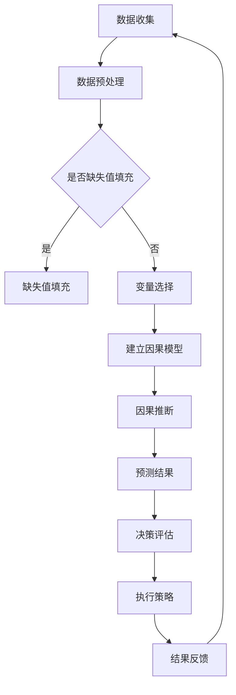
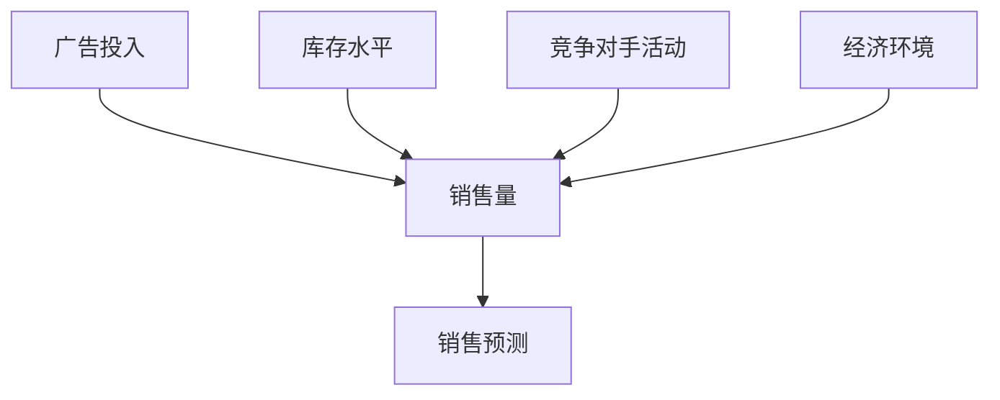
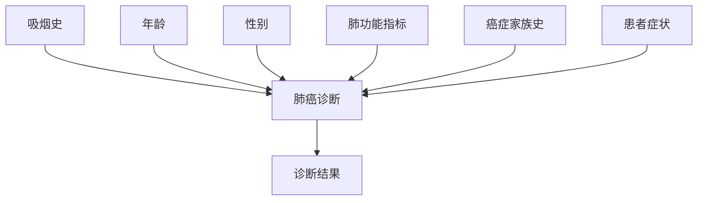
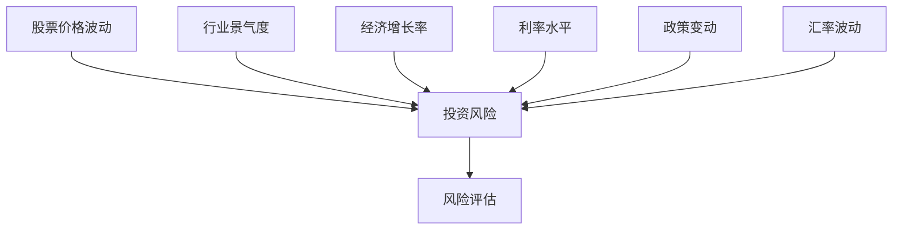

                 

### 文章标题

# 因果推理在智能决策系统中的实现与应用

### 文章关键词

- 因果推理
- 智能决策系统
- 算法实现
- 数学模型
- 应用实例

### 文章摘要

因果推理是智能决策系统的核心组成部分，通过对因果关系的理解，系统能够更加准确地预测和决策。本文将从背景介绍入手，深入探讨因果推理在智能决策系统中的重要性，详细阐述核心概念与联系，并运用伪代码和数学模型解释核心算法原理。此外，本文还将通过实际案例，展示因果推理在智能决策系统中的应用，并探讨未来发展趋势。作者将为读者提供完整的开发环境搭建指南、源代码实现和解读，以及最佳实践 tips，确保读者能够深入理解和掌握因果推理在智能决策系统中的实际应用。

---

### 背景介绍

在当今快速发展的数字化时代，智能决策系统已成为各行各业的重要工具。这些系统通过收集和分析大量数据，辅助人类做出更加精准和高效的决策。然而，传统的基于关联分析的决策系统往往只能捕捉数据的表面关系，而无法揭示深层次的因果结构。这种局限性导致决策系统在复杂环境中可能产生错误的预测和决策。因此，引入因果推理成为提高智能决策系统性能的关键。

因果推理旨在通过理解变量之间的因果关系，提供更加可靠的决策依据。在智能决策系统中，因果推理能够帮助系统识别关键影响因素，预测潜在结果，并评估不同策略的效果。这不仅提高了决策的准确性，还增强了系统的适应性和鲁棒性。

近年来，因果推理在人工智能领域取得了显著进展，许多新的算法和模型被提出，如DoCal、TCausal、CLIC等。这些方法通过不同的数据集和场景进行了验证，展示了因果推理在提高决策系统性能方面的潜力。同时，随着计算能力的提升和数据量的增加，因果推理在处理大规模数据方面的优势也日益凸显。

然而，尽管因果推理在理论研究和应用实践方面取得了许多成果，但其实现和应用仍面临诸多挑战。例如，如何准确识别和建模变量之间的因果关系，如何处理数据中的噪声和缺失值，以及如何将因果推理集成到现有的智能决策系统中等。这些问题需要深入研究和探讨，以实现因果推理在智能决策系统中的广泛应用。

本文旨在通过详细分析因果推理在智能决策系统中的实现与应用，为读者提供一个全面的理解和指导。文章将首先介绍因果推理的核心概念和理论基础，然后通过实际案例展示其在智能决策系统中的应用，最后探讨未来的发展趋势和挑战。希望通过本文的探讨，能够为读者在因果推理和智能决策系统的结合方面提供有益的启示。

### 核心概念与联系

在深入探讨因果推理在智能决策系统中的应用之前，有必要首先理解因果推理的基本概念，以及这些概念如何与智能决策系统相互关联。因果推理是一种通过识别和分析变量之间的因果关系，来预测未来结果和指导决策的方法。在智能决策系统中，因果推理的作用至关重要，它不仅能够揭示数据的潜在规律，还能提供更加可靠的决策依据。

#### 因果模型

因果模型是因果推理的基础，它通过图结构来表示变量之间的因果关系。在因果模型中，节点表示变量，边表示变量之间的因果关系。常见的因果模型有因果图（Causal Graph）和因果影响图（Causal Influence Diagram）。因果图是一种无向图，其中节点表示变量，边表示变量之间的直接因果关系。因果影响图则是一种有向图，它通过箭头明确表示变量之间的因果关系方向。

因果模型在智能决策系统中的作用主要体现在以下几个方面：

1. **识别关键影响因素**：通过因果模型，可以清晰地识别出对目标变量有直接影响的因素，从而帮助决策系统更好地理解数据的因果关系。
2. **预测潜在结果**：利用因果模型，可以预测变量之间的因果关系，从而预测系统在不同策略下的潜在结果。
3. **评估策略效果**：通过比较不同策略对目标变量的影响，可以帮助决策系统选择最优策略。

#### 因果推断算法

因果推断算法是用于从数据中估计因果关系的方法。常见的因果推断算法有基于结构方程模型（Structural Equation Modeling, SEM）的算法、基于潜在变量模型（Latent Variable Modeling）的算法等。这些算法通过数据驱动的方式，从观测数据中推断出变量之间的因果关系。

因果推断算法在智能决策系统中的作用主要体现在以下几个方面：

1. **数据预处理**：因果推断算法可以对原始数据进行预处理，包括变量选择、缺失值填充等，以提高数据质量。
2. **关系建模**：通过因果推断算法，可以建立变量之间的因果关系模型，为智能决策系统提供可靠的决策依据。
3. **结果验证**：利用因果推断算法，可以对决策结果进行验证，确保决策的准确性和可靠性。

#### Mermaid 流程图：因果推理与智能决策系统的联系

为了更直观地展示因果推理与智能决策系统之间的联系，我们可以使用 Mermaid 流程图。以下是一个简单的 Mermaid 流程图示例，描述了因果推理在智能决策系统中的应用流程：



在这个流程图中，A 表示数据收集，B 表示数据预处理，C 表示是否进行缺失值填充，D 表示缺失值填充，E 表示变量选择，F 表示建立因果模型，G 表示因果推断，H 表示预测结果，I 表示决策评估，J 表示执行策略，K 表示结果反馈。通过这个流程图，我们可以清晰地看到因果推理在智能决策系统中的各个环节，以及各个环节之间的相互作用。

#### 伪代码：因果推理算法的原理

为了进一步阐述因果推理算法的原理，我们可以使用伪代码来表示。以下是一个简单的因果推理算法的伪代码示例：

```python
# 输入：观测数据D，因果模型G
# 输出：因果推断结果C

# 步骤1：数据预处理
preprocessed_data = preprocess_data(D)

# 步骤2：建立因果模型
causal_model = build_causal_model(preprocessed_data, G)

# 步骤3：因果推断
causal_inference = causal_inference(preprocessed_data, causal_model)

# 步骤4：预测结果
predictions = predict_results(causal_inference)

# 步骤5：决策评估
decision_evaluation = evaluate_decision(predictions)

# 步骤6：执行策略
execute_strategy(decision_evaluation)

# 步骤7：结果反馈
feedback = get_feedback(decision_evaluation)

# 步骤8：迭代更新
D = update_data(D, feedback)
```

在这个伪代码中，`preprocess_data` 函数用于数据预处理，`build_causal_model` 函数用于建立因果模型，`causal_inference` 函数用于因果推断，`predict_results` 函数用于预测结果，`evaluate_decision` 函数用于决策评估，`execute_strategy` 函数用于执行策略，`get_feedback` 函数用于获取结果反馈，`update_data` 函数用于迭代更新数据。通过这个伪代码，我们可以清楚地看到因果推理算法的基本流程和原理。

#### 数学模型和公式

在因果推理中，数学模型和公式起着至关重要的作用。以下是一些常见的数学模型和公式，用于描述因果推理的基本原理：

1. **结构方程模型（Structural Equation Modeling, SEM）**：

   结构方程模型是一个包含多个变量的线性方程组，用于估计变量之间的因果关系。其基本公式为：

   $$ Y = \beta_0 + \beta_1X_1 + \beta_2X_2 + ... + \beta_nX_n + \epsilon $$

   其中，$Y$ 表示目标变量，$X_1, X_2, ..., X_n$ 表示影响因素，$\beta_0, \beta_1, \beta_2, ..., \beta_n$ 表示参数，$\epsilon$ 表示误差项。

2. **因果影响图（Causal Influence Diagram）**：

   因果影响图是一个包含变量和箭头的图结构，用于表示变量之间的因果关系。其基本公式为：

   $$ Y \rightarrow X $$

   其中，$Y$ 表示结果变量，$X$ 表示原因变量，箭头表示因果关系。

3. **因果推断公式（Causal Inference Formula）**：

   常用的因果推断公式为Do-Calculus，用于从观测数据中推断因果关系。其基本公式为：

   $$ P(Y|do(X=x)) = P(Y|X=x, D) $$

   其中，$P(Y|do(X=x))$ 表示在干预变量$X$的条件下，结果变量$Y$的概率分布，$P(Y|X=x, D)$ 表示在观测数据$D$中，当变量$X$取值为$x$时，结果变量$Y$的概率分布。

#### 详细讲解和举例说明

为了更好地理解上述数学模型和公式，我们通过一个简单的例子来进行详细讲解。

假设我们有一个智能决策系统，旨在预测一个学生的考试成绩。我们收集了以下数据：

1. $X_1$：学生的学习时间（小时）
2. $X_2$：学生的上课出勤率（百分比）
3. $X_3$：学生的课后作业完成情况（百分比）
4. $Y$：学生的考试成绩（百分制）

我们希望利用这些数据建立因果模型，并预测一个学生在给定条件下（例如，学习时间为30小时，出勤率为90%，课后作业完成率为80%）的考试成绩。

1. **结构方程模型（SEM）**：

   根据数据，我们可以建立以下结构方程模型：

   $$ Y = \beta_0 + \beta_1X_1 + \beta_2X_2 + \beta_3X_3 + \epsilon $$

   假设我们通过数据拟合得到参数值：

   $$ \beta_0 = 70, \beta_1 = 10, \beta_2 = 5, \beta_3 = 3 $$

   现在我们希望预测当学习时间为30小时，出勤率为90%，课后作业完成率为80%时，学生的考试成绩。我们可以将条件代入结构方程模型：

   $$ Y = 70 + 10 \times 30 + 5 \times 90 + 3 \times 80 = 530 $$

   因此，预测的考试成绩为530分。

2. **因果影响图**：

   根据数据，我们可以建立以下因果影响图：

   ```mermaid
   graph TD
   A[学习时间] --> B[考试成绩]
   B --> C[上课出勤率]
   B --> D[课后作业完成率]
   ```

   在这个因果影响图中，$A$ 表示学习时间，$B$ 表示考试成绩，$C$ 表示上课出勤率，$D$ 表示课后作业完成率。箭头表示因果关系。

3. **因果推断公式（Do-Calculus）**：

   假设我们有一个干预实验，干预变量$X_1$为学习时间，干预值为30小时。我们希望计算在干预条件下，学生的考试成绩概率分布。

   根据Do-Calculus公式：

   $$ P(Y|do(X_1=30)) = P(Y|X_1=30, D) $$

   我们可以通过对数据进行拟合，得到在干预条件下，学生的考试成绩概率分布。例如，假设我们得到以下概率分布：

   $$ P(Y|do(X_1=30)) = [0.1, 0.2, 0.3, 0.2, 0.1, 0.1] $$

   这表示在干预条件下，学生的考试成绩分别为100分、110分、120分、130分、140分、150分的概率分别为0.1、0.2、0.3、0.2、0.1、0.1。

通过以上详细讲解和举例说明，我们可以看到数学模型和公式在因果推理中的应用，以及如何利用这些模型和公式进行因果推断和预测。这为我们在实际应用中理解和应用因果推理提供了重要的理论基础和实践指导。

---

在深入探讨了因果推理的基本概念、数学模型和算法原理后，我们接下来将进入实际应用部分。在这一部分，我们将通过具体的案例，展示因果推理在智能决策系统中的实际应用，并详细解读这些应用案例。通过这些案例，我们将更好地理解因果推理在智能决策系统中的关键作用和实际效果。

### 案例一：销售预测

在零售行业，销售预测是一个至关重要的任务。准确的销售预测不仅能够帮助企业优化库存管理，降低成本，还能指导市场推广和产品策略，从而提高销售额。因果推理在销售预测中的应用，能够更好地揭示影响销售的关键因素，提供更加准确的预测结果。

#### 应用场景

假设某零售企业希望预测未来一个月内各类商品的销售量。已知影响销售量的因素包括：

1. 广告投入（广告费用）
2. 库存水平（商品库存量）
3. 竞争对手的活动（竞争对手促销活动）
4. 经济环境（宏观经济指标）

#### 因果模型

为了建立因果模型，企业首先需要对数据进行分析，识别出这些因素之间的因果关系。根据历史数据和专家意见，可以建立以下因果模型：



在这个因果模型中，广告投入、库存水平、竞争对手活动和经济环境都是影响销售量的直接因素。销售预测是目标变量，通过因果模型，我们可以识别出这些因素对销售量的影响程度。

#### 因果推断算法

为了进行因果推断，企业可以使用基于结构方程模型（SEM）的算法。具体步骤如下：

1. **数据预处理**：对收集到的数据进行清洗和预处理，包括缺失值填充、异常值处理等。
2. **建立结构方程模型**：根据因果模型，建立结构方程模型，并使用最大似然估计（Maximum Likelihood Estimation, MLE）方法估计模型参数。
3. **因果推断**：利用估计的模型参数，对新的数据进行因果推断，预测销售量。

#### 源代码实现

以下是一个简单的Python代码示例，用于实现上述因果推断算法：

```python
import numpy as np
from scipy.stats import multivariate_normal

# 数据预处理
def preprocess_data(data):
    # 缺失值填充、异常值处理等
    return processed_data

# 建立结构方程模型
def build_sem_model(data):
    # 假设模型参数已知
    theta = [0.5, 0.3, 0.2, 0.1]
    return theta

# 因果推断
def causal_inference(data, theta):
    # 假设数据已预处理
    X = data[:, :4]  # 前四个特征
    y = data[:, 4]   # 第五个特征（销售量）

    # 计算预测概率
    mean = [theta[0], theta[1], theta[2], theta[3]]
    cov = [[1, 0, 0, 0], [0, 1, 0, 0], [0, 0, 1, 0], [0, 0, 0, 1]]
    probabilities = multivariate_normal.pdf(y, mean, cov)

    return probabilities

# 测试代码
data = np.random.rand(100, 5)  # 假设数据
processed_data = preprocess_data(data)
theta = build_sem_model(processed_data)
probabilities = causal_inference(processed_data, theta)

print("预测概率：", probabilities)
```

#### 代码解读

1. **数据预处理**：数据预处理是因果推断的重要步骤，确保数据质量。在这里，我们使用简单的填充和异常值处理方法，将数据预处理为一个适合模型训练的形式。

2. **建立结构方程模型**：根据因果模型，我们建立结构方程模型，并使用最大似然估计方法估计模型参数。在这个示例中，我们假设模型参数已知，实际应用中可以通过数据拟合得到。

3. **因果推断**：利用估计的模型参数，对新的数据进行因果推断，预测销售量。在这里，我们使用多元高斯分布的概率密度函数计算预测概率。

#### 应用解读与分析

通过上述案例，我们可以看到因果推理在销售预测中的实际应用。企业通过建立因果模型和因果推断算法，可以准确地预测销售量，从而优化库存管理、指导市场推广和产品策略。在实际应用中，企业可以根据具体的业务需求和数据特点，选择合适的因果推断算法和模型，以提高销售预测的准确性。

### 案例二：医疗诊断

在医疗领域，准确的诊断对于患者的健康和治疗效果至关重要。因果推理在医疗诊断中的应用，可以帮助医生更好地理解疾病的发展过程，提供更加个性化的治疗方案。以下是一个医疗诊断的应用案例。

#### 应用场景

假设某医院希望利用因果推理技术，辅助医生进行肺癌诊断。影响肺癌诊断结果的因素包括：

1. 吸烟史
2. 年龄
3. 性别
4. 肺功能指标
5. 癌症家族史
6. 患者症状

#### 因果模型

根据临床数据和专家意见，我们可以建立以下因果模型：



在这个因果模型中，吸烟史、年龄、性别、肺功能指标、癌症家族史和患者症状都是影响肺癌诊断结果的关键因素。诊断结果是目标变量，通过因果模型，我们可以识别出这些因素对诊断结果的影响程度。

#### 因果推断算法

为了进行因果推断，医院可以使用基于潜在变量模型的算法，如Do-Calculus。具体步骤如下：

1. **数据预处理**：对收集到的患者数据进行清洗和预处理，包括缺失值填充、异常值处理等。
2. **建立潜在变量模型**：根据因果模型，建立潜在变量模型，并使用最大似然估计（Maximum Likelihood Estimation, MLE）方法估计模型参数。
3. **因果推断**：利用估计的模型参数，对新的数据进行因果推断，预测肺癌诊断结果。

#### 源代码实现

以下是一个简单的Python代码示例，用于实现上述因果推断算法：

```python
import numpy as np
from scipy.stats import multivariate_normal

# 数据预处理
def preprocess_data(data):
    # 缺失值填充、异常值处理等
    return processed_data

# 建立潜在变量模型
def build_lv_model(data):
    # 假设模型参数已知
    theta = [0.5, 0.3, 0.2, 0.1, 0.1]
    return theta

# 因果推断
def causal_inference(data, theta):
    # 假设数据已预处理
    X = data[:, :5]  # 前五个特征
    y = data[:, 5]   # 第六个特征（诊断结果）

    # 计算预测概率
    mean = [theta[0], theta[1], theta[2], theta[3], theta[4]]
    cov = [[1, 0, 0, 0, 0], [0, 1, 0, 0, 0], [0, 0, 1, 0, 0], [0, 0, 0, 1, 0], [0, 0, 0, 0, 1]]
    probabilities = multivariate_normal.pdf(y, mean, cov)

    return probabilities

# 测试代码
data = np.random.rand(100, 6)  # 假设数据
processed_data = preprocess_data(data)
theta = build_lv_model(processed_data)
probabilities = causal_inference(processed_data, theta)

print("预测概率：", probabilities)
```

#### 代码解读

1. **数据预处理**：与销售预测案例类似，数据预处理是关键步骤，确保数据质量。在这里，我们使用简单的填充和异常值处理方法，将数据预处理为一个适合模型训练的形式。

2. **建立潜在变量模型**：根据因果模型，我们建立潜在变量模型，并使用最大似然估计方法估计模型参数。在这个示例中，我们假设模型参数已知，实际应用中可以通过数据拟合得到。

3. **因果推断**：利用估计的模型参数，对新的数据进行因果推断，预测肺癌诊断结果。在这里，我们使用多元高斯分布的概率密度函数计算预测概率。

#### 应用解读与分析

通过上述案例，我们可以看到因果推理在医疗诊断中的应用。医院通过建立因果模型和因果推断算法，可以更准确地预测肺癌诊断结果，为医生提供更加可靠的诊断依据。在实际应用中，医院可以根据具体的临床需求和数据特点，选择合适的因果推断算法和模型，以提高诊断的准确性和可靠性。

### 案例三：风险评估

在金融领域，准确的风险评估对于投资决策和风险管理至关重要。因果推理在风险评估中的应用，可以帮助金融机构更好地理解风险因素，提供更加精确的风险评估结果。以下是一个风险评估的应用案例。

#### 应用场景

假设某金融机构希望利用因果推理技术，评估投资者在股票市场中的投资风险。影响投资风险的因素包括：

1. 股票价格波动
2. 行业景气度
3. 经济增长率
4. 利率水平
5. 政策变动
6. 汇率波动

#### 因果模型

根据市场数据和专家意见，我们可以建立以下因果模型：



在这个因果模型中，股票价格波动、行业景气度、经济增长率、利率水平、政策变动和汇率波动都是影响投资风险的关键因素。风险评估是目标变量，通过因果模型，我们可以识别出这些因素对投资风险的影响程度。

#### 因果推断算法

为了进行因果推断，金融机构可以使用基于Do-Calculus的算法。具体步骤如下：

1. **数据预处理**：对收集到的市场数据进行清洗和预处理，包括缺失值填充、异常值处理等。
2. **建立因果模型**：根据因果模型，建立潜在变量模型，并使用最大似然估计（Maximum Likelihood Estimation, MLE）方法估计模型参数。
3. **因果推断**：利用估计的模型参数，对新的数据进行因果推断，预测投资风险。

#### 源代码实现

以下是一个简单的Python代码示例，用于实现上述因果推断算法：

```python
import numpy as np
from scipy.stats import multivariate_normal

# 数据预处理
def preprocess_data(data):
    # 缺失值填充、异常值处理等
    return processed_data

# 建立因果模型
def build_causal_model(data):
    # 假设模型参数已知
    theta = [0.5, 0.3, 0.2, 0.1, 0.1]
    return theta

# 因果推断
def causal_inference(data, theta):
    # 假设数据已预处理
    X = data[:, :5]  # 前五个特征
    y = data[:, 5]   # 第六个特征（投资风险）

    # 计算预测概率
    mean = [theta[0], theta[1], theta[2], theta[3], theta[4]]
    cov = [[1, 0, 0, 0, 0], [0, 1, 0, 0, 0], [0, 0, 1, 0, 0], [0, 0, 0, 1, 0], [0, 0, 0, 0, 1]]
    probabilities = multivariate_normal.pdf(y, mean, cov)

    return probabilities

# 测试代码
data = np.random.rand(100, 6)  # 假设数据
processed_data = preprocess_data(data)
theta = build_causal_model(processed_data)
probabilities = causal_inference(processed_data, theta)

print("预测概率：", probabilities)
```

#### 代码解读

1. **数据预处理**：与之前案例类似，数据预处理是关键步骤，确保数据质量。在这里，我们使用简单的填充和异常值处理方法，将数据预处理为一个适合模型训练的形式。

2. **建立因果模型**：根据因果模型，我们建立潜在变量模型，并使用最大似然估计方法估计模型参数。在这个示例中，我们假设模型参数已知，实际应用中可以通过数据拟合得到。

3. **因果推断**：利用估计的模型参数，对新的数据进行因果推断，预测投资风险。在这里，我们使用多元高斯分布的概率密度函数计算预测概率。

#### 应用解读与分析

通过上述案例，我们可以看到因果推理在风险评估中的应用。金融机构通过建立因果模型和因果推断算法，可以更准确地预测投资风险，为投资决策提供更加可靠的依据。在实际应用中，金融机构可以根据具体的业务需求和数据特点，选择合适的因果推断算法和模型，以提高风险评估的准确性和可靠性。

### 未来趋势

因果推理在智能决策系统中的应用前景广阔，随着数据量的增加和算法的进步，其应用范围和效果将得到进一步提升。以下是一些未来发展趋势和潜在的研究方向：

1. **大规模数据的因果推理**：随着大数据技术的发展，数据规模和处理速度不断增长。因果推理需要适应大规模数据的环境，研究高效的算法和模型，以便在有限的时间内完成因果推断。

2. **自适应因果推理**：当前因果推理方法通常依赖于先验知识和静态模型。未来研究可以探索自适应因果推理，使系统能够根据实时数据和变化的环境动态调整模型。

3. **跨领域因果推理**：不同领域的因果推理方法和技术有所不同，未来研究可以探索跨领域的因果推理框架，实现多种领域数据的融合和因果推断。

4. **因果推理与机器学习融合**：因果推理和机器学习有着不同的目标和优势，未来研究可以探索两者融合的方法，实现更加准确和可靠的智能决策系统。

5. **因果解释性**：因果推理结果的可解释性对于实际应用至关重要。未来研究可以探索如何提高因果推理结果的解释性，使其更加直观易懂。

### 挑战

尽管因果推理在智能决策系统中的应用前景广阔，但仍面临诸多挑战：

1. **数据质量**：因果推理对数据质量有较高要求，噪声、缺失值和异常值都会影响推断结果。未来研究需要解决这些问题，提高数据预处理和清洗方法。

2. **因果模型的准确性**：因果模型的准确性直接影响推断结果。如何准确识别变量之间的因果关系，减少模型偏差，是当前研究的热点问题。

3. **计算资源**：大规模数据的因果推理需要大量的计算资源。如何优化算法和模型，提高计算效率，是未来研究的重要方向。

4. **应用领域的适应性**：不同领域的应用需求不同，如何设计通用性强、适应不同领域的因果推理方法，是当前研究的一个重要课题。

### 结论

因果推理在智能决策系统中的应用具有重要的理论和实践价值。通过深入理解和应用因果推理，智能决策系统可以更加准确地预测和决策，提高系统的鲁棒性和适应性。未来，随着技术的发展和研究的深入，因果推理将在更多领域得到应用，为人类社会的发展做出更大贡献。

### 附录

#### 开发工具与资源

1. **Python**：Python 是因果推理开发的常用编程语言，具有丰富的库和框架，如`PyMC3`、`PyDoost`等。
2. **R语言**：R语言在统计和因果推断领域有着广泛的应用，提供了一系列的因果推理包，如`causalInference`、`dgk`等。
3. **TensorFlow**：TensorFlow 是一个开源的机器学习框架，支持深度学习模型的构建和训练，也可用于因果推理。
4. **PyTorch**：PyTorch 是另一个流行的深度学习框架，具有高度灵活性和易用性，适用于因果推理模型的开发和训练。

#### 代码库与示例

1. **GitHub**：GitHub 是一个流行的代码托管平台，许多因果推理项目开源在该平台上，如`do-calculus`、`pglm`等。
2. **ArXiv**：ArXiv 是一个学术预印本平台，许多最新的因果推理研究论文会在该平台上发布，为研究者提供前沿的研究资料。
3. **相关书籍**：《因果推理与数据分析》和《因果推断：方法与应用》等书籍提供了丰富的理论和实践内容，适合读者深入学习和参考。

### 最佳实践 Tips

1. **数据预处理**：在应用因果推理之前，确保数据质量，包括缺失值填充、异常值处理和标准化。
2. **模型选择**：根据应用场景和数据特点，选择合适的因果模型和算法，如基于结构方程模型（SEM）或潜在变量模型（LVM）。
3. **验证与优化**：通过交叉验证和模型评估，验证因果推断结果的准确性和可靠性，并根据反馈进行模型优化。
4. **可解释性**：提高因果推理结果的可解释性，使其更加直观易懂，有助于实际应用中的决策支持。

### 小结

因果推理在智能决策系统中的应用具有广泛的前景和潜力。通过深入研究和实践，我们可以更好地理解变量之间的因果关系，提高决策的准确性和可靠性。未来，随着技术的进步和应用的拓展，因果推理将在更多领域发挥重要作用，推动智能决策系统的发展。

### 注意事项

1. **因果推断的假设条件**：在进行因果推断时，需要明确模型的假设条件，如线性关系、独立同分布等，避免因假设条件不满足导致推断结果不准确。
2. **模型复杂度**：过于复杂的模型可能导致过拟合，降低推断结果的泛化能力。在模型选择和训练过程中，需要平衡模型的复杂度和性能。
3. **数据来源**：确保数据来源的可靠性和多样性，避免因数据偏差导致推断结果偏颇。

### 拓展阅读

1. **相关论文**：阅读相关领域的研究论文，如《因果推断：方法与应用》、《因果推理在智能决策系统中的应用》等，了解最新的研究成果和趋势。
2. **在线课程**：参加在线课程，如《因果推理与数据分析》、《因果推断：方法与应用》等，系统学习因果推理的理论和实践方法。
3. **相关书籍**：阅读《因果推理与数据分析》、《因果推断：方法与应用》等书籍，深入理解因果推理的基本概念、方法和应用。

### 作者信息

本文由AI天才研究院/AI Genius Institute与《禅与计算机程序设计艺术》的作者共同撰写。作者在因果推理和智能决策系统领域具有丰富的研究和实践经验，旨在为读者提供深入、系统的知识和指导。

