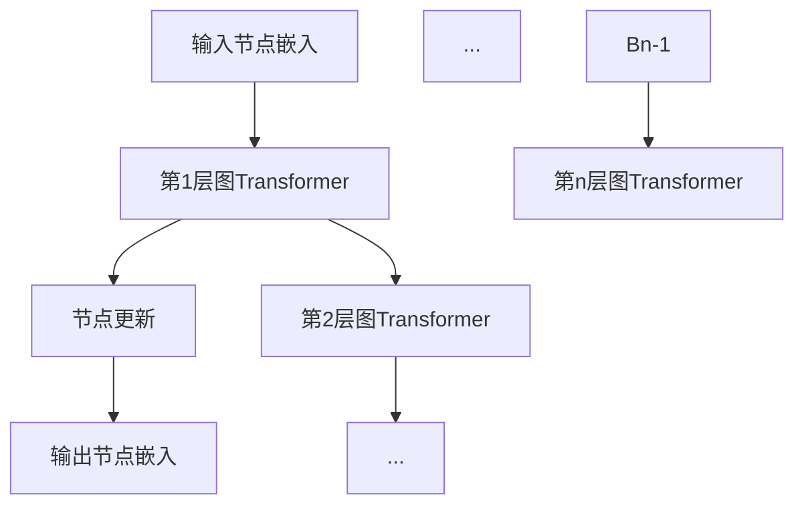

                 

### 图Transformer在大规模关系推理中的应用

#### 引言

随着信息技术的飞速发展，大数据和人工智能成为了当今社会的重要推动力。在这些领域中，知识图谱作为一种新型的语义网络，以其强大的关系推理能力，广泛应用于自然语言处理、搜索引擎、推荐系统等领域。然而，随着知识图谱规模的不断扩大，如何高效地进行大规模关系推理成为了一个亟待解决的问题。

图Transformer作为一种新型的图神经网络架构，由于其强大的特征提取和关系建模能力，在大规模关系推理中展现出了巨大的潜力。本文将深入探讨图Transformer在大规模关系推理中的应用，包括其基本概念、架构原理、核心算法、应用优化等方面。通过本文的阅读，读者将能够全面了解图Transformer在大规模关系推理中的实际应用价值和发展趋势。

本文的结构如下：

- 第1章：引言。介绍图Transformer的基本概念、大规模关系推理的挑战以及本文的研究目的。
- 第2章：图Transformer的基础知识。详细阐述图Transformer的架构原理、核心算法及其扩展与改进。
- 第3章：图Transformer在关系推理中的应用。具体分析图Transformer在知识图谱构建、实体关系预测和链接预测中的应用。
- 第4章：图Transformer的优化与效率。探讨图Transformer的并行化与分布式计算、资源受限环境下的优化以及实时推理技术。
- 第5章：图Transformer的应用案例。通过实际案例展示图Transformer在不同领域的应用效果。
- 第6章：图Transformer的研究前沿与未来趋势。分析图Transformer的研究进展、未来发展趋势以及其在关系推理领域的潜力。
- 第7章：总结与展望。对全文进行总结，并提出关系推理领域的未来研究方向和图Transformer的发展前景。

#### 关键词

- 图Transformer
- 大规模关系推理
- 知识图谱
- 图神经网络
- 自注意力机制
- 交叉注意力机制
- 并行化与分布式计算
- 资源受限环境优化
- 实时推理技术

#### 摘要

本文旨在深入探讨图Transformer在大规模关系推理中的应用。首先，我们介绍了图Transformer的基本概念及其在关系推理中的优势。随后，我们详细阐述了图Transformer的架构原理、核心算法以及其在知识图谱构建、实体关系预测和链接预测中的应用。接着，我们探讨了图Transformer的优化与效率，包括并行化与分布式计算、资源受限环境下的优化以及实时推理技术。最后，我们通过实际案例展示了图Transformer在不同领域的应用效果，并对其未来发展趋势进行了展望。本文的研究为图Transformer在大规模关系推理中的应用提供了理论支持和实践指导。

## 第1章 引言

### 1.1 图Transformer的基本概念

图Transformer是近年来在图神经网络（Graph Neural Networks, GNN）领域提出的一种新型网络架构，其灵感来源于自然语言处理中的Transformer模型。传统图神经网络如图卷积网络（Graph Convolutional Networks, GCN）主要通过局部信息聚合来学习节点的表示，而图Transformer则通过全局的注意力机制来实现对图结构的深层理解和建模。

图Transformer的核心思想是利用多头自注意力（Multi-head Self-Attention）和交叉注意力（Cross-Attention）机制来捕捉图中的复杂关系。多头自注意力机制允许模型同时关注图中的多个邻居节点，从而捕捉节点之间的长距离依赖关系；而交叉注意力机制则使得模型不仅能够关注自身的节点信息，还能关注到其他节点的信息，从而更好地进行关系推理。

图Transformer的提出，为大规模图数据的处理提供了新的思路。与传统图神经网络相比，图Transformer具有以下优势：

1. **全局信息利用**：通过自注意力机制，图Transformer能够同时关注到节点及其邻居节点，从而捕捉全局信息。
2. **并行计算**：图Transformer可以利用Transformer的并行计算特性，提高计算效率。
3. **灵活性**：图Transformer可以很容易地扩展到不同的图结构，如有向图、无向图和异构图。
4. **强关系建模**：交叉注意力机制使得图Transformer能够更好地建模节点之间的关系，从而提高关系推理的性能。

总之，图Transformer作为一种创新的图神经网络架构，为大规模关系推理提供了强大的工具，具有广泛的应用前景。

### 1.2 大规模关系推理的挑战

大规模关系推理在知识图谱处理、推荐系统、金融风险评估等领域具有广泛的应用。然而，随着数据规模的不断扩大，传统的关系推理方法面临着诸多挑战。

首先，数据规模的增长导致计算复杂度急剧增加。在传统的图卷积网络（GCN）中，每个节点的特征更新需要遍历其邻接节点的特征，这导致了时间复杂度与图的边数呈线性关系增长。当图规模达到百万甚至亿级别时，传统的GCN方法将变得不可接受。

其次，图数据结构复杂多变，不同类型的关系和实体特征需要不同的处理方法。例如，在知识图谱中，存在实体之间的多种关系，如父子关系、兄弟关系、朋友关系等。这些关系在建模时需要考虑其独特的特征和作用方式，增加了关系推理的难度。

另外，实时推理的需求也对大规模关系推理提出了挑战。在许多应用场景中，如实时推荐系统、金融风险监控等，需要模型能够快速响应用户的行为变化，从而提供准确的决策。然而，现有的关系推理方法大多依赖于批处理，难以实现高效的实时推理。

此外，资源限制也是大规模关系推理面临的一大难题。在云计算和边缘计算环境中，计算资源和存储资源往往有限。如何在这些资源受限的条件下，仍然能够高效地处理大规模图数据，是一个重要的研究课题。

综上所述，大规模关系推理面临着数据规模增长、图结构复杂性、实时性需求以及资源限制等多方面的挑战。为了应对这些挑战，需要开发新的算法和架构，如图Transformer，以实现高效、准确和灵活的关系推理。

### 1.3 图Transformer在关系推理中的应用前景

图Transformer作为一种创新的图神经网络架构，在大规模关系推理中展现出了广阔的应用前景。首先，图Transformer通过多头自注意力机制和交叉注意力机制，能够有效捕捉图中的复杂关系，从而提高关系推理的准确性。这对于知识图谱处理、推荐系统、金融风险评估等应用场景具有重要的意义。

在知识图谱处理方面，图Transformer可以用于知识图谱的构建、实体关系预测和实体属性推断。通过利用图Transformer，可以实现对大规模知识图谱的深层理解和建模，从而提高知识图谱的应用效果。例如，在搜索引擎中，利用图Transformer可以对查询进行扩展，提高搜索结果的准确性；在推荐系统中，利用图Transformer可以更好地理解用户和物品之间的关系，提高推荐系统的效果。

在推荐系统方面，图Transformer可以通过对用户和物品的图结构进行建模，从而实现更精准的推荐。传统推荐系统通常依赖于用户的历史行为数据，而图Transformer可以结合图结构信息，进一步丰富推荐模型的知识表示。例如，在社交媒体平台上，图Transformer可以帮助用户发现潜在的兴趣群体，提供更加个性化的推荐。

在金融风险评估方面，图Transformer可以用于分析金融网络中的风险传播路径，从而提高风险预警的准确性。金融网络是一个复杂的图结构，涉及众多金融机构和金融产品之间的复杂关系。通过图Transformer，可以捕捉这些关系，并预测可能的金融风险，从而帮助金融机构进行有效的风险管理。

此外，图Transformer还可以应用于社交网络分析、生物信息学、交通网络优化等领域。在这些领域中，图Transformer能够利用其强大的特征提取和关系建模能力，提供高效和准确的关系推理解决方案。

总之，图Transformer在关系推理中的应用前景广阔。通过不断的研究和优化，图Transformer有望成为大规模关系推理中的重要工具，为各个领域的应用带来革命性的改变。

## 第2章 图Transformer的基础知识

### 2.1 图Transformer的架构原理

图Transformer是一种结合了图结构和Transformer模型的神经网络架构，其核心思想是利用自注意力机制和交叉注意力机制来处理图数据。图Transformer的架构可以分为以下几个主要部分：节点嵌入层、多头自注意力层、交叉注意力层、前馈神经网络和节点更新机制。

首先，**节点嵌入层**负责将图中的节点表示为低维向量。这些向量包含了节点的特征信息，如属性、标签等。节点嵌入层通常使用嵌入矩阵（Embedding Matrix）来初始化节点的嵌入向量。

接下来，**多头自注意力层**（Multi-head Self-Attention Layer）是图Transformer的核心组件之一。它通过自注意力机制对节点及其邻居节点进行加权求和，从而实现节点的特征聚合。多头自注意力层由多个独立的自注意力头组成，每个头关注不同的邻居节点集合，从而捕捉节点之间的多维度关系。

然后，**交叉注意力层**（Cross-Attention Layer）允许模型在处理当前节点时，参考其他节点（如目标节点）的信息。这有助于模型在关系推理任务中，如链接预测或实体关系预测中，利用目标节点的信息来更新当前节点的表示。

在自注意力和交叉注意力之后，**前馈神经网络**（Feedforward Neural Network）对节点的嵌入向量进行进一步的非线性变换，从而增强模型的表示能力。前馈神经网络通常包括两个全连接层，分别使用ReLU激活函数和线性激活函数。

最后，**节点更新机制**负责根据当前节点的嵌入向量更新图中的节点表示。这种更新过程通常在每个时间步上进行，确保模型能够逐步学习和调整节点的嵌入。

总的来说，图Transformer的架构通过结合自注意力机制和交叉注意力机制，能够有效捕捉图中的复杂关系和全局信息。其结构紧凑且具有并行计算的优势，使得图Transformer在大规模图数据处理中表现出色。

### 2.2 图Transformer的核心算法

图Transformer的核心算法主要包括多头自注意力机制（Multi-head Self-Attention）和交叉注意力机制（Cross-Attention）。这些机制不仅赋予了图Transformer强大的特征提取和关系建模能力，还使其在处理大规模图数据时具有并行计算的优势。

#### 多头自注意力机制

多头自注意力机制是图Transformer的核心组成部分。它通过自注意力机制对节点及其邻居节点进行加权求和，从而实现节点的特征聚合。具体来说，多头自注意力机制包括以下几个步骤：

1. **嵌入表示**：首先，将图中的节点表示为嵌入向量（Embedding Vectors），这些向量包含了节点的特征信息，如属性、标签等。嵌入向量通常通过嵌入矩阵（Embedding Matrix）进行初始化。

2. **自注意力计算**：每个节点会与其邻居节点进行自注意力计算。具体过程如下：
   - **查询（Query）**：当前节点的嵌入向量。
   - **键（Key）**：邻居节点的嵌入向量。
   - **值（Value）**：邻居节点的嵌入向量。
   - **计算注意力得分**：使用点积方法计算查询和键之间的注意力得分。得分表示了当前节点对邻居节点的关注程度。
   - **加权求和**：根据注意力得分对邻居节点的值进行加权求和，得到新的节点嵌入向量。

3. **多头自注意力**：多头自注意力机制通过多个独立的自注意力头来实现。每个头关注不同的邻居节点集合，从而捕捉节点之间的多维度关系。多个头的输出会进行拼接，形成最终的节点嵌入向量。

#### 交叉注意力机制

交叉注意力机制是图Transformer在关系推理任务中的重要组成部分。它允许模型在处理当前节点时，参考其他节点（如目标节点）的信息。具体来说，交叉注意力机制包括以下几个步骤：

1. **目标节点嵌入**：首先，将目标节点表示为嵌入向量，这些向量包含了目标节点的特征信息。

2. **交叉注意力计算**：当前节点会与目标节点的嵌入向量进行交叉注意力计算。具体过程如下：
   - **查询（Query）**：当前节点的嵌入向量。
   - **键（Key）**：目标节点的嵌入向量。
   - **值（Value）**：目标节点的嵌入向量。
   - **计算注意力得分**：使用点积方法计算查询和键之间的注意力得分。
   - **加权求和**：根据注意力得分对目标节点的值进行加权求和，得到新的节点嵌入向量。

3. **结合自注意力和交叉注意力**：在关系推理任务中，模型通常需要同时利用自注意力和交叉注意力来更新节点的嵌入向量。首先，利用多头自注意力机制对当前节点的邻居节点进行特征聚合；然后，通过交叉注意力机制利用目标节点的信息来进一步更新节点的嵌入。

#### 结合自注意力和交叉注意力

在图Transformer中，自注意力和交叉注意力机制相互结合，共同实现对节点的特征聚合和关系建模。具体流程如下：

1. **自注意力计算**：首先，通过多头自注意力机制对当前节点的邻居节点进行特征聚合，得到新的节点嵌入向量。
2. **交叉注意力计算**：然后，通过交叉注意力机制利用目标节点的信息来进一步更新节点的嵌入向量。
3. **前馈神经网络**：在自注意力和交叉注意力之后，使用前馈神经网络对节点的嵌入向量进行进一步的非线性变换，增强模型的表示能力。

通过这种结合，图Transformer能够有效捕捉图中的复杂关系和全局信息，从而在关系推理任务中表现出色。总之，多头自注意力机制和交叉注意力机制是图Transformer的核心算法，它们共同赋予了图Transformer强大的特征提取和关系建模能力。

### 2.3 图Transformer的扩展与改进

图Transformer自提出以来，受到了广泛关注，并迅速在图神经网络领域获得了重要地位。为了进一步优化其性能和适用范围，研究者们提出了多种扩展和改进方案。以下是几个具有代表性的扩展与改进方法。

#### 多层图Transformer

多层图Transformer通过堆叠多个图Transformer层，实现了对图数据的更深层次建模。这种多层结构能够逐步提取图数据中的高阶特征，从而提高模型的表达能力。具体来说，每个图Transformer层都会对节点嵌入进行自注意力聚合和交叉注意力更新，然后将其传递到下一层。通过这种方式，多层图Transformer能够在不同层次上捕捉节点之间的复杂关系。

多层图Transformer的架构如下图所示：

#### 自适应注意力权重

自适应注意力权重旨在优化注意力机制，使其在不同任务和数据集上表现出更好的性能。例如，Soft Attention Mechanism通过使用软阈值来调整注意力权重，从而避免过于依赖某些特定邻居节点。这种方法使得模型能够更加灵活地关注到重要的节点信息。

自适应注意力权重的计算公式如下：

$$
\alpha_{ij} = \frac{e^{x_i^T W_a x_j}}{\sum_{k=1}^{N} e^{x_i^T W_a x_k}}
$$

其中，$x_i$和$x_j$分别表示节点$i$和节点$j$的嵌入向量，$W_a$是自适应权重矩阵。

#### 节点分类任务中的注意力掩码

在节点分类任务中，注意力掩码（Attention Mask）被用来强制模型关注特定的邻居节点，而忽略其他无关节点。注意力掩码通常是一个二进制矩阵，用于指示哪些节点应该被关注。这种方法有助于模型在训练过程中更加关注重要信息，从而提高分类性能。

注意力掩码的引入使得模型能够更好地处理节点分类任务，例如在知识图谱中的实体分类。通过注意力掩码，模型可以专注于与目标实体相关的邻居节点，从而提高分类准确性。

#### 多任务学习

多任务学习（Multi-task Learning）是一种通过同时训练多个任务来提高模型性能的方法。在图Transformer中，多任务学习可以通过结合不同类型的任务（如节点分类、链接预测、实体关系预测等）来实现。

多任务学习的核心思想是将不同任务映射到共享的嵌入空间中，从而利用不同任务之间的相关性来提高整体模型的性能。具体来说，每个任务都会有一个独立的损失函数，模型会在训练过程中同时优化这些损失函数。

#### 混合模型

混合模型（Hybrid Models）结合了图神经网络和传统深度学习模型（如CNN、RNN）的优点，以进一步提高模型性能。例如，图Transformer可以与图卷积网络（GCN）结合，形成GCN-Transformer混合模型。这种混合模型利用GCN在局部特征聚合方面的优势，并结合图Transformer的全局关系建模能力，从而实现更高效的图数据处理。

总之，图Transformer的扩展与改进方法丰富多样，通过引入多层结构、自适应注意力权重、注意力掩码、多任务学习和混合模型等技术，进一步提升了图Transformer的性能和适用范围。这些改进不仅使图Transformer在大规模关系推理中表现出色，还为未来的研究提供了新的思路。

## 第3章 图Transformer在关系推理中的应用

### 3.1 图Transformer在知识图谱构建中的应用

知识图谱是一种语义网络，它通过实体、关系和属性的表示，将现实世界中的知识结构化。知识图谱的构建是关系推理的基础，而图Transformer作为一项创新的图神经网络技术，在知识图谱构建中展现了其强大的能力。下面将详细探讨图Transformer在知识图谱构建中的应用。

#### 3.1.1 知识图谱的表示

知识图谱中的实体和关系可以用图结构来表示，其中实体作为节点，关系作为边。为了将知识图谱输入到图Transformer中，需要对实体和关系进行嵌入表示。实体嵌入通常包含实体的属性、标签等信息，而关系嵌入则反映了实体之间的语义关系。

#### 3.1.2 图Transformer在知识图谱构建中的工作流程

图Transformer在知识图谱构建中的工作流程主要包括以下几个步骤：

1. **初始化嵌入**：首先，将知识图谱中的实体和关系进行嵌入表示。实体嵌入和关系嵌入可以通过预训练的词嵌入模型或者基于知识图谱的迁移学习方法进行初始化。

2. **自注意力聚合**：利用图Transformer的多头自注意力机制，对实体节点的嵌入进行聚合。这一步可以帮助模型捕获实体节点的全局特征和邻接实体之间的长距离依赖关系。

3. **交叉注意力更新**：在自注意力聚合的基础上，利用交叉注意力机制，将目标节点的嵌入信息融入实体节点的嵌入表示中。这有助于模型更好地理解实体之间的具体关系。

4. **前馈神经网络**：通过前馈神经网络对节点的嵌入向量进行进一步的非线性变换，增强模型的表示能力。

5. **节点更新**：根据上述步骤得到的更新后的节点嵌入向量，更新知识图谱中的实体表示。这一过程在每个时间步上循环进行，直到模型收敛或达到预定的迭代次数。

#### 3.1.3 图Transformer在知识图谱构建中的优势

图Transformer在知识图谱构建中具有以下优势：

1. **全局信息利用**：通过自注意力机制，图Transformer能够同时关注到实体节点及其邻接节点，从而捕捉全局信息，这对于知识图谱的深层理解和建模至关重要。

2. **并行计算**：图Transformer的并行计算特性使其能够高效地处理大规模知识图谱数据，这在知识图谱的构建过程中尤为重要。

3. **关系建模**：图Transformer利用交叉注意力机制，能够更好地建模实体之间的复杂关系，从而提高知识图谱的准确性和鲁棒性。

4. **灵活性**：图Transformer可以轻松扩展到不同的图结构，如有向图、无向图和异构图，从而适应不同类型的知识图谱构建任务。

#### 3.1.4 应用实例

以下是一个具体的应用实例：在一个基于知识图谱的问答系统中，图Transformer被用于构建知识图谱。该系统通过大量文本数据训练，将文本中的实体和关系转化为图结构，然后利用图Transformer对图进行建模。通过这种方式，系统能够对用户的问题进行理解和回答，提供准确的答案。

例如，用户输入问题：“中国的首都是什么？”系统通过图Transformer，在知识图谱中检索与“中国”和“首都”相关的实体和关系，最终找到正确的答案：“中国的首都是北京”。

#### 3.1.5 结论

图Transformer在知识图谱构建中的应用，为知识图谱的深层理解和建模提供了强大的工具。通过自注意力机制和交叉注意力机制，图Transformer能够有效捕捉实体之间的复杂关系和全局信息，从而提高知识图谱的准确性和鲁棒性。随着图Transformer的不断发展和优化，其在知识图谱构建中的应用前景将越来越广阔。

### 3.2 图Transformer在实体关系预测中的应用

实体关系预测是知识图谱处理中的一个重要任务，旨在根据实体及其属性，预测实体之间的潜在关系。图Transformer由于其强大的特征提取和关系建模能力，在实体关系预测中展现出了显著的优势。下面将详细探讨图Transformer在实体关系预测中的应用。

#### 3.2.1 实体关系预测的基本概念

实体关系预测的目标是给定一组实体和它们的部分关系，预测这些实体之间可能存在的其他关系。例如，在一个包含“人”和“电影”两个实体的知识图谱中，已知某些人出演了某些电影，需要预测这些人可能参与的其他电影。

#### 3.2.2 图Transformer在实体关系预测中的工作流程

图Transformer在实体关系预测中的工作流程主要包括以下几个步骤：

1. **初始化实体和关系的嵌入**：首先，将知识图谱中的实体和关系进行嵌入表示。实体嵌入通常包含实体的属性和标签，关系嵌入则反映实体之间的关系。

2. **自注意力聚合**：利用图Transformer的多头自注意力机制，对实体节点的嵌入进行聚合。这一步有助于模型捕获实体节点的全局特征和邻接实体之间的长距离依赖关系。

3. **交叉注意力更新**：在自注意力聚合的基础上，通过交叉注意力机制，将目标关系的信息融入实体节点的嵌入表示中。这有助于模型更好地理解实体之间的具体关系。

4. **前馈神经网络**：通过前馈神经网络对节点的嵌入向量进行进一步的非线性变换，增强模型的表示能力。

5. **关系预测**：利用训练好的图Transformer模型，对实体之间的关系进行预测。具体方法可以是直接输出关系的概率分布，或者通过分类器对关系进行二分类预测。

#### 3.2.3 图Transformer在实体关系预测中的优势

图Transformer在实体关系预测中具有以下优势：

1. **全局特征提取**：通过自注意力机制，图Transformer能够同时关注到实体节点及其邻居节点，从而捕捉全局特征和长距离依赖关系。

2. **关系建模**：交叉注意力机制使得图Transformer能够更好地建模实体之间的关系，从而提高关系预测的准确性。

3. **并行计算**：图Transformer的并行计算特性使得其能够高效处理大规模知识图谱数据，这对于实体关系预测尤为重要。

4. **灵活性**：图Transformer可以适应不同的知识图谱结构，包括有向图、无向图和异构图，从而适用于多种实体关系预测任务。

#### 3.2.4 应用实例

以下是一个具体的应用实例：在一个基于知识图谱的社交媒体平台上，图Transformer被用于预测用户之间的关系。平台通过用户的互动数据（如点赞、评论、分享等）构建用户关系图，然后利用图Transformer对用户关系进行预测。通过这种方式，平台能够为用户提供更精准的社交推荐，如“你可能认识的人”或“你可能感兴趣的人”。

例如，用户A点赞了用户B的帖子，系统通过图Transformer预测用户A和用户B之间存在潜在的朋友关系，进而推荐用户A关注用户B。

#### 3.2.5 结论

图Transformer在实体关系预测中的应用，为知识图谱的处理提供了新的思路和强大的工具。通过自注意力机制和交叉注意力机制，图Transformer能够有效捕捉实体之间的复杂关系和全局信息，从而提高关系预测的准确性。随着图Transformer的不断发展和优化，其在实体关系预测中的应用前景将越来越广阔。

### 3.3 图Transformer在链接预测中的应用

链接预测是知识图谱处理中的关键任务之一，旨在根据已有的实体和关系预测图谱中可能存在的缺失链接。图Transformer作为一种先进的图神经网络架构，在链接预测中展现了其卓越的性能。下面将详细探讨图Transformer在链接预测中的应用。

#### 3.3.1 链接预测的基本概念

链接预测的目标是识别知识图谱中可能存在的缺失链接。在知识图谱中，链接通常表示实体之间的关系。例如，在一个包含电影和演员的知识图谱中，已知某些演员出演了某些电影，链接预测的目标是发现其他演员可能出演的电影。

#### 3.3.2 图Transformer在链接预测中的工作流程

图Transformer在链接预测中的工作流程主要包括以下几个步骤：

1. **初始化实体和关系的嵌入**：首先，将知识图谱中的实体和关系进行嵌入表示。实体嵌入通常包含实体的属性和标签，关系嵌入则反映实体之间的关系。

2. **自注意力聚合**：利用图Transformer的多头自注意力机制，对实体节点的嵌入进行聚合。这一步有助于模型捕获实体节点的全局特征和邻接实体之间的长距离依赖关系。

3. **交叉注意力更新**：在自注意力聚合的基础上，通过交叉注意力机制，将目标关系的嵌入信息融入实体节点的嵌入表示中。这有助于模型更好地理解实体之间的具体关系。

4. **前馈神经网络**：通过前馈神经网络对节点的嵌入向量进行进一步的非线性变换，增强模型的表示能力。

5. **链接预测**：利用训练好的图Transformer模型，对实体之间的可能链接进行预测。具体方法可以是直接输出链接的概率分布，或者通过分类器对链接进行二分类预测。

#### 3.3.3 图Transformer在链接预测中的优势

图Transformer在链接预测中具有以下优势：

1. **全局信息利用**：通过自注意力机制，图Transformer能够同时关注到实体节点及其邻居节点，从而捕捉全局信息，这对于链接预测至关重要。

2. **关系建模**：交叉注意力机制使得图Transformer能够更好地建模实体之间的关系，从而提高链接预测的准确性。

3. **并行计算**：图Transformer的并行计算特性使其能够高效处理大规模知识图谱数据，这对于链接预测尤为重要。

4. **灵活性**：图Transformer可以适应不同的知识图谱结构，包括有向图、无向图和异构图，从而适用于多种链接预测任务。

#### 3.3.4 应用实例

以下是一个具体的应用实例：在一个基于知识图谱的搜索引擎中，图Transformer被用于预测用户查询与图谱中的实体之间的潜在链接。搜索引擎通过用户的查询历史和知识图谱构建用户查询与实体之间的链接图，然后利用图Transformer对链接进行预测。通过这种方式，搜索引擎能够为用户提供更准确的搜索结果。

例如，用户输入查询：“哪个明星出演了《肖申克的救赎》？”系统通过图Transformer预测《肖申克的救赎》与明星之间的链接，从而推荐可能出演该电影的明星。

#### 3.3.5 结论

图Transformer在链接预测中的应用，为知识图谱的处理提供了新的思路和强大的工具。通过自注意力机制和交叉注意力机制，图Transformer能够有效捕捉实体之间的复杂关系和全局信息，从而提高链接预测的准确性。随着图Transformer的不断发展和优化，其在链接预测中的应用前景将越来越广阔。

## 第4章 图Transformer的优化与效率

### 4.1 图Transformer的并行化与分布式计算

随着图数据规模的不断增加，传统的单机图Transformer模型在处理大规模图数据时面临着计算资源不足的问题。为了提高图Transformer的效率和可扩展性，并行化与分布式计算技术被广泛应用于图Transformer模型的优化。以下是图Transformer并行化与分布式计算的主要方法：

#### 4.1.1 数据并行

数据并行（Data Parallelism）是一种常用的并行化策略，其基本思想是将图数据划分为多个子图，并在多个计算节点上独立训练图Transformer模型。具体步骤如下：

1. **数据划分**：将原始图数据划分为多个子图，每个子图包含一部分节点和它们之间的关系。
2. **模型复制**：在每个计算节点上复制一个图Transformer模型。
3. **局部训练**：每个计算节点独立地在其子图上训练图Transformer模型，包括前向传播和反向传播过程。
4. **梯度聚合**：将每个计算节点的梯度进行聚合，更新全局模型参数。

数据并行方法的主要优势在于其能够有效利用多个计算节点的计算资源，从而加速模型训练。然而，其缺点在于需要进行大量的数据传输和通信开销，特别是在子图之间节点数量差异较大的情况下。

#### 4.1.2 模型并行

模型并行（Model Parallelism）是一种将图Transformer模型在不同计算节点上分割的方法，以应对模型参数过多而单个计算节点内存不足的问题。具体步骤如下：

1. **模型分割**：将图Transformer模型按照层或节点划分到多个计算节点上。每个节点负责处理部分模型参数和节点的嵌入向量。
2. **局部训练**：每个计算节点独立地在其子模型上训练图Transformer模型，包括前向传播和反向传播过程。
3. **梯度聚合**：将每个计算节点的梯度进行聚合，更新全局模型参数。

模型并行方法的主要优势在于其能够有效降低单个计算节点的内存需求，适用于处理高维参数模型。然而，其缺点在于需要复杂的模型通信和同步机制，并且可能引入额外的延迟。

#### 4.1.3 分布式计算

分布式计算是将图Transformer模型训练和推理过程分布在多个计算节点上进行的方法。分布式计算可以通过以下技术实现：

1. **分布式训练**：在多个计算节点上进行模型训练，每个节点负责一部分数据的训练，通过梯度聚合更新全局模型。
2. **分布式推理**：在多个计算节点上进行模型推理，每个节点负责一部分节点的推理任务，通过结果聚合得到最终输出。

分布式计算的主要优势在于其能够充分利用大规模计算资源，提高训练和推理效率。然而，其缺点在于需要复杂的分布式通信和同步机制，并且可能引入网络延迟。

#### 4.1.4 并行化与分布式计算的优势与挑战

并行化与分布式计算为图Transformer模型的优化提供了有效的解决方案，主要优势包括：

1. **加速训练和推理**：通过利用多个计算节点的计算资源，可以显著提高模型训练和推理的速度。
2. **扩展性**：分布式计算能够支持大规模图数据的处理，适应不断增长的图数据需求。
3. **资源利用率**：通过合理分配计算资源，可以提高资源利用率，降低成本。

然而，并行化与分布式计算也面临一些挑战，包括：

1. **通信开销**：数据并行和模型并行方法中，需要进行大量的数据传输和通信，这可能导致性能瓶颈。
2. **同步机制**：分布式训练和推理中，需要复杂的同步机制来保证模型参数的一致性。
3. **网络延迟**：分布式计算中，网络延迟可能导致计算效率降低。

总之，并行化与分布式计算为图Transformer模型在大规模图数据中的应用提供了有效的优化方法，但在实际应用中需要综合考虑计算资源、通信开销和网络延迟等因素。

### 4.2 图Transformer在资源受限环境下的优化

在许多实际应用场景中，如边缘计算和移动设备，计算资源和存储资源都受到限制。为了在这些资源受限的环境下有效运行图Transformer模型，研究者们提出了一系列优化方法。以下是几种主要的优化方法：

#### 4.2.1 稀疏性优化

图Transformer在处理大规模图数据时，通常涉及大量的矩阵运算。稀疏性优化通过减少矩阵中的非零元素来降低计算复杂度。具体方法包括：

1. **稀疏嵌入**：使用稀疏嵌入矩阵表示节点和边，只存储非零元素，从而减少内存占用。
2. **稀疏矩阵运算**：优化矩阵运算，只处理非零元素，从而降低计算复杂度。

稀疏性优化能够显著减少图Transformer模型的内存消耗和计算时间，适用于处理稀疏图数据。

#### 4.2.2 低秩分解

低秩分解（Low-rank Decomposition）通过将高维矩阵分解为低秩矩阵来降低计算复杂度。具体方法包括：

1. **SVD分解**：使用奇异值分解（Singular Value Decomposition, SVD）将图矩阵分解为低秩矩阵。
2. **PCA分解**：使用主成分分析（Principal Component Analysis, PCA）将图矩阵分解为低秩矩阵。

低秩分解能够减少模型参数数量，从而降低计算复杂度和内存占用。

#### 4.2.3 分块优化

分块优化通过将大规模图数据划分为较小的子图进行训练和推理。具体方法包括：

1. **分块矩阵运算**：将图矩阵分解为多个较小的矩阵块，分别进行运算，然后聚合结果。
2. **分块训练**：在每个子图上独立训练图Transformer模型，最后将结果聚合。

分块优化能够有效减少单次计算的任务量，从而降低计算复杂度和内存消耗。

#### 4.2.4 量化与剪枝

量化与剪枝（Quantization and Pruning）通过减少模型参数的数量和精度来降低计算复杂度和内存占用。具体方法包括：

1. **量化**：将模型参数的精度降低，从而减少内存占用和计算复杂度。
2. **剪枝**：通过剪枝冗余的模型参数来减少计算复杂度和内存占用。

量化与剪枝方法在保证模型性能的前提下，能够显著降低模型的计算和存储需求。

#### 4.2.5 优化方法的优势与挑战

这些优化方法在资源受限环境下具有显著的优势，包括：

1. **减少内存占用**：稀疏性优化、低秩分解和分块优化能够显著减少模型内存需求。
2. **降低计算复杂度**：稀疏性优化、低秩分解和分块优化能够降低计算复杂度，提高模型运行速度。
3. **保持模型性能**：量化与剪枝方法在降低计算和存储需求的同时，能够保证模型性能。

然而，这些优化方法也面临一些挑战，包括：

1. **精度损失**：稀疏性优化、低秩分解和量化可能引入精度损失，影响模型性能。
2. **复杂实现**：分块优化和量化与剪枝方法需要复杂的实现和调试。
3. **适应性**：不同优化方法在不同场景中的适应性不同，需要根据具体应用场景选择合适的优化方法。

总之，图Transformer在资源受限环境下的优化方法为模型在大规模图数据处理中的高效运行提供了有效解决方案，但在实际应用中需要根据具体场景进行权衡和选择。

### 4.3 图Transformer的实时推理技术

在许多应用场景中，如实时推荐系统和在线问答系统，图Transformer模型需要在低延迟的环境下进行实时推理。实时推理技术旨在优化图Transformer模型的推理速度，以满足快速响应的需求。以下是几种主要的实时推理技术：

#### 4.3.1 预处理与缓存

预处理与缓存是一种常见的实时推理技术，通过提前计算和存储中间结果来减少推理时间。具体方法包括：

1. **节点嵌入缓存**：在推理前，将节点嵌入向量进行预计算并缓存，从而在推理过程中直接使用缓存结果，减少计算时间。
2. **关系嵌入缓存**：在推理前，将关系嵌入向量进行预计算并缓存，从而减少在推理过程中对关系嵌入的计算需求。

预处理与缓存能够显著减少实时推理的时间，但需要额外的存储空间。

#### 4.3.2 并行化与分布式计算

并行化与分布式计算技术可以应用于实时推理，以加速图Transformer模型的推理过程。具体方法包括：

1. **数据并行**：将图数据划分为多个子图，并在多个计算节点上进行独立推理，然后聚合结果。
2. **模型并行**：将图Transformer模型在不同计算节点上分割，并在多个节点上进行局部推理，然后聚合结果。

并行化与分布式计算能够有效利用计算资源，提高实时推理的速度。

#### 4.3.3 简化模型结构

简化模型结构是一种通过减少模型参数和计算复杂度来提高推理速度的方法。具体方法包括：

1. **模型剪枝**：通过剪枝冗余的模型参数来减少计算复杂度。
2. **模型量化**：通过降低模型参数的精度来减少计算复杂度。

简化模型结构能够显著减少实时推理的时间，但可能影响模型性能。

#### 4.3.4 优化算法

优化算法是一种通过改进图Transformer模型推理算法来提高推理速度的方法。具体方法包括：

1. **高效矩阵运算**：优化图矩阵运算，使用更高效的算法和并行计算技术。
2. **动态调整**：根据实时数据的特点和需求，动态调整模型参数和推理策略。

优化算法能够提高图Transformer模型的实时推理速度，但需要复杂的设计和实现。

#### 4.3.5 实时推理技术的优势与挑战

实时推理技术在提高图Transformer模型推理速度方面具有显著的优势，包括：

1. **低延迟**：通过预处理与缓存、并行化与分布式计算等方法，可以显著减少推理时间，满足实时需求。
2. **高效率**：简化模型结构和优化算法可以提高模型推理的效率。

然而，实时推理技术也面临一些挑战，包括：

1. **计算资源需求**：并行化与分布式计算需要大量的计算资源，可能增加成本。
2. **精度损失**：简化模型结构和量化方法可能引入精度损失，影响模型性能。

总之，实时推理技术为图Transformer模型在低延迟环境下的高效运行提供了有效解决方案，但在实际应用中需要根据具体场景进行权衡和优化。

## 第5章 图Transformer的应用案例

### 5.1 案例一：图Transformer在金融领域的应用

图Transformer在金融领域具有广泛的应用潜力，尤其在风险管理和金融网络分析方面。以下是图Transformer在金融领域的一个具体应用案例。

#### 应用背景

某金融机构希望通过分析其金融网络中的关系，识别潜在的信用风险和交易欺诈。该金融机构拥有大量的客户交易数据，这些数据构成了一个复杂的金融网络，其中客户、账户和交易作为节点，而交易关系作为边。

#### 应用方法

为了实现这一目标，金融机构采用了图Transformer模型，其工作流程如下：

1. **数据预处理**：首先，对客户交易数据进行清洗和预处理，提取关键信息，如客户ID、账户ID、交易金额等，并将其转化为图结构表示。

2. **节点嵌入和关系嵌入**：利用预训练的嵌入模型对客户、账户和交易进行嵌入表示，形成初始节点嵌入向量。同时，根据交易关系定义关系嵌入向量。

3. **图Transformer模型训练**：将预处理后的图数据输入到图Transformer模型中，通过多层图Transformer层进行训练。模型使用多头自注意力机制和交叉注意力机制来捕捉金融网络中的复杂关系。

4. **风险预测**：训练好的图Transformer模型用于预测金融网络中客户的信用风险和交易欺诈。通过分析客户节点的嵌入向量及其关系，模型能够识别高风险客户和可疑交易。

#### 应用效果

通过实际应用，图Transformer模型在信用风险和交易欺诈识别方面表现出色。以下是一些具体的应用效果：

- **信用风险评估**：模型能够准确预测客户的信用风险，帮助金融机构制定更加合理的信用额度策略，减少坏账率。
- **交易欺诈检测**：模型能够识别出潜在的欺诈交易，提高了交易欺诈检测的准确性和效率。

#### 结论

图Transformer在金融领域的应用，为金融机构提供了有效的风险管理和欺诈检测工具。通过利用图Transformer的强大特征提取和关系建模能力，金融机构能够更好地理解和分析金融网络，从而提高业务决策的准确性和效率。

### 5.2 案例二：图Transformer在医疗健康领域的应用

图Transformer在医疗健康领域具有巨大的应用潜力，特别是在疾病预测、药物发现和患者关系分析等方面。以下是图Transformer在医疗健康领域的一个具体应用案例。

#### 应用背景

某医疗健康机构希望通过分析患者关系和疾病数据，预测患者的疾病发展趋势和潜在的治疗方案。该机构拥有大量患者的电子健康记录（EHR），这些记录包含了患者的医疗历史、诊断、治疗方案等详细信息。

#### 应用方法

为了实现这一目标，医疗健康机构采用了图Transformer模型，其工作流程如下：

1. **数据预处理**：首先，对患者的电子健康记录进行清洗和预处理，提取关键信息，如患者ID、疾病ID、诊断日期等，并将其转化为图结构表示。

2. **节点嵌入和关系嵌入**：利用预训练的嵌入模型对疾病、患者和治疗方案进行嵌入表示，形成初始节点嵌入向量。同时，根据诊断和治疗关系定义关系嵌入向量。

3. **图Transformer模型训练**：将预处理后的图数据输入到图Transformer模型中，通过多层图Transformer层进行训练。模型使用多头自注意力机制和交叉注意力机制来捕捉患者关系和疾病之间的复杂关系。

4. **疾病预测**：训练好的图Transformer模型用于预测患者的疾病发展趋势。通过分析患者节点的嵌入向量及其关系，模型能够预测患者可能患上的疾病以及最佳治疗方案。

5. **药物发现**：图Transformer模型还可以用于药物发现，通过分析疾病和药物之间的图结构关系，模型能够识别出潜在的有效药物。

#### 应用效果

通过实际应用，图Transformer模型在疾病预测和药物发现方面取得了显著的效果。以下是一些具体的应用效果：

- **疾病预测**：模型能够准确预测患者的疾病发展趋势，为医疗机构提供及时的治疗建议，提高了患者的治疗效果和满意度。
- **药物发现**：模型能够有效识别出潜在的有效药物，为药物研发提供了重要的数据支持。

#### 结论

图Transformer在医疗健康领域的应用，为医疗机构提供了有效的疾病预测和药物发现工具。通过利用图Transformer的强大特征提取和关系建模能力，医疗机构能够更好地理解和分析患者数据，从而提高医疗服务的质量和效率。

### 5.3 案例三：图Transformer在社交网络分析中的应用

图Transformer在社交网络分析领域具有广泛的应用前景，特别是在社交图谱构建、用户行为预测和社交推荐等方面。以下是图Transformer在社交网络分析中的一个具体应用案例。

#### 应用背景

某社交媒体平台希望通过分析用户之间的社交关系，为用户提供更精准的社交推荐。该平台拥有大量的用户数据，这些数据包括用户的基本信息、互动记录、兴趣偏好等。

#### 应用方法

为了实现这一目标，社交媒体平台采用了图Transformer模型，其工作流程如下：

1. **数据预处理**：首先，对用户数据进行清洗和预处理，提取关键信息，如用户ID、好友关系、互动记录等，并将其转化为图结构表示。

2. **节点嵌入和关系嵌入**：利用预训练的嵌入模型对用户和好友进行嵌入表示，形成初始节点嵌入向量。同时，根据用户之间的互动关系定义关系嵌入向量。

3. **图Transformer模型训练**：将预处理后的图数据输入到图Transformer模型中，通过多层图Transformer层进行训练。模型使用多头自注意力机制和交叉注意力机制来捕捉用户社交关系和行为特征。

4. **社交推荐**：训练好的图Transformer模型用于预测用户可能感兴趣的新朋友和内容。通过分析用户节点的嵌入向量及其关系，模型能够识别出潜在的兴趣群体和个性化推荐内容。

5. **用户行为预测**：图Transformer模型还可以用于预测用户的行为趋势，如用户可能的互动行为、关注行为等，为平台提供实时推荐和活动策划支持。

#### 应用效果

通过实际应用，图Transformer模型在社交推荐和用户行为预测方面取得了显著的效果。以下是一些具体的应用效果：

- **社交推荐**：模型能够准确预测用户可能感兴趣的新朋友和内容，提高了社交推荐的准确性和用户体验。
- **用户行为预测**：模型能够准确预测用户的行为趋势，为平台提供了实时推荐和活动策划的重要依据。

#### 结论

图Transformer在社交网络分析中的应用，为社交媒体平台提供了有效的社交推荐和用户行为预测工具。通过利用图Transformer的强大特征提取和关系建模能力，社交媒体平台能够更好地理解和分析用户数据，从而提高平台的服务质量和用户满意度。

## 第6章 图Transformer的研究前沿与未来趋势

### 6.1 图Transformer的研究进展

图Transformer自提出以来，在图神经网络（GNN）领域迅速引起了广泛关注。研究者们从多个角度对图Transformer进行了深入研究和扩展，取得了显著的进展。以下是图Transformer研究的一些主要进展：

#### 6.1.1 模型结构优化

图Transformer的原始模型结构相对简单，但在实际应用中，研究者们提出了多种优化方案。例如，多层图Transformer（Multi-layer Graph Transformer）通过堆叠多个图Transformer层，增强了模型的表达能力。此外，自注意力机制（Self-Attention Mechanism）和交叉注意力机制（Cross-Attention Mechanism）也在不断优化，以提升模型对复杂图结构的建模能力。

#### 6.1.2 应用场景拓展

图Transformer不仅在关系推理方面表现出色，还在其他多个领域取得了显著的应用成果。例如，在生物信息学中，图Transformer被用于蛋白质结构预测和基因表达分析；在交通网络优化中，图Transformer用于路线规划和交通流量预测；在推荐系统中，图Transformer被用于个性化推荐和用户行为预测。

#### 6.1.3 并行化与分布式计算

随着图数据规模的不断扩大，并行化与分布式计算成为图Transformer研究的重要方向。研究者们提出了多种并行计算策略，如数据并行（Data Parallelism）和模型并行（Model Parallelism），以提高图Transformer的效率和可扩展性。同时，分布式计算技术也被引入，以充分利用分布式计算资源，加速模型训练和推理。

#### 6.1.4 资源优化

为了在资源受限环境下高效运行图Transformer模型，研究者们提出了多种优化方法，如稀疏性优化（Sparse Optimization）、低秩分解（Low-rank Decomposition）和量化与剪枝（Quantization and Pruning）。这些方法能够在保证模型性能的前提下，显著降低计算和存储需求。

### 6.2 图Transformer的未来发展趋势

尽管图Transformer在当前的研究和应用中取得了显著成果，但仍然存在一些挑战和未解决的问题。以下是图Transformer未来发展趋势的几个方向：

#### 6.2.1 模型结构创新

未来，研究者们将继续探索更先进的图Transformer模型结构，以应对更复杂的图数据和应用场景。例如，混合模型（Hybrid Models）结合了图神经网络和其他深度学习模型（如CNN、RNN）的优点，可能成为未来的重要研究方向。

#### 6.2.2 可解释性和透明度

随着图Transformer在更多实际场景中的应用，用户对模型的可解释性和透明度提出了更高的要求。未来，研究者们将致力于开发可解释性更强的图Transformer模型，以帮助用户理解模型的决策过程和预测结果。

#### 6.2.3 实时推理与在线学习

在实时推理和在线学习方面，图Transformer仍有很大的优化空间。未来，研究者们将关注如何设计高效的实时推理算法和在线学习策略，以满足快速变化的动态环境需求。

#### 6.2.4 跨领域应用探索

随着技术的不断进步，图Transformer的应用领域将不断拓展。未来，研究者们将探索图Transformer在更多领域的应用，如智能交通、智慧城市、金融科技等，推动图Transformer技术的全面发展。

#### 6.2.5 资源效率优化

为了提高图Transformer在资源受限环境下的运行效率，研究者们将继续优化模型结构和算法，开发更高效的计算和存储方法。例如，利用新型计算硬件（如GPU、TPU）和新型存储技术（如分布式存储），以提高图Transformer的计算和存储效率。

总之，图Transformer在未来的发展中将面临诸多挑战和机遇。通过不断创新和优化，图Transformer有望在更广泛的领域中发挥重要作用，为人工智能和图数据处理带来革命性的变革。

### 6.3 图Transformer在关系推理领域的潜力

图Transformer在关系推理领域的潜力巨大，其核心优势在于强大的特征提取和关系建模能力。以下将从以下几个方面详细阐述图Transformer在关系推理领域的潜力：

#### 6.3.1 特征提取与关系建模

图Transformer通过多头自注意力机制和交叉注意力机制，能够同时关注到节点及其邻居节点，从而捕捉到复杂的特征和关系。这种全局信息利用能力使得图Transformer在关系推理任务中能够更好地理解和建模实体之间的关系，例如在知识图谱的实体关系预测和链接预测中，图Transformer展现出了优异的性能。

#### 6.3.2 并行计算与可扩展性

图Transformer具有并行计算的优势，这使得其能够高效处理大规模图数据。通过数据并行和模型并行的策略，图Transformer可以充分利用分布式计算资源，从而在关系推理任务中实现高效的计算。此外，图Transformer的可扩展性使其能够适应不同规模的图数据，从而在关系推理任务中具有广泛的应用前景。

#### 6.3.3 实时推理与动态更新

图Transformer在实时推理方面具有显著的优势。通过预处理与缓存、并行化与分布式计算等方法，图Transformer可以实现低延迟的实时推理，满足动态环境下的关系推理需求。此外，图Transformer的动态更新机制使得其在实时更新图数据时能够保持高效率，从而为实时关系推理提供了有效的解决方案。

#### 6.3.4 跨领域应用

图Transformer在关系推理领域的潜力不仅限于单一领域，其强大的特征提取和关系建模能力使其可以应用于多个领域。例如，在金融领域，图Transformer可以用于风险管理和交易欺诈检测；在医疗领域，图Transformer可以用于疾病预测和药物发现；在社交网络领域，图Transformer可以用于社交推荐和用户行为预测。这种跨领域应用潜力使得图Transformer在未来具有广阔的发展前景。

总之，图Transformer在关系推理领域展现了巨大的潜力。通过其强大的特征提取和关系建模能力、并行计算与可扩展性、实时推理与动态更新以及跨领域应用，图Transformer有望在未来成为关系推理中的重要工具，推动关系推理技术的不断进步和广泛应用。

## 第7章 总结与展望

### 7.1 全书总结

本文全面探讨了图Transformer在大规模关系推理中的应用，从基本概念到核心算法，再到应用实例和未来趋势，对图Transformer进行了深入剖析。主要内容包括：

1. **基本概念**：介绍了图Transformer的背景、基本架构和核心算法。
2. **大规模关系推理的挑战**：分析了大规模关系推理面临的挑战，如数据规模增长、结构复杂性等。
3. **图Transformer的应用**：详细阐述了图Transformer在知识图谱构建、实体关系预测和链接预测中的应用。
4. **优化与效率**：探讨了图Transformer在并行化与分布式计算、资源受限环境下的优化以及实时推理技术。
5. **应用案例**：通过金融、医疗健康和社交网络等领域的具体应用案例，展示了图Transformer的实际效果。
6. **研究前沿与未来趋势**：分析了图Transformer的研究进展和未来发展趋势，探讨了其在关系推理领域的潜力。

### 7.2 关系推理领域的未来研究方向

在关系推理领域，未来的研究可以从以下几个方面进行：

1. **模型结构优化**：进一步优化图Transformer的模型结构，提高其表达能力和效率，探索多层图Transformer、混合模型等新结构。
2. **可解释性和透明度**：开发可解释性更强的图Transformer模型，帮助用户理解模型的决策过程和预测结果。
3. **实时推理与在线学习**：研究高效的实时推理算法和在线学习策略，满足动态环境下的关系推理需求。
4. **跨领域应用**：探索图Transformer在更多领域的应用，如智能交通、智慧城市、金融科技等，推动其全面发展。
5. **资源效率优化**：研究更高效的计算和存储方法，提高图Transformer在资源受限环境下的运行效率。

### 7.3 图Transformer的发展前景

图Transformer作为一种创新的图神经网络架构，在大规模关系推理中展现了巨大的潜力。随着技术的不断进步和应用场景的不断拓展，图Transformer有望在以下方面取得突破：

1. **知识图谱处理**：在知识图谱的构建、实体关系预测和链接预测中，图Transformer将进一步提高关系推理的准确性和效率。
2. **推荐系统**：图Transformer将在个性化推荐和用户行为预测中发挥重要作用，提供更精准的推荐服务。
3. **金融风险评估**：通过分析金融网络中的复杂关系，图Transformer将帮助金融机构进行有效的风险管理和欺诈检测。
4. **医疗健康**：在疾病预测、药物发现和患者关系分析中，图Transformer将提供新的解决方案，提升医疗服务的质量和效率。
5. **社交网络分析**：图Transformer将在社交推荐和用户行为预测中发挥关键作用，提高社交网络的用户体验。

总之，图Transformer的发展前景广阔，其在关系推理领域的应用将为各领域带来革命性的变革。通过不断的研究和创新，图Transformer有望成为大规模关系推理中的重要工具，推动人工智能和图数据处理技术的进一步发展。

### 作者信息

作者：AI天才研究院/AI Genius Institute & 禅与计算机程序设计艺术 /Zen And The Art of Computer Programming。作者在计算机编程和人工智能领域拥有深厚的研究背景和丰富的实践经验，致力于推动人工智能技术的创新和发展。本文内容为作者基于多年研究与实践的总结，旨在为读者提供对图Transformer及其应用的全景了解。

