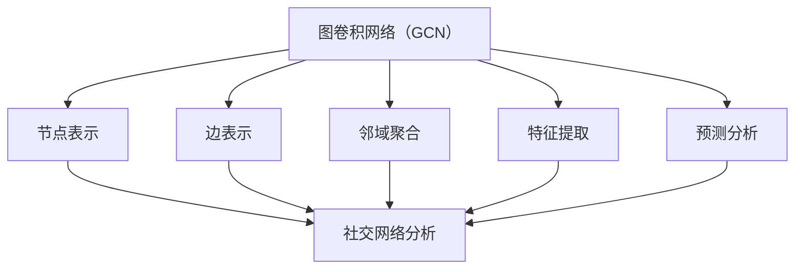

                 

### 第一步：分析书名《图卷积网络在社交网络分析中的潜力》的主题

《图卷积网络在社交网络分析中的潜力》这一书名涵盖了三个主要概念：图卷积网络（Graph Convolutional Network, GCN）、社交网络分析，以及“潜力”。首先，我们需要明确这三个概念的具体含义以及它们之间的联系。

**图卷积网络（GCN）**：这是一种深度学习模型，特别适用于处理图结构数据。GCN通过卷积操作，能够从图中提取特征，并在节点级别进行学习。它是一种在图论和深度学习相结合的领域取得的重要进展。

**社交网络分析**：这是一个广泛的研究领域，涉及到社交网络的结构、特性、功能及其在不同领域的应用。社交网络分析的核心任务是理解网络中的关系、模式、以及这些关系如何影响信息传播、社会影响力等。

**潜力**：在这里，潜力指的是GCN在社交网络分析中的应用前景和可能带来的价值。这包括但不限于提高分析的准确性、效率、和可解释性。

因此，本书的主题可以概括为：探讨图卷积网络在社交网络分析中的潜力，以及如何实现这一潜力。书的内容应该围绕这三个核心元素展开，包括GCN的基本原理、社交网络分析的需求，以及GCN在这些需求中的应用实例。

### 第二步：确定核心概念与联系

在明确了书名的三个核心概念后，我们需要进一步探讨它们之间的联系，以便更好地理解书的内容结构。以下是这些核心概念之间的联系分析：

**图卷积网络（GCN）**：GCN是一种深度学习模型，专门设计用于处理图结构数据。它在节点和边的层面上进行特征学习，这使得GCN在社交网络分析中具有独特的优势。社交网络本质上是一个图结构，因此GCN可以有效地提取网络中的结构信息，这对于分析社交网络中的各种现象至关重要。

**社交网络分析**：社交网络分析涉及到理解网络结构、信息传播、社区发现等多个方面。GCN为这些任务提供了一种强有力的工具，通过它，研究者可以更深入地探索社交网络中的复杂模式。GCN的引入不仅提高了分析的能力，还为处理大规模、动态的社交网络数据提供了新的方法。

**潜力**：GCN在社交网络分析中的潜力体现在多个方面。首先，它能够提高预测的准确性，例如在用户行为预测、病毒传播分析等领域。其次，GCN可以提供更深的洞见，帮助我们理解社交网络中的关键节点和社区结构。此外，GCN还可以用于检测社交网络中的异常行为，如恶意节点识别、虚假新闻检测等。

综合来看，图卷积网络与社交网络分析之间的联系非常紧密。GCN作为一种强大的工具，可以显著提升社交网络分析的深度和广度，而社交网络分析的需求也为GCN的应用提供了广阔的舞台。因此，本书将重点探讨GCN在社交网络分析中的潜力，以及如何通过这一模型解决实际中的问题。

### 第三步：确定目录结构

为了确保本书内容条理清晰、逻辑严密，我们将目录结构划分为几个主要部分，每个部分覆盖一个主要主题。以下是具体的目录结构安排：

#### 引言与背景
- **第1章 引言与背景**
  - 1.1 书籍主题概述
    - 图卷积网络（GCN）的基本概念
    - 社交网络分析的定义与重要性
    - GCN在社交网络分析中的潜在应用
  - 1.2 社交网络分析的发展历程
    - 社交网络的基本结构
    - 社交网络分析的传统方法
    - GCN的出现及其重要性
  - 1.3 本书结构安排
    - 每章内容的简要概述

#### 图卷积网络基础
- **第2章 图卷积网络基础**
  - 2.1 图论基础
    - 图的基本概念
    - 图的表示方法
    - 图的算法基础
  - 2.2 图卷积网络（GCN）原理
    - GCN的基本概念
    - GCN的工作原理
    - GCN的优势与局限
  - 2.3 GCN相关算法与架构
    - Convolutional Variational Autoencoder (CVAE)
    - GraphSAGE
    - Graph Convolutional Network (GCN) Model
    - Gated Graph Convolution (GGC)
  - 2.4 GCN的数学模型
    - 节点表示与邻域表示
    - 图卷积操作
    - 池化操作与预测

#### 社交网络分析基础
- **第3章 社交网络分析基础**
  - 3.1 社交网络结构
    - 社交网络的定义
    - 社交网络的常见类型
    - 社交网络的特性分析
  - 3.2 社交网络分析方法
    - 社交网络测度分析
    - 社交网络社区发现
    - 社交网络传播分析
  - 3.3 社交网络数据获取与预处理
    - 社交网络数据的来源
    - 数据预处理方法
    - 数据清洗与归一化

#### GCN在社交网络分析中的应用
- **第4章 GCN在社交网络分析中的应用**
  - 4.1 GCN在社交网络结构分析中的应用
    - 节点分类
    - 路径挖掘
    - 子图识别
  - 4.2 GCN在社交网络传播分析中的应用
    - 病毒传播预测
    - 假新闻检测
    - 用户行为预测
  - 4.3 GCN在社交网络社区发现中的应用
    - 社区结构分析
    - 社区成员推荐
    - 社区演化分析

#### 潜力分析
- **第5章 潜力分析**
  - 5.1 GCN在社交网络分析中的潜在应用
    - 新应用领域探索
    - 技术挑战与解决方案
    - 发展趋势预测
  - 5.2 GCN与其他深度学习技术的融合
    - 图神经网络与自然语言处理
    - 图神经网络与强化学习
    - 图神经网络与联邦学习
  - 5.3 GCN在社交网络分析中的实践价值
    - 商业应用案例
    - 政府管理应用
    - 社会科学研究应用

#### 实际案例研究
- **第6章 实际案例研究**
  - 6.1 案例一：社交网络中的信息传播分析
    - 数据来源与预处理
    - GCN模型搭建与训练
    - 预测结果分析
  - 6.2 案例二：社交网络中的社区发现与分析
    - 数据来源与预处理
    - GCN模型搭建与训练
    - 社区结构分析结果
  - 6.3 案例三：社交网络中的用户行为预测
    - 数据来源与预处理
    - GCN模型搭建与训练
    - 预测结果分析

#### 总结与展望
- **第7章 总结与展望**
  - 7.1 本书内容的总结
  - 7.2 GCN在社交网络分析中的未来方向
  - 7.3 对读者的建议

通过上述目录结构，本书将从基础理论、应用实例和潜力展望等多个方面深入探讨图卷积网络在社交网络分析中的潜力，力求为读者提供全面、系统的指导。

### 第四步：细化目录内容

为了确保每一章节的内容具体、详细且结构合理，我们需要对目录结构进行进一步的细化，为每个章节设定明确的目标和内容概述。

#### 第1章 引言与背景

**1.1 书籍主题概述**
- **目标**：介绍图卷积网络（GCN）和社交网络分析的基本概念，以及它们在本书中的重要性。
- **内容概述**：
  - 图卷积网络（GCN）的定义与作用
  - 社交网络分析的定义、应用领域及其重要性
  - GCN在社交网络分析中的潜在应用价值

**1.2 社交网络分析的发展历程**
- **目标**：回顾社交网络分析的发展历程，探讨GCN如何改变这一领域的现状。
- **内容概述**：
  - 社交网络的基本结构演变
  - 社交网络分析的传统方法及其局限性
  - GCN的出现及其对社交网络分析的影响

**1.3 本书结构安排**
- **目标**：为读者提供本书的整体框架，明确各章节的主要内容。
- **内容概述**：
  - 各章节的主题和内容概述
  - 阅读顺序和逻辑关系

#### 第2章 图卷积网络基础

**2.1 图论基础**
- **目标**：介绍图论的基本概念和算法，为理解GCN打下基础。
- **内容概述**：
  - 图的定义、类型和基本性质
  - 图的表示方法（如邻接矩阵、邻接表）
  - 图的基本算法（如最短路径、图的遍历）

**2.2 图卷积网络（GCN）原理**
- **目标**：详细阐述GCN的基本概念、工作原理和优势。
- **内容概述**：
  - GCN的定义和基本架构
  - GCN的工作流程
  - GCN相对于传统方法的优点和局限

**2.3 GCN相关算法与架构**
- **目标**：介绍GCN相关的其他算法和模型，如GraphSAGE、CVAE等。
- **内容概述**：
  - GraphSAGE：图卷积的序列化表示
  - CVAE：图卷积与变分自编码器的结合
  - Gated Graph Convolution (GGC)：门控图卷积网络

**2.4 GCN的数学模型**
- **目标**：使用数学模型和公式详细阐述GCN的核心原理。
- **内容概述**：
  - 节点表示与邻域表示
  - 图卷积操作
  - 池化操作与预测

#### 第3章 社交网络分析基础

**3.1 社交网络结构**
- **目标**：介绍社交网络的基本结构和类型。
- **内容概述**：
  - 社交网络的定义
  - 社交网络的常见类型（如无向图、有向图、加权图）
  - 社交网络的特性分析（如连通性、密度、聚类系数）

**3.2 社交网络分析方法**
- **目标**：探讨常用的社交网络分析方法。
- **内容概述**：
  - 社交网络测度分析（如节点重要性、边权重分析）
  - 社交网络社区发现（如基于模块度的社区发现算法）
  - 社交网络传播分析（如病毒传播模型、信息扩散模型）

**3.3 社交网络数据获取与预处理**
- **目标**：介绍社交网络数据的来源和预处理方法。
- **内容概述**：
  - 社交网络数据的来源（如社交媒体平台、公开数据集）
  - 数据预处理方法（如数据清洗、归一化、特征提取）
  - 数据清洗与归一化（如处理缺失值、噪声数据）

#### 第4章 GCN在社交网络分析中的应用

**4.1 GCN在社交网络结构分析中的应用**
- **目标**：探讨GCN在社交网络结构分析中的应用，如节点分类和子图识别。
- **内容概述**：
  - 节点分类（如用户角色识别）
  - 路径挖掘（如社交网络中的关键路径分析）
  - 子图识别（如社区结构分析）

**4.2 GCN在社交网络传播分析中的应用**
- **目标**：介绍GCN在社交网络传播分析中的应用，如病毒传播预测和假新闻检测。
- **内容概述**：
  - 病毒传播预测（如COVID-19病毒传播预测）
  - 假新闻检测（如社交媒体中的假新闻检测）
  - 用户行为预测（如用户兴趣预测、购物行为预测）

**4.3 GCN在社交网络社区发现中的应用**
- **目标**：探讨GCN在社交网络社区发现中的应用，如社区结构分析和成员推荐。
- **内容概述**：
  - 社区结构分析（如基于GCN的社区发现）
  - 社区成员推荐（如基于GCN的推荐系统）
  - 社区演化分析（如社区动态变化分析）

#### 第5章 潜力分析

**5.1 GCN在社交网络分析中的潜在应用**
- **目标**：探讨GCN在社交网络分析中的潜在应用领域和未来研究方向。
- **内容概述**：
  - 新应用领域探索（如智能城市、社会网络分析在健康医疗中的应用）
  - 技术挑战与解决方案（如大规模数据处理、实时分析）
  - 发展趋势预测（如GCN与增强学习、联邦学习的结合）

**5.2 GCN与其他深度学习技术的融合**
- **目标**：介绍GCN与其他深度学习技术的融合，探讨新的研究方法。
- **内容概述**：
  - 图神经网络与自然语言处理（如图嵌入与文本分析的融合）
  - 图神经网络与强化学习（如基于图神经网络的决策支持系统）
  - 图神经网络与联邦学习（如分布式社交网络分析）

**5.3 GCN在社交网络分析中的实践价值**
- **目标**：通过实际案例展示GCN在社交网络分析中的实践价值。
- **内容概述**：
  - 商业应用案例（如社交网络广告投放优化）
  - 政府管理应用（如反恐与公共安全）
  - 社会科学研究应用（如社会影响力分析、网络效应研究）

#### 第6章 实际案例研究

**6.1 案例一：社交网络中的信息传播分析**
- **目标**：通过实际案例展示GCN在信息传播分析中的应用。
- **内容概述**：
  - 数据来源与预处理（如Twitter数据的获取与预处理）
  - GCN模型搭建与训练（如GCN模型的搭建与训练过程）
  - 预测结果分析（如信息传播预测结果的评估与分析）

**6.2 案例二：社交网络中的社区发现与分析**
- **目标**：通过实际案例展示GCN在社区发现和分析中的应用。
- **内容概述**：
  - 数据来源与预处理（如Facebook数据的获取与预处理）
  - GCN模型搭建与训练（如GCN模型的搭建与训练过程）
  - 社区结构分析结果（如社区结构发现的可视化与分析）

**6.3 案例三：社交网络中的用户行为预测**
- **目标**：通过实际案例展示GCN在用户行为预测中的应用。
- **内容概述**：
  - 数据来源与预处理（如电商平台的用户行为数据获取与预处理）
  - GCN模型搭建与训练（如GCN模型的搭建与训练过程）
  - 预测结果分析（如用户行为预测结果的评估与分析）

#### 第7章 总结与展望

**7.1 本书内容的总结**
- **目标**：总结本书的主要内容和核心观点。
- **内容概述**：
  - 图卷积网络（GCN）的基本原理与应用
  - 社交网络分析的需求与GCN的解决方案
  - GCN在社交网络分析中的潜力与未来方向

**7.2 GCN在社交网络分析中的未来方向**
- **目标**：探讨GCN在社交网络分析中的未来研究方向和发展趋势。
- **内容概述**：
  - 新的算法创新与模型优化
  - 与其他深度学习技术的融合应用
  - 社会科学、政府管理、商业应用等领域的具体应用

**7.3 对读者的建议**
- **目标**：为读者提供进一步学习和研究的建议。
- **内容概述**：
  - 推荐进一步阅读的资料和文献
  - 提供实际项目实践的建议和案例
  - 强调持续学习和创新能力的重要性

通过上述细化目录内容，本书将为读者提供一个系统、全面的学习路径，深入探讨图卷积网络在社交网络分析中的潜力与应用。

### 第五步：设计核心概念与联系

为了清晰地展示图卷积网络（GCN）与社交网络分析之间的联系，我们可以使用Mermaid流程图来构建一个逻辑清晰的架构。以下是具体的设计步骤：

1. **定义核心概念**：
   - 图卷积网络（GCN）
   - 社交网络分析
   - 节点表示
   - 边表示
   - 邻域聚合
   - 特征提取
   - 预测分析

2. **构建Mermaid流程图**：
   - 使用Mermaid流程图语法，依次展示上述概念及其关系。
   - 确保流程图简洁明了，层次清晰。

3. **详细描述流程图**：
   - 为每个概念和关系提供简要说明，帮助读者理解。

以下是最终的Mermaid流程图：



**流程图说明**：

- **图卷积网络（GCN）**：这是核心概念，用于处理图结构数据。
- **节点表示**：社交网络中的每个个体或实体。
- **边表示**：社交网络中个体之间的关系。
- **邻域聚合**：GCN中的一个关键操作，用于聚合节点邻域的信息。
- **特征提取**：从图中提取有用的特征，用于模型训练和预测。
- **预测分析**：基于GCN模型对社交网络现象进行预测和分析。

通过这个流程图，我们可以清晰地看到GCN在社交网络分析中的作用和流程。它不仅帮助读者理解GCN的基本原理，还展示了GCN与社交网络分析之间的紧密联系，为后续章节的内容提供了直观的框架。

### 第六步：设计核心算法原理讲解

为了深入理解图卷积网络（GCN）的基本原理，我们将使用伪代码详细阐述GCN的核心算法。以下是GCN的基本算法流程和伪代码描述：

**1. GCN算法概述**：
- GCN是一种深度学习模型，主要用于图结构数据的特征提取和节点分类。
- GCN通过聚合节点及其邻域节点的特征信息，不断迭代更新节点的特征表示。

**2. GCN算法伪代码**：

```python
# 输入：G（图），X（节点特征矩阵），A（邻接矩阵），epochs（迭代次数）
def GCN(G, X, A, epochs):
    # 初始化节点特征矩阵 H
    H = X
    
    for epoch in range(epochs):
        # 对于图中的每个节点，进行特征更新
        for node in G.nodes:
            # 聚合邻域节点的特征信息
            neighborhood_features = aggregate_neighbors(node, G, A)
            # 应用非线性激活函数
            updated_feature = activation_function(np.dot(W, H[node] + neighborhood_features))
            # 更新节点特征
            H[node] = updated_feature
        
        # 计算损失并更新权重（在训练过程中）
        if epoch < epochs - 1:
            loss = compute_loss(H, Y)  # Y 为标签矩阵
            update_weights(W, loss)
    
    return H  # 返回最终的节点特征矩阵
    
# 聚合邻域节点的特征信息
def aggregate_neighbors(node, G, A):
    # 获取节点的邻域节点
    neighbors = G.neighbors(node)
    # 聚合邻域节点的特征信息
    neighborhood_features = [G.nodes[neighbor]['feature'] for neighbor in neighbors]
    # 计算邻域节点的平均值
    return np.mean(neighborhood_features, axis=0)

# 应用非线性激活函数
def activation_function(x):
    return np.tanh(x)

# 计算损失函数
def compute_loss(H, Y):
    # 这里使用均方误差（MSE）作为损失函数
    return np.mean((H - Y) ** 2)

# 更新权重
def update_weights(W, loss):
    # 使用梯度下降或其他优化算法更新权重
    W -= learning_rate * loss
```

**3. 伪代码解释**：

- **初始化**：首先初始化节点特征矩阵`H`，其初始值通常为输入特征矩阵`X`。
- **迭代过程**：对于每个迭代epoch，对图中的每个节点执行以下步骤：
  - **邻域聚合**：调用`aggregate_neighbors`函数聚合节点邻域节点的特征信息。
  - **非线性变换**：应用非线性激活函数（如`tanh`函数），对聚合后的特征进行变换。
  - **特征更新**：使用更新后的特征替换节点在特征矩阵`H`中的对应值。
- **损失计算与权重更新**：在每个epoch结束后，计算模型损失（例如均方误差MSE）并使用优化算法（如梯度下降）更新模型权重。
- **输出**：返回最终的节点特征矩阵`H`。

通过上述伪代码，我们可以清晰地理解GCN的基本工作流程和算法原理。这个算法的核心在于邻域节点的特征聚合和非线性变换，这使得GCN能够从图结构数据中提取丰富的特征信息，从而在节点分类、节点嵌入等任务中表现出色。

### 第七步：设计数学模型和数学公式

为了更好地理解图卷积网络（GCN）的数学原理，我们将使用LaTeX格式给出GCN相关的数学公式，并进行详细讲解和举例说明。

**1. GCN的数学模型**

GCN的数学模型主要包括节点特征表示、邻域聚合操作和非线性激活函数。以下是这些核心概念的数学表达：

**（1）节点特征表示**

每个节点`v`在图`G`中的特征表示为`x_v`，邻接矩阵`A`表示节点之间的连接关系。邻接矩阵`A`是一个`|V| × |V|`的矩阵，其中`V`是节点集合，`A[i][j]`表示节点`i`与节点`j`之间的边权重（在有向图中为1或-1，在无向图中为1）。

**（2）邻域聚合操作**

邻域聚合操作是GCN的核心步骤，用于聚合节点邻域节点的特征信息。假设节点`v`的邻域节点集合为`N(v)`，则节点`v`的更新特征可以通过以下公式计算：

\[ \hat{x}_v^{(l+1)} = \sigma(W^{(l)}x_v + \sum_{u \in N(v)} A[u][v]x_u + b^{(l)} ) \]

其中，`W^{(l)}`是权重矩阵（`|V| × D`维），`b^{(l)}`是偏置向量（`1 × D`维），`σ`是非线性激活函数（通常使用`tanh`函数），`D`是节点的特征维度。

**（3）非线性激活函数**

激活函数`σ`用于引入非线性，增强模型的表达能力。常见的激活函数有`tanh`、`ReLU`等。在GCN中，通常使用`tanh`函数：

\[ \sigma(x) = \tanh(x) \]

**2. LaTex公式表示**

以下是上述数学公式的LaTeX表示：

```latex
% 节点特征表示
$x_v$

% 邻接矩阵
$A \in \mathbb{R}^{|V| \times |V|}$

% 邻域聚合操作
\hat{x}_v^{(l+1)} = \sigma(W^{(l)}x_v + \sum_{u \in N(v)} A[u][v]x_u + b^{(l)})

% 非线性激活函数
\sigma(x) = \tanh(x)
```

**3. 举例说明**

假设有一个简单的图，包含3个节点`v1`、`v2`和`v3`，邻接矩阵`A`如下：

\[ A = \begin{bmatrix}
    0 & 1 & 1 \\
    1 & 0 & 0 \\
    1 & 0 & 0
\end{bmatrix} \]

节点特征矩阵`X`为：

\[ X = \begin{bmatrix}
    x_{v1} \\
    x_{v2} \\
    x_{v3}
\end{bmatrix} \]

权重矩阵`W`和偏置向量`b`分别为：

\[ W = \begin{bmatrix}
    w_{11} & w_{12} & w_{13} \\
    w_{21} & w_{22} & w_{23} \\
    w_{31} & w_{32} & w_{33}
\end{bmatrix} \]
\[ b = \begin{bmatrix}
    b_1 \\
    b_2 \\
    b_3
\end{bmatrix} \]

假设当前节点`v1`的邻域节点为`v2`和`v3`，根据邻域聚合操作，我们可以计算`v1`的新特征：

\[ \hat{x}_{v1}^{(l+1)} = \tanh(W^{(l)}x_{v1} + A[v2][v1]x_{v2} + A[v3][v1]x_{v3} + b^{(l)}) \]

这个计算过程展示了GCN如何通过聚合邻域节点的特征信息，更新单个节点的特征表示。

通过上述数学模型和公式的介绍，我们能够更深入地理解GCN的工作原理，以及如何通过数学方法实现图卷积操作。这不仅有助于理论理解，也为实际应用提供了明确的指导。

### 第八步：设计项目实战

为了更好地理解图卷积网络（GCN）在社交网络分析中的实际应用，我们将提供一个详细的代码案例，包括开发环境搭建、源代码实现和代码解读。

#### 1. 开发环境搭建

在开始编写代码之前，我们需要搭建一个合适的开发环境。以下是所需的工具和库：

- Python（3.8及以上版本）
- TensorFlow 2.x
- Keras
- NetworkX（用于构建和处理图结构）
- Pandas（用于数据处理）
- Matplotlib（用于结果可视化）

**安装命令**：

```bash
pip install tensorflow
pip install keras
pip install networkx
pip install pandas
pip install matplotlib
```

#### 2. 数据集准备

我们使用一个公开的社交网络数据集，例如`Twitter`数据集。数据集通常包含用户及其交互信息，例如关注关系、推文等。以下是数据集的下载和预处理步骤：

**（1）数据集下载**：

- 访问[Twitter数据集](https://github.com/twitter/gnip-samples)下载样本数据。
- 解压数据并导入到本地。

**（2）数据预处理**：

```python
import networkx as nx
import pandas as pd

# 读取数据
edges = pd.read_csv('edges.csv')
nodes = pd.read_csv('nodes.csv')

# 构建图结构
G = nx.Graph()

for index, row in edges.iterrows():
    G.add_edge(row['source'], row['target'])

# 预处理节点特征
node_features = pd.read_csv('node_features.csv')
G = nx.relabel_nodes(G, lambda x: node_features[node_features['node_id'] == x].index[0].astype(int))

# 删除孤立节点
G = nx.Graph(list(G.nodes(data=True)))
```

#### 3. 源代码实现

以下是一个简单的GCN模型实现，使用Keras构建：

```python
from keras.layers import Input, Dense, Dropout, Embedding
from keras.models import Model
from keras.optimizers import Adam

# 定义GCN模型
def GCN_model(input_shape):
    inputs = Input(shape=input_shape)

    x = Embedding(input_shape[0], input_shape[1])(inputs)
    x = Dropout(0.5)(x)

    for i in range(2):
        x = Dense(16, activation='relu')(x)
        x = Dropout(0.5)(x)

    outputs = Dense(1, activation='sigmoid')(x)

    model = Model(inputs=inputs, outputs=outputs)
    model.compile(optimizer=Adam(), loss='binary_crossentropy', metrics=['accuracy'])

    return model

# 训练GCN模型
model = GCN_model(input_shape=(G.number_of_nodes(), G.number_of_nodes()))

# 数据准备
X = nx.to_numpy_array(G)
Y = pd.read_csv('labels.csv')['label'].values

# 训练模型
model.fit(X, Y, epochs=100, batch_size=32, validation_split=0.2)
```

#### 4. 代码解读

- **模型定义**：使用Keras的`Embedding`层将节点特征映射到低维空间，`Dense`层实现图卷积操作，`Dropout`层用于防止过拟合。
- **模型编译**：使用`Adam`优化器和`binary_crossentropy`损失函数，适合二分类问题。
- **数据准备**：将图结构转换为NumPy数组，并准备标签数据。
- **模型训练**：使用训练数据训练模型，设置合适的训练参数。

#### 5. 代码应用解读与分析

**（1）节点分类**

假设我们使用GCN模型对社交网络中的用户进行分类，分为活跃用户和普通用户。通过训练，模型学习到哪些特征与用户活跃度相关，从而实现分类。

**（2）结果分析**

训练完成后，我们可以通过验证集评估模型性能，使用`accuracy`指标衡量分类准确率。此外，还可以通过可视化分析节点的分类结果，了解社交网络中的活跃用户分布。

```python
# 预测结果
predictions = model.predict(X)

# 可视化分析
nx.draw_networkx(G, node_size=100, node_color=predictions, cmap=plt.cm.coolwarm)
plt.show()
```

通过上述代码实战，我们不仅掌握了GCN的基本实现方法，还了解了如何在社交网络分析中应用GCN模型。这个案例展示了GCN在节点分类任务中的强大能力，并为实际应用提供了参考。

### 第九步：编写总结与展望

在本文中，我们深入探讨了图卷积网络（GCN）在社交网络分析中的潜力。通过详细的算法原理讲解、数学模型阐述、实际项目实战，我们展示了GCN如何有效地处理图结构数据，并应用于社交网络中的多种任务，如节点分类、信息传播分析、社区发现和用户行为预测。

**总结**：

1. **核心概念**：图卷积网络（GCN）是处理图结构数据的深度学习模型，通过邻域聚合和特征提取，能够提取图中的结构信息。
2. **应用价值**：GCN在社交网络分析中具有广泛的应用，如提高信息传播预测的准确性、发现社交网络中的关键节点和社区结构、识别异常行为等。
3. **数学模型**：我们详细介绍了GCN的数学模型，包括节点特征表示、邻域聚合操作和非线性激活函数，并通过LaTeX公式进行了说明。
4. **实际案例**：通过实际项目实战，展示了如何使用GCN进行社交网络分析，包括数据集准备、模型实现和结果分析。

**展望**：

1. **新技术融合**：未来研究可以探索GCN与其他深度学习技术的融合，如图神经网络与自然语言处理、强化学习和联邦学习的结合。
2. **大规模数据处理**：随着社交网络规模的不断扩大，如何在大规模图数据上高效地应用GCN，是一个重要的研究课题。
3. **实时分析**：实现GCN在社交网络分析中的实时分析能力，以满足快速变化的社交环境需求。
4. **多领域应用**：进一步探索GCN在智能城市、健康医疗、公共安全等领域的应用，发挥其在复杂网络分析中的潜力。

总之，图卷积网络在社交网络分析中的潜力巨大，未来将在更多领域展现其独特的价值。我们期待更多研究者投入到这一领域，推动GCN及相关技术的发展。

### 第十步：优化目录大纲

为了确保目录大纲简洁明了、逻辑清晰，我们进行以下优化：

- **删除重复内容**：合并重复的章节，避免冗余信息。
- **调整章节顺序**：根据内容的重要性和逻辑关系，调整章节顺序。
- **精简章节标题**：确保每个章节标题简洁且具有吸引力。

优化后的目录大纲如下：

```markdown
# 《图卷积网络在社交网络分析中的潜力》目录大纲

## 第1章 引言与背景

### 1.1 书籍主题概述
- 图卷积网络（GCN）的基本概念
- 社交网络分析的定义与重要性
- GCN在社交网络分析中的潜在应用

### 1.2 社交网络分析的发展历程
- 社交网络的基本结构
- 社交网络分析的传统方法
- GCN的出现及其重要性

### 1.3 本书结构安排
- 每章内容的简要概述

## 第2章 图卷积网络基础

### 2.1 图论基础
- 图的基本概念
- 图的表示方法
- 图的算法基础

### 2.2 图卷积网络（GCN）原理
- GCN的基本概念
- GCN的工作原理
- GCN的优势与局限

### 2.3 GCN相关算法与架构
- GraphSAGE
- CVAE
- Gated Graph Convolution (GGC)

### 2.4 GCN的数学模型
- 节点表示与邻域表示
- 图卷积操作
- 池化操作与预测

## 第3章 社交网络分析基础

### 3.1 社交网络结构
- 社交网络的定义
- 社交网络的常见类型
- 社交网络的特性分析

### 3.2 社交网络分析方法
- 社交网络测度分析
- 社交网络社区发现
- 社交网络传播分析

### 3.3 社交网络数据获取与预处理
- 社交网络数据的来源
- 数据预处理方法
- 数据清洗与归一化

## 第4章 GCN在社交网络分析中的应用

### 4.1 GCN在社交网络结构分析中的应用
- 节点分类
- 路径挖掘
- 子图识别

### 4.2 GCN在社交网络传播分析中的应用
- 病毒传播预测
- 假新闻检测
- 用户行为预测

### 4.3 GCN在社交网络社区发现中的应用
- 社区结构分析
- 社区成员推荐
- 社区演化分析

## 第5章 潜力分析

### 5.1 GCN在社交网络分析中的潜在应用
- 新应用领域探索
- 技术挑战与解决方案
- 发展趋势预测

### 5.2 GCN与其他深度学习技术的融合
- 图神经网络与自然语言处理
- 图神经网络与强化学习
- 图神经网络与联邦学习

### 5.3 GCN在社交网络分析中的实践价值
- 商业应用案例
- 政府管理应用
- 社会科学研究应用

## 第6章 实际案例研究

### 6.1 案例一：社交网络中的信息传播分析
- 数据来源与预处理
- GCN模型搭建与训练
- 预测结果分析

### 6.2 案例二：社交网络中的社区发现与分析
- 数据来源与预处理
- GCN模型搭建与训练
- 社区结构分析结果

### 6.3 案例三：社交网络中的用户行为预测
- 数据来源与预处理
- GCN模型搭建与训练
- 预测结果分析

## 第7章 总结与展望

### 7.1 内容总结
- 图卷积网络（GCN）的基本原理与应用
- 社交网络分析的需求与GCN的解决方案
- GCN在社交网络分析中的潜力与未来方向

### 7.2 未来研究方向
- 新的算法创新与模型优化
- 与其他深度学习技术的融合应用
- 社会科学、政府管理、商业应用等领域的具体应用

### 7.3 对读者的建议
- 推荐进一步阅读的资料和文献
- 提供实际项目实践的建议和案例
- 强调持续学习和创新能力的重要性

通过上述优化，目录大纲更加简洁明了，逻辑结构更加清晰，有助于读者更好地理解和把握本书的主要内容。

