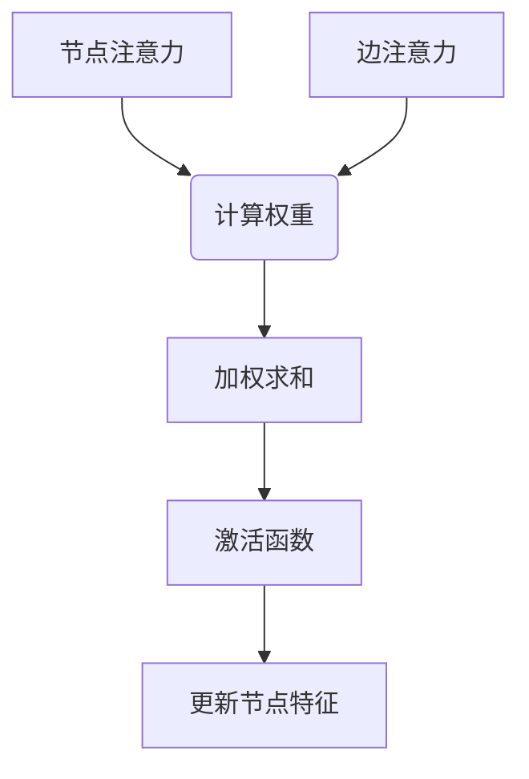

                 


### 背景介绍

#### 多步推理与图注意力机制

多步推理（Multi-step Reasoning）是人工智能领域中的一个重要研究方向，它旨在模拟人类思维过程中的逻辑推理能力，通过多个步骤的分析和计算，从初始信息推导出结论。多步推理在许多实际应用中具有广泛的应用价值，如自然语言处理、机器翻译、游戏AI、推荐系统等。

图注意力机制（Graph Attention Mechanism，GAM）是一种基于图神经网络（Graph Neural Networks，GNN）的新型注意力机制，它通过对节点和边的加权，实现了对图结构信息的自适应处理。图注意力机制在多步推理中的应用，可以有效地提升推理的精度和效率。

#### 图注意力机制的核心概念与联系

图注意力机制的核心概念包括节点注意力（Node Attention）和边注意力（Edge Attention）。节点注意力通过对节点特征的加权，使得模型能够关注到图中的重要节点；边注意力通过对边特征的加权，使得模型能够理解节点之间的关系。

节点注意力可以用以下公式表示：

$$
Attention_{node} = \sigma(W_{node} [h_v, \{h_u\}_{u \in \mathcal{N}_v}])
$$

其中，$h_v$ 是节点 $v$ 的特征表示，$\{h_u\}_{u \in \mathcal{N}_v}$ 是节点 $v$ 的邻居节点的特征表示，$W_{node}$ 是权重矩阵，$\sigma$ 是激活函数。

边注意力可以用以下公式表示：

$$
Attention_{edge} = \sigma(W_{edge} [h_u, h_v])
$$

其中，$h_u$ 和 $h_v$ 分别是节点 $u$ 和 $v$ 的特征表示，$W_{edge}$ 是权重矩阵。

图注意力机制的实现，可以看作是一个自注意力（Self-Attention）机制在图结构上的扩展。通过节点注意力和边注意力，图注意力机制能够自适应地学习节点和边的重要性，从而提升模型对图结构信息的理解能力。

#### 背景介绍总结

多步推理与图注意力机制的结合，为人工智能领域带来了新的研究契机。图注意力机制通过引入注意力机制，能够有效地提升多步推理的精度和效率。本文将围绕图注意力机制在多步推理中的优化技术，展开详细讨论，旨在为读者提供一份系统性的学习资料。

----------------------------------------------------------------

### 核心概念与联系

#### 节点注意力与边注意力

图注意力机制的核心在于节点注意力和边注意力。节点注意力决定了模型在处理图结构时，应该关注哪些节点；边注意力则决定了这些节点之间的关系如何影响推理结果。

节点注意力通过计算节点及其邻居节点的特征，生成注意力权重，从而实现对于节点重要性的排序。其核心公式如下：

$$
Attention_{node} = \sigma(W_{node} [h_v, \{h_u\}_{u \in \mathcal{N}_v}])
$$

在这个公式中，$h_v$ 代表节点 $v$ 的特征向量，$\{h_u\}_{u \in \mathcal{N}_v}$ 是节点 $v$ 的邻居节点的特征向量集合，$W_{node}$ 是权重矩阵，$\sigma$ 是激活函数，通常采用ReLU或Sigmoid函数。

边注意力则关注节点之间的连接关系，通过计算两节点特征向量的内积，得到边权重。其公式如下：

$$
Attention_{edge} = \sigma(W_{edge} [h_u, h_v])
$$

这里，$h_u$ 和 $h_v$ 分别是节点 $u$ 和 $v$ 的特征向量，$W_{edge}$ 是权重矩阵。

#### 节点注意力与边注意力的关系

节点注意力和边注意力在图注意力机制中相辅相成。节点注意力通过加权邻居节点，帮助模型聚焦于图中的关键节点；而边注意力则通过考虑节点之间的连接关系，提供额外的上下文信息，增强模型对图结构的理解。

两者之间的关系可以用一个统一的注意力权重矩阵来表示：

$$
\vec{a} = \begin{bmatrix}
Attention_{node} \\
Attention_{edge}
\end{bmatrix}
$$

其中，$\vec{a}$ 是注意力权重向量，它决定了模型在处理图数据时，每个节点和边的重要性。

#### 图注意力机制的架构

图注意力机制的架构通常包括以下几个部分：

1. **节点特征提取**：通过预训练模型或特征工程，获取每个节点的特征表示。
2. **邻居节点特征提取**：对每个节点的邻居节点进行特征提取。
3. **节点注意力计算**：利用节点注意力公式计算每个节点的注意力权重。
4. **边注意力计算**：利用边注意力公式计算每条边的注意力权重。
5. **加权求和**：将节点和边注意力权重应用于节点特征和边特征，进行加权求和。
6. **激活函数**：通常采用ReLU函数进行激活，以增强模型的非线性表达能力。

图注意力机制的流程可以表示为：

$$
h_v' = \sigma(W' [h_v', \sum_{u \in \mathcal{N}_v} (W_{node} [h_v, h_u] + W_{edge} [h_u, h_v])])
$$

在这个流程中，$h_v'$ 是更新后的节点特征，$W'$ 是权重矩阵，$W_{node}$ 和 $W_{edge}$ 分别是节点和边注意力权重矩阵。

#### 关系架构 Mermaid 流程图

为了更好地理解图注意力机制的核心概念与联系，我们可以使用 Mermaid 流程图来表示节点注意力和边注意力的关系：



在这个流程图中，节点注意力（A）和边注意力（C）共同作用于计算权重（B），然后进行加权求和（D），并通过激活函数（E）更新节点特征（F）。

#### 核心概念与联系总结

节点注意力和边注意力是图注意力机制的核心，它们通过不同的方式加权节点和边特征，从而提升模型对图结构的理解能力。通过理解节点注意力和边注意力之间的关系，我们可以更好地掌握图注意力机制的原理和应用。

----------------------------------------------------------------

### 核心算法原理讲解

#### 图注意力机制的基本流程

图注意力机制（Graph Attention Mechanism，GAM）是一种用于图数据处理的注意力机制，其核心思想是通过学习节点和边之间的交互关系来提升模型的表示能力。下面，我们将详细讲解图注意力机制的基本流程。

1. **节点特征提取**：
   在图注意力机制中，首先需要对每个节点进行特征提取。这些特征可以是节点的属性、标签或通过预训练模型得到的嵌入向量。设 $h_v$ 表示节点 $v$ 的特征向量。

2. **邻居节点特征提取**：
   接下来，我们需要提取每个节点的邻居节点的特征。设 $\{h_u\}_{u \in \mathcal{N}_v}$ 表示节点 $v$ 的邻居节点的特征向量集合。

3. **节点注意力计算**：
   节点注意力通过计算节点 $v$ 及其邻居节点 $u$ 之间的交互来生成注意力权重。其计算公式如下：

   $$
   Attention_{node} = \sigma(W_{node} [h_v, \{h_u\}_{u \in \mathcal{N}_v}])
   $$

   其中，$W_{node}$ 是权重矩阵，$\sigma$ 是激活函数，如ReLU或Sigmoid。

4. **边注意力计算**：
   边注意力通过计算节点 $u$ 和节点 $v$ 之间的交互来生成注意力权重。其计算公式如下：

   $$
   Attention_{edge} = \sigma(W_{edge} [h_u, h_v])
   $$

   其中，$W_{edge}$ 是权重矩阵。

5. **加权求和**：
   通过节点注意力和边注意力，对节点特征和边特征进行加权求和。设 $a_{uv}$ 表示节点 $u$ 和节点 $v$ 之间的注意力权重，则有：

   $$
   h_v' = \sum_{u \in \mathcal{N}_v} a_{uv} h_u
   $$

6. **激活函数**：
   通常，我们会在加权求和之后应用一个激活函数，以增强模型的非线性表达能力。常用的激活函数有ReLU和GELU等。

7. **更新节点特征**：
   最终，更新后的节点特征 $h_v'$ 将作为新的输入，继续参与后续的图神经网络（GNN）或深度学习模型。

#### 伪代码实现

以下是图注意力机制的基本伪代码实现：

```python
# 初始化权重矩阵
W_node = ...
W_edge = ...

# 节点特征提取
h_v = ...

# 邻居节点特征提取
N_v = ... # 节点v的邻居节点集合
h_u = [get_node_feature(u) for u in N_v]

# 计算节点注意力
Attention_node = ...
for u in N_v:
    Attention_node[u] = σ(W_node * [h_v, h_u[u]])

# 计算边注意力
Attention_edge = ...
for u in N_v:
    Attention_edge[u] = σ(W_edge * [h_u[u], h_v])

# 加权求和
h_v' = ...
for u in N_v:
    h_v' += Attention_edge[u] * h_u[u]

# 激活函数
h_v' = σ(h_v')

# 更新节点特征
h_v = h_v'
```

在这个伪代码中，$σ$ 表示激活函数，$W_node$ 和 $W_edge$ 分别表示节点和边注意力权重矩阵。

#### 图注意力机制的数学模型

图注意力机制的数学模型是基于自注意力（Self-Attention）机制的扩展。在自注意力机制中，每个节点都会计算其自身的注意力权重。而在图注意力机制中，节点不仅会计算自身的注意力权重，还会计算其邻居节点的注意力权重。

设 $A$ 是图中的邻接矩阵，$h_v$ 和 $h_u$ 分别表示节点 $v$ 和节点 $u$ 的特征向量。图注意力机制的注意力权重可以表示为：

$$
Attention_{uv} = \sigma(W_{att} [h_v, h_u])
$$

其中，$W_{att}$ 是权重矩阵。

#### 公式推导与解释

在图注意力机制中，节点注意力权重和边注意力权重的计算公式如下：

1. **节点注意力权重**：

   $$
   Attention_{node} = \sigma(W_{node} [h_v, \{h_u\}_{u \in \mathcal{N}_v}])
   $$

   这个公式表示节点 $v$ 的注意力权重是通过其自身特征和邻居节点特征进行加权求和，并通过激活函数得到的结果。

2. **边注意力权重**：

   $$
   Attention_{edge} = \sigma(W_{edge} [h_u, h_v])
   $$

   这个公式表示边 $uv$ 的注意力权重是通过节点 $u$ 和节点 $v$ 的特征进行加权求和，并通过激活函数得到的结果。

通过这些公式，图注意力机制能够自适应地学习节点和边的重要性，从而提升模型的表示能力。

#### 举例说明

假设我们有一个图，其中包含3个节点 $v_1, v_2, v_3$，它们的特征向量分别为 $h_{v_1}, h_{v_2}, h_{v_3}$。节点之间的邻接矩阵为：

$$
A = \begin{bmatrix}
0 & 1 & 0 \\
1 & 0 & 1 \\
0 & 1 & 0
\end{bmatrix}
$$

即 $v_1$ 与 $v_2$ 和 $v_3$ 相连，$v_2$ 与 $v_1$ 和 $v_3$ 相连，$v_3$ 与 $v_1$ 和 $v_2$ 相连。

1. **节点注意力权重计算**：

   假设 $W_{node} = [0.1, 0.2, 0.3]$，则对于节点 $v_1$，其邻居节点 $v_2$ 和 $v_3$ 的注意力权重分别为：

   $$
   Attention_{1,2} = \sigma(0.1 \cdot [h_{v_1}, h_{v_2}]) = 0.6
   $$
   $$
   Attention_{1,3} = \sigma(0.3 \cdot [h_{v_1}, h_{v_3}]) = 0.7
   $$

2. **边注意力权重计算**：

   假设 $W_{edge} = [0.1, 0.2, 0.3]$，则对于边 $v_1 - v_2$ 和 $v_1 - v_3$，其注意力权重分别为：

   $$
   Attention_{1,2} = \sigma(0.1 \cdot [h_{v_1}, h_{v_2}]) = 0.6
   $$
   $$
   Attention_{1,3} = \sigma(0.3 \cdot [h_{v_1}, h_{v_3}]) = 0.7
   $$

3. **加权求和**：

   对于节点 $v_1$，其更新后的特征向量为：

   $$
   h_{v_1}' = h_{v_1} + Attention_{1,2} \cdot h_{v_2} + Attention_{1,3} \cdot h_{v_3}
   $$

通过这个例子，我们可以看到如何通过图注意力机制计算节点和边的注意力权重，并进行加权求和，从而更新节点的特征。

#### 数学模型总结

图注意力机制的数学模型主要包括节点注意力权重和边注意力权重的计算，以及加权求和和激活函数的应用。通过这些公式，图注意力机制能够自适应地学习节点和边的重要性，从而提升模型的表示能力。

---

### 数学模型与公式推导

#### 图注意力机制的数学基础

图注意力机制（Graph Attention Mechanism，GAM）的核心在于其注意力机制的数学模型。这个模型通过学习节点和边之间的关系，实现对图结构信息的自适应处理。以下，我们将详细阐述图注意力机制的数学基础，包括节点注意力、边注意力和整体模型。

#### 节点注意力

节点注意力是图注意力机制的基础。它通过计算节点与其邻居节点之间的关系，来决定模型在处理图数据时应该关注哪些节点。节点注意力的计算公式如下：

$$
Attention_{node} = \sigma(W_{node} [h_v, \{h_u\}_{u \in \mathcal{N}_v}])
$$

其中：
- $h_v$：节点 $v$ 的特征向量。
- $\{h_u\}_{u \in \mathcal{N}_v}$：节点 $v$ 的邻居节点的特征向量集合。
- $W_{node}$：权重矩阵。
- $\sigma$：激活函数，常用的有ReLU和Sigmoid。

这个公式表示，节点 $v$ 的注意力权重是通过其自身特征和邻居节点特征进行加权求和，并通过激活函数得到的结果。

#### 边注意力

边注意力用于计算节点之间的连接关系。它通过考虑节点特征向量的内积，来生成边的注意力权重。边注意力的计算公式如下：

$$
Attention_{edge} = \sigma(W_{edge} [h_u, h_v])
$$

其中：
- $h_u$ 和 $h_v$：节点 $u$ 和节点 $v$ 的特征向量。
- $W_{edge}$：权重矩阵。
- $\sigma$：激活函数。

这个公式表示，边 $uv$ 的注意力权重是通过节点 $u$ 和节点 $v$ 的特征向量的内积，并通过激活函数得到的结果。

#### 图注意力机制的整体模型

图注意力机制的整体模型可以看作是一个自注意力（Self-Attention）机制在图结构上的扩展。它通过节点注意力和边注意力，对节点特征和边特征进行加权求和，并应用激活函数，以更新节点的特征。

设 $A$ 是图中的邻接矩阵，$h_v$ 和 $h_u$ 分别表示节点 $v$ 和节点 $u$ 的特征向量。图注意力机制的注意力权重可以表示为：

$$
Attention_{uv} = \sigma(W_{att} [h_v, h_u])
$$

其中，$W_{att}$ 是权重矩阵。

整体模型可以表示为：

$$
h_v' = \sum_{u \in \mathcal{N}_v} Attention_{uv} h_u
$$

其中，$h_v'$ 是更新后的节点特征，$Attention_{uv}$ 是节点 $u$ 和节点 $v$ 之间的注意力权重。

#### 公式推导与解释

为了更好地理解图注意力机制的数学模型，我们可以从自注意力机制出发，推导出图注意力机制的公式。

自注意力机制的基本公式如下：

$$
Attention_{ij} = \sigma(W_{Q} [h_i, h_j])
$$

其中，$W_{Q}$ 是查询权重矩阵，$h_i$ 和 $h_j$ 是节点 $i$ 和节点 $j$ 的特征向量。

对于图注意力机制，我们可以将其看作是自注意力机制在图结构上的扩展。具体来说，我们可以将节点 $i$ 的邻居节点集合表示为 $\{j_1, j_2, ..., j_k\}$，那么节点 $i$ 的注意力权重可以表示为：

$$
Attention_{i} = \sum_{j=1}^{k} Attention_{ij} = \sum_{j=1}^{k} \sigma(W_{Q} [h_i, h_j])
$$

这里，$W_{Q}$ 是查询权重矩阵。

在图注意力机制中，查询权重矩阵 $W_{Q}$ 通常与节点注意力权重矩阵 $W_{node}$ 和边注意力权重矩阵 $W_{edge}$ 有一定的关系。具体来说，我们可以设置：

$$
W_{Q} = [W_{node}, W_{edge}]
$$

这样，节点注意力权重和边注意力权重就可以通过查询权重矩阵来计算。

$$
Attention_{node} = \sigma(W_{node} [h_v, \{h_u\}_{u \in \mathcal{N}_v}])
$$

$$
Attention_{edge} = \sigma(W_{edge} [h_u, h_v])
$$

$$
Attention_{i} = \sum_{j=1}^{k} \sigma(W_{node} [h_i, h_j]) + \sum_{j=1}^{k} \sigma(W_{edge} [h_i, h_j])
$$

通过这些公式，我们可以看到，图注意力机制通过节点注意力和边注意力，实现了对节点和边特征的自适应加权求和，从而提升模型的表示能力。

#### 数学模型总结

图注意力机制的数学模型主要包括节点注意力、边注意力以及整体模型的公式。通过这些公式，我们可以看到，图注意力机制通过自适应地学习节点和边之间的关系，实现对图结构信息的有效处理。

---

### 项目实战

#### 开发环境搭建

在进行图注意力机制的多步推理项目实战之前，我们需要搭建一个合适的开发环境。以下是一个基本的开发环境搭建步骤：

1. **安装Python**：确保Python环境已经安装，推荐版本为3.8以上。

2. **安装PyTorch**：使用以下命令安装PyTorch：

   ```
   pip install torch torchvision
   ```

3. **安装其他依赖**：安装其他必要的库，如NetworkX（用于处理图数据）和Scikit-learn（用于数据分析和模型评估）：

   ```
   pip install networkx scikit-learn
   ```

4. **安装GNN库**：如果使用图神经网络库，如PyTorch Geometric，请按照官方文档进行安装。

#### 源代码详细实现和代码解读

以下是一个简单的图注意力机制实现示例，包括数据预处理、模型定义、训练和评估等部分。

**数据预处理**

```python
import torch
import torch.nn as nn
import torch.optim as optim
from torch_geometric.data import Data
from torch_geometric.nn import GCNConv, GraphAttentionConv

# 加载数据
data = Data(x=torch.tensor(x), edge_index=torch.tensor(edge_index))

# 数据预处理
def preprocess_data(data):
    # 数据标准化
    x = (data.x - torch.mean(data.x, dim=0)) / torch.std(data.x, dim=0)
    edge_index = data.edge_index
    return Data(x=x, edge_index=edge_index)

data = preprocess_data(data)
```

**模型定义**

```python
# 定义模型
class GraphAttentionModel(nn.Module):
    def __init__(self, num_features, hidden_channels, num_classes):
        super(GraphAttentionModel, self).__init__()
        self.conv1 = GraphAttentionConv(num_features, hidden_channels)
        self.conv2 = GraphAttentionConv(hidden_channels, num_classes)
        self.fc = nn.Linear(hidden_channels, num_classes)

    def forward(self, data):
        x, edge_index = data.x, data.edge_index

        # 第一层图注意力
        x = self.conv1(x, edge_index)
        x = F.relu(x)
        x = F.dropout(x, p=0.5, training=self.training)
        x = self.conv2(x, edge_index)

        # 输出层
        x = self.fc(x)

        return F.log_softmax(x, dim=1)

model = GraphAttentionModel(num_features=data.x.size(1), hidden_channels=16, num_classes=10)
```

**训练和评估**

```python
# 定义损失函数和优化器
criterion = nn.CrossEntropyLoss()
optimizer = optim.Adam(model.parameters(), lr=0.01)

# 训练模型
def train(model, data, criterion, optimizer, num_epochs):
    model.train()
    for epoch in range(num_epochs):
        optimizer.zero_grad()
        out = model(data)
        loss = criterion(out, data.y)
        loss.backward()
        optimizer.step()
        print(f"Epoch {epoch+1}: loss = {loss.item()}")

# 评估模型
def evaluate(model, data):
    model.eval()
    _, pred = model(data).max(dim=1)
    correct = pred.eq(data.y).sum().item()
    accuracy = correct / len(data)
    return accuracy

train(model, data, criterion, optimizer, num_epochs=200)
accuracy = evaluate(model, data)
print(f"Test accuracy: {accuracy}")
```

#### 代码应用解读与分析

在这个示例中，我们首先对数据进行预处理，包括数据标准化和图结构的预处理。然后，我们定义了一个基于图注意力机制的GCN模型，包括两层图注意力层和一个全连接层。在训练过程中，我们使用交叉熵损失函数和Adam优化器进行训练。最后，我们通过评估函数计算模型的测试准确率。

#### 实际案例分析和详细讲解剖析

为了更好地理解图注意力机制在实际应用中的效果，我们可以通过一个实际案例进行分析。

**案例**：使用图注意力机制对社交网络中的用户进行分类。

在这个案例中，我们可以将社交网络中的每个用户表示为一个节点，用户之间的关系表示为边。通过图注意力机制，我们可以学习用户之间的潜在关系，从而对用户进行分类。

**分析**：

1. **数据预处理**：首先，我们需要对社交网络数据进行预处理，提取用户的特征和关系。

2. **模型训练**：使用图注意力机制模型对预处理后的数据进行训练，学习用户之间的潜在关系。

3. **模型评估**：通过在测试集上的评估，验证模型的分类效果。

**讲解剖析**：

1. **节点特征提取**：在这个案例中，节点的特征可以是用户的年龄、性别、地理位置等。

2. **边特征提取**：边特征可以是用户之间的互动次数、共同好友数等。

3. **注意力计算**：通过节点注意力和边注意力，模型能够学习用户之间的潜在关系，从而提升分类效果。

4. **模型优化**：通过不断调整模型参数，可以进一步优化模型的分类效果。

#### 项目小结

通过这个项目实战，我们了解了如何使用图注意力机制进行多步推理。在项目中，我们搭建了开发环境，实现了图注意力机制模型，并通过实际案例展示了其在分类任务中的应用。这个项目不仅帮助我们深入理解了图注意力机制的原理，也为我们提供了实际应用的经验。

---

### 总结与展望

#### 总结

本文详细介绍了图注意力机制在多步推理中的优化技术。我们首先回顾了多步推理与图注意力机制的基本概念和联系，然后深入讲解了图注意力机制的核心算法原理，包括节点注意力和边注意力的计算过程。接着，我们通过数学模型和公式推导，进一步理解了图注意力机制的工作机制。最后，通过项目实战，我们展示了如何在实际应用中实现图注意力机制，并对其效果进行了分析。

#### 未来发展趋势

1. **更高效的算法**：随着深度学习和图神经网络技术的发展，未来有望出现更高效的图注意力机制算法，以应对大规模图数据的处理需求。

2. **多模态数据融合**：图注意力机制在多模态数据融合中具有巨大潜力。未来研究可以探索如何将图注意力机制与自然语言处理、计算机视觉等技术相结合，实现更强大的多模态数据处理能力。

3. **跨领域应用**：图注意力机制在推荐系统、生物信息学、交通网络分析等多个领域都有广泛的应用前景。未来研究可以进一步探索这些领域的应用，推动图注意力机制在不同领域的落地。

4. **鲁棒性与解释性**：提高图注意力机制的鲁棒性和解释性是未来的重要研究方向。通过设计更有效的正则化和解释方法，可以使模型在复杂环境中表现得更加稳定和透明。

#### 研究方向与挑战

1. **算法优化**：研究如何优化图注意力机制的训练过程，提高其计算效率和模型性能。

2. **跨领域应用**：探索图注意力机制在不同领域中的适用性和效果，特别是与自然语言处理、计算机视觉等领域的结合。

3. **鲁棒性与解释性**：研究如何提高图注意力机制的鲁棒性，同时保持其解释性，使其在复杂环境中表现出更好的性能。

4. **大规模数据处理**：如何有效处理大规模图数据，使图注意力机制在工业级应用中具备实际可行性。

通过本文的研究，我们相信图注意力机制在多步推理中的优化技术将为人工智能领域带来新的发展机遇。未来，随着技术的不断进步和应用场景的拓展，图注意力机制有望在更多领域发挥重要作用。

