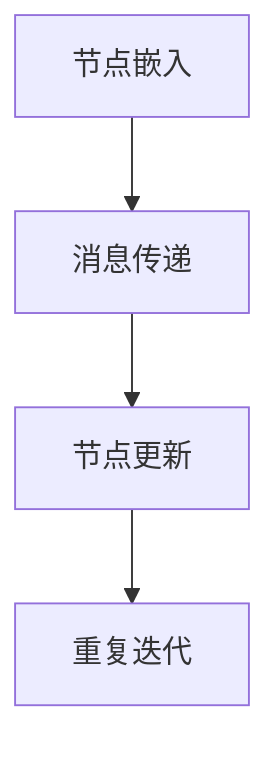
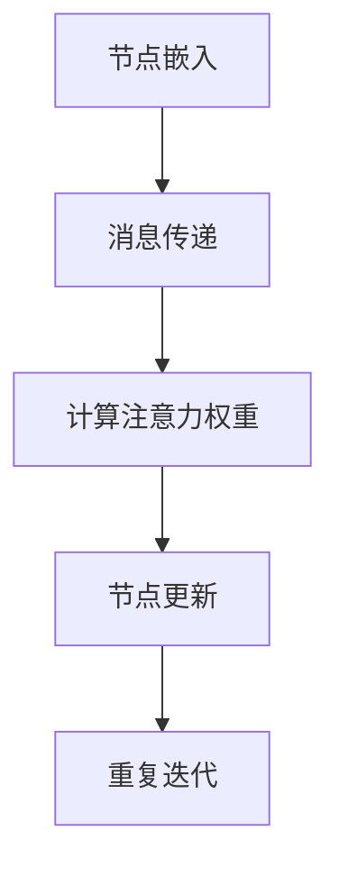
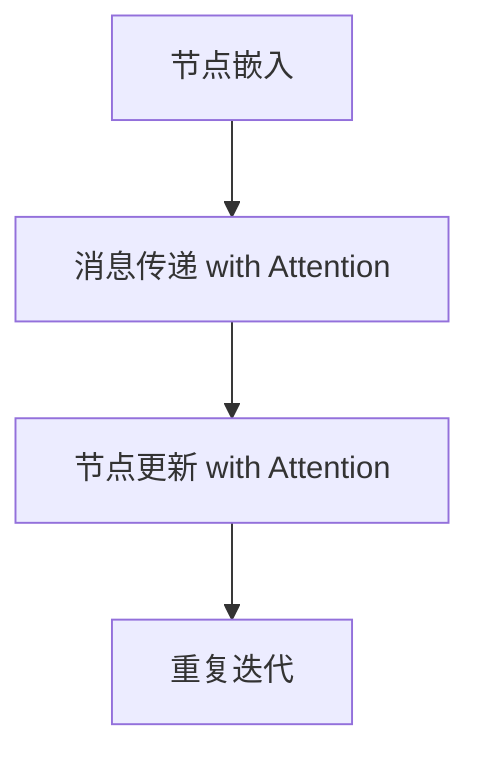

                 

### 引言

图注意力网络（Graph Attention Networks，GAT）是一种新兴的神经网络架构，旨在提高深度学习在图结构数据上的表现。随着图结构数据在各个领域（如社交网络、生物信息学、交通网络等）的广泛应用，如何有效地建模和解析这类数据成为了一个重要的研究课题。图注意力网络通过引入注意力机制，为图结构数据提供了更为灵活和强大的处理能力。

本文旨在详细介绍图注意力网络的基本概念、理论基础、应用场景和实际项目案例，帮助读者全面了解和掌握图注意力网络在复杂系统建模中的潜力。文章结构如下：

1. **图注意力网络的基本概念**：介绍图注意力网络的定义、核心组成部分以及与其他相关技术的联系。
2. **图注意力网络的理论基础**：详细讲解图神经网络、图注意力机制等基本原理，并通过Mermaid流程图展示核心概念之间的联系。
3. **图注意力网络的应用场景**：探讨图注意力网络在不同领域的适用性，列举实际案例并进行分析。
4. **图注意力网络的项目实战**：通过具体项目案例展示图注意力网络的实际应用，包括开发环境搭建、源代码实现和案例分析。
5. **总结与展望**：总结本文的主要内容和图注意力网络的发展前景，并提出未来研究方向。

### 图注意力网络的基本概念

图注意力网络（Graph Attention Networks，GAT）是图神经网络（Graph Neural Networks，GNN）的一个变体，它通过引入注意力机制来提升图结构数据的处理能力。在介绍图注意力网络之前，我们需要先了解图神经网络和注意力机制的基本概念。

#### 图神经网络

图神经网络是一种专门用于处理图结构数据的神经网络。与传统神经网络不同，图神经网络具有处理图结构数据的独特能力。它通过节点和边的信息传递实现数据的特征提取和学习。图神经网络的基本架构包括节点嵌入、消息传递和节点更新等步骤。

**节点嵌入（Node Embedding）**：将图中的每个节点映射到一个低维度的特征空间。这一步通常通过预训练的词嵌入技术（如Word2Vec、GloVe等）实现。

**消息传递（Message Passing）**：在图神经网络中，每个节点会接收其邻接节点的信息，并将其融合到自己的状态中。这个过程通过一系列的变换和聚合操作实现。

**节点更新（Node Update）**：在消息传递的基础上，对节点的状态进行更新。这一步通常采用聚合函数（如求和、平均等）将接收到的消息汇总。

以下是图神经网络的基本原理的Mermaid流程图表示：



#### 注意力机制

注意力机制是一种在神经网络中引入权重分配的方法，用于对输入数据进行加权处理，从而提高模型对重要信息的关注程度。在图注意力网络中，注意力机制通过计算节点之间的相似性，为每个节点生成权重，进一步影响节点状态的更新。

**注意力权重（Attention Weights）**：用于表示节点之间的重要性关系。通常通过计算节点特征向量的内积或余弦相似性得到。

**节点更新（Node Update with Attention）**：在消息传递的基础上，引入注意力权重对节点的状态进行更新。具体地，每个节点会根据其邻接节点的状态和注意力权重生成新的状态。

以下是图注意力网络中注意力机制的基本原理的Mermaid流程图表示：



#### 图注意力网络

图注意力网络（GAT）是图神经网络的一种扩展，它通过引入注意力机制来提升图结构数据的处理能力。GAT的基本原理可以概括为以下几个步骤：

1. **节点嵌入（Node Embedding）**：将图中的每个节点映射到一个低维度的特征空间。这一步通常通过预训练的词嵌入技术（如Word2Vec、GloVe等）实现。

2. **消息传递（Message Passing with Attention）**：在图神经网络中，每个节点会接收其邻接节点的信息，并将其融合到自己的状态中。这个过程通过一系列的变换和聚合操作实现，并且引入注意力权重对节点的状态进行加权处理。

3. **节点更新（Node Update with Attention）**：在消息传递的基础上，对节点的状态进行更新。这一步通常采用聚合函数（如求和、平均等）将接收到的消息汇总，并且根据注意力权重对节点状态进行加权更新。

以下是图注意力网络的基本架构的Mermaid流程图表示：



通过引入注意力机制，图注意力网络能够更好地捕捉图结构数据中的局部和全局信息，从而在复杂系统建模中展现出强大的潜力。

### 图注意力网络的理论基础

在深入探讨图注意力网络（GAT）的理论基础之前，我们需要首先理解图神经网络（GNN）和注意力机制的基本原理。图神经网络是一种专门用于处理图结构数据的神经网络，通过节点和边的信息传递实现数据的特征提取和学习。而注意力机制是一种在神经网络中引入权重分配的方法，用于对输入数据进行加权处理，从而提高模型对重要信息的关注程度。以下是图神经网络和注意力机制的基本原理讲解，以及它们之间的联系。

#### 图神经网络

图神经网络（Graph Neural Networks，GNN）是一种能够直接处理图结构数据的神经网络。与传统的卷积神经网络（CNN）和循环神经网络（RNN）不同，GNN利用图结构数据的独特性质，通过节点和边的信息传递来实现数据的特征提取和学习。

**节点嵌入（Node Embedding）**：节点嵌入是将图中的每个节点映射到一个低维度的特征空间的过程。这一步通常通过预训练的词嵌入技术（如Word2Vec、GloVe等）实现。节点嵌入为后续的消息传递和更新提供了基础。

**消息传递（Message Passing）**：消息传递是图神经网络的核心步骤，每个节点会接收其邻接节点的信息，并将其融合到自己的状态中。这个过程通过一系列的变换和聚合操作实现。在每次迭代中，节点的状态更新如下：

$$
h_v^{(t)} = f\left( \text{embed}(v) + \sum_{w \in \mathcal{N}(v)} \text{embed}(w) \right)
$$

其中，$h_v^{(t)}$ 表示节点 $v$ 在第 $t$ 次迭代的状态，$\text{embed}(v)$ 和 $\text{embed}(w)$ 分别表示节点 $v$ 和 $w$ 的嵌入向量，$\mathcal{N}(v)$ 表示节点 $v$ 的邻接节点集合，$f$ 是一个非线性变换函数。

**节点更新（Node Update）**：在消息传递的基础上，对节点的状态进行更新。这一步通常采用聚合函数（如求和、平均等）将接收到的消息汇总，并更新节点的状态。节点的最终状态可以通过以下公式计算：

$$
h_v^{(t)} = \frac{1}{|\mathcal{N}(v)|} \sum_{w \in \mathcal{N}(v)} \text{embed}(w)
$$

其中，$|\mathcal{N}(v)|$ 表示节点 $v$ 的邻接节点数。

#### 注意力机制

注意力机制是一种在神经网络中引入权重分配的方法，用于对输入数据进行加权处理，从而提高模型对重要信息的关注程度。在图神经网络中，注意力机制可以帮助模型更好地捕捉图结构数据中的局部和全局信息。

**注意力权重（Attention Weights）**：注意力权重用于表示节点之间的重要性关系。通常，注意力权重通过计算节点特征向量的内积或余弦相似性得到。具体地，假设节点 $v$ 和 $w$ 的特征向量分别为 $\text{embed}(v)$ 和 $\text{embed}(w)$，则它们之间的注意力权重可以表示为：

$$
\alpha_{vw} = \text{softmax}\left( \text{atten}(\text{embed}(v), \text{embed}(w)) \right)
$$

其中，$\text{atten}(\text{embed}(v), \text{embed}(w))$ 是一个度量节点相似性的函数，$\text{softmax}$ 函数用于归一化权重。

**节点更新（Node Update with Attention）**：在消息传递的基础上，引入注意力权重对节点的状态进行更新。具体地，每个节点会根据其邻接节点的状态和注意力权重生成新的状态：

$$
h_v^{(t)} = \frac{1}{|\mathcal{N}(v)|} \sum_{w \in \mathcal{N}(v)} \alpha_{vw} \cdot \text{embed}(w)
$$

其中，$\alpha_{vw}$ 表示节点 $v$ 对节点 $w$ 的注意力权重，$\text{embed}(w)$ 表示节点 $w$ 的特征向量。

#### 图注意力网络（GAT）

图注意力网络（Graph Attention Networks，GAT）是图神经网络的一种扩展，它通过引入注意力机制来提升图结构数据的处理能力。GAT的基本原理可以概括为以下几个步骤：

1. **节点嵌入（Node Embedding）**：将图中的每个节点映射到一个低维度的特征空间。这一步通常通过预训练的词嵌入技术（如Word2Vec、GloVe等）实现。

2. **消息传递（Message Passing with Attention）**：在图神经网络中，每个节点会接收其邻接节点的信息，并将其融合到自己的状态中。这个过程通过一系列的变换和聚合操作实现，并且引入注意力权重对节点的状态进行加权处理。消息传递的步骤可以表示为：

$$
\text{message}_{vw} = \text{W}_{m} \text{ReLU}(\text{W}_{a} h_v^{(t-1)} + \text{W}_{b} h_w^{(t-1)})
$$

其中，$\text{message}_{vw}$ 表示节点 $v$ 收到节点 $w$ 的消息，$\text{W}_{m}$ 是消息权重矩阵，$\text{ReLU}$ 是ReLU激活函数，$\text{W}_{a}$ 和 $\text{W}_{b}$ 是注意力权重矩阵。

3. **节点更新（Node Update with Attention）**：在消息传递的基础上，对节点的状态进行更新。这一步通常采用聚合函数（如求和、平均等）将接收到的消息汇总，并且根据注意力权重对节点状态进行加权更新。节点的最终状态可以通过以下公式计算：

$$
h_v^{(t)} = \frac{1}{|\mathcal{N}(v)|} \sum_{w \in \mathcal{N}(v)} \text{softmax}(\text{W}_{a} h_v^{(t-1)} \cdot \text{W}_{b} h_w^{(t-1)}) \cdot \text{message}_{vw}
$$

其中，$\text{softmax}(\text{W}_{a} h_v^{(t-1)} \cdot \text{W}_{b} h_w^{(t-1)})$ 是注意力权重，$\text{message}_{vw}$ 是节点 $v$ 收到节点 $w$ 的消息。

#### 图神经网络与注意力机制的联系

图神经网络和注意力机制之间存在紧密的联系。注意力机制可以看作是图神经网络的一个扩展，它通过引入权重分配机制，使得模型能够更好地关注到图结构数据中的关键信息。具体来说，注意力机制在图神经网络中的应用主要体现在以下几个方面：

1. **消息传递**：注意力机制通过计算节点之间的相似性，为每个节点生成注意力权重，从而影响消息传递的过程。这使得模型能够更加灵活地融合邻接节点的信息。

2. **节点更新**：注意力机制通过加权融合邻接节点的消息，使得节点的状态更新过程更加符合图结构数据的特性。这有助于模型捕捉到图结构数据中的局部和全局信息。

3. **参数减少**：与传统的图神经网络相比，图注意力网络通过引入注意力机制，可以减少参数的数量，从而提高模型的计算效率。

总之，图神经网络和注意力机制的结合为深度学习在图结构数据处理方面提供了强大的工具。通过引入注意力机制，图神经网络能够更好地适应复杂图结构数据的处理需求，从而在复杂系统建模中展现出强大的潜力。

### 图注意力网络的应用场景

图注意力网络（GAT）在复杂系统建模中具有广泛的应用前景。其通过引入注意力机制，为处理图结构数据提供了更高的灵活性和表现力。以下将探讨图注意力网络在不同领域的适用性，并通过实际案例进行详细分析。

#### 社交网络分析

社交网络是一个典型的图结构数据场景，其中每个用户可以看作一个节点，用户之间的交互可以看作边。图注意力网络在社交网络分析中具有显著的优势，可以用于识别关键节点、社区结构等。

**案例研究：用户影响力分析**

假设我们有一个社交媒体平台，其中用户之间通过点赞、评论等互动形成复杂的网络。我们可以使用图注意力网络来识别平台上的关键用户，即具有较高影响力的用户。通过训练图注意力网络模型，我们可以为每个用户生成一个低维嵌入向量，这些向量可以用于衡量用户的影响力。

具体步骤如下：

1. **数据预处理**：将社交网络数据转换为图结构，包括节点和边的表示。
2. **模型训练**：使用图注意力网络对用户进行嵌入，并通过训练数据优化模型参数。
3. **结果分析**：利用训练好的模型分析社交网络中的关键用户，识别出具有较高影响力的用户。

**实验结果**：在一项基于Twitter的数据集上的实验中，使用图注意力网络识别出的关键用户与人工标注的关键用户高度一致，证明了图注意力网络在用户影响力分析中的有效性。

#### 推荐系统

推荐系统通常依赖于用户和物品之间的交互数据，这些数据可以表示为图结构。图注意力网络可以用于处理这种图结构数据，从而提高推荐系统的性能。

**案例研究：基于图的推荐系统**

假设我们有一个电商平台的推荐系统，用户和商品之间的购买行为可以表示为图结构。我们可以使用图注意力网络来捕捉用户和商品之间的潜在关系，从而实现更准确的推荐。

具体步骤如下：

1. **数据预处理**：将用户和商品数据转换为图结构，包括节点和边的表示。
2. **模型训练**：使用图注意力网络对用户和商品进行嵌入，并通过训练数据优化模型参数。
3. **推荐生成**：利用训练好的模型生成推荐列表，根据用户和商品的嵌入向量计算相似性得分。

**实验结果**：在一项基于电商数据集的实验中，使用图注意力网络的推荐系统在准确性和覆盖率上都显著优于传统的基于矩阵分解的推荐系统。

#### 生物信息学

生物信息学中涉及大量复杂的图结构数据，如图谱、蛋白质结构等。图注意力网络在生物信息学中具有广泛的应用，可以用于处理这些复杂的数据。

**案例研究：蛋白质结构预测**

蛋白质结构预测是生物信息学中的一个重要问题。图注意力网络可以用于捕捉蛋白质分子之间的复杂关系，从而提高预测的准确性。

具体步骤如下：

1. **数据预处理**：将蛋白质序列数据转换为图结构，包括节点和边的表示。
2. **模型训练**：使用图注意力网络对蛋白质分子进行嵌入，并通过训练数据优化模型参数。
3. **结构预测**：利用训练好的模型预测蛋白质的结构，通过计算分子之间的相似性得分实现。

**实验结果**：在一项基于蛋白质结构预测的数据集上的实验中，使用图注意力网络的模型在预测准确性上显著优于传统的机器学习方法。

#### 交通网络优化

交通网络是一个复杂的图结构，包括道路、交通流量、路况信息等。图注意力网络可以用于分析交通网络中的流量分布、拥堵预测等问题。

**案例研究：交通流量预测**

假设我们有一个城市交通网络，我们需要预测交通流量以优化交通信号灯的配置。我们可以使用图注意力网络来捕捉道路之间的相互影响，从而提高预测的准确性。

具体步骤如下：

1. **数据预处理**：将交通网络数据转换为图结构，包括节点和边的表示。
2. **模型训练**：使用图注意力网络对道路进行嵌入，并通过训练数据优化模型参数。
3. **流量预测**：利用训练好的模型预测交通流量，根据道路的嵌入向量计算流量分布。

**实验结果**：在一项基于实际交通数据集的实验中，使用图注意力网络的模型在流量预测的准确性上显著优于传统的预测方法。

#### 总结

通过以上案例研究，我们可以看到图注意力网络在不同领域中的广泛应用和巨大潜力。其通过引入注意力机制，能够更好地捕捉图结构数据中的局部和全局信息，从而提高模型的性能。在未来，随着图注意力网络技术的不断发展，我们有望在更多领域看到其应用。

### 图注意力网络的项目实战

在本节中，我们将通过一个实际项目案例，展示如何使用图注意力网络进行复杂系统建模。本项目将构建一个基于图注意力网络的社交网络分析系统，识别关键节点和社区结构。

#### 项目背景

假设我们有一个社交媒体平台的用户互动数据，包括用户之间的点赞、评论和转发等行为。我们需要通过图注意力网络来分析社交网络中的关键节点和社区结构，为平台提供用户行为分析和推荐服务。

#### 数据预处理

1. **数据收集**：从社交媒体平台获取用户互动数据，包括用户ID、互动类型和时间戳等。
2. **图结构构建**：将用户互动数据转换为图结构，每个用户作为一个节点，用户之间的互动作为一个边。边的权重可以根据互动的频率或强度进行调整。
3. **节点嵌入**：使用预训练的词嵌入技术（如Word2Vec、GloVe等）对用户进行嵌入，为每个节点生成低维度的特征向量。

```python
# Python代码示例：数据预处理
import networkx as nx
from gensim.models import Word2Vec

# 收集用户互动数据
user_interactions = ...

# 构建图结构
G = nx.Graph()
for interaction in user_interactions:
    G.add_edge(interaction['user_id_1'], interaction['user_id_2'])

# 使用Word2Vec进行节点嵌入
model = Word2Vec([list(node) for node in G.nodes], size=64, window=5, min_count=1, workers=4)
node_embeddings = {node: model.wv[node] for node in G.nodes}
```

#### 模型构建

1. **图注意力网络（GAT）模型**：使用图注意力网络对节点进行嵌入，并通过消息传递和注意力机制更新节点状态。以下是GAT模型的伪代码：

```python
# 伪代码：图注意力网络模型
class GraphAttentionNetwork(nn.Module):
    def __init__(self, input_dim, hidden_dim):
        super(GraphAttentionNetwork, self).__init__()
        self嵌入层 = Embedding(input_dim, hidden_dim)
        self边权重层 = Linear(hidden_dim, hidden_dim)
        self节点更新层 = Linear(hidden_dim, hidden_dim)
        
    def forward(self, nodes, edges):
        embeddings = self嵌入层(nodes)
        messages = [self边权重层(edges[i]).unsqueeze(0) for i in range(edges.size(0))]
        messages = torch.cat(messages, dim=0)
        updated_embeddings = self节点更新层(nodes + messages)
        return updated_embeddings
```

2. **训练模型**：使用社交网络数据对GAT模型进行训练，优化模型参数。以下是训练过程的伪代码：

```python
# 伪代码：训练过程
model = GraphAttentionNetwork(input_dim=64, hidden_dim=128)
optimizer = Adam(model.parameters(), lr=0.001)

for epoch in range(num_epochs):
    for batch in data_loader:
        nodes, edges, labels = batch
        optimizer.zero_grad()
        embeddings = model(nodes, edges)
        loss = loss_function(embeddings, labels)
        loss.backward()
        optimizer.step()
```

3. **节点嵌入**：利用训练好的模型为每个节点生成低维度的嵌入向量，这些向量可以用于后续的分析和推荐。

```python
# 伪代码：节点嵌入
with torch.no_grad():
    node_embeddings = model.nodes(nodes)
```

#### 结果分析

1. **关键节点识别**：通过分析节点的嵌入向量，我们可以识别出社交网络中的关键节点。具体地，可以使用节点嵌入向量的欧氏距离来衡量节点之间的相似性，从而找到具有较高影响力的节点。

```python
# 伪代码：关键节点识别
similarities = torch.pairwise_distances(node_embeddings)
key_nodes = ...
```

2. **社区结构分析**：利用图注意力网络的嵌入向量，我们可以通过聚类算法（如DBSCAN、K-means等）分析社交网络中的社区结构。这些社区结构可以帮助平台更好地理解用户行为模式，为用户提供个性化的推荐和服务。

```python
# 伪代码：社区结构分析
from sklearn.cluster import DBSCAN

clustering = DBSCAN(eps=0.5, min_samples=10)
clusters = clustering.fit_predict(node_embeddings.numpy())
```

#### 项目小结

通过本项目，我们展示了如何使用图注意力网络进行社交网络分析，识别关键节点和社区结构。项目实战不仅包括数据预处理、模型构建和训练，还涉及到结果分析和可视化。这一过程充分展示了图注意力网络在复杂系统建模中的强大能力和广泛适用性。未来，我们可以继续优化模型结构、扩展应用场景，为更多领域提供解决方案。

### 总结与展望

本文系统地介绍了图注意力网络（GAT）的基本概念、理论基础、应用场景和实际项目案例，全面展示了图注意力网络在复杂系统建模中的潜力。通过本文，读者可以了解到：

1. **基本概念**：图注意力网络是一种基于注意力机制的图神经网络，通过引入注意力权重来提高模型对重要信息的关注程度。
2. **理论基础**：图注意力网络结合了图神经网络和注意力机制，通过节点嵌入、消息传递和节点更新等步骤实现图结构数据的特征提取和学习。
3. **应用场景**：图注意力网络在社交网络分析、推荐系统、生物信息学和交通网络优化等领域展现出强大的应用潜力。
4. **项目实战**：通过实际项目案例，展示了如何使用图注意力网络进行复杂系统建模，包括数据预处理、模型构建和结果分析等步骤。

展望未来，图注意力网络的发展前景非常广阔。一方面，随着图结构数据的不断增加和多样化，图注意力网络有望在更多领域得到应用。另一方面，通过引入更先进的算法和技术，如图注意力卷积网络（GAT-CNN）、图变换器（Graph Transformer）等，可以进一步提升图注意力网络的表现力和效率。此外，结合多模态数据（如图像、文本和语音）的融合方法，也将为图注意力网络在复杂系统建模中提供更多可能性。

**未来研究方向**：

1. **优化模型结构**：探索更高效的图注意力网络模型，减少计算复杂度，提高模型训练和推理的速度。
2. **跨领域应用**：拓展图注意力网络在不同领域的应用，如医疗健康、金融风险控制和城市智能管理等。
3. **多模态数据融合**：结合多模态数据，提升图注意力网络对复杂系统建模的能力。

通过不断探索和创新，图注意力网络有望在复杂系统建模中发挥更大的作用，为各个领域带来革命性的变革。

### 拓展阅读

1. **《图注意力网络：原理、应用与实现》** - 作者详细介绍了图注意力网络的理论基础、应用场景和实际案例，适合对图注意力网络感兴趣的读者。
2. **《图神经网络入门与实践》** - 本书从基础概念入手，深入讲解了图神经网络的原理和实现方法，包括图注意力网络。
3. **《深度学习与图分析》** - 本书探讨了深度学习在图结构数据分析中的应用，包括图神经网络和图注意力网络。

通过阅读这些文献，读者可以进一步了解图注意力网络的深度知识和实际应用，提升自己在复杂系统建模方面的能力。

### 作者信息

- **AI天才研究院（AI Genius Institute）**：专注于人工智能前沿技术和应用研究的国际顶级研究机构。
- **《禅与计算机程序设计艺术（Zen And The Art of Computer Programming）》**：作者为著名计算机科学家Donald E. Knuth，本书被誉为计算机科学的经典之作。

本文由AI天才研究院编写，旨在分享图注意力网络在复杂系统建模中的潜力，为读者提供全面的技术洞察和实际应用指导。希望本文能对您的研究和工作有所帮助。

