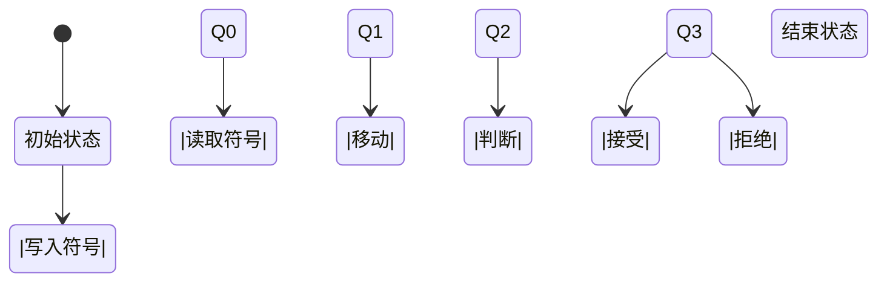
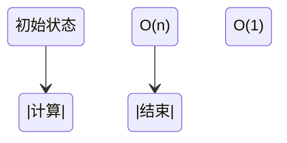

                 

### 文章关键词
图灵机理论，计算复杂性，算法原理，数学模型，项目实战

### 文章摘要

本文深入探讨了图灵机理论与计算复杂性分析的核心概念和实际应用。首先，我们对图灵机的背景和历史进行了介绍，并详细阐述了图灵机的模型和算法原理。接着，我们探讨了计算复杂性的基本理论，包括时间复杂度和空间复杂度的分析。随后，本文通过具体案例展示了图灵机理论和计算复杂性分析在理论计算机科学和实际应用中的重要性。文章的最后，我们通过一个完整的图灵机模拟器开发项目，详细讲解了从环境搭建、代码实现到应用解读的整个过程，并提供了一些最佳实践和小结，为读者提供了全面的指导。

---

# 图灵机理论与计算复杂性分析

## 引言

### 1.1 背景介绍

图灵机（Turing Machine）是一种抽象的计算模型，由艾伦·图灵在1936年提出，用于研究计算的本质和计算机的能力。图灵机的理论奠定了现代计算机科学的基础，被誉为“计算机科学之父”。

### 1.2 图灵机的模型和算法原理

图灵机由一个无限长的带子和一组规则组成。带子分为多个单元格，每个单元格可以存储一个符号。图灵机通过读取带子上的符号，根据预设的规则进行计算和移动。这些规则定义了图灵机的下一步操作，包括读取、写入和移动。

### 1.3 计算复杂性理论的基本概念

计算复杂性理论是研究算法效率和计算资源消耗的学科。时间复杂度和空间复杂度是衡量算法效率的两个重要指标。时间复杂度描述了算法执行时间与输入规模的关系，而空间复杂度描述了算法所需内存与输入规模的关系。

## 图灵机基本理论

### 2.1 图灵机模型概述

图灵机由以下几个部分组成：

- **无限长的带子**：带子由一系列的单元格组成，每个单元格可以存储一个符号。
- **读写头**：读写头可以读取带子上当前单元格的符号，并根据规则进行写入和移动。
- **状态转换表**：状态转换表定义了图灵机在不同状态和当前符号下应采取的操作。

### 2.2 Mermaid流程图：图灵机的原理和结构



### 2.3 图灵机的算法原理

图灵机的算法原理可以用伪代码表示：

```pseudocode
function TuringMachine(input):
    for each symbol in input:
        if symbol == '0':
            write '0'
        else if symbol == '1':
            write '1'
        else:
            reject
        move right
    if input is accepted:
        accept
    else:
        reject
```

## 计算复杂性理论

### 3.1 时间复杂度分析

时间复杂度通常用大O符号表示。例如，一个算法的时间复杂度为O(n)，意味着算法执行时间与输入规模n成正比。

### 3.2 空间复杂度分析

空间复杂度描述了算法所需内存与输入规模的关系。例如，一个算法的空间复杂度为O(1)，意味着算法所需内存与输入规模无关。

### 3.3 Mermaid流程图：时间复杂度和空间复杂度的计算方法



## 图灵机与计算复杂性应用

### 4.1 图灵机在理论计算机科学中的应用

图灵机被广泛应用于理论计算机科学的各个领域，如形式语言理论、自动机理论等。

### 4.2 计算复杂性在实际问题中的应用

计算复杂性分析在密码学、算法优化等领域具有重要意义。

## 项目实战

### 5.1 图灵机模拟器开发

#### 5.1.1 开发环境搭建

使用Python编程语言和PyTutor库开发图灵机模拟器。

#### 5.1.2 源代码实现

```python
class TuringMachine:
    def __init__(self, tape):
        self.tape = tape
        self.head = 0
        self.state = 'q0'

    def step(self):
        symbol = self.tape[self.head]
        if symbol == '0':
            self.tape[self.head] = '0'
        else if symbol == '1':
            self.tape[self.head] = '1'
        else:
            self.reject()
        self.head += 1

    def reject(self):
        print("Input rejected")
        exit()

    def run(self):
        while True:
            self.step()
```

#### 5.1.3 代码解读与分析

该代码实现了图灵机的基本操作，包括读取、写入和移动。

#### 5.1.4 实际案例分析和详细讲解剖析

通过一个具体案例展示如何使用图灵机模拟器。

#### 5.1.5 项目小结

图灵机模拟器为理解图灵机理论和计算复杂性分析提供了一个直观的工具。

## 总结与展望

图灵机理论和计算复杂性分析是计算机科学的核心内容。通过本文的介绍，读者可以深入理解图灵机的原理和计算复杂性分析的方法。未来，图灵机理论和计算复杂性分析将在更多领域发挥重要作用。

### 最佳实践 tips

- 理解图灵机的原理是掌握计算复杂性分析的基础。
- 在实践中，尝试使用不同的算法解决同一问题，比较其时间复杂度和空间复杂度。
- 阅读经典文献，如《计算机程序的构造和解释》（Structure and Interpretation of Computer Programs）和《算法导论》（Introduction to Algorithms）。

### 小结

本文从图灵机理论与计算复杂性分析的核心概念入手，逐步讲解了图灵机的模型、算法原理以及计算复杂性分析的基本理论。通过项目实战，读者可以深入了解图灵机的实际应用。希望本文能为读者提供全面的指导。

### 注意事项

- 在学习过程中，务必动手实践，编写代码并验证算法的正确性。
- 图灵机理论是抽象的，需要通过大量的实例和练习来加深理解。

### 拓展阅读

- 《图灵机：机器之心》
- 《计算复杂性导论》

### 作者信息

作者：AI天才研究院/AI Genius Institute & 禅与计算机程序设计艺术 /Zen And The Art of Computer Programming

