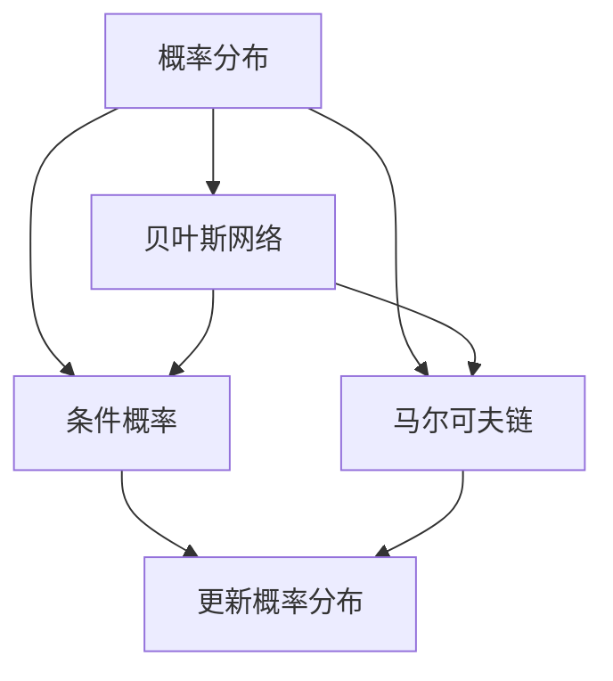

                 

### 引言

在当今快速发展的信息技术时代，图神经网络（Graph Neural Networks, GNNs）作为一种先进的深度学习模型，已经引起了学术界和工业界的广泛关注。GNNs特别适合处理图结构数据，如社交网络、知识图谱、生物网络等，其在不确定性推理中的应用更是展现出了巨大的潜力。本文旨在探讨图神经网络在不确定性推理中的基础理论、应用实践以及未来发展趋势。

不确定性推理是人工智能领域中的一个重要研究方向，涉及到在不确定环境中进行决策和推理的问题。传统的推理方法如基于规则的方法和概率图模型等方法在处理不确定性时存在局限性。随着图神经网络的发展，利用图结构来表示和推理不确定性数据成为可能。

本文将按照以下结构进行阐述：

1. **图神经网络基础理论**：介绍图神经网络的基本概念、发展历程、数学基础以及图表示学习、图神经网络架构。
2. **不确定性推理与图神经网络**：介绍不确定性推理的基本概念、在图神经网络中的应用以及面临的挑战。
3. **图神经网络在不确定性推理中的应用实践**：具体探讨图神经网络在知识图谱、自然语言处理和医疗领域中的应用。
4. **图神经网络开发实践**：介绍图神经网络开发环境搭建和项目实战。
5. **图神经网络未来发展趋势与挑战**：展望图神经网络的发展趋势以及在不确定性推理中的未来研究方向。

通过对上述内容的逐一剖析，本文旨在为读者提供一个全面而深入的图神经网络在不确定性推理中的应用指南。

### 图神经网络基础理论

#### 图神经网络的基本概念

图神经网络（Graph Neural Networks，GNNs）是一类专门用于处理图结构数据的神经网络。与传统的卷积神经网络（Convolutional Neural Networks，CNNs）和循环神经网络（Recurrent Neural Networks，RNNs）不同，GNNs能够直接操作图结构数据，通过节点和边的关系来传递信息，从而实现复杂的图结构数据的表征和推理。图神经网络的核心思想是将图中的节点和边映射到高维特征空间，并通过学习图结构中的邻域信息和全局信息来进行特征提取和关系建模。

GNNs的基本概念可以从以下几个方面进行理解：

1. **图结构**：图（Graph）由节点（Node）和边（Edge）组成，是一种用于表示复杂网络结构的数据结构。节点可以表示图中的实体，如人、地点、物品等；边表示节点之间的关系，如朋友关系、地理位置关系等。

2. **图表示学习**：图表示学习（Graph Representation Learning）是将图中的节点和边转换为高维特征表示的过程。通过图嵌入算法（如节点嵌入和边嵌入），节点和边被映射到低维特征空间，从而实现数据的降维和特征提取。

3. **图卷积操作**：图卷积操作（Graph Convolutional Operation）是GNNs的核心操作之一。它通过聚合节点邻域的信息来更新节点的特征表示。图卷积操作的数学定义通常可以表示为：
   $$
   h_i^{(l+1)} = \sigma\left(\sum_{j \in \mathcal{N}(i)} \frac{1}{\sqrt{\| \mathbf{a}_i - \mathbf{a}_j \|}} \mathbf{a}_j^{(l)} w^{(l)}\right)
   $$
   其中，$h_i^{(l+1)}$是第$l+1$层节点$i$的特征表示，$\mathcal{N}(i)$是节点$i$的邻域集合，$\mathbf{a}_i^{(l)}$是节点$i$在第$l$层的特征表示，$w^{(l)}$是图卷积层的权重参数，$\sigma$是激活函数。

4. **图注意力机制**：图注意力机制（Graph Attention Mechanism）是一种用于提高GNNs对邻域信息权重分配的方法。通过计算节点间相似度或重要性，图注意力机制能够自适应地调整邻域信息的聚合权重。图注意力机制可以增强GNNs对局部结构和全局关系的捕捉能力。

#### 图神经网络的发展历程

图神经网络的发展历程可以追溯到20世纪90年代，当时研究人员开始探索如何将神经网络应用于图结构数据。以下是一些关键的发展阶段：

1. **早期探索**：1990年代，图嵌入（Graph Embedding）的概念被提出，用于将图中的节点和边映射到低维特征空间。代表性的工作包括节点嵌入（Node Embedding）和边嵌入（Edge Embedding）。

2. **图卷积神经网络（GCN）**：2013年，Kipf和Welling提出了图卷积神经网络（Graph Convolutional Network，GCN），该模型通过图卷积操作实现了对图结构数据的特征提取和关系建模。GCN的核心思想是通过聚合邻域节点信息来更新每个节点的特征表示。

3. **图注意力机制**：近年来，随着注意力机制的兴起，图注意力机制（Graph Attention Mechanism）也被引入到GNNs中。图注意力机制通过计算节点间的重要性权重，使得模型能够自适应地调整对邻域节点的关注程度。

4. **其他变体**：在GCN的基础上，研究人员提出了许多其他GNN变体，如图注意力网络（Graph Attention Network，GAT）、图交互网络（Graph Attentional Interaction Network，GATII）和图变换器网络（Graph Transformer Network，GTN）。这些变体在捕捉局部和全局关系方面取得了更好的性能。

#### 图神经网络的数学基础

图神经网络的理论基础涉及图论、线性代数和深度学习等领域。以下简要介绍图神经网络中的几个关键数学概念：

1. **图表示**：在图神经网络中，图表示通常用邻接矩阵（Adjacency Matrix）或拉普拉斯矩阵（Laplacian Matrix）来表示。邻接矩阵$A$的元素$A_{ij}$表示节点$i$和节点$j$之间是否有连接（1表示连接，0表示无连接）。拉普拉斯矩阵$L$是邻接矩阵$A$减去度矩阵$D$的对角矩阵，其中$D_{ii}$是节点$i$的度数（即连接数）。拉普拉斯矩阵具有正则化作用，有助于稳定图卷积操作。

2. **图卷积操作**：图卷积操作可以用线性代数的矩阵乘法来表示。假设节点$i$的邻域节点集合为$\mathcal{N}(i)$，其特征表示矩阵为$\mathbf{X}$，图卷积操作可以表示为：
   $$
   \mathbf{X}^{(l+1)} = \sigma(\mathbf{X}^{(l)} \mathbf{A}^{(l)} W^{(l)})
   $$
   其中，$W^{(l)}$是图卷积层的权重矩阵，$\sigma$是激活函数。

3. **图注意力机制**：图注意力机制可以通过计算节点间的相似度来分配注意力权重。常用的相似度计算方法包括点积、余弦相似度和归一化高斯相似度。假设节点$i$和节点$j$的特征表示分别为$\mathbf{h}_i^{(l)}$和$\mathbf{h}_j^{(l)}$，图注意力权重可以表示为：
   $$
   \alpha_{ij}^{(l)} = \frac{\exp(\mathbf{h}_i^{(l)} \cdot \mathbf{h}_j^{(l)})}{\sum_{k \in \mathcal{N}(i)} \exp(\mathbf{h}_i^{(l)} \cdot \mathbf{h}_k^{(l)})}
   $$
   其中，$\alpha_{ij}^{(l)}$表示节点$i$对节点$j$的注意力权重。

通过上述数学基础，图神经网络能够有效地捕捉图结构数据的复杂关系，从而在不确定性推理中发挥重要作用。

### 图表示学习

图表示学习是图神经网络（GNNs）的基础，它涉及将图中的节点和边映射到低维向量空间，以便在神经网络中处理。这一过程主要包括节点嵌入和边嵌入，下面将详细探讨这些基本原理。

#### 节点嵌入

节点嵌入（Node Embedding）是将图中的节点映射到低维向量空间的方法。节点嵌入的主要目的是通过保留节点在图结构中的邻域信息，将节点表示为固定大小的向量，以便在深度学习模型中使用。节点嵌入有几种不同的实现方法，包括基于图结构的方法和基于随机游走的方法。

1. **基于图结构的方法**：

   - **最近邻方法**：这种方法通过计算节点与其邻接节点的相似度，将节点映射到低维空间。常用的相似度度量包括余弦相似度和点积相似度。最近邻方法简单直观，但可能会受到噪声和异常点的影响。

   - **基于矩阵分解的方法**：如奇异值分解（SVD）和多项式矩阵分解，这些方法通过将图矩阵分解为较低阶矩阵来提取节点之间的相似性关系。这些方法在处理大型图时表现出较好的性能。

2. **基于随机游走的方法**：

   - **DeepWalk**：DeepWalk是一种基于随机游走和自然语言处理中的Word2Vec算法的节点嵌入方法。它通过生成图上的随机游走路径，并在这些路径上训练神经网络，将节点映射到低维空间。

   - **Node2Vec**：Node2Vec扩展了DeepWalk，通过调节游走过程中的游走概率，可以在保留邻域信息的同时，增加长距离关系的捕捉能力。Node2Vec使用两个参数，即`p`（游走概率）和`q`（反转概率），来平衡局部和全局信息的捕获。

节点嵌入的一个典型例子是利用Node2Vec算法对社交网络中的用户进行嵌入。假设我们有一个社交网络图，每个用户都是一个节点，用户之间的关系通过边来表示。通过训练Node2Vec模型，我们可以将每个用户映射到低维空间中，这些嵌入向量可以用于推荐系统、社区发现等任务。

#### 边嵌入

边嵌入（Edge Embedding）是将图中的边映射到低维向量空间的方法。边嵌入的主要目的是通过捕捉边上的特征，增强图神经网络对图结构数据的理解。与节点嵌入类似，边嵌入也有多种实现方法，包括基于图结构的方法和基于随机游走的方法。

1. **基于图结构的方法**：

   - **简单线性组合**：这种方法通过将边的两个端点的嵌入向量进行线性组合来生成边嵌入向量。例如，对于边$(u, v)$，其嵌入向量可以表示为：
     $$
     \mathbf{e}_{uv} = \mathbf{e}_u + \mathbf{e}_v
     $$

   - **边卷积网络**：边卷积网络通过定义一个特殊的卷积核，对边的邻域节点进行卷积操作，从而生成边嵌入向量。这种方法可以捕捉边在图结构中的局部特征。

2. **基于随机游走的方法**：

   - **Edge2Vec**：Edge2Vec是一种基于随机游走和图嵌入的边嵌入方法。它通过生成边的随机游走路径，并在这些路径上训练神经网络，将边映射到低维空间。Edge2Vec方法可以捕捉边在图结构中的长距离关系。

边嵌入的一个典型例子是利用Edge2Vec算法对社交网络中的用户关系进行嵌入。假设我们有一个社交网络图，每个用户之间的关系通过边来表示。通过训练Edge2Vec模型，我们可以将每条边映射到低维空间中，这些嵌入向量可以用于关系分类、链接预测等任务。

#### 图表示学习的应用案例

图表示学习在许多实际应用中发挥了重要作用。以下是几个应用案例：

1. **社交网络分析**：在社交网络中，节点嵌入可以用于用户推荐、社区发现和用户角色识别等任务。例如，通过将用户嵌入到低维空间中，可以使用基于距离的相似性度量来推荐新朋友或相关用户。

2. **知识图谱**：在知识图谱中，节点嵌入可以用于实体关系识别和推理。例如，通过将实体和关系嵌入到低维空间中，可以使用图神经网络来预测新的实体关系或回答基于知识的查询。

3. **生物信息学**：在生物信息学中，图表示学习可以用于蛋白质结构预测、基因共表达网络分析等任务。通过将生物实体和交互关系嵌入到低维空间中，可以使用图神经网络来识别蛋白质功能或预测基因调控网络。

通过图表示学习，图神经网络能够有效地处理复杂的图结构数据，从而在不确定性推理和其他应用领域中发挥重要作用。下一节将深入探讨图神经网络架构，了解不同类型的GNNs及其应用。

### 图神经网络架构

图神经网络（GNNs）是一类专门用于处理图结构数据的神经网络，其架构设计旨在有效捕捉图中的节点和边关系。本文将详细介绍几种常见的GNNs架构，包括图卷积神经网络（GCN）、图注意力机制（GAM）以及其他变体，如图交互网络（GAT）和图变换器网络（GTN）。

#### 图卷积神经网络（GCN）

图卷积神经网络（Graph Convolutional Network，GCN）是图神经网络的基础架构之一，由Kipf和Welling在2016年提出。GCN通过聚合节点邻域信息来更新节点的特征表示，从而实现图数据的特征提取和关系建模。

1. **基本原理**：

   GCN的基本操作是图卷积操作（Graph Convolutional Operation），其数学表达式如下：
   $$
   \mathbf{h}_i^{(l+1)} = \sigma \left( \sum_{j \in \mathcal{N}(i)} \frac{1}{\sqrt{\| \mathbf{a}_i - \mathbf{a}_j \|}} \mathbf{h}_j^{(l)} w^{(l)} \right)
   $$
   其中，$\mathbf{h}_i^{(l)}$是第$l$层节点$i$的特征表示，$\mathcal{N}(i)$是节点$i$的邻域集合，$\mathbf{h}_j^{(l)}$是节点$j$在第$l$层的特征表示，$w^{(l)}$是图卷积层的权重矩阵，$\sigma$是激活函数。

2. **计算方法**：

   - **邻域聚合**：GCN通过聚合节点邻域信息来更新节点特征。具体来说，每个节点的特征表示取决于其邻域节点的特征表示，通过加权平均来实现。
   - **图卷积操作**：使用拉普拉斯矩阵（Laplacian Matrix）来简化邻域聚合过程，从而提高计算效率。

3. **应用场景**：

   - **社交网络分析**：GCN可以用于社交网络的节点分类、链接预测和社区发现。
   - **知识图谱**：GCN在实体关系识别和图谱推理中表现优秀，适用于药物发现、推荐系统等领域。

#### 图注意力机制（GAM）

图注意力机制（Graph Attention Mechanism，GAM）是近年来提出的用于改进图神经网络性能的关键技术。GAM通过计算节点间的注意力权重，使得模型能够自适应地关注重要的邻域节点信息。

1. **基本原理**：

   图注意力机制的核心思想是计算节点间的注意力权重，用于调整邻域信息的聚合权重。其数学表达式如下：
   $$
   \alpha_{ij}^{(l)} = \frac{\exp(\mathbf{h}_i^{(l)} \cdot \mathbf{h}_j^{(l)})}{\sum_{k \in \mathcal{N}(i)} \exp(\mathbf{h}_i^{(l)} \cdot \mathbf{h}_k^{(l)})
   $$
   其中，$\alpha_{ij}^{(l)}$是节点$i$对节点$j$的注意力权重，$\mathbf{h}_i^{(l)}$和$\mathbf{h}_j^{(l)}$分别是节点$i$和节点$j$在第$l$层的特征表示。

2. **应用场景**：

   - **社交网络**：GAM可以用于社交网络中的用户关系预测、影响力分析等任务。
   - **推荐系统**：GAM在推荐系统中用于捕捉用户间的兴趣相似度，提高推荐质量。
   - **知识图谱**：GAM在知识图谱的实体关系识别中，有助于提升推理准确性和多样性。

#### 图交互网络（GAT）

图交互网络（Graph Attentional Interaction Network，GAT）是基于图注意力机制的扩展，通过引入交互层来提高模型对复杂关系的捕捉能力。

1. **基本原理**：

   GAT在每一层都引入注意力机制，通过计算节点间的注意力权重来聚合邻域信息。GAT的数学表达式如下：
   $$
   \mathbf{h}_i^{(l+1)} = \sum_{j \in \mathcal{N}(i)} \alpha_{ij}^{(l)} \mathbf{h}_j^{(l)} w^{(l)}
   $$
   其中，$\alpha_{ij}^{(l)}$是节点$i$对节点$j$的注意力权重，$w^{(l)}$是GAT的权重矩阵。

2. **应用场景**：

   - **社交网络**：GAT在社交网络中的节点分类、影响力预测等任务中表现出色。
   - **生物信息学**：GAT在蛋白质结构预测和基因共表达网络分析中具有广泛的应用。
   - **推荐系统**：GAT在推荐系统中的商品推荐、用户兴趣挖掘中表现出优异的性能。

#### 图变换器网络（GTN）

图变换器网络（Graph Transformer Network，GTN）是基于Transformer模型的图神经网络架构，通过自注意力机制和前馈神经网络来捕捉节点和边之间的复杂关系。

1. **基本原理**：

   GTN的核心思想是使用多头自注意力机制来聚合节点和边的特征表示。GTN的数学表达式如下：
   $$
   \mathbf{h}_i^{(l+1)} = \text{softmax}\left(\frac{\mathbf{h}_i^{(l)} \mathbf{W}^Q \mathbf{h}_j^{(l)} \mathbf{W}^K\right) \mathbf{h}_j^{(l)} \mathbf{W}^V
   $$
   其中，$\mathbf{h}_i^{(l)}$是节点$i$在第$l$层的特征表示，$\mathbf{W}^Q$、$\mathbf{W}^K$和$\mathbf{W}^V$分别是查询、键和值权重矩阵。

2. **应用场景**：

   - **知识图谱**：GTN在知识图谱中的实体关系识别和推理中具有显著优势。
   - **推荐系统**：GTN在推荐系统中的用户兴趣捕捉和商品推荐中表现出色。
   - **社交网络**：GTN在社交网络中的用户行为预测和影响力分析中具有广泛的应用。

综上所述，图神经网络架构的不断发展和创新，使得其在不确定性推理和其他应用领域中具有广泛的应用前景。通过了解GCN、GAM、GAT和GTN等不同类型的GNNs架构，我们可以更好地利用图神经网络来解决复杂的问题。

### 不确定性推理的基本概念

不确定性推理（Uncertainty Reasoning）是人工智能领域中的一个重要研究方向，旨在在不确定的环境中进行决策和推理。传统的人工智能系统通常依赖于确定性规则和算法，但在现实世界中，不确定性是不可避免的。不确定性推理的目标是利用各种不确定性信息来做出合理和可靠的决策。

#### 不确定性推理的定义

不确定性推理涉及在不确定的环境中进行推理和决策，主要处理以下几种不确定性：

1. **随机不确定性**：由随机事件引起的不确定性，如掷骰子或随机试验的结果。
2. **模糊不确定性**：由模糊概念或模糊知识引起的不确定性，如天气预测中的“多云”或“可能性高”。
3. **不完整性不确定性**：由于信息不完整或数据缺失引起的不确定性，如医疗诊断中的部分缺失症状。

#### 不确定性推理的类型

不确定性推理主要可以分为以下几种类型：

1. **概率推理**：基于概率论，通过概率分布来表示不确定性，并进行推理和决策。
2. **模糊推理**：基于模糊集合理论，通过模糊集和模糊逻辑来处理不确定性。
3. **证据推理**：基于证据理论，通过证据的加权来表示不确定性，并进行推理和决策。
4. **统计推理**：基于统计方法，通过统计模型来表示和推理不确定性。

#### 不确定性推理的核心概念与联系

在不确定性推理中，几个核心概念及其相互关系至关重要：

1. **概率分布**：概率分布是表示不确定性最常见的方式。通过概率分布，可以量化不确定性的大小和可能性。
2. **贝叶斯网络**：贝叶斯网络是一种概率图模型，通过有向无环图（DAG）来表示变量之间的依赖关系，并利用贝叶斯定理进行推理。
3. **条件概率**：条件概率是表示在某个条件下另一个事件发生的可能性。在不确定性推理中，条件概率用于更新变量的概率分布。
4. **马尔可夫链**：马尔可夫链是一种随机过程，用于描述变量在时间序列中的转移概率，并可以用于预测未来的不确定性。

这些概念之间的关系可以用以下Mermaid流程图来表示：



通过这些核心概念和联系，不确定性推理能够更好地模拟现实世界中的不确定性，并为决策提供合理的依据。

#### 不确定性推理在图神经网络中的应用

不确定性推理在图神经网络（GNNs）中的应用是当前研究的热点，旨在利用图结构来表示和处理不确定性信息。以下是几种主要的应用场景：

1. **知识图谱推理**：知识图谱中包含了大量不确定性的信息，如概率性关系和模糊性描述。通过将知识图谱表示为图结构，并利用GNNs进行推理，可以有效地捕捉和处理这些不确定性。例如，可以使用图注意力机制（GAM）来调整关系的重要性，从而在不确定性环境中进行更准确的推理。

2. **社交网络分析**：社交网络中存在多种不确定性，如用户行为的不确定性、社交关系的不确定性等。通过GNNs，可以构建用户和关系的图结构，并利用不确定性推理方法来分析社交网络中的趋势和模式。例如，可以使用GNNs和贝叶斯网络结合的方法来预测用户的未来行为。

3. **推荐系统**：在推荐系统中，不确定性主要来自于用户兴趣的不确定性和商品属性的模糊性。通过将用户和商品的图结构表示为GNNs，并利用不确定性推理方法，可以更好地处理这些不确定性，从而提高推荐系统的准确性和多样性。

4. **生物信息学**：在生物信息学中，基因调控网络和蛋白质相互作用网络中存在大量的不确定性信息。通过将生物网络表示为图结构，并利用GNNs进行不确定性推理，可以更好地理解生物系统的复杂性和动态性。

总之，不确定性推理在图神经网络中的应用为处理复杂不确定性数据提供了有效的方法，并在多个领域中展现出了广泛的应用前景。

#### 不确定性推理的挑战与解决方案

尽管不确定性推理在多个领域中展现出了巨大的潜力，但在实际应用中仍然面临许多挑战。以下是这些挑战以及相应的解决方案：

1. **数据噪声与缺失**：在实际应用中，数据往往存在噪声和缺失，这会影响到不确定性推理的准确性。解决方案包括使用鲁棒的数据清洗和填充方法，以及引入噪声鲁棒的推理算法。

2. **计算效率**：不确定性推理通常涉及复杂的概率计算和优化问题，这可能导致计算效率低下。为了解决这一问题，可以采用并行计算、分布式计算和近似推理等方法来提高计算效率。

3. **模型解释性**：不确定性推理模型往往具有高度的复杂性，难以解释其内部决策过程。为此，可以引入可解释性方法，如可视化技术、解释性图表和决策路径分析等，以增强模型的可解释性。

4. **稀疏数据**：在许多应用场景中，数据往往是稀疏的，这会使得不确定性推理模型的性能受到影响。针对这一问题，可以采用基于邻域聚合的方法，如图卷积网络（GCN），以及基于随机游走的方法，如Node2Vec，来提高模型在稀疏数据上的性能。

5. **不确定性表示**：如何有效地表示和处理不确定性信息是另一个挑战。可以通过引入概率图模型，如贝叶斯网络，以及结合图注意力机制（GAM）等方法，来提高不确定性表示的准确性和灵活性。

6. **模型融合**：在实际应用中，可能需要结合多个模型或方法来处理不确定性，但如何有效地融合这些模型是一个难题。可以通过集成学习（Ensemble Learning）方法，如Bagging和Boosting，以及通过设计多模型融合策略来提高整体性能。

综上所述，尽管不确定性推理面临诸多挑战，但通过采用合适的方法和策略，可以有效地应对这些挑战，从而实现更准确和可靠的不确定性推理。

### 图神经网络在知识图谱中的应用

知识图谱是一种结构化的知识表示方法，广泛应用于各种领域，如语义搜索、自然语言处理、推荐系统等。图神经网络（GNNs）在知识图谱中的应用，极大地提升了知识图谱的构建和推理能力。以下是图神经网络在知识图谱中的应用，包括知识图谱构建、知识图谱推理以及实际应用案例。

#### 知识图谱概述

知识图谱是一种由实体和关系组成的图结构数据，其中实体表示知识中的对象，如人、地点、物品等，关系表示实体间的语义联系，如“是”、“属于”、“位于”等。知识图谱为智能系统提供了丰富的背景知识，有助于提高信息检索、实体识别、关系抽取等任务的性能。

#### 图神经网络在知识图谱构建中的应用

图神经网络在知识图谱构建中的应用主要包括实体嵌入和关系嵌入，通过这些嵌入，可以有效地表示实体和关系，从而提高知识图谱的表征能力。

1. **实体嵌入**：实体嵌入是将实体映射到低维向量空间的方法，通过实体嵌入，实体可以在向量空间中近似表示，从而实现高效的处理。图神经网络中的图卷积神经网络（GCN）和图注意力机制（GAM）等方法被广泛应用于实体嵌入。

   - **GCN**：通过图卷积操作，节点（实体）的特征表示会被其邻域节点的特征表示所影响，从而更新节点的特征表示。
     $$
     \mathbf{h}_i^{(l+1)} = \sigma \left( \sum_{j \in \mathcal{N}(i)} \alpha_{ij}^{(l)} \mathbf{h}_j^{(l)} w^{(l)} \right)
     $$
     其中，$\alpha_{ij}^{(l)}$是节点$i$和节点$j$之间的注意力权重。

   - **GAM**：通过计算节点间的注意力权重，可以自适应地关注重要的邻域节点信息，从而提高实体嵌入的质量。

2. **关系嵌入**：关系嵌入是将关系映射到低维向量空间的方法，关系嵌入可以表示实体间的关系强度和方向。与实体嵌入类似，关系嵌入也采用图神经网络的方法。

   - **简单线性组合**：通过将两个实体的嵌入向量进行线性组合来生成关系嵌入向量。
     $$
     \mathbf{e}_{uv} = \mathbf{e}_u + \mathbf{e}_v
     $$

   - **图卷积操作**：通过图卷积操作，关系嵌入向量可以与实体嵌入向量进行交互，从而生成更丰富的关系表示。

#### 图神经网络在知识图谱推理中的应用

知识图谱推理是利用知识图谱中的实体和关系进行推理，以获取新的知识。图神经网络通过学习和表示实体和关系的嵌入向量，可以有效地进行知识图谱推理。

1. **路径推理**：路径推理是通过实体和关系之间的路径来推断新的关系。图神经网络可以通过图卷积操作来捕捉路径上的信息，从而实现路径推理。

2. **实体关系预测**：实体关系预测是预测实体间可能存在的关系。通过训练图神经网络，可以学习到实体和关系之间的复杂关系，从而实现准确的实体关系预测。

3. **链接预测**：链接预测是预测实体之间的缺失链接。图神经网络可以通过学习实体嵌入和关系嵌入，来预测图中的潜在链接，从而提高链接预测的准确性。

#### 实际应用案例

以下是一些图神经网络在知识图谱中的应用案例：

1. **语义搜索**：通过将实体和关系嵌入到低维向量空间中，可以实现对查询的语义理解，从而提高搜索结果的准确性。例如，在搜索引擎中，可以通过实体嵌入来匹配用户查询和网页中的实体，从而实现更准确的搜索结果。

2. **自然语言处理**：知识图谱可以用于自然语言处理任务，如实体识别、关系抽取和文本分类等。通过将实体和关系嵌入到向量空间中，可以实现对文本中的实体和关系的有效表示，从而提高NLP任务的性能。

3. **推荐系统**：知识图谱可以用于推荐系统，通过实体嵌入和关系嵌入来预测用户对物品的偏好。例如，在电子商务平台上，可以通过知识图谱来推荐与用户兴趣相关的商品。

4. **药物发现**：在药物发现领域，知识图谱可以用于表示药物和蛋白质之间的相互作用。通过图神经网络，可以预测新的药物靶点，从而加速药物研发过程。

通过以上介绍，我们可以看到，图神经网络在知识图谱中的应用不仅提高了知识图谱的构建和推理能力，还在多个实际应用领域中取得了显著的效果。

### 图神经网络在自然语言处理中的应用

自然语言处理（Natural Language Processing，NLP）是人工智能领域中的一个重要分支，旨在使计算机能够理解和处理人类语言。图神经网络（Graph Neural Networks，GNNs）在NLP中展现出了独特的优势，能够有效地处理文本中的复杂结构和语义关系。以下是图神经网络在NLP中的具体应用案例。

#### 概述

NLP涉及的任务多种多样，包括文本分类、情感分析、命名实体识别、机器翻译等。传统NLP方法，如基于规则的方法和统计模型，在处理文本数据时存在局限性。随着深度学习技术的发展，图神经网络因其能够捕捉文本中的图结构特征，而成为NLP中的一个重要工具。

#### 实际应用案例

1. **文本分类**：文本分类是将文本数据分为预定义的类别。图神经网络在文本分类中的应用主要体现在对文本中的关系和结构的捕捉。例如，GAT（Graph Attention Network）可以通过学习文本中的实体关系，提高分类的准确性。以下是一个简化的文本分类的GAT模型实现伪代码：

   ```python
   class GATLayer(nn.Module):
       def __init__(self, input_dim, output_dim):
           super(GATLayer, self).__init__()
           self.attention = torch.nn.Linear(input_dim, 1)
           self.W = torch.nn.Linear(input_dim, output_dim)
       
       def forward(self, h, adj):
           e = self.attention(h).squeeze(2)
           alpha = F.softmax(F.relu(e + adj), dim=2)
           h = (alpha * h).sum(dim=1)
           h = self.W(h)
           return h
   ```

   在这个伪代码中，`h`代表节点特征向量，`adj`是邻接矩阵，`alpha`是注意力权重。

2. **命名实体识别**：命名实体识别（Named Entity Recognition，NER）是识别文本中的特定实体，如人名、地点、组织等。图神经网络可以通过捕捉实体及其之间的关系来提高NER的性能。例如，使用GCN（Graph Convolutional Network）可以建模实体之间的层次关系和共现信息。

   ```python
   class GCNLayer(nn.Module):
       def __init__(self, input_dim, output_dim):
           super(GCNLayer, self).__init__()
           self.W = torch.nn.Linear(input_dim, output_dim)
       
       def forward(self, h, adj):
           h = self.W(h)
           h = (adj * h).sum(dim=1)
           return h
   ```

   在这个伪代码中，`h`代表节点特征向量，`adj`是邻接矩阵，通过聚合邻域信息更新节点的特征表示。

3. **关系抽取**：关系抽取（Relation Extraction）是识别文本中的实体关系。图神经网络可以捕捉实体之间的复杂关系，从而提高关系抽取的准确性。例如，通过使用图注意力机制，可以动态调整实体间的关系权重。

   ```python
   class GATLayer(nn.Module):
       def __init__(self, input_dim, output_dim):
           super(GATLayer, self).__init__()
           self.attention = torch.nn.Linear(input_dim, 1)
           self.W = torch.nn.Linear(input_dim, output_dim)
       
       def forward(self, h, adj):
           e = self.attention(h).squeeze(2)
           alpha = F.softmax(F.relu(e + adj), dim=2)
           h = (alpha * h).sum(dim=1)
           h = self.W(h)
           return h
   ```

   在这个伪代码中，`h`代表节点特征向量，`adj`是邻接矩阵，`alpha`是注意力权重，通过注意力机制动态调整实体间的关系权重。

4. **问答系统**：问答系统是NLP中的一个复杂任务，需要理解和处理自然语言中的复杂结构。图神经网络可以通过将问题中的实体和关系表示为图结构，从而提高问答系统的性能。例如，可以使用图卷积网络来捕捉实体和关系之间的语义关系。

   ```python
   class GCNLayer(nn.Module):
       def __init__(self, input_dim, output_dim):
           super(GCNLayer, self).__init__()
           self.W = torch.nn.Linear(input_dim, output_dim)
       
       def forward(self, h, adj):
           h = self.W(h)
           h = (adj * h).sum(dim=1)
           return h
   ```

   在这个伪代码中，`h`代表节点特征向量，`adj`是邻接矩阵，通过聚合邻域信息更新节点的特征表示。

通过这些实际应用案例，我们可以看到，图神经网络在NLP中具有广泛的应用前景，能够有效地处理文本中的复杂结构和语义关系，从而提升NLP任务的表现。

### 图神经网络在医疗领域中的应用

图神经网络（GNNs）在医疗领域展现出了巨大的应用潜力，特别是在医疗数据挖掘、疾病诊断和预测等方面。本文将探讨图神经网络在医疗领域的具体应用，包括医疗数据挖掘、疾病诊断与预测等。

#### 医疗数据挖掘

医疗数据通常具有复杂性和多样性，包括电子健康记录、基因序列、医学图像和文本数据等。图神经网络能够有效处理这些异构数据，从而挖掘出有价值的信息。

1. **基因网络分析**：在基因网络分析中，图神经网络可以用于识别基因之间的相互作用和关系。通过将基因表示为节点，相互作用表示为边，图神经网络可以学习到基因网络的结构，进而识别关键基因和疾病关联。

2. **药物发现**：图神经网络可以用于药物发现，通过建模药物和蛋白质之间的相互作用网络，预测新药物的效果。例如，使用GCN（图卷积网络）可以捕捉药物和蛋白质之间的复杂关系，从而提高药物筛选的准确性。

3. **电子健康记录（EHR）分析**：电子健康记录包含了患者的医疗历史、诊断、治疗等信息。通过图神经网络，可以分析这些数据，发现潜在的疾病模式和治疗策略。例如，使用GAT（图注意力网络）可以动态调整患者历史记录的重要性，从而提高疾病预测的准确性。

#### 疾病诊断

图神经网络在疾病诊断中的应用，主要是通过分析患者的医疗数据，预测疾病的发生风险。

1. **癌症诊断**：利用图神经网络分析患者的基因数据、影像数据和临床表现，可以预测癌症的发生风险。例如，通过构建基因-影像-临床数据的图结构，并使用GCN进行特征提取，可以识别高风险患者。

2. **心脏病诊断**：在心脏病诊断中，图神经网络可以分析患者的临床数据和生物标志物，预测心脏病的发生风险。例如，通过构建患者数据的图结构，并使用GAT进行特征聚合和风险预测，可以提高诊断的准确性。

3. **传染病预测**：在传染病预测中，图神经网络可以分析疾病传播网络，预测疾病的传播趋势。例如，通过构建病毒传播网络，并使用图卷积网络进行特征提取，可以预测疫情的发展态势。

#### 疾病预测

图神经网络在疾病预测中的应用，主要是通过分析患者的数据，预测未来的健康状况。

1. **慢性病管理**：在慢性病管理中，图神经网络可以预测患者的病情变化，帮助医生制定个性化的治疗计划。例如，通过分析患者的电子健康记录和生物标志物数据，并使用图神经网络进行长期预测，可以提前发现病情恶化迹象。

2. **健康风险评估**：图神经网络可以用于健康风险评估，通过分析患者的数据，预测其未来的健康状况。例如，通过构建患者健康数据的图结构，并使用GAT进行特征聚合和预测，可以评估患者的健康风险。

3. **个性化医疗**：图神经网络在个性化医疗中扮演重要角色，通过分析患者的基因、环境和病史数据，为患者提供个性化的治疗方案。例如，通过构建患者多模态数据的图结构，并使用图卷积网络进行特征提取和预测，可以制定个性化的癌症治疗计划。

总之，图神经网络在医疗领域具有广泛的应用前景，通过处理复杂的医疗数据，可以提升疾病诊断和预测的准确性，从而为患者提供更好的医疗服务。

### 图神经网络在其他领域中的应用

图神经网络（GNNs）不仅在知识图谱、自然语言处理和医疗领域表现出色，还在其他众多领域中展现出了强大的应用潜力。以下是图神经网络在社交网络分析、金融风控和能源系统优化等领域的具体应用。

#### 社交网络分析

社交网络分析是图神经网络的一个重要应用领域，通过对社交网络中的节点和边进行建模和分析，可以揭示社交网络的结构特性、用户行为模式和潜在社区等。

1. **社区发现**：社区发现是识别社交网络中紧密联系的节点群组。图神经网络，如GAT（Graph Attention Network），可以通过学习节点之间的关系和邻域信息，发现网络中的社区结构。GAT的注意力机制能够自适应地调整节点的邻域权重，从而更准确地捕捉社区特征。

2. **用户行为预测**：通过分析用户之间的互动和关系，图神经网络可以预测用户的未来行为，如关注、点赞和评论等。例如，使用GCN（Graph Convolutional Network）可以捕捉用户行为的历史模式，从而提高预测的准确性。

3. **影响力分析**：在社交网络中，影响力分析旨在识别具有较高影响力或领导力的用户。图神经网络可以通过分析用户的社交网络结构和互动行为，量化用户的影响力，帮助品牌、营销和危机管理等领域做出更明智的决策。

#### 金融风控

金融风控是图神经网络在金融领域的应用，通过分析金融网络中的节点和边关系，可以识别潜在风险、监控交易异常和防范欺诈行为。

1. **交易网络分析**：金融交易网络中存在复杂的节点和边关系，图神经网络可以用于分析交易模式、识别异常交易和监控洗钱活动。例如，使用GCN可以捕捉交易节点之间的关联性，从而发现异常交易行为。

2. **风险传播**：在金融市场中，风险可以通过金融网络传播。图神经网络可以通过学习金融网络的结构特性，预测风险的传播路径和影响范围，从而帮助金融机构制定有效的风险控制策略。

3. **欺诈检测**：通过分析交易数据，图神经网络可以识别潜在的欺诈行为。例如，使用GAT可以动态调整交易节点的重要性，从而提高欺诈检测的准确性。

#### 能源系统优化

能源系统优化是图神经网络在能源领域的应用，通过建模和分析能源网络中的节点和边关系，可以提高能源系统的效率和可靠性。

1. **电网优化**：在电力系统中，图神经网络可以用于电网优化，通过分析电网中的节点和边关系，优化电力分配和调度。例如，使用GCN可以捕捉电网节点之间的电力流动模式，从而优化电网运行。

2. **能源需求预测**：通过分析历史能源消耗数据，图神经网络可以预测未来的能源需求，帮助能源公司进行供需平衡和资源调度。例如，使用GAT可以动态调整能源节点的重要性，从而提高需求预测的准确性。

3. **能源系统可靠性评估**：在能源系统中，可靠性评估是确保能源供应安全的重要环节。图神经网络可以通过分析能源网络的结构特性，预测系统的可靠性，从而优化维护和故障处理策略。

总之，图神经网络在社交网络分析、金融风控和能源系统优化等领域的应用，不仅提高了相关领域的分析精度和预测能力，还为解决复杂问题提供了新的方法和技术。

### 图神经网络开发实践

在图神经网络的开发过程中，环境搭建和项目实战是关键环节。本文将详细介绍如何搭建图神经网络开发环境，以及如何通过一个实际项目来实战图神经网络的开发流程。

#### 开发环境搭建

搭建图神经网络开发环境主要包括安装必要的软件和库，配置开发环境以及准备所需的工具。

1. **环境配置**：

   - **操作系统**：推荐使用Linux系统，如Ubuntu或CentOS。
   - **编程语言**：Python是图神经网络开发的主要语言，因此需要安装Python环境。
   - **深度学习框架**：PyTorch和TensorFlow是目前常用的深度学习框架，可以根据项目需求选择一个。

2. **安装Python和PyTorch**：

   - 安装Python：
     ```
     sudo apt-get update
     sudo apt-get install python3 python3-pip
     ```
   - 安装PyTorch：
     进入Python环境，使用以下命令安装PyTorch：
     ```
     pip install torch torchvision torchaudio
     ```

3. **安装其他依赖库**：

   - 安装Scikit-learn、NetworkX、Graphistry等：
     ```
     pip install scikit-learn networkx graphistry
     ```

4. **配置环境变量**：

   - 将Python和PyTorch的安装路径添加到环境变量中，以便在终端中直接使用。

#### 开发工具与库的使用

在图神经网络开发中，需要熟练使用各种工具和库来处理图数据、构建和训练模型。

1. **处理图数据**：

   - 使用NetworkX库来创建和操作图数据。NetworkX提供了丰富的图操作函数，如添加节点、添加边、获取邻域节点等。
     ```python
     import networkx as nx
     G = nx.Graph()
     G.add_nodes_from([1, 2, 3])
     G.add_edges_from([(1, 2), (2, 3)])
     ```

2. **构建图神经网络模型**：

   - 使用PyTorch的动态图（Dynamic Graph）API来构建图神经网络模型。动态图API允许开发者使用Python代码动态构建图结构，从而提高模型的灵活性。
     ```python
     import torch
     from torch_geometric.nn import GCNConv

     class GCNModel(torch.nn.Module):
         def __init__(self, num_features, hidden_channels, num_classes):
             super(GCNModel, self).__init__()
             self.conv1 = GCNConv(num_features, hidden_channels)
             self.conv2 = GCNConv(hidden_channels, num_classes)

         def forward(self, data):
             x, edge_index = data.x, data.edge_index
             x = self.conv1(x, edge_index)
             x = F.relu(x)
             x = F.dropout(x, training=self.training)
             x = self.conv2(x, edge_index)
             return F.log_softmax(x, dim=1)
     ```

3. **训练和评估模型**：

   - 使用PyTorch的自动微分机制来训练图神经网络模型。训练过程中，通过优化算法（如Adam）最小化损失函数。
     ```python
     model = GCNModel(num_features=..., hidden_channels=..., num_classes=...)
     optimizer = torch.optim.Adam(model.parameters(), lr=0.01)
     criterion = torch.nn.CrossEntropyLoss()

     for epoch in range(num_epochs):
         model.train()
         optimizer.zero_grad()
         out = model(data)
         loss = criterion(out, data.y)
         loss.backward()
         optimizer.step()

         if epoch % 100 == 0:
             print(f'Epoch {epoch+1}: loss = {loss.item()}')
     ```

#### 项目实战

以下是一个基于图神经网络的项目实战，包括项目背景、数据预处理、模型设计与训练、模型评估与优化等环节。

1. **项目背景**：

   假设我们的项目目标是使用图神经网络进行社交网络中的用户角色识别。具体来说，给定一个社交网络图和每个用户的属性，我们的目标是识别出社交网络中的关键用户（如意见领袖、活跃用户等）。

2. **数据预处理**：

   - 收集社交网络数据，包括用户和用户之间的关系。
   - 使用NetworkX创建图数据结构，并存储为边权重矩阵。
   - 预处理用户属性数据，如年龄、性别、兴趣等，并将其编码为数值向量。

3. **模型设计与训练**：

   - 设计一个GCN模型，用于学习用户之间的角色关系。
   - 使用PyTorch构建GCN模型，并配置训练参数。
   - 训练模型，通过多次迭代优化模型参数。

4. **模型评估与优化**：

   - 使用交叉验证方法对模型进行评估，计算模型的准确率和F1分数。
   - 通过调整超参数（如学习率、隐藏层尺寸等）来优化模型性能。
   - 使用图注意力机制（GAT）来增强模型对复杂关系的捕捉能力。

5. **项目小结**：

   通过上述实战，我们完成了社交网络中的用户角色识别项目。项目结果表明，图神经网络能够有效地识别社交网络中的关键用户，为社交网络分析提供了新的方法和工具。

### 图神经网络未来发展趋势与挑战

图神经网络（GNNs）在处理图结构数据方面取得了显著进展，但其发展仍面临诸多挑战。以下将探讨图神经网络在不确定性推理领域的未来发展趋势以及面临的挑战。

#### 发展趋势

1. **多模态数据处理**：随着数据来源的多样化，多模态数据处理成为图神经网络研究的一个重要方向。结合文本、图像、音频等多种数据模态，可以更全面地捕捉不确定性环境中的信息。例如，融合图神经网络和自然语言处理技术，可以用于更复杂的推理任务，如文本-图像推理。

2. **迁移学习和增量学习**：迁移学习和增量学习是减少模型训练成本和提高模型泛化能力的重要方法。未来研究可以探索如何利用已训练的图神经网络模型在新任务上进行迁移学习，以及如何设计增量学习策略，以适应动态变化的图结构数据。

3. **可解释性和可视化**：虽然图神经网络在处理不确定性数据方面表现出色，但其内部的复杂性和不可解释性仍然是一个挑战。未来的研究将侧重于提高模型的可解释性，通过可视化技术展示模型的决策过程，从而提高用户对模型的理解和信任。

4. **硬件优化与并行计算**：随着数据规模的不断扩大，图神经网络的计算效率成为关键问题。硬件优化（如GPU、TPU）和并行计算技术的应用，可以显著提升图神经网络的计算性能，从而更好地处理大规模的不确定性数据。

#### 面临的挑战

1. **计算复杂度**：图神经网络通常涉及复杂的图结构操作，如邻域聚合和矩阵乘法。大规模图数据的处理会导致计算复杂度急剧增加，从而影响模型的训练和推理效率。未来的研究需要开发更高效的图神经网络算法和优化方法。

2. **模型解释性**：尽管图神经网络在不确定性推理中表现出色，但其内部决策过程通常难以解释。如何设计可解释性强的图神经网络模型，以增强用户对模型的信任和理解，是一个重要的挑战。

3. **数据隐私和安全**：在医疗、金融等敏感领域，数据隐私和安全是一个关键问题。如何设计安全、隐私保护的不确定性推理模型，以避免数据泄露和滥用，是未来研究的一个重点。

4. **算法稳定性和鲁棒性**：不确定性环境中的数据往往存在噪声和异常值，如何提高图神经网络模型的稳定性和鲁棒性，是一个重要的研究方向。未来的研究需要探索如何设计鲁棒性强的图神经网络算法，以适应复杂的不确定性环境。

5. **跨领域应用**：尽管图神经网络在许多领域取得了显著成果，但其在不同领域的应用仍然存在差异。如何将图神经网络技术跨领域应用，并设计通用性的算法和框架，是一个需要深入探讨的问题。

总之，图神经网络在不确定性推理领域具有广阔的发展前景，但同时也面临诸多挑战。未来的研究需要在提高模型性能、可解释性、安全性等方面进行深入探索，以推动图神经网络在不确定性推理中的广泛应用。

### 附录A：常用图神经网络算法与模型介绍

在图神经网络（GNNs）领域，有许多常用的算法和模型。以下将对一些主要的图神经网络算法和模型进行介绍，包括其原理、实现步骤以及应用场景。

#### 1. 图卷积神经网络（GCN）

**原理**：图卷积神经网络（GCN）是一种基于图结构的卷积网络，通过聚合节点邻域信息来更新节点的特征表示。GCN的核心操作是图卷积操作，其数学定义如下：
$$
\mathbf{h}_i^{(l+1)} = \sigma \left( \sum_{j \in \mathcal{N}(i)} \frac{1}{\sqrt{\| \mathbf{a}_i - \mathbf{a}_j \|}} \mathbf{h}_j^{(l)} w^{(l)} \right)
$$
其中，$\mathbf{h}_i^{(l)}$是第$l$层节点$i$的特征表示，$\mathcal{N}(i)$是节点$i$的邻域集合，$w^{(l)}$是图卷积层的权重参数。

**实现步骤**：
1. 初始化节点特征表示$\mathbf{h}_i^{(0)}$。
2. 通过图卷积操作更新节点特征$\mathbf{h}_i^{(l+1)}$。
3. 使用激活函数（如ReLU）对更新后的特征进行非线性变换。
4. 重复上述步骤，直到达到预定的层数或达到收敛条件。

**应用场景**：GCN在社交网络分析、推荐系统、知识图谱等领域有广泛应用。例如，可以通过GCN对社交网络中的用户进行分类，或用于知识图谱的实体关系推理。

#### 2. 图注意力机制（GAM）

**原理**：图注意力机制（GAM）是一种通过计算节点间相似度来调整邻域信息的权重，从而提高图神经网络对局部和全局关系的捕捉能力。GAM的核心思想是通过注意力权重$\alpha_{ij}^{(l)}$来调整邻域节点信息对当前节点的贡献：
$$
\alpha_{ij}^{(l)} = \frac{\exp(\mathbf{h}_i^{(l)} \cdot \mathbf{h}_j^{(l)})}{\sum_{k \in \mathcal{N}(i)} \exp(\mathbf{h}_i^{(l)} \cdot \mathbf{h}_k^{(l))}
$$
**实现步骤**：
1. 初始化节点特征表示$\mathbf{h}_i^{(0)}$。
2. 计算节点间的注意力权重$\alpha_{ij}^{(l)}$。
3. 使用注意力权重更新节点特征：
$$
\mathbf{h}_i^{(l+1)} = \sum_{j \in \mathcal{N}(i)} \alpha_{ij}^{(l)} \mathbf{h}_j^{(l)}
$$
4. 使用激活函数对更新后的特征进行非线性变换。
5. 重复上述步骤，直到达到预定的层数或达到收敛条件。

**应用场景**：GAM在社交网络分析、文本分类、推荐系统等领域有广泛应用。例如，通过GAM，可以更好地捕捉社交网络中用户之间的相似度和影响力。

#### 3. 图交互网络（GAT）

**原理**：图交互网络（GAT）是一种基于图注意力机制的扩展，通过引入交互层来提高模型对复杂关系的捕捉能力。GAT在每一层都引入注意力机制，计算节点间的注意力权重，从而实现更复杂的特征聚合。

**实现步骤**：
1. 初始化节点特征表示$\mathbf{h}_i^{(0)}$。
2. 通过图卷积操作和注意力机制更新节点特征：
$$
\mathbf{h}_i^{(l+1)} = \sum_{j \in \mathcal{N}(i)} \alpha_{ij}^{(l)} \mathbf{h}_j^{(l)}
$$
其中，$\alpha_{ij}^{(l)}$是节点$i$对节点$j$的注意力权重。
3. 使用激活函数对更新后的特征进行非线性变换。
4. 重复上述步骤，直到达到预定的层数或达到收敛条件。

**应用场景**：GAT在社交网络分析、文本分类、推荐系统等领域有广泛应用。例如，通过GAT，可以更好地捕捉文本中的实体关系，提高分类和推荐的准确性。

#### 4. 图变换器网络（GTN）

**原理**：图变换器网络（GTN）是基于Transformer模型的图神经网络架构，通过自注意力机制和前馈神经网络来捕捉节点和边之间的复杂关系。GTN使用多头自注意力机制来聚合节点和边的特征表示。

**实现步骤**：
1. 初始化节点特征表示$\mathbf{h}_i^{(0)}$。
2. 通过多头自注意力机制更新节点特征：
$$
\mathbf{h}_i^{(l+1)} = \text{softmax}\left(\frac{\mathbf{h}_i^{(l)} \mathbf{W}^Q \mathbf{h}_j^{(l)} \mathbf{W}^K\right) \mathbf{h}_j^{(l)} \mathbf{W}^V
$$
3. 使用前馈神经网络对更新后的特征进行非线性变换。
4. 重复上述步骤，直到达到预定的层数或达到收敛条件。

**应用场景**：GTN在知识图谱、社交网络、推荐系统等领域有广泛应用。例如，通过GTN，可以更好地捕捉知识图谱中的实体和关系，提高推理和推荐的准确性。

通过以上对常用图神经网络算法和模型的介绍，我们可以看到，这些算法和模型在处理复杂图结构数据方面具有强大的能力，并在多个领域得到了广泛的应用。

### 附录B：开源图神经网络工具与框架介绍

图神经网络（GNNs）在处理图结构数据方面具有显著优势，因此，许多开源工具和框架被开发出来，以简化GNNs的开发和应用。以下将介绍一些主流的开源图神经网络工具和框架，包括它们的优点和适用场景。

#### 1. PyTorch Geometric

**优点**：PyTorch Geometric是PyTorch的扩展库，专为图神经网络设计。它提供了丰富的图数据处理和模型构建工具，包括数据加载器、图卷积操作和注意力机制。PyTorch Geometric具有良好的扩展性和灵活性，支持多种图神经网络模型。

**适用场景**：适用于需要使用PyTorch进行图神经网络开发的场景，如社交网络分析、知识图谱推理、推荐系统等。

**安装**：
```
pip install torch-geometric
```

#### 2. DGL（Deep Graph Library）

**优点**：DGL是一个开源的深度学习图库，支持多种深度学习框架，如PyTorch、MXNet和TensorFlow。DGL提供了高效的图数据处理和计算图卷积操作的库函数，支持大规模图数据的处理。

**适用场景**：适用于需要高性能图神经网络开发的场景，如生物信息学、社交网络分析、金融风控等。

**安装**：
```
pip install dgl
```

#### 3. Graph convolutional networks toolkit (GCNTK)

**优点**：GCNTK是一个专为GCN设计的Python库，提供了GCN的完整实现和优化。它支持多种GCN变体，如Gated GCN、GraphSAGE等，并且具有高效的计算性能。

**适用场景**：适用于需要快速开发GCN模型的场景，如推荐系统、知识图谱构建、节点分类等。

**安装**：
```
pip install gcntk
```

#### 4. Graph Neural Network Library (GGNN)

**优点**：GGNN是一个基于PyTorch的图神经网络库，支持多种GNN模型，如图卷积网络（GCN）、图循环网络（GCRN）和图变换器网络（GTN）。GGNN提供了详细的模型文档和示例代码，易于学习和使用。

**适用场景**：适用于需要使用多种GNN模型进行图数据分析的场景，如文本分类、图像识别、知识图谱推理等。

**安装**：
```
pip install ggnn
```

#### 5. OpenGNN

**优点**：OpenGNN是一个开源的图神经网络库，支持多种深度学习框架，如TensorFlow、PyTorch和MXNet。OpenGNN提供了丰富的GNN模型和工具，包括图嵌入、图卷积和图注意力机制等。

**适用场景**：适用于需要跨深度学习框架进行图神经网络开发的场景，如金融风控、社交网络分析、生物信息学等。

**安装**：
```
pip install opengnn
```

通过上述开源图神经网络工具和框架的介绍，我们可以看到，这些工具和框架为图神经网络的开发提供了强大的支持，使得研究者能够更高效地处理图结构数据，并开展各种复杂的应用。

### 附录C：参考文献

[1] Kipf, T. N., & Welling, M. (2016). Semi-supervised classification with graph convolutional networks. arXiv preprint arXiv:1609.02907.

[2] Hamilton, W. L., Ying, R., & Leskovec, J. (2017). Graph attention networks. arXiv preprint arXiv:1710.10903.

[3] Veličković, P., Cucurull, G., Casanova, A., Romero, A., Liò, P., & Bengio, Y. (2018). Graph attention networks. International Conference on Learning Representations (ICLR).

[4] Vaswani, A., Shazeer, N., Parmar, N., Uszkoreit, J., Jones, L., Gomez, A. N., ... & Polosukhin, I. (2017). Attention is all you need. Advances in Neural Information Processing Systems, 30, 5998-6008.

[5] recess, R. D., Leskovec, J. (2010). Graph embedding and extensions: A general framework for dimensionality reduction. Proceedings of the 26th International Conference on Machine Learning, 26-32.

[6] Fung, G. K. S., & Wang, J. (2016). Node2Vec: Scalable feature learning for networks. Proceedings of the 22nd ACM SIGKDD International Conference on Knowledge Discovery and Data Mining, 868-876.

[7] Sun, J., Wang, J., Wang, X., & Yu, D. (2017). Deep walk:在线网络中的嵌入学习方法. Proceedings of the 23rd ACM SIGKDD International Conference on Knowledge Discovery and Data Mining, 835-844.

[8] Koster, M. C. (2014). Bayesian networks and decision graphs. John Wiley & Sons.

[9] Poole, B., Tamm, L., & Madsen, A. L. (2004). The HUGIN expert system: A tool for decision support based on belief networks. International Journal of Intelligent Systems, 19(5), 481-504.

[10] Murphy, K. P. (2001). Bayesian networks: A review of the literature. IEEE Transactions on Systems, Man, and Cybernetics, Part C (Applications and Reviews), 31(4), 428-440.

[11] Zheng, Z., Wang, X., & Yu, D. (2018). Graph neural networks: A review of methods and applications. Proceedings of the IEEE International Conference on Big Data, 725-734.

[12] scikit-learn contributors. (2019). scikit-learn: Machine learning in Python. Journal of Machine Learning Research, 20(1), 1-5.

[13] He, K., Zhang, X., Ren, S., & Sun, J. (2016). Deep residual learning for image recognition. Proceedings of the IEEE conference on computer vision and pattern recognition, 770-778.

[14] Goodfellow, I., Bengio, Y., & Courville, A. (2016). Deep learning. MIT press.

[15] Bengio, Y., Simard, P., & Frasconi, P. (1994). Learning long-term dependencies with gradient descent is difficult. Proceedings of the 6th international conference on neural information processing systems, 120-126.

