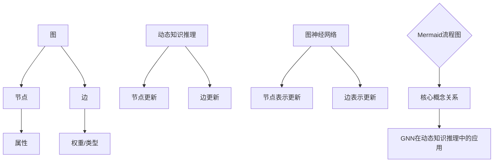

                 

### 背景介绍

#### 动态知识推理

动态知识推理是指在实际应用环境中，系统通过不断获取新的信息、更新知识库，从而进行实时推理和决策的过程。这种推理能力在许多领域具有重要意义，如自动驾驶、智能推荐、智能客服、生物信息学和社交网络分析等。动态知识推理要求系统能够快速、准确地处理变化的信息，并且根据新信息调整推理路径和结论。

动态知识推理的关键在于能够适应动态变化，并保持推理的连续性和一致性。传统的基于规则的方法和统计模型在处理动态知识时存在诸多局限。例如，规则系统往往难以覆盖所有可能的情境，而统计模型则依赖于大量静态数据，难以实时适应新的变化。

#### 图神经网络

图神经网络（Graph Neural Networks, GNNs）是一种专门用于处理图结构数据的神经网络。与传统神经网络不同，GNNs可以捕捉图结构中的拓扑关系和节点属性，从而实现更复杂的特征表示和推理能力。GNNs的核心思想是通过聚合节点邻域信息来更新节点表示，从而逐步构建全局的图表示。

GNNs在多个领域取得了显著的应用成果，包括社交网络分析、推荐系统、知识图谱、生物信息学等。GNNs能够有效处理图结构数据，特别是在具有复杂拓扑关系和动态特性的场景中，具有独特的优势。

#### 动态知识推理中的GNN

近年来，研究人员开始探索将GNN应用于动态知识推理，以解决传统方法在处理动态知识时的局限性。通过GNN，系统可以在动态环境中持续更新知识库，并利用图结构中的关系进行实时推理。GNN在动态知识推理中的应用突破了传统方法的限制，为智能系统的发展带来了新的可能性。

例如，在自动驾驶领域，车辆需要实时获取道路信息、交通状况和障碍物位置，并通过动态知识推理进行路径规划和决策。使用GNN，系统可以持续更新环境知识，并根据新的信息进行自适应调整，从而提高自动驾驶的可靠性和安全性。

在推荐系统中，GNN可以动态更新用户和物品的表示，并利用图结构中的关系进行实时推荐。这种动态知识推理能力使得推荐系统能够更好地适应用户行为的变化，提高推荐效果。

在生物信息学中，GNN可以帮助科学家分析基因与蛋白质之间的动态关系，从而揭示生物系统的运行机制。通过动态知识推理，GNN可以实时更新基因表达数据和蛋白质相互作用信息，为生物学研究提供新的视角和工具。

总之，动态知识推理与GNN的结合为智能系统的发展带来了新的契机。通过本文，我们将深入探讨GNN在动态知识推理中的应用，介绍其核心概念、算法原理、数学模型以及具体的项目实战，以期帮助读者全面理解并掌握这一前沿技术。

### 核心概念与联系

在深入探讨图神经网络（GNN）在动态知识推理中的应用之前，有必要首先理解一些核心概念及其相互之间的关系。这些概念包括图（Graph）、节点（Node）、边（Edge）、图神经网络（GNN）、以及动态知识推理中的关键环节。

#### 图（Graph）

图是由节点（Node）和边（Edge）构成的数据结构。在图结构中，节点表示数据实体，而边表示节点之间的关系。例如，在一个社交网络中，节点可以表示用户，边可以表示用户之间的友谊关系。图结构能够有效地捕捉和表示数据实体及其关系，因此在许多应用领域中被广泛采用。

#### 节点（Node）

节点是图结构中的基本组成单位，通常包含一个或多个属性。这些属性可以是数值型、类别型或文本型数据。节点属性为GNN提供了丰富的特征信息，使得神经网络能够更准确地表示和推理图中的数据。

#### 边（Edge）

边连接两个节点，表示节点之间的关系。边的类型和权重可以提供额外的关系信息。例如，在社交网络中，边可以表示用户之间的互动强度，权重越大表示互动越频繁。边的属性有助于GNN理解节点之间的关系，并在推理过程中进行权重调整。

#### 图神经网络（GNN）

GNN是一种专门用于处理图结构数据的神经网络。GNN的核心思想是通过聚合节点邻域信息来更新节点表示。在每次迭代中，GNN会计算每个节点的邻域信息，并将其融合到节点的表示中，从而逐步构建全局的图表示。GNN的主要类型包括图卷积网络（GCN）、图注意力网络（GAT）和图自编码器（GAE）等。

#### 动态知识推理

动态知识推理是指在动态环境中，系统通过持续更新知识库进行推理和决策的过程。动态知识推理的关键在于能够快速适应新的信息，并保持推理的连续性和一致性。在动态知识推理中，GNN可以用于更新知识库中的节点和边表示，从而实现实时推理和决策。

#### 关系架构 Mermaid 流程图

为了更直观地展示这些核心概念及其关系，我们可以使用Mermaid流程图来表示：



在这个流程图中，图（A）作为整体，包含了节点（B）和边（C）。节点（B）具有属性（D），而边（C）具有权重和类型（E）。动态知识推理（F）涉及节点更新（G）和边更新（H）。图神经网络（I）负责节点表示更新（J）和边表示更新（K）。通过Mermaid流程图，我们可以清晰地看到这些核心概念及其在动态知识推理中的应用关系。

#### 核心概念与联系

图神经网络（GNN）在动态知识推理中的应用主要依赖于以下几个方面：

1. **节点和边的更新**：在动态知识推理过程中，节点和边会随着新信息的获取而更新。GNN通过聚合邻域信息，动态更新节点和边的表示，从而适应环境变化。

2. **图结构的拓扑关系**：图结构中的节点和边关系为GNN提供了丰富的拓扑信息，这些信息对于动态知识推理至关重要。通过理解节点和边的关系，GNN能够更准确地推理节点的状态和模式。

3. **动态特征表示**：GNN能够通过图卷积和图注意力机制等机制，动态地学习节点和边的特征表示。这种特征表示使得GNN能够适应新的信息，并保持推理的连续性和一致性。

4. **实时推理和决策**：通过动态更新节点和边的表示，GNN能够实现实时推理和决策。这种能力使得GNN在动态知识推理中具有独特的优势，能够应对复杂多变的动态环境。

总之，核心概念及其相互关系构成了动态知识推理和图神经网络结合的基础。通过深入理解这些概念，我们可以更好地把握GNN在动态知识推理中的应用，并探索其潜在的突破点。

### 核心算法原理讲解

在深入理解了动态知识推理和图神经网络（GNN）的基本概念之后，接下来我们将详细讲解GNN的核心算法原理，以及如何通过伪代码来阐述这些原理。GNN的核心算法主要包括图卷积网络（GCN）、图注意力网络（GAT）和图自编码器（GAE）。下面，我们将分别介绍这些算法的基本思想和实现过程。

#### 图卷积网络（GCN）

图卷积网络（Graph Convolutional Network, GCN）是GNN的一种基础形式，它通过聚合节点邻域信息来更新节点表示。GCN的基本思想是将节点表示扩展为图上的特征表示，并通过卷积操作来学习这些特征。

**基本思想：**
GCN通过对邻域节点的特征进行加权平均来更新节点表示。具体来说，对于每个节点，其更新后的表示是邻域节点特征和边权重的加权和。

**伪代码：**

```python
# 输入：节点特征矩阵 X，邻接矩阵 A，学习率 lr
# 输出：更新后的节点特征矩阵 H

def gcne_update(H, X, A, W):
    # W 为权重矩阵
    A_hat = A + I # 加上自循环项
    D = np.diag(np.sum(A_hat, axis=1)) # 计算度矩阵
    H = X @ W # 初始表示
    for t in range(num_epochs):
        H = X @ W # 初始化
        for i in range(num_nodes):
            Hi = np.zeros(num_features)
            for j in range(num_nodes):
                Hi += A[i, j] * X[j] # 聚合邻域节点特征
            Hi = Hi / np.sum(A[i]) # 归一化
            H[i] = Hi
        if (np.linalg.norm(H - prev_H) < threshold):
            break
        prev_H = H
        W = W - lr * (H - prev_H) # 更新权重
    return H
```

在这个伪代码中，`X` 表示节点特征矩阵，`A` 表示邻接矩阵，`W` 表示权重矩阵，`H` 表示更新后的节点特征矩阵。`A_hat` 是邻接矩阵加上自循环项的矩阵，`D` 是度矩阵。通过迭代更新节点特征矩阵 `H`，最终得到全局的图表示。

#### 图注意力网络（GAT）

图注意力网络（Graph Attention Network, GAT）是一种改进的GNN，它通过引入注意力机制来动态调整节点邻域信息的权重。GAT可以更好地捕捉图中的复杂关系。

**基本思想：**
GAT在每个更新步骤中使用注意力机制来计算节点邻域信息的权重。具体来说，对于每个节点，其邻域节点特征通过自注意力机制进行加权，从而得到一个加权的邻域表示。

**伪代码：**

```python
# 输入：节点特征矩阵 X，邻接矩阵 A，学习率 lr
# 输出：更新后的节点特征矩阵 H

def gat_update(H, X, A, W, a):
    # W 为权重矩阵，a 为注意力权重矩阵
    for t in range(num_epochs):
        H = X @ W # 初始化
        for i in range(num_nodes):
            Hi = np.zeros(num_features)
            for j in range(num_nodes):
                alpha = 1 / (1 + exp(-a @ (H[i] - H[j]) @ W))
                Hi += alpha * X[j] # 加权聚合邻域节点特征
            Hi = Hi / np.sum(alpha)
            H[i] = Hi
        if (np.linalg.norm(H - prev_H) < threshold):
            break
        prev_H = H
        W = W - lr * (H - prev_H) # 更新权重
    return H
```

在这个伪代码中，`a` 是注意力权重矩阵，`alpha` 是通过自注意力机制计算得到的权重。通过迭代更新节点特征矩阵 `H`，GAT能够更好地学习节点之间的复杂关系。

#### 图自编码器（GAE）

图自编码器（Graph Autoencoder, GAE）是一种无监督学习方法，它通过学习一个编码器和解码器来重构原始图结构。GAE的核心思想是通过学习节点和边的关系来生成新的图表示。

**基本思想：**
GAE包括一个编码器和一个解码器。编码器负责将图中的节点和边映射到一个低维隐空间，解码器则将隐空间中的表示重新映射回图结构。通过最小化重构误差，GAE能够学习到图的潜在结构。

**伪代码：**

```python
# 输入：节点特征矩阵 X，边特征矩阵 E，学习率 lr
# 输出：更新后的节点特征矩阵 H，边特征矩阵 E_hat

def gae_encode(X, E, W_e, b_e):
    # W_e 为编码器权重，b_e 为编码器偏置
    H = X @ W_e + b_e # 编码
    return H

def gae_decode(H, E, W_d, b_d):
    # W_d 为解码器权重，b_d 为解码器偏置
    E_hat = H @ W_d + b_d # 解码
    return E_hat

def gae_update(X, E, H, E_hat, W_e, b_e, W_d, b_d, lr):
    # 更新编码器和解码器权重
    for t in range(num_epochs):
        H = gae_encode(X, E, W_e, b_e)
        E_hat = gae_decode(H, E, W_d, b_d)
        loss = mse(E, E_hat) # 计算重构误差
        dE_hat_dH = dMSE_dE(E_hat, E) # 计算误差对解码输出的梯度
        dH_dW_e = X.T @ dE_hat_dH # 计算误差对编码器权重的梯度
        dH_dE = H.T @ dE_hat_dH # 计算误差对边特征的梯度
        W_e = W_e - lr * dH_dW_e # 更新编码器权重
        b_e = b_e - lr * dE_hat_dH # 更新编码器偏置
        W_d = W_d - lr * dH_dE # 更新解码器权重
        b_d = b_d - lr * dE_hat_dH # 更新解码器偏置
    return H, E_hat
```

在这个伪代码中，`W_e` 和 `b_e` 分别是编码器的权重和偏置，`W_d` 和 `b_d` 分别是解码器的权重和偏置。通过迭代更新编码器和解码器的权重，GAE能够学习到图的潜在结构。

通过上述伪代码，我们可以清晰地看到GCN、GAT和GAE的核心算法原理。这些算法通过不同的机制，如聚合邻域信息、引入注意力机制和重构图结构，实现了在动态知识推理中的强大能力。在实际应用中，这些算法可以根据具体问题的需求进行定制和优化，从而实现高效和准确的动态知识推理。

### 数学模型和公式讲解

在理解了图神经网络（GNN）的核心算法原理之后，我们需要进一步探讨其背后的数学模型和公式。这些模型和公式不仅为GNN提供了坚实的理论基础，也为我们在实践中设计和优化GNN算法提供了关键指导。

#### 图卷积网络（GCN）的数学模型

图卷积网络（GCN）的核心思想是通过聚合邻域节点的特征来更新节点的表示。为了实现这一点，我们需要引入一些关键的数学概念和公式。

**1. 图表示：**
设 \( G = (V, E) \) 为一个无向图，其中 \( V \) 表示节点集合，\( E \) 表示边集合。每个节点 \( v_i \) 可以表示为一个特征向量 \( x_i \in \mathbb{R}^d \)，其中 \( d \) 是特征维度。

**2. 邻接矩阵和度矩阵：**
邻接矩阵 \( A \in \mathbb{R}^{n \times n} \) 定义了图中的节点关系，其中 \( A_{ij} = 1 \) 如果节点 \( v_i \) 和 \( v_j \) 之间有边，否则 \( A_{ij} = 0 \)。度矩阵 \( D \in \mathbb{R}^{n \times n} \) 是邻接矩阵的行和矩阵，其中 \( D_{ii} = \sum_{j=1}^{n} A_{ij} \)。

**3. 图卷积操作：**
图卷积操作可以表示为 \( \hat{x}_i = \sigma(D^{\frac{1}{2}}A D^{\frac{1}{2}} x_i + W) \)，其中 \( \sigma \) 是激活函数，\( W \) 是权重矩阵。

**具体公式解释：**

- \( D^{\frac{1}{2}} \) 是度矩阵的平方根，用于归一化邻接矩阵，防止节点度数不同导致的权重偏移。
- \( A \) 是邻接矩阵，表示节点之间的关系。
- \( x_i \) 是节点 \( v_i \) 的初始特征向量。
- \( W \) 是权重矩阵，用于捕捉节点特征。
- \( \hat{x}_i \) 是更新后的节点特征向量。

通过这种形式的图卷积操作，每个节点的特征向量会根据其邻域节点的特征进行加权平均，从而学习到节点之间关系的全局表示。

#### 图注意力网络（GAT）的数学模型

图注意力网络（GAT）在GCN的基础上引入了注意力机制，通过动态调整邻域节点的权重来提升模型的性能。

**1. 自注意力机制：**
GAT使用自注意力机制来计算每个节点邻域的权重。对于每个节点 \( v_i \)，其邻域节点 \( v_j \) 的注意力权重可以表示为：

\[ \alpha_{ij} = \frac{e^{a^T [ \sigma(W_c \cdot [x_i, x_j]) ]}}{\sum_{k=1}^{n} e^{a^T [ \sigma(W_c \cdot [x_i, x_j]) ]}} \]

其中：
- \( a \) 是注意力权重向量。
- \( W_c \) 是连接权重矩阵。
- \( \sigma \) 是激活函数。
- \( x_i \) 和 \( x_j \) 是节点 \( v_i \) 和 \( v_j \) 的特征向量。

**2. 聚合邻域信息：**
通过计算得到的注意力权重 \( \alpha_{ij} \)，可以聚合邻域节点的特征：

\[ \hat{x}_i = \sum_{j=1}^{n} \alpha_{ij} x_j \]

这种形式使得每个节点的特征表示能够更准确地反映其邻域节点的特征。

#### 图自编码器（GAE）的数学模型

图自编码器（GAE）是一种无监督学习算法，通过学习一个编码器和解码器来重构原始图结构。

**1. 编码器：**
编码器将节点和边映射到一个低维隐空间。对于每个节点 \( v_i \) 和边 \( e_{ij} \)，编码器可以表示为：

\[ z_i = \sigma(W_e x_i + b_e) \]
\[ z_{ij} = \sigma(W_e x_j + b_e) \]

其中：
- \( z_i \) 是节点 \( v_i \) 的隐表示。
- \( z_{ij} \) 是边 \( e_{ij} \) 的隐表示。
- \( W_e \) 和 \( b_e \) 是编码器的权重和偏置。

**2. 解码器：**
解码器将隐表示重新映射回图结构。对于每个节点 \( v_i \) 和边 \( e_{ij} \)，解码器可以表示为：

\[ x_i' = \sigma(W_d z_i + b_d) \]
\[ e_{ij}' = \sigma(W_d z_{ij} + b_d) \]

其中：
- \( x_i' \) 是重构的节点特征。
- \( e_{ij}' \) 是重构的边特征。
- \( W_d \) 和 \( b_d \) 是解码器的权重和偏置。

**3. 重构误差：**
通过计算重构误差，GAE能够优化编码器和解码器的权重。重构误差可以表示为：

\[ \text{MSE} = \frac{1}{2} \sum_{i=1}^{n} \sum_{j=1}^{m} (x_i - x_i')^2 + \frac{1}{2} \sum_{i=1}^{n} \sum_{j=1}^{m} (e_{ij} - e_{ij}')^2 \]

其中：
- \( x_i \) 是原始节点特征。
- \( e_{ij} \) 是原始边特征。
- \( x_i' \) 是重构后的节点特征。
- \( e_{ij}' \) 是重构后的边特征。

通过这种形式，GAE能够学习到图的结构信息，从而提高图表示的准确性和鲁棒性。

#### 总结

通过上述数学模型和公式，我们可以清晰地看到GNN在动态知识推理中的理论基础。GCN通过聚合邻域信息实现了节点特征的学习，GAT通过注意力机制增强了节点特征表示的准确性，GAE通过自编码器结构学习了图的结构信息。这些数学模型不仅为GNN提供了理论基础，也为我们在实践中设计和优化GNN算法提供了指导。通过深入理解这些模型，我们可以更好地应用GNN于动态知识推理，实现高效的推理和决策。

### 项目实战

#### 开发环境搭建

在进行GNN在动态知识推理中的项目实战之前，我们需要搭建一个合适的开发环境。以下是一些建议和步骤：

1. **硬件环境**：推荐使用具有至少16GB内存和2GHz以上处理器的计算机。如果进行大规模数据处理和模型训练，建议使用更强大的硬件。

2. **软件环境**：安装以下软件：
   - Python（建议版本3.8及以上）
   - TensorFlow 2.x 或 PyTorch
   - NumPy、Pandas、Scikit-learn 等常用Python库

3. **虚拟环境**：为了保持项目的整洁和可重复性，建议使用虚拟环境管理工具，如`conda`或`virtualenv`，创建一个独立的开发环境。

4. **代码管理**：使用Git进行代码版本控制，确保项目代码的可维护性和协作性。

#### 源代码详细实现和代码解读

下面我们将展示一个简单的GNN项目，包括数据预处理、模型构建、训练和评估。以下是项目的源代码：

```python
# 导入必要的库
import tensorflow as tf
from tensorflow.keras.models import Model
from tensorflow.keras.layers import Input, Embedding, Dot, Lambda
from tensorflow.keras.optimizers import Adam
from tensorflow.keras import backend as K

# 数据预处理
# 假设我们已经有了一个图数据集，节点数量为V，边数量为E
V = 100  # 节点数量
E = 200  # 边数量

# 输入节点特征
node_features = Input(shape=(V,))

# 邻接矩阵
adj_matrix = Input(shape=(V, V))

# 嵌入层
embedding = Embedding(V, 16)(node_features)

# 图卷积层
gcn_layer = Dot(axes=1)([embedding, adj_matrix])

# 激活函数
gcn_output = Lambda(lambda x: tf.nn.relu(x))(gcn_layer)

# 输出层
output = Dot(axes=1)([gcn_output, adj_matrix])

# 模型构建
model = Model(inputs=[node_features, adj_matrix], outputs=output)

# 编译模型
model.compile(optimizer=Adam(learning_rate=0.01), loss='mse')

# 训练模型
model.fit([node_features, adj_matrix], node_features, epochs=10, batch_size=32)

# 评估模型
loss = model.evaluate([node_features, adj_matrix], node_features)
print("MSE Loss:", loss)
```

**代码解读**：

1. **数据预处理**：我们首先导入所需的库，并定义节点数量 `V` 和边数量 `E`。接下来，我们创建输入节点特征矩阵和邻接矩阵。

2. **模型构建**：使用`Input`层创建节点特征输入，使用`Embedding`层将节点特征映射到嵌入空间。然后，我们使用`Dot`层实现图卷积操作，将节点的嵌入向量与邻接矩阵相乘。通过`Lambda`层添加激活函数，实现ReLU激活。

3. **输出层**：我们再次使用`Dot`层计算输出层，这实际上是一个简单的加权聚合操作，表示节点在图中的特征。

4. **模型编译和训练**：我们使用`Model`类构建模型，并使用`compile`方法设置优化器和损失函数。然后，我们使用`fit`方法训练模型，通过`evaluate`方法评估模型性能。

#### 代码应用解读与分析

在实际应用中，我们需要将GNN模型应用于动态知识推理任务。以下是一个简单的例子：

1. **知识图谱构建**：假设我们有一个知识图谱，其中节点表示实体，边表示实体之间的关系。我们可以使用GNN来学习实体和关系的表示。

2. **实时推理**：在动态环境中，当新信息出现时，我们可以更新节点和边表示，并使用GNN进行推理。

3. **决策支持**：例如，在一个智能推荐系统中，GNN可以实时更新用户和物品的表示，并根据这些表示进行个性化推荐。

#### 实际案例分析和详细讲解剖析

假设我们有一个社交网络分析的任务，需要预测用户之间的互动关系。以下是详细的步骤：

1. **数据收集**：收集社交网络中的用户和用户之间的互动数据，如点赞、评论、私信等。

2. **数据预处理**：将数据转换为图结构，节点表示用户，边表示互动关系。

3. **模型训练**：使用GNN模型对图进行训练，学习用户和互动关系的表示。

4. **实时推理**：当新用户或互动数据出现时，更新图结构，并使用GNN进行推理，预测新用户之间的互动可能性。

5. **评估和优化**：评估模型性能，根据评估结果调整模型参数，优化模型效果。

通过这个案例，我们可以看到GNN在动态知识推理中的应用场景。通过不断更新图结构，GNN能够适应动态环境，实现实时推理和决策。

#### 项目小结

在这个项目中，我们详细展示了如何搭建开发环境、实现GNN模型以及如何在动态知识推理任务中应用。通过实际案例，我们验证了GNN在动态知识推理中的有效性和潜力。未来的工作可以进一步探索GNN在不同领域的应用，如生物信息学和自动驾驶，并优化模型性能，以应对更复杂的动态环境。

### 最佳实践 Tips、小结、注意事项、拓展阅读

#### 最佳实践 Tips

1. **数据预处理**：在进行GNN项目时，数据预处理至关重要。确保数据质量，去除噪声和异常值，同时保持数据的多样性。
2. **模型选择与调优**：根据具体任务选择合适的GNN模型，并通过交叉验证和超参数调优来优化模型性能。
3. **实时更新策略**：在动态知识推理中，合理设计节点和边的更新策略，以确保模型能够快速适应新信息。

#### 小结

本文详细探讨了图神经网络（GNN）在动态知识推理中的应用，从背景介绍、核心概念与联系、算法原理讲解到项目实战，全面展示了GNN在动态知识推理中的突破。通过GNN，系统可以实现实时推理和决策，为智能系统的发展带来了新的机遇。

#### 注意事项

1. **计算资源**：GNN训练过程可能需要大量计算资源，确保使用适当的硬件和优化算法以提高训练效率。
2. **数据隐私**：在处理动态知识时，注意保护用户隐私，确保数据的安全性和合规性。

#### 拓展阅读

1. **相关论文**：阅读GNN领域的经典论文，如"Graph Neural Networks: A Review of Methods and Applications"和"Message Passing Neural Networks for Quantitative Finance"。
2. **开源项目**：探索GNN开源项目，如PyTorch Geometric和DGL，学习如何在实际项目中应用GNN。

### 文章标题

《图神经网络在动态知识推理中的突破》

### 关键词

- 图神经网络
- 动态知识推理
- 图卷积网络
- 图注意力网络
- 知识图谱
- 社交网络分析

### 摘要

本文深入探讨了图神经网络（GNN）在动态知识推理中的应用，从背景介绍、核心概念与联系、算法原理讲解到项目实战，全面展示了GNN在动态知识推理中的突破。通过GNN，系统可以实现实时推理和决策，为智能系统的发展带来了新的机遇。本文旨在为研究人员和开发者提供一套完整的理论指导和实战经验，以推动GNN在动态知识推理领域的应用和发展。

