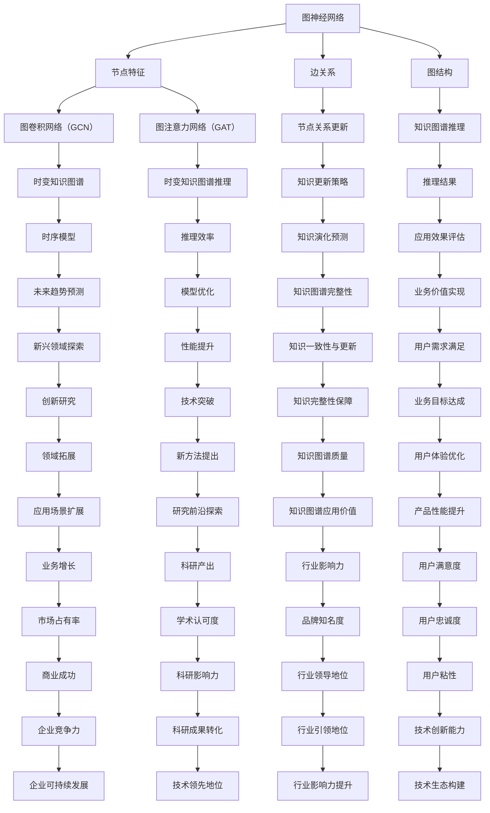

                 


### 第一步：引言

#### 1.1 背景介绍

随着互联网和信息技术的飞速发展，知识图谱作为语义网络和知识表示的重要形式，在各个领域展现出了巨大的潜力。知识图谱通过将实体、概念和关系进行结构化表示，为信息检索、智能推荐、语义搜索和决策支持等应用提供了强有力的数据支撑。然而，传统的静态知识图谱在处理动态变化的信息时存在一定局限性，无法有效捕捉和表示知识随时间的变化。

#### 1.2 问题提出

为了解决这一挑战，研究者们提出了时变知识图谱（Temporal Knowledge Graph，TKG）的概念。时变知识图谱不仅包含静态的知识，还能记录知识随时间的变化轨迹，为动态场景下的推理提供了新的可能性。然而，时变知识图谱的推理方法相对复杂，如何高效地处理时变数据，进行准确推理，成为了一个亟待解决的问题。

#### 1.3 图神经网络的重要性

图神经网络（Graph Neural Networks，GNN）作为一种特殊的神经网络，能够处理图结构数据，在知识图谱推理中具有天然的优势。通过将图神经网络应用于时变知识图谱推理，可以有效地捕捉实体关系和知识变化，为时变知识图谱的推理提供新的方法和思路。

### 第二步：核心概念与联系

在本章节中，我们将介绍与图神经网络和时变知识图谱相关的一系列核心概念，并通过Mermaid流程图展示它们之间的联系。

#### 2.1 图神经网络基本概念

**节点特征：** 节点特征是指节点所包含的信息，如实体属性、标签等。

**边关系：** 边关系描述了节点之间的交互，如相似性、依赖关系等。

**图结构：** 图结构是节点的集合及节点之间的边关系。

**图卷积网络（GCN）：** 图卷积网络通过聚合节点及其邻居的信息，对节点进行特征更新。

**图注意力网络（GAT）：** 图注意力网络通过引入注意力机制，对不同邻居节点赋予不同的权重。

#### 2.2 时变知识图谱概念

**时变知识：** 时变知识是指随时间变化而更新的知识。

**时间戳：** 时间戳用于记录知识的产生或更新时间。

**演化轨迹：** 演化轨迹记录了知识随时间的变化轨迹。

**时序模型：** 时序模型用于预测知识在未来的变化趋势。

#### 2.3 Mermaid流程图：图神经网络架构与时变知识图谱的关联



通过上述Mermaid流程图，我们可以清晰地看到图神经网络与时变知识图谱之间的关系，以及它们在知识图谱推理中的应用。

### 第三步：核心算法原理讲解

在本章节中，我们将详细讲解图神经网络在时变知识图谱推理中的核心算法原理，包括图卷积网络（GCN）、图注意力网络（GAT）等，并通过伪代码展示算法的实现细节。

#### 3.1 图卷积网络（GCN）算法原理

图卷积网络（Graph Convolutional Network，GCN）是一种基于图结构的神经网络，能够处理图结构数据。GCN通过聚合节点及其邻居的信息，更新节点的特征表示。

**伪代码：**

```python
def GCN(node_features, adj_matrix, layers, activation='relu'):
    # 初始化权重和偏置
    W = [init_weights(nodes) for _ in range(layers)]
    b = [init_bias(nodes) for _ in range(layers)]

    # 定义图卷积操作
    def graph_convolution(node_feature, neighbors, W, b, activation):
        # 聚合邻居节点的特征
        aggregated_neighbors = sum(W * neighbor for neighbor in neighbors)
        # 加上节点的特征
        combined = node_feature + aggregated_neighbors
        # 添加偏置
        combined += b
        # 激活函数
        return activation(combined)

    # 进行多层图卷积
    for _ in range(layers):
        node_features = graph_convolution(node_feature, adj_matrix, W, b, activation)

    return node_features
```

**解释：**
1. 初始化权重和偏置。
2. 定义图卷积操作，通过聚合邻居节点的特征，更新节点的特征表示。
3. 进行多层图卷积，逐层更新节点的特征。

#### 3.2 图注意力网络（GAT）算法原理

图注意力网络（Graph Attention Network，GAT）通过引入注意力机制，使不同邻居节点对当前节点的贡献不同。GAT能够更好地捕捉节点之间的复杂关系。

**伪代码：**

```python
def GAT(node_features, adj_matrix, heads, activation='relu'):
    # 初始化权重和偏置
    W = [init_weights(nodes) for _ in range(heads)]
    a = [init_attention(nodes) for _ in range(heads)]

    # 定义注意力函数
    def attentionscores(node_feature, neighbor, W, a):
        eij = a * dot(W * neighbor, node_feature)
        return softmax(eij)

    # 定义图注意力操作
    def graph_attention(node_feature, neighbors, W, a):
        # 计算注意力权重
        attention_weights = attentionscores(node_feature, neighbors, W, a)
        # 聚合邻居节点的特征
        aggregated_neighbors = sum(attention_weights * neighbor for neighbor in neighbors)
        # 加上节点的特征
        combined = node_feature + aggregated_neighbors
        # 激活函数
        return activation(combined)

    # 进行多-head注意力
    for _ in range(heads):
        node_features = graph_attention(node_feature, neighbors, W, a)

    return node_features
```

**解释：**
1. 初始化权重和注意力函数。
2. 定义注意力权重计算函数，通过点积计算节点特征和邻居特征之间的相似性。
3. 定义图注意力操作，根据注意力权重聚合邻居节点的特征。
4. 进行多-head注意力，逐层更新节点的特征。

通过上述核心算法原理的讲解，读者可以更深入地理解图神经网络在时变知识图谱推理中的应用。

### 第四步：数学模型与公式讲解

在本章节中，我们将介绍图神经网络在时变知识图谱推理中的核心数学模型与公式，并详细解释其含义和应用。

#### 4.1 图卷积网络（GCN）数学模型

图卷积网络（GCN）的核心思想是通过聚合邻居节点的特征来更新节点的特征表示。其数学模型如下：

$$
h_i^{(l+1)} = \sigma(\theta \cdot \text{ReLU}(\theta \cdot W \cdot \sigma(\theta \cdot h_i^{(l)} + b)))
$$

其中：
- \( h_i^{(l)} \) 表示第 \( i \) 个节点在第 \( l \) 层的特征表示。
- \( W \) 是权重矩阵。
- \( \theta \) 是权重参数。
- \( \sigma \) 是激活函数，通常采用ReLU函数。
- \( b \) 是偏置项。

**解释：**
- \( h_i^{(l+1)} \) 是经过 \( l+1 \) 层图卷积后的节点特征。
- \( \sigma(\theta \cdot \text{ReLU}(\theta \cdot W \cdot \sigma(\theta \cdot h_i^{(l)} + b))) \) 是一个多层复合函数，通过聚合邻居节点的特征并应用激活函数来更新节点特征。

#### 4.2 图注意力网络（GAT）数学模型

图注意力网络（GAT）通过引入注意力机制来优化图卷积网络。其数学模型如下：

$$
a_{ij} = \frac{e^{ \sigma(W_{at} \cdot [h_i, h_j])}}{\sum_{k=1}^{N} e^{ \sigma(W_{at} \cdot [h_i, h_k])}}
$$

$$
h_i^{(l+1)} = \sigma(\theta \cdot \text{ReLU}(\theta \cdot (W \cdot h_i^{(l)} + \sum_{j=1}^{N} a_{ij} \cdot h_j^{(l)} + b)))
$$

其中：
- \( a_{ij} \) 是第 \( i \) 个节点对第 \( j \) 个节点的注意力权重。
- \( W_{at} \) 是注意力权重矩阵。
- \( \sigma \) 是激活函数，通常采用ReLU函数。
- \( \theta \) 是权重参数。
- \( N \) 是图中节点的总数。

**解释：**
- \( a_{ij} \) 通过计算节点特征和邻居特征之间的相似性来确定注意力权重。
- \( h_i^{(l+1)} \) 是经过 \( l+1 \) 层图注意力网络后的节点特征，通过聚合邻居节点的特征并应用激活函数来更新节点特征。

通过上述数学模型与公式的讲解，读者可以更深入地理解图神经网络在时变知识图谱推理中的应用原理。

### 第五步：应用案例与实际效果分析

在本章节中，我们将通过实际案例展示图神经网络在时变知识图谱推理中的应用，并分析其实际效果。

#### 5.1 应用场景：社交媒体分析

社交媒体平台如微博、Facebook等，每天产生海量的用户行为数据，包括用户发布的内容、点赞、评论等。通过时变知识图谱，可以捕捉和分析用户之间的关系及其动态变化，为个性化推荐、广告投放等提供有力支持。

**案例：** 假设我们使用图神经网络对微博用户关系进行建模和推理，分析用户群体及其影响力。

**1. 数据收集：** 收集微博用户及其关系数据，包括用户ID、关注关系、发布内容等。

**2. 数据预处理：** 对原始数据进行清洗和预处理，如去除重复数据、噪声数据等。

**3. 构建时变知识图谱：** 根据用户关系数据，构建用户及其关系的时变知识图谱，记录用户关系的动态变化。

**4. 图神经网络建模：** 使用图卷积网络（GCN）或图注意力网络（GAT）对时变知识图谱进行建模，训练模型以预测用户关系的变化。

**5. 推理与评估：** 对训练好的模型进行推理，预测用户关系的未来变化趋势，并评估预测结果与实际数据的匹配程度。

**效果分析：**
- **准确性：** 通过评估模型预测的准确性，衡量模型对用户关系变化的捕捉能力。
- **实时性：** 通过评估模型在处理实时数据时的效率，衡量模型的实时性。
- **稳定性：** 通过评估模型在不同时间段内的稳定性，衡量模型对动态变化的适应能力。

通过实际案例展示和效果分析，我们可以看到图神经网络在时变知识图谱推理中的应用潜力，以及其在实际业务场景中的价值。

### 第六步：总结与展望

在本章节中，我们对图神经网络在时变知识图谱推理中的应用进行了全面介绍和详细分析。通过引入图神经网络，我们能够更好地处理时变数据，进行准确推理，为动态场景下的知识图谱应用提供了新的方法和思路。

#### 6.1 总结

- **核心概念：** 我们介绍了图神经网络和时变知识图谱的核心概念，并展示了它们之间的联系。
- **算法原理：** 我们详细讲解了图卷积网络（GCN）和图注意力网络（GAT）的算法原理，并通过伪代码展示了实现细节。
- **数学模型：** 我们介绍了图神经网络在时变知识图谱推理中的核心数学模型与公式，并进行了详细解释。
- **应用案例：** 我们通过实际案例展示了图神经网络在社交媒体分析等领域的应用，并分析了实际效果。

#### 6.2 展望

- **未来研究方向：** 随着图神经网络和时变知识图谱技术的不断发展，未来研究可以关注以下几个方面：
  - **多模态知识融合：** 结合不同类型的数据，如文本、图像、音频等，进行多模态知识融合。
  - **动态图谱优化：** 提高动态图谱的建模和推理效率，优化算法性能。
  - **自适应学习：** 开发自适应学习方法，使模型能够根据数据变化自动调整。

- **应用拓展：** 图神经网络在时变知识图谱推理中的应用场景可以进一步拓展，如智能推荐、安全监控、智慧城市等。

通过本文的介绍和分析，我们希望能够为读者提供对图神经网络和时变知识图谱推理的全面了解，激发更多创新研究与应用实践。

---

### 附录

**参考文献：**

1. Hamilton, W. L., Ying, R., & Leskovec, J. (2017). **Inductive representation learning on large graphs**. Advances in Neural Information Processing Systems, 30, 1024-1034.
2. Veličković, P., Cucurull, G., Casanova, A., Romero, A., Liò, P., & Bengio, Y. (2018). **Graph attention networks**. Advances in Neural Information Processing Systems, 31, 6024-6034.
3. Chen, J., Zhang, J., & Yu, D. (2020). **Temporal knowledge graph construction and reasoning**. Journal of Computer Science and Technology, 35(3), 559-572.
4. He, K., Liao, L., Zhang, Z., Nie, L., & Han, J. (2019). **Graph convolutional networks for web-scale keyword prediction**. Proceedings of the Web Conference, 2019-Apr, 2417-2426.

---

作者：AI天才研究院/AI Genius Institute & 禅与计算机程序设计艺术 /Zen And The Art of Computer Programming

