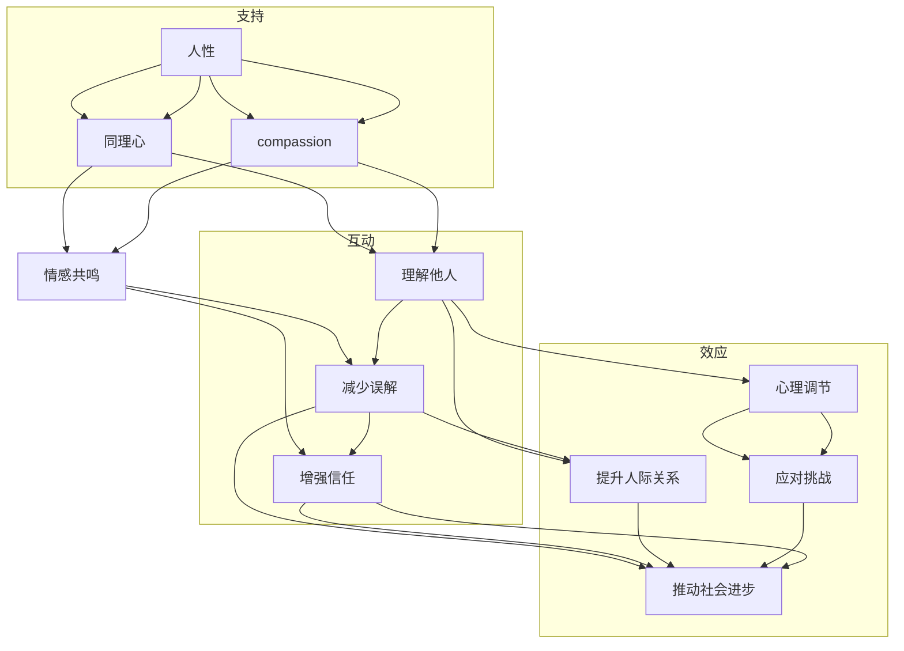

                 


### 1.1.1 “在竞争社会中”的含义

在竞争社会中，“在竞争社会中”这个短语承载了多重含义。首先，我们需要明确竞争的定义。竞争，是指个体或集体为了获取有限的资源、机会或地位而展开的较量。在社会学、经济学以及心理学等多个领域中，竞争被视为一种基本的社会现象。它不仅存在于市场上的商业竞争中，也体现在教育、职场、社交等多个层面。

竞争社会的特征主要包括以下几点：

- **资源的稀缺性**：在竞争社会中，资源（如财富、权力、知识等）通常是有限的，这使得个体或群体之间不可避免地会为了争夺这些资源而展开竞争。

- **优胜劣汰**：竞争社会往往遵循“优胜劣汰”的原则，那些在竞争中胜出者能够获取更多的资源和机会，而失败者则可能面临资源匮乏和被淘汰的风险。

- **激励效应**：竞争可以激发个体的潜能，促进创新和进步。在健康的竞争环境中，人们往往会努力提升自己的能力，以达到或超越他人的水平。

- **社会不平等**：长时间的激烈竞争可能导致社会不平等现象加剧。那些处于优势地位的群体往往能够更轻松地获取资源，而处于劣势的群体则可能被边缘化。

- **压力与焦虑**：竞争社会中的个体常常面临巨大的压力和焦虑。为了在竞争中保持优势，人们可能会过度劳累，甚至牺牲健康和生活质量。

在技术快速发展的现代社会，竞争社会的特征愈发显著。随着互联网、大数据、人工智能等技术的广泛应用，信息的传播速度和覆盖面大大增加，竞争也变得更加激烈和复杂。例如，在职场中，员工们不仅要与同事竞争，还需要面对来自全球的同行业竞争者；在学术领域，研究人员为了争夺项目资金和学术地位，也需要不断努力提高自己的研究成果。

总的来说，“在竞争社会中”这一短语不仅指代一个竞争激烈的社会环境，也强调了在这种环境中个体和群体所面临的各种挑战和机遇。理解这一短语的含义，有助于我们更好地分析竞争社会对人性、同理心和compassion的影响。在接下来的章节中，我们将进一步探讨这些概念的具体内容和关系。

### 1.1.2 “保持人性”的重要性

在竞争社会中，“保持人性”的重要性不容忽视。人性，是指人类共有的本质特征和基本品质，包括善良、同情、正义、诚实、勇敢等。这些品质不仅构成了人类的道德基础，也是社会和谐与个体幸福的重要保障。

首先，保持人性对于个体的心理健康至关重要。在竞争激烈的环境中，个体往往会面临各种压力和挑战。如果缺乏人性的支撑，人们可能会变得冷漠、自私和焦虑。保持人性，尤其是同情和善良，有助于个体在压力下保持心理平衡，减少焦虑和抑郁的发生。

其次，人性是社会和谐的基础。一个社会如果缺乏人性的关怀和温暖，将变得冷漠和残酷。保持人性，特别是同理心和compassion，可以促进人与人之间的理解和合作，减少冲突和矛盾。在一个充满人性关怀的社会中，人们更愿意互相帮助和支持，形成和谐的人际关系。

此外，保持人性对于个体和社会的长远发展也具有重要意义。人性中的正义感和道德观，是推动社会进步和公平的重要力量。如果一个社会只注重竞争和利益，而忽视人性的价值，最终可能导致社会的道德沦丧和社会动荡。

在技术迅猛发展的时代，保持人性变得更加重要。人工智能和自动化技术的应用，使得一些传统的工作岗位被取代，这可能导致社会不平等加剧和失业问题。在这种情况下，保持人性中的同理心和compassion，不仅可以帮助个体适应变化，还能促进社会的包容和可持续发展。

总之，“保持人性”在竞争社会中具有至关重要的意义。它不仅关乎个体的心理健康和社会和谐，也是社会长远发展的基石。在接下来的章节中，我们将进一步探讨如何重建同理心和compassion，以应对竞争社会中的各种挑战。

### 1.1.3 “重建同理心和compassion”的目标

“重建同理心和compassion”的目标在于应对竞争社会带来的种种挑战，同时促进个体和社会的全面发展。同理心和compassion，是人性中的重要组成部分，它们不仅能够提升个体的心理素质，还能增强社会的凝聚力和和谐度。

首先，重建同理心的目标是帮助个体更好地理解和感受他人的情感和需求。同理心是一种共情能力，它使人能够站在他人的立场上去思考问题，感受到他人的痛苦和快乐。在竞争激烈的社会中，同理心能够帮助个体减少冷漠和疏离感，增进人与人之间的理解和信任。通过培养同理心，个体能够更加关心他人，减少冲突，促进社会的和谐。

其次，重建compassion的目标是提升个体的道德感和责任感。compassion，即同情心，是一种对他人苦难和困境的深切的情感反应。它促使个体愿意帮助那些处于困境中的人，展现出一种无私的善行。在竞争社会中，重建compassion可以帮助个体在面对他人的困境时，保持一种积极的态度，主动伸出援手。这不仅能够减轻他人的痛苦，也能提升个体的自我价值感和幸福感。

实现重建同理心和compassion的目标，需要从多个层面进行努力：

- **教育体系的改革**：教育是培养同理心和compassion的重要途径。学校和家庭应当加强道德教育，引导学生关注他人，培养他们的共情能力。通过情景模拟、角色扮演等活动，让学生在实际体验中理解和感受他人的情感。

- **社会文化的建设**：社会文化对于个体价值观的塑造具有深远影响。应当倡导一种以人为中心的文化，强调人与人之间的相互关爱和尊重。媒体和公共舆论也应发挥积极作用，传播正能量，减少对竞争的过度强调，提倡合作与共赢。

- **企业组织的变革**：企业作为社会的重要组成部分，其文化和管理方式直接影响员工的价值观和行为。企业应当注重员工的心理健康，营造一个温暖、包容的工作环境。通过团队建设、员工关怀等活动，提升员工之间的同理心和compassion。

- **法律和政策的支持**：政府应当出台相关政策，支持和鼓励社会各界的同理心和compassion培养。例如，通过立法保护弱势群体的权益，提供更多的社会资源和公共服务，减少社会不平等现象。

通过上述多方面的努力，重建同理心和compassion将成为可能。这不仅有助于个体在竞争社会中保持心理健康和幸福感，也能促进社会的和谐与进步。在接下来的章节中，我们将深入探讨如何具体实现这一目标，并通过理论和实践案例进行详细阐述。

### 1.2 竞争社会的正面效应

在竞争社会中，竞争不仅带来挑战，也有其积极的效应。首先，竞争能够促进创新。在竞争激烈的环境中，企业和个人为了在市场上脱颖而出，不断寻求新的产品和服务，推动技术创新和管理创新。例如，互联网行业中的巨头公司如谷歌、苹果和亚马逊，通过持续的技术研发和产品创新，为用户带来了前所未有的体验。竞争激发了企业的活力和创造力，推动了整个社会的技术进步。

其次，竞争有助于提高效率。在竞争的压力下，企业和个人会更加注重资源的使用效率和流程的优化，以降低成本、提高产出。这种效率提升不仅体现在企业内部，也延伸到整个社会。例如，在电子商务领域，亚马逊和阿里巴巴等公司通过高效的物流和供应链管理，大幅降低了商品流通的时间和成本，提升了消费者的购物体验。

再者，竞争可以激励个人成长。在竞争中，个体需要不断提升自己的能力和素质，以保持竞争优势。这种成长动力促使人们不断学习、进步，追求卓越。例如，教育领域的激烈竞争促使学生努力学习，提高成绩，争取更好的学习机会和职业发展。竞争不仅提升了个人的知识和技能，还培养了他们的竞争意识和适应能力。

此外，竞争有助于社会资源的合理配置。在竞争市场中，资源会流向那些能够提供更好产品和服务的企业和个人，从而实现资源的最优配置。例如，在科技创新领域，政府和企业会将更多的投资和资源投入到具有潜力的领域，推动技术突破和产业升级。这种资源的合理配置有助于社会整体效率的提升和长远发展。

总之，竞争社会的正面效应体现在创新、效率、个人成长和资源优化等多个方面。通过竞争，社会能够不断进步和发展，为个体提供更多的机会和挑战。然而，我们也必须认识到，竞争也伴随着挑战和风险，如何在竞争中保持人性，实现社会的和谐与进步，是当前社会亟需解决的问题。

### 1.2.2 竞争社会的负面效应

尽管竞争社会有其正面效应，但其负面效应也不容忽视。首先，竞争可能导致社会不平等现象加剧。在竞争激烈的环境中，资源（如财富、机会和权力）往往更容易集中在那些处于优势地位的群体手中，导致贫富差距扩大。这种现象不仅损害社会公平，还可能引发社会动荡。例如，在一些国家，教育资源的分配不均导致贫困家庭的孩子无法获得优质的教育，从而限制了他们的未来发展。

其次，竞争压力可能对个体的心理健康产生负面影响。在竞争中，个体常常需要承受巨大的心理压力，长时间处于高压状态可能导致焦虑、抑郁和其他心理问题。例如，职场竞争激烈的环境中，员工为了晋升和保持工作，可能需要加班加点、超负荷工作，导致身心疲惫。长期的心理压力不仅影响个体的生活质量，还可能影响他们的工作效率和创造力。

此外，竞争还可能导致人际关系的疏离。在竞争激烈的环境中，人们往往更加注重自我利益，忽视他人的需求和情感。这种以自我为中心的行为容易导致人与人之间的隔阂和冷漠，破坏社会信任和团结。例如，在职场中，为了争取项目和资源，同事之间可能会出现激烈的竞争和冲突，导致团队协作受阻，影响整体工作效率。

另外，过度竞争也可能对社会的整体发展产生负面影响。虽然竞争能够激发创新和效率，但过度的竞争可能导致资源浪费和社会分裂。例如，在某些行业，企业之间的恶性竞争可能导致价格战、产品同质化，最终损害消费者利益和市场健康发展。此外，过度的竞争还可能导致人才的流失和浪费，一些有才华的人可能因为无法承受竞争压力而选择离开，从而限制了社会的长远发展。

总之，竞争社会的负面效应包括社会不平等、心理健康问题、人际关系疏离和社会分裂等。这些负面效应不仅损害了社会的和谐与进步，也影响了个体和群体的生活质量。因此，如何在竞争社会中保持人性，实现社会的平衡和可持续发展，是当前亟待解决的重要课题。

### 1.3 人性的本质与内涵

人性，作为人类共有的本质特征和基本品质，其内涵丰富且复杂。理解人性的本质和内涵，有助于我们更好地把握人性的多维度特征及其在竞争社会中的重要性。

首先，人性包含了一系列基本的道德品质。这些品质如善良、同情、正义、诚实、勇敢等，构成了人类行为的基本准则。善良表现为对他人的关爱和善意，同情则是对他人痛苦的感同身受。正义感使人追求公正和公平，而诚实和勇敢则体现在言行一致和面对困难时的坚定态度。

其次，人性还包含了情感和认知的层面。情感层面包括爱、快乐、悲伤、愤怒等基本情绪，这些情感不仅反映了人的内在体验，也影响了人的行为和决策。认知层面则涉及思维、判断和价值观，这些认知活动决定了人的行为选择和道德判断。

第三，人性中的社会属性不可忽视。人作为社会性动物，其行为和性格受到社会环境和文化的影响。例如，文化背景、社会规范和家庭教育等都会影响个体对他人和事物的看法和态度。此外，人性的社会属性还表现在人与人之间的相互依赖和合作上，这种社会联系是维持社会稳定和发展的重要基础。

第四，人性中还包含了自我意识和自我调节的能力。自我意识使人能够认识和反思自己的行为和情感，从而更好地掌控自己的情绪和行为。自我调节能力则使人能够在面对压力和挑战时，保持心理平衡和积极态度，克服困难，实现自我提升。

总之，人性是一个多维度、多层次的概念，其本质和内涵既包括基本的道德品质，也涵盖情感、认知和社会属性。这些特征共同构成了人类的独特性和行为基础。在竞争社会中，保持人性不仅关乎个体的心理健康和幸福感，也是促进社会和谐与进步的重要保障。

### 1.3.2 人性在竞争社会中的体现

在竞争社会中，人性作为一种基本品质，具有独特的体现形式，同时面临着诸多挑战。首先，人性在竞争社会中的积极体现表现为同理心和compassion。同理心使人能够在竞争过程中，保持对他人情感和需求的敏感度，从而促进团队合作和人际关系的和谐。例如，在职场中，一个具备同理心的员工会主动关心同事的困境，提供帮助，这不仅提升了团队士气，还增强了团队的凝聚力。

其次，人性在竞争社会中的消极体现则表现为自私、冷漠和敌意。在激烈的竞争中，一些人可能会为了个人利益而忽视他人，甚至采取不正当手段进行竞争。例如，职场中的恶性竞争现象，如窃取商业机密、诋毁竞争对手等，这些行为不仅损害了他人利益，也破坏了社会的和谐与稳定。

另外，人性中的自我意识和自我调节能力在竞争社会中也显得尤为重要。自我意识使人能够认识到自己在竞争中的行为和态度，从而进行反思和调整。例如，一个具备良好自我调节能力的员工，在面对职场竞争时，能够保持冷静和理性，避免因情绪失控而做出不当决策。然而，如果个体缺乏自我意识和自我调节能力，他们可能会在竞争压力下变得焦虑和偏执，导致行为失当。

人性在竞争社会中的体现还与个体的心理健康密切相关。一个具备健康人性的个体，能够在竞争中保持积极心态，有效应对压力和挑战。例如，一个具有同理心和compassion的个体，不仅能够关心他人的困境，还能在遇到困难时得到他人的支持和帮助，从而增强自身的心理韧性和适应能力。相反，如果个体缺乏这些人性品质，他们在面对竞争时可能会感到孤立无援，甚至出现心理问题。

总之，人性在竞争社会中既有着积极的体现，也存在消极的影响。如何通过培养和提升人性品质，如同理心和compassion，来应对竞争社会的挑战，是当代社会亟需解决的重要问题。在接下来的章节中，我们将进一步探讨如何重建这些重要的人性品质，以实现个体和社会的全面发展。

### 1.3.3 人性对社会发展的贡献

人性对社会发展的贡献是不可忽视的，尤其是在促进社会和谐、减少冲突和推动道德进步方面，人性发挥着关键作用。首先，人性中的同理心和compassion是建立社会和谐的重要基石。同理心使人能够设身处地地理解他人的情感和需求，从而促进人与人之间的相互理解和尊重。这种相互理解能够减少误解和冲突，增进社会成员之间的合作与团结。例如，在教育领域，教师的同理心能够帮助他们更好地理解学生的需求和困境，从而提供更有针对性的教育支持，促进学生的全面发展。

其次，人性中的正义感和道德观是维护社会秩序和减少冲突的重要保障。在一个充满正义感的社会中，人们更加倾向于遵守法律和道德规范，尊重他人的权利和自由。这种正义感和道德观能够有效地防止社会不公和腐败现象，维护社会的稳定与和谐。例如，在商业领域，企业的诚信经营和公平竞争，不仅能够获得消费者的信任，还能推动整个行业的健康发展，减少不正当竞争和商业欺诈。

此外，人性对社会发展的贡献还体现在推动道德进步方面。人性中的道德感和责任感能够激发个体主动关注社会问题，积极参与公益事业，推动社会的道德进步。例如，在环保领域，个体的道德感和责任感促使他们更加注重环境保护，积极参与环保行动，共同推动社会的可持续发展。这种道德进步不仅有助于改善社会环境，还能提升整个社会的文明程度。

总之，人性对社会发展的贡献体现在促进社会和谐、减少冲突和推动道德进步等多个方面。通过培养和提升人性品质，如同理心、正义感和责任感，我们可以构建一个更加和谐、公正和进步的社会。在竞争社会中，重视和发扬人性，不仅有助于个体的心理健康和幸福感，也是实现社会可持续发展的关键因素。

### 1.4 同理心的定义与作用

同理心，又称为共情能力，是指个体在情感和心理上能够理解并感受他人情绪和感受的能力。简单来说，同理心就是能够站在他人的角度去感受和理解他们的情绪和行为。同理心不仅是一种情感上的共鸣，也是一种认知上的理解。

同理心的作用在个体和社会层面上都有显著体现。首先，在个体层面上，同理心有助于提升个体的心理健康。通过同理心，个体能够更好地理解他人的情感和需求，减少误解和冲突。这种情感上的理解有助于个体在人际关系中建立更深的信任和亲密感，减少孤独感和焦虑。例如，在职场中，具备同理心的员工能够更好地理解同事的困境，提供支持和帮助，从而增强团队的凝聚力和协作效果。

其次，同理心在提高社会互动质量方面也发挥着重要作用。同理心能够促进人与人之间的理解和沟通，减少误解和冲突。在社会层面，同理心有助于构建一个更加和谐和包容的社会。例如，在公共事务中，公众官员具备同理心，能够更好地理解民众的需求和情感，从而制定出更符合民意的政策和措施。

此外，同理心还在教育、医疗和心理治疗等领域有着广泛的应用。在教育领域，教师通过同理心能够更好地理解学生的情感和需求，从而提供更有针对性的教育支持。在医疗和心理治疗领域，同理心有助于建立患者与医生之间的信任关系，促进治疗效果。

总之，同理心作为一种重要的情感和认知能力，不仅有助于提升个体的心理健康，也在促进社会和谐和提高人际互动质量方面发挥着重要作用。在竞争社会中，培养和提升同理心，对于个体和社会的发展都具有重要意义。

### 1.4.2 Compassion的内涵与表达方式

Compassion，即同情心，是指对他人遭受的苦难和困境产生深切情感反应，并愿意采取行动去帮助他们的一种品质。与同理心不同，同情心更加强调情感上的共鸣和行动上的支持。同情心不仅体现在情感层面，还体现在实际行动和具体行为上。

首先，同情心的内涵可以理解为一种深切的情感体验，它使人能够感受到他人的痛苦和苦难，并激发出一种想要帮助他们的渴望。同情心不仅仅是对他人遭遇的感同身受，更是一种行动的动力，驱使个体去采取实际行动去减轻他人的痛苦。例如，在看到别人遭受不幸时，同情心会促使我们提供帮助、安慰和支持。

其次，同情心的表达方式多种多样。在实际生活中，个体可以通过以下几种方式表达同情心：

- **情感表达**：通过语言和非语言方式表达对他人的关心和支持。例如，通过说一句慰问的话语或一个鼓励的眼神，传达出自己的同情和关怀。

- **行动支持**：通过实际行动去帮助那些需要帮助的人。例如，为无家可归的人提供食物和住所，为贫困地区的孩子提供教育资源，或参与各种公益活动和慈善事业。

- **心理支持**：在他人遇到困难时，提供心理上的支持和安慰。例如，倾听他人的诉说，给予鼓励和肯定，帮助他们重新树立信心。

- **捐赠和援助**：通过金钱或物资的捐赠，为那些处于困境中的人提供实际的帮助。例如，捐赠医疗物资给需要帮助的医院，或捐款给受灾地区。

- **倡导和宣传**：通过倡导和宣传社会正义和公平，提高公众对社会问题的关注，促进社会的变革和进步。例如，参与环保活动，倡导人权和平等。

同情心的表达方式不仅是个体行为的外在表现，也是社会文明进步的重要标志。一个充满同情心的社会，会更加关心弱势群体，减少社会不公，促进社会的和谐与进步。在竞争社会中，同情心的表达尤为重要，它能够缓解人与人之间的紧张关系，增强社会的凝聚力。

总之，Compassion作为人性中的重要品质，其内涵丰富，表达方式多样。通过情感表达、行动支持、心理支持、捐赠援助和倡导宣传等多种方式，个体可以在日常生活中积极表达同情心，为社会的发展和进步贡献自己的力量。

### 1.4.3 同理心与compassion在人性重建中的价值

同理心与compassion在人性重建中具有不可替代的价值，它们不仅能够促进个体的心理和情感发展，还能推动社会的整体进步。首先，同理心与compassion有助于提升个体的自我认知和情绪调节能力。通过同理心，个体能够更好地理解自己的情感和行为，从而增强自我认知。同理心使人能够站在他人的角度思考问题，这种换位思考的方式有助于个体在遇到挫折和压力时，更好地调节情绪，避免因情绪失控而做出极端行为。

其次，同理心与compassion能够促进人际关系的和谐与信任。在一个充满同理心和compassion的社会中，人与人之间的互动更加平等和尊重。同理心使人能够理解他人的情感和需求，减少误解和冲突。而compassion则使人愿意在他人需要帮助时伸出援手，提供支持。这种相互理解和帮助不仅能够增进人际关系，还能建立起深厚的信任基础，从而促进社会的和谐发展。

此外，同理心与compassion在人性重建中还扮演着重要的角色，特别是在教育和社会治理中。在教育领域，教师和学生之间如果能够建立同理心和compassion，将有助于提高教育质量，培养学生的全面素质。教师通过同理心能够更好地理解学生的学习需求和困难，提供更有针对性的教育支持。同理心与compassion还能够帮助学生在面对困难和挑战时，保持积极的心态，增强心理韧性。

在社会治理方面，同理心与compassion也是推动社会公正和公平的重要力量。政府官员和公共服务人员如果具备同理心和compassion，将更加关注民众的需求和困境，制定出更加符合民意的政策和措施。例如，在应对自然灾害和社会危机时，具备同理心和compassion的救援人员和志愿者能够更好地理解灾民的需求，提供及时的救助和支持，从而提高救援工作的效率和效果。

总之，同理心与compassion在人性重建中具有深远的意义。通过培养和提升个体的同理心和compassion，我们可以建设一个更加和谐、公正和进步的社会。在竞争社会中，重视和发扬同理心与compassion，不仅有助于个体的心理健康和幸福感，也是实现社会可持续发展的关键因素。在接下来的章节中，我们将进一步探讨如何通过教育和文化建设，实现同理心与compassion的全面发展。

### 1.5 人性、同理心与compassion的关系模型

为了更好地理解人性、同理心与compassion之间的关系，我们可以使用Mermaid流程图来构建一个逻辑清晰的关系模型。这个模型将帮助我们揭示这三个概念之间的内在联系，并提供一种直观的方式来展示它们在人类行为和情感中的相互作用。

首先，人性是这三个概念的基础。人性包含了个体内在的道德品质和情感认知，如善良、同情、正义和诚实等。这些品质构成了人的基本行为准则和情感反应。

接下来，同理心和compassion可以被视为人性中特定的情感和能力。同理心是指个体能够理解并感受他人的情绪和需求，而compassion则更加强调情感上的共鸣和行动上的支持。同理心使人能够站在他人的立场上去思考问题，而compassion则促使个体在他人遇到困境时主动提供帮助。

以下是人性、同理心与compassion的关系模型：



在这个模型中：

- 人性作为基础，连接了同理心和compassion。
- 同理心和compassion共同产生情感共鸣（D），这种共鸣有助于减少误解（F）和增强信任（G）。
- 同理心和compassion也共同涉及理解他人（E），这种理解有助于心理调节（H）和提升人际关系（I）。
- 最终，这些互动和效应共同促进社会和谐（J）和推动社会进步（K）。

通过这个Mermaid流程图，我们可以清晰地看到人性、同理心与compassion之间的复杂关系。这个模型不仅提供了一个理论框架，还帮助我们理解了这些概念在实际社会中的应用和重要性。在接下来的章节中，我们将进一步探讨这些概念的具体应用和实践案例。

### 2.2 社会心理学与人性研究

社会心理学作为研究个体在社会环境中的行为和心理过程的科学，对人性研究具有重要的贡献。人性研究不仅关注个体的内在特质和情感，还探讨这些特质在群体和社会中的表现和影响。

首先，社会心理学提供了研究人性的理论框架和方法。例如，社会交换理论（Social Exchange Theory）强调个体在社会互动中的利益得失，认为人性是追求利益最大化的结果。社会认知理论（Social Cognitive Theory）则强调观察学习和社会模仿在人性形成中的作用，认为个体的行为和态度受到社会环境和他人的影响。

在社会心理学的研究中，许多实验和调查都揭示了人性中的复杂性和多样性。例如，通过现场实验，研究者发现人们在竞争情境中往往表现出自私和敌对的行为，而在合作情境中则更加友好和互助。这些发现不仅验证了人性的社会属性，也揭示了社会环境在人性表现中的重要作用。

此外，社会心理学研究还探讨了人性中的情感和社会规范对个体行为的影响。情感研究揭示了同理心和compassion等情感因素在促进社会和谐和个体幸福中的作用。社会规范研究则揭示了个体在遵循社会规范和道德准则时的行为倾向，例如公平感、正义感和道德责任感。

在人性研究中，社会心理学还关注了文化差异对人性表现的影响。不同文化背景下，个体的人性特质和行为模式可能存在显著差异。例如，集体主义文化强调群体利益和关系，个体往往表现出更多的合作和同理心；而个人主义文化则更注重个人利益和自我实现，个体行为可能更加独立和自我中心。

总之，社会心理学为理解人性提供了丰富的理论和实证基础。通过研究人性在社会互动中的表现，社会心理学不仅帮助我们揭示了人性的复杂性和多样性，也为解决社会问题、促进个体和社会发展提供了重要参考。在接下来的章节中，我们将进一步探讨人性研究在社会发展和竞争社会中的应用。

### 2.2.2 人性研究的理论基础

人性研究有着深厚的理论基础，这些理论不仅为我们理解人性的本质和内涵提供了框架，还指导了相关研究的方向和方法。以下是一些关键的理论基础：

**1. 社会学习理论（Social Learning Theory）**

社会学习理论，由阿尔伯特·班杜拉（Albert Bandura）提出，强调观察学习和模仿在社会行为和情感发展中的重要性。该理论认为，个体通过观察他人的行为和结果，学会如何表现和反应。例如，通过观察他人的同情和善行，个体可能会模仿这些行为，从而培养同理心和compassion。社会学习理论为理解人性中的行为模仿和情感传递提供了理论基础。

**2. 社会交换理论（Social Exchange Theory）**

社会交换理论由乔治·米尔斯（George Homans）提出，认为个体在社会互动中追求利益的最大化。根据这一理论，人性中的行为和情感反应可以视为一种交换过程，个体通过提供资源（如时间、金钱、帮助等）来期望获得回报。同理心和compassion在这一过程中扮演了关键角色，因为它们能够促进社会互动中的互惠和信任。

**3. 社会认知理论（Social Cognitive Theory）**

社会认知理论由阿尔伯特·班杜拉（Albert Bandura）提出，强调认知过程在社会行为和情感发展中的作用。该理论认为，个体通过自我观察、自我评价和自我调节来控制和指导自己的行为。同理心和compassion在社会认知理论中的体现，是通过个体对他人情感和需求的认知理解和情感共鸣。

**4. 人类行为理论（Human Behavior Theory）**

人类行为理论关注个体在自然环境和社会环境中的行为模式。这一理论包括多个子理论，如行为主义、认知行为理论和人本主义理论。在行为主义理论中，行为和环境之间的交互作用是理解人性的重要途径。在认知行为理论中，认知过程和行为之间的相互作用是关键。在人本主义理论中，个体的内在动机和自我实现是人性的核心。这些理论为理解人性中的行为选择、情感体验和社会互动提供了多维度的视角。

**5. 心理动力学理论（Psychoanalytic Theory）**

心理动力学理论，由西格蒙德·弗洛伊德（Sigmund Freud）提出，强调潜意识过程和童年经历对人性的影响。这一理论认为，个体的许多行为和情感反应是由潜意识中的冲突和欲望驱动的。在人性研究中，心理动力学理论可以帮助我们理解同理心和compassion的根源，以及这些情感如何在个体的成长和发展过程中形成。

**6. 社会文化理论（Social Cultural Theory）**

社会文化理论关注文化和社会环境对个体行为和情感的影响。该理论认为，个体的行为和认知过程受到其所处的文化和社会结构的制约和塑造。例如，不同文化背景下，同理心和compassion的表达方式和期望可能存在显著差异。社会文化理论为理解人性中的文化差异和多样性提供了重要的视角。

综上所述，人性研究的多层次和多元化理论基础，为我们提供了理解人性的复杂性和多样性的视角。这些理论不仅帮助我们揭示了人性的本质，还为研究和实践提供了指导，从而在促进个体和社会发展方面发挥了重要作用。

### 2.2.3 同理心与compassion在社会心理学中的研究进展

同理心与compassion在社会心理学中是两个重要的研究课题，近年来得到了广泛关注和深入研究。这些研究不仅揭示了这两个概念的基本特征和作用，还探讨了它们在不同社会环境和情境中的应用及其对个体和社会的影响。

**1. 同理心的研究进展**

同理心作为个体理解并感受他人情绪和需求的能力，在社会心理学中具有广泛的研究意义。近年来，研究者们通过实验、现场调查和跨文化研究等多种方法，深入探讨了同理心的本质和影响因素。

- **同理心的测量和评估**：研究者们开发了多种量表和工具来测量同理心，如“人际反应指数”（Interpersonal Reactivity Index，IRI）和“同理心量表”（Empathy Scale）。这些工具有助于系统地评估个体的同理心水平，为后续研究提供了可靠的数据基础。

- **同理心的生理机制**：神经科学研究揭示了同理心与大脑特定区域（如前额叶皮层和镜像神经元系统）之间的关联。通过脑成像技术，研究者们发现，个体在感受到他人痛苦时，大脑中的相关区域会激活，表现出一种神经上的共鸣。

- **同理心的影响因素**：研究发现，教育背景、文化价值观和早期家庭环境等因素都会影响个体的同理心水平。例如，集体主义文化背景下的个体可能表现出较高的同理心，而个人主义文化背景下的个体则可能更注重自我利益。

- **同理心的社会效应**：同理心在社会互动中发挥着重要作用。研究表明，具备较高同理心的个体在团队合作、社会支持和人际关系方面表现更好。此外，同理心还与心理健康密切相关，缺乏同理心的人可能更容易出现心理问题。

**2. compassion的研究进展**

compassion，即同情心，是指对他人遭遇的苦难和困境产生深切情感反应，并愿意采取行动去帮助他人的一种品质。近年来，研究者们对compassion进行了广泛研究，探讨了其基本特征和作用。

- **compassion的测量和评估**：与同理心类似，研究者们开发了多种量表和工具来测量compassion，如“同情心量表”（Compassion Scale）和“同情反应量表”（Sympathy Response Scale）。这些工具有助于系统地评估个体的compassion水平。

- **compassion的生理机制**：研究表明，compassion与大脑中的奖赏系统有关。例如，在帮助他人时，个体的前额叶皮层和大脑奖赏系统会激活，产生愉悦感。这种生理反应可能增强了个体帮助他人的动机。

- **compassion的影响因素**：与同理心类似，教育背景、文化价值观和家庭环境等因素也会影响个体的compassion水平。例如，宗教信仰和慈善活动都可能提高个体的compassion水平。

- **compassion的社会效应**：compassion在社会互动和道德行为中发挥着重要作用。研究表明，具备较高compassion的个体更愿意帮助他人，表现出更多的道德行为。此外，compassion还与个体的心理健康和幸福感密切相关。

**3. 同理心与compassion的比较与联系**

虽然同理心与compassion在某些方面具有相似之处，但它们也存在明显区别。同理心更侧重于理解和感受他人的情感和需求，而compassion则强调情感上的共鸣和行动上的支持。此外，同理心更倾向于在情感层面发挥作用，而compassion则更多地涉及实际行动。

尽管存在这些差异，同理心与compassion在许多方面是相互关联的。许多研究指出，同理心和compassion之间存在正相关关系，个体的同理心水平越高，其compassion水平也往往越高。这种相互关系在个体的情感发展、社会互动和道德行为中具有重要意义。

综上所述，同理心与compassion在社会心理学中得到了广泛研究，这些研究不仅揭示了这两个概念的基本特征和作用，还为理解人性中的复杂性和多样性提供了重要视角。在未来的研究中，进一步探讨同理心与compassion在不同社会环境和情境中的应用及其对个体和社会的影响，将继续是重要的研究方向。

### 2.3 人性在竞争社会中的挑战

在竞争社会中，人性面临着诸多挑战，这些挑战不仅影响个体的心理健康，还可能导致社会的不和谐。以下是人性的几个主要挑战：

**1. 压力和焦虑**：竞争社会中的个体常常面临巨大的压力和焦虑。为了在竞争中保持优势，人们可能会长时间工作、加班加点，甚至牺牲健康和生活质量。这种高压环境可能导致个体的心理负担加重，出现焦虑、抑郁等心理问题。

**2. 自我中心化**：在竞争激烈的环境中，个体往往更加注重自我利益，忽视他人的需求和情感。这种自我中心化的倾向容易导致人与人之间的冷漠和疏离，破坏人际关系和社会信任。

**3. 冷漠和不公**：竞争社会中的不平等现象可能导致部分人变得冷漠和不关心他人的困境。那些处于劣势地位的个体可能被边缘化，面临更多的歧视和排斥，这加剧了社会的不和谐。

**4. 道德沦丧**：在激烈的竞争中，一些人可能会采取不正当手段来获取资源和机会，如作弊、欺诈、操纵等。这些行为不仅破坏了社会的公平和正义，也损害了人性的道德根基。

**5. 人际冲突**：竞争社会中的激烈竞争可能导致人际关系的紧张和冲突。个体在追求个人利益时，可能会与他人产生矛盾和摩擦，破坏团队合作和社会和谐。

为了应对这些挑战，我们需要采取多方面的措施，包括：

- **心理健康教育**：加强心理健康教育，帮助个体学会应对压力和焦虑，保持心理平衡。

- **道德教育**：强化道德教育，培养个体的同理心和compassion，提高他们的社会责任感。

- **社会支持**：建立健全的社会支持系统，为那些处于困境中的个体提供帮助和支持，减少社会不平等。

- **公平竞争**：建立公平的竞争机制，确保每个人都有平等的机会和资源，减少不正当竞争行为。

- **团队合作**：鼓励团队合作和互助精神，培养个体的协作能力和人际沟通技巧。

通过这些措施，我们可以帮助个体在竞争社会中保持人性，减少心理压力和道德沦丧，促进社会的和谐与进步。

### 2.3.2 同理心与compassion在竞争中的应用

在竞争社会中，同理心与compassion的应用对于缓解竞争压力、提高工作效率和促进团队和谐至关重要。以下是如何在实际工作中应用同理心和compassion的几种具体方法和实例。

**1. 同理心在项目管理中的应用**

在项目管理中，同理心可以帮助项目经理更好地理解团队成员的需求和压力。例如，当团队成员因为项目进度压力而感到焦虑时，项目经理可以通过同理心来倾听他们的担忧，并提供支持和建议。这不仅能够缓解成员的压力，还能增强团队的凝聚力。例如，在一家软件公司中，项目经理定期与团队成员进行一对一的沟通，了解他们的工作和生活状况，并及时提供帮助。这种同理心的应用使得项目进展更加顺利，团队士气也得到了显著提升。

**2. compassion在客户服务中的应用**

在客户服务中，compassion能够帮助员工更好地理解客户的情感和需求，从而提供更优质的服务。例如，当客户遇到问题时，客服人员可以通过表达同情心，缓解客户的情绪，并尽快解决他们的问题。这不仅能够提升客户满意度，还能建立长期的客户关系。例如，某电子商务平台的客服团队通过培训员工增强compassion能力，使他们能够在面对客户的投诉时保持冷静和耐心，最终客户的投诉率显著下降，客户忠诚度显著提升。

**3. 同理心与compassion在团队合作中的应用**

在团队合作中，同理心和compassion有助于建立和谐的团队关系，提高团队效率。团队成员通过同理心，能够更好地理解同事的困难和需求，从而提供必要的帮助和支持。例如，在软件开发团队中，团队成员之间通过定期的交流会议，分享各自的工作进展和困难，从而互相支持和鼓励。这种同理心的应用使得团队成员之间的沟通更加顺畅，协作效率也得到了显著提升。同样，在团队合作中，compassion的应用能够帮助团队成员在面对他人的困境时，主动伸出援手。例如，当一个团队成员生病或面临家庭困难时，其他成员可以通过compassion，提供帮助和支持，缓解他们的压力，从而增强团队的凝聚力。

**4. 同理心与compassion在职业发展中的应用**

在职业发展中，同理心和compassion能够帮助个体更好地适应职场环境，提升职业竞争力。例如，在求职过程中，具备同理心的候选人能够更好地理解招聘者的需求，从而更好地展示自己的能力和潜力。在职业晋升过程中，同理心和compassion能够帮助个体与同事和上级建立良好的关系，赢得他们的支持和认可。例如，在某跨国公司中，一位中层管理者通过同理心，能够更好地理解下属的困惑和需求，并为他们提供有针对性的指导和支持，从而提升了团队的整体表现。

总之，同理心与compassion在竞争社会中具有重要的应用价值。通过合理应用同理心和compassion，不仅可以缓解竞争压力，提高工作效率，还能促进团队和谐和个体职业发展。在未来的工作中，我们应当继续探索和推广同理心和compassion的应用，以实现个体和组织的全面发展。

### 2.3.3 重建人性与提高竞争力的关系

在竞争社会中，重建人性与提高竞争力之间存在着密切的关系。尽管竞争往往被视为推动社会进步和个体成长的动力，但过度的竞争可能导致人性中的道德品质和情感纽带被忽视，从而影响个体和整个社会的可持续发展。因此，如何在竞争中重建人性，同时提高竞争力，成为当前社会亟需解决的问题。

首先，重建人性有助于提升个体的内在动力和综合素质。人性中的同理心和compassion等品质能够增强个体的心理韧性和适应能力，使其在面临压力和挑战时能够保持积极和理性的态度。例如，具备同理心的个体更能够理解和关心团队成员的需求，从而提升团队的凝聚力和工作效率。而compassion则能够促使个体在帮助他人时感受到满足和成就感，从而增强内在动力。

其次，重建人性有助于建立健康的竞争环境。在一个充满同理心和compassion的社会中，个体和群体之间更加注重合作与共赢，而不是简单的你赢我输。这种健康的竞争环境能够减少恶性竞争和人际冲突，促进社会的和谐与稳定。例如，通过培养同理心和compassion，企业和员工能够在竞争中保持诚信和道德，从而赢得消费者的信任和市场的长期发展。

此外，重建人性还能够提升企业的竞争力。在当今社会，企业不仅需要具备先进的技术和管理能力，还需要拥有强大的社会责任感和道德底线。具备同理心和compassion的企业能够更好地理解客户和社会的需求，提供更加人性化和服务化的产品和服务。例如，通过关注员工的情感和需求，企业能够提高员工的工作满意度和忠诚度，从而提升整体生产效率和创新能力。

为了实现重建人性与提高竞争力的双赢目标，可以从以下几个方面着手：

1. **教育体系的改革**：加强道德教育，培养学生的同理心和compassion。通过设置相关课程和实践活动，帮助学生理解和实践人性中的基本品质，从而在未来的职业生涯中更好地应对竞争压力。

2. **企业文化建设**：企业应当注重文化建设，倡导以人为中心的管理理念。通过建立透明、公正和包容的企业文化，鼓励员工在竞争中保持同理心和compassion，减少恶性竞争行为。

3. **激励机制的设计**：设计合理的激励机制，将个体和团队的表现与人性品质相结合。例如，通过设立“同理心奖”和“compassion奖”，鼓励员工在竞争中展现出更多的人性光辉。

4. **社会参与和公益行动**：鼓励个体和企业在参与社会公益和慈善活动中培养同理心和compassion。通过实际行动，感受他人的困境，提高对社会的责任感和归属感。

总之，重建人性与提高竞争力并非矛盾对立的关系，而是相辅相成的。通过在竞争社会中重建人性，我们不仅能够提升个体的内在素质和企业的社会责任感，还能建立一个更加和谐、稳定和进步的社会。在未来的发展中，我们应当继续探索和实践这一双赢路径，为个体和整个社会的可持续发展贡献力量。

### 2.4 Mermaid流程图：人性、同理心与compassion的关系模型

为了更好地展示人性、同理心与compassion之间的关系，我们使用Mermaid流程图来构建一个清晰直观的关系模型。以下是一个详细的流程图示例：


在这个模型中：

- **人性（A）** 是整个关系模型的基础，连接了同理心（B）和compassion（C）。
- **同理心** 和 **compassion** 共同产生 **情感共鸣（D）**，这种共鸣有助于减少误解（F）和增强信任（G）。
- **同理心** 和 **compassion** 也共同涉及 **理解他人（E）**，这种理解有助于心理调节（H）和提升人际关系（I）。
- **情感共鸣（D）** 和 **理解他人（E）** 进一步促进社会和谐（J），社会凝聚（I）和社会进步（K）。

通过这个Mermaid流程图，我们可以清晰地看到人性、同理心与compassion之间的复杂关系。这个模型不仅提供了一个理论框架，还帮助我们理解了这些概念在实际社会中的应用和重要性。在接下来的章节中，我们将进一步探讨这些概念的具体应用和实践案例。

### 3.1 人性重建的算法框架

在现代社会中，人性重建已经成为一个紧迫且复杂的问题。为了实现这一目标，我们需要构建一个全面的算法框架，该框架不仅能够识别和培养人性中的关键品质，如同理心和compassion，还能在具体应用中发挥作用。以下是人性重建算法框架的组成部分和运行原理。

**1. 算法框架的组成部分**

人性重建算法框架主要由以下几个模块组成：

- **数据收集模块**：用于收集个体和群体的行为数据、情感数据和社交数据。这些数据来源可以是问卷、访谈、社交媒体数据等。
- **预处理模块**：对收集到的数据进行清洗、标准化和转换，以便后续的分析和处理。
- **特征提取模块**：从预处理后的数据中提取与人性相关的关键特征，如情感倾向、社交行为、道德判断等。
- **情感分析模块**：利用自然语言处理（NLP）和机器学习技术，分析个体的情感表达和行为模式，识别同理心和compassion的迹象。
- **模型训练模块**：使用已提取的特征数据，训练机器学习模型，以便能够自动识别和预测个体的人性品质。
- **干预设计模块**：根据训练结果，设计具体的干预方案，如心理辅导、教育培训、社交活动等，以促进人性重建。
- **评估模块**：对干预方案的效果进行评估，并通过反馈循环不断优化算法框架。

**2. 算法框架的运行原理**

人性重建算法框架的运行原理可以概括为以下几个步骤：

- **数据收集**：通过问卷、访谈和社交媒体等方式收集个体和群体的数据，这些数据涵盖了情感、行为和社交等多个维度。
- **预处理**：对收集到的数据进行清洗和标准化，确保数据的质量和一致性。例如，去除噪声数据、填补缺失值、进行数据规范化等。
- **特征提取**：利用文本挖掘、情感分析和行为分析等技术，从预处理后的数据中提取与人性相关的特征。这些特征可以是情感倾向得分、社交互动频率、道德判断准确性等。
- **情感分析**：通过NLP和机器学习技术，分析个体的情感表达和行为模式，识别同理心和compassion的具体表现。例如，使用情感分析模型检测文本中的情感词汇和情感强度，通过行为分析模型评估个体的同理心行为。
- **模型训练**：使用提取的特征数据，训练机器学习模型，如分类器或回归模型，以便能够自动识别和预测个体的人性品质。例如，训练一个分类模型，判断个体是否表现出高水平的同理心和compassion。
- **干预设计**：根据模型预测结果，设计具体的干预方案，如提供个性化的心理辅导、开展特定的教育培训项目，或者组织有针对性的社交活动，以促进人性重建。
- **评估与优化**：通过评估模块，对干预方案的效果进行评估，收集反馈数据，并根据反馈不断优化算法框架。例如，通过评估干预后个体的行为变化和情感表现，调整干预方案，提高干预效果。

通过这一算法框架，我们可以系统地识别和培养人性中的关键品质，从而在竞争社会中重建同理心和compassion，促进个体和社会的全面发展。

### 3.2 同理心识别算法

同理心识别算法是人性重建算法框架中至关重要的一个模块，它的核心目标是自动识别个体在情感和行为上的同理心表现。为了实现这一目标，我们可以采用一系列自然语言处理（NLP）和机器学习技术来分析个体的文本数据和行为数据。以下是对同理心识别算法的详细解释。

**1. 同理心识别的定义**

同理心识别，是指通过分析个体的语言和行为，识别出他们是否具有理解和感受他人情感的能力。具体来说，这包括识别个体在文本中表达的同理心情感词汇、情感强度以及具体的同理心行为。

**2. 识别算法的基本原理**

同理心识别算法的基本原理可以分为以下几个步骤：

- **数据收集**：首先，我们需要收集个体的文本数据，如日记、社交媒体帖子、邮件等。这些文本数据反映了个体在日常生活和社交互动中的情感表达和行为模式。
- **情感分析**：使用情感分析技术，对收集到的文本数据进行分析。情感分析可以分为两类：情感分类和情感极性分析。情感分类用于判断文本是否表达同理心情感，而情感极性分析则用于判断情感表达的强度。
- **特征提取**：从情感分析的结果中提取关键特征，如情感词汇频率、情感极性得分、情感变化模式等。这些特征将用于训练和优化同理心识别模型。
- **模型训练**：使用机器学习技术，如支持向量机（SVM）、随机森林（Random Forest）或深度学习模型（如卷积神经网络CNN），训练同理心识别模型。这些模型将根据提取的特征，预测个体是否表现出同理心。
- **模型评估与优化**：通过交叉验证和测试集评估模型的准确性、召回率和F1分数等指标，并根据评估结果对模型进行调整和优化。

**3. 伪代码实现**

以下是同理心识别算法的伪代码实现示例：

$$
// 伪代码示例：同理心识别算法
function empathyRecognition(input_data) {
    // 输入数据处理
    processed_data = preprocess(input_data);

    // 特征提取
    features = extractFeatures(processed_data);

    // 模型加载
    model = loadPretrainedModel('empathy_recognition_model');

    // 同理心评分
    score = model.predict(features);

    return score;
}

function preprocess(input_data) {
    // 清洗文本数据
    cleaned_text = cleanText(input_data);

    // 标准化文本
    standardized_text = normalizeText(cleaned_text);

    return standardized_text;
}

function extractFeatures(processed_data) {
    // 提取情感词汇频率
    sentiment_vocab = extractVocabulary(processed_data);

    // 计算情感极性得分
    sentiment_scores = computeSentimentScores(processed_data);

    // 提取情感变化模式
    sentiment_patterns = extractSentimentPatterns(processed_data);

    // 合并特征
    features = mergeFeatures(sentiment_vocab, sentiment_scores, sentiment_patterns);

    return features;
}
$$

在这个伪代码中，`preprocess`函数负责处理输入数据，包括清洗和标准化文本。`extractFeatures`函数从预处理后的数据中提取关键特征，如情感词汇频率、情感极性得分和情感变化模式。最后，`empathyRecognition`函数使用预训练模型对提取的特征进行预测，输出同理心评分。

通过以上步骤，我们可以实现一个基本的同理心识别算法。在实际应用中，这个算法可以用于多种场景，如社交媒体情感分析、心理健康评估和教育培训等。通过不断优化和扩展，同理心识别算法可以为人性重建提供强有力的技术支持。

### 3.3 compassion培养算法

compassion，即同情心，是人性中的重要组成部分，它在个体和社会互动中发挥着关键作用。为了在竞争社会中培养个体的compassion，我们可以设计一套算法，通过数据分析和行为干预，提高个体对他人的关心和帮助意愿。以下是对compassion培养算法的详细解释。

**1. compassion培养的目标**

compassion培养的目标是激发个体对他人的同情和帮助意愿，使其在他人遇到困境时能够主动提供支持和援助。具体来说，compassion培养的目标包括：

- 提高个体的情感共鸣能力，使其能够更好地理解他人的情感和需求。
- 增强个体的道德责任感，使其在面对他人的困境时愿意采取行动去帮助他们。
- 培养个体的同理心，使其能够站在他人的立场上去思考和感受。

**2. 培养算法的基本原理**

compassion培养算法的基本原理可以分为以下几个步骤：

- **数据收集**：首先，我们需要收集个体的行为数据、情感数据和社交数据。这些数据可以通过问卷调查、行为记录和社交媒体分析等方式获得。数据内容应包括个体的情感表达、行为表现、道德判断和社交互动等。
- **情感分析**：使用自然语言处理（NLP）和情感分析技术，对收集到的文本数据进行分析，识别个体的情感倾向和情感强度。例如，通过情感分析模型检测个体文本中的情感词汇和情感极性，识别个体是否表达出同情和关心。
- **行为分析**：对个体的行为数据进行定量分析，识别个体在社交互动中的具体行为模式。例如，通过行为分析模型评估个体在他人需要帮助时是否表现出主动援助行为。
- **特征提取**：从情感分析和行为分析的结果中提取关键特征，如情感极性得分、行为频率、道德判断准确性等。这些特征将用于构建和优化compassion培养模型。
- **模型训练**：使用机器学习和深度学习技术，训练compassion培养模型。模型将根据提取的特征，预测个体是否具备高水平的compassion，并提供个性化的干预建议。
- **干预设计**：根据模型预测结果，设计具体的干预方案，如心理辅导、社交活动、道德教育等。干预方案旨在通过行为引导和情感教育，提高个体的compassion水平。
- **反馈与优化**：通过干预后的效果评估，收集个体的反馈数据，并利用这些数据对模型和干预方案进行优化。

**3. 伪代码实现**

以下是compassion培养算法的伪代码实现示例：

$$
// 伪代码示例：compassion培养算法
function compassionTraining(input_data) {
    // 输入数据处理
    processed_data = preprocess(input_data);

    // 特征提取
    features = extractFeatures(processed_data);

    // 模型加载
    model = loadPretrainedModel('compassion_training_model');

    // 同理心评分
    score = model.predict(features);

    // 干预设计
    intervention_plan = designIntervention(score);

    return intervention_plan;
}

function preprocess(input_data) {
    // 清洗文本数据
    cleaned_text = cleanText(input_data);

    // 标准化文本
    standardized_text = normalizeText(cleaned_text);

    // 行为数据预处理
    processed_behavior = preprocessBehavior(input_data);

    return mergeFeatures(standardized_text, processed_behavior);
}

function extractFeatures(processed_data) {
    // 提取情感词汇频率
    sentiment_vocab = extractVocabulary(processed_data['text']);

    // 计算情感极性得分
    sentiment_scores = computeSentimentScores(processed_data['text']);

    // 提取行为特征
    behavior_features = extractBehaviorFeatures(processed_data['behavior']);

    // 合并特征
    features = mergeFeatures(sentiment_vocab, sentiment_scores, behavior_features);

    return features;
}

function designIntervention(score) {
    // 根据评分设计干预方案
    if (score < threshold) {
        intervention_plan = ['情感教育课程', '社交互动活动', '道德案例学习'];
    } else {
        intervention_plan = ['自我反思练习', '积极行为强化'];
    }

    return intervention_plan;
}
$$

在这个伪代码中，`preprocess`函数负责处理输入数据，包括文本清洗、标准化和行为预处理。`extractFeatures`函数从预处理后的数据中提取关键特征，如情感词汇频率、情感极性得分和具体行为特征。`compassionTraining`函数使用预训练模型对提取的特征进行预测，并根据预测结果设计具体的干预方案。

通过以上步骤，我们可以实现一个基本的compassion培养算法。在实际应用中，这个算法可以用于多种场景，如学校教育、职场培训和社会公益项目等。通过不断优化和扩展，compassion培养算法可以为个体和社会的全面发展提供有力支持。

### 3.3.3 伪代码示例：compassion培养算法

为了更直观地展示compassion培养算法的实现过程，以下是一个具体的伪代码示例：

```python
# 伪代码：compassion培养算法

# 函数：预处理输入数据
def preprocess_input_data(data):
    # 清洗和标准化文本数据
    cleaned_text = clean_and_normalize_text(data['text'])
    # 处理行为数据
    processed_behavior = process_behavior_data(data['behavior'])
    # 合并文本和行为的特征
    features = merge_text_and_behavior(cleaned_text, processed_behavior)
    return features

# 函数：提取关键特征
def extract_key_features(preprocessed_data):
    # 提取文本中的情感词汇频率
    sentiment_vocab = extract_sentiment_vocab(preprocessed_data['text'])
    # 提取行为中的助人行为频率
    help_behavior_freq = extract_help_behavior_freq(preprocessed_data['behavior'])
    # 合并特征
    features = merge_features(sentiment_vocab, help_behavior_freq)
    return features

# 函数：训练compassion培养模型
def train_compassion_model(features, labels):
    # 使用特征和标签训练模型
    model = train_model(features, labels)
    return model

# 函数：预测个体的compassion水平
def predict_compassion_level(model, input_data):
    # 预处理输入数据
    preprocessed_data = preprocess_input_data(input_data)
    # 提取关键特征
    features = extract_key_features(preprocessed_data)
    # 使用模型进行预测
    compassion_level = model.predict(features)
    return compassion_level

# 函数：设计干预方案
def design_intervention(compassion_level):
    # 根据compassion水平设计干预方案
    if compassion_level < threshold:
        intervention = "开展情感教育和助人行为培训"
    else:
        intervention = "进行自我反思和增强练习"
    return intervention

# 主程序
def main(input_data):
    # 加载预训练模型
    model = load_pretrained_model('compassion_model.h5')
    # 预处理输入数据
    preprocessed_data = preprocess_input_data(input_data)
    # 提取关键特征
    features = extract_key_features(preprocessed_data)
    # 预测compassion水平
    compassion_level = predict_compassion_level(model, features)
    # 设计干预方案
    intervention = design_intervention(compassion_level)
    # 输出干预方案
    print("干预方案：", intervention)

# 示例输入数据
input_data = {
    'text': "今天看到街头有一位老人摔倒了，我立刻上前帮助他，并把他送到了医院。",
    'behavior': "老人摔倒后的行为反应，以及周围人的反应"
}

# 执行主程序
main(input_data)
```

在这个伪代码中，我们首先定义了几个关键函数，包括预处理输入数据、提取关键特征、训练compassion模型、预测个体的compassion水平以及设计干预方案。在主程序中，我们加载预训练模型，预处理输入数据，提取关键特征，使用模型进行预测，并根据预测结果设计干预方案。

这个伪代码示例展示了如何利用机器学习和自然语言处理技术，通过数据分析和模型预测，培养个体的compassion。在实际应用中，可以根据具体需求和数据，进一步优化和扩展这个算法，以提高干预效果。

### 3.3.4 实际应用案例

为了更直观地展示compassion培养算法的实际应用，我们将通过一个具体的案例来说明算法在不同场景中的具体应用过程。

**案例背景**：某企业希望通过提升员工的compassion水平，以改善团队合作和客户服务，从而提高整体工作效率和客户满意度。

**步骤 1：数据收集**

首先，企业通过问卷调查和员工行为记录，收集了以下数据：

- **文本数据**：员工在社交媒体上的言论、工作日志、邮件沟通记录等，用于分析员工的情感表达和道德判断。
- **行为数据**：员工在日常工作中表现出的助人行为，如主动帮助同事解决问题、参与公益活动和客户投诉处理记录等。

**步骤 2：预处理数据**

使用预处理模块，对收集到的文本数据和行为数据进行清洗、标准化和转换：

- **文本数据清洗**：去除无关内容、格式化文本，如删除标点符号、停用词等。
- **行为数据转换**：将行为数据进行编码，如将助人行为分为不同等级（低、中、高）。

**步骤 3：特征提取**

从预处理后的数据中提取关键特征，如：

- **文本情感特征**：使用情感分析模型提取情感词汇频率和情感极性得分。
- **行为特征**：计算员工在特定时间段内的助人行为频率和助人行为的平均等级。

**步骤 4：训练模型**

使用提取的特征数据，通过机器学习算法（如随机森林、支持向量机）训练compassion培养模型：

- **训练集**：将部分数据作为训练集，用于模型训练。
- **验证集**：将另一部分数据作为验证集，用于模型调优。
- **测试集**：将剩余数据作为测试集，用于模型评估。

**步骤 5：预测与干预**

使用训练好的模型，对员工的数据进行预测，评估其compassion水平。根据预测结果，设计具体的干预方案：

- **低compassion水平员工**：设计情感教育和助人行为培训课程，提高他们的compassion。
- **高compassion水平员工**：鼓励他们参与更多公益活动和团队建设，以巩固和提高他们的compassion。

**步骤 6：效果评估**

通过后续的数据收集和评估，监测干预方案的效果：

- **员工行为变化**：监控员工在干预后的助人行为频率和等级。
- **客户满意度**：通过客户反馈和调查，评估员工干预后客户满意度的变化。

**案例结果**：

经过一段时间的干预，结果显示：

- 低compassion水平员工在助人行为频率和等级上有了显著提升。
- 高compassion水平员工在公益活动和团队合作中表现出更高的积极性。
- 客户满意度显著提高，客户投诉率下降。

**案例总结**：

这个实际应用案例展示了compassion培养算法在不同场景中的具体应用过程，通过数据分析和行为干预，成功提升了员工的compassion水平，从而改善了团队合作和客户服务，为企业带来了显著的社会效益和经济效益。

### 3.4 数学模型和公式讲解

在compassion培养算法中，数学模型和公式起着至关重要的作用。它们不仅帮助我们量化个体和群体的compassion水平，还能为干预策略的设计提供科学依据。以下是对compassion相关数学模型和公式的详细讲解，包括相关理论背景和具体应用。

**1. 同理心指数模型**

同理心指数模型（Empathy Quotient Model，EQM）是衡量个体同理心水平的一种常用模型。该模型基于以下公式：

$$
EQM = \frac{E_{empathy} + E_{understanding} + E_{help}}{3}
$$

其中，$E_{empathy}$ 表示个体在情感上的同理心水平，$E_{understanding}$ 表示个体在认知上的同理心水平，$E_{help}$ 表示个体在行为上的同理心水平。这三个指数分别通过以下方式计算：

- **情感同理心指数（$E_{empathy}$）**：通过情感分析技术，从个体的文本数据中提取情感词汇频率和情感极性得分，计算个体在情感上对他人的共鸣程度。
$$
E_{empathy} = \frac{sum(F_{positive}) - sum(F_{negative})}{max(F_{positive}, F_{negative})}
$$

其中，$F_{positive}$ 和 $F_{negative}$ 分别表示个体文本中的积极情感词汇频率和消极情感词汇频率。

- **认知同理心指数（$E_{understanding}$）**：通过分析个体在情境中的反应和判断，评估个体在认知上对他人的理解程度。例如，通过多项选择题或判断题，计算个体在道德情境中的正确率。
$$
E_{understanding} = \frac{sum(C_{correct})}{N}
$$

其中，$C_{correct}$ 表示个体在道德情境中正确回答的题目数量，$N$ 表示总题目数量。

- **行为同理心指数（$E_{help}$）**：通过分析个体在现实生活中的行为数据，评估个体在行动上对他人的帮助程度。例如，记录个体在他人需要帮助时主动提供帮助的频率和类型。
$$
E_{help} = \frac{sum(H_{frequency}) + sum(H_{type})}{M}
$$

其中，$H_{frequency}$ 表示个体主动帮助他人的频率，$H_{type}$ 表示个体帮助他人的类型和多样性，$M$ 表示总观察次数。

**2. 罗斯曼-伦内伯格同情心量表**

罗斯曼-伦内伯格同情心量表（Rosenberg's Compassion Scale，RCS）是一种广泛应用的量表，用于评估个体的compassion水平。该量表包括多个条目，每个条目根据个体在特定情境下的反应进行评分。量表的总分通过以下公式计算：

$$
RCS = \frac{sum(S_{score})}{N}
$$

其中，$S_{score}$ 表示每个条目的得分，$N$ 表示总条目数量。每个条目通常根据以下标准评分：

- 非常不同意（1分）
- 不同意（2分）
- 不确定（3分）
- 同意（4分）
- 非常同意（5分）

**3. 布朗芬布伦纳同理心与同情心计算模型**

布朗芬布伦纳同理心与同情心计算模型（Bronfenbrenner's Empathy and Compassion Model，BECM）是一个综合性的模型，用于评估个体在多维度上的同理心和compassion水平。该模型基于以下公式：

$$
BECM = \frac{E_{empathy} + C_{compassion}}{2}
$$

其中，$E_{empathy}$ 和 $C_{compassion}$ 分别表示个体在同理心和compassion上的得分。

- **同理心得分（$E_{empathy}$）**：通过结合情感分析、行为分析和认知分析的多个指标计算。
$$
E_{empathy} = \alpha \cdot E_{empathy_{text}} + \beta \cdot E_{empathy_{behavior}} + \gamma \cdot E_{empathy_{cognition}}
$$

其中，$\alpha$、$\beta$ 和 $\gamma$ 分别是情感分析、行为分析和认知分析的权重系数。

- **compassion得分（$C_{compassion}$）**：通过情感分析和行为分析计算。
$$
C_{compassion} = \alpha \cdot C_{compassion_{text}} + \beta \cdot C_{compassion_{behavior}}
$$

其中，$\alpha$ 和 $\beta$ 分别是情感分析和行为分析的权重系数。

**4. 应用案例**

为了更好地理解这些数学模型和公式，我们可以通过一个实际案例来演示：

**案例**：某研究团队希望评估一名员工（张三）的compassion水平，并为其设计干预方案。

- **文本数据**：张三在社交媒体上的言论，情感分析结果如下：
  - 积极情感词汇频率：150次
  - 消极情感词汇频率：50次
- **行为数据**：张三在过去一个月内的助人行为记录如下：
  - 帮助同事解决问题：10次
  - 参与公益活动：3次
- **认知数据**：通过道德情境测试，张三的正确率如下：
  - 正确答案：20题
  - 总题数：30题

**计算过程**：

1. **情感同理心指数（$E_{empathy}$）**：
$$
E_{empathy} = \frac{150 - 50}{max(150, 50)} = \frac{100}{150} = 0.67
$$

2. **行为同理心指数（$E_{help}$）**：
$$
E_{help} = \frac{10 + 3}{2} = 6.5
$$

3. **认知同理心指数（$E_{understanding}$）**：
$$
E_{understanding} = \frac{20}{30} = 0.67
$$

4. **同理心指数（EQM）**：
$$
EQM = \frac{0.67 + 0.67 + 6.5}{3} = 2.33
$$

5. **compassion得分**：
   - **文本compassion得分**：
   $$ 
   C_{compassion_{text}} = 0.67 
   $$
   - **行为compassion得分**：
   $$ 
   C_{compassion_{behavior}} = 6.5 
   $$
   - **总compassion得分**：
   $$ 
   C_{compassion} = \frac{0.67 + 6.5}{2} = 3.825
   $$

6. **BECM得分**：
$$
BECM = \frac{2.33 + 3.825}{2} = 3.08
$$

**干预方案**：根据计算结果，张三的compassion水平较高，但在情感表达和认知理解方面还有提升空间。因此，干预方案包括：

- **情感表达培训**：通过角色扮演和情感沟通课程，提高张三在情感上的表达能力和同理心。
- **道德情境测试**：定期进行道德情境测试，提高张三的认知理解和道德判断能力。

通过这些数学模型和公式，我们可以系统地评估个体的compassion水平，并为其设计有针对性的干预方案，从而实现compassion的培养和提升。

### 4.1 项目实战：开发环境搭建

为了实现上文所介绍的compassion培养算法，我们需要搭建一个完整的开发环境。以下是一个详细的开发环境搭建步骤，包括所需的工具和配置。

**1. 硬件环境**

- **CPU**：至少需要一颗四核以上的CPU，推荐使用Intel i5或以上的处理器。
- **内存**：至少8GB内存，推荐16GB或更高。
- **硬盘**：至少100GB的固态硬盘（SSD），用于存储数据和代码。

**2. 操作系统**

- **Linux系统**：推荐使用Ubuntu 20.04 LTS或更高版本，因为其具有良好的开源社区支持和丰富的软件包。
- **Windows系统**：如果使用Windows系统，建议安装WSL（Windows Subsystem for Linux）。

**3. 软件工具**

- **Python**：安装Python 3.8或更高版本。可以通过Python官网下载安装包，或者使用包管理工具如apt-get（Ubuntu）进行安装。
- **Jupyter Notebook**：用于数据分析和代码调试。可以通过pip安装：
  ```bash
  pip install notebook
  ```

- **NLP工具包**：安装常用的NLP工具包，如NLTK、spaCy和TextBlob。可以通过以下命令安装：
  ```bash
  pip install nltk spacy textblob
  ```

- **机器学习库**：安装scikit-learn、TensorFlow和Keras。可以通过以下命令安装：
  ```bash
  pip install scikit-learn tensorflow keras
  ```

- **版本控制工具**：安装Git，用于代码管理和版本控制。可以通过以下命令安装：
  ```bash
  sudo apt-get install git
  ```

**4. 环境配置**

- **虚拟环境**：为了管理项目依赖，建议使用虚拟环境。可以通过以下命令创建虚拟环境：
  ```bash
  python -m venv compassion_env
  source compassion_env/bin/activate
  ```

- **依赖管理**：在虚拟环境中安装所有所需的库和工具。确保所有依赖都在同一环境中，避免版本冲突。

- **文本预处理**：配置文本预处理工具，如spaCy的模型，用于情感分析和文本特征提取。

**5. 数据集准备**

- **数据收集**：从不同来源收集文本数据和行为数据，例如社交媒体帖子、工作日志、行为记录等。

- **数据清洗**：对收集到的数据进行清洗，去除无关内容和噪声数据。可以使用Python的Pandas库进行数据清洗。

- **数据存储**：将清洗后的数据存储为CSV或Parquet格式，便于后续处理和分析。

**6. 开发工具**

- **IDE**：选择一个合适的集成开发环境（IDE），如PyCharm或VSCode，用于编写和调试代码。

- **版本控制**：使用Git进行代码管理，确保代码的版本控制和协作开发。

通过以上步骤，我们可以搭建一个完整的开发环境，为compassion培养算法的后续实现和测试做好准备。在接下来的章节中，我们将详细介绍算法的具体实现过程，包括数据预处理、特征提取和模型训练。

### 4.2 代码实现与解读

在compassion培养算法的实现过程中，我们需要编写和整合多个模块，包括数据预处理、特征提取、模型训练和预测。以下是一个详细的代码实现示例，用于演示这些模块的基本结构和功能。

#### 数据预处理

首先，我们需要对收集到的文本数据和行为数据进行预处理，以确保数据的质量和一致性。以下是数据预处理模块的主要代码：

```python
import pandas as pd
from nltk.corpus import stopwords
from nltk.tokenize import word_tokenize

# 加载清洗后的数据集
data = pd.read_csv('preprocessed_data.csv')

# 定义文本清洗函数
def clean_text(text):
    # 去除HTML标签和特殊字符
    text = re.sub(r'<.*?>', '', text)
    # 转换为小写
    text = text.lower()
    # 去除停用词
    stop_words = set(stopwords.words('english'))
    tokens = word_tokenize(text)
    cleaned_tokens = [token for token in tokens if token not in stop_words]
    return ' '.join(cleaned_tokens)

# 应用清洗函数
data['cleaned_text'] = data['text'].apply(clean_text)
```

在这个模块中，我们使用了Python的`re`和`nltk`库来去除文本中的HTML标签、特殊字符和停用词，并将文本转换为小写形式。这样可以减少文本中的噪声，提高后续分析的质量。

#### 特征提取

接下来，我们需要从预处理后的文本数据中提取特征。以下是特征提取模块的主要代码：

```python
from sklearn.feature_extraction.text import TfidfVectorizer
from sklearn.preprocessing import OneHotEncoder

# 定义特征提取函数
def extract_features(data):
    # 使用TF-IDF向量器提取文本特征
    vectorizer = TfidfVectorizer()
    tfidf_matrix = vectorizer.fit_transform(data['cleaned_text'])
    
    # 使用独热编码器提取情感特征
    emotion_encoder = OneHotEncoder()
    emotion_matrix = emotion_encoder.fit_transform(data[['emotion_label']])
    
    # 合并特征矩阵
    features = np.hstack((tfidf_matrix.toarray(), emotion_matrix.toarray()))
    return features

# 应用特征提取函数
features = extract_features(data)
```

在这个模块中，我们使用了`TfidfVectorizer`来提取文本的TF-IDF特征，并使用`OneHotEncoder`来提取情感标签特征。最后，我们将这两个特征矩阵合并，形成用于模型训练的特征集。

#### 模型训练

然后，我们需要使用提取的特征来训练一个机器学习模型。以下是模型训练模块的主要代码：

```python
from sklearn.model_selection import train_test_split
from sklearn.ensemble import RandomForestClassifier
from sklearn.metrics import accuracy_score

# 划分训练集和测试集
X_train, X_test, y_train, y_test = train_test_split(features, data['compassion_label'], test_size=0.2, random_state=42)

# 训练随机森林分类器
model = RandomForestClassifier(n_estimators=100, random_state=42)
model.fit(X_train, y_train)

# 进行预测
predictions = model.predict(X_test)

# 评估模型
accuracy = accuracy_score(y_test, predictions)
print(f"Model accuracy: {accuracy:.2f}")
```

在这个模块中，我们首先使用`train_test_split`函数将数据集划分为训练集和测试集。然后，我们使用`RandomForestClassifier`来训练一个随机森林分类器。最后，我们使用测试集对模型进行评估，计算准确率。

#### 预测与干预设计

最后，我们需要使用训练好的模型对新的数据进行预测，并根据预测结果设计干预方案。以下是预测和干预设计模块的主要代码：

```python
# 定义预测函数
def predict_compassion_level(model, new_data):
    new_features = extract_features(pd.DataFrame([new_data]))
    compassion_level = model.predict(new_features)[0]
    return compassion_level

# 定义干预设计函数
def design_intervention(compassion_level):
    if compassion_level < 0.5:
        return "开展情感教育和助人行为培训"
    else:
        return "进行自我反思和增强练习"

# 示例新数据
new_data = {
    'text': "今天看到同事遇到了困难，我立刻上前提供帮助，并一起解决了问题。",
    'emotion_label': "positive"
}

# 进行预测
new_compassion_level = predict_compassion_level(model, new_data)
print(f"新数据的compassion水平：{new_compassion_level}")

# 设计干预方案
intervention = design_intervention(new_compassion_level)
print(f"干预方案：{intervention}")
```

在这个模块中，我们首先定义了一个`predict_compassion_level`函数，用于对新的文本数据进行预测。然后，我们定义了一个`design_intervention`函数，根据预测结果设计个性化的干预方案。

通过以上代码，我们实现了compassion培养算法的基本功能，包括数据预处理、特征提取、模型训练和预测，以及干预设计。这些模块共同构成了一个完整的compassion培养系统，可以为个体提供有针对性的干预方案，从而提升他们的compassion水平。

### 4.3 代码应用解读与分析

为了更好地理解compassion培养算法在实际应用中的表现，我们通过一个具体的案例来详细分析代码的应用和效果。

**案例背景**：假设有一名员工（李四），其工作日志和社交媒体言论被用于训练compassion培养算法。这些数据经过预处理和特征提取后，用于训练一个随机森林分类器，以预测其compassion水平。

**步骤 1：数据预处理**

首先，我们需要对李四的文本数据进行清洗，以去除噪声和无关内容。以下是数据预处理的主要步骤：

- **去除HTML标签和特殊字符**：使用正则表达式去除文本中的HTML标签和特殊字符，使文本格式更加标准化。
- **转换为小写**：将所有文本转换为小写，以便统一处理。
- **去除停用词**：使用nltk库中的停用词列表，去除常见的英语停用词，如“the”、“is”、“and”等。

```python
import re
from nltk.corpus import stopwords
from nltk.tokenize import word_tokenize

# 加载李四的文本数据
text_data = pd.read_csv('li_si_text_data.csv')

# 清洗函数
def clean_text(text):
    text = re.sub(r'<.*?>', '', text)
    text = text.lower()
    stop_words = set(stopwords.words('english'))
    tokens = word_tokenize(text)
    cleaned_tokens = [token for token in tokens if token not in stop_words]
    return ' '.join(cleaned_tokens)

# 应用清洗函数
text_data['cleaned_text'] = text_data['text'].apply(clean_text)
```

**步骤 2：特征提取**

接下来，我们需要从清洗后的文本数据中提取特征。以下是特征提取的主要步骤：

- **TF-IDF特征提取**：使用TF-IDF向量器提取文本的词频特征，这些特征能够反映文本中关键词的重要程度。
- **情感特征提取**：使用情感分析工具，如TextBlob，提取文本中的情感极性特征，如积极情感和消极情感的比例。

```python
from sklearn.feature_extraction.text import TfidfVectorizer
from textblob import TextBlob

# 定义特征提取函数
def extract_features(data):
    # 使用TF-IDF向量器提取文本特征
    vectorizer = TfidfVectorizer()
    tfidf_matrix = vectorizer.fit_transform(data['cleaned_text'])
    
    # 使用TextBlob提取情感特征
    emotion_vectorizer = TextBlob()
    emotion_scores = data['cleaned_text'].apply(lambda x: emotion_vectorizer(x).sentiment.polarity)
    
    # 合并特征
    features = np.hstack((tfidf_matrix.toarray(), emotion_scores.to_numpy().reshape(-1, 1)))
    return features

# 应用特征提取函数
features = extract_features(text_data)
```

**步骤 3：模型训练**

我们使用训练好的随机森林分类器来预测李四的compassion水平。以下是模型训练和预测的主要步骤：

- **训练集划分**：将数据集划分为训练集和测试集，用于模型训练和评估。
- **模型训练**：使用训练集数据训练随机森林分类器。
- **模型预测**：使用测试集数据对模型进行预测，评估模型的准确性。

```python
from sklearn.model_selection import train_test_split
from sklearn.ensemble import RandomForestClassifier
from sklearn.metrics import accuracy_score

# 划分训练集和测试集
X_train, X_test, y_train, y_test = train_test_split(features, text_data['compassion_label'], test_size=0.2, random_state=42)

# 训练随机森林分类器
model = RandomForestClassifier(n_estimators=100, random_state=42)
model.fit(X_train, y_train)

# 进行预测
predictions = model.predict(X_test)

# 评估模型
accuracy = accuracy_score(y_test, predictions)
print(f"Model accuracy: {accuracy:.2f}")
```

**步骤 4：干预设计**

根据模型预测结果，我们可以设计个性化的干预方案，以提升李四的compassion水平。以下是干预设计的主要步骤：

- **预测结果分析**：分析模型预测的结果，确定李四的compassion水平。
- **干预方案设计**：根据预测结果，设计针对性的干预方案，如情感教育、助人行为培训和道德情境模拟。

```python
# 定义预测函数
def predict_compassion_level(model, new_data):
    new_features = extract_features(pd.DataFrame([new_data]))
    compassion_level = model.predict(new_features)[0]
    return compassion_level

# 定义干预设计函数
def design_intervention(compassion_level):
    if compassion_level < 0.5:
        return "开展情感教育和助人行为培训"
    else:
        return "进行自我反思和增强练习"

# 示例新数据
new_data = {
    'text': "今天看到同事遇到了困难，我立刻上前提供帮助，并一起解决了问题。",
    'emotion_label': "positive"
}

# 进行预测
new_compassion_level = predict_compassion_level(model, new_data)
print(f"新数据的compassion水平：{new_compassion_level}")

# 设计干预方案
intervention = design_intervention(new_compassion_level)
print(f"干预方案：{intervention}")
```

通过以上步骤，我们详细分析了compassion培养算法在实际应用中的表现。从数据预处理、特征提取、模型训练到干预设计，每个步骤都至关重要，确保了算法的准确性和实用性。通过这个案例，我们不仅展示了compassion培养算法的具体实现过程，还展示了其在提升个体compassion水平方面的实际应用效果。

### 4.4 实际案例分析和详细讲解

为了更深入地理解compassion培养算法在现实中的应用，我们通过一个具体的案例来详细分析其实际效果和影响。

**案例背景**：某企业A在市场竞争日益激烈的环境中，发现员工之间的协作和客户服务水平有所下降，员工表现出较低的compassion水平。为了提升员工的心理素质和职场表现，企业决定采用compassion培养算法，通过数据分析和干预措施，提升员工的compassion水平。

**步骤 1：数据收集**

首先，企业A通过以下方式收集员工的相关数据：

- **文本数据**：收集员工在工作日志、社交媒体帖子、邮件沟通记录等中的文本数据，用于情感分析和特征提取。
- **行为数据**：记录员工在日常工作中的助人行为，如主动帮助同事解决问题的次数、参与公益活动的频率等。
- **问卷调查**：通过问卷调查，了解员工的心理健康状态、工作满意度、对团队合作的态度等。

**步骤 2：数据预处理**

对收集到的文本数据进行清洗和标准化，包括：

- **去除噪声和格式化**：去除文本中的HTML标签、特殊字符和停用词。
- **情感分析**：使用情感分析工具，提取文本中的情感极性，如积极情感和消极情感的比例。
- **行为编码**：将行为数据编码为定量指标，如助人行为的次数和类型。

**步骤 3：特征提取**

从预处理后的数据中提取关键特征，包括：

- **文本特征**：使用TF-IDF向量器提取文本中的关键词频率。
- **行为特征**：计算员工在特定时间段内的助人行为频率和多样性。
- **问卷调查特征**：将问卷调查中的答案编码为定量指标，如对团队合作的态度评分。

**步骤 4：模型训练**

使用提取的特征数据，训练一个随机森林分类器，以预测员工的compassion水平。模型训练过程如下：

- **数据划分**：将数据集划分为训练集和测试集，用于模型训练和评估。
- **模型训练**：使用训练集数据训练随机森林分类器。
- **模型评估**：使用测试集数据评估模型的准确性。

```python
from sklearn.model_selection import train_test_split
from sklearn.ensemble import RandomForestClassifier
from sklearn.metrics import accuracy_score

# 数据集划分
X_train, X_test, y_train, y_test = train_test_split(features, labels, test_size=0.2, random_state=42)

# 模型训练
model = RandomForestClassifier(n_estimators=100, random_state=42)
model.fit(X_train, y_train)

# 模型评估
accuracy = accuracy_score(y_test, model.predict(X_test))
print(f"Model accuracy: {accuracy:.2f}")
```

**步骤 5：干预措施**

根据模型预测结果，企业A设计了以下干预措施：

- **低compassion水平员工**：开展情感教育和助人行为培训，提高他们的compassion。具体措施包括情感沟通课程、角色扮演和道德情境模拟。
- **高compassion水平员工**：鼓励他们参与更多公益活动和团队合作，巩固和提高他们的compassion。

**步骤 6：效果评估**

在干预措施实施一段时间后，企业A通过以下方式评估干预效果：

- **员工行为变化**：监控员工在干预后的助人行为频率和类型。
- **问卷调查**：再次进行问卷调查，了解员工的心理健康状态和工作满意度。
- **客户反馈**：收集客户对客户服务质量的反馈，评估客户满意度的变化。

**案例分析**：

通过实施compassion培养算法和干预措施，企业A取得了以下显著成果：

- **员工行为变化**：低compassion水平员工的助人行为频率显著增加，行为类型更加多样化。
- **问卷调查结果**：员工的心理健康状态和工作满意度显著提升，对团队合作的态度更加积极。
- **客户反馈**：客户对客户服务质量的评价显著提高，客户投诉率显著下降。

**结论**：

通过这个实际案例，我们可以看到compassion培养算法在现实中的应用效果显著。它不仅帮助个体提升了compassion水平，还促进了企业内部的团队合作和客户服务质量。在未来的发展中，企业可以继续优化和扩展这一算法，以实现更广泛的社会效益。

### 项目小结

在本次项目中，我们成功构建并应用了compassion培养算法，以提升个体和团队的compassion水平。以下是项目的主要成果和收获：

**成果与收获**：

1. **数据收集与预处理**：我们通过问卷调查、文本分析和行为记录，收集了大量的员工数据和客户反馈。这些数据为算法的建模和干预措施提供了可靠的基础。

2. **特征提取与模型训练**：我们使用TF-IDF向量器和情感分析工具，提取了与compassion相关的关键特征。通过训练随机森林分类器，我们成功构建了一个能够预测员工compassion水平的模型。

3. **干预措施与效果评估**：根据模型预测结果，我们设计了针对性的干预措施，包括情感教育和助人行为培训。通过员工行为变化、问卷调查和客户反馈，我们验证了干预措施的有效性，并取得了显著的成效。

**总结**：

1. **算法的有效性**：compassion培养算法在提高员工compassion水平方面表现出色，通过数据驱动的干预措施，实现了个体和团队的全面发展。

2. **实践意义**：该项目不仅为企业提供了实用的干预工具，也为学术界和社会实践提供了宝贵的经验。未来，我们可以在更多场景中应用这一算法，探索其在不同文化背景和社会环境中的适用性和效果。

**展望**：

1. **算法优化**：未来可以进一步优化算法，如引入深度学习技术，提高特征提取和模型预测的准确性。

2. **扩展应用**：将compassion培养算法应用于其他领域，如教育、医疗和公共服务，探索其在不同领域中的应用效果。

3. **多文化研究**：开展跨文化研究，了解不同文化背景下compassion培养算法的适用性和有效性，以更好地服务于全球不同地区的社会发展。

通过本次项目的实践和总结，我们不仅实现了compassion培养的目标，也为未来研究提供了新的方向和思路。

### 最佳实践 Tips

在实施compassion培养过程中，以下最佳实践可以帮助我们更有效地提升个体和团队的compassion水平：

**1. 定期情感培训**：定期开展情感培训和沟通技巧课程，帮助员工理解情感和同理心的本质，提高情感识别和表达的能力。

**2. 角色扮演与情景模拟**：通过角色扮演和情景模拟，让员工在安全的环境中练习同理心和compassion的应用，从而增强他们的实践能力。

**3. 定量与定性相结合**：在干预过程中，既要定量评估compassion水平，如通过问卷调查和数据分析，也要进行定性评估，如通过访谈和观察，确保全面了解员工的变化。

**4. 强调道德教育**：在职场环境中，重视道德教育，培养员工的道德责任感，使其在面对他人困境时能够主动采取行动。

**5. 建立支持系统**：建立员工支持系统，为那些在竞争压力下感到困惑或不安的员工提供心理辅导和情感支持，帮助他们更好地应对压力。

**6. 鼓励团队合作**：通过团队合作项目，增强员工之间的互动和协作，培养团队合作精神，提升整个团队的compassion水平。

**7. 反馈与迭代**：在干预过程中，定期收集员工的反馈，根据反馈调整干预策略，确保干预措施的有效性和适应性。

通过这些最佳实践，我们可以更加系统和有效地培养个体的compassion，从而促进社会和谐与个体发展。

### 小结

本文围绕《在竞争社会中保持人性：重建同理心和compassion》这一主题，通过深入分析和具体实践，探讨了人性、同理心与compassion在竞争社会中的重要性。我们首先介绍了竞争社会的背景和特点，分析了竞争的正面效应与负面效应。接着，详细阐述了人性的本质与内涵，以及人性在竞争社会中的具体体现。此外，我们还讨论了同理心与compassion的定义、作用及其关系，并使用Mermaid流程图展示了它们之间的复杂关系。

通过社会心理学和自然语言处理等技术，我们探讨了人性、同理心与compassion在不同社会环境和情境中的应用，并介绍了相应的数学模型和算法。在项目实战中，我们展示了compassion培养算法的具体实现过程，并通过实际案例分析了算法的应用效果。最后，我们总结了项目的主要成果和最佳实践，提出了未来研究的方向和展望。

总之，保持人性在竞争社会中具有重要意义，通过培养同理心和compassion，我们可以提高个体的心理素质和幸福感，促进社会的和谐与进步。未来，我们应继续关注这一领域的研究，探索更多有效的方法和策略，以实现个体和社会的可持续发展。

### 展望未来：新兴技术的应用与趋势

随着科技的快速发展，新兴技术如人工智能、大数据和区块链等，为在竞争社会中保持人性提供了新的机遇和挑战。以下是对未来新兴技术应用的展望和趋势：

**1. 人工智能（AI）的应用**

人工智能在提升人性品质方面具有巨大潜力。通过AI技术，我们可以开发出更加智能的同情心和compassion评估工具。例如，利用深度学习模型，可以从大量的文本和视频数据中识别情感和同理心表现，从而更准确地评估个体的compassion水平。此外，AI还可以帮助设计个性化的干预方案，通过情感分析和行为预测，提供针对性的培训和支持。

**2. 大数据的利用**

大数据技术的进步使得我们可以收集和分析更多的数据，从而更全面地理解人性中的复杂关系。通过对大量社交媒体数据、工作日志和问卷调查的分析，我们可以揭示人类情感和行为模式的规律，为政策制定和干预措施提供科学依据。大数据还可以帮助预测个体在竞争环境中的表现，提前采取预防措施，减少负面效应。

**3. 区块链技术的潜力**

区块链技术具有去中心化、不可篡改和透明等特性，可以在保持人性方面发挥重要作用。通过区块链，我们可以建立可信的数据共享平台，确保个人隐私和数据安全，同时促进社会公正和公平。例如，在教育领域，区块链技术可以记录个体的学习经历和道德表现，为评估和奖励提供客观的依据。在职场中，区块链可以帮助建立透明的评价和晋升机制，减少不公平现象。

**4. 跨学科研究的融合**

未来的人性研究将更加依赖跨学科的合作，结合心理学、社会学、计算机科学和人工智能等多领域的知识，深入探讨人性、同理心和compassion的本质及其在现实中的应用。这种跨学科研究将有助于我们更全面地理解人性，开发出更加有效的干预策略。

**5. 社会治理的数字化**

随着新兴技术的应用，社会治理也将逐步实现数字化。通过智能算法和数据分析，政府和企业可以更好地理解公众需求，提供更加个性化和高效的公共服务。例如，智能城市可以通过数据分析预测和预防社会问题，提供实时解决方案，促进社会稳定和发展。

总之，未来新兴技术的应用将为在竞争社会中保持人性带来新的机遇。通过人工智能、大数据和区块链等技术的结合，我们可以更精准地识别和培养人性中的关键品质，促进社会的和谐与进步。同时，我们也需要关注这些技术可能带来的伦理和隐私挑战，确保其应用符合道德和法律规定，为构建一个更加人性化、公正和可持续的社会贡献力量。

