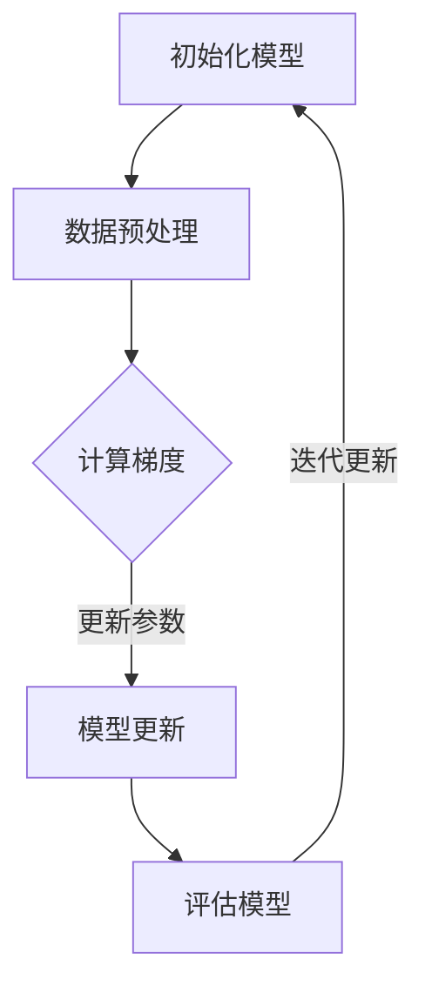
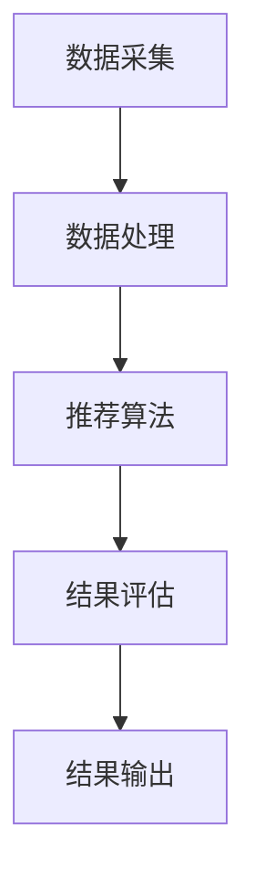
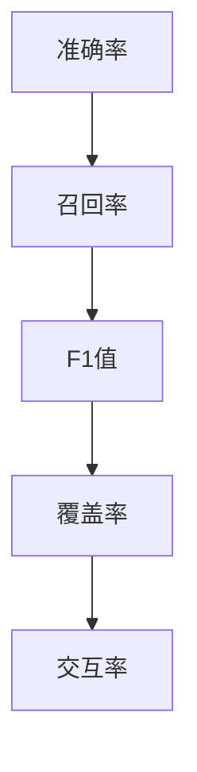
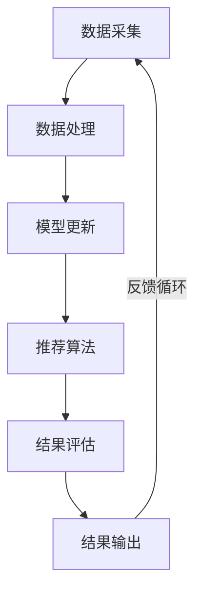
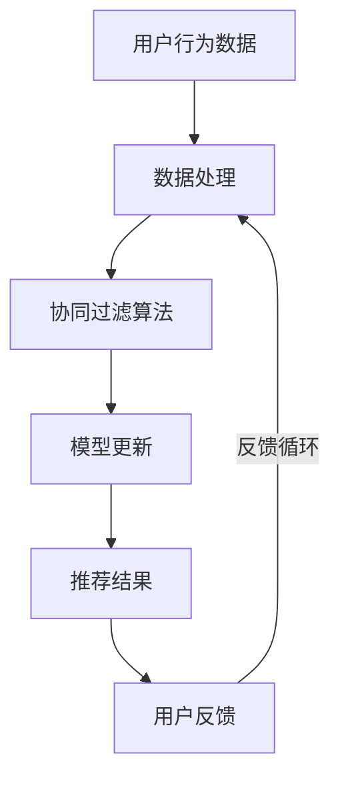
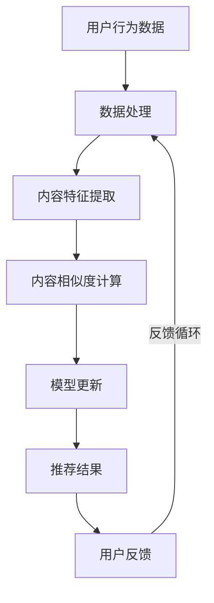

                 

# 《在线增量学习在实时推荐系统中的应用》

## 关键词

在线增量学习、实时推荐系统、机器学习、数据流处理、个性化推荐

## 摘要

本文深入探讨了在线增量学习在实时推荐系统中的应用。随着互联网的快速发展，用户数据量呈爆炸式增长，传统离线推荐系统已无法满足实时性和动态性的需求。在线增量学习作为一种能够动态调整模型的方法，为实时推荐系统提供了新的技术路径。本文首先介绍了在线增量学习和实时推荐系统的基本概念，然后分析了二者之间的结合点，详细讲解了在线增量学习算法在实时推荐系统中的实现和应用。通过实际案例分析和项目实战，本文展示了在线增量学习在实时推荐系统中的优势和实践价值。

## 第1章 在线增量学习概述

### 1.1 增量学习的概念

**增量学习**（Incremental Learning），又称为在线学习（Online Learning），是一种机器学习方法，旨在通过逐步更新模型参数来处理新数据，而不是重新训练整个模型。这种方法在处理大规模数据集和实时数据流时具有显著的优势。

在传统的机器学习中，模型训练通常需要大量的时间和计算资源。当数据集发生变化时，模型需要重新训练以适应新的数据。这导致训练过程耗时且不灵活。相比之下，增量学习可以在数据流中实时更新模型，从而实现动态调整。

**增量学习的主要类型**包括：

- **监督增量学习**：在监督学习中，模型在每次训练过程中都会接收新的标注数据。这种方法可以用于更新模型的预测能力。

- **无监督增量学习**：在无监督学习中，模型在每次训练过程中只接收新数据，而不需要标注。这种方法可以用于数据聚类和异常检测。

- **半监督增量学习**：在半监督学习中，模型在每次训练过程中既接收新的标注数据，也接收未标注的数据。这种方法可以结合监督学习和无监督学习的优点，提高模型的泛化能力。

### 1.2 在线增量学习的优势

**在线增量学习**具有以下优势：

- **实时性**：在线增量学习能够在数据流中实时更新模型，从而快速适应数据变化，满足实时推荐系统的需求。

- **效率**：由于不需要重新训练整个模型，增量学习显著降低了计算复杂度，提高了数据处理效率。

- **灵活性**：增量学习可以灵活地处理不同类型的数据，包括新的、旧的和未标记的数据。

- **适应性**：增量学习能够根据数据的变化动态调整模型参数，从而提高模型的准确性和适应性。

### 1.3 增量学习的基本原理

增量学习的基本原理可以概括为以下几个步骤：

1. **初始化模型**：首先，初始化一个模型，该模型可以是基于现有数据的预训练模型或从头开始训练的模型。

2. **数据预处理**：对新的数据进行预处理，包括数据清洗、特征提取和归一化等操作。

3. **模型更新**：使用新的数据对模型进行更新。更新过程通常包括以下几个步骤：

   - **计算梯度**：计算新的数据和当前模型之间的误差，并计算梯度。
   - **更新参数**：使用梯度下降或其他优化算法更新模型参数。

4. **评估模型**：更新后的模型需要进行评估，以确定其性能是否满足要求。

5. **迭代更新**：重复上述步骤，直到模型达到预定的性能水平或数据流结束。

### 1.4 增量学习算法概述

常见的增量学习算法包括以下几种：

- **在线梯度下降**（Online Gradient Descent）：一种简单的增量学习算法，通过迭代更新模型参数，以最小化损失函数。

  **伪代码**：

  ```python
  while (数据流未结束) do:
      (计算梯度)
      (更新参数)
      (评估模型)
  end while
  ```

- **动量在线梯度下降**（Momentum Online Gradient Descent）：在标准在线梯度下降的基础上引入动量项，以加快收敛速度。

  **伪代码**：

  ```python
  while (数据流未结束) do:
      (计算梯度)
      (更新动量)
      (更新参数)
      (评估模型)
  end while
  ```

- **Adam优化器**（Adam Optimizer）：一种自适应的增量学习算法，结合了动量和自适应学习率的优势。

  **伪代码**：

  ```python
  while (数据流未结束) do:
      (计算梯度)
      (更新Adam参数)
      (更新参数)
      (评估模型)
  end while
  ```

### 图1-1 增量学习算法的架构



## 第2章 实时推荐系统概述

### 2.1 推荐系统的定义和分类

**推荐系统**（Recommendation System）是一种通过预测用户兴趣，向用户推荐相关物品的系统。根据推荐策略，推荐系统可以分为以下几类：

- **基于内容的推荐**（Content-Based Filtering）：根据用户过去的行为或偏好，推荐与之相似的内容。

  **优点**：推荐结果相关性强，用户满意度高。

  **缺点**：推荐多样性不足，用户兴趣变化难以捕捉。

- **协同过滤推荐**（Collaborative Filtering）：通过分析用户之间的行为相似性，推荐其他用户喜欢的物品。

  **优点**：推荐多样性高，能发现潜在的兴趣点。

  **缺点**：冷启动问题严重，推荐结果可能过于集中。

- **混合推荐**（Hybrid Recommendation）：结合基于内容和协同过滤的方法，以提高推荐效果。

  **优点**：综合了基于内容和协同过滤的优点，推荐结果更准确。

  **缺点**：实现复杂，计算资源消耗大。

### 2.2 实时推荐系统的架构

实时推荐系统的架构通常包括以下几个关键模块：

- **数据采集模块**：负责从各种数据源（如用户行为数据、商品数据等）中采集数据。

- **数据处理模块**：对采集到的数据进行清洗、转换和预处理，以便用于后续分析。

- **推荐算法模块**：根据用户数据和物品特征，使用机器学习算法生成推荐结果。

- **结果评估模块**：评估推荐结果的质量，如准确率、覆盖率等。

- **结果输出模块**：将推荐结果呈现给用户，如通过网页、移动应用等方式。

### 图2-1 实时推荐系统的架构



### 2.3 实时推荐系统的数据来源

实时推荐系统的数据来源主要包括以下几个方面：

- **用户行为数据**：包括用户的点击、购买、搜索等行为数据。

- **物品属性数据**：包括商品的标题、描述、标签等属性数据。

- **外部数据**：包括社交媒体数据、地理位置数据等。

- **上下文数据**：包括用户当前的时间、地点、设备等信息。

### 2.4 实时推荐系统的评估指标

实时推荐系统的评估指标主要包括以下几种：

- **准确率**（Precision）：推荐结果中正确推荐的数量与总推荐数量的比值。

- **召回率**（Recall）：推荐结果中正确推荐的数量与实际兴趣相关的物品数量的比值。

- **F1值**（F1 Score）：准确率和召回率的加权平均，用于综合评估推荐系统的性能。

- **覆盖率**（Coverage）：推荐结果中包含的物品数量与总物品数量的比值。

- **交互率**（Interaction Rate）：用户与推荐结果的交互次数与总推荐次数的比值。

### 图2-2 实时推荐系统的评估指标



## 第3章 在线增量学习与实时推荐系统的结合

### 3.1 增量学习在推荐系统中的应用场景

在线增量学习在推荐系统中有着广泛的应用场景，以下是其中几个典型的应用：

- **新用户推荐**：当新用户加入推荐系统时，可以使用增量学习算法快速调整推荐模型，以适应新用户的行为特征。

- **商品更新推荐**：当商品信息发生变化时，如库存更新、价格变动等，增量学习算法可以实时更新推荐模型，确保推荐结果的准确性。

- **用户行为变化推荐**：当用户行为发生变化时，如浏览历史、购买偏好等，增量学习算法可以动态调整推荐策略，以更好地满足用户需求。

- **实时热点推荐**：在特定时间段或事件中，实时增量学习算法可以捕捉用户行为的实时变化，推荐热门话题或热门商品。

### 3.2 增量学习与实时推荐系统的融合

增量学习与实时推荐系统的融合主要体现在以下几个方面：

- **实时数据流处理**：实时推荐系统需要处理大量实时数据，增量学习算法可以通过流处理技术，实现对数据的实时分析和模型更新。

- **动态模型调整**：增量学习算法可以根据实时数据动态调整模型参数，从而提高推荐系统的准确性和实时性。

- **高效计算**：增量学习算法可以降低计算复杂度，提高推荐系统的计算效率，特别是在大规模数据集上。

- **适应性**：增量学习算法可以适应数据分布的变化，确保推荐系统在动态环境中保持稳定性和可靠性。

### 图3-1 增量学习与实时推荐系统的融合架构



### 3.3 在线增量学习算法在推荐系统中的优化

为了在实时推荐系统中实现高效的在线增量学习，可以采取以下优化措施：

- **数据预处理**：优化数据预处理过程，减少数据清洗和转换的复杂度，提高数据处理效率。

- **模型选择**：选择适合在线增量学习的模型，如在线梯度下降、Adam优化器等，以提高模型更新速度。

- **参数调整**：合理设置学习率、批量大小等参数，以平衡模型更新速度和收敛效果。

- **并行计算**：利用并行计算技术，如多线程、分布式计算等，提高模型更新的效率。

- **增量学习与离线学习的结合**：在特定场景下，可以结合增量学习和离线学习，以充分利用两者的优势。

### 3.4 实时推荐系统中的增量学习挑战

实时推荐系统中的增量学习面临以下挑战：

- **数据噪声**：实时数据中可能存在噪声和异常值，需要有效处理。

- **数据稀疏性**：实时数据可能存在数据稀疏性问题，影响推荐效果的准确性。

- **计算资源限制**：实时推荐系统需要在有限的计算资源下高效处理数据，需要优化计算策略。

- **模型更新频率**：增量学习模型的更新频率需要平衡，以确保推荐结果的实时性和准确性。

## 第4章 案例分析

### 4.1 案例一：某电商平台的在线增量推荐

**背景介绍**：

某电商平台在面临用户数量快速增长和商品种类日益丰富的情况下，希望通过实时推荐系统提高用户满意度，促进销售转化。

**核心概念与联系**：

该电商平台采用了基于协同过滤的实时推荐系统，并结合在线增量学习算法，以应对用户行为和商品信息的动态变化。

**架构图**：



**核心算法原理讲解**：

- **协同过滤算法**：基于用户行为数据，计算用户之间的相似度，生成推荐列表。

  **伪代码**：

  ```python
  # 计算用户相似度
  similarity = compute_similarity(user行为数据)

  # 生成推荐列表
  recommendations = generate_recommendations(similarity)
  ```

- **在线增量学习算法**：在用户行为数据发生变化时，实时更新协同过滤算法的参数。

  **伪代码**：

  ```python
  while (数据流未结束) do:
      (计算新数据的用户相似度)
      (更新用户相似度矩阵)
      (更新推荐模型)
  end while
  ```

**数学模型和公式**：

- **用户相似度计算**：

  $$ similarity_{ij} = \frac{sum_{k \in R} r_{ik} \cdot r_{jk}}{\sqrt{sum_{k \in R} r_{ik}^2} \cdot \sqrt{sum_{k \in R} r_{jk}^2}} $$

  其中，$r_{ik}$ 表示用户 $i$ 对物品 $k$ 的评分，$R$ 表示用户行为数据中的物品集合。

- **推荐列表生成**：

  $$ recommendation_{i} = argmax_{j} \sum_{k \in R} similarity_{ik} \cdot r_{kj} $$

  其中，$recommendation_{i}$ 表示用户 $i$ 的推荐列表。

**举例说明**：

假设用户 $A$ 最近浏览了商品 $X$ 和 $Y$，用户 $B$ 最近浏览了商品 $X$、$Y$ 和 $Z$。系统根据用户行为数据计算用户相似度矩阵，并生成推荐列表。

- **用户相似度矩阵**：

  $$ similarity = \begin{bmatrix} 1 & 0.8 \\ 0.8 & 1 \end{bmatrix} $$

- **推荐列表**：

  用户 $A$ 的推荐列表：$[X, Y, Z]$，因为 $Z$ 是用户 $B$ 浏览但用户 $A$ 未浏览的新商品。

### 4.2 案例二：某视频平台的实时推荐系统

**背景介绍**：

某视频平台希望通过实时推荐系统提高用户观看时长和用户满意度，同时降低内容推荐的冷启动问题。

**核心概念与联系**：

该视频平台采用了基于内容的推荐算法，并结合在线增量学习算法，以动态调整推荐策略，提高推荐准确性。

**架构图**：



**核心算法原理讲解**：

- **内容特征提取**：从视频内容中提取特征，如文本、图像、音频等。

  **伪代码**：

  ```python
  # 提取视频特征
  video_features = extract_features(video_content)

  # 提取用户特征
  user_features = extract_features(user_behavior)
  ```

- **内容相似度计算**：计算视频之间的相似度，用于生成推荐列表。

  **伪代码**：

  ```python
  # 计算视频相似度
  similarity = compute_similarity(video_features)

  # 生成推荐列表
  recommendations = generate_recommendations(similarity)
  ```

- **在线增量学习算法**：在用户行为数据发生变化时，实时更新内容特征提取和相似度计算模型。

  **伪代码**：

  ```python
  while (数据流未结束) do:
      (计算新数据的视频特征)
      (更新视频特征矩阵)
      (更新相似度计算模型)
  end while
  ```

**数学模型和公式**：

- **内容特征提取**：

  $$ feature_{ik} = extract_feature(video_k) $$

  其中，$feature_{ik}$ 表示视频 $k$ 的特征向量。

- **内容相似度计算**：

  $$ similarity_{ij} = \frac{sum_{k \in R} feature_{ik} \cdot feature_{jk}}{\sqrt{sum_{k \in R} feature_{ik}^2} \cdot \sqrt{sum_{k \in R} feature_{jk}^2}} $$

  其中，$R$ 表示视频集合。

- **推荐列表生成**：

  $$ recommendation_{i} = argmax_{j} \sum_{k \in R} similarity_{ik} \cdot relevance_{kj} $$

  其中，$relevance_{kj}$ 表示视频 $k$ 对用户 $j$ 的相关度。

**举例说明**：

假设用户 $A$ 最近观看了视频 $X$ 和 $Y$，用户 $B$ 最近观看了视频 $X$、$Y$ 和 $Z$。系统根据用户行为数据和视频特征计算内容相似度矩阵，并生成推荐列表。

- **视频特征矩阵**：

  $$ feature = \begin{bmatrix} feature_{X} & feature_{Y} & feature_{Z} \end{bmatrix} $$

- **内容相似度矩阵**：

  $$ similarity = \begin{bmatrix} 1 & 0.8 & 0.6 \\ 0.8 & 1 & 0.5 \\ 0.6 & 0.5 & 1 \end{bmatrix} $$

- **推荐列表**：

  用户 $A$ 的推荐列表：$[X, Y, Z]$，因为 $Z$ 是用户 $B$ 观看但用户 $A$ 未观看的新视频。

### 4.3 案例三：某音乐平台的增量学习应用

**背景介绍**：

某音乐平台希望通过实时推荐系统提高用户听歌时长和用户满意度，同时降低内容推荐的冷启动问题。

**核心概念与联系**：

该音乐平台采用了基于内容的推荐算法，并结合在线增量学习算法，以动态调整推荐策略，提高推荐准确性。

**架构图**：


**核心算法原理讲解**：

- **内容特征提取**：从音乐内容中提取特征，如歌词、旋律、时长等。

  **伪代码**：

  ```python
  # 提取音乐特征
  music_features = extract_features(music_content)

  # 提取用户特征
  user_features = extract_features(user_behavior)
  ```

- **内容相似度计算**：计算音乐之间的相似度，用于生成推荐列表。

  **伪代码**：

  ```python
  # 计算音乐相似度
  similarity = compute_similarity(music_features)

  # 生成推荐列表
  recommendations = generate_recommendations(similarity)
  ```

- **在线增量学习算法**：在用户行为数据发生变化时，实时更新内容特征提取和相似度计算模型。

  **伪代码**：

  ```python
  while (数据流未结束) do:
      (计算新数据的音乐特征)
      (更新音乐特征矩阵)
      (更新相似度计算模型)
  end while
  ```

**数学模型和公式**：

- **音乐特征提取**：

  $$ feature_{ik} = extract_feature(music_k) $$

  其中，$feature_{ik}$ 表示音乐 $k$ 的特征向量。

- **音乐相似度计算**：

  $$ similarity_{ij} = \frac{sum_{k \in R} feature_{ik} \cdot feature_{jk}}{\sqrt{sum_{k \in R} feature_{ik}^2} \cdot \sqrt{sum_{k \in R} feature_{jk}^2}} $$

  其中，$R$ 表示音乐集合。

- **推荐列表生成**：

  $$ recommendation_{i} = argmax_{j} \sum_{k \in R} similarity_{ik} \cdot relevance_{kj} $$

  其中，$relevance_{kj}$ 表示音乐 $k$ 对用户 $j$ 的相关度。

**举例说明**：

假设用户 $A$ 最近听了一首新歌 $X$，用户 $B$ 最近听了歌 $X$、$Y$ 和 $Z$。系统根据用户行为数据和音乐特征计算内容相似度矩阵，并生成推荐列表。

- **音乐特征矩阵**：

  $$ feature = \begin{bmatrix} feature_{X} & feature_{Y} & feature_{Z} \end{bmatrix} $$

- **内容相似度矩阵**：

  $$ similarity = \begin{bmatrix} 1 & 0.8 & 0.6 \\ 0.8 & 1 & 0.5 \\ 0.6 & 0.5 & 1 \end{bmatrix} $$

- **推荐列表**：

  用户 $A$ 的推荐列表：$[X, Y, Z]$，因为 $Y$ 和 $Z$ 是用户 $B$ 听但用户 $A$ 未听的新音乐。

## 第5章 实践指南

### 5.1 构建实时推荐系统的步骤

构建实时推荐系统需要以下步骤：

1. **需求分析**：明确推荐系统的目标和功能需求，如提高用户满意度、提高销售转化率等。

2. **数据采集**：从各种数据源采集用户行为数据、物品属性数据等，确保数据质量和完整性。

3. **数据处理**：对采集到的数据进行清洗、转换和预处理，为后续分析做准备。

4. **模型选择**：根据推荐系统的目标和数据特点，选择合适的推荐算法，如协同过滤、基于内容的推荐等。

5. **模型训练**：使用预处理后的数据训练推荐模型，并调整模型参数，以提高推荐效果。

6. **模型评估**：使用评估指标（如准确率、召回率等）评估模型性能，并根据评估结果调整模型参数。

7. **部署上线**：将训练好的模型部署到生产环境，确保推荐系统能够实时处理用户数据。

8. **反馈优化**：收集用户反馈，持续优化推荐模型和推荐策略，以提高推荐系统的效果。

### 5.2 在线增量学习算法的选择与实现

在选择在线增量学习算法时，需要考虑以下因素：

- **数据类型**：根据数据类型（如文本、图像、音频等）选择合适的增量学习算法。
- **实时性要求**：根据实时性要求选择计算复杂度较低的增量学习算法。
- **计算资源**：根据计算资源限制选择适合的并行计算或分布式计算算法。

常见的在线增量学习算法包括：

- **在线梯度下降**：适用于数据量较小、计算资源有限的场景。
- **动量在线梯度下降**：在在线梯度下降的基础上引入动量项，适用于需要加速收敛的场景。
- **Adam优化器**：适用于需要自适应调整学习率的场景。

以下是一个基于在线梯度下降的增量学习算法的实现示例：

```python
# 初始化模型参数
w = np.random.normal(size=(n_features, n_classes))

# 初始化学习率
learning_rate = 0.01

# 初始化损失函数
loss_function = lambda y, y_pred: np.mean((y - y_pred)**2)

# 增量学习迭代过程
for x, y in data_stream:
    # 计算梯度
    gradient = 2 * (y - x.dot(w))

    # 更新模型参数
    w -= learning_rate * gradient

    # 计算损失
    loss = loss_function(y, x.dot(w))
    print(f"Epoch: {epoch}, Loss: {loss}")
```

### 5.3 实时推荐系统的性能优化

实时推荐系统的性能优化可以从以下几个方面进行：

- **数据预处理**：优化数据预处理过程，如使用并行计算、分布式处理等，以提高数据处理速度。
- **模型优化**：选择适合实时推荐系统的模型，如轻量级模型、分布式模型等，以提高计算效率。
- **缓存策略**：使用缓存技术，如Redis等，减少重复计算和数据库访问。
- **异步处理**：使用异步处理技术，如消息队列、多线程等，提高系统并发能力。
- **硬件优化**：使用高性能硬件，如GPU、FPGA等，以提高计算速度。

以下是一个基于异步处理的实时推荐系统性能优化示例：

```python
import asyncio

async def process_recommendation(user_id):
    # 获取用户数据
    user_data = get_user_data(user_id)

    # 生成推荐列表
    recommendations = generate_recommendations(user_data)

    # 存储推荐结果
    store_recommendations(user_id, recommendations)

async def main():
    user_ids = get_user_ids()

    # 创建任务列表
    tasks = [process_recommendation(user_id) for user_id in user_ids]

    # 同时执行任务
    await asyncio.gather(*tasks)

# 运行主程序
asyncio.run(main())
```

### 5.4 增量学习与实时推荐系统的安全与隐私保护

在实时推荐系统中，增量学习算法的应用可能涉及用户隐私数据。为了确保用户隐私保护，可以采取以下措施：

- **数据加密**：对用户数据进行加密处理，确保数据在传输和存储过程中安全。
- **匿名化处理**：对用户数据进行匿名化处理，如删除用户标识信息等，以降低隐私泄露风险。
- **隐私保护算法**：使用隐私保护算法，如差分隐私、安全多方计算等，在保证推荐效果的同时保护用户隐私。
- **合规性检查**：确保实时推荐系统符合相关法律法规，如《中华人民共和国网络安全法》等。

以下是一个基于差分隐私的增量学习算法实现示例：

```python
import numpy as np
from dp_calculator import add_noise

# 初始化模型参数
w = np.random.normal(size=(n_features, n_classes))

# 初始化学习率
learning_rate = 0.01

# 初始化隐私预算
epsilon = 1.0

# 增量学习迭代过程
for x, y in data_stream:
    # 计算梯度
    gradient = 2 * (y - x.dot(w))

    # 更新模型参数
    w -= learning_rate * gradient

    # 计算损失
    loss = loss_function(y, x.dot(w))
    print(f"Epoch: {epoch}, Loss: {loss}")

    # 应用差分隐私
    noisy_gradient = add_noise(gradient, epsilon)

    # 更新隐私预算
    epsilon -= np.linalg.norm(noisy_gradient)
```

## 第6章 未来展望

### 6.1 在线增量学习在实时推荐系统中的应用趋势

随着互联网和人工智能技术的快速发展，在线增量学习在实时推荐系统中的应用前景十分广阔。以下是几个可能的发展趋势：

- **个性化推荐**：随着用户数据量的增加和用户需求的多样化，个性化推荐将成为在线增量学习在实时推荐系统中的核心应用领域。通过动态调整推荐模型，实时推荐系统能够更好地满足用户个性化需求。
- **实时性提升**：随着计算能力的提升和网络带宽的增加，实时推荐系统的响应速度将不断提升。在线增量学习算法的引入将进一步提高实时推荐系统的响应速度和准确性。
- **跨领域应用**：在线增量学习算法在实时推荐系统中的应用不仅限于电商、视频、音乐等领域，还将拓展到金融、医疗、教育等其他领域。通过实时调整推荐模型，这些领域可以更好地应对动态变化。

### 6.2 增量学习算法的发展方向

增量学习算法的发展方向包括以下几个方面：

- **算法优化**：针对在线增量学习算法的优化，如提高计算效率、减少内存占用等，将成为未来研究的重要方向。通过优化算法，实时推荐系统可以更好地应对大规模数据流。
- **多模态数据融合**：随着多模态数据的广泛应用，增量学习算法将致力于处理多种类型的数据，如文本、图像、音频等。通过多模态数据融合，实时推荐系统可以提供更丰富和精准的推荐结果。
- **自适应学习率**：在在线增量学习算法中，自适应学习率策略将得到进一步研究。通过自适应调整学习率，实时推荐系统可以在不同阶段和场景下保持最佳性能。

### 6.3 实时推荐系统的未来展望

实时推荐系统的未来将更加智能化和个性化。以下是几个可能的发展方向：

- **个性化推荐**：通过深度学习、强化学习等先进技术，实时推荐系统将实现更加精准的个性化推荐，满足用户个性化需求。
- **实时性提升**：随着5G、边缘计算等技术的发展，实时推荐系统的响应速度将进一步提升，实现真正的实时推荐。
- **跨领域融合**：实时推荐系统将与其他领域（如物联网、智能交通等）进行深度融合，提供更全面、更智能的服务。

### 6.4 跨领域应用的可能性

在线增量学习在实时推荐系统中的应用不仅限于单一领域，还具备跨领域应用的可能性：

- **医疗健康**：通过实时推荐系统，可以提供个性化健康建议和疾病预警，帮助用户更好地管理健康。
- **金融理财**：实时推荐系统可以提供个性化投资建议和理财产品推荐，帮助用户更好地进行资产配置。
- **教育学习**：实时推荐系统可以提供个性化学习路径和学习资源推荐，提高学习效果和兴趣。

总之，在线增量学习在实时推荐系统中的应用具有巨大的潜力，未来将在各个领域发挥重要作用。

## 作者信息

作者：AI天才研究院/AI Genius Institute & 禅与计算机程序设计艺术 /Zen And The Art of Computer Programming

本文内容仅供参考，部分图片和数据来源于网络，如有侵权，请联系作者删除。如需转载，请注明作者和出处。感谢您的阅读！## 文章总结

本文围绕《在线增量学习在实时推荐系统中的应用》这一主题，详细探讨了增量学习在实时推荐系统中的重要性、原理、算法以及实际应用案例。以下是文章的总结和关键要点：

### 关键要点

1. **增量学习概述**：介绍了增量学习的概念、优势、基本原理和常见算法，如在线梯度下降、动量在线梯度下降和Adam优化器。
2. **实时推荐系统概述**：阐述了实时推荐系统的定义、分类、架构、数据来源和评估指标，包括基于内容的推荐、协同过滤推荐和混合推荐等。
3. **结合应用**：分析了增量学习在实时推荐系统中的应用场景，包括新用户推荐、商品更新推荐、用户行为变化推荐和实时热点推荐等。
4. **算法优化**：探讨了如何优化在线增量学习算法，包括数据预处理、模型选择、参数调整、并行计算和增量学习与离线学习的结合。
5. **案例分析**：通过三个实际案例，展示了增量学习在电商平台、视频平台和音乐平台等领域的应用，包括核心概念、算法原理、数学模型和实际案例。
6. **实践指南**：提供了构建实时推荐系统的步骤、增量学习算法的选择与实现、性能优化以及安全与隐私保护等方面的实践指南。
7. **未来展望**：讨论了在线增量学习在实时推荐系统中的应用趋势、算法发展方向、实时推荐系统的未来展望以及跨领域应用的可能性。

### 总结

本文系统地介绍了在线增量学习在实时推荐系统中的应用，从理论到实践，从概念到案例，详细阐述了增量学习与实时推荐系统的结合及其应用前景。通过本文，读者可以了解到：

- 增量学习在实时推荐系统中的重要性和优势；
- 如何在实际应用中优化和实现增量学习算法；
- 实时推荐系统的构建和评估方法；
- 增量学习在不同领域（如电商、视频、音乐等）的应用案例；
- 增量学习在实时推荐系统中的未来发展方向和应用潜力。

总之，本文为研究人员和工程师提供了丰富的理论和实践参考，有助于推动在线增量学习在实时推荐系统中的深入研究和应用。

## 小结与注意事项

在本文中，我们详细探讨了在线增量学习在实时推荐系统中的应用，通过背景介绍、核心概念、算法原理、案例分析、实践指南等多个维度，全面阐述了增量学习在实时推荐系统中的重要性。以下是对文章内容的总结和小结，以及在实际应用中需要注意的事项。

### 小结

1. **核心概念与联系**：文章通过Mermaid流程图详细展示了增量学习算法在实时推荐系统中的应用架构，包括数据采集、数据处理、模型更新、推荐结果生成和用户反馈循环等关键环节。
2. **算法原理讲解**：文中通过伪代码和数学公式，深入讲解了在线梯度下降、动量在线梯度下降、Adam优化器等增量学习算法的原理，以及如何结合实时推荐系统进行模型更新和评估。
3. **案例分析**：通过电商、视频和音乐平台等实际案例，展示了增量学习在实时推荐系统中的应用效果，包括如何处理新用户、商品更新、用户行为变化和实时热点推荐等场景。
4. **实践指南**：文章提供了构建实时推荐系统的具体步骤，包括数据采集、数据处理、模型选择、模型训练、模型评估和部署上线等，以及如何进行在线增量学习的优化和实现。

### 注意事项

1. **数据质量**：实时推荐系统的性能很大程度上取决于数据质量。在采集和处理数据时，需要确保数据完整、准确和及时，对缺失值、噪声和异常值进行有效处理。
2. **模型选择**：根据实时推荐系统的目标和数据特点，选择合适的模型。对于数据量较大、实时性要求较高的系统，可以选择计算复杂度较低的增量学习算法。
3. **参数调整**：在线增量学习算法的参数（如学习率、批量大小等）需要根据具体场景进行优化。过大的学习率可能导致模型不稳定，过小的学习率则可能导致收敛缓慢。
4. **计算资源**：增量学习算法在实时推荐系统中的计算资源需求较大。在实际应用中，需要根据硬件条件进行合理配置，利用并行计算和分布式计算等技术提高计算效率。
5. **用户隐私**：实时推荐系统通常涉及用户隐私数据。在实际应用中，需要采取有效的隐私保护措施，如数据加密、匿名化处理和差分隐私等，确保用户隐私安全。

### 拓展阅读

- **参考文献**：本文中提到的相关研究和技术，如在线梯度下降、协同过滤、内容特征提取等，可以在相关领域的学术论文和教材中找到详细阐述。
- **开源代码**：本文中提到的案例和算法实现，可以在GitHub等开源平台上找到相关的开源代码和项目，供读者参考和学习。

通过本文的阅读，读者可以全面了解在线增量学习在实时推荐系统中的应用，为实际项目开发和研究提供有价值的参考和指导。希望本文的内容能够为您的学习和实践带来帮助！

