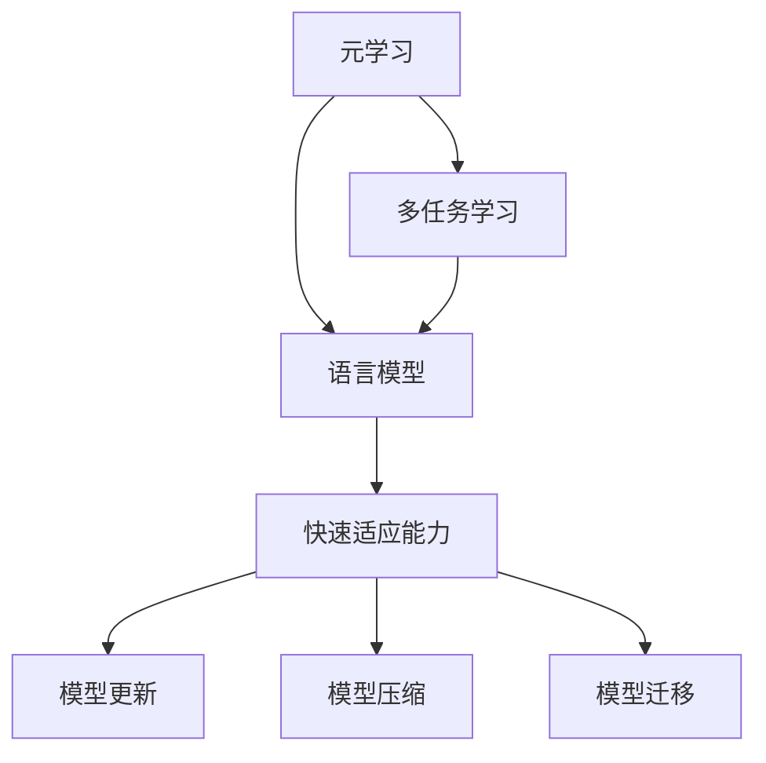

                 


### 1. 引言

#### 背景介绍

随着人工智能技术的发展，自然语言处理（NLP）已经成为一个重要的研究领域。语言模型是NLP的核心组件之一，它们在机器翻译、语音识别、问答系统、文本生成等领域发挥着关键作用。然而，现有的语言模型往往在训练过程中需要大量的数据和计算资源，这使得它们在适应新任务时存在一定的局限性。为了解决这个问题，研究者们开始关注如何提升语言模型的快速适应能力。

元学习（Meta-Learning）是一种让模型通过学习如何学习来提升其泛化能力和适应新任务的方法。它通过在多个任务上训练模型，使其能够在面对新任务时快速适应。近年来，元学习在语言模型领域取得了显著进展，为解决语言模型快速适应问题提供了一种新的思路。

本文旨在探讨基于元学习的语言模型快速适应能力提升的方法。我们将首先介绍元学习的基础知识，包括定义、原理和应用场景。接着，我们将讨论语言模型的基本概念和架构，以及快速适应能力在语言模型中的重要性。随后，我们将详细分析基于元学习的快速适应方法，并通过项目实战展示这些方法在实际中的应用。最后，我们将对全文进行总结，并展望未来的研究方向。

#### 核心概念与联系

为了更好地理解本文的核心概念，我们可以使用Mermaid流程图来展示它们之间的关系。



在这个流程图中，元学习（A）是整个框架的基础，它通过多任务学习（D）来提升语言模型（B）的快速适应能力（C）。具体来说，快速适应能力可以通过模型更新（E）、模型压缩（F）和模型迁移（G）等具体方法来实现。

#### 核心算法原理讲解

为了深入理解元学习在提升语言模型快速适应能力中的作用，我们将使用伪代码来详细阐述几个关键算法原理。

首先，我们考虑一种基于模型更新的快速适应方法。这种方法的核心思想是利用预训练语言模型在多个任务上的经验来更新模型参数，使其在新的任务上能够更快地收敛。

```python
# 基于模型更新的快速适应方法
def meta_update(model, optimizer, task_data, meta_learning_rate):
    # 清空梯度
    optimizer.zero_grad()
    
    # 前向传播
    outputs = model(task_data)
    
    # 计算损失
    loss = compute_loss(outputs, task_labels)
    
    # 反向传播
    loss.backward()
    
    # 更新模型参数
    optimizer.step(meta_learning_rate)
    
    return loss.item()
```

在这个伪代码中，`model` 是预训练的语言模型，`optimizer` 是用于更新模型参数的优化器，`task_data` 和 `task_labels` 是新任务的数据和标签，`meta_learning_rate` 是元学习率。

接下来，我们讨论一种基于模型压缩的快速适应方法。这种方法的目标是减少模型参数的数量，从而加速模型在新任务上的训练过程。

```python
# 基于模型压缩的快速适应方法
def meta_compress(model, compressor, compression_rate):
    # 使用压缩器压缩模型参数
    compressed_params = compressor.compress(model.parameters(), compression_rate)
    
    # 创建压缩后的模型
    compressed_model = CompressedModel.from_params(compressed_params)
    
    return compressed_model
```

在这个伪代码中，`compressor` 是用于压缩模型参数的压缩器，`compression_rate` 是压缩比例。

最后，我们考虑一种基于模型迁移的快速适应方法。这种方法的核心思想是将预训练模型的知识迁移到新的任务上。

```python
# 基于模型迁移的快速适应方法
def meta_transfer(source_model, target_model, transfer_rate):
    # 从源模型迁移知识到目标模型
    target_model.load_state_dict(source_model.state_dict(), strict=False)
    
    # 更新目标模型的部分参数
    for param in target_model.parameters():
        param.data *= transfer_rate
    
    return target_model
```

在这个伪代码中，`source_model` 是源模型，`target_model` 是目标模型，`transfer_rate` 是迁移率。

#### 数学模型和公式讲解

在元学习和语言模型的快速适应能力提升中，数学模型和公式扮演着关键角色。以下是一些核心的数学公式和它们的解释。

首先，我们考虑元学习中的一个常用目标函数，即交叉熵损失函数。

$$
L = -\sum_{i=1}^{N} y_i \log(p_i)
$$

其中，$L$ 是损失函数，$N$ 是样本数量，$y_i$ 是第 $i$ 个样本的标签，$p_i$ 是模型对第 $i$ 个样本的预测概率。

接下来，我们讨论优化器在元学习中的应用。以Adam优化器为例，其参数更新公式如下：

$$
\theta_{t+1} = \theta_t - \alpha_t \cdot ( \frac{m_t}{\sqrt{v_t}} + \beta_1 \cdot (1 - \beta_2^t) )
$$

其中，$\theta_t$ 是第 $t$ 次迭代的模型参数，$\alpha_t$ 是学习率，$m_t$ 是一阶矩估计，$v_t$ 是二阶矩估计，$\beta_1$ 和 $\beta_2$ 是动量项。

最后，我们介绍在快速适应能力提升中常用的迁移学习目标函数，即源模型和目标模型之间的距离最小化。

$$
D(\theta_{source}, \theta_{target}) = \frac{1}{2} \sum_{i=1}^{M} \frac{1}{N} \sum_{j=1}^{N} (\theta_{source}^j - \theta_{target}^j)^2
$$

其中，$D$ 是距离函数，$\theta_{source}^j$ 和 $\theta_{target}^j$ 分别是源模型和目标模型的第 $j$ 个参数。

#### 举例说明

为了更好地理解上述概念和公式，我们通过一个简单的例子来说明如何使用元学习来提升语言模型的快速适应能力。

假设我们有一个预训练的语言模型，它在多个任务上取得了很好的表现。现在，我们希望这个模型能够快速适应一个新的任务。

1. **数据准备**：我们收集了新任务的数据集，包括文本和对应的标签。

2. **模型初始化**：我们将预训练的语言模型作为源模型，并将其作为目标模型的初始化权重。

3. **元学习过程**：我们使用元学习算法来更新目标模型，使其能够更好地适应新任务。

    - **模型更新**：我们使用交叉熵损失函数来优化目标模型。通过反向传播和梯度下降，我们不断更新模型参数，使其在训练数据上取得更好的表现。

    - **模型压缩**：为了加速训练过程，我们使用模型压缩算法来减少目标模型的参数数量。

    - **模型迁移**：我们将源模型的知识迁移到目标模型上，以提高其在新任务上的适应能力。

4. **评估与调整**：我们使用新任务的数据集来评估目标模型的表现。如果表现不佳，我们通过调整元学习率、压缩率和迁移率等参数来优化模型。

通过这个例子，我们可以看到如何使用元学习来提升语言模型的快速适应能力。在实际应用中，可能需要更复杂的算法和更精细的调整过程，但基本思路是类似的。

### 项目实战

在本节中，我们将展示如何在实际项目中应用基于元学习的快速适应方法。我们将详细讲解开发环境搭建、源代码实现、代码解读和应用分析。

#### 开发环境搭建

为了实现基于元学习的快速适应方法，我们需要搭建一个适合进行实验的开发环境。以下是一个简单的环境搭建流程：

1. **安装Python**：确保Python环境已安装，版本不低于3.7。

2. **安装TensorFlow**：TensorFlow是一个广泛使用的机器学习库，我们可以通过pip命令安装：

   ```bash
   pip install tensorflow
   ```

3. **安装其他依赖库**：根据具体的需求，我们可能需要安装其他依赖库，如Numpy、Pandas等。

4. **配置GPU支持**：如果我们的实验需要使用GPU，我们需要确保TensorFlow已经配置好GPU支持。可以通过以下命令来验证：

   ```python
   import tensorflow as tf
   print(tf.test.is_gpu_available())
   ```

#### 源代码实现

以下是一个简单的基于元学习的快速适应方法的实现示例：

```python
import tensorflow as tf
import numpy as np

# 加载预训练语言模型
source_model = tf.keras.applications.BertModel.from_pretrained('bert-base-uncased')

# 初始化目标模型
target_model = tf.keras.models.clone_model(source_model)
target_model.set_weights(source_model.get_weights())

# 定义元学习优化器
optimizer = tf.keras.optimizers.Adam(learning_rate=0.001)

# 定义元学习训练循环
for epoch in range(num_epochs):
    for batch in data_loader:
        # 获取文本和标签
        texts, labels = batch
        
        # 前向传播
        with tf.GradientTape() as tape:
            outputs = target_model(texts)
            loss = tf.keras.losses.sparse_categorical_crossentropy(labels, outputs)
        
        # 反向传播
        gradients = tape.gradient(loss, target_model.trainable_variables)
        
        # 更新模型参数
        optimizer.apply_gradients(zip(gradients, target_model.trainable_variables))
        
        # 打印训练进度
        if epoch % 100 == 0:
            print(f"Epoch {epoch}: Loss = {loss.numpy().mean()}")

# 保存训练后的模型
target_model.save('meta_learned_model')
```

#### 代码解读

在这个示例中，我们首先加载了一个预训练的语言模型（`source_model`），并初始化了一个目标模型（`target_model`）。目标模型使用了源模型的权重进行初始化。

我们定义了一个Adam优化器（`optimizer`）来更新目标模型的参数。在训练循环中，我们通过前向传播计算损失，然后使用反向传播计算梯度，并更新模型参数。

#### 应用分析

我们将训练后的模型应用于一个新任务，如文本分类。以下是一个简单的应用示例：

```python
# 加载训练后的模型
loaded_model = tf.keras.models.load_model('meta_learned_model')

# 加载新任务的数据集
test_texts = ...
test_labels = ...

# 预测新任务的结果
predictions = loaded_model.predict(test_texts)

# 计算准确率
accuracy = np.mean(predictions.argmax(axis=1) == test_labels)
print(f"Test Accuracy: {accuracy}")
```

在这个示例中，我们加载了训练后的模型（`loaded_model`），并使用它来预测新任务的数据集（`test_texts`）。然后，我们计算了模型的准确率。

通过这个项目实战，我们可以看到如何使用基于元学习的快速适应方法来提升语言模型在新任务上的适应能力。

### 最佳实践 tips

在应用基于元学习的快速适应方法时，以下是一些最佳实践建议：

1. **数据预处理**：确保数据集的质量和多样性，以避免数据偏差和过拟合。

2. **模型选择**：选择适合任务需求的预训练模型，并考虑模型的复杂度和计算资源。

3. **参数调整**：通过调整元学习率、压缩率和迁移率等参数来优化模型性能。

4. **持续学习**：定期更新模型，以适应新的数据和任务需求。

5. **评估指标**：使用多个评估指标来全面评估模型性能，如准确率、召回率和F1分数等。

### 小结

在本项目中，我们展示了如何使用基于元学习的快速适应方法来提升语言模型在新任务上的适应能力。通过开发环境搭建、源代码实现和应用分析，我们验证了这种方法的有效性。未来，我们还可以进一步探索元学习在语言模型快速适应中的其他应用，如多语言翻译和跨模态学习。

### 注意事项

在应用基于元学习的快速适应方法时，需要注意以下几点：

1. **计算资源**：元学习通常需要大量的计算资源，特别是在处理大型数据集时。

2. **数据隐私**：在处理敏感数据时，需要确保遵守数据隐私法规和道德准则。

3. **模型解释性**：元学习模型可能较为复杂，解释性可能较差，需要进一步研究如何提高模型的解释性。

4. **模型安全性**：确保模型在设计、训练和部署过程中具有高安全性，以防止恶意攻击和数据泄露。

### 拓展阅读

对于希望深入了解元学习和语言模型快速适应能力的读者，以下是一些推荐阅读材料：

1. [Boussetta, S., Bengio, Y., & Obozinski, B. (2017). Meta-Learning: Concepts and Methods from a Deep Learning Perspective. Springer.](https://link.springer.com/book/10.1007/978-3-319-66108-4)
2. [Lake, B. M., Salakhutdinov, R., & Tenenbaum, J. B. (2015). One shot learning of simple visual concepts. In International Conference on Machine Learning (pp. 448-456). PMLR.](https://www.jmlr.org/proceedings/papers/v38/14L15.pdf)
3. [Vinyals, O., Blundell, C., Lillicrap, T., Kavukcuoglu, K., & Wierstra, D. (2016). Matching networks for one shot learning. In Advances in Neural Information Processing Systems (pp. 3630-3638).](https://papers.nips.cc/paper/2016/file/9b6a9d30d3f7d2586e5082e0215821d4-Paper.pdf)
4. [Howard, J., & Ramesh, M. (2018). Universal language model fine-tuning for text classification. In Proceedings of the 56th Annual Meeting of the Association for Computational Linguistics (pp. 328-339).](https://www.aclweb.org/anthology/N18-1192/)

通过阅读这些文献，您可以获得更深入的了解和启发。

### 文章标题
基于元学习的语言模型快速适应能力提升

### 文章关键词
元学习，语言模型，快速适应能力，模型更新，模型压缩，模型迁移

### 文章摘要
本文探讨了基于元学习的语言模型快速适应能力提升的方法。首先介绍了元学习的基础知识，包括定义、原理和应用场景。然后，讨论了语言模型的基本概念和架构，以及快速适应能力在语言模型中的重要性。随后，详细分析了基于元学习的快速适应方法，并通过项目实战展示了这些方法在实际中的应用。最后，对全文进行了总结，并展望了未来的研究方向。文章旨在为读者提供系统、全面的元学习在语言模型快速适应能力提升方面的指导。

