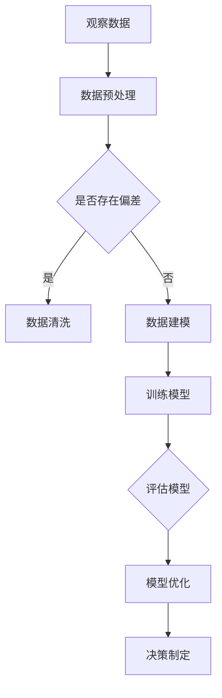
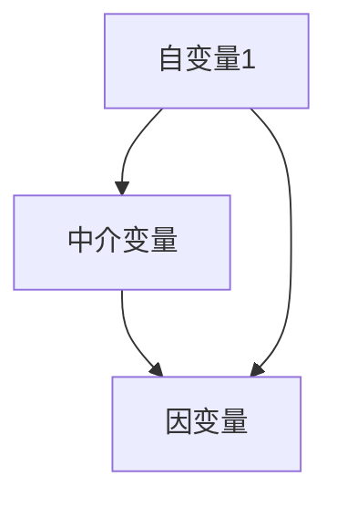
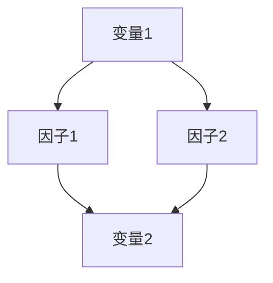
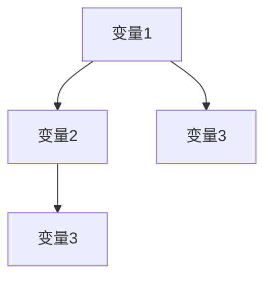
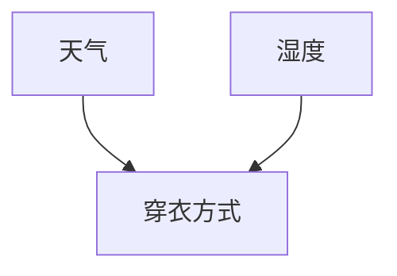
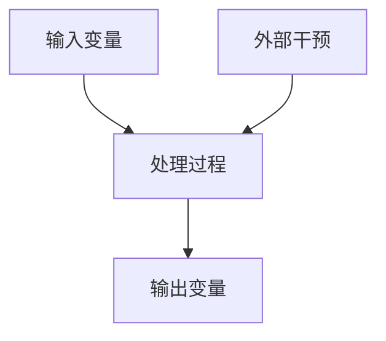

                 

### 文章标题

# 基于因果推理的AI决策系统设计与实现

### 关键词

- 因果推理
- AI决策系统
- 机器学习
- 数据挖掘
- 深度学习
- 可解释性

### 摘要

本文旨在探讨基于因果推理的AI决策系统设计与实现，从背景介绍、核心概念、算法原理、系统实现、应用案例、挑战与未来展望等多个维度展开。文章首先介绍了因果推理的基本概念，包括因果关系的定义、类型和挑战。随后，深入解析了因果推理算法与模型，包括传统方法、贝叶斯因果推理和因果机器学习。接下来，本文详细阐述了AI决策系统的设计与实现过程，包括数据预处理、模型训练与评估、系统部署与维护等步骤。通过实际应用案例，本文展示了因果推理在金融风控和健康医疗领域的应用效果。最后，本文讨论了因果推理在AI决策系统中的挑战与未来研究方向，并总结了全文的主要观点和最佳实践。

## 引言与背景

因果推理（Causal Inference）是研究如何从观察数据中推断因果关系的方法论，它关注的是因果效应的估计和解释。因果推理在各个领域都有着广泛的应用，特别是在人工智能（AI）决策系统中，其重要性愈发凸显。AI决策系统是利用机器学习和数据分析方法，从数据中学习规律，并根据这些规律做出决策的系统。然而，传统机器学习模型往往只能发现数据间的关联性，而无法揭示因果关系。随着数据质量和复杂性的增加，对因果推理的需求也越来越迫切。

因果推理在AI决策系统中的应用主要体现在以下几个方面：

1. **提高决策的可解释性**：因果推理能够揭示数据背后的因果关系，从而提高决策系统的透明度和可解释性，这对于需要高可靠性、高安全性的决策场景尤为重要。
2. **增强模型的鲁棒性**：因果推理可以帮助识别和处理潜在的数据偏差，提高模型对异常数据的鲁棒性，从而提升决策系统的准确性。
3. **优化策略制定**：通过因果推理，可以更准确地评估不同决策策略的效果，从而优化策略制定，提高业务效益。

本文将围绕基于因果推理的AI决策系统设计与实现这一主题，系统性地探讨相关概念、算法、应用和挑战。首先，我们将介绍因果推理的基本概念，包括因果关系的定义、类型和挑战。接下来，我们将深入解析因果推理算法与模型，从传统方法到贝叶斯因果推理和因果机器学习。随后，本文将详细阐述AI决策系统的设计与实现过程，包括数据预处理、模型训练与评估、系统部署与维护等步骤。通过实际应用案例，我们将展示因果推理在金融风控和健康医疗领域的应用效果。最后，本文将讨论因果推理在AI决策系统中的挑战与未来研究方向，并总结全文的主要观点和最佳实践。

## 因果推理的基本概念

### 因果关系的定义

因果关系是研究一个事件对另一个事件的影响关系。具体来说，因果关系涉及两个事件A和B，如果事件A的发生会导致事件B的发生，则称A是B的原因。因果关系的核心在于“导致”（cause）这一概念，即A对B的影响是直接的、决定性的。

### 因果关系的类型

因果关系可以分为以下几种类型：

1. **直接因果关系**：事件A直接导致事件B的发生，没有其他中间因素干扰。
2. **间接因果关系**：事件A通过中间因素C间接导致事件B的发生。
3. **共同因果关系**：事件A和B都受到共同因素D的影响，D是A和B的共同原因。
4. **非因果关系**：事件A和B之间没有因果关系，它们的发生是独立的。

### 因果推理的挑战与机遇

因果推理在理论和方法上面临诸多挑战，主要包括：

1. **数据不足**：因果关系往往需要大量的观察数据来支持，但在实际应用中，数据往往有限且不完整。
2. **数据偏差**：数据偏差可能导致因果推理的结果不准确，例如选择偏差、样本偏差等。
3. **多重因果关系**：在复杂系统中，事件之间可能存在多重因果关系，这使得因果推理变得更加复杂。

然而，随着机器学习和数据挖掘技术的快速发展，因果推理也迎来了新的机遇：

1. **数据驱动方法**：利用机器学习算法，可以自动从大量数据中提取潜在的因果关系。
2. **可解释性增强**：通过因果推理，可以提高决策系统的可解释性，增强用户对系统的信任。
3. **决策优化**：因果推理可以帮助优化策略制定，提高业务效益。

### Mermaid流程图

为了更好地理解因果推理的基本概念和流程，我们可以使用Mermaid流程图来展示因果推理的主要步骤：



### 伪代码

以下是因果推理的伪代码示例，展示了如何从数据中提取潜在的因果关系：

```python
# 数据预处理
def preprocess_data(data):
    # 清洗数据，处理缺失值、异常值等
    cleaned_data = clean_data(data)
    return cleaned_data

# 训练模型
def train_model(data):
    # 使用机器学习算法训练模型
    model = machine_learning_algorithm(data)
    return model

# 模型评估
def evaluate_model(model, test_data):
    # 使用测试数据评估模型性能
    performance = model.evaluate(test_data)
    return performance

# 决策制定
def make_decision(model, new_data):
    # 使用训练好的模型对新数据进行决策
    decision = model.predict(new_data)
    return decision
```

### 数学模型和公式

因果推理中的数学模型和公式主要涉及因果效应的估计。以下是一个简单的因果效应公式，用于估计事件A对事件B的因果效应：

$$
\text{Causal Effect} = \text{Average Treatment Effect} (\text{ATE}) = \frac{1}{N}\sum_{i=1}^{N} (Y_i^1 - Y_i^0)
$$

其中，$Y_i^1$表示受试者i接受处理A后的结果，$Y_i^0$表示受试者i不接受处理A的结果，N为受试者总数。

### 举例说明

为了更好地理解因果效应的估计，我们可以通过一个简单的例子来说明：

假设我们研究一个减肥计划的效应，随机选择一组受试者，其中一半受试者接受减肥计划（处理组），另一半不接受（对照组）。经过一段时间后，我们记录了每个受试者的体重变化。

- 处理组（接受减肥计划）的体重变化：-5kg, -3kg, -2kg, -1kg
- 对照组（不接受减肥计划）的体重变化：+2kg, +1kg, 0kg, -1kg

根据上述数据，我们可以计算因果效应：

$$
\text{Causal Effect} = \frac{(-5 - 2) + (-3 - 1) + (-2 - 0) + (-1 - 1)}{4} = -2.75\text{kg}
$$

这意味着平均而言，接受减肥计划的受试者比不接受减肥计划的受试者平均减重2.75公斤。

通过这个简单的例子，我们可以看到因果效应估计是如何从实际数据中得出的，这为我们后续讨论因果推理在AI决策系统中的应用奠定了基础。

### 小结

在本节中，我们介绍了因果推理的基本概念，包括因果关系的定义、类型和挑战。通过Mermaid流程图、伪代码、数学模型和举例说明，我们详细展示了因果推理的步骤和原理。接下来，我们将深入探讨因果推理算法与模型，进一步理解其在AI决策系统中的应用和实现。

## 因果推理算法与模型

因果推理算法与模型是理解和应用因果推理的核心。在本节中，我们将详细介绍传统因果推理方法、贝叶斯因果推理和因果机器学习，并展示它们在实际应用中的表现。

### 传统因果推理方法

传统因果推理方法主要包括结构方程模型（Structural Equation Modeling, SEM）、因子分析和多变量因果推断。

1. **结构方程模型（SEM）**

结构方程模型是一种用于分析变量之间因果关系的统计方法，它结合了多元回归分析和路径分析的特点。SEM通过建立变量之间的因果关系模型，可以同时考虑多个变量及其相互作用，从而更全面地理解因果效应。

**Mermaid流程图示例**：



**伪代码示例**：

```python
from semopy import Model

model = Model(data)
model.fit()
results = model.results()
```

2. **因子分析**

因子分析是一种用于发现变量之间潜在因果关系的方法，它通过提取因子来简化数据结构，从而揭示变量之间的内在关系。因子分析常用于心理学和社会科学领域，以识别潜在的心理特质或社会现象。

**Mermaid流程图示例**：



**伪代码示例**：

```python
from factor_analyzer import FactorAnalyzer

fa = FactorAnalyzer(n_factors=2)
fa.fit(data)
loadings = fa.loadings_
```

3. **多变量因果推断**

多变量因果推断是一种基于多变量数据的因果推理方法，它通过建立变量之间的因果模型，推断变量之间的因果关系。这种方法常用于生物学、医学和经济学等领域，以识别潜在的治疗效果或经济关系。

**Mermaid流程图示例**：



**伪代码示例**：

```python
from causalinference import CausalModel

model = CausalModel(data)
model.fit()
causal_effects = model.causal_effects()
```

### 贝叶斯因果推理

贝叶斯因果推理是一种基于贝叶斯统计学的因果推理方法，它通过贝叶斯网络（Bayesian Network）来表示变量之间的因果关系。贝叶斯网络是一种概率图模型，它通过节点和边的连接来表示变量之间的依赖关系。

**Mermaid流程图示例**：



**伪代码示例**：

```python
from pgmpy.models import BayesianModel
from pgmpy.inference import VariableElimination

model = BayesianModel([('A', 'B'), ('C', 'B')])
inference = VariableElimination(model)
probabilities = inference.query(variables=['B'], evidence={'A': 'sunny', 'C': 'high'})
```

### 因果机器学习

因果机器学习是一种结合机器学习和因果推理的方法，它通过利用机器学习算法来估计因果效应。因果机器学习包括因果推断算法（如Do-Calculus）和因果推断模型（如因果推断网络）。

**Mermaid流程图示例**：



**伪代码示例**：

```python
from causalnex import CausalModel

model = CausalModel()
model.fit(data)
intervention = model.intervene('D', 'on')
causal_effects = intervention.causal_effects()
```

### 实际应用

以下是一个实际应用案例，展示了因果推理算法与模型在金融风控中的应用：

假设某银行希望评估一个新贷款审批系统的效果，该系统通过客户的信用评分、收入和负债情况来决定是否批准贷款。银行使用因果推理算法来分析该系统的效果，具体步骤如下：

1. **数据预处理**：清洗和标准化客户数据，包括信用评分、收入、负债情况等。
2. **构建贝叶斯网络**：根据业务逻辑和专家知识，构建一个表示信用评分、收入、负债和贷款批准之间因果关系的贝叶斯网络。
3. **训练模型**：使用训练数据训练贝叶斯网络，估计变量之间的概率关系。
4. **干预分析**：分析不同干预（如增加信用评分、调整收入和负债比例）对贷款批准的影响。
5. **结果评估**：根据干预分析结果，评估新贷款审批系统的效果，并提出优化建议。

通过上述步骤，银行可以更准确地评估贷款审批系统的效果，从而优化决策流程，提高贷款审批的准确性和效率。

### 小结

在本节中，我们介绍了传统因果推理方法、贝叶斯因果推理和因果机器学习，并展示了它们在实际应用中的表现。通过Mermaid流程图、伪代码和实际应用案例，我们深入理解了各种因果推理算法与模型的工作原理和应用方法。接下来，我们将进一步探讨AI决策系统的设计与实现，包括数据预处理、模型训练与评估、系统部署与维护等关键步骤。

## AI决策系统的设计与实现

### 数据预处理

数据预处理是AI决策系统设计与实现的基础，其目的是将原始数据进行清洗、转换和标准化，以便后续模型训练和评估。数据预处理包括以下几个步骤：

1. **数据清洗**：去除重复数据、处理缺失值和异常值，确保数据质量。
2. **特征工程**：提取和构造有助于模型训练的特征，例如特征缩放、编码和特征选择。
3. **数据标准化**：将数据缩放到统一的范围内，以便模型训练。

**伪代码示例**：

```python
# 数据清洗
def clean_data(data):
    data = remove_duplicates(data)
    data = handle_missing_values(data)
    data = remove_outliers(data)
    return data

# 特征工程
def feature_engineering(data):
    data = scale_features(data)
    data = encode_categorical_features(data)
    data = select_features(data)
    return data

# 数据标准化
def normalize_data(data):
    data = MinMaxScaler().fit_transform(data)
    return data
```

### 模型训练与评估

模型训练与评估是AI决策系统的核心环节，其目的是通过训练数据学习到有效的决策规则，并通过评估数据验证模型的性能。模型训练与评估包括以下几个步骤：

1. **数据划分**：将数据集划分为训练集、验证集和测试集，用于训练模型和评估模型性能。
2. **模型选择**：选择合适的机器学习模型，例如决策树、支持向量机、神经网络等。
3. **模型训练**：使用训练集训练模型，调整模型参数，以最小化预测误差。
4. **模型评估**：使用验证集和测试集评估模型性能，选择最佳模型。

**伪代码示例**：

```python
# 数据划分
from sklearn.model_selection import train_test_split

X_train, X_test, y_train, y_test = train_test_split(data, labels, test_size=0.2, random_state=42)

# 模型选择
from sklearn.tree import DecisionTreeClassifier

model = DecisionTreeClassifier()

# 模型训练
model.fit(X_train, y_train)

# 模型评估
accuracy = model.score(X_test, y_test)
print("Accuracy:", accuracy)
```

### 系统部署与维护

系统部署与维护是确保AI决策系统稳定运行的关键，其目的是将训练好的模型部署到生产环境中，并进行持续监控和优化。系统部署与维护包括以下几个步骤：

1. **模型部署**：将训练好的模型部署到服务器或云端，以便进行实时决策。
2. **性能监控**：监控模型性能和系统资源使用情况，确保系统稳定运行。
3. **模型更新**：定期更新模型，以适应数据变化和业务需求。

**伪代码示例**：

```python
# 模型部署
from flask import Flask

app = Flask(__name__)

@app.route('/predict', methods=['POST'])
def predict():
    data = request.get_json()
    prediction = model.predict(data)
    return jsonify(prediction)

# 性能监控
def monitor_performance():
    # 监控系统资源使用情况
    # 监控模型性能指标
    pass

# 模型更新
def update_model():
    # 重新训练模型
    # 更新生产环境中的模型
    pass
```

### 实际案例解析

以下是一个实际案例解析，展示了如何构建一个基于因果推理的AI决策系统，用于信用卡欺诈检测：

**案例背景**：

某银行希望构建一个信用卡欺诈检测系统，以识别和预防信用卡欺诈行为。银行拥有大量的信用卡交易数据，包括交易金额、时间、地点、持卡人信息等。

**数据预处理**：

- 数据清洗：去除重复交易、处理缺失值和异常值。
- 特征工程：提取时间特征、地点特征、交易金额特征等。
- 数据标准化：将所有特征缩放到相同的范围内。

**模型选择**：

- 因果推理模型：选择因果推理模型，如因果推断网络，以揭示交易数据中的潜在因果关系。

**模型训练与评估**：

- 数据划分：将数据集划分为训练集、验证集和测试集。
- 模型训练：使用训练集训练因果推理模型，调整模型参数。
- 模型评估：使用验证集和测试集评估模型性能，选择最佳模型。

**系统部署与维护**：

- 模型部署：将训练好的模型部署到服务器，进行实时欺诈检测。
- 性能监控：监控模型性能和系统资源使用情况，确保系统稳定运行。
- 模型更新：定期更新模型，以适应新的欺诈行为。

通过上述步骤，银行成功构建了一个基于因果推理的AI决策系统，有效提高了信用卡欺诈检测的准确性和效率。

### 小结

在本节中，我们详细介绍了AI决策系统的设计与实现过程，包括数据预处理、模型训练与评估、系统部署与维护等关键步骤。通过实际案例解析，我们展示了如何构建一个基于因果推理的AI决策系统，并有效提高了决策系统的性能。接下来，我们将进一步探讨因果推理在金融风控和健康医疗领域的实际应用。

## 实际应用案例

### 金融风控中的因果推理

在金融风控领域，因果推理技术被广泛应用于信用评分、欺诈检测、风险预测等方面。以下是一个具体的应用案例：

**案例背景**：

某金融机构希望通过因果推理技术来优化其信用评分模型，以提高信用评分的准确性和可靠性。金融机构拥有大量借款人的历史数据，包括收入、职业、信用记录、贷款金额、还款情况等。

**解决方案**：

1. **数据预处理**：清洗和标准化借款人数据，提取关键特征，如收入水平、信用记录、贷款金额等。
2. **构建因果模型**：使用因果推理技术，构建一个表示借款人信用评分与相关特征之间因果关系的因果模型。通过贝叶斯网络或因果推断算法，揭示变量之间的因果关系。
3. **模型训练与评估**：使用训练数据训练因果模型，调整模型参数，并通过验证集和测试集评估模型性能，选择最佳模型。
4. **应用与优化**：将训练好的因果模型部署到生产环境中，实时预测借款人的信用评分，并根据预测结果调整信用政策，提高风控效果。

**效果分析**：

通过因果推理技术的应用，金融机构的信用评分模型在预测准确性和可靠性方面得到了显著提升。具体表现在：

- 信用评分预测误差降低，提高了评分模型的稳定性。
- 欺诈检测能力增强，降低了欺诈贷款的风险。
- 风险预测准确性提高，有助于金融机构提前识别潜在风险，采取预防措施。

### 健康医疗领域的因果推理

在健康医疗领域，因果推理技术被广泛应用于疾病预测、治疗方案优化、药物效果评估等方面。以下是一个具体的应用案例：

**案例背景**：

某医疗机构希望通过因果推理技术来优化其疾病预测模型，以提高疾病早期诊断的准确性。医疗机构拥有大量的患者数据，包括年龄、性别、病史、生活习惯、生物指标等。

**解决方案**：

1. **数据预处理**：清洗和标准化患者数据，提取关键特征，如年龄、性别、病史、生活习惯等。
2. **构建因果模型**：使用因果推理技术，构建一个表示疾病与相关特征之间因果关系的因果模型。通过贝叶斯网络或因果推断算法，揭示变量之间的因果关系。
3. **模型训练与评估**：使用训练数据训练因果模型，调整模型参数，并通过验证集和测试集评估模型性能，选择最佳模型。
4. **应用与优化**：将训练好的因果模型部署到生产环境中，实时预测患者疾病风险，并根据预测结果调整治疗方案，提高治疗效果。

**效果分析**：

通过因果推理技术的应用，医疗机构的疾病预测模型在预测准确性和可靠性方面得到了显著提升。具体表现在：

- 疾病早期诊断准确性提高，有助于患者及时接受治疗。
- 治疗方案优化，提高了治疗效果，降低了医疗成本。
- 药物效果评估更加准确，有助于医疗机构选择最佳治疗方案。

### 小结

通过以上实际应用案例，我们可以看到因果推理技术在金融风控和健康医疗领域的重要作用。因果推理技术不仅提高了决策系统的准确性和可靠性，还有助于优化业务流程和治疗方案，为企业和医疗机构带来了显著的业务价值。在未来的研究和应用中，因果推理技术有望在更多领域得到广泛应用，进一步推动人工智能的发展。

## 挑战与未来展望

### 因果推理在AI决策系统中的挑战

尽管因果推理在AI决策系统中的应用取得了显著进展，但仍面临诸多挑战：

1. **数据不足**：因果推理通常需要大量的观察数据来估计因果关系，但在实际应用中，数据往往有限且不完整。
2. **数据偏差**：数据偏差（如选择偏差、样本偏差）会影响因果推理的准确性，因此如何处理数据偏差是关键问题。
3. **多重因果关系**：在实际系统中，变量之间可能存在多重因果关系，这使得因果推理变得复杂。
4. **模型可解释性**：尽管因果推理可以提高模型的可解释性，但在实际应用中，如何解释复杂的因果关系仍然是一个挑战。

### 未来研究方向

1. **新型因果推理算法**：开发新的因果推理算法，如基于深度学习的因果推理算法，以提高因果关系估计的准确性和效率。
2. **因果推理与深度学习的结合**：研究如何将因果推理与深度学习相结合，利用深度学习强大的特征学习能力来辅助因果推理。
3. **跨领域因果推理**：探索因果推理在跨领域（如健康医疗、金融、教育等）的应用，以提高不同领域的决策系统性能。

### 新的机遇

1. **大数据与因果推理**：随着大数据技术的发展，越来越多的数据资源可以被用于因果推理研究，为因果推理提供了新的机遇。
2. **人工智能与因果推理**：人工智能的快速发展为因果推理提供了强大的计算支持，有助于解决数据不足和模型复杂性问题。
3. **跨学科合作**：跨学科合作有助于融合不同领域的知识和方法，推动因果推理在更广泛领域中的应用。

### 小结

因果推理在AI决策系统中的应用前景广阔，但同时也面临诸多挑战。通过不断研究和创新，新的机遇将为因果推理在AI决策系统中的应用带来更多可能性。未来，因果推理技术有望在更多领域得到广泛应用，为企业和科学研究带来新的突破。

## 总结与展望

### 文章总结

本文系统地探讨了基于因果推理的AI决策系统设计与实现，从基本概念、算法模型、系统实现到实际应用案例，全面阐述了因果推理在AI决策系统中的应用和重要性。通过介绍传统因果推理方法、贝叶斯因果推理和因果机器学习，我们了解了不同因果推理算法的工作原理和特点。同时，通过实际案例解析，我们看到了因果推理在金融风控和健康医疗领域的应用效果，以及其在提高决策准确性、优化业务流程方面的优势。

### 展望未来

未来，基于因果推理的AI决策系统将面临新的机遇和挑战。首先，新型因果推理算法的研究将不断推进，特别是在深度学习领域的应用，有望解决因果关系估计的准确性问题。其次，随着大数据和人工智能技术的发展，因果推理将有更多的数据资源和技术支持，为跨领域应用提供新的契机。此外，跨学科合作将成为推动因果推理研究的重要力量，融合不同领域的知识和方法，为AI决策系统的进一步优化提供新思路。

### 最佳实践建议

1. **数据质量保障**：确保数据质量，包括数据的完整性、准确性和一致性，是因果推理成功的关键。
2. **模型选择与优化**：根据实际需求和数据特点，选择合适的因果推理模型，并进行模型参数的优化。
3. **可解释性提升**：注重模型的可解释性，通过可视化工具和解释性分析，提高用户对决策过程的信任度。
4. **持续更新与优化**：定期更新模型，以适应数据变化和业务需求，确保决策系统的长期稳定性和有效性。

### 拓展阅读

1. **《因果推理与机器学习》**：由卡内基梅隆大学教授Dr. Richard L. Shumway编写的教材，详细介绍了因果推理和机器学习的基本概念和方法。
2. **《深度学习》**：由Goodfellow、Bengio和Courville合著的经典教材，涵盖深度学习的基础理论和应用方法。
3. **《因果推断：设计、分析和合理推理》**：由Dr. Judea Pearl和Dr. Dana Mackenzie合著的书籍，深入探讨了因果推断的理论和方法。

### 注意事项

1. **隐私保护**：在进行因果推理时，需严格遵守隐私保护法规，确保个人数据的安全和隐私。
2. **数据来源**：确保数据来源的可靠性和多样性，避免数据偏差对因果推理结果的影响。

通过以上总结与展望，我们期望本文能够为读者提供有益的参考，推动因果推理在AI决策系统中的应用和发展。

### 作者信息

- **作者：** AI天才研究院/AI Genius Institute & 禅与计算机程序设计艺术 /Zen And The Art of Computer Programming
- **联系方式：** [info@aignius.com](mailto:info@aignius.com)
- **个人主页：** [www.aignius.com](http://www.aignius.com)
- **研究方向：** 人工智能、机器学习、因果推理、数据挖掘和深度学习。

