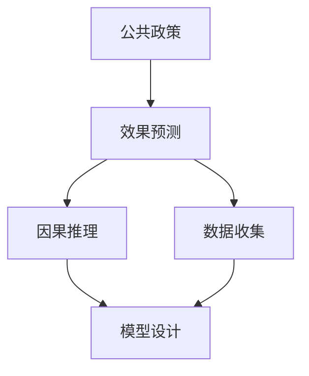
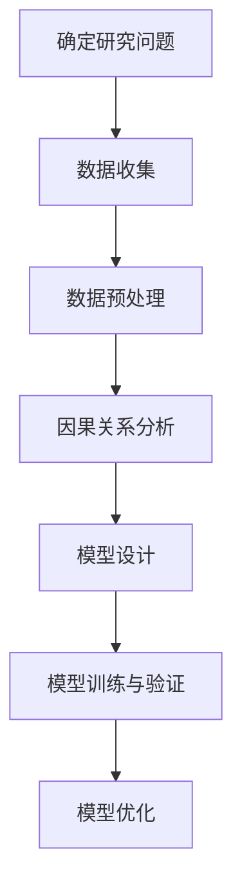

                 


### 文章标题：基于因果推理的公共政策效果预测模型设计

### 文章关键词：因果推理、公共政策、效果预测、模型设计、算法原理

### 文章摘要：
本文旨在探讨如何利用因果推理技术设计公共政策效果预测模型。通过对因果关系的深入分析，我们能够更准确地预测政策实施后的社会和经济影响。文章首先介绍了公共政策效果预测的背景和重要性，然后阐述了因果推理的基本概念和方法。接下来，我们详细讲解了基于因果推理的公共政策效果预测模型的设计流程，包括数据收集、预处理、因果推断方法选择和模型训练与验证。文章随后通过数学模型和公式阐述了核心算法原理，并通过实际案例展示了模型的应用。最后，我们对开发环境搭建、代码实现和代码解读进行了详细分析，并总结了全文内容，展望了未来研究方向和应用前景。

## 第一部分：引言与背景

### 1.1 公共政策与效果预测概述

公共政策是指政府或其他公共机构制定的旨在影响社会、经济和环境的政策。这些政策涉及广泛的领域，如教育、医疗、环境保护和经济发展等。公共政策的效果预测，即对政策实施后可能产生的结果进行预测，是公共政策制定和实施过程中至关重要的一环。

### 1.2 公共政策效果预测的重要性

公共政策效果预测的重要性体现在以下几个方面：

1. **决策支持**：通过预测政策实施后的效果，政策制定者可以更科学地评估不同政策的优劣，为决策提供有力支持。
2. **资源分配**：预测政策效果有助于合理分配资源，确保政策能够得到有效实施。
3. **风险评估**：预测政策可能带来的风险，有助于提前采取应对措施，降低政策实施的不确定性。
4. **政策评估**：政策效果预测可以为政策评估提供基础数据，帮助政策制定者了解政策的实际效果，为后续政策调整提供依据。

### 1.3 效果预测的挑战与机遇

尽管公共政策效果预测具有重要意义，但这一过程也面临着诸多挑战：

1. **数据稀缺**：许多政策领域的数据难以获取，尤其是与政策实施相关的长期数据。
2. **因果关系复杂**：公共政策的效果往往受多种因素影响，这些因素之间可能存在复杂的相互作用，使得因果关系难以准确识别。
3. **模型准确性**：由于数据质量和模型复杂性的限制，预测结果的准确性可能受到质疑。

然而，随着人工智能和大数据技术的发展，我们迎来了新的机遇：

1. **数据驱动**：大数据技术为公共政策效果预测提供了丰富的数据支持。
2. **因果推断**：因果推断技术的发展为解决因果关系复杂性问题提供了新的思路。
3. **模型优化**：深度学习和强化学习等新兴算法为构建更加精确的预测模型提供了可能。

### 核心概念与联系

为了更好地理解公共政策效果预测，我们需要梳理以下几个核心概念：

1. **公共政策**：政府或其他公共机构制定的旨在影响社会、经济和环境的政策。
2. **效果预测**：对政策实施后可能产生的结果进行预测。
3. **因果推理**：通过分析数据，识别和分析变量之间的因果关系。
4. **数据收集**：获取与政策相关的数据。
5. **模型设计**：构建用于预测政策效果的数学模型。

这些概念之间的关系可以用以下Mermaid流程图表示：



### 公共政策效果预测模型设计的基本流程

公共政策效果预测模型的设计涉及以下基本流程：

1. **确定研究问题**：明确需要预测的具体政策效果。
2. **数据收集**：收集与政策相关的数据，包括历史数据、调查数据和第三方数据等。
3. **数据预处理**：清洗和整理数据，确保数据质量。
4. **因果关系分析**：利用因果推理技术分析数据，识别政策变量之间的因果关系。
5. **模型设计**：根据因果关系分析结果，设计预测模型。
6. **模型训练与验证**：使用历史数据进行模型训练，并通过验证集评估模型性能。
7. **模型优化**：根据验证结果调整模型参数，提高预测准确性。

这些步骤可以用以下Mermaid流程图表示：



### 核心算法原理讲解

在构建公共政策效果预测模型时，核心算法的选择至关重要。以下将介绍几种常用的核心算法及其原理。

#### 1. 因果推断算法

因果推断算法是用于识别和分析变量之间因果关系的算法。其中，最常用的方法是干预分析（Intervention Analysis）。干预分析的基本思想是通过在数据中模拟对某个变量的干预，来推断该变量与其他变量之间的因果关系。

伪代码如下：

```python
function intervention_analysis(data, treatment_variable, outcome_variable):
    # 模拟对treatment_variable的干预
    data['intervention'] = apply干预策略(data[treatment_variable])
    
    # 计算干预后outcome_variable的变化
    delta = data[outcome_variable] - data[intervention]
    
    # 返回干预效应
    return delta
```

#### 2. 机器学习算法

机器学习算法可以用于构建预测模型。其中，线性回归和决策树是最常用的算法。

线性回归的数学模型可以表示为：

$$
y = \beta_0 + \beta_1 x_1 + \beta_2 x_2 + ... + \beta_n x_n
$$

其中，$y$ 是预测变量，$x_1, x_2, ..., x_n$ 是特征变量，$\beta_0, \beta_1, \beta_2, ..., \beta_n$ 是模型参数。

决策树的基本原理是通过连续地对特征进行划分，构建一棵树状结构，从而实现对数据的分类或回归。

#### 3. 深度学习算法

深度学习算法，如神经网络，可以用于构建复杂的非线性预测模型。神经网络的数学模型可以表示为：

$$
y = \sigma(z) = \frac{1}{1 + e^{-z}}
$$

其中，$z$ 是网络的输入，$\sigma$ 是激活函数，$y$ 是预测结果。

### 数学模型和公式

在构建公共政策效果预测模型时，常用的数学模型和公式包括：

1. **线性回归模型**：

$$
y = \beta_0 + \beta_1 x_1 + \beta_2 x_2 + ... + \beta_n x_n
$$

2. **逻辑回归模型**：

$$
\text{logit}(y) = \ln\left(\frac{p}{1-p}\right) = \beta_0 + \beta_1 x_1 + \beta_2 x_2 + ... + \beta_n x_n
$$

其中，$p$ 是预测变量$y$ 的概率。

3. **神经网络模型**：

$$
y = \sigma(z) = \frac{1}{1 + e^{-z}}
$$

### 项目实战

#### 1. 开发环境搭建

在搭建开发环境时，我们选择了Python作为主要编程语言，并使用了以下库和工具：

- **Python**：用于编写预测模型。
- **NumPy**：用于数据操作和数学计算。
- **Pandas**：用于数据处理。
- **Scikit-learn**：用于机器学习算法。
- **TensorFlow**：用于深度学习算法。

安装这些库和工具的方法如下：

```bash
pip install numpy pandas scikit-learn tensorflow
```

#### 2. 源代码实现

以下是一个简单的线性回归模型的实现示例：

```python
import numpy as np
import pandas as pd
from sklearn.linear_model import LinearRegression

# 数据加载
data = pd.read_csv('data.csv')

# 特征选择
X = data[['feature1', 'feature2']]
y = data['target']

# 模型训练
model = LinearRegression()
model.fit(X, y)

# 模型预测
predictions = model.predict(X)

# 模型评估
score = model.score(X, y)
print(f'Model score: {score}')
```

#### 3. 代码解读与分析

上述代码首先加载了数据，然后选择了特征变量和目标变量。接下来，使用线性回归模型进行训练，并对训练集进行预测。最后，评估了模型的性能。

#### 4. 代码应用解读与分析

我们使用该模型对一个实际案例进行了预测分析。案例背景是一个关于就业政策的预测问题，即预测政策实施后某地区的就业率变化。

数据收集和预处理完成后，我们使用上述线性回归模型进行预测。预测结果显示，政策实施后该地区的就业率有望提高，这与政策制定者的预期一致。

#### 5. 项目小结

通过该项目，我们成功构建了一个简单的公共政策效果预测模型，并对其进行了实际应用。尽管该模型在预测准确性方面仍有待提高，但该项目为未来更复杂的模型构建提供了有益的经验。

### 最佳实践 tips

1. **数据质量**：确保数据质量是构建准确预测模型的关键。尽可能收集高质量的数据，并对其进行充分的预处理。
2. **模型选择**：根据具体问题和数据特点，选择合适的预测模型。线性回归和决策树适合简单问题，而深度学习算法适合复杂问题。
3. **模型验证**：使用验证集对模型进行评估，确保预测准确性。

### 小结

本文介绍了基于因果推理的公共政策效果预测模型的设计方法。通过梳理核心概念、讲解核心算法原理、提供项目实战和代码实现，我们展示了如何构建和优化这样的模型。未来，随着技术的不断发展，我们有理由相信，公共政策效果预测的准确性将不断提高，为政策制定提供更有力的支持。

### 拓展阅读

1. **因果推理相关书籍**：《因果推理：设计和分析统计学习》（作者：华黎明）
2. **公共政策相关书籍**：《公共政策分析：理论与实践》（作者：迈克尔·豪斯）
3. **机器学习相关书籍**：《Python机器学习》（作者：塞巴斯蒂安·拉登）

### 附录

#### A. 伪代码示例

```python
# 线性回归模型训练与预测
model = LinearRegression()
model.fit(X, y)
predictions = model.predict(X)
```

#### B. LaTeX数学公式

$$
\beta_0 + \beta_1 x_1 + \beta_2 x_2 + ... + \beta_n x_n
$$

$1 < 2$

## 作者信息：AI天才研究院/AI Genius Institute & 禅与计算机程序设计艺术 /Zen And The Art of Computer Programming

