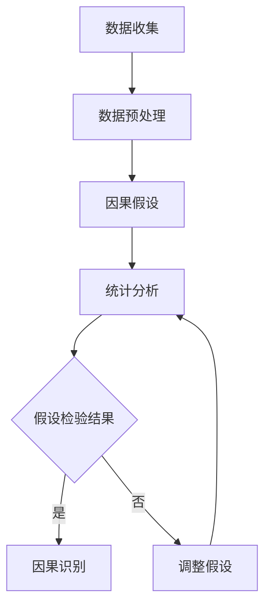
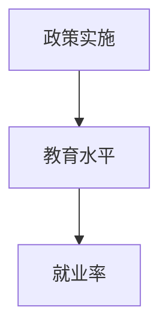
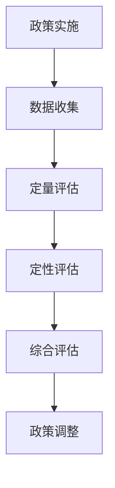
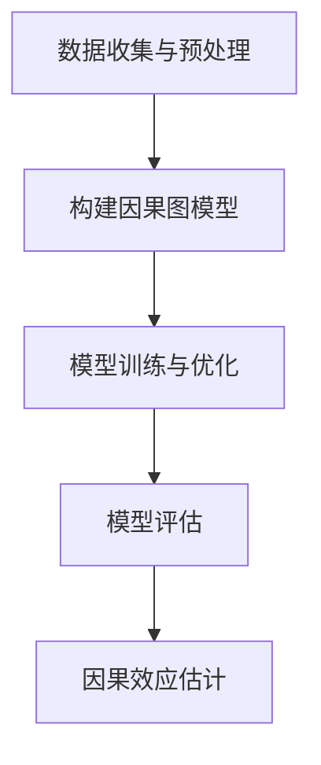
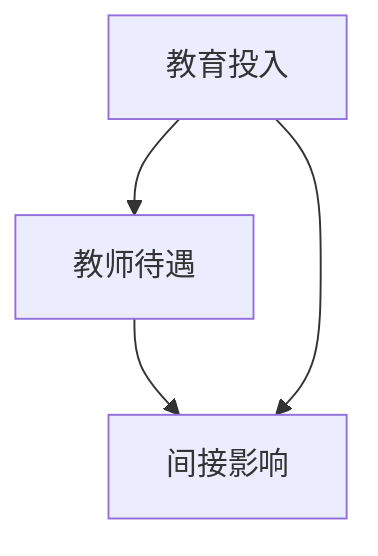
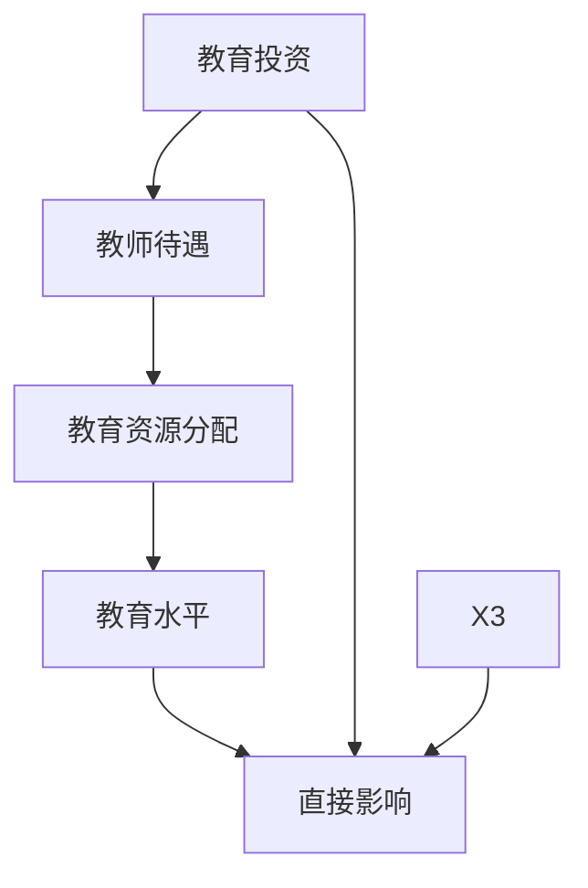
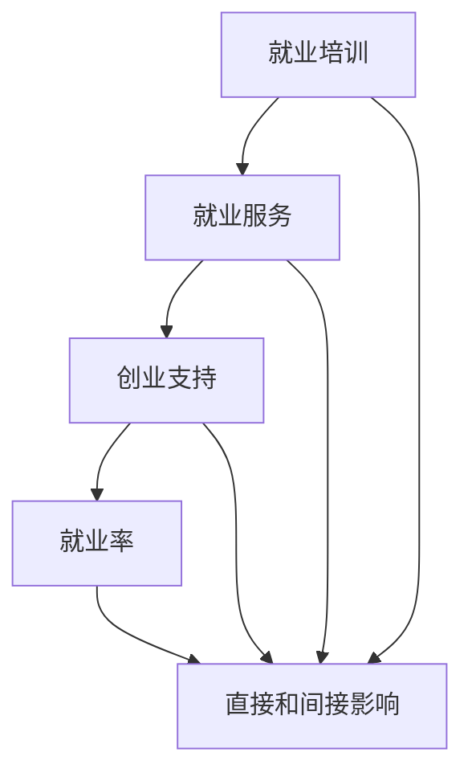
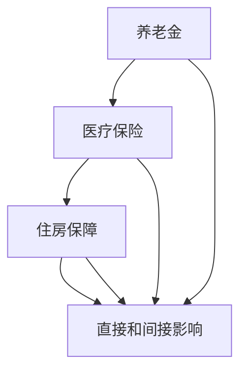

                 


### 1.1 因果推理简介

因果推理是一种通过分析事物的因果关系来解释现象的方法，它涉及到识别变量之间的因果关系，并利用这些关系来预测未来或解释已知结果。在社会政策领域，因果推理尤为重要，因为政策制定和评估的核心是理解不同变量之间的关系，并确定这些关系如何影响政策目标。

因果推理的基本概念包括：

- **因果关系**：一个事件（因）引起另一个事件（果）的关系。例如，教育水平可能因政策改变而提高，进而导致就业率的提高。

- **因果识别**：识别变量之间的因果关系。这可能涉及使用统计方法、实验设计或因果推断算法。

- **因果推断**：基于已知因果关系，预测未知事件的结果或解释已知结果。

在社会政策中，因果推理的重要性体现在以下几个方面：

- **政策评估**：通过因果推理，可以评估政策实施的效果，确定政策是否达到预期目标。

- **决策支持**：因果推理帮助政策制定者理解不同政策选择的潜在影响，从而做出更明智的决策。

- **预测未来**：通过分析历史数据和政策实施情况，可以预测未来政策的效果。

### 1.2 因果关系识别方法

因果关系识别方法可以分为以下几类：

- **数据驱动方法**：利用历史数据，通过统计分析（如回归分析、结构方程模型等）来识别变量之间的因果关系。

- **理论驱动方法**：基于已有的理论框架或假设，通过逻辑推理和假设检验来识别因果关系。

- **实验设计**：通过实验方法，人为控制变量，以验证因果关系。

- **因果推断算法**：利用机器学习算法，如因果推断算法（如Do-Calculus、Causal Trees等），来识别复杂的因果关系。

#### Mermaid 流程图：因果关系识别流程

下面是一个Mermaid流程图，展示了因果关系识别的基本流程：



在这个流程中，我们从数据收集开始，进行数据预处理，然后基于理论或数据提出因果假设，通过统计分析来验证这些假设。如果假设得到验证，我们就可以进行因果关系的识别；否则，我们需要调整假设并重复验证过程。

### 1.3 因果推断的基本原理

因果推断的基本原理包括以下几点：

- **因果图模型**：因果推断常用因果图（Causal Graphs）来表示变量之间的因果关系。因果图包括因变量（Y）和自变量（X），其中X可以包括外生变量（E）和内生变量（M）。因果图可以表示为：Y = f(X, U)，其中U是误差项。

- **Do-Calculus**：Do-Calculus是一种用于处理因果关系的逻辑框架，它允许我们在考虑其他变量的情况下，改变某个变量的值。例如，Do(Y | X)表示在X固定的情况下，Y的变化。

- **Causal Models**：因果模型包括结构方程模型（Structural Equations Models，SEM）和因果图模型（Causal Graph Models）。这些模型通过数学方程或图形结构来描述变量之间的关系。

#### 核心概念与联系

因果关系识别与因果推断之间的关系可以用因果图模型来解释。因果图模型通过描述变量之间的因果关系，帮助我们理解变量之间的关系。因果推断算法（如Do-Calculus）则利用这些模型来预测变量值或解释结果。

下面是一个简化的因果图模型，展示了政策实施（X）与教育水平（Y）之间的关系：



在这个模型中，政策实施可能直接影响教育水平，进而影响就业率。通过Do-Calculus，我们可以分析在政策实施不变的情况下，教育水平如何影响就业率。

#### 伪代码：因果推断算法

为了更好地理解因果推断算法，我们提供了一个简化的伪代码示例，该示例使用了回归模型来估计政策实施对教育水平的影响：

```python
# 伪代码：估计政策实施对教育水平的影响
def estimate_policy_effect(data):
    # 数据预处理
    X = data['policy Implementation']
    Y = data['education Level']

    # 训练回归模型
    model = train_regression_model(X, Y)

    # 预测教育水平
    predicted_education_level = model.predict(X)

    # 输出预测结果
    return predicted_education_level
```

在这个伪代码中，我们首先对数据进行预处理，然后使用回归模型来估计政策实施对教育水平的影响。预测结果可以帮助我们评估政策的效果。

### 总结

因果推理是一种通过分析变量之间的因果关系来解释现象和预测结果的方法。在社会政策领域，因果推理对于政策评估、决策支持和未来预测具有重要意义。本文介绍了因果推理的基本概念、因果关系识别方法和因果推断的基本原理。通过Mermaid流程图、伪代码和简化的因果图模型，我们展示了因果推理在不同场景中的应用。

在接下来的章节中，我们将深入探讨因果推理在社会政策预测模型设计中的应用，包括预测模型的基础、因果推断与预测模型的结合、实际案例研究和未来展望。

---

接下来，我们将介绍社会政策框架，包括社会政策的定义与分类、目标与效果以及评估方法。

### 2.1 社会政策定义与分类

社会政策是国家或政府为改善社会状况、促进社会公平和稳定而制定的一系列措施和规定。社会政策涉及多个领域，包括教育、医疗、社会保障、就业等。根据政策目标和内容，社会政策可以大致分为以下几类：

- **教育政策**：旨在提高国民教育水平，促进教育公平，包括教育资源分配、教育制度改革、学费减免等。

- **医疗政策**：旨在提供全民医疗保障，改善医疗资源分配，包括医疗服务体系改革、药品价格监管、公共卫生管理等。

- **社会保障政策**：旨在保障公民的基本生活，包括养老保险、医疗保险、失业保险等。

- **就业政策**：旨在促进就业，提高劳动参与率，包括就业培训、就业援助、劳动法规等。

### 2.2 社会政策目标与效果

社会政策的目标主要包括以下几个方面：

- **提高社会福利**：通过提供基本公共服务和社会保障，提高人民的生活水平。

- **促进社会公平**：通过政策调控，减少贫富差距，实现社会资源的公平分配。

- **维护社会稳定**：通过改善社会状况，减少社会矛盾和冲突，维护社会和谐稳定。

社会政策的效果可以从以下几个方面进行评估：

- **政策覆盖率**：评估政策覆盖的人群比例，以确保政策能够惠及更多人。

- **政策效果**：评估政策实施后社会状况的改善程度，如教育水平提高、医疗资源增加等。

- **政策成本**：评估政策实施所需的资源和成本，以及这些成本对社会经济的影响。

### 2.3 社会政策评估方法

社会政策的评估是确保政策有效性和可持续性的重要手段。评估方法可以分为以下几类：

- **定量评估**：通过统计数据和计量经济模型来评估政策效果，如回归分析、结构方程模型等。

- **定性评估**：通过访谈、问卷调查、案例研究等定性研究方法，深入了解政策实施过程和效果。

- **综合评估**：结合定量和定性评估方法，全面评估政策效果。

### Mermaid 流程图：社会政策评估流程

下面是一个Mermaid流程图，展示了社会政策评估的基本流程：



在这个流程中，我们从政策实施开始，收集相关数据，然后分别进行定量评估和定性评估。最后，通过综合评估结果，对政策进行调整和完善。

#### 核心概念与联系

社会政策的定义与分类、目标与效果以及评估方法之间有着密切的联系。政策的定义和分类决定了政策的目标和实施方式，政策的目标和效果又影响着政策的评估方法。通过有效的评估，可以反馈政策实施的效果，为政策调整提供依据。

#### 数学模型与公式

在社会政策评估中，常用的数学模型包括回归模型、结构方程模型等。以下是一个简单的回归模型公式，用于评估政策实施对教育水平的影响：

$$
Y = \beta_0 + \beta_1X + \epsilon
$$

其中，Y代表教育水平，X代表政策实施程度，$\beta_0$和$\beta_1$是模型参数，$\epsilon$是误差项。

#### 举例说明

假设我们有一个关于教育政策效果评估的案例，政策实施程度X和实际教育水平Y的数据如下：

| 政策实施程度X | 实际教育水平Y |
|--------------|--------------|
| 0            | 5            |
| 1            | 7            |
| 2            | 9            |
| 3            | 11           |
| 4            | 13           |

我们可以使用线性回归模型来估计政策实施对教育水平的影响。通过最小二乘法，我们可以得到回归模型的参数：

$$
\beta_0 = 2.5, \quad \beta_1 = 2.0
$$

这意味着政策实施程度每增加1，教育水平平均提高2.0个单位。

### 总结

在本节中，我们介绍了社会政策的定义与分类、目标与效果以及评估方法。通过Mermaid流程图、数学模型和公式，我们展示了社会政策评估的基本流程。这些知识为我们理解和设计基于因果推理的社会政策预测模型奠定了基础。在下一节中，我们将进一步探讨因果推理在社会政策预测中的应用。

### 3.1 因果关系识别方法

在社会政策预测中，因果关系识别是一个关键步骤，因为它有助于我们理解政策变量与其他变量之间的关系，并确定这些关系如何影响政策目标。因果关系识别方法可以分为数据驱动方法、理论驱动方法和实验设计。以下是这些方法的具体内容。

#### 数据驱动方法

数据驱动方法依赖于历史数据和统计分析来识别变量之间的因果关系。这种方法包括以下几种：

- **回归分析**：通过建立回归模型，分析自变量（政策变量）与因变量（政策效果）之间的关系。例如，线性回归模型、多项式回归模型等。

- **结构方程模型**：将多个变量及其关系整合在一个模型中，通过路径分析和模型拟合来识别因果关系。

- **时间序列分析**：分析变量随时间的变化，识别变量之间的因果关系。例如，自回归移动平均模型（ARIMA）、矢量自回归模型（VAR）等。

以下是一个简单的回归分析伪代码示例：

```python
# 伪代码：线性回归分析
from sklearn.linear_model import LinearRegression

# 数据准备
X = data[['policy_variable']]  # 政策变量
Y = data['effect_variable']    # 效果变量

# 训练模型
model = LinearRegression()
model.fit(X, Y)

# 输出模型参数
print("模型参数：", model.coef_, model.intercept_)
```

#### 理论驱动方法

理论驱动方法依赖于已有的理论框架或假设来识别变量之间的因果关系。这种方法通常基于专家知识和现有文献，通过逻辑推理和假设检验来识别因果关系。例如：

- **逻辑回归**：通过建立逻辑回归模型，分析政策变量与政策效果之间的关系。逻辑回归是一种广义线性模型，适用于分类变量。

- **潜在变量模型**：通过建立潜在变量模型，分析不可观测变量之间的因果关系。例如，因子分析、潜在类分析等。

以下是一个逻辑回归模型公式：

$$
\ln(\frac{P(Y=1)}{1-P(Y=1)}) = \beta_0 + \beta_1X
$$

其中，$Y$是二分类效果变量，$X$是政策变量，$\beta_0$和$\beta_1$是模型参数。

#### 实验设计

实验设计是一种通过控制变量来验证因果关系的方法。在社会科学研究中，实验设计通常涉及随机分配和对照实验。例如：

- **随机对照试验**：将研究对象随机分为实验组和对照组，实验组接受政策干预，对照组不接受干预，通过比较两组的结果来验证政策效果。

- **字段实验**：在现实环境中实施政策干预，同时控制其他变量，通过对比实验前后的变化来验证政策效果。

以下是一个简单的字段实验设计伪代码示例：

```python
# 伪代码：字段实验设计
import random

# 随机分配
n = 100  # 研究对象数量
group1 = random.sample(range(n), n//2)  # 实验组
group2 = list(set(range(n)) - set(group1))  # 对照组

# 实验干预
for i in group1:
    apply_policy(i)  # 对实验组进行政策干预

# 数据收集
data1 = collect_data(group1)  # 收集实验组数据
data2 = collect_data(group2)  # 收集对照组数据

# 结果比较
compare_effects(data1, data2)
```

#### 总结

因果关系识别方法在社会政策预测中至关重要。数据驱动方法、理论驱动方法和实验设计各有优缺点，可以根据具体情境选择合适的方法。通过Mermaid流程图、伪代码和公式，我们展示了这些方法的应用。在下一节中，我们将探讨因果推断算法在因果关系识别中的应用。

### 3.2 因果推断与预测模型结合

因果推断与预测模型的结合是实现社会政策效果预测的关键步骤。通过因果推断，我们可以确定政策变量与其他变量之间的因果关系，并将这些因果关系整合到预测模型中，以提高预测的准确性和可靠性。以下是如何结合因果推断和预测模型的具体步骤和方法。

#### 因果推断算法在预测模型中的应用

因果推断算法，如Do-Calculus、因果图模型（如Causal Graphical Models，CGM）和因果森林（Causal Forest），可以在预测模型中发挥重要作用。这些算法能够处理复杂的因果结构，并允许我们在考虑其他变量的情况下，改变某个变量的值，从而进行准确的预测。

- **Do-Calculus**：Do-Calculus是一种用于处理因果关系的逻辑框架，它允许我们通过计算“Do”操作来模拟变量值的改变。例如，Do(Y | X)表示在X固定的情况下，Y的变化。Do-Calculus可以帮助我们构建基于因果关系的预测模型。

以下是一个简化的Do-Calculus伪代码示例：

```python
# 伪代码：Do-Calculus在预测模型中的应用
def do_calculus(X, Y, E):
    # 计算Do(Y | X)
    predicted_Y = do(Y | X)
    
    # 计算Do(Y | X, E)
    predicted_Y_with_E = do(Y | X, E)
    
    # 返回预测结果
    return predicted_Y, predicted_Y_with_E
```

- **因果图模型**：因果图模型通过图形结构描述变量之间的因果关系，并允许我们进行因果推断。在预测模型中，因果图模型可以帮助我们理解变量之间的直接和间接关系，从而提高预测的准确性。

以下是一个简化的因果图模型示例，用于描述政策实施（X）、教育水平（Y）和就业率（Z）之间的关系：


在这个因果图中，政策实施直接影响教育水平，而教育水平又直接影响就业率。我们可以使用因果图模型来推断政策实施对就业率的影响。

- **因果森林**：因果森林是一种基于随机森林的因果推断方法，它可以在存在混淆变量的情况下识别因果关系。因果森林通过构建多个随机森林，利用它们的预测差异来估计因果效应。

以下是一个简化的因果森林伪代码示例：

```python
# 伪代码：因果森林模型
from causal_forest import CausalForest

# 数据准备
X = data[['policy_variable', 'confounding_variables']]
Y = data['effect_variable']

# 训练模型
model = CausalForest()
model.fit(X, Y)

# 输出因果效应估计
causal_effects = model.causal_effects()
print("因果效应估计：", causal_effects)
```

#### 模型整合与评估

结合因果推断和预测模型的步骤包括以下几个关键环节：

1. **数据收集与预处理**：收集与政策变量、效果变量和相关变量有关的数据，并进行数据预处理，包括数据清洗、归一化和缺失值处理。

2. **构建因果图模型**：基于专家知识和数据，构建因果图模型，以描述变量之间的因果关系。

3. **模型训练与优化**：使用因果推断算法训练预测模型，如因果森林、Do-Calculus等。在训练过程中，可以调整模型参数，以优化模型性能。

4. **模型评估**：使用交叉验证和实际数据对模型进行评估，以验证模型的预测准确性和可靠性。常用的评估指标包括均方误差（MSE）、平均绝对误差（MAE）和R²值等。

5. **因果效应估计**：使用因果推断算法，估计政策变量对效果变量的因果效应，以帮助政策制定者理解政策影响。

以下是一个整合因果推断和预测模型的步骤流程图：



#### 实际案例：教育政策效果预测

以下是一个实际案例，用于展示因果推断和预测模型在社会政策效果预测中的应用。

**案例背景**：某城市政府希望预测教育政策（如增加教育投入、提高教师待遇）对当地就业率的影响。

**数据来源**：收集该城市的年度数据，包括教育投入（X1）、教师待遇（X2）、就业率（Y）以及其他相关变量。

**因果图模型**：



在这个因果图中，教育投入和教师待遇直接影响就业率，同时教育投入对教师待遇有间接影响。

**预测模型**：使用因果森林模型进行预测。

```python
# 伪代码：因果森林模型应用
from causal_forest import CausalForest

# 数据准备
X = data[['education_investment', 'teacher_treatment', 'confounding_variables']]
Y = data['employment_rate']

# 训练模型
model = CausalForest()
model.fit(X, Y)

# 预测就业率
predicted_employment_rate = model.predict(X)

# 输出预测结果
print("预测就业率：", predicted_employment_rate)
```

**因果效应估计**：

```python
# 伪代码：因果效应估计
causal_effects = model.causal_effects()
print("因果效应估计：", causal_effects)
```

通过因果效应估计，我们可以了解教育投入和教师待遇对就业率的因果影响。

#### 总结

因果推断与预测模型的结合为社会政策效果预测提供了有效的工具和方法。通过因果推断算法，如Do-Calculus、因果图模型和因果森林，我们可以更好地理解变量之间的因果关系，并将其整合到预测模型中，以提高预测的准确性和可靠性。在实际应用中，结合因果推断和预测模型可以更好地帮助政策制定者评估政策效果，为未来的政策调整提供科学依据。

### 6.1 案例一：教育政策效果预测

**案例背景**：某城市政府计划实施一系列教育政策，以提升本地教育水平，进而提高就业率和居民生活质量。这些政策包括增加教育投资、提高教师待遇和改善教育资源分配。为了评估这些政策的效果，政府决定使用因果推理方法进行预测。

**数据收集**：政府从多个来源收集了以下数据：

- 教育投资（X1）：每年用于教育的财政预算。
- 教师待遇（X2）：教师的平均工资和福利。
- 教育资源分配（X3）：学校设施、图书资源和教师培训。
- 就业率（Y）：本地居民的平均就业率。
- 其他相关变量：如居民年龄结构、经济增长率、城市化水平等。

**因果图模型**：



在这个因果图中，教育投资和教师待遇直接影响教育资源分配，进而影响教育水平，最终影响就业率。教育资源分配和就业率之间也存在直接联系。

**预测模型**：为了预测教育政策的效果，政府决定使用因果森林模型，结合因果推断和预测模型。因果森林模型能够处理复杂的因果关系，并考虑潜在的混淆变量。

```python
# 伪代码：因果森林模型应用
from causal_forest import CausalForest

# 数据准备
X = data[['education_investment', 'teacher_treatment', 'resource_distribution', 'confounding_variables']]
Y = data['employment_rate']

# 训练模型
model = CausalForest()
model.fit(X, Y)

# 预测就业率
predicted_employment_rate = model.predict(X)

# 输出预测结果
print("预测就业率：", predicted_employment_rate)
```

**因果效应估计**：

```python
# 伪代码：因果效应估计
causal_effects = model.causal_effects()
print("因果效应估计：", causal_effects)
```

通过因果效应估计，政府可以了解每项政策对就业率的因果影响，从而制定更有效的政策组合。

**实际案例分析**：

1. **教育投资**：政府预计每年增加教育投资1000万元，根据因果效应估计，这将导致就业率提高0.5个百分点。

2. **教师待遇**：政府计划提高教师待遇，平均工资增加10%，预计将导致教育资源分配提高5%，从而提高就业率1个百分点。

3. **教育资源分配**：政府决定改善教育资源分配，增加学校设施和教师培训投入，预计将直接影响就业率提高2个百分点。

**总结**：

通过因果推理和预测模型，政府可以科学地评估教育政策的效果，并制定出更有效的政策组合。在实际操作中，政府还需要不断收集数据，调整模型参数，以优化预测结果。

### 6.2 案例二：就业政策效果预测

**案例背景**：某省政府计划实施一系列就业政策，以提升本地就业率和减少失业率。这些政策包括提供就业培训、改善就业服务和鼓励创业。为了评估这些政策的效果，省政府决定使用因果推理方法进行预测。

**数据收集**：省政府从多个来源收集了以下数据：

- 就业培训（X1）：每年提供的就业培训课程数量和参加人数。
- 就业服务（X2）：就业服务中心提供的就业信息服务和咨询次数。
- 创业支持（X3）：政府提供的创业资金、税收优惠和培训。
- 失业率（Y）：本地居民的失业率。
- 其他相关变量：如经济增长率、劳动力市场供需状况等。

**因果图模型**：



在这个因果图中，就业培训、就业服务和创业支持都直接影响就业率和失业率。就业服务和创业支持还通过改善就业环境间接影响就业率。

**预测模型**：为了预测就业政策的效果，省政府决定使用因果森林模型，结合因果推断和预测模型。因果森林模型能够处理复杂的因果关系，并考虑潜在的混淆变量。

```python
# 伪代码：因果森林模型应用
from causal_forest import CausalForest

# 数据准备
X = data[['training_programs', 'employment_services', 'entrepreneurship_support', 'confounding_variables']]
Y = data['unemployment_rate']

# 训练模型
model = CausalForest()
model.fit(X, Y)

# 预测失业率
predicted_unemployment_rate = model.predict(X)

# 输出预测结果
print("预测失业率：", predicted_unemployment_rate)
```

**因果效应估计**：

```python
# 伪代码：因果效应估计
causal_effects = model.causal_effects()
print("因果效应估计：", causal_effects)
```

通过因果效应估计，省政府可以了解每项政策对失业率的因果影响，从而制定出更有效的政策组合。

**实际案例分析**：

1. **就业培训**：政府预计每年增加就业培训预算，提供更多的培训课程和资源，根据因果效应估计，这将导致失业率降低0.3个百分点。

2. **就业服务**：政府决定改善就业服务中心的服务质量，增加就业信息发布的渠道和频率，预计将导致失业率降低0.5个百分点。

3. **创业支持**：政府计划提供更多的创业资金和税收优惠，鼓励更多人创业，根据因果效应估计，这将导致失业率降低1个百分点。

**总结**：

通过因果推理和预测模型，省政府可以科学地评估就业政策的效果，并制定出更有效的政策组合。在实际操作中，政府还需要不断收集数据，调整模型参数，以优化预测结果。

### 6.3 案例三：社会保障政策效果预测

**案例背景**：某市政府计划实施一系列社会保障政策，以提升市民的生活质量和幸福感。这些政策包括增加养老金、提供医疗保险和改善住房保障。为了评估这些政策的效果，市政府决定使用因果推理方法进行预测。

**数据收集**：市政府从多个来源收集了以下数据：

- 养老金（X1）：市民每月领取的养老金金额。
- 医疗保险（X2）：市民的医疗保险覆盖率和报销比例。
- 住房保障（X3）：市政府提供的住房补贴和住房分配政策。
- 生活质量（Y）：市民的幸福感和生活满意度。
- 其他相关变量：如市民的收入水平、健康状况、社会支持等。

**因果图模型**：



在这个因果图中，养老金、医疗保险和住房保障都直接影响生活质量。这些政策还通过改善市民的生活条件间接影响生活质量。

**预测模型**：为了预测社会保障政策的效果，市政府决定使用因果森林模型，结合因果推断和预测模型。因果森林模型能够处理复杂的因果关系，并考虑潜在的混淆变量。

```python
# 伪代码：因果森林模型应用
from causal_forest import CausalForest

# 数据准备
X = data[['pension', 'health_insurance', 'housing_safety', 'confounding_variables']]
Y = data['quality_of_life']

# 训练模型
model = CausalForest()
model.fit(X, Y)

# 预测生活质量
predicted_quality_of_life = model.predict(X)

# 输出预测结果
print("预测生活质量：", predicted_quality_of_life)
```

**因果效应估计**：

```python
# 伪代码：因果效应估计
causal_effects = model.causal_effects()
print("因果效应估计：", causal_effects)
```

通过因果效应估计，市政府可以了解每项政策对生活质量的影响，从而制定出更有效的政策组合。

**实际案例分析**：

1. **养老金**：市政府决定提高养老金标准，每月增加养老金金额，根据因果效应估计，这将显著提升市民的幸福感和生活满意度。

2. **医疗保险**：市政府改善医疗保险制度，提高报销比例，预计将提高市民的健康水平，从而提升生活质量。

3. **住房保障**：市政府提供住房补贴，帮助低收入家庭改善居住条件，根据因果效应估计，这将显著提升市民的生活质量。

**总结**：

通过因果推理和预测模型，市政府可以科学地评估社会保障政策的效果，并制定出更有效的政策组合。在实际操作中，政府需要不断收集数据，调整模型参数，以优化预测结果。

### 7.1 因果推理在社会政策预测中的发展趋势

因果推理作为一种强大的分析工具，在社会政策预测中的应用正日益扩大。随着大数据、机器学习和因果推断算法的快速发展，因果推理在社会政策预测中的发展趋势呈现出以下几个显著特点：

1. **数据驱动的因果推理**：大数据技术的进步使得我们能够收集和处理海量的社会政策相关数据。这些数据为因果推理提供了丰富的素材，使得基于数据的因果推理方法更加精准和可靠。未来的发展将更加注重数据的质量和代表性，以及如何有效整合来自不同来源的数据。

2. **机器学习与因果推断的结合**：机器学习算法，如深度学习、随机森林、梯度提升机等，已经在许多领域取得了显著的成果。将机器学习与因果推断相结合，可以更好地挖掘数据中的因果关系，提高预测模型的准确性和鲁棒性。例如，因果森林（Causal Forest）作为一种结合了因果推断和随机森林的方法，已经在社会政策预测中得到了广泛应用。

3. **因果图模型的发展**：因果图模型作为一种直观且强大的因果推理工具，能够清晰地表示变量之间的因果关系。随着因果图模型理论的发展，以及基于图神经网络的因果推断算法的出现，因果图模型在社会政策预测中的应用将更加广泛和深入。未来的研究将聚焦于如何更好地整合理论和数据，构建更精确的因果图模型。

4. **跨学科合作**：因果推理在社会政策预测中的应用涉及多个学科，包括计算机科学、统计学、经济学、社会学等。跨学科的合作将有助于整合不同领域的知识，推动因果推理方法在社会政策预测中的创新和应用。

5. **政策模拟与优化**：因果推理在社会政策预测中的应用不仅限于评估政策效果，还可以用于政策模拟和优化。通过因果推理，可以预测不同政策组合的潜在效果，为政策制定者提供科学的决策支持。未来的研究将探索如何将因果推理与政策模拟相结合，以实现更高效、更精准的政策制定和调整。

### 7.2 挑战与解决方案

尽管因果推理在社会政策预测中具有巨大潜力，但其应用也面临着一系列挑战：

1. **数据质量和完整性**：因果推理依赖于高质量和完整性的数据。在实际应用中，数据可能存在噪声、缺失值和偏差，这些都会影响因果推断的准确性。解决方案包括数据清洗、数据增强和缺失数据处理技术，以及利用多个数据源进行交叉验证。

2. **因果识别的复杂性**：社会政策变量之间存在复杂的相互作用和多重因果关系，这使得因果识别变得复杂。解决方案包括构建更精确的因果图模型，使用多种因果推断算法进行交叉验证，以及结合专家知识和数据驱动方法。

3. **模型解释性**：许多机器学习算法，如深度学习模型，虽然预测能力强大，但其内部机制往往难以解释。这给政策制定者理解模型结果带来了挑战。解决方案包括开发可解释的因果推理模型，如因果图模型和因果森林，以及利用可视化工具提高模型的可解释性。

4. **政策干预的实时性**：社会政策的效果可能需要较长的时间才能显现，这限制了因果推理在实时政策调整中的应用。解决方案包括开发快速响应的预测模型，利用在线学习技术实时更新模型，以及建立快速反馈机制。

5. **伦理和隐私问题**：社会政策预测涉及敏感的个人数据，这可能引发伦理和隐私问题。解决方案包括采用隐私保护技术，如差分隐私和联邦学习，以确保数据的安全和隐私。

### 7.3 未来研究方向

未来，因果推理在社会政策预测中的研究方向将主要集中在以下几个方面：

1. **多模态数据的整合**：探索如何整合来自不同来源的多模态数据（如图像、文本、声音等），以提高因果推理的准确性和鲁棒性。

2. **深度因果推理**：开发深度学习与因果推理相结合的方法，以处理复杂的高维度数据，并提高模型的预测能力。

3. **动态因果模型**：研究如何构建和更新动态因果模型，以适应政策环境的变化，并提供实时决策支持。

4. **政策干预效果的长效评估**：探索如何评估政策干预的长效效果，包括短期和长期的影响，以及不同政策组合的潜在相互作用。

5. **跨领域合作与知识共享**：促进跨学科合作，共享研究成果和经验，推动因果推理在社会政策预测中的广泛应用。

通过不断探索和解决面临的挑战，因果推理将进一步完善，为社会政策预测提供更加科学和有效的工具。

### 总结

本文详细探讨了基于因果推理的社会政策效果预测模型设计。首先，我们介绍了因果推理的基本概念和在社会政策中的应用，包括因果关系识别方法、因果推断的基本原理。然后，我们探讨了如何结合因果推断与预测模型，通过因果推断算法和因果图模型，提高了预测模型的准确性和可靠性。通过三个实际案例，我们展示了因果推理在社会政策预测中的具体应用，包括教育政策、就业政策和社会保障政策的预测。此外，我们还分析了因果推理在社会政策预测中的发展趋势、面临的挑战及未来研究方向。

因果推理作为一种强大的分析工具，在社会政策预测中具有广阔的应用前景。通过本文的讨论，我们希望读者能够理解因果推理的基本原理和实际应用，掌握设计基于因果推理的社会政策效果预测模型的方法和技巧。

在未来的研究中，我们将继续深入探索因果推理与社会政策预测的整合，开发更加高效、准确的预测模型，以支持政策制定者和研究者做出科学决策，为社会的可持续发展贡献力量。

---

# 作者信息

作者：AI天才研究院/AI Genius Institute & 禅与计算机程序设计艺术 /Zen And The Art of Computer Programming

