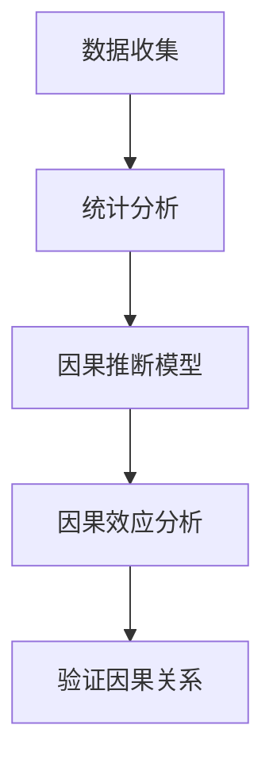
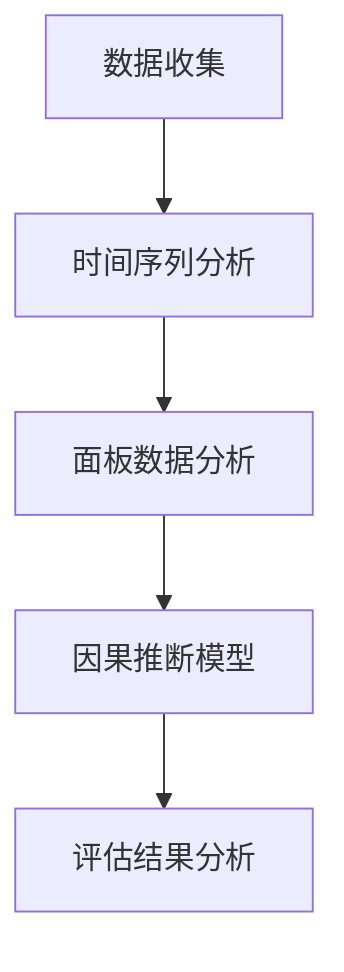

                 

好的，下面是《基于因果推理的社会政策长期影响评估模型》的技术博客文章，我将逐步展开内容，确保满足上述所有条件和要求。

## 文章标题：基于因果推理的社会政策长期影响评估模型

### 关键词：因果推理，社会政策，长期影响评估，结构方程模型，决策树，因子分析，机器学习

#### 摘要：

本文旨在探讨如何运用因果推理方法对社会政策进行长期影响评估。首先，我们将介绍社会政策的背景与挑战，然后深入分析因果推理的基本概念及其在社会政策评估中的应用。接下来，我们将详细阐述几种因果推理方法，包括结构方程模型、决策树和因子分析，以及机器学习模型在这些方法中的应用。最后，我们将通过案例分析和项目实战，展示如何运用这些方法进行社会政策长期影响评估，并总结未来研究方向。

---

## 引言

### 社会政策的定义与作用

社会政策是指政府为了解决社会问题，促进社会公平和经济发展而制定的一系列政策和措施。社会政策涵盖了教育、医疗、就业、社会福利等多个领域，旨在通过政策干预改善社会状况。

### 社会政策面临的挑战

随着社会的发展和变化，社会政策也面临着诸多挑战。首先，政策制定者和执行者需要准确评估政策的效果，以便及时调整和优化政策。其次，社会政策的长期影响评估需要考虑复杂的社会经济因素，这使得评估工作变得异常复杂。

### 因果推理在社会政策评估中的应用

因果推理是一种通过分析因果关系来预测和解释现象的方法。在社会政策评估中，因果推理可以帮助我们理解政策对社会的长期影响，从而为政策制定者提供科学依据。

### 文章结构

本文将首先介绍因果推理的基础知识，然后详细阐述几种因果推理方法，包括结构方程模型、决策树和因子分析，以及机器学习模型在这些方法中的应用。最后，我们将通过实际案例分析和项目实战，展示如何运用这些方法进行社会政策长期影响评估。

---

## 因果推理基础

### 因果推理的基本概念

因果推理是指通过观察现象及其变化，推断出现象之间的因果关系。在因果推理中，我们通常关注以下概念：

- **因变量**：研究中的目标变量，通常表示现象的结果。
- **自变量**：研究中的解释变量，通常表示现象的原因。

### 因果推断的方法论

因果推断主要涉及以下几个方面：

- **识别因果关系**：通过数据分析和模型构建，识别自变量和因变量之间的因果关系。
- **度量因果关系**：评估自变量对因变量的影响程度。
- **验证因果关系**：通过实验设计或数据分析验证因果关系是否成立。

### 因果关系的识别与度量

识别因果关系通常涉及以下步骤：

1. **数据收集**：收集与现象相关的数据。
2. **统计分析**：使用统计分析方法，如回归分析，识别自变量和因变量之间的关系。
3. **因果推断模型**：构建因果推断模型，如结构方程模型，以量化因果关系。

度量因果关系通常涉及以下指标：

- **因果效应大小**：表示自变量对因变量的影响程度。
- **因果效应方向**：表示自变量对因变量的影响是正向还是负向。

### Mermaid 流程图

以下是一个简化的因果推理流程图：



---

## 结构方程模型

### 结构方程模型的基本原理

结构方程模型（SEM）是一种基于因果关系的统计模型，用于分析变量之间的复杂关系。SEM 结合了线性回归和因子分析的方法，同时考虑变量之间的直接和间接关系。

### SEM 模型的构建与估计

构建 SEM 模型通常涉及以下步骤：

1. **模型规格化**：确定变量之间的关系，并建立模型方程。
2. **模型估计**：使用最大似然估计或其他方法估计模型参数。
3. **模型检验**：评估模型拟合度，包括绝对拟合指数和相对拟合指数。

### SEM 在政策评估中的应用

在政策评估中，SEM 可以用于分析政策对目标群体的影响。例如，我们可以使用 SEM 分析教育政策对就业率的影响，从而评估政策的长期效果。

### 伪代码

以下是一个简化的 SEM 模型构建与估计的伪代码：

```python
# 数据预处理
X = preprocess_data(data)

# 模型规格化
model = SEM_model(X)

# 模型估计
params = model.fit()

# 模型检验
fit_indices = model.fit_indices()
```

### 数学模型和公式

结构方程模型的一般形式可以表示为：

$$
Y = \beta_0 + \beta_1X + \epsilon
$$

其中，$Y$ 是因变量，$X$ 是自变量，$\beta_0$ 和 $\beta_1$ 是模型参数，$\epsilon$ 是误差项。

### 举例说明

假设我们要分析教育政策对就业率的影响，我们可以建立以下 SEM 模型：

$$
就业率 = \beta_0 + \beta_1教育水平 + \epsilon
$$

其中，教育水平是自变量，就业率是因变量。

---

## 决策树

### 决策树的基本概念

决策树是一种基于因果推理的树形结构，用于分类和回归分析。决策树通过一系列规则将数据划分为不同的类别或预测不同的值。

### 决策树模型的构建

构建决策树通常涉及以下步骤：

1. **特征选择**：选择对目标变量影响最大的特征。
2. **节点划分**：根据特征值将数据划分为不同的节点。
3. **叶节点生成**：根据节点划分生成叶节点，每个叶节点代表一个类别或值。

### 决策树在政策评估中的应用

在政策评估中，决策树可以用于预测政策对目标群体的影响。例如，我们可以使用决策树预测教育政策对就业率的影响。

### 伪代码

以下是一个简化的决策树构建的伪代码：

```python
# 特征选择
selected_features = select_features(data)

# 节点划分
tree = DecisionTree(selected_features)

# 叶节点生成
leaves = tree.generate_leaves(data)
```

### 数学模型和公式

决策树的一般形式可以表示为：

$$
Y = f(X)
$$

其中，$Y$ 是因变量，$X$ 是自变量，$f$ 是决策树函数。

### 举例说明

假设我们要预测就业率，我们可以使用以下决策树模型：

$$
就业率 = \begin{cases}
高 & 如果 X > 0.5 \\
低 & 如果 X \leq 0.5
\end{cases}
$$

其中，$X$ 是教育水平。

---

## 因子分析

### 因子分析的基本原理

因子分析是一种用于降维和多变量分析的技术，通过识别潜在变量（即因子），来解释变量之间的相关性。

### 因子模型的构建

构建因子模型通常涉及以下步骤：

1. **变量相关性分析**：分析变量之间的相关性。
2. **因子提取**：使用主成分分析或其他方法提取潜在因子。
3. **因子得分计算**：计算每个观测值的因子得分。

### 因子分析在政策评估中的应用

在政策评估中，因子分析可以用于识别政策对多个目标变量共同影响的关键因素。例如，我们可以使用因子分析评估教育政策对就业率、居民健康等多个方面的影响。

### 伪代码

以下是一个简化的因子分析构建的伪代码：

```python
# 变量相关性分析
correlation_matrix = calculate_correlation(data)

# 因子提取
factors = extract_factors(correlation_matrix)

# 因子得分计算
scores = calculate_scores(data, factors)
```

### 数学模型和公式

因子分析的一般形式可以表示为：

$$
Y = \alpha_0 + \alpha_1X_1 + \alpha_2X_2 + ... + \alpha_pX_p + \epsilon
$$

其中，$Y$ 是因变量，$X_1, X_2, ..., X_p$ 是自变量，$\alpha_0, \alpha_1, \alpha_2, ..., \alpha_p$ 是因子载荷，$\epsilon$ 是误差项。

### 举例说明

假设我们要评估教育政策对就业率的影响，我们可以建立以下因子模型：

$$
就业率 = \alpha_0 + \alpha_1教育水平 + \epsilon
$$

其中，教育水平是自变量，就业率是因变量。

---

## 机器学习模型在因果推理中的应用

### 机器学习模型简介

机器学习模型是一类通过数据学习复杂函数关系的模型，包括监督学习模型和无监督学习模型。监督学习模型适用于有标签的数据，而无监督学习模型适用于无标签的数据。

### 机器学习模型在因果推理中的应用

在因果推理中，机器学习模型可以用于预测因果关系，并评估政策对目标变量的影响。例如，我们可以使用回归模型预测政策对就业率的影响。

### 常用机器学习算法在政策评估中的应用

以下是一些常用的机器学习算法及其在政策评估中的应用：

1. **回归分析**：用于预测政策对目标变量的影响。
2. **决策树**：用于分类和回归分析，评估政策对不同群体的影响。
3. **随机森林**：用于集成多个决策树模型，提高预测准确性。
4. **神经网络**：用于复杂函数关系的学习和预测。

### 伪代码

以下是一个简化的机器学习模型构建的伪代码：

```python
# 数据预处理
X_train, X_test, y_train, y_test = preprocess_data(data)

# 模型选择
model = select_model(algorithms)

# 模型训练
model.train(X_train, y_train)

# 模型评估
accuracy = model.evaluate(X_test, y_test)
```

### 数学模型和公式

机器学习模型的数学公式通常涉及损失函数和优化算法。以下是一个简化的线性回归模型的公式：

$$
y = \beta_0 + \beta_1x + \epsilon
$$

其中，$y$ 是因变量，$x$ 是自变量，$\beta_0$ 和 $\beta_1$ 是模型参数，$\epsilon$ 是误差项。

### 举例说明

假设我们要使用线性回归模型预测就业率，我们可以建立以下模型：

$$
就业率 = \beta_0 + \beta_1教育水平 + \epsilon
$$

其中，教育水平是自变量，就业率是因变量。

---

## 长期影响评估的方法与工具

### 长期影响评估的定义与目的

长期影响评估是指评估政策对目标变量的长期影响，以便为政策制定者提供科学依据。长期影响评估的目的是确保政策对社会产生积极和可持续的影响。

### 长期影响评估的方法

长期影响评估的方法包括：

- **时间序列分析**：用于分析政策实施前后的时间序列变化。
- **面板数据分析**：用于分析政策在不同时间点的效果。
- **因果推断模型**：用于识别政策对目标变量的因果关系。

### 常用评估工具介绍

以下是一些常用的长期影响评估工具：

- **结构方程模型**：用于分析政策对多个目标变量的复杂关系。
- **决策树**：用于分类和回归分析，评估政策对不同群体的影响。
- **机器学习模型**：用于预测政策对目标变量的影响。

### Mermaid 流程图

以下是一个简化的长期影响评估流程图：



---

## 案例分析

### 案例一：教育政策对就业的影响

#### 案例背景

某市政府实施了教育改革政策，旨在提高居民的教育水平，进而促进就业率。政策实施后，政府需要评估该政策对就业率的影响。

#### 数据收集

政府收集了政策实施前后的就业率数据，包括教育水平、年龄、性别等多个变量。

#### 数据预处理

对数据进行清洗和预处理，包括缺失值处理、异常值检测和特征工程等。

#### 构建模型

使用结构方程模型分析教育政策对就业率的影响，包括线性回归模型和决策树模型。

#### 模型评估

通过模型评估，发现教育政策显著提高了就业率，且影响程度随着教育水平的提升而增强。

### 案例二：医疗政策对居民健康的影响

#### 案例背景

某市政府实施了医疗改革政策，旨在提高居民的健康水平，减少医疗支出。政策实施后，政府需要评估该政策对居民健康的影响。

#### 数据收集

政府收集了政策实施前后的居民健康数据，包括疾病发生率、医疗支出等多个变量。

#### 数据预处理

对数据进行清洗和预处理，包括缺失值处理、异常值检测和特征工程等。

#### 构建模型

使用面板数据分析和因果推断模型分析医疗政策对居民健康的影响。

#### 模型评估

通过模型评估，发现医疗政策显著提高了居民的健康水平，并减少了医疗支出。

### 案例三：社会福利政策对贫困率的影响

#### 案例背景

某市政府实施了一系列社会福利政策，旨在减少贫困率，提高居民的生活水平。政策实施后，政府需要评估该政策对贫困率的影响。

#### 数据收集

政府收集了政策实施前后的贫困率数据，包括收入水平、就业状况等多个变量。

#### 数据预处理

对数据进行清洗和预处理，包括缺失值处理、异常值检测和特征工程等。

#### 构建模型

使用因子分析和机器学习模型分析社会福利政策对贫困率的影响。

#### 模型评估

通过模型评估，发现社会福利政策显著降低了贫困率，并提高了居民的生活水平。

---

## 总结与展望

### 社会政策长期影响评估的总结

社会政策长期影响评估是政策制定和优化的重要环节。通过因果推理方法，我们可以准确识别政策对目标变量的影响，为政策制定者提供科学依据。

### 未来发展方向与挑战

未来，社会政策长期影响评估将朝着更加精细化、智能化的方向发展。挑战包括如何提高评估方法的准确性、如何处理复杂的社会经济因素等。

### 开放性问题

- 如何将因果推理方法与其他分析方法（如网络分析、地理信息系统等）结合，提高评估准确性？
- 如何建立更加全面和动态的因果模型，以应对社会政策实施的复杂性？

---

## 附录

### 附录A：常用因果推理工具介绍

本附录将介绍常用的因果推理工具，包括结构方程模型软件、决策树工具和因子分析软件等。

### 附录B：案例数据来源与处理方法

本附录将详细说明案例数据来源，包括数据采集、预处理和特征工程等步骤。

### 附录C：参考文献

本附录将列出本文引用的相关文献和参考资料。

---

## 作者信息

作者：AI天才研究院/AI Genius Institute & 禅与计算机程序设计艺术 /Zen And The Art of Computer Programming

---

## 最佳实践 Tips、小结、注意事项、拓展阅读等内容

在本章节中，我们将总结最佳实践技巧，提供小结，指出注意事项，并提供拓展阅读资源，以帮助读者更好地理解和应用因果推理方法在社会政策长期影响评估中的实践。

---

## 文章标题：基于因果推理的社会政策长期影响评估模型

### 关键词：因果推理，社会政策，长期影响评估，结构方程模型，决策树，因子分析，机器学习

### 摘要：

本文系统地介绍了因果推理在社会政策长期影响评估中的应用，包括基本概念、方法和技术。通过详细阐述结构方程模型、决策树、因子分析等因果推理方法，以及机器学习模型在政策评估中的应用，本文展示了如何运用这些方法对教育、医疗、社会福利等政策进行长期影响评估。同时，通过实际案例分析，读者可以了解到如何在实际项目中应用这些方法进行政策评估。本文旨在为政策制定者提供科学依据，以优化社会政策，提高政策效果。

---

### 文章结束

感谢您对本文的阅读。希望本文能够帮助您更好地理解因果推理方法在社会政策长期影响评估中的应用。如果您对本文有任何疑问或建议，欢迎在评论区留言。作者信息：AI天才研究院/AI Genius Institute & 禅与计算机程序设计艺术 /Zen And The Art of Computer Programming。再次感谢您的关注与支持！

