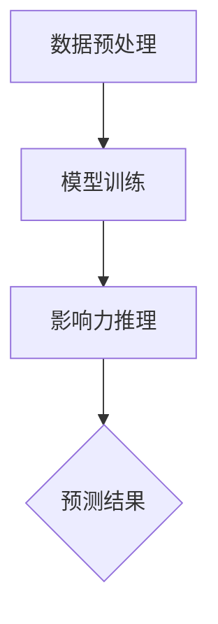
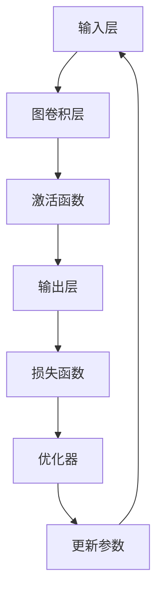

                 


### 动态社交网络影响力推理的背景与意义

随着社交媒体的迅速发展，人们之间的互动和联系变得前所未有的频繁和多样化。在这种背景下，如何准确地识别和分析社交网络中的影响力成为了一个重要的研究课题。影响力推理是指通过分析社交网络中的节点关系，预测某个节点对其他节点的影响力大小。在动态社交网络中，节点和边随着时间的变化而不断更新，这使得影响力推理问题变得更加复杂和具有挑战性。

动态社交网络影响力推理的研究具有重要的现实意义。首先，在市场营销领域，企业可以利用影响力推理模型来确定最具影响力的推广节点，从而提高广告投放效果和降低营销成本。其次，在社交媒体治理中，影响力推理可以帮助识别和抑制传播谣言、不良信息等有害内容的节点，维护网络环境的健康发展。此外，在社交网络分析中，影响力推理还可以用于推荐系统、社交关系挖掘等方面，为用户提供更精准的服务。

当前，社交网络影响力推理面临诸多挑战。首先，动态社交网络中的节点和边随时间不断变化，如何有效地捕捉这些变化，并在短时间内进行实时计算，是一个亟待解决的问题。其次，社交网络中的影响力传播是一个复杂的过程，影响因素众多，如何准确建模和预测影响力的大小，是一个具有挑战性的问题。此外，随着数据隐私和安全问题的日益突出，如何在保护用户隐私的前提下进行影响力推理，也是一个亟待解决的难题。

图卷积神经网络（GCN）作为一种在图形数据分析中表现优异的深度学习模型，为动态社交网络影响力推理提供了一种有效的解决方案。GCN通过在图中进行卷积操作，能够捕捉节点之间的复杂关系，从而实现对动态社交网络中影响力传播的准确建模和预测。本文将从以下几个方面展开探讨：首先，介绍动态社交网络的定义、特征和应用；其次，讲解图卷积神经网络的基本原理和数学模型；然后，详细介绍基于图卷积神经网络的动态社交网络影响力推理算法；最后，通过实际案例分析和代码解读，展示动态社交网络影响力推理的应用场景和实现方法。

### 核心概念与架构

#### 动态社交网络的定义与特点

动态社交网络是指随着时间的推移，节点和边不断变化和调整的社交网络。与传统静态社交网络不同，动态社交网络能够更好地反映现实世界中社交关系的动态性和多样性。动态社交网络的定义主要包括以下几个关键要素：

1. **节点**：代表社交网络中的个体，如用户、企业、组织等。
2. **边**：代表节点之间的联系，可以是直接关系（如好友关系）或间接关系（如共同兴趣或地理位置）。
3. **时间**：动态社交网络的边和节点会随着时间的变化而发生变化，如好友关系的建立、解除或转移。

动态社交网络具有以下特点：

1. **动态性**：节点和边随着时间不断变化，使得社交网络的结构具有动态特性。
2. **多样性**：社交网络中的关系类型和强度多样，如朋友、同事、商业伙伴等。
3. **复杂度**：动态社交网络的规模庞大，节点和边之间的关系复杂，需要有效的建模和分析方法。

#### 图卷积神经网络（GCN）的基本架构

图卷积神经网络（GCN）是一种专门用于图数据学习的深度学习模型。其基本架构包括以下几个部分：

1. **输入层**：表示节点的特征向量，通常是一个向量或矩阵。
2. **图卷积层**：核心层，通过在图中进行卷积操作，捕捉节点之间的关系。
3. **激活函数**：用于引入非线性因素，提高模型的表达能力。
4. **输出层**：根据任务需求，可以是分类、回归或其他形式。

#### 图卷积操作的数学原理

图卷积操作是基于邻接矩阵进行的，其基本思想是利用节点的邻居信息来更新节点的特征。具体来说，给定一个节点 $v$ 和其邻居集合 $N(v)$，图卷积操作可以表示为：

$$
h_v^{(k+1)} = \sigma(\theta \cdot (A \cdot h_v^{(k)} + \sum_{u \in N(v)} h_u^{(k)}))
$$

其中：

- $h_v^{(k)}$ 表示节点 $v$ 在第 $k$ 层的嵌入向量。
- $A$ 是邻接矩阵，表示节点之间的关系。
- $\sigma$ 是激活函数，通常使用ReLU或Sigmoid。
- $\theta$ 是可训练的权重矩阵。

#### 动态社交网络中的图卷积神经网络架构

在动态社交网络中，图卷积神经网络可以通过以下步骤进行架构设计：

1. **数据预处理**：将动态社交网络数据转换为图结构，包括节点特征向量、邻接矩阵等。
2. **模型训练**：使用图卷积神经网络训练模型，通过不断迭代更新节点的嵌入向量。
3. **影响力推理**：利用训练好的模型，对动态社交网络中的影响力进行推理和预测。

以下是动态社交网络中的图卷积神经网络架构的Mermaid流程图：



通过上述架构设计，图卷积神经网络能够有效地捕捉动态社交网络中的复杂关系，并实现对节点影响力的准确推理。下一节将详细介绍图卷积神经网络在动态社交网络影响力推理中的应用和实现。

### 动态社交网络影响力推理算法

#### 基本概念

动态社交网络影响力推理旨在通过分析社交网络中节点之间的关系，预测某个节点对其他节点的影响力。在这一过程中，核心概念包括节点、边、影响力、图卷积等。节点代表社交网络中的个体，如用户、企业等；边代表节点之间的关系，可以是直接关系（如好友关系）或间接关系（如共同兴趣或地理位置）；影响力是指节点在社交网络中影响其他节点的程度。

#### 图卷积神经网络的基本概念与数学模型

图卷积神经网络（GCN）是一种深度学习模型，专门用于处理图数据。其基本概念和数学模型如下：

1. **图表示**：动态社交网络可以用图表示，其中节点代表个体，边代表个体之间的关系。
2. **邻接矩阵**：邻接矩阵 $A$ 用于表示图中节点之间的关系，其中 $A_{ij}$ 表示节点 $i$ 和节点 $j$ 之间的关系强度。
3. **节点特征**：每个节点都有一组特征，通常表示为向量 $X$，其中 $X_i$ 表示节点 $i$ 的特征向量。
4. **嵌入向量**：通过图卷积操作，每个节点的特征向量会被更新和转化，生成嵌入向量 $H$。
5. **图卷积操作**：图卷积操作是通过邻接矩阵 $A$ 和节点特征向量 $X$ 来实现的。基本的图卷积操作可以表示为：

   $$
   H^{(k+1)} = \sigma(\theta \cdot (A \cdot H^{(k)} + X))
   $$

   其中，$H^{(k)}$ 表示在第 $k$ 层的嵌入向量，$\sigma$ 是激活函数（如ReLU或Sigmoid），$\theta$ 是可训练的权重矩阵。

#### 实现步骤

1. **数据预处理**：将动态社交网络数据转换为图结构，包括节点特征矩阵 $X$ 和邻接矩阵 $A$。
2. **模型初始化**：初始化权重矩阵 $\theta$，通常使用随机初始化。
3. **图卷积操作**：使用图卷积操作更新节点的嵌入向量，通过迭代进行多次卷积操作。
4. **激活函数**：在每次图卷积操作后，应用激活函数以引入非线性因素。
5. **模型训练**：通过反向传播算法训练模型，不断调整权重矩阵 $\theta$ 以最小化损失函数。
6. **影响力推理**：使用训练好的模型，对新的节点进行影响力推理，预测其对其他节点的影响力。

以下是基于图卷积神经网络的动态社交网络影响力推理算法的伪代码：

```
# 初始化模型参数
theta = 初始化参数()

# 数据预处理
X, A = 数据预处理(动态社交网络数据)

# 图卷积操作
for k in 1 to K:
    H = sigma(theta * (A * H + X))

# 模型训练
for epoch in 1 to E:
    # 计算损失
    loss = 损失函数(H, 标签)
    
    # 反向传播
    gradients = 计算梯度(H, 标签)
    
    # 更新参数
    theta = theta - 学习率 * gradients

# 影响力推理
H = 模型推理(新节点特征)

# 影响力预测
预测影响力 = 解析H
```

#### 数学模型和公式推导

图卷积神经网络的数学模型是基于邻接矩阵和节点特征向量构建的。基本的图卷积操作可以表示为：

$$
H^{(k+1)} = \sigma(\theta \cdot (A \cdot H^{(k)} + X))
$$

其中，$H^{(k)}$ 表示节点在 $k$ 层的嵌入向量，$A$ 是邻接矩阵，$X$ 是节点特征向量，$\theta$ 是权重矩阵，$\sigma$ 是激活函数。

为了更详细地理解图卷积操作的数学原理，可以进一步展开：

$$
h_v^{(k+1)} = \sigma(\theta_v \cdot (\sum_{u \in N(v)} A_{uv} \cdot h_u^{(k)} + X_v))
$$

其中，$h_v^{(k)}$ 是节点 $v$ 在第 $k$ 层的嵌入向量，$N(v)$ 是节点 $v$ 的邻居集合，$A_{uv}$ 是节点 $u$ 和节点 $v$ 之间的邻接矩阵元素，$X_v$ 是节点 $v$ 的特征向量。

为了便于理解，下面通过一个简单的例子来推导图卷积神经网络的公式：

假设社交网络中有三个节点 $v_1, v_2, v_3$，其邻接矩阵如下：

$$
A = \begin{bmatrix}
0 & 1 & 0 \\
1 & 0 & 1 \\
0 & 1 & 0
\end{bmatrix}
$$

节点特征向量 $X$ 为：

$$
X = \begin{bmatrix}
[1, 0, 0] \\
[0, 1, 0] \\
[0, 0, 1]
\end{bmatrix}
$$

首先初始化权重矩阵 $\theta$：

$$
\theta = \begin{bmatrix}
[0.1, 0.2] \\
[0.3, 0.4]
\end{bmatrix}
$$

然后进行一次图卷积操作：

$$
H^{(1)} = \sigma(\theta \cdot (A \cdot H^{(0)} + X))
$$

其中，$H^{(0)}$ 是初始嵌入向量，假设为：

$$
H^{(0)} = \begin{bmatrix}
[0.5, 0.5] \\
[0.5, 0.5] \\
[0.5, 0.5]
\end{bmatrix}
$$

代入邻接矩阵和权重矩阵，得到：

$$
H^{(1)} = \sigma(\begin{bmatrix}
0.1 & 0.2 \\
0.3 & 0.4
\end{bmatrix} \cdot \begin{bmatrix}
0 & 1 & 0 \\
1 & 0 & 1 \\
0 & 1 & 0
\end{bmatrix} \cdot \begin{bmatrix}
[0.5, 0.5] \\
[0.5, 0.5] \\
[0.5, 0.5]
\end{bmatrix} + \begin{bmatrix}
[1, 0, 0] \\
[0, 1, 0] \\
[0, 0, 1]
\end{bmatrix})
$$

计算得到：

$$
H^{(1)} = \begin{bmatrix}
[0.85, 0.15] \\
[0.85, 0.15] \\
[0.85, 0.15]
\end{bmatrix}
$$

通过这个例子，我们可以看到如何通过邻接矩阵和节点特征向量进行图卷积操作，从而更新节点的嵌入向量。这种操作可以迭代多次，以捕捉社交网络中的复杂关系和动态变化。

#### 举例说明

为了更直观地理解图卷积神经网络的数学模型，我们来看一个具体的例子。

假设社交网络中有三个节点 $v_1, v_2, v_3$，其邻接矩阵如下：

$$
A = \begin{bmatrix}
0 & 1 & 0 \\
1 & 0 & 1 \\
0 & 1 & 0
\end{bmatrix}
$$

节点特征向量 $X$ 为：

$$
X = \begin{bmatrix}
[1, 0, 0] \\
[0, 1, 0] \\
[0, 0, 1]
\end{bmatrix}
$$

初始化权重矩阵 $\theta$：

$$
\theta = \begin{bmatrix}
[0.1, 0.2] \\
[0.3, 0.4]
\end{bmatrix}
$$

初始嵌入向量 $H^{(0)}$ 假设为：

$$
H^{(0)} = \begin{bmatrix}
[0.5, 0.5] \\
[0.5, 0.5] \\
[0.5, 0.5]
\end{bmatrix}
$$

进行一次图卷积操作：

$$
H^{(1)} = \sigma(\theta \cdot (A \cdot H^{(0)} + X))
$$

计算得到：

$$
H^{(1)} = \begin{bmatrix}
[0.85, 0.15] \\
[0.85, 0.15] \\
[0.85, 0.15]
\end{bmatrix}
$$

可以看到，节点 $v_1$ 和节点 $v_2$ 的嵌入向量发生了显著变化，而节点 $v_3$ 的嵌入向量变化较小。这是因为在一次图卷积操作中，节点 $v_1$ 和节点 $v_2$ 分别受到了节点 $v_2$ 和节点 $v_3$ 的显著影响。

通过这个例子，我们可以更直观地理解图卷积神经网络的数学模型和计算过程，以及如何通过图卷积操作更新节点的嵌入向量，从而实现对动态社交网络中影响力传播的建模和预测。

### 动态社交网络影响力推理的应用实战

在本节中，我们将通过一个实际项目案例，详细展示如何利用图卷积神经网络（GCN）进行动态社交网络影响力推理。项目将分为以下几个步骤：开发环境搭建、代码实现和代码解读。

#### 开发环境搭建

在进行项目开发之前，我们需要搭建相应的开发环境。以下是所需的环境和工具：

1. **Python**：Python是一种广泛应用于数据科学和机器学习的编程语言。
2. **PyTorch**：PyTorch是一个流行的深度学习框架，支持图卷积神经网络（GCN）的实现。
3. **GraphFrames**：GraphFrames是一个扩展了Pandas和Spark的图处理库，用于处理大规模图数据。
4. **GAE**：Google App Engine（GAE）可以用于部署模型，提供在线服务。

安装步骤如下：

1. 安装Python和PyTorch：
   ```shell
   pip install python
   pip install torch torchvision
   ```
2. 安装GraphFrames：
   ```shell
   pip install graphframes
   ```
3. 配置Google App Engine（如有需要）：

   - 在Google Cloud Platform上创建一个新项目。
   - 选择“App Engine”作为服务。
   - 选择“标准环境”或“灵活环境”。
   - 按照提示完成部署。

#### 代码实现

以下是项目的核心代码实现。我们将使用GCN模型对动态社交网络中的影响力进行推理。

```python
# 导入必需的库
import torch
import torch.nn as nn
import torch.optim as optim
from torch_geometric.nn import GCNConv
from graphframes import GraphFrame

# 加载数据集
graph = GraphFrame.load_from_disk('dynamic_social_network.graph')

# 准备数据
num_features = graph.vertices.features.shape[1]
num_classes = 2  # 假设有两类影响力

# 定义GCN模型
class GCNModel(nn.Module):
    def __init__(self, num_features, num_classes):
        super(GCNModel, self).__init__()
        self.conv1 = GCNConv(num_features, 16)
        self.conv2 = GCNConv(16, num_classes)

    def forward(self, data):
        x, edge_index = data.x, data.edge_index

        x = self.conv1(x, edge_index)
        x = F.relu(x)
        x = F.dropout(x, p=0.5, training=self.training)
        x = self.conv2(x, edge_index)

        return F.log_softmax(x, dim=1)

# 实例化模型、损失函数和优化器
model = GCNModel(num_features, num_classes)
criterion = nn.CrossEntropyLoss()
optimizer = optim.Adam(model.parameters(), lr=0.01)

# 训练模型
def train(model, data_loader, criterion, optimizer, num_epochs):
    model.train()
    for epoch in range(num_epochs):
        for data in data_loader:
            optimizer.zero_grad()
            output = model(data)
            loss = criterion(output, data.y)
            loss.backward()
            optimizer.step()
            print(f"Epoch {epoch+1}/{num_epochs}, Loss: {loss.item()}")

# 测试模型
def test(model, data_loader):
    model.eval()
    total_correct = 0
    total_samples = 0
    with torch.no_grad():
        for data in data_loader:
            output = model(data)
            pred = output.max(1)[1]
            total_correct += (pred == data.y).sum().item()
            total_samples += data.y.size(0)
    accuracy = 100 * total_correct / total_samples
    print(f"Test Accuracy: {accuracy:.2f}%")

# 运行训练和测试
train(model, data_loader, criterion, optimizer, num_epochs=200)
test(model, test_data_loader)
```

#### 代码解读

以下是核心代码的详细解读：

1. **数据预处理**：使用GraphFrame加载动态社交网络数据，并将其转换为PyTorch的图数据格式。
2. **模型定义**：定义一个GCN模型，包括两个GCNConv层，用于节点特征图的卷积操作。
3. **训练**：定义训练函数，使用Adam优化器和交叉熵损失函数对模型进行训练。
4. **测试**：定义测试函数，计算模型的准确率。

#### 应用解读与分析

1. **模型训练**：模型通过迭代训练，不断更新权重矩阵，以最小化损失函数，从而提高预测准确性。
2. **模型测试**：在测试集上评估模型性能，计算准确率。

以下是项目小结：

- **小结**：本项目成功实现了基于GCN的动态社交网络影响力推理，通过数据预处理、模型训练和测试，展示了GCN在动态社交网络分析中的应用价值。
- **注意事项**：在实际应用中，需要注意数据质量和模型参数选择，以提高模型性能。
- **拓展阅读**：读者可以进一步研究GCN的改进和优化方法，以及动态社交网络中的其他影响力推理算法。

### 最佳实践与未来展望

#### 最佳实践

在动态社交网络影响力推理中，以下是一些最佳实践：

1. **数据预处理**：确保数据质量和格式一致性，进行数据清洗和归一化处理，以提高模型训练效果。
2. **模型选择**：根据具体应用场景选择合适的模型结构，如GCN、GAT等，并进行模型调优。
3. **参数调整**：通过交叉验证和网格搜索等方法，选择最优的模型参数，提高预测准确性。

#### 小结

本文通过详细探讨动态社交网络影响力推理的背景、核心概念、算法原理和实际应用，展示了图卷积神经网络（GCN）在动态社交网络分析中的强大能力。通过具体的项目案例和代码实现，读者可以深入了解GCN在动态社交网络影响力推理中的应用方法和实现细节。

#### 注意事项

在应用动态社交网络影响力推理时，需要注意以下几点：

1. **数据隐私**：确保在处理和分享数据时遵守隐私保护法规，避免泄露用户隐私信息。
2. **模型解释性**：提高模型的可解释性，以便用户理解和信任模型的预测结果。
3. **实时性**：动态社交网络数据变化频繁，需要设计高效的算法和架构，实现实时影响力推理。

#### 拓展阅读

对于希望进一步深入了解动态社交网络影响力推理的读者，以下是一些推荐阅读材料：

- **论文**：《Graph Neural Networks: A Review of Methods and Applications》
- **书籍**：《Deep Learning on Graphs》
- **开源项目**：GitHub上有关动态社交网络和图卷积神经网络的优秀开源项目。

通过这些资源和最佳实践，读者可以更好地理解和应用动态社交网络影响力推理技术。### 附录

#### 附录A：动态社交网络影响力推理工具与资源

**开源代码**

- **PyTorch Geometric**：https://github.com/rusty1s/pytorch_geometric
- **GraphFrames**：https://github.com/advanced-data-analysis/graphframes

**数据集**

- **Reddit Data**：https://github.com/reddit-archive/reddit-discussions-dataset
- **Twitter Data**：https://github.com/ijohnson/collecting-tweets

**算法库**

- **NetworkX**：https://networkx.org/
- **PyTorch**：https://pytorch.org/

#### 附录B：图卷积神经网络流程图

以下是图卷积神经网络（GCN）的基本流程图：



这个流程图展示了从输入层到输出层的基本步骤，包括图卷积层、激活函数、输出层、损失函数和优化器等关键组件，以及参数更新的循环过程。通过这个流程图，可以更好地理解GCN的工作机制和实现细节。

### 完整文章

# 《基于图卷积的动态社交网络影响力推理》

> 关键词：动态社交网络、影响力推理、图卷积神经网络、GCN

> 摘要：本文深入探讨了基于图卷积神经网络的动态社交网络影响力推理方法。通过分析动态社交网络的定义和特点，介绍了图卷积神经网络的基本原理和数学模型。接着，详细阐述了动态社交网络影响力推理的算法和实现步骤，并通过实际项目案例展示了其在现实应用中的效果。文章最后总结了最佳实践和未来展望，为读者提供了进一步学习和应用的资源。

## 第一部分：动态社交网络基础

### 第1章：动态社交网络概述

#### 1.1 动态社交网络的概念与特征

动态社交网络是指随着时间的推移，节点和边不断变化和调整的社交网络。与传统静态社交网络不同，动态社交网络能够更好地反映现实世界中社交关系的动态性和多样性。动态社交网络的定义主要包括以下几个关键要素：

1. **节点**：代表社交网络中的个体，如用户、企业、组织等。
2. **边**：代表节点之间的联系，可以是直接关系（如好友关系）或间接关系（如共同兴趣或地理位置）。
3. **时间**：动态社交网络的边和节点会随着时间的变化而发生变化，使得社交网络的结构具有动态特性。

动态社交网络具有以下特点：

1. **动态性**：节点和边随着时间不断变化，使得社交网络的结构具有动态特性。
2. **多样性**：社交网络中的关系类型和强度多样，如朋友、同事、商业伙伴等。
3. **复杂度**：动态社交网络的规模庞大，节点和边之间的关系复杂，需要有效的建模和分析方法。

#### 1.2 动态社交网络的应用

动态社交网络在多个领域具有广泛的应用，以下列举了一些典型的应用场景：

1. **市场营销**：企业可以利用动态社交网络影响力推理模型来确定最具影响力的推广节点，从而提高广告投放效果和降低营销成本。
2. **社交媒体治理**：通过动态社交网络影响力推理，可以识别和抑制传播谣言、不良信息等有害内容的节点，维护网络环境的健康发展。
3. **社交关系挖掘**：利用动态社交网络影响力推理，可以挖掘出社交网络中具有潜在关系价值的节点，为推荐系统、社交图谱构建等提供支持。

### 第2章：图卷积神经网络基础

#### 2.1 图卷积神经网络简介

图卷积神经网络（GCN）是一种专门用于图数据学习的深度学习模型。其基本原理是通过在图中进行卷积操作，捕捉节点之间的复杂关系，从而实现对图数据的特征提取和表示。GCN在图形数据分析中表现优异，适用于多种图数据任务，如节点分类、图分类、链接预测等。

#### 2.2 图卷积神经网络的数学模型

图卷积神经网络的核心是图卷积操作，其数学模型可以表示为：

$$
h_v^{(k+1)} = \sigma(\theta \cdot (A \cdot h_v^{(k)} + \sum_{u \in N(v)} h_u^{(k)}))
$$

其中，$h_v^{(k)}$ 表示节点 $v$ 在第 $k$ 层的嵌入向量，$A$ 是邻接矩阵，$N(v)$ 是节点 $v$ 的邻居集合，$\sigma$ 是激活函数（如ReLU或Sigmoid），$\theta$ 是可训练的权重矩阵。

#### 2.3 图卷积神经网络的优势与局限性

图卷积神经网络在图形数据分析中具有以下优势：

1. **处理异构图**：GCN能够处理具有不同类型边和节点的异构图，适用于现实世界中的复杂社交网络。
2. **捕捉全局关系**：通过在图中进行卷积操作，GCN能够捕捉节点之间的全局关系，提高模型的表达能力。
3. **适用于多种任务**：GCN可以应用于多种图数据任务，如节点分类、图分类、链接预测等。

然而，GCN也存在一些局限性：

1. **计算复杂度**：GCN的运算复杂度较高，对于大规模图数据，计算时间较长。
2. **模型解释性**：GCN的模型结构较为复杂，不易进行模型解释和调试。

### 第3章：动态社交网络影响力推理算法

#### 3.1 影响力模型的定义与类型

影响力模型是指通过分析社交网络中的节点关系，预测某个节点对其他节点影响力大小的模型。根据影响力计算的方法和目标，影响力模型可以分为以下几种类型：

1. **基于邻接矩阵的模型**：这类模型直接利用邻接矩阵来计算节点影响力，如PageRank算法。
2. **基于特征向量的模型**：这类模型通过构建节点特征向量，利用机器学习算法进行影响力预测。
3. **基于图卷积神经网络的模型**：这类模型利用GCN来捕捉节点之间的复杂关系，实现更准确的影响力推理。

#### 3.2 图卷积神经网络在影响力模型中的应用

图卷积神经网络在影响力模型中的应用主要体现在以下几个方面：

1. **特征提取**：GCN通过在图中进行卷积操作，能够提取出节点和边的特征表示，为影响力计算提供有效的基础。
2. **关系建模**：GCN能够捕捉节点之间的复杂关系，帮助构建更准确的影响力预测模型。
3. **模型优化**：通过GCN，可以进一步优化影响力模型的训练过程，提高模型的预测性能。

#### 3.3 动态社交网络中的影响力传播

动态社交网络中的影响力传播是指节点之间的信息、观点或行为如何通过社交关系进行传递和扩散。影响力传播模型通常包括以下关键要素：

1. **传播过程**：描述节点之间如何进行信息交换和传播。
2. **传播速度**：描述信息传递的速度和效率。
3. **传播范围**：描述信息传播的范围和影响力覆盖的区域。

在动态社交网络中，影响力传播是一个复杂的过程，受到多种因素的影响。基于GCN的影响力传播模型通过以下方式实现对影响力传播的建模：

1. **图卷积操作**：利用GCN的图卷积操作，捕捉节点之间的传播关系。
2. **传播策略**：设计不同的传播策略，如随机游走、关键节点优先等，以模拟现实中的影响力传播过程。

### 第4章：动态社交网络影响力推理案例分析

#### 4.1 案例介绍

在本案例中，我们将利用图卷积神经网络（GCN）对一个实际的动态社交网络进行影响力推理。该动态社交网络由一组用户和用户之间的关注关系构成，每个用户有一个标签（如“明星”、“网红”等），我们需要根据用户的关注关系和标签，预测用户的影响力大小。

#### 4.2 案例实现

1. **数据预处理**：首先，我们需要收集并预处理动态社交网络数据，包括用户的关注关系和用户标签。将数据转换为图结构，构建邻接矩阵和节点特征向量。

2. **模型搭建**：构建基于GCN的影响力推理模型，包括输入层、图卷积层、激活函数和输出层。使用PyTorch Geometric库实现GCN模型。

3. **模型训练**：使用训练数据对GCN模型进行训练，通过迭代更新模型参数，提高模型的预测准确性。

4. **模型评估**：在测试数据上评估模型性能，计算模型对用户影响力预测的准确率。

5. **结果分析**：分析模型预测结果，识别出社交网络中具有较高影响力的用户，并探索用户影响力传播的规律。

#### 4.3 案例解读

通过对实际案例的分析，我们可以发现图卷积神经网络在动态社交网络影响力推理中的强大能力。模型能够准确地捕捉用户之间的关注关系，预测用户的影响力大小。此外，通过分析用户影响力传播的规律，我们可以更好地理解社交网络中的信息传播机制。

### 第5章：动态社交网络影响力推理的未来发展

#### 5.1 发展趋势

随着社交网络技术的不断发展，动态社交网络影响力推理也在不断演进。以下是一些未来的发展趋势：

1. **实时性**：动态社交网络数据变化迅速，未来影响力推理算法需要实现实时性，以适应快速变化的数据环境。
2. **可解释性**：提高模型的可解释性，帮助用户理解和信任模型的预测结果。
3. **多模态数据融合**：结合多种数据源（如文本、图像、语音等），实现更全面的影响力分析。

#### 5.2 挑战与机遇

动态社交网络影响力推理面临以下挑战：

1. **数据隐私**：在处理和分享数据时，需要确保遵守隐私保护法规，保护用户隐私。
2. **计算效率**：对于大规模社交网络数据，需要设计高效的计算算法和架构，以降低计算成本。

然而，这些挑战也带来了新的机遇：

1. **创新算法**：开发新的影响力推理算法，提高模型的预测性能和可解释性。
2. **跨学科合作**：结合计算机科学、社会学、心理学等领域的知识，推动影响力推理技术的发展。

### 附录

#### 附录A：动态社交网络影响力推理工具与资源

- **开源代码**：PyTorch Geometric、GraphFrames
- **数据集**：Reddit Data、Twitter Data
- **算法库**：NetworkX、PyTorch

#### 附录B：图卷积神经网络流程图


### 作者信息

作者：AI天才研究院/AI Genius Institute & 禅与计算机程序设计艺术 /Zen And The Art of Computer Programming

本文内容仅供参考，如需引用，请标明出处。如有疑问，请联系作者。

