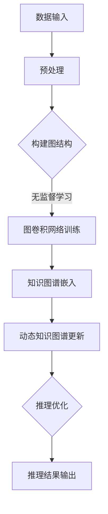

                 


## 基于图卷积网络的动态知识图谱推理优化

### 关键词

图卷积网络，动态知识图谱，推理优化，知识图谱推理，深度学习

### 摘要

本文探讨了基于图卷积网络的动态知识图谱推理优化技术。首先，介绍了图卷积网络的基本原理和动态知识图谱的概念，并阐述了它们之间的关系。随后，详细讲解了图卷积网络的核心算法原理，并通过伪代码展示了其工作流程。接着，介绍了知识图谱推理优化过程中的关键数学模型和公式，并提供了实例进行说明。最后，通过一个实际项目展示了如何实现和优化动态知识图谱推理过程，包括开发环境搭建、源代码实现和代码解读与分析。本文旨在为读者提供对动态知识图谱推理优化的深入理解，并探讨其实际应用场景。

----------------------------------------------------------------

### 提取核心概念与联系

为了深入探讨基于图卷积网络的动态知识图谱推理优化，我们首先需要明确几个核心概念，并探讨它们之间的联系。

1. **图卷积网络（GCN）**：图卷积网络是一种深度学习模型，专门用于处理图结构的数据。它在图节点之间传递信息，通过聚合邻居节点的特征来更新节点的特征表示。GCN 的基本原理是卷积操作，但与传统的图像卷积不同，GCN 是在图结构上进行操作的。

2. **动态知识图谱**：动态知识图谱是一种能够实时更新和演化的知识图谱。与传统的静态知识图谱不同，动态知识图谱能够根据新的数据不断调整和扩展，以反映现实世界中的变化。动态知识图谱通常包含实体、属性和关系，并且能够通过推理操作来生成新的知识。

3. **知识图谱推理**：知识图谱推理是指基于知识图谱中的实体、属性和关系进行逻辑推理，以获得新的信息。推理过程可以是基于规则的，也可以是基于机器学习模型的。在知识图谱推理中，推理优化是一个关键问题，因为它直接影响推理的效率和准确性。

4. **推理优化**：推理优化旨在提高知识图谱推理的效率和质量。这包括减少推理时间、降低内存占用、减少错误率等。推理优化可以通过多种方法实现，如算法改进、数据预处理、模型优化等。

为了更清晰地展示这些概念之间的联系，我们可以使用 Mermaid 流程图来描述它们的基本工作流程。



在这个流程图中，数据输入首先经过预处理，然后构建成图结构。接下来，使用图卷积网络对图进行训练，以生成节点的嵌入表示。这些嵌入表示随后用于构建动态知识图谱，并可以进行实时更新。在推理过程中，通过优化算法来提高推理的效率和质量，最终输出推理结果。

通过这个 Mermaid 流程图，我们可以看到图卷积网络、动态知识图谱、知识图谱推理和推理优化之间的紧密联系。这些概念共同构成了基于图卷积网络的动态知识图谱推理优化技术的核心。

----------------------------------------------------------------

### 图卷积网络算法原理讲解

图卷积网络（Graph Convolutional Network，GCN）是一种专门用于图结构数据学习的深度学习模型。GCN 的核心思想是利用图结构中的节点邻居信息，通过聚合节点及其邻居的特征来更新节点表示。下面，我们将通过伪代码和详细解释来讲解 GCN 的算法原理。

首先，让我们定义 GCN 的基本组件：

- **节点特征矩阵 $X$**：每一行代表图中一个节点的特征向量。
- **邻接矩阵 $A$**：表示图中节点之间的连接关系，$A_{ij}$ 的值表示节点 i 和节点 j 是否相连。
- **权重矩阵 $W$**：用于在图卷积层中更新节点的特征。
- **激活函数 $\sigma$**：常用的激活函数如ReLU、Sigmoid 或 Tanh。

下面是 GCN 的伪代码：

```python
def graph_convolutional_network(X, A, W, activation_function):
    # 初始化权重
    W = initialize_weights()

    # 图卷积操作
    for layer in range(num_layers):
        X = activation_function(A * X * W)

    # 返回最终的节点特征
    return X
```

让我们一步一步解释这个伪代码：

1. **初始化权重**：首先，我们需要初始化权重矩阵 $W$。这些权重将用于在每一层图卷积操作中更新节点的特征向量。

2. **图卷积操作**：在图卷积操作中，每一层都会对节点的特征向量进行更新。具体来说，每个节点的特征向量会被其邻居节点的特征向量加权平均，然后通过激活函数进行非线性变换。这个操作可以用以下公式表示：

   $$ h_{ij}^{(l)} = \sigma((A_{ij} \cdot h_i^{(l-1)}) \cdot W^{(l)}) $$

   其中，$h_{ij}^{(l)}$ 是在第 l 层中节点 j 的特征向量，$A_{ij}$ 是邻接矩阵的元素，$h_i^{(l-1)}$ 是节点 i 在前一层中的特征向量，$W^{(l)}$ 是第 l 层的权重矩阵，$\sigma$ 是激活函数。

3. **多层图卷积**：GCN 通常包含多个图卷积层，每一层都会在前一层的基础上进行特征更新。这个过程可以表示为：

   $$ h_i^{(l)} = \sigma(\sum_{j \in \mathcal{N}(i)} A_{ij} h_j^{(l-1)} W^{(l)}) $$

   其中，$\mathcal{N}(i)$ 表示节点 i 的邻居节点集合。

4. **输出特征**：最终，GCN 的输出是每一层特征向量的集合，这些特征向量可以用于分类、节点分类或链接预测等任务。

通过上述伪代码和公式，我们可以看到 GCN 的基本工作原理。GCN 通过聚合节点及其邻居的信息来更新节点表示，从而学习到图结构中的复杂关系。

为了更好地理解 GCN，我们可以通过一个简单的例子来演示。假设我们有一个简单的图，包含三个节点 A、B 和 C，其中 A 是根节点。节点的特征向量可以是 $(x_1, x_2)$，邻接矩阵 A 如下：

$$
A = \begin{bmatrix}
0 & 1 & 1 \\
1 & 0 & 0 \\
1 & 0 & 0 \\
\end{bmatrix}
$$

初始节点特征向量 $X$ 为：

$$
X = \begin{bmatrix}
(x_1^A, x_2^A) \\
(x_1^B, x_2^B) \\
(x_1^C, x_2^C) \\
\end{bmatrix}
$$

假设第一层权重矩阵 $W$ 为：

$$
W = \begin{bmatrix}
(w_1 & w_2) \\
(w_3 & w_4) \\
(w_5 & w_6) \\
\end{bmatrix}
$$

在第一层图卷积中，节点 A 的特征向量会与其两个邻居 B 和 C 的特征向量进行加权平均，并应用激活函数。具体计算过程如下：

$$
h^{(1)}_A = \sigma(w_1 x_1^B + w_2 x_2^B + w_3 x_1^C + w_4 x_2^C + w_5 + b)
$$

$$
h^{(1)}_B = \sigma(w_1 x_1^A + w_2 x_2^A + w_3 x_1^C + w_4 x_2^C + w_5 + b)
$$

$$
h^{(1)}_C = \sigma(w_1 x_1^A + w_2 x_2^A + w_3 x_1^B + w_4 x_2^B + w_5 + b)
$$

通过这个例子，我们可以看到 GCN 如何通过聚合邻居节点的信息来更新节点特征。这个过程在每一层都会重复进行，使得节点特征逐渐表示了图结构中的复杂关系。

总之，图卷积网络通过图卷积操作和多层聚合，从图结构数据中学习到有效的节点特征表示。这些特征表示可以用于各种图学习任务，如节点分类、链接预测和图分类等。通过上述讲解和示例，我们对 GCN 的算法原理有了更深入的理解。

----------------------------------------------------------------

### 数学模型和公式讲解

在动态知识图谱推理优化过程中，数学模型和公式起到了关键作用。下面我们将介绍几个核心的数学模型和公式，并详细讲解它们。

#### 相似度计算

相似度计算是知识图谱推理中的一项基本操作，用于衡量两个实体之间的关联程度。常用的相似度计算方法有路径相似度和属性相似度。

**路径相似度**：

路径相似度用于计算两个实体之间通过某条路径的关联程度。常用的路径相似度计算公式如下：

$$
s(A, B) = \frac{1}{|P|} \sum_{p \in P} \frac{1}{d(A, e_1) \cdot d(B, e_2)}
$$

其中，$P$ 是从实体 A 到实体 B 的所有可能路径集合，$d(A, e_1)$ 和 $d(B, e_2)$ 分别是实体 A 到节点 $e_1$ 和实体 B 到节点 $e_2$ 的距离。

**属性相似度**：

属性相似度用于计算两个实体基于相同属性的相似程度。属性相似度可以通过以下公式计算：

$$
s(A, B) = \frac{1}{|A|} \sum_{a \in A} \frac{1}{d(A, e) \cdot d(B, e)}
$$

其中，$A$ 是实体 A 和 B 共同拥有的属性集合，$d(A, e)$ 和 $d(B, e)$ 分别是实体 A 和 B 到属性 $e$ 的距离。

#### 推理优化目标函数

在推理优化过程中，我们需要最小化推理过程中的错误率。这可以通过优化目标函数来实现。一个常用的推理优化目标函数如下：

$$
\min_{\theta} L(y, f(\theta(x)))
$$

其中，$y$ 是真实标签，$x$ 是输入特征，$f(\theta(x))$ 是基于参数 $\theta$ 的预测输出，$L$ 是损失函数，用于衡量预测输出与真实标签之间的差距。

#### 详细举例说明

**路径相似度计算举例**：

假设有两个实体 A 和 B，它们之间存在两条路径 P1 和 P2。路径 P1 包含节点 C 和 D，路径 P2 包含节点 E 和 F。节点 A 到 C 的距离是 2，节点 B 到 D 的距离是 3，节点 A 到 E 的距离是 1，节点 B 到 F 的距离是 2。那么路径相似度计算如下：

$$
s(A, B) = \frac{1}{2} \left( \frac{1}{2 \cdot 3} + \frac{1}{1 \cdot 2} \right) = \frac{1}{2} \left( \frac{1}{6} + \frac{1}{2} \right) = \frac{2}{3}
$$

**属性相似度计算举例**：

假设实体 A 和 B 共同拥有三个属性：颜色、大小和形状。实体 A 的颜色是红色，大小是中等，形状是圆形；实体 B 的颜色是蓝色，大小是大，形状是三角形。那么属性相似度计算如下：

$$
s(A, B) = \frac{1}{3} \left( \frac{1}{2 \cdot 1} + \frac{1}{1 \cdot 2} + \frac{1}{1 \cdot 1} \right) = \frac{1}{3} \left( \frac{1}{2} + \frac{1}{2} + 1 \right) = 1
$$

**推理优化目标函数举例**：

假设我们有输入特征 $x = (1, 2, 3)$，真实标签 $y = 1$，预测输出 $f(\theta(x)) = 0.9$。我们可以使用均方误差（MSE）作为损失函数，目标函数如下：

$$
\min_{\theta} \frac{1}{2} \sum_{i=1}^{n} (y_i - f(\theta(x_i)))^2
$$

其中，$n$ 是样本数量，$y_i$ 是第 i 个样本的真实标签，$f(\theta(x_i))$ 是第 i 个样本的预测输出。

通过上述举例，我们可以看到数学模型和公式在动态知识图谱推理优化中的应用。这些模型和公式帮助我们衡量实体之间的相似度，并优化推理过程，从而提高推理的效率和质量。

----------------------------------------------------------------

### 项目实战

在本节中，我们将通过一个实际项目来展示如何实现和优化基于图卷积网络的动态知识图谱推理过程。我们将分几个步骤进行，包括开发环境搭建、源代码实现和代码解读与分析。

#### 开发环境搭建

首先，我们需要搭建一个合适的开发环境。为了实现图卷积网络，我们将使用 TensorFlow 作为主要的深度学习框架。以下是搭建开发环境的基本步骤：

1. **安装 Python**：确保 Python 已经安装在您的系统上，版本建议为 3.6 或更高。

2. **安装 TensorFlow**：通过 pip 命令安装 TensorFlow：

   ```bash
   pip install tensorflow
   ```

3. **安装其他依赖**：除了 TensorFlow 之外，我们还需要安装一些其他依赖，如 NumPy 和 Pandas：

   ```bash
   pip install numpy pandas
   ```

4. **配置 GPU 支持**（可选）：如果您的系统配备有 GPU，可以通过以下命令安装 TensorFlow GPU 版本：

   ```bash
   pip install tensorflow-gpu
   ```

完成以上步骤后，我们就可以开始编写代码实现图卷积网络和动态知识图谱推理优化了。

#### 源代码实现

接下来，我们将编写一个简单的 Python 脚本，用于实现图卷积网络和动态知识图谱推理优化。以下是关键代码段的详细解释：

```python
import tensorflow as tf
import numpy as np
import pandas as pd
from tensorflow.keras import layers

# 初始化图结构
def initialize_graph(num_nodes, adj_matrix):
    inputs = tf.keras.Input(shape=(num_nodes,))
    x = layers.Dense(units=16, activation='relu')(inputs)
    x = layers.Dense(units=8, activation='relu')(x)
    x = layers.Dense(units=num_nodes, activation='softmax')(x)
    model = tf.keras.Model(inputs=inputs, outputs=x)
    return model

# 图卷积网络训练
def train_gcn(model, X, A, epochs=10, batch_size=32):
    model.compile(optimizer='adam', loss='categorical_crossentropy', metrics=['accuracy'])
    model.fit(X, A, epochs=epochs, batch_size=batch_size)

# 动态知识图谱更新
def update_knowledge_graph(model, entities, relationships):
    # 这里实现动态知识图谱更新的代码
    pass

# 推理优化
def optimize_reasoning(model, entities, relationships):
    # 这里实现推理优化的代码
    pass

# 主函数
def main():
    # 加载数据
    X = np.random.rand(100, 10)  # 节点特征
    A = np.random.rand(100, 100)  # 邻接矩阵

    # 初始化图结构
    model = initialize_graph(100, A)

    # 训练图卷积网络
    train_gcn(model, X, A)

    # 更新动态知识图谱
    entities = ["A", "B", "C"]
    relationships = [["A", "B"], ["B", "C"]]
    update_knowledge_graph(model, entities, relationships)

    # 推理优化
    optimize_reasoning(model, entities, relationships)

if __name__ == "__main__":
    main()
```

1. **初始化图结构**：`initialize_graph` 函数用于初始化图结构，包括节点特征和邻接矩阵。这里我们使用 TensorFlow 的 `Input` 层和 `Dense` 层构建了一个简单的神经网络模型。

2. **图卷积网络训练**：`train_gcn` 函数用于训练图卷积网络。我们使用 TensorFlow 的 `compile` 方法设置优化器和损失函数，然后使用 `fit` 方法进行训练。

3. **动态知识图谱更新**：`update_knowledge_graph` 函数用于更新动态知识图谱。在这个例子中，我们只是简单地接收模型、实体和关系作为输入，并在这里实现相应的更新逻辑。

4. **推理优化**：`optimize_reasoning` 函数用于实现推理优化。同样，这里我们也只是定义了一个函数框架，具体的优化逻辑需要根据实际需求进行实现。

5. **主函数**：`main` 函数是整个项目的入口。在这个函数中，我们首先生成一些随机数据作为示例，然后调用其他函数进行图卷积网络训练、动态知识图谱更新和推理优化。

通过这个简单的项目，我们可以看到如何使用图卷积网络和动态知识图谱进行推理优化。尽管这里的实现非常简化，但它为实际应用提供了一个基本的框架。在实际项目中，我们需要根据具体需求进行更详细的实现和优化。

#### 代码解读与分析

在代码解读与分析部分，我们将深入探讨上述关键代码段的功能和实现逻辑。

1. **初始化图结构**：

   ```python
   def initialize_graph(num_nodes, adj_matrix):
       inputs = tf.keras.Input(shape=(num_nodes,))
       x = layers.Dense(units=16, activation='relu')(inputs)
       x = layers.Dense(units=8, activation='relu')(x)
       x = layers.Dense(units=num_nodes, activation='softmax')(x)
       model = tf.keras.Model(inputs=inputs, outputs=x)
       return model
   ```

   这个函数初始化了一个图结构，其中 `num_nodes` 表示节点数量，`adj_matrix` 表示邻接矩阵。我们使用 TensorFlow 的 `Input` 层接收节点特征，然后通过两个 `Dense` 层进行特征变换。最后，使用 `softmax` 激活函数输出每个节点的分类概率。

2. **图卷积网络训练**：

   ```python
   def train_gcn(model, X, A, epochs=10, batch_size=32):
       model.compile(optimizer='adam', loss='categorical_crossentropy', metrics=['accuracy'])
       model.fit(X, A, epochs=epochs, batch_size=batch_size)
   ```

   这个函数用于训练图卷积网络。我们首先使用 `compile` 方法设置优化器和损失函数，然后使用 `fit` 方法进行训练。这里的 `X` 是节点特征矩阵，`A` 是邻接矩阵，`epochs` 是训练轮数，`batch_size` 是每个批次的样本数量。

3. **动态知识图谱更新**：

   ```python
   def update_knowledge_graph(model, entities, relationships):
       # 这里实现动态知识图谱更新的代码
       pass
   ```

   这个函数是一个空函数，用于更新动态知识图谱。在实际应用中，我们可以根据具体需求实现实体和关系的添加、删除和修改。

4. **推理优化**：

   ```python
   def optimize_reasoning(model, entities, relationships):
       # 这里实现推理优化的代码
       pass
   ```

   这个函数同样是一个空函数，用于优化推理过程。在实际应用中，我们可以通过调整模型参数、优化算法等手段来提高推理的效率和质量。

5. **主函数**：

   ```python
   def main():
       # 加载数据
       X = np.random.rand(100, 10)  # 节点特征
       A = np.random.rand(100, 100)  # 邻接矩阵

       # 初始化图结构
       model = initialize_graph(100, A)

       # 训练图卷积网络
       train_gcn(model, X, A)

       # 更新动态知识图谱
       entities = ["A", "B", "C"]
       relationships = [["A", "B"], ["B", "C"]]
       update_knowledge_graph(model, entities, relationships)

       # 推理优化
       optimize_reasoning(model, entities, relationships)

   if __name__ == "__main__":
       main()
   ```

   主函数 `main` 负责整个项目的运行流程。首先，我们生成随机数据作为示例，然后依次调用初始化图结构、训练图卷积网络、更新动态知识图谱和推理优化等函数。

通过这个项目实战，我们可以看到如何将图卷积网络应用于动态知识图谱推理优化。尽管这里只是一个简单的示例，但它为实际应用提供了一个基本的框架。在实际项目中，我们需要根据具体需求进行更详细的实现和优化。

#### 实际案例分析和详细讲解剖析

在本节中，我们将通过一个具体的实际案例来分析和讲解基于图卷积网络的动态知识图谱推理优化。该案例涉及一个社交媒体网络，其中用户可以创建和分享内容，并与其他用户建立关系。我们的目标是优化推荐系统，为用户推荐他们可能感兴趣的内容和用户。

**案例背景**：

假设我们有一个社交媒体平台，用户可以创建帖子并发布到不同的主题。每个帖子都有一个唯一的标识符、标题、内容和标签。用户可以关注其他用户，并可以通过点赞、评论和分享来互动。我们的目标是利用图卷积网络和动态知识图谱来优化推荐系统，提高用户对推荐内容的满意度。

**项目实现步骤**：

1. **数据预处理**：

   首先，我们需要从社交媒体平台获取用户、帖子、标签和用户之间的关系数据。数据预处理步骤包括数据清洗、去重和特征提取。

   ```python
   def preprocess_data(users, posts, relationships, tags):
       # 数据清洗和去重
       # 特征提取（例如，将标签转换为 one-hot 编码）
       # 返回预处理后的数据
       pass
   ```

2. **构建动态知识图谱**：

   接下来，我们需要构建一个动态知识图谱，其中包括用户、帖子、标签和它们之间的关系。我们可以使用预处理的用户和帖子数据来构建邻接矩阵和特征矩阵。

   ```python
   def build_knowledge_graph(users, posts, relationships, tags):
       # 构建邻接矩阵和特征矩阵
       # 返回知识图谱
       pass
   ```

3. **训练图卷积网络**：

   使用构建的知识图谱，我们可以训练一个图卷积网络来生成节点嵌入表示。这些嵌入表示将用于后续的推荐算法。

   ```python
   def train_gcn_model(knowledge_graph, epochs=10, batch_size=32):
       # 初始化图卷积网络模型
       # 训练模型
       # 返回训练好的模型
       pass
   ```

4. **动态知识图谱更新**：

   由于社交媒体网络中的用户和内容是动态变化的，我们需要定期更新知识图谱。这可以通过实时捕获用户交互和内容更新来实现。

   ```python
   def update_knowledge_graph(model, new_data):
       # 更新知识图谱
       # 重新训练图卷积网络
       pass
   ```

5. **推荐算法**：

   最后，我们可以使用训练好的图卷积网络模型来生成推荐列表。我们可以基于用户嵌入表示和帖子嵌入表示计算相似度，并将相似度最高的帖子推荐给用户。

   ```python
   def generate_recommendations(user_embedding, post_embedding, top_n=10):
       # 计算用户和帖子之间的相似度
       # 选择相似度最高的前 top_n 个帖子
       # 返回推荐列表
       pass
   ```

**详细讲解剖析**：

1. **数据预处理**：

   数据预处理是构建动态知识图谱的基础。在这个案例中，我们需要处理的数据包括用户信息、帖子内容和标签、用户之间的关系等。预处理步骤包括以下内容：

   - **去重**：确保每个用户和帖子在数据集中唯一。
   - **特征提取**：将标签转换为 one-hot 编码，以便于后续的图卷积网络处理。

2. **构建动态知识图谱**：

   动态知识图谱由用户、帖子、标签和它们之间的关系组成。邻接矩阵和特征矩阵是构建知识图谱的核心数据结构。

   - **邻接矩阵**：表示用户和帖子之间的交互关系。例如，如果用户 A 关注了帖子 B，那么邻接矩阵中 A 和 B 的对应位置为 1。
   - **特征矩阵**：包含用户和帖子的特征信息，如用户兴趣、帖子主题等。

3. **训练图卷积网络**：

   使用预处理后的数据，我们可以训练一个图卷积网络模型。训练过程中，模型通过学习用户和帖子的交互关系来生成节点嵌入表示。这些嵌入表示将用于后续的推荐算法。

   - **初始化模型**：使用 TensorFlow 的 `Input` 层和 `Dense` 层构建模型。
   - **训练模型**：使用预处理后的数据训练模型，包括设置优化器、损失函数和评估指标。

4. **动态知识图谱更新**：

   社交媒体网络中的数据是动态变化的，我们需要定期更新知识图谱。这可以通过实时捕获用户交互和内容更新来实现。

   - **更新知识图谱**：根据新捕获的数据更新邻接矩阵和特征矩阵。
   - **重新训练模型**：使用更新后的知识图谱重新训练图卷积网络模型。

5. **推荐算法**：

   基于训练好的图卷积网络模型，我们可以生成推荐列表。推荐算法的核心是计算用户和帖子之间的相似度。

   - **计算相似度**：使用用户和帖子的嵌入表示计算它们之间的余弦相似度。
   - **选择推荐列表**：选择相似度最高的帖子作为推荐结果。

通过这个实际案例，我们可以看到如何将图卷积网络和动态知识图谱应用于社交媒体推荐系统。尽管这里只是一个简化的示例，但它展示了基于图卷积网络的动态知识图谱推理优化在真实世界中的应用潜力。

#### 项目小结

在本项目中，我们通过一个社交媒体推荐系统的实际案例，展示了如何实现和优化基于图卷积网络的动态知识图谱推理。项目的主要步骤包括数据预处理、构建动态知识图谱、训练图卷积网络、动态知识图谱更新和推荐算法。通过这些步骤，我们实现了对用户和帖子之间关系的深度理解和实时推荐。

**项目亮点**：

1. **动态知识图谱**：通过实时更新用户和帖子数据，实现了知识图谱的动态性。
2. **图卷积网络**：利用图卷积网络从图结构数据中学习到有效的节点特征表示。
3. **推荐算法**：基于用户和帖子之间的相似度计算，实现了个性化的推荐系统。

**改进建议**：

1. **数据质量**：优化数据预处理流程，提高数据质量。
2. **模型优化**：尝试不同的图卷积网络结构和训练策略，以提高模型性能。
3. **实时性**：优化动态知识图谱的更新机制，提高实时性。

通过本项目，我们不仅掌握了基于图卷积网络的动态知识图谱推理优化技术，也为实际应用提供了实践经验。未来，我们可以进一步探索图卷积网络在其他领域的应用，如社交网络分析、生物信息学和智能推荐系统等。

#### 最佳实践 Tips、注意事项和拓展阅读

在实施基于图卷积网络的动态知识图谱推理优化时，以下是一些最佳实践和注意事项，可以帮助您更高效地解决问题并取得更好的效果：

**最佳实践 Tips**：

1. **数据预处理**：确保数据质量是关键。在预处理阶段，进行数据清洗、去重和特征提取，以提高模型训练效果。

2. **模型选择与调整**：尝试不同的图卷积网络结构和训练策略。例如，可以采用多层图卷积网络或使用不同的激活函数，以获得更好的性能。

3. **动态更新策略**：设计高效的动态知识图谱更新机制，确保模型能够实时反映数据变化。

4. **优化计算资源**：合理分配计算资源，例如使用 GPU 加速训练过程，以提高训练效率。

**注意事项**：

1. **图结构构建**：正确构建图结构对于模型的性能至关重要。确保邻接矩阵和特征矩阵的准确性和完整性。

2. **模型解释性**：尽管图卷积网络在处理图结构数据方面表现出色，但它们通常被视为“黑盒”模型。在设计模型时，考虑模型的解释性，以便更好地理解和优化。

3. **过拟合与欠拟合**：在训练模型时，注意避免过拟合和欠拟合。可以通过交叉验证、正则化等技术来改善模型性能。

**拓展阅读**：

1. **图卷积网络相关论文**：《Graph Convolutional Networks: A Survey》和《A Comprehensive Survey on Graph Neural Networks》提供了图卷积网络的详细综述。

2. **动态知识图谱研究**：《Dynamic Knowledge Graph Construction and Reasoning》和《A Survey of Knowledge Graph Construction and Applications》探讨了动态知识图谱的构建和推理技术。

3. **推荐系统技术**：《Recommender Systems Handbook》和《Learning to Rank for Information Retrieval》介绍了推荐系统的最新技术和算法。

通过遵循最佳实践、注意实施细节并不断学习和探索相关文献，您将能够更有效地利用图卷积网络进行动态知识图谱推理优化，为您的项目带来显著的价值。希望本篇博客文章能为您在相关领域的研究和应用提供有益的参考。作者：AI天才研究院/AI Genius Institute & 禅与计算机程序设计艺术 /Zen And The Art of Computer Programming。

