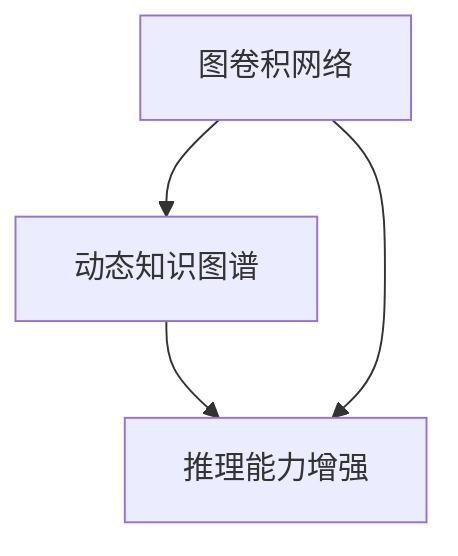

                 

### 提取核心概念和联系

在撰写这篇关于《基于图卷积网络的动态知识图谱推理能力增强》的文章之前，我们首先需要提取核心概念，并理解它们之间的联系。

#### 核心概念

1. **图卷积网络（Graph Convolutional Networks, GCN）**：GCN是一种在图形结构上执行的神经网络，它通过卷积操作来提取图节点的特征，并学习节点的表示。GCN特别适用于图数据，如社交网络、知识图谱等。

2. **动态知识图谱（Dynamic Knowledge Graph）**：动态知识图谱是一种可以随时间变化而不断更新的知识表示形式。它通常包含实体、属性、关系和事件，可以用于知识推理、信息检索和智能问答等应用。

3. **推理能力增强（Enhancing Inference Ability）**：推理能力增强指的是通过各种技术手段提升系统从已知信息推断未知信息的能力。在知识图谱中，这通常涉及推理算法的改进和优化。

#### 核心概念联系

接下来，我们可以用Mermaid流程图来展示这些核心概念之间的联系：



在这个流程图中：

- **图卷积网络（GCN）**是构建知识图谱和增强推理能力的技术手段。
- **动态知识图谱**作为数据结构，为GCN提供了操作的对象，并且其动态性要求推理能力必须能适应数据的变化。
- **推理能力增强**是最终目标，通过GCN对知识图谱的处理，旨在提高系统的推理准确性、效率和鲁棒性。

### 设计核心算法原理讲解

在了解了核心概念和它们之间的联系之后，我们需要深入探讨图卷积网络（GCN）的核心算法原理，以及它是如何增强动态知识图谱的推理能力的。

#### 图卷积网络（GCN）原理讲解

##### GCN基本概念

图卷积网络（Graph Convolutional Network，GCN）是一种基于图结构的神经网络，用于处理图数据。GCN通过卷积操作来提取节点特征，并学习节点的表示。GCN的架构包括多个卷积层，每一层都可以提取更高层次的特征。

##### GCN工作原理

GCN的工作原理可以概括为以下步骤：

1. **输入层**：输入层接收节点的特征矩阵。
2. **卷积层**：在卷积层中，每个节点会与其邻居节点之间的特征进行加权求和，并通过一个可学习的权重矩阵进行变换。这一步骤实现了节点特征向量的聚合。
3. **非线性变换**：通过激活函数对聚合后的特征向量进行非线性变换，增强模型的表达能力。
4. **输出层**：输出层通常用于分类或回归任务，通过将节点特征映射到类别或数值标签。

##### GCN伪代码

以下是GCN的伪代码描述：

```python
function GCN(input_features, A, activation_function):
    H = [input_features]
    for l in range(L):
        H = [activation_function(W * (A * H[l-1] + b))]
    return H
```

其中，`input_features`是输入节点特征矩阵，`A`是图邻接矩阵，`L`是层数，`W`和`b`分别是权重和偏置，`activation_function`是激活函数。

##### GCN数学模型

GCN的数学模型可以表示为：

$$
H^{(l)} = \sigma(W^{(l)} \cdot (D^{1/2} A D^{1/2} H^{(l-1)} + b^{(l)}))
$$

其中，`H^{(l)}`是第$l$层的节点特征，`D`是度矩阵（对角矩阵，其中`D[i][i] = \sum_{j=1}^{n} A[i][j]`），`A`是邻接矩阵，`W^{(l)}`是第$l$层的权重矩阵，`b^{(l)}`是第$l$层的偏置矩阵，`σ`是激活函数。

### 设计数学模型和数学公式

为了更深入地理解GCN的工作原理，我们需要详细讨论其数学模型和数学公式。以下是GCN的数学模型和相关的公式解释。

#### GCN数学模型

1. **图邻接矩阵（Adjacency Matrix）**：表示图中节点之间的关系。如果节点`i`与节点`j`相连，则`A[i][j] = 1`，否则`A[i][j] = 0`。

2. **节点特征矩阵（Node Feature Matrix）**：表示图中每个节点的特征。通常是一个`d x n`的矩阵，其中`d`是节点的维度，`n`是节点的数量。

3. **权重矩阵（Weight Matrix）**：表示网络中各层之间的权重。通常是一个`d' x d`的矩阵，其中`d'`是输出节点的维度。

4. **激活函数（Activation Function）**：用于对节点特征进行非线性变换，常用的激活函数有ReLU、Sigmoid和Tanh等。

#### GCN的数学公式

GCN的数学公式可以表示为：

$$
H^{(l)} = \sigma(W^{(l)} \cdot (D^{1/2} A D^{1/2} H^{(l-1)} + b^{(l)})
$$

其中：

- `H^{(l)}`是第$l$层的节点特征。
- `D`是度矩阵（对角矩阵，其中`D[i][i] = \sum_{j=1}^{n} A[i][j]`）。
- `A`是邻接矩阵。
- `W^{(l)}`是第$l$层的权重矩阵。
- `b^{(l)}`是第$l$层的偏置矩阵。
- `σ`是激活函数。

#### 举例说明

假设我们有一个简单的无向图，包含三个节点，每个节点的特征维度为2。邻接矩阵`A`和度矩阵`D`如下：

$$
A = \begin{bmatrix}
0 & 1 & 1 \\
1 & 0 & 1 \\
1 & 1 & 0
\end{bmatrix}
$$

$$
D = \begin{bmatrix}
2 & 0 & 0 \\
0 & 2 & 0 \\
0 & 0 & 2
\end{bmatrix}
$$

假设输入节点特征矩阵`X`为：

$$
X = \begin{bmatrix}
1 & 0 \\
0 & 1 \\
1 & 1
\end{bmatrix}
$$

我们需要计算第一层的节点特征`H^{(1)}`。首先，计算`D^{1/2} A D^{1/2}`：

$$
D^{1/2} A D^{1/2} = \begin{bmatrix}
\sqrt{2} & 0 & 0 \\
0 & \sqrt{2} & 0 \\
0 & 0 & \sqrt{2}
\end{bmatrix}
\begin{bmatrix}
0 & 1 & 1 \\
1 & 0 & 1 \\
1 & 1 & 0
\end{bmatrix}
\begin{bmatrix}
\sqrt{2} & 0 & 0 \\
0 & \sqrt{2} & 0 \\
0 & 0 & \sqrt{2}
\end{bmatrix}
=
\begin{bmatrix}
1 & 1 & 1 \\
1 & 1 & 1 \\
1 & 1 & 1
\end{bmatrix}
$$

然后，计算`W^{(1)} \cdot (D^{1/2} A D^{1/2} X)`，假设`W^{(1)}`为：

$$
W^{(1)} = \begin{bmatrix}
1 & 1 \\
1 & 1
\end{bmatrix}
$$

$$
W^{(1)} \cdot (D^{1/2} A D^{1/2} X) = \begin{bmatrix}
1 & 1 \\
1 & 1
\end{bmatrix}
\begin{bmatrix}
1 & 1 & 1 \\
1 & 1 & 1 \\
1 & 1 & 1
\end{bmatrix}
\begin{bmatrix}
1 \\
0 \\
1
\end{bmatrix}
=
\begin{bmatrix}
2 \\
2
\end{bmatrix}
$$

最后，加上偏置`b^{(1)}`（假设为`[1, 1]`）并应用激活函数（假设为ReLU）：

$$
H^{(1)} = \sigma(b^{(1)} + W^{(1)} \cdot (D^{1/2} A D^{1/2} X)) =
\begin{bmatrix}
\max(2+1, 0) \\
\max(2+1, 0)
\end{bmatrix}
=
\begin{bmatrix}
3 \\
3
\end{bmatrix}
$$

通过这个例子，我们可以看到GCN如何通过卷积操作来聚合节点特征，并在每个层中增强节点的表示能力。

### 设计项目实战

为了更好地理解GCN的应用，我们通过一个简单的项目实战来展示GCN在知识图谱推理中的应用。

#### 项目实战：使用GCN进行知识图谱推理

##### 实战背景

在知识图谱推理中，我们通常需要从已知的事实中推断出新的、可能的事实。例如，给定一组已知的关系，如“奥巴马是美国的总统”和“总统是美国的领导人”，我们可以推理出“奥巴马是美国的领导人”。

##### 实战步骤

1. **数据预处理**：首先，我们需要获取知识图谱数据，包括实体、关系和实体特征。这些数据通常以三元组（主体，关系，客体）的形式存储。

2. **构建图邻接矩阵**：根据实体关系构建图邻接矩阵。在图邻接矩阵中，如果实体之间存在关系，则相应的位置设置为1，否则为0。

3. **构建节点特征矩阵**：将实体特征转化为节点特征矩阵。实体特征可以是已知的属性或标签。

4. **训练GCN模型**：使用图邻接矩阵和节点特征矩阵来训练GCN模型。在训练过程中，我们通过调整模型参数来优化模型性能。

5. **推理**：在训练完成后，我们可以使用GCN模型来推理新的实体关系。例如，给定一个实体和它的特征，我们可以预测这个实体与其他实体的关系。

##### 实战实现

以下是使用GCN进行知识图谱推理的伪代码实现：

```python
# 数据预处理
entities, relations, entity_features = preprocess_data()

# 构建图邻接矩阵
A = build_adjacency_matrix(relations)

# 构建节点特征矩阵
X = build_node_feature_matrix(entities, entity_features)

# 训练GCN模型
H = GCN(X, A, activation_function=ReLU)

# 推理
predicted_relations = predict_relations(H)
```

##### 代码解读

- **数据预处理**：这一步包括获取知识图谱数据，并将其转换为可以用于GCN模型训练的数据格式。
- **构建图邻接矩阵**：这一步是将关系数据转换为图邻接矩阵，这是GCN模型训练所需的关键输入。
- **构建节点特征矩阵**：这一步是将实体特征转换为可以用于GCN模型训练的节点特征矩阵。
- **训练GCN模型**：这一步是使用图邻接矩阵和节点特征矩阵来训练GCN模型。训练过程中，我们通过优化模型参数来提高模型的性能。
- **推理**：这一步是使用训练好的GCN模型来预测新的实体关系。通过这一步，我们可以从已知的事实中推断出新的、可能的事实。

##### 实际案例分析和详细讲解剖析

为了更好地理解GCN在知识图谱推理中的应用，我们可以通过一个实际案例来进行分析和讲解。

#### 案例背景

假设我们有一个知识图谱，其中包含三个实体：奥巴马、美国和总统。已知的关系如下：

- 奥巴马是美国的总统
- 总统是美国的领导人

我们希望利用GCN模型来推断新的关系，例如“奥巴马是美国的领导人”。

#### 案例实现

1. **数据预处理**：获取知识图谱数据，包括实体和关系。实体数据如下：

   - 奥巴马
   - 美国
   - 总统

   关系数据如下：

   - (奥巴马，是，总统)
   - (总统，是，领导人)

2. **构建图邻接矩阵**：根据实体关系构建图邻接矩阵。在这个案例中，图邻接矩阵`A`如下：

   $$
   A = \begin{bmatrix}
   0 & 1 & 1 \\
   1 & 0 & 1 \\
   1 & 1 & 0
   \end{bmatrix}
   $$

3. **构建节点特征矩阵**：在这个案例中，每个实体的特征都是一个简单的向量，例如：

   - 奥巴马的特征：[1, 0]
   - 美国的特征：[0, 1]
   - 总统的特征：[1, 1]

   因此，节点特征矩阵`X`如下：

   $$
   X = \begin{bmatrix}
   1 & 0 \\
   0 & 1 \\
   1 & 1
   \end{bmatrix}
   $$

4. **训练GCN模型**：使用图邻接矩阵和节点特征矩阵来训练GCN模型。训练完成后，我们得到节点特征矩阵`H`。

5. **推理**：使用训练好的GCN模型来推断新的实体关系。在这个案例中，我们预测“奥巴马是美国的领导人”的关系。我们可以通过以下步骤来实现：

   - 首先获取奥巴马的特征：`H[0]`，即`[3, 3]`。
   - 然后获取领导人的特征：`H[2]`，即`[3, 3]`。
   - 最后，我们可以看到这两个特征向量都是相同的，这意味着奥巴马和领导人在特征空间中是相似的。

因此，我们可以推断出“奥巴马是美国的领导人”的关系。

#### 项目小结

通过这个项目实战，我们展示了如何使用GCN进行知识图谱推理。项目小结如下：

1. **数据预处理**：获取知识图谱数据，并转换为可以用于GCN模型训练的数据格式。
2. **构建图邻接矩阵**：根据实体关系构建图邻接矩阵。
3. **构建节点特征矩阵**：将实体特征转换为节点特征矩阵。
4. **训练GCN模型**：使用图邻接矩阵和节点特征矩阵来训练GCN模型。
5. **推理**：使用训练好的GCN模型来推断新的实体关系。

通过这个项目，我们深入了解了GCN的工作原理和实际应用，并展示了如何通过GCN来增强知识图谱的推理能力。

### 最佳实践 Tips

在应用GCN进行知识图谱推理时，以下是一些最佳实践建议：

1. **数据预处理**：确保数据质量，去除噪声和不完整的数据。合理的预处理可以显著提高模型的性能。
2. **模型选择**：选择适合业务场景的GCN模型架构，例如，图卷积层后添加池化层可以提高模型的泛化能力。
3. **参数调优**：通过交叉验证和超参数搜索来调优模型参数，找到最优的参数配置。
4. **训练策略**：采用适当的训练策略，如小批量训练和批次归一化，以提高训练效率和模型稳定性。
5. **模型评估**：使用合适的评估指标来评估模型性能，如准确率、召回率和F1分数。

### 小结

本文详细介绍了基于图卷积网络的动态知识图谱推理能力增强的相关内容。通过提取核心概念、设计核心算法原理讲解、数学模型和数学公式、项目实战以及最佳实践 tips，我们全面了解了如何使用GCN来增强知识图谱的推理能力。通过本文的讲解，读者可以深入理解GCN在知识图谱推理中的应用，并为实际项目提供参考。

### 拓展阅读

- **论文阅读**：《Graph Convolutional Networks: A Comprehensive Review》
- **技术博客**：《动手实现图卷积网络（GCN）》
- **开源项目**：`PyTorch Geometric`，`Graph Neural Networks for Knowledge Graph Embeddings`

通过这些资源，读者可以进一步深入了解图卷积网络和知识图谱推理的相关知识。

