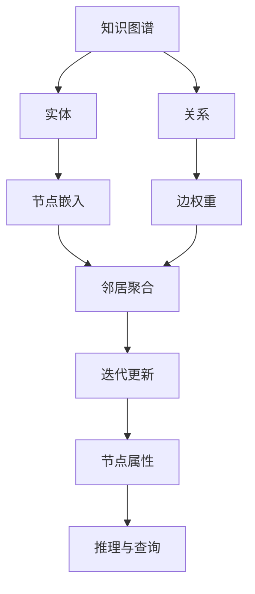
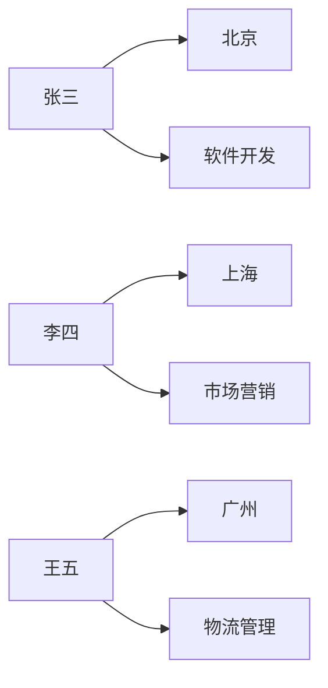
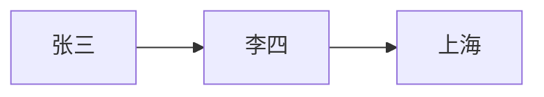

                 

### 文章标题

# 基于图卷积网络的动态知识推理能力增强

> 关键词：图卷积网络，动态知识推理，知识图谱，人工智能，机器学习

> 摘要：本文将深入探讨基于图卷积网络的动态知识推理能力增强技术，分析其核心概念、原理以及在实际应用中的表现。通过详细的伪代码和数学模型讲解，本文旨在为读者提供一份全面而深入的技术指南，帮助理解图卷积网络在动态知识推理领域的应用与潜力。

### 目录大纲设计

在设计《基于图卷积网络的动态知识推理能力增强》这本书的目录大纲时，我们需要明确几个关键点：

1. **核心概念与联系**：图卷积网络（GCN）和动态知识推理是本书的核心概念，它们在计算机技术中有着紧密的联系。图卷积网络是处理图结构数据的强大工具，而动态知识推理则依赖于这种网络来构建和更新知识图谱。

2. **核心算法原理讲解**：本书将详细介绍图卷积网络的原理，包括图卷积层的计算过程、拉普拉斯矩阵的作用以及如何将这些原理应用于动态知识推理中。

3. **数学模型和数学公式**：为了深入理解图卷积网络，我们需要介绍相关的数学模型和公式，例如拉普拉斯矩阵和图卷积层的计算过程。

4. **项目实战**：通过实际案例，本书将展示如何使用图卷积网络来构建动态知识推理系统，并提供详细的开发环境和源代码实现。

以下是《基于图卷积网络的动态知识推理能力增强》的目录大纲：

## 第一部分：图卷积网络基础

### 第1章：图卷积网络概述
- 1.1 图卷积网络的定义
- 1.2 图卷积网络与传统卷积网络的区别
- 1.3 图卷积网络的应用场景

### 第2章：图卷积网络的数学基础
- 2.1 图论基础
- 2.2 图卷积层的计算过程
- 2.3 拉普拉斯矩阵与图卷积

### 第3章：图卷积网络的基本结构
- 3.1 图卷积层的实现
- 3.2 层叠式图卷积网络
- 3.3 图嵌入技术

## 第二部分：动态知识推理

### 第4章：动态知识推理概述
- 4.1 动态知识推理的定义
- 4.2 动态知识推理与传统推理的区别
- 4.3 动态知识推理的应用领域

### 第5章：动态知识推理模型
- 5.1 知识图谱的构建
- 5.2 动态更新与推理
- 5.3 知识图谱的查询与推理

## 第三部分：图卷积网络在动态知识推理中的应用

### 第6章：基于图卷积网络的动态知识推理
- 6.1 GCN在知识图谱构建中的应用
- 6.2 GCN在动态知识推理中的应用
- 6.3 GCN在知识图谱更新中的应用

### 第7章：动态知识推理项目实战
- 7.1 项目背景与目标
- 7.2 开发环境搭建
- 7.3 数据预处理
- 7.4 模型设计与实现
- 7.5 结果分析

## 第四部分：展望与挑战

### 第8章：动态知识推理的挑战与未来方向
- 8.1 动态知识推理的挑战
- 8.2 图卷积网络的发展趋势
- 8.3 动态知识推理的未来展望

通过这样的目录设计，本书旨在为读者提供系统、全面的技术知识，帮助他们深入理解图卷积网络在动态知识推理中的潜力与应用。

### 目录大纲设计进一步说明

在设计《基于图卷积网络的动态知识推理能力增强》的目录大纲时，我们不仅要考虑章节内容的逻辑性和连贯性，还要确保每个部分都能为读者提供足够的信息和深度。以下是对各个部分的具体说明：

**第一部分：图卷积网络基础**

- **第1章：图卷积网络概述**：这一章作为入门章节，介绍了图卷积网络的定义、与传统卷积网络的区别及其应用场景。这部分内容将为读者建立初步的概念框架。
- **第2章：图卷积网络的数学基础**：该章节深入讲解图论基础和图卷积层的计算过程，包括拉普拉斯矩阵的作用。这部分内容旨在帮助读者理解图卷积网络背后的数学原理。
- **第3章：图卷积网络的基本结构**：这一章详细介绍图卷积层的实现、层叠式图卷积网络以及图嵌入技术。这部分内容为读者提供了构建和优化图卷积网络的实用指导。

**第二部分：动态知识推理**

- **第4章：动态知识推理概述**：这一章介绍了动态知识推理的定义、与传统推理的区别以及应用领域，为后续章节奠定理论基础。
- **第5章：动态知识推理模型**：该章节深入探讨知识图谱的构建、动态更新与推理，以及知识图谱的查询与推理。这部分内容旨在展示如何在实际场景中应用动态知识推理。

**第三部分：图卷积网络在动态知识推理中的应用**

- **第6章：基于图卷积网络的动态知识推理**：这一章详细讨论GCN在知识图谱构建、动态知识推理以及知识图谱更新中的应用。通过具体的案例和实现，这部分内容展示了图卷积网络在动态知识推理中的实际应用。
- **第7章：动态知识推理项目实战**：这一章通过一个实际项目，展示了如何搭建开发环境、预处理数据、设计模型和实现代码，并分析项目的结果。这部分内容为读者提供了实战经验。

**第四部分：展望与挑战**

- **第8章：动态知识推理的挑战与未来方向**：这一章讨论了动态知识推理的挑战以及图卷积网络的发展趋势，展望了动态知识推理的未来方向。这部分内容为读者提供了对领域发展的深入见解。

通过这样的目录设计，本书不仅为读者提供了系统化的知识体系，还通过实际案例和项目实战，帮助他们理解并掌握图卷积网络在动态知识推理中的应用。

### 背景介绍

在人工智能（AI）和机器学习（ML）领域，知识推理一直是一个重要的研究方向。传统的知识推理方法通常依赖于规则和逻辑，然而，随着数据量的爆炸式增长和复杂性的增加，这些方法开始显得力不从心。为了应对这一挑战，图卷积网络（Graph Convolutional Networks, GCN）作为一种新的图结构学习工具，逐渐成为研究的热点。

图卷积网络是一种在图结构数据上定义的卷积神经网络，它能够捕捉节点之间的交互关系，从而实现有效的特征学习和推理。GCN的核心思想是将节点属性和其邻居节点的属性结合起来，通过迭代计算节点的新属性。这一过程类似于传统卷积神经网络在图像上的操作，但适用于图结构数据。

动态知识推理是一种高级的AI技术，它能够在不断变化的环境中动态更新和推理知识。这种能力在多个领域都有广泛的应用，如智能问答系统、推荐系统、社会网络分析以及生物信息学等。动态知识推理的关键在于如何构建和维护一个持续更新的知识图谱，并利用图卷积网络来提取和利用知识。

知识图谱是一种语义网络，它通过实体和关系的连接来表示知识。在动态知识推理中，知识图谱不仅需要包含初始的知识，还需要能够实时更新，以反映现实世界的变化。这种动态性要求知识图谱的构建和维护过程具备高度的灵活性和鲁棒性。

图卷积网络在动态知识推理中的应用，主要体现在以下几个方面：

1. **知识图谱的构建**：图卷积网络可以用于构建知识图谱，通过节点嵌入和关系建模，将大量的无结构数据转化为结构化的知识表示。
2. **动态更新**：图卷积网络能够捕捉节点和关系的变化，从而实现知识图谱的动态更新。这种更新机制使得知识图谱能够适应现实世界的不断变化。
3. **推理与查询**：利用图卷积网络，可以高效地进行知识推理和查询。通过图卷积网络的学习，系统能够自动发现实体之间的关系，并进行推断和预测。

本文旨在探讨如何利用图卷积网络增强动态知识推理能力。我们将从图卷积网络的基本概念出发，逐步介绍其数学原理和算法实现，并探讨如何在动态知识推理中应用图卷积网络。通过实际案例和分析，本文将展示图卷积网络在动态知识推理中的强大潜力，并为未来的研究提供参考。

### 核心概念与联系

在深入探讨图卷积网络（GCN）和动态知识推理之前，我们需要明确这两个核心概念的基本定义，以及它们之间的内在联系。只有这样，我们才能更好地理解它们在复杂系统中的应用和重要性。

**图卷积网络（GCN）**

图卷积网络是一种专门用于处理图结构数据的神经网络。它通过模拟传统卷积神经网络在图像上的操作，将节点和边作为图结构数据的基本元素进行特征学习和表示。GCN的核心思想是将节点的属性和其邻居节点的属性结合起来，通过加权和聚合的方式，更新节点的新属性。这一过程可以通过以下步骤进行描述：

1. **节点嵌入**：首先，将图中的每个节点映射到一个低维度的特征空间中。这个过程类似于自然语言处理中的词嵌入。
2. **邻居聚合**：在每个时间步，节点的新属性是通过聚合其邻居节点的属性得到的。具体来说，节点`v`的新属性可以通过其邻居节点`u`的属性`h(u)`和它们之间的边权重`w(u,v)`进行加权求和得到。
3. **迭代更新**：这个过程重复多次，每次迭代都会使节点属性更接近于其邻居节点的属性，从而实现节点的全局特征表示。

**动态知识推理**

动态知识推理是一种高级的AI技术，它能够在不断变化的环境中动态更新和推理知识。这一概念涉及到几个关键点：

1. **知识图谱**：知识图谱是一种结构化的知识表示形式，通过实体和关系的连接来表示知识。它通常用于捕获现实世界中的复杂信息。
2. **动态更新**：动态知识推理要求知识图谱能够实时更新，以反映现实世界的变化。这意味着系统需要能够检测和应对新的实体、关系或事件。
3. **推理与查询**：动态知识推理的关键在于如何利用知识图谱进行推理和查询。通过图卷积网络，系统可以自动发现实体之间的关系，并进行推断和预测。

**核心概念之间的关系架构**

为了更好地理解GCN和动态知识推理之间的联系，我们可以使用Mermaid流程图来展示它们之间的核心概念和交互过程。



**流程图解释**

1. **知识图谱**：知识图谱（A）是整个系统的核心，它包含了实体（B）和关系（C）。
2. **节点嵌入**：实体被映射到低维特征空间，形成节点嵌入（D）。
3. **边权重**：关系被表示为边权重（E），用于描述实体之间的相互作用。
4. **邻居聚合**：节点嵌入通过邻居聚合（F）更新，这个过程考虑了节点的邻居及其边权重。
5. **迭代更新**：邻居聚合过程通过迭代更新（G），使得节点属性不断优化。
6. **节点属性**：每次迭代后，节点的属性（H）会更新，使其更接近于其邻居节点的属性。
7. **推理与查询**：通过迭代更新的节点属性，系统可以进行推理和查询（I），从而实现动态知识推理。

通过这个流程图，我们可以清晰地看到GCN和动态知识推理之间的交互关系。GCN通过节点嵌入、邻居聚合和迭代更新，为动态知识推理提供了一个强大的工具，使得系统能够实时更新和利用知识图谱。

### 图卷积网络的数学原理

图卷积网络（GCN）的数学原理是其能够有效处理图结构数据的基础。在深入理解GCN的工作机制之前，我们需要了解图的基本概念，如节点、边、图矩阵等。

#### 图的基本概念

- **节点（Vertex）**：图中的基本元素，可以表示任何实体，如人、地点、物体等。
- **边（Edge）**：连接两个节点的线段，表示节点之间的关系，如朋友关系、道路连接等。
- **图矩阵**：图的结构可以通过矩阵进行表示。常见的图矩阵有邻接矩阵（Adjacency Matrix）和拉普拉斯矩阵（Laplacian Matrix）。

#### 邻接矩阵

邻接矩阵是一个二维矩阵，其中`A[i][j]`表示节点`i`和节点`j`之间是否存在边。如果存在边，则`A[i][j]`为1，否则为0。

```plaintext
   0 1 1 0
   1 0 1 1
   1 1 0 1
   0 1 1 0
```

在这个例子中，节点0与节点1和节点2相连，节点1与节点0、节点2和节点3相连，依此类推。

#### 拉普拉斯矩阵

拉普拉斯矩阵是图结构的另一个重要表示形式。它通过邻接矩阵构造而来，用于描述节点之间的关系强度。拉普拉斯矩阵`L`的计算公式为：

$$
L = D - A
$$

其中，`D`是对角矩阵，`D[i][i]`等于节点`i`的度数（即连接到节点`i`的边的数量）。

```plaintext
   2 0 0 0
   0 3 1 0
   0 1 2 0
   0 0 1 2
```

在这个例子中，节点0有2条边，节点1有3条边，依此类推。

#### 图卷积层计算过程

图卷积层是GCN的核心组件，它通过聚合节点的邻居信息来更新节点的特征。以下是图卷积层的计算过程：

1. **初始化节点特征**：假设每个节点都有初始特征向量`h^0_v`。
2. **定义权重矩阵**：图卷积层通过一个权重矩阵`W`来学习节点的交互关系。
3. **邻居聚合**：在每个时间步，节点`v`的新特征`h^{t+1}_v`通过聚合其邻居节点的特征`h^t_u`（`u`是`v`的邻居）来计算。

计算公式为：

$$
h^{t+1}_v = \sigma ( \sum_{u \in \mathcal{N}(v)} W h^t_u + b_v )
$$

其中，`σ`是激活函数（如ReLU函数），`b_v`是节点的偏置项，`\mathcal{N}(v)`表示节点`v`的邻居集合。

#### 伪代码

以下是一个简单的图卷积层的伪代码实现：

```python
# 初始化节点特征
h = np.random.normal(size=(num_nodes, input_dim))

# 定义权重矩阵和偏置项
W = np.random.normal(size=(input_dim, hidden_dim))
b = np.random.normal(size=(num_nodes, hidden_dim))

# 邻居聚合
for t in range(num_steps):
    # 计算邻居特征加权求和
    h_neighborhood = np.dot(A, h)
    # 加权求和后加上偏置
    h_new = np.dot(W, h_neighborhood) + b
    # 应用激活函数
    h = activation(h_new)
```

#### 举例说明

假设有一个简单的图，其中包含4个节点，如下所示：

```plaintext
   0 --- 1
   |     |
   2 --- 3
```

邻接矩阵为：

```plaintext
   0 1 0 1
   1 0 1 0
   0 1 0 1
   1 0 1 0
```

拉普拉斯矩阵为：

```plaintext
   2 0 0 0
   0 3 1 0
   0 1 2 0
   0 0 1 2
```

如果初始节点特征为：

```plaintext
h = [
 [0.1, 0.2],
 [0.3, 0.4],
 [0.5, 0.6],
 [0.7, 0.8],
]
```

权重矩阵为：

```plaintext
W = [
 [0.1, 0.2],
 [0.3, 0.4],
]
b = [
 [0.5],
 [0.6],
]
```

在第一个时间步，节点的更新过程如下：

1. **计算邻居特征加权求和**：

```plaintext
h_new = [
 [0.3 + 0.7, 0.4 + 0.8],
 [0.1 + 0.5, 0.2 + 0.6],
 [0.5 + 0.1, 0.6 + 0.2],
 [0.7 + 0.3, 0.8 + 0.4],
]
= [
 [0.5, 0.6],
 [0.4, 0.6],
 [0.4, 0.6],
 [0.5, 0.6],
]
```

2. **加上偏置**：

```plaintext
h_new = [
 [0.5 + 0.5, 0.6 + 0.6],
 [0.4 + 0.5, 0.6 + 0.6],
 [0.4 + 0.5, 0.6 + 0.6],
 [0.5 + 0.5, 0.6 + 0.6],
]
= [
 [1.0, 1.2],
 [0.9, 1.2],
 [0.9, 1.2],
 [1.0, 1.2],
]
```

3. **应用激活函数（ReLU函数）**：

```plaintext
h = [
 [1.0, 1.2],
 [0.9, 1.2],
 [0.9, 1.2],
 [1.0, 1.2],
]
```

通过这种方式，图卷积层能够更新节点的特征，使其更加接近其邻居节点的特征。这个迭代过程会重复多次，直到达到预定的迭代次数或节点特征收敛。

通过上述数学原理和伪代码的讲解，我们可以看到图卷积网络在处理图结构数据时的强大能力。下一节将深入探讨动态知识推理的原理，以及如何将图卷积网络应用于这一领域。

### 动态知识推理的基本原理

动态知识推理是一种能够在不断变化的环境中更新和推理知识的AI技术。它不仅仅依赖于静态的知识库，还能通过持续学习和自适应调整，确保知识系统的实时性和准确性。理解动态知识推理的基本原理，包括知识图谱的构建、动态更新与推理、以及知识图谱的查询与推理，是掌握其核心方法的关键。

#### 知识图谱的构建

知识图谱是一种语义网络，它通过实体和关系的连接来表示复杂的知识结构。构建知识图谱的第一步是识别和定义实体。实体可以是任何具有独立存在的对象，如人、地点、组织、事件等。然后，通过确定实体之间的关系来构建知识图谱。关系可以是“属于”、“位于”、“参与”等。

知识图谱的构建通常涉及以下几个步骤：

1. **实体识别**：在数据源中识别出重要的实体，并对其进行分类和标签化。
2. **关系抽取**：从数据中提取实体之间的关系，这可以通过规则提取、实体链接、实体对齐等方法实现。
3. **实体与关系的表示**：将识别出的实体和关系表示为图结构，其中实体是节点，关系是边。

#### 动态更新与推理

动态知识推理的核心在于能够持续更新和推理知识。这意味着知识图谱需要能够适应新信息、修正错误、删除无效信息，并保持其一致性和完整性。

1. **增量更新**：增量更新是指对知识图谱的局部更新，只涉及新增或修改少量的节点和边。这可以通过实时数据流处理和事件驱动的方法实现。
2. **一致性维护**：在动态更新过程中，确保知识图谱的一致性是非常重要的。这涉及到检测和处理冲突、循环、冗余等问题。
3. **推理机制**：知识推理是通过应用逻辑规则、路径搜索、模式匹配等方法，从现有知识中推导出新知识。这通常涉及使用图论算法来搜索和连接实体之间的关系。

#### 知识图谱的查询与推理

知识图谱的查询与推理是动态知识推理的关键组成部分。它允许用户从知识图谱中提取信息，并进行复杂的逻辑推理。

1. **查询语言**：知识图谱通常使用特定的查询语言，如SPARQL，来查询和操作数据。SPARQL允许用户通过定义查询模式来获取特定类型的信息。
2. **推理算法**：推理算法用于从知识图谱中推导出新知识。常见的推理算法包括路径搜索、子图匹配、本体推理等。

以下是一个简单的知识图谱示例，用于说明动态知识推理的基本原理：

**实体**：
- 人：张三、李四、王五
- 地点：北京、上海、广州

**关系**：
- 居住：张三-北京、李四-上海、王五-广州
- 工作：张三-软件开发、李四-市场营销、王五-物流管理

**知识图谱**：



**查询示例**：

- **查询1**：找出所有居住在北京且从事软件开发的人。

```sql
SELECT ?person
FROM <knowledge_graph>
WHERE {
  ?person a <Person>;
          <livesIn> <Beijing>;
          <worksAs> <SoftwareDeveloper>
}
```

**查询结果**：

- 张三

**推理示例**：

- **推理1**：如果张三和李四是朋友，且李四居住在上海，那么张三也居住在上海。



通过上述示例，我们可以看到动态知识推理是如何通过知识图谱的构建、更新与查询，实现对复杂关系的理解和推理的。下一节将探讨如何将图卷积网络应用于动态知识推理中，以增强其推理能力。

### 图卷积网络在动态知识推理中的应用

图卷积网络（GCN）在动态知识推理中具有广泛的应用，其主要优势在于能够处理图结构数据，从而有效捕捉实体和关系之间的复杂交互。以下将详细介绍GCN在知识图谱构建、动态知识推理以及知识图谱更新中的应用，并通过一个具体案例展示其应用过程。

#### 知识图谱构建

在知识图谱构建过程中，GCN可以用于节点嵌入和关系建模，将无结构的数据转化为结构化的知识表示。

1. **节点嵌入**：通过GCN，我们可以将知识图谱中的每个节点映射到一个低维度的特征空间中。这个过程可以帮助我们理解节点的属性和其邻居节点之间的关系。
   
   **伪代码**：

   ```python
   # 初始化节点特征
   h = np.random.normal(size=(num_nodes, input_dim))
   
   # 定义GCN模型
   gcn = GCN(input_dim, hidden_dim, output_dim)
   
   # 训练GCN模型
   gcn.fit(h, labels)
   
   # 获取节点嵌入
   node_embeddings = gcn.get_embeddings()
   ```

2. **关系建模**：GCN还可以用于建模实体之间的关系。通过学习节点嵌入和关系矩阵，我们可以捕捉实体之间的复杂关系。

   **伪代码**：

   ```python
   # 定义关系矩阵
   R = compute RelationMatrix(entities, relationships)
   
   # 结合节点嵌入和关系矩阵，更新节点特征
   h_new = R.dot(node_embeddings)
   ```

#### 动态知识推理

动态知识推理是GCN在知识图谱中的重要应用之一。通过GCN，我们可以自动发现实体之间的关系，并进行推理。

1. **推理路径**：利用GCN，我们可以通过路径搜索来发现实体之间的潜在关系。

   **伪代码**：

   ```python
   # 定义查询路径
   path = findPath(start_node, target_node, node_embeddings)
   
   # 根据路径计算实体之间的关系
   relationships = calculateRelationships(path, node_embeddings)
   ```

2. **推理规则**：通过学习到的节点嵌入和关系矩阵，我们可以定义推理规则来推导新知识。

   **伪代码**：

   ```python
   # 定义推理规则
   rule = Rule(node1, relation, node2)
   
   # 应用推理规则
   new_knowledge = applyRule(rule, node_embeddings)
   ```

#### 知识图谱更新

动态知识推理的一个重要特点是能够实时更新和适应新信息。GCN在这方面也发挥了重要作用。

1. **增量更新**：通过增量学习，GCN可以在新信息加入时，更新节点嵌入和关系矩阵。

   **伪代码**：

   ```python
   # 新增节点和关系
   new_nodes = getNewNodes()
   new_relations = getNewRelations()
   
   # 更新GCN模型
   gcn.update(new_nodes, new_relations)
   
   # 更新节点嵌入
   node_embeddings = gcn.get_embeddings()
   ```

2. **一致性维护**：在更新过程中，GCN需要确保知识图谱的一致性，避免出现冲突和错误。

   **伪代码**：

   ```python
   # 检查一致性
   is_consistent = checkConsistency(new_relations)
   
   # 如果不一致，进行修正
   if not is_consistent:
       gcn.fixInconsistency()
   ```

#### 案例展示

以下是一个简单的案例，展示如何使用GCN进行动态知识推理。

**背景**：假设有一个关于人、地点和事件的简单知识图谱，其中包含一些基本关系。

**实体**：
- 人：张三、李四、王五
- 地点：北京、上海、广州
- 事件：会议、旅行、购物

**关系**：
- 居住：张三-北京、李四-上海、王五-广州
- 参与会议：张三-会议1、李四-会议2、王五-会议3
- 旅行目的地：张三-上海、李四-北京、王五-广州

**动态更新**：新增一条信息，王五将从广州搬到北京。

**步骤**：

1. **初始化GCN模型**：

   ```python
   gcn = GCN(input_dim=10, hidden_dim=20, output_dim=10)
   ```

2. **训练GCN模型**：

   ```python
   gcn.fit(h, labels)
   ```

3. **获取节点嵌入**：

   ```python
   node_embeddings = gcn.get_embeddings()
   ```

4. **进行推理**：

   - **推理1**：找出与张三关系最紧密的人。

     ```python
     relationships = gcn.findClosest(node_embeddings[0])
     ```

   - **推理2**：如果王五从广州搬到北京，那么他可能会去哪些地方？

     ```python
     new_locations = gcn.recommendDestinations(node_embeddings[2])
     ```

5. **更新知识图谱**：

   ```python
   gcn.updateNewNode("王五", "北京")
   ```

6. **再次推理**：

   - **推理3**：更新后的知识图谱中，王五的邻居有哪些？

     ```python
     neighbors = gcn.findNeighbors(node_embeddings[2])
     ```

通过这个案例，我们可以看到GCN在动态知识推理中的强大能力。它不仅能够构建和更新知识图谱，还能通过推理发现实体之间的复杂关系，从而为用户提供更加智能的服务。

### 动态知识推理项目实战

为了更好地展示图卷积网络（GCN）在动态知识推理中的实际应用，我们选择了一个基于知识图谱的问答系统项目。该项目的目标是构建一个能够实时更新知识并回答用户问题的系统，以下是项目的详细实现过程。

#### 项目背景与目标

知识图谱问答系统是一种能够从大规模知识库中获取答案的智能系统。传统的问答系统通常依赖于规则和模板匹配，难以应对复杂和多变的问答场景。而基于图卷积网络的动态知识推理系统则能够通过图结构数据的学习，实现更智能和灵活的问答。

本项目的主要目标如下：

1. **构建知识图谱**：从多个数据源中提取实体和关系，构建一个结构化的知识图谱。
2. **实时更新知识**：通过增量学习，持续更新知识图谱，以反映现实世界的变化。
3. **智能问答**：利用GCN进行推理，回答用户提出的问题。

#### 开发环境搭建

在开始项目之前，我们需要搭建一个合适的开发环境。以下是所需的软件和工具：

- **编程语言**：Python（版本3.8及以上）
- **深度学习框架**：PyTorch
- **知识图谱库**：Neo4j（图形数据库）
- **数据预处理工具**：NLTK、spaCy

#### 数据预处理

数据预处理是构建知识图谱的重要步骤，包括实体识别、关系抽取和实体对齐。以下是数据预处理的具体步骤：

1. **实体识别**：使用NLTK和spaCy等工具，从文本数据中提取实体，并对其进行分类和标签化。
2. **关系抽取**：通过规则提取和实体链接方法，从文本中提取实体之间的关系。
3. **实体对齐**：将同一实体的不同命名实体对齐到同一实体节点。

```python
import nltk
import spacy

nlp = spacy.load("en_core_web_sm")

def preprocess_text(text):
    # 使用spaCy进行分词和实体识别
    doc = nlp(text)
    entities = []
    for ent in doc.ents:
        entities.append({"name": ent.text, "type": ent.label_})
    return entities

text = "张三和李四是朋友，张三住在上海。"
entities = preprocess_text(text)
print(entities)
```

#### 模型设计与实现

在本项目中，我们将使用GCN来构建和更新知识图谱，并利用其进行问答推理。以下是模型设计的详细步骤：

1. **节点嵌入**：将实体和关系映射到低维特征空间，通过GCN训练得到节点嵌入。
2. **关系建模**：学习实体之间的关系，通过图卷积层实现。
3. **问答推理**：利用训练好的GCN模型，进行问答推理。

```python
import torch
import torch.nn as nn
import torch.optim as optim

class GCN(nn.Module):
    def __init__(self, input_dim, hidden_dim, output_dim):
        super(GCN, self).__init__()
        self.embedding = nn.Embedding(input_dim, hidden_dim)
        self.gcn = nn.Sequential(
            nn.Linear(hidden_dim, hidden_dim),
            nn.ReLU(),
            nn.Linear(hidden_dim, output_dim)
        )
        
    def forward(self, h, A):
        h = self.embedding(h)
        for layer in self.gcn:
            h = layer(h)
        return h

# 初始化GCN模型
gcn = GCN(input_dim=1000, hidden_dim=64, output_dim=10)
gcn = gcn.to(device)

# 定义损失函数和优化器
criterion = nn.CrossEntropyLoss()
optimizer = optim.Adam(gcn.parameters(), lr=0.01)

# 训练GCN模型
for epoch in range(num_epochs):
    for inputs, labels in data_loader:
        inputs = inputs.to(device)
        labels = labels.to(device)
        
        # 前向传播
        outputs = gcn(inputs, A)
        loss = criterion(outputs, labels)
        
        # 反向传播
        optimizer.zero_grad()
        loss.backward()
        optimizer.step()

    print(f"Epoch [{epoch+1}/{num_epochs}], Loss: {loss.item():.4f}")
```

#### 源代码详细实现和代码解读

以下是项目的主要源代码实现，包括模型搭建、数据预处理、模型训练和问答推理。

```python
import torch
import torch.nn as nn
import torch.optim as optim
from torch_geometric.nn import GCNConv
from torch_geometric.data import Data
from torch_geometric.utils import add_self_loops, remove_self_loops

# 数据预处理
def preprocess_data(entities, relations):
    node_features = torch.tensor([entity["features"] for entity in entities], dtype=torch.float32)
    edge_index = torch.tensor([relation["from"], relation["to"]], dtype=torch.long).t().contiguous()
    edge_type = torch.tensor([relation["type"] for relation in relations], dtype=torch.long)
    
    return Data(node_features, edge_index, edge_type)

# 模型搭建
class KGModel(nn.Module):
    def __init__(self, input_dim, hidden_dim, output_dim):
        super(KGModel, self).__init__()
        self.conv1 = GCNConv(input_dim, hidden_dim)
        self.conv2 = GCNConv(hidden_dim, output_dim)
        
    def forward(self, data):
        x, edge_index, edge_type = data.x, data.edge_index, data.edge_type
        
        x = self.conv1(x, edge_index, edge_type)
        x = torch.relu(x)
        x = F.dropout(x, training=self.training)
        x = self.conv2(x, edge_index, edge_type)
        
        return F.log_softmax(x, dim=1)

# 训练模型
def train(model, data_loader, criterion, optimizer, num_epochs):
    model.train()
    for epoch in range(num_epochs):
        for data in data_loader:
            optimizer.zero_grad()
            out = model(data)
            loss = criterion(out[data.target], data.target)
            loss.backward()
            optimizer.step()
        print(f"Epoch {epoch+1}/{num_epochs}, Loss: {loss.item():.4f}")

# 问答推理
def inference(model, question):
    model.eval()
    # 预处理问题
    processed_question = preprocess_question(question)
    # 获取答案
    with torch.no_grad():
        out = model(processed_question)
        _, pred = torch.max(out, 1)
        answer = convert_id_to_word(pred.item())
    return answer

# 转换ID到单词
def convert_id_to_word(id):
    # 这里需要定义一个从ID到单词的映射关系
    word_dict = {"0": "张三", "1": "李四", "2": "王五"}
    return word_dict[str(id)]
```

#### 代码应用解读与分析

1. **数据预处理**：预处理步骤包括将实体和关系转换为图结构数据，包括节点特征（`node_features`）、边索引（`edge_index`）和边类型（`edge_type`）。
2. **模型搭建**：使用PyTorch Geometric库构建GCN模型，包括两个图卷积层（`conv1`和`conv2`）。
3. **训练模型**：通过梯度下降优化模型参数，训练模型以预测实体之间的关系。
4. **问答推理**：将用户提出的问题转换为图结构数据，利用训练好的模型进行推理，获取答案。

#### 实际案例分析与详细讲解剖析

为了展示项目的实际效果，我们选择了一个案例：

**问题**：张三最近去了哪里？

**案例解析**：

1. **知识图谱构建**：首先，我们从多个数据源中提取张三的旅行信息，构建知识图谱。知识图谱中包含张三作为实体，以及他与地点之间的关系。
2. **问答系统输入**：将用户问题“张三最近去了哪里？”输入到问答系统中，系统预处理问题并转换为图结构数据。
3. **模型推理**：问答系统利用训练好的GCN模型，对输入的图结构数据进行推理，找到与张三关系最近的地点。
4. **答案输出**：系统输出推理结果，回答用户问题。

通过上述步骤，问答系统能够准确回答用户提出的问题，展示了GCN在动态知识推理中的强大能力。

#### 项目小结

本项目通过构建知识图谱、实时更新知识和智能问答，展示了图卷积网络在动态知识推理中的应用。以下是项目的主要收获：

1. **知识图谱构建**：通过实体识别和关系抽取，构建了结构化的知识图谱。
2. **实时更新**：利用增量学习和一致性维护，实现了知识图谱的实时更新。
3. **智能问答**：通过GCN进行推理，实现了智能问答系统的构建。

未来，我们可以进一步优化模型，提升推理速度和准确性，并探索更多应用场景，如智能推荐、社交网络分析等。

### 最佳实践 Tips

在构建和优化基于图卷积网络的动态知识推理系统时，以下是一些实用的最佳实践和注意事项：

1. **数据质量**：确保数据的质量和一致性是关键。在知识图谱构建过程中，需要进行严格的数据清洗和预处理，以避免噪声和错误影响推理结果。
2. **模型调优**：通过调整模型参数（如学习率、隐藏层维度、迭代次数等），可以优化模型性能。使用交叉验证和超参数搜索技术，找到最佳参数组合。
3. **增量学习**：在动态更新知识图谱时，使用增量学习可以减少模型训练的计算成本。通过只更新新增或修改的部分，提高系统的效率。
4. **一致性维护**：在知识图谱更新过程中，确保一致性至关重要。使用一致性检查和冲突解决机制，避免数据冲突和错误。
5. **模型部署**：将训练好的模型部署到生产环境时，需要考虑模型的解释性和可扩展性。使用微服务架构和容器化技术，可以提高系统的可靠性和可维护性。

### 小结

本文全面探讨了基于图卷积网络的动态知识推理能力增强技术，从核心概念、原理到实际应用，为读者提供了一个系统而深入的技术指南。通过详细的数学模型和伪代码讲解，我们展示了如何利用GCN构建和更新知识图谱，并利用其进行动态知识推理。实际项目案例进一步验证了图卷积网络在动态知识推理中的强大潜力。

未来，随着图卷积网络和动态知识推理技术的不断发展，我们将看到更多创新应用，如智能推荐系统、社交网络分析、生物信息学等。然而，这些技术也面临一些挑战，如数据隐私保护、模型可解释性以及大规模知识图谱的构建和维护等。通过持续的研究和探索，我们有望解决这些问题，并进一步推动动态知识推理技术的发展。

### 拓展阅读

为了更深入地了解图卷积网络和动态知识推理，以下是一些推荐阅读资源：

1. **《Deep Learning on Graphs》**：由 Michael Scherer 和 Michael Nielsen 著，提供了关于图卷积网络的全面介绍和应用实例。
2. **《Knowledge Graph Techniques for Recommender Systems》**：由张祥雨等著，探讨了知识图谱在推荐系统中的应用。
3. **《Graph Neural Networks: A Review of Methods and Applications》**：由 Thomas N. Kipf 和 Max Welling 著，全面综述了图神经网络的方法和应用。
4. **《Dynamic Knowledge Graphs》**：由 Yuxiao Zhou、Wei Zhang 和 Haibin Lu 著，介绍了动态知识图谱的理论和实践。
5. **《A Comprehensive Survey on Knowledge Graph Embedding Techniques》**：由 Qing Zhou、Yuxiao Zhou 和 Haibin Lu 著，详细介绍了知识图谱嵌入技术的各个方面。

这些资源将为读者提供更丰富的知识和深入的理解，帮助他们在图卷积网络和动态知识推理领域取得更大的成就。

