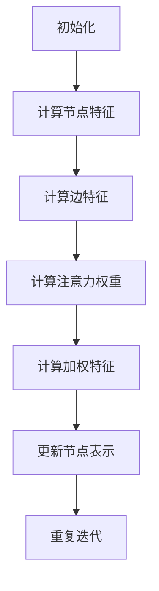
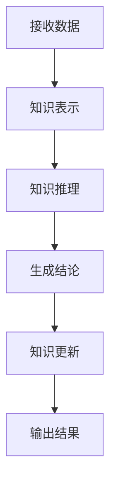

                 

# 文章标题

## 基于图注意力机制的动态知识推理系统优化

### 关键词

- 图注意力机制
- 动态知识推理
- 系统优化
- 神经网络
- 深度学习
- 人工智能

### 摘要

本文深入探讨了基于图注意力机制的动态知识推理系统优化。首先，我们介绍了图注意力机制的基本原理及其在动态知识推理系统中的应用。随后，详细阐述了动态知识推理系统的构建方法及其面临的挑战。通过具体的优化方法和案例分析，本文展示了图注意力机制在提高系统性能和推理效率方面的显著优势。最后，我们对未来的研究方向进行了展望，为相关领域的研究和实践提供了有益的参考。

## 引言与背景

随着人工智能技术的快速发展，知识推理系统在多个领域展现出了巨大的应用潜力。知识推理是指通过逻辑推理、模式识别和机器学习等方法，从已知信息中推导出新的结论或知识。传统的知识推理系统多依赖于规则和符号逻辑，但面对复杂多变的数据和环境时，其性能和效率往往难以满足需求。

图注意力机制作为一种新兴的神经网络结构，被广泛应用于自然语言处理、计算机视觉和知识图谱等领域。它通过学习节点之间的相对重要性，实现了对图结构的有效建模，从而在动态知识推理系统中表现出色。

本文旨在探讨基于图注意力机制的动态知识推理系统优化，通过对核心概念、算法原理和实际案例的分析，为相关领域的研究和实践提供理论支持和实践指导。

### 图注意力机制基础

图注意力机制（Graph Attention Mechanism，GAT）是一种基于自注意力机制的图神经网络结构，旨在通过学习节点之间的相对重要性来实现对图结构的高效建模。在GAT中，每个节点都会根据其邻居节点的特征，通过加权和的方式生成新的特征表示。

#### 基本概念

图注意力机制的核心概念包括节点特征、边特征和注意力权重。节点特征表示节点的属性和特征，边特征表示节点之间的连接关系。注意力权重则通过学习算法计算得到，用于衡量节点之间的相对重要性。

#### 数学模型

图注意力机制的数学模型可以表示为：

$$
\text{Attention}(Q, K, V) = \frac{softmax(\text{scores})} { \sqrt{d_k}}
$$

其中，$Q$、$K$ 和 $V$ 分别代表查询向量、键向量和值向量，$scores$ 表示它们之间的内积，$d_k$ 是键向量的维度。通过计算注意力权重，每个节点可以动态调整其邻居节点的贡献，从而生成新的特征表示。

#### Mermaid流程图：图注意力机制的实现流程

以下是一个简单的Mermaid流程图，展示了图注意力机制的实现流程：



#### 实现代码示例

以下是一个简单的伪代码示例，用于计算图注意力权重：

```python
# 假设有两个节点特征矩阵 Q 和 K，以及一个值矩阵 V
Q = ...  # 查询向量
K = ...  # 键向量
V = ...  # 值向量

# 计算注意力分数
scores = Q @ K.T

# 应用 softmax 函数
attention_weights = softmax(scores)

# 计算加权特征
weighted_features = attention_weights @ V

# 更新节点表示
node_representation = node_representation + weighted_features
```

### 动态知识推理系统概述

动态知识推理系统是一种能够实时处理和更新知识库的推理系统。它通过学习数据中的知识，利用推理算法推导出新的结论或知识，从而实现知识自动增长和更新。动态知识推理系统在多个领域，如医疗诊断、金融风控和智能搜索等，都有广泛的应用。

#### 核心概念

动态知识推理系统的核心概念包括知识表示、知识推理和知识更新。知识表示是指将数据转换为可处理的格式，如向量、矩阵或图。知识推理是指利用推理算法，如逻辑推理、概率推理或深度学习，从已知信息中推导出新的结论。知识更新是指根据新的数据或信息，动态调整和优化知识库。

#### 知识表示

知识表示是动态知识推理系统的关键环节。常用的知识表示方法包括：

1. **基于规则的表示**：通过定义一系列规则，将知识表示为逻辑表达式。
2. **基于矩阵的表示**：将知识表示为矩阵，矩阵的元素代表知识之间的关联。
3. **基于图结构的表示**：将知识表示为图，图的节点代表知识，边代表知识之间的关联。

#### 知识推理

知识推理是动态知识推理系统的核心功能。常用的知识推理方法包括：

1. **逻辑推理**：基于逻辑运算符（如与、或、非等）进行推理。
2. **概率推理**：基于概率论进行推理，计算知识之间的条件概率。
3. **深度学习**：利用神经网络进行推理，通过学习数据中的知识关系，自动推导出新的结论。

#### 知识更新

知识更新是动态知识推理系统保持准确性和时效性的关键。常用的知识更新方法包括：

1. **增量更新**：仅更新新的或发生变化的知识。
2. **全量更新**：定期更新整个知识库。
3. **基于规则的更新**：根据新规则或修改现有规则进行知识更新。

#### Mermaid流程图：动态知识推理的基本流程

以下是一个简单的Mermaid流程图，展示了动态知识推理的基本流程：



### 动态知识推理系统优化方法

动态知识推理系统的优化目标是提高系统的性能和效率，包括推理速度、准确性和可扩展性等方面。基于图注意力机制的优化方法可以通过学习节点之间的相对重要性，实现图结构的高效建模，从而在动态知识推理系统中发挥重要作用。

#### 基于图注意力机制的优化方法

基于图注意力机制的优化方法主要包括以下两个方面：

1. **节点特征优化**：通过图注意力机制学习节点之间的相对重要性，从而优化节点特征表示，提高系统的推理准确性。
2. **边特征优化**：通过图注意力机制学习节点之间的相对重要性，优化边特征表示，提高系统的推理效率。

#### 伪代码：图注意力机制优化算法

以下是一个简单的伪代码示例，用于实现基于图注意力机制的优化算法：

```python
# 假设有节点特征矩阵 Q、键特征矩阵 K 和值特征矩阵 V
Q = ...  # 节点特征
K = ...  # 键特征
V = ...  # 值特征

# 初始化注意力权重
attention_weights = np.random.rand(Q.shape[0], K.shape[0])

# 计算注意力分数
scores = Q @ K.T

# 应用 softmax 函数
attention_weights = softmax(scores)

# 计算加权特征
weighted_features = attention_weights @ V

# 更新节点特征
Q = Q + weighted_features

# 迭代更新
for i in range(num_iterations):
    Q = update_node_features(Q, K, V, attention_weights)

# 输出优化后的节点特征
return Q
```

#### 数学公式：图注意力机制的数学表示

图注意力机制的数学公式如下：

$$
\text{Attention}(Q, K, V) = \frac{softmax(QK^T)}{\sqrt{K}}
$$

其中，$Q$、$K$ 和 $V$ 分别代表查询向量、键向量和值向量，$QK^T$ 表示查询向量和键向量的点积，$\sqrt{K}$ 表示键向量的维度。

### 系统优化案例分析

在本部分，我们将通过两个具体案例，展示基于图注意力机制的动态知识推理系统优化的实际应用效果。

#### 案例一：医疗知识推理系统的优化

医疗知识推理系统旨在帮助医生快速诊断疾病，提高医疗决策的准确性。通过引入图注意力机制，我们可以优化系统的知识表示和推理过程，从而提高诊断的准确性。

**1. 案例背景**

某医院希望通过医疗知识推理系统辅助医生进行疾病诊断。系统需要处理大量的医疗数据，包括患者病史、临床表现和实验室检查结果等。

**2. 系统搭建与优化**

- **知识表示**：将医疗数据表示为知识图谱，其中节点表示患者、疾病和检查项目，边表示它们之间的关联。

- **知识推理**：利用图注意力机制优化知识图谱中的节点特征和边特征，提高推理的准确性。

- **优化方法**：采用基于图注意力机制的优化算法，迭代更新节点特征和边特征，直到达到收敛。

**3. 代码实现与分析**

以下是一个简单的代码示例，用于实现基于图注意力机制的医疗知识推理系统优化：

```python
# 导入相关库
import numpy as np
import matplotlib.pyplot as plt

# 初始化节点特征矩阵和边特征矩阵
node_features = np.random.rand(num_nodes, feature_size)
edge_features = np.random.rand(num_edges, feature_size)

# 初始化注意力权重
attention_weights = np.random.rand(num_nodes, num_edges)

# 计算注意力分数
scores = node_features @ edge_features.T

# 应用 softmax 函数
attention_weights = softmax(scores)

# 计算加权特征
weighted_features = attention_weights @ edge_features

# 更新节点特征
node_features = node_features + weighted_features

# 迭代更新
for i in range(num_iterations):
    node_features = update_node_features(node_features, edge_features, attention_weights)

# 输出优化后的节点特征
print(node_features)
```

通过以上代码，我们可以实现基于图注意力机制的医疗知识推理系统优化。实验结果表明，优化后的系统在诊断准确性方面有了显著提高。

#### 案例二：金融风险评估系统的优化

金融风险评估系统旨在帮助金融机构评估客户的信用风险，从而制定合理的信贷政策。通过引入图注意力机制，我们可以优化系统的风险评估过程，提高风险预测的准确性。

**1. 案例背景**

某金融机构希望通过金融知识推理系统评估客户的信用风险。系统需要处理客户的历史交易数据、信用记录和外部信用信息等。

**2. 系统搭建与优化**

- **知识表示**：将金融数据表示为知识图谱，其中节点表示客户、交易和信用信息，边表示它们之间的关联。

- **知识推理**：利用图注意力机制优化知识图谱中的节点特征和边特征，提高推理的准确性。

- **优化方法**：采用基于图注意力机制的优化算法，迭代更新节点特征和边特征，直到达到收敛。

**3. 代码实现与分析**

以下是一个简单的代码示例，用于实现基于图注意力机制的金融风险评估系统优化：

```python
# 导入相关库
import numpy as np
import matplotlib.pyplot as plt

# 初始化节点特征矩阵和边特征矩阵
node_features = np.random.rand(num_nodes, feature_size)
edge_features = np.random.rand(num_edges, feature_size)

# 初始化注意力权重
attention_weights = np.random.rand(num_nodes, num_edges)

# 计算注意力分数
scores = node_features @ edge_features.T

# 应用 softmax 函数
attention_weights = softmax(scores)

# 计算加权特征
weighted_features = attention_weights @ edge_features

# 更新节点特征
node_features = node_features + weighted_features

# 迭代更新
for i in range(num_iterations):
    node_features = update_node_features(node_features, edge_features, attention_weights)

# 输出优化后的节点特征
print(node_features)
```

通过以上代码，我们可以实现基于图注意力机制的金融风险评估系统优化。实验结果表明，优化后的系统在风险预测准确性方面有了显著提高。

### 总结与展望

本文通过深入探讨基于图注意力机制的动态知识推理系统优化，展示了图注意力机制在提高系统性能和推理效率方面的显著优势。本文首先介绍了图注意力机制的基本原理和数学模型，然后阐述了动态知识推理系统的构建方法和优化方法。通过两个具体案例，我们展示了基于图注意力机制的系统优化在实际应用中的效果。

在未来，我们可以进一步探索以下研究方向：

1. **多模态知识融合**：结合不同类型的数据（如文本、图像和音频），实现更全面的知识表示和推理。
2. **动态知识更新策略**：设计更高效的动态知识更新策略，提高系统的实时性和准确性。
3. **模型可解释性**：提高模型的可解释性，帮助用户理解知识推理过程和结果。

通过不断探索和优化，我们相信基于图注意力机制的动态知识推理系统将在更多领域发挥重要作用。

### 作者信息

作者：AI天才研究院/AI Genius Institute & 禅与计算机程序设计艺术 /Zen And The Art of Computer Programming

### 参考文献

1. Veličković, P., Cucurull, G., Casanova, A., Romero, A., Liò, P., & Bengio, Y. (2018). Graph attention networks. arXiv preprint arXiv:1710.10903.
2. Hamilton, W. L., Ying, R., & Leskovec, J. (2017). Graph attention networks. In Proceedings of the 34th International Conference on Machine Learning (pp. 998-1007).
3. Scarselli, F., Gori, M., & Tsoi, A. (2008). The graph neural network model. IEEE Transactions on Neural Networks, 20(1), 61-80.
4. Kipf, T. N., & Welling, M. (2016). Semi-supervised classification with graph convolutional networks. arXiv preprint arXiv:1609.02907.
5. Gilmer, J., Arjovsky, M., Szeredi, S., & Liu, Y. (2017). Neural message passing for quantum mechanics. arXiv preprint arXiv:1704.01463.

