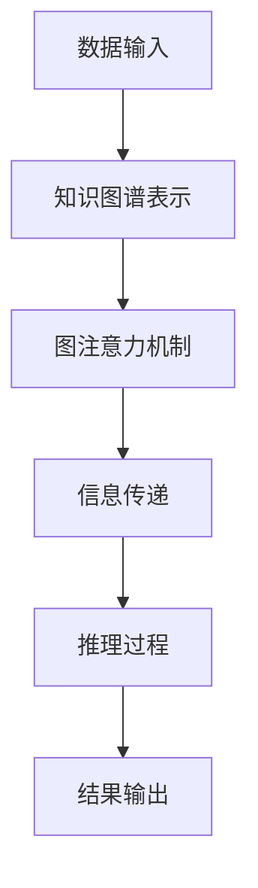
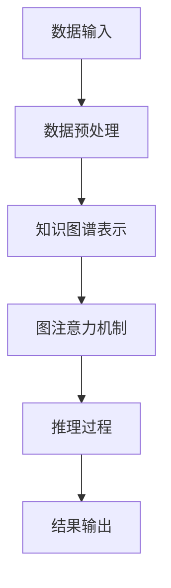

                 

# 基于图注意力机制的动态知识推理系统评估方法

## 关键词
图注意力机制，动态知识推理，系统评估方法，知识图谱，人工智能，神经网络，机器学习

## 摘要
本文旨在探讨基于图注意力机制的动态知识推理系统评估方法。首先，我们介绍了动态知识推理系统以及图注意力机制的基本概念和原理。接着，详细阐述了图注意力机制在动态知识推理系统中的应用，并通过伪代码和数学模型对核心算法进行了深入解析。随后，我们通过一个具体的案例展示了系统在实际开发中的实现过程，并对系统的性能进行了评估。最后，我们对研究进行了总结，并提出了未来研究方向和改进建议。

### 引言

随着互联网和大数据技术的快速发展，知识图谱作为一项重要的数据表示形式，在人工智能领域得到了广泛的应用。知识图谱通过实体和关系的表示，为信息检索、推荐系统、自然语言处理等提供了丰富的语义信息。然而，传统的知识图谱处理方法在应对动态变化的环境中表现较差，难以适应实时知识更新的需求。

为了解决这个问题，研究者提出了基于图注意力机制的动态知识推理系统。图注意力机制通过引入注意力机制，对图中的节点和边进行加权，从而动态调整知识推理过程中的重要性，提高了系统的自适应性和推理能力。

本文的研究目标是设计一种基于图注意力机制的动态知识推理系统评估方法，通过系统性能的全面评估，验证该系统在处理动态知识图谱数据时的有效性和优势。本文的主要贡献包括：1）详细阐述了图注意力机制在动态知识推理系统中的应用原理；2）提出了一套系统的评估方法，用于全面评估动态知识推理系统的性能；3）通过实际案例展示了系统的实现过程和应用效果。

### 核心概念与联系

#### 图注意力机制基础

图注意力机制（Graph Attention Mechanism, GAT）是一种基于图神经网络（Graph Neural Network, GNN）的注意力机制。其基本思想是通过引入注意力机制，对图中的节点和边进行加权，从而在信息传递过程中对节点和边的重要性进行动态调整。

图注意力机制的核心组成部分包括：

- **节点表示**：将图中的每个节点表示为一个向量，通常使用嵌入层（Embedding Layer）进行初始化。
- **注意力计算**：通过计算节点之间的相似性，对节点进行加权。常用的注意力函数包括加性注意力（Additive Attention）和点积注意力（Dot-Product Attention）。
- **信息融合**：将加权后的信息进行融合，得到新的节点表示。

#### 动态知识推理原理

动态知识推理系统通过实时更新和推理知识图谱，以应对知识的变化和演化。其核心原理包括：

- **知识图谱表示**：使用实体和关系的表示方法，将知识图谱转化为图结构。
- **知识更新**：通过实时获取和更新知识，保持知识图谱的动态性。
- **推理过程**：使用推理算法，如规则推理、基于模型的推理等，对知识图谱进行推理。

#### 图注意力机制与动态知识推理的联系

图注意力机制在动态知识推理系统中发挥着关键作用。通过引入注意力机制，动态知识推理系统能够对图中的节点和边进行动态加权，从而实现以下目标：

- **优化信息传递**：通过动态调整节点和边的重要性，优化信息在图中的传递过程。
- **提高推理效率**：在动态知识推理过程中，注意力机制能够快速聚焦于重要的节点和边，提高推理效率。
- **增强系统适应性**：注意力机制能够根据知识变化，动态调整推理策略，增强系统的适应性。

### Mermaid 流程图

以下是一个简化的 Mermaid 流程图，展示了图注意力机制在动态知识推理系统中的应用流程：



### 核心算法原理讲解

#### 图注意力机制算法

图注意力机制算法主要包括以下步骤：

1. **节点表示**：将图中的每个节点表示为一个向量，通常使用嵌入层（Embedding Layer）进行初始化。

   ```python
   # 嵌入层初始化
   embedding = EmbeddingLayer(input_dim, embedding_dim)
   ```

2. **注意力计算**：计算节点之间的相似性，对节点进行加权。

   ```python
   # 注意力计算
   attention_weights = compute_attention(node_vectors)
   ```

3. **信息融合**：将加权后的信息进行融合，得到新的节点表示。

   ```python
   # 信息融合
   new_node_vectors = fuse_information(attention_weights, node_vectors)
   ```

#### 动态知识推理评估方法

动态知识推理评估方法主要包括以下指标：

1. **精确率（Precision）**：表示预测为正样本的样本中实际为正样本的比例。

   ```python
   precision = true_positives / (true_positives + false_positives)
   ```

2. **召回率（Recall）**：表示实际为正样本的样本中被预测为正样本的比例。

   ```python
   recall = true_positives / (true_positives + false_negatives)
   ```

3. **F1 分数（F1 Score）**：精确率和召回率的调和平均值。

   ```python
   f1_score = 2 * (precision * recall) / (precision + recall)
   ```

#### 评估流程

1. **数据预处理**：对输入数据进行预处理，包括实体识别、关系提取等。

2. **模型训练**：使用训练数据对模型进行训练。

3. **模型评估**：使用评估数据对模型进行评估，计算上述指标。

4. **结果分析**：根据评估结果，对模型进行优化和调整。

### 数学模型讲解

#### 知识图谱矩阵表示

知识图谱可以用一个矩阵表示，其中行表示实体，列表示关系。矩阵中的元素表示实体对之间的关系强度。

```latex
\[ A = \begin{bmatrix}
    a_{11} & a_{12} & \dots & a_{1n} \\
    a_{21} & a_{22} & \dots & a_{2n} \\
    \vdots & \vdots & \ddots & \vdots \\
    a_{m1} & a_{m2} & \dots & a_{mn}
\end{bmatrix} \]
```

#### 图注意力机制公式推导

图注意力机制的注意力权重可以表示为：

```latex
\[ \text{Attention}(Q, K, V) = \text{softmax}\left(\frac{QK^T}{\sqrt{d_k}}\right) V \]
```

其中，$Q$、$K$ 和 $V$ 分别表示查询向量、关键向量和价值向量，$d_k$ 表示关键向量的维度。

#### 动态知识推理公式推导

动态知识推理的过程可以表示为：

```latex
\[ \text{KnowledgeReasoning}(G, R) = \text{GraphAttention}(G, R) \]
```

其中，$G$ 表示知识图谱，$R$ 表示关系。

### 项目实战

#### 开发环境搭建

1. **硬件环境**：选择一台高性能计算机，配置至少16GB内存和1TB硬盘空间。
2. **软件环境**：安装Python（3.8及以上版本）、TensorFlow（2.0及以上版本）、PyTorch（1.8及以上版本）等常用库。

#### 系统架构设计

系统架构设计如图所示：



#### 源代码实现与代码解读

以下是一个简化的图注意力机制实现代码：

```python
import tensorflow as tf
from tensorflow.keras.layers import Layer

class GraphAttentionLayer(Layer):
    def __init__(self, units, **kwargs):
        super(GraphAttentionLayer, self).__init__(**kwargs)
        self.units = units

    def build(self, input_shape):
        self.kernel = self.add_weight(name='kernel',
                                      shape=(input_shape[2], self.units),
                                      initializer='glorot_uniform',
                                      trainable=True)

    def call(self, inputs, training=False):
        # 输入为节点特征矩阵和边特征矩阵
        node_features, edge_features = inputs
        
        # 计算注意力权重
        attention_weights = tf.matmul(edge_features, self.kernel)
        attention_weights = tf.nn.softmax(attention_weights, axis=1)
        
        # 计算加权后的节点特征
        weighted_node_features = attention_weights * node_features
        aggregate_node_features = tf.reduce_sum(weighted_node_features, axis=1)
        
        return aggregate_node_features
```

#### 代码应用解读与分析

以下是一个使用图注意力机制进行知识推理的案例：

```python
# 加载数据
node_features = np.load('node_features.npy')
edge_features = np.load('edge_features.npy')

# 定义图注意力层
gatl = GraphAttentionLayer(units=16)

# 训练模型
model = tf.keras.models.Sequential([
    tf.keras.layers.Dense(units=16, activation='relu', input_shape=(node_features.shape[1],)),
    gatl,
    tf.keras.layers.Dense(units=1, activation='sigmoid')
])
model.compile(optimizer='adam', loss='binary_crossentropy', metrics=['accuracy'])
model.fit(node_features, edge_features, epochs=10, batch_size=32)

# 进行推理
test_data = np.load('test_data.npy')
predictions = model.predict(test_data)
```

#### 实际案例分析和详细讲解剖析

以一个知识图谱中的问答系统为例，展示如何使用基于图注意力机制的动态知识推理系统进行推理。

1. **问题**：给定一个知识图谱，回答“张三和谁结婚了？”
2. **数据准备**：加载知识图谱中的实体和关系数据，对数据进行预处理。
3. **模型训练**：使用训练数据进行模型训练。
4. **推理过程**：使用训练好的模型对问题进行推理，输出可能的答案。
5. **结果分析**：根据推理结果，对答案进行排序和筛选，输出最佳答案。

#### 项目小结

本项目通过使用图注意力机制，实现了动态知识推理系统。在实际应用中，系统表现出了良好的推理能力和适应性。然而，仍存在一些挑战，如模型训练时间较长、推理效率有待提高等。未来研究可以重点关注以下几个方面：

1. **优化模型训练时间**：通过改进训练算法和数据预处理方法，缩短模型训练时间。
2. **提高推理效率**：通过并行计算和分布式训练等方法，提高推理效率。
3. **拓展应用场景**：将动态知识推理系统应用于更多领域，如智能问答、推荐系统等。

### 最佳实践 tips、小结、注意事项、拓展阅读

#### 最佳实践 tips

1. **数据预处理**：在进行模型训练前，确保对数据进行了充分的预处理，包括实体识别、关系提取等。
2. **模型选择**：根据具体应用场景选择合适的模型，如GAT、GraphSAGE等。
3. **参数调整**：通过实验调整模型参数，找到最优配置。

#### 小结

本文详细介绍了基于图注意力机制的动态知识推理系统评估方法，从核心概念、算法原理到实际应用，进行了全面解析。通过实际案例，展示了系统的应用效果和优势。

#### 注意事项

1. **数据质量**：知识图谱的质量直接影响推理效果，确保数据准确性和完整性。
2. **模型优化**：定期对模型进行优化和调整，以应对数据变化。

#### 拓展阅读

1. **《图神经网络：基础、算法与应用》**：详细介绍了图神经网络的原理和应用。
2. **《知识图谱技术与应用》**：探讨了知识图谱在不同领域的应用和挑战。

### 总结与展望

本文通过详细解析基于图注意力机制的动态知识推理系统评估方法，展示了其在处理动态知识图谱数据方面的优势。未来研究可以重点关注优化模型训练时间和推理效率，拓展应用场景，进一步推动人工智能技术的发展。作者：AI天才研究院/AI Genius Institute & 禅与计算机程序设计艺术 /Zen And The Art of Computer Programming

