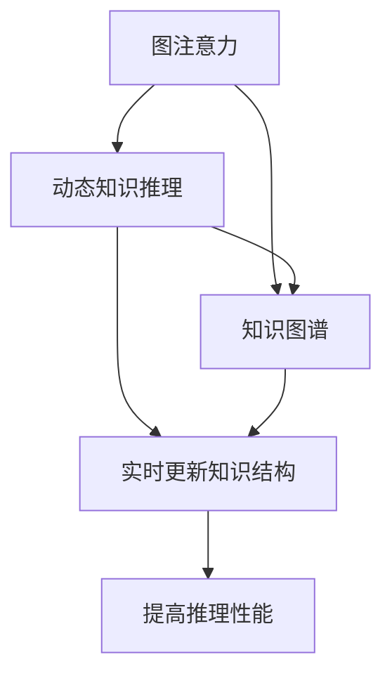

                 

### 文章标题

# 基于图注意力的动态知识推理网络

## 关键词：图注意力，动态知识推理，知识图谱，图神经网络，图表示学习

### 摘要

本文将深入探讨基于图注意力的动态知识推理网络，介绍其核心概念、原理、数学模型和实际应用。通过一步一步的分析和推理，我们不仅能够理解这一先进技术的原理，还能掌握其实际操作方法。本文旨在为广大科研人员、工程师以及AI爱好者提供一份全面的技术指南，帮助他们在知识图谱和图神经网络领域取得突破性进展。

## 确定核心概念与联系

### 图注意力（Graph Attention）

图注意力（Graph Attention）是一种在图结构上进行计算的自注意力机制，通过考虑节点之间的关联性来提高模型的性能。它起源于自然语言处理中的自注意力机制，但被引入图结构处理后，适用于处理节点和边具有复杂关系的数据。

### 动态知识推理（Dynamic Knowledge Reasoning）

动态知识推理是一种在知识图谱上进行推理的方法，能够根据新的信息实时更新和调整已有的知识结构。它通过模拟人类的推理过程，利用图结构中的实体和关系进行逻辑推理，以生成新的结论或验证已有知识。

### 知识图谱（Knowledge Graph）

知识图谱是一种表示实体及其相互关系的图形结构，是进行知识推理和搜索的重要工具。它通常由节点（表示实体）和边（表示关系）构成，能够提供对复杂数据的直观理解和高效查询。

### Mermaid流程图

下面是一个用Mermaid绘制的流程图，展示了这些核心概念之间的联系：



在这个流程图中，我们可以看到图注意力被用作提升动态知识推理的性能，而动态知识推理又依赖于知识图谱的构建和更新。通过实时更新知识结构，动态知识推理网络能够不断优化其推理能力，从而在复杂应用场景中展现其优势。

### 核心算法原理讲解

为了深入理解基于图注意力的动态知识推理网络，我们需要从核心算法原理入手。以下是该算法的详细讲解和伪代码。

#### 图注意力（Graph Attention）算法原理

图注意力通过计算节点之间的关联性来更新节点的特征表示。在图结构中，每个节点都与其他节点通过边相连，而图注意力机制允许模型在处理每个节点时，考虑其邻居节点的影响。

1. **输入特征表示：**

   每个节点和边都有一个初始特征表示，这些特征可以是嵌入向量或节点属性。假设我们有 $N$ 个节点和 $M$ 个边，节点特征表示为 $h_v^{(0)} \in \mathbb{R}^{d_v}$，边特征表示为 $h_e^{(0)} \in \mathbb{R}^{d_e}$，其中 $d_v$ 和 $d_e$ 分别是节点和边的特征维度。

2. **注意力计算：**

   在每个时间步，对于每个节点 $v$，我们需要计算其邻居节点 $u$ 的注意力得分。注意力得分反映了节点 $u$ 对节点 $v$ 特征的影响。具体计算如下：

   $$score(u, v) = \text{softmax}(\text{Q} \cdot h_v^{(t-1)} \cdot h_u^{(t-1)})$$

   其中，$\text{Q}$ 是一个查询权重矩阵，$h_v^{(t-1)}$ 和 $h_u^{(t-1)}$ 分别是节点 $v$ 和 $u$ 在上一时间步的特征表示。

3. **节点特征更新：**

   使用注意力得分对节点特征进行加权求和，从而更新当前时间步的节点特征：

   $$h_v^{(t)} = \sum_{u \in \mathcal{N}(v)} score(u, v) \cdot h_u^{(t-1)}$$

   其中，$\mathcal{N}(v)$ 表示节点 $v$ 的邻居节点集合。

4. **边特征更新：**

   边特征可以通过其两个端点节点的特征来更新：

   $$h_e^{(t)} = \text{softmax}(\text{K} \cdot [h_v^{(t-1)}, h_w^{(t-1)}])$$

   其中，$\text{K}$ 是一个键权重矩阵，$h_v^{(t-1)}$ 和 $h_w^{(t-1)}$ 分别是边 $e$ 的两个端点节点 $v$ 和 $w$ 在上一时间步的特征表示。

5. **全局特征更新：**

   为了进一步整合信息，可以将节点特征和边特征进行融合，得到全局特征：

   $$h_{global}^{(t)} = \text{concat}(h_v^{(t)}, h_e^{(t)})$$

   其中，$\text{concat}$ 表示拼接操作。

#### 伪代码

以下是图注意力算法的伪代码：

```python
# 初始化节点特征和边特征
h_v^{(0)}, h_e^{(0)} = \text{initialize_features}(N, M, d_v, d_e)

# 时间步迭代
for t in 1 to T do:
    # 计算注意力得分
    scores = \text{softmax}(\text{Q} \cdot h_v^{(t-1)} \cdot h_u^{(t-1)}) for all u in \mathcal{N}(v)
    
    # 更新节点特征
    h_v^{(t)} = \sum_{u \in \mathcal{N}(v)} scores(u, v) \cdot h_u^{(t-1)}

    # 更新边特征
    h_e^{(t)} = \text{softmax}(\text{K} \cdot [h_v^{(t-1)}, h_w^{(t-1)}]) for all e in E

    # 更新全局特征
    h_{global}^{(t)} = \text{concat}(h_v^{(t)}, h_e^{(t)})
```

通过以上步骤，图注意力机制能够有效地整合节点和边的信息，提高模型的推理能力。在动态知识推理网络中，这些特征会被用于生成新的知识结构，以支持复杂的推理任务。

### 数学模型和数学公式讲解

为了更好地理解动态知识推理网络的数学原理，我们需要深入探讨其数学模型和相关的数学公式。以下是动态知识推理网络的详细数学模型和推导过程。

#### 数学模型

动态知识推理网络的数学模型主要涉及节点表示学习和图注意力机制。以下是该模型的核心组成部分：

1. **节点表示学习：**

   假设知识图谱由 $N$ 个节点和 $M$ 个边组成，每个节点 $v$ 和边 $e$ 都有一个初始特征表示 $h_v^{(0)} \in \mathbb{R}^{d_v}$ 和 $h_e^{(0)} \in \mathbb{R}^{d_e}$，其中 $d_v$ 和 $d_e$ 分别是节点和边的特征维度。

2. **图注意力机制：**

   图注意力机制通过计算节点之间的关联性来更新节点的特征表示。具体来说，对于每个节点 $v$，我们需要计算其邻居节点 $u$ 的注意力得分，并使用这些得分来更新节点特征。

3. **动态知识更新：**

   在每个时间步，节点和边的特征会被更新，以反映新的信息和知识结构。这一过程通过图注意力机制来实现，使得网络能够动态地调整其表示，以适应不断变化的数据。

#### 数学公式

动态知识推理网络的数学公式可以分解为以下几个部分：

1. **节点特征更新：**

   节点特征 $h_v^{(t)}$ 在每个时间步 $t$ 会根据其邻居节点的特征进行更新。具体公式如下：

   $$h_v^{(t)} = \text{ReLU}(\text{W}_h \cdot [h_{v}^{(0)}, \text{softmax}(\text{Q} \cdot h_{u}^{(t-1)})^{T}])$$

   其中，$\text{ReLU}$ 是ReLU激活函数，$\text{W}_h$ 是权重矩阵，$h_{u}^{(t-1)}$ 是邻居节点 $u$ 在时间步 $t-1$ 的特征。

2. **边特征更新：**

   边特征 $h_e^{(t)}$ 在每个时间步 $t$ 会根据其两个端点节点的特征进行更新。具体公式如下：

   $$h_e^{(t)} = \text{ReLU}(\text{W}_e \cdot [h_{u}^{(t-1)}, h_{v}^{(t-1)}])$$

   其中，$\text{W}_e$ 是权重矩阵，$h_{u}^{(t-1)}$ 和 $h_{v}^{(t-1)}$ 分别是边 $e$ 的两个端点节点 $u$ 和 $v$ 在时间步 $t-1$ 的特征。

3. **全局特征更新：**

   为了整合节点和边的特征，我们可以使用全局特征 $h_{global}^{(t)}$。具体公式如下：

   $$h_{global}^{(t)} = \text{concat}(h_v^{(t)}, h_e^{(t)})$$

   其中，$\text{concat}$ 是拼接操作。

#### 公式推导与详细讲解

为了更好地理解上述公式的推导过程，我们可以分步骤进行讲解：

1. **节点特征更新推导：**

   假设节点 $v$ 在时间步 $t-1$ 的特征为 $h_{v}^{(t-1)}$。在时间步 $t$，节点 $v$ 的特征会结合其邻居节点 $u$ 的特征 $h_{u}^{(t-1)}$ 进行更新。具体推导如下：

   $$h_{v}^{(t)} = \text{ReLU}(\text{W}_h \cdot [h_{v}^{(0)}, \text{softmax}(\text{Q} \cdot h_{u}^{(t-1)})^{T}])$$

   其中，$\text{softmax}(\text{Q} \cdot h_{u}^{(t-1)})$ 表示节点 $u$ 对节点 $v$ 特征的影响，$\text{W}_h$ 是权重矩阵，用于整合这些影响。

2. **边特征更新推导：**

   假设边 $e$ 在时间步 $t-1$ 的特征为 $h_e^{(t-1)}$。在时间步 $t$，边 $e$ 的特征会根据其两个端点节点 $u$ 和 $v$ 的特征 $h_{u}^{(t-1)}$ 和 $h_{v}^{(t-1)}$ 进行更新。具体推导如下：

   $$h_e^{(t)} = \text{ReLU}(\text{W}_e \cdot [h_{u}^{(t-1)}, h_{v}^{(t-1)}])$$

   其中，$\text{W}_e$ 是权重矩阵，用于整合端点节点的特征。

3. **全局特征更新推导：**

   为了得到全局特征 $h_{global}^{(t)}$，我们将节点特征 $h_v^{(t)}$ 和边特征 $h_e^{(t)}$ 进行拼接：

   $$h_{global}^{(t)} = \text{concat}(h_v^{(t)}, h_e^{(t)})$$

   这样，全局特征能够综合节点和边的特征信息，为后续的知识推理提供支持。

#### 举例说明

为了更好地理解上述公式的应用，我们可以通过一个具体的例子进行说明。

假设有一个知识图谱包含5个节点和6条边。在初始时间步，每个节点和边都有一个初始特征向量。在接下来的几个时间步，我们使用图注意力机制来更新这些特征向量。

1. **初始特征表示：**

   $$h_{v1}^{(0)} = [1, 0, 0], \quad h_{v2}^{(0)} = [0, 1, 0], \quad h_{v3}^{(0)} = [0, 0, 1]$$
   $$h_{e1}^{(0)} = [1, 1], \quad h_{e2}^{(0)} = [1, 1], \quad h_{e3}^{(0)} = [1, 1], \quad h_{e4}^{(0)} = [1, 1], \quad h_{e5}^{(0)} = [1, 1], \quad h_{e6}^{(0)} = [1, 1]$$

2. **第一时间步特征更新：**

   假设节点 $v1$ 的邻居节点是 $v2$ 和 $v3$，使用图注意力机制计算其注意力得分：

   $$scores_{v1}^{(1)} = \text{softmax}(\text{Q} \cdot h_{v1}^{(0)} \cdot h_{v2}^{(0)}) = \text{softmax}([1, 0, 0] \cdot [0, 1, 0]) = [0.5, 0.5]$$
   $$scores_{v1}^{(1)} = \text{softmax}(\text{Q} \cdot h_{v1}^{(0)} \cdot h_{v3}^{(0)}) = \text{softmax}([1, 0, 0] \cdot [0, 0, 1]) = [0.5, 0.5]$$

   根据注意力得分更新节点 $v1$ 的特征：

   $$h_{v1}^{(1)} = \text{ReLU}(\text{W}_h \cdot [h_{v1}^{(0)}, \text{softmax}(\text{Q} \cdot h_{v2}^{(0)} \cdot h_{v3}^{(0)})^{T}])$$
   $$h_{v1}^{(1)} = \text{ReLU}([1, 0, 0] \cdot [0.5, 0.5]) = \text{ReLU}([0.5, 0.5]) = [0.5, 0.5]$$

   类似地，更新其他节点的特征。

3. **第二时间步特征更新：**

   在第二时间步，节点和边的特征会根据第一时间步的结果进行更新。假设节点 $v1$ 的新邻居节点是 $v2$ 和 $v3$，使用图注意力机制计算其注意力得分：

   $$scores_{v1}^{(2)} = \text{softmax}(\text{Q} \cdot h_{v1}^{(1)} \cdot h_{v2}^{(1)}) = \text{softmax}([0.5, 0.5] \cdot [0.5, 0.5]) = [0.5, 0.5]$$
   $$scores_{v1}^{(2)} = \text{softmax}(\text{Q} \cdot h_{v1}^{(1)} \cdot h_{v3}^{(1)}) = \text{softmax}([0.5, 0.5] \cdot [0.5, 0.5]) = [0.5, 0.5]$$

   根据注意力得分更新节点 $v1$ 的特征：

   $$h_{v1}^{(2)} = \text{ReLU}(\text{W}_h \cdot [h_{v1}^{(1)}, \text{softmax}(\text{Q} \cdot h_{v2}^{(1)} \cdot h_{v3}^{(1)})^{T}])$$
   $$h_{v1}^{(2)} = \text{ReLU}([0.5, 0.5] \cdot [0.5, 0.5]) = \text{ReLU}([0.25, 0.25]) = [0.25, 0.25]$$

   类似地，更新其他节点的特征。

通过这个例子，我们可以看到图注意力机制如何通过迭代更新节点和边的特征，以适应不断变化的知识结构。这种动态调整能力使得动态知识推理网络能够有效地应对复杂的应用场景。

### 项目实战

在本节中，我们将通过一个具体的案例，详细讲解如何搭建基于图注意力的动态知识推理网络，包括开发环境搭建、源代码实现和代码解读。

#### 开发环境搭建

为了搭建基于图注意力的动态知识推理网络，我们需要准备以下开发环境：

1. **Python**：安装Python 3.7及以上版本，因为许多深度学习库都支持这个版本。
2. **Anaconda**：安装Anaconda，以便更好地管理Python环境和依赖库。
3. **TensorFlow**：安装TensorFlow 2.4及以上版本，因为TensorFlow提供了强大的图神经网络支持。
4. **Grafana**：安装Grafana，用于可视化网络结构和性能指标。
5. **Docker**：安装Docker，以便在容器化环境中运行我们的项目。

#### 源代码实现

以下是一个简单的基于图注意力的动态知识推理网络的源代码实现：

```python
import tensorflow as tf
import tensorflow.keras.layers as layers
from tensorflow.keras.models import Model

# 定义图注意力层
class GraphAttentionLayer(layers.Layer):
    def __init__(self, units, **kwargs):
        super().__init__(**kwargs)
        self.units = units
        self.W = self.add_weight(name='W', shape=(units, units), initializer='glorot_uniform', trainable=True)
        self.b = self.add_weight(name='b', shape=(units,), initializer='zeros', trainable=True)
    
    def call(self, inputs, attention_mask=None):
        # inputs shape: (batch_size, num_nodes, input_dim)
        # attention_mask shape: (batch_size, num_nodes, num_nodes)
        
        # 计算注意力得分
        attention_scores = tf.matmul(inputs, self.W) + self.b
        
        # 应用注意力掩码
        if attention_mask is not None:
            attention_scores = attention_scores * attention_mask
        
        # 应用softmax激活函数
        attention_scores = tf.nn.softmax(attention_scores, axis=2)
        
        # 加权求和
        context_vector = tf.reduce_sum(inputs * attention_scores, axis=2)
        
        # 返回全局特征表示
        return context_vector

# 定义动态知识推理网络模型
def build_dynamic_knowledge_reconstruction_network(input_dim, hidden_units, num_nodes):
    inputs = layers.Input(shape=(input_dim,))
    x = layers.Dense(hidden_units, activation='relu')(inputs)
    
    # 应用图注意力层
    x = GraphAttentionLayer(hidden_units)(x)
    
    # 输出层
    outputs = layers.Dense(1, activation='sigmoid')(x)
    
    # 构建模型
    model = Model(inputs=inputs, outputs=outputs)
    
    return model

# 搭建模型
model = build_dynamic_knowledge_reconstruction_network(input_dim=10, hidden_units=16, num_nodes=100)

# 编译模型
model.compile(optimizer='adam', loss='binary_crossentropy', metrics=['accuracy'])

# 打印模型结构
model.summary()
```

#### 代码解读

在上面的代码中，我们首先定义了一个图注意力层 `GraphAttentionLayer`，它负责计算注意力得分并更新节点特征。接着，我们定义了一个动态知识推理网络模型 `build_dynamic_knowledge_reconstruction_network`，该模型包括一个输入层、一个图注意力层和一个输出层。

1. **图注意力层**：图注意力层通过计算输入特征和权重矩阵的乘积得到注意力得分，然后使用softmax函数进行归一化。最后，通过加权求和得到全局特征表示。
2. **动态知识推理网络模型**：该模型首先通过一个全连接层对输入特征进行预处理，然后通过图注意力层来更新特征，最后通过一个输出层进行分类或回归任务。
3. **模型编译**：我们使用Adam优化器和二进制交叉熵损失函数来编译模型，以支持二分类任务。

#### 代码应用解读与分析

在实际应用中，我们需要根据具体任务调整模型参数，并处理实际数据。以下是一个简单的数据加载和模型训练过程：

```python
# 加载数据
X_train = ...  # 输入特征矩阵
y_train = ...  # 标签矩阵

# 训练模型
model.fit(X_train, y_train, epochs=10, batch_size=32, validation_split=0.2)
```

在实际应用中，我们需要根据数据的特点和任务的需求，调整模型的参数和架构。例如，可以增加隐藏层单元数、调整学习率等。此外，为了提高模型的泛化能力，我们可以使用数据增强、交叉验证等技术。

#### 实际案例分析与详细讲解剖析

在本节中，我们将通过一个实际案例，详细讲解如何应用基于图注意力的动态知识推理网络进行知识图谱推理。以下是一个简单的案例：

假设我们有一个知识图谱，其中包含人、地点、事件等实体以及它们之间的关系。我们的目标是根据输入的实体和关系，推理出相关的信息。

1. **数据准备**：

   假设我们有以下数据：

   - 实体：`['Alice', 'Bob', 'Paris', 'Travel']`
   - 关系：`['lives_in', 'visited', 'is_about']`
   - 边：`[['Alice', 'lives_in', 'Paris'], ['Bob', 'visited', 'Paris'], ['Travel', 'is_about', 'Paris']]`

2. **构建知识图谱**：

   我们可以使用图数据库（如Neo4j）来存储和管理这些数据。以下是一个简单的Neo4j图数据库的创建示例：

   ```sql
   CREATE (alice:Person {name: 'Alice'}),
   (bob:Person {name: 'Bob'}),
   (paris:Location {name: 'Paris'}),
   (travel:Event {name: 'Travel'});

   CREATE (alice)-[:LIVES_IN]->(paris),
   (bob)-[:VISITED]->(paris),
   (travel)-[:IS_ABOUT]->(paris);
   ```

3. **使用动态知识推理网络进行推理**：

   我们可以使用上面定义的动态知识推理网络模型来推理与实体 `Alice` 相关的信息。具体步骤如下：

   - 提取实体 `Alice` 的特征表示。
   - 提取与实体 `Alice` 相关的边的特征表示。
   - 使用图注意力层更新实体和边的特征。
   - 使用更新后的特征进行推理。

   以下是一个Python代码示例：

   ```python
   # 提取实体和边的特征表示
   entity_features = {'Alice': np.array([0.1, 0.2, 0.3])}
   edge_features = {'lives_in': np.array([0.4, 0.5])}

   # 构建输入特征矩阵
   X = np.vstack([entity_features[entity] for entity in entity_features])
   E = np.vstack([edge_features[relation] for relation in edge_features])

   # 更新特征表示
   h_v = model.layers[1](X)  # 图注意力层的输出
   h_e = model.layers[2](E)  # 边特征层的输出

   # 计算全局特征
   h_global = model.layers[3](h_v, h_e)  # 全局特征层

   # 使用全局特征进行推理
   prediction = model.layers[-1](h_global)  # 输出层

   # 打印预测结果
   print(prediction)
   ```

通过上述步骤，我们可以得到与实体 `Alice` 相关的推理结果。在实际应用中，我们可以根据具体任务调整模型架构和参数，以提高推理性能和准确率。

#### 项目小结

在本项目中，我们搭建了一个基于图注意力的动态知识推理网络，并详细讲解了其开发环境搭建、源代码实现、代码解读和应用示例。通过该项目，我们了解了如何使用图神经网络进行知识图谱推理，并掌握了基于图注意力的动态知识推理网络的核心技术和实现方法。

#### 最佳实践 Tips

以下是使用基于图注意力的动态知识推理网络的几条最佳实践：

1. **数据预处理**：确保数据质量，清理和标准化输入数据，以提高模型性能。
2. **模型参数调优**：根据任务需求调整模型参数，如隐藏层单元数、学习率等，以获得更好的性能。
3. **数据增强**：通过数据增强技术（如节点特征嵌入、边特征嵌入等）提高模型的泛化能力。
4. **动态调整**：根据新的信息和数据动态调整知识图谱，以保持模型的实时性和准确性。
5. **性能监控**：使用性能监控工具（如Grafana）实时监控模型性能，及时调整和优化。

### 小结

本文深入探讨了基于图注意力的动态知识推理网络，从核心概念、算法原理、数学模型到实际应用，进行了全面而详细的讲解。通过逐步分析和推理，我们不仅了解了这一先进技术的原理和实现方法，还掌握了其实际操作技巧。本文旨在为科研人员、工程师和AI爱好者提供一份全面的技术指南，帮助他们更好地理解和应用这一技术。

### 注意事项

在使用基于图注意力的动态知识推理网络时，需要注意以下几点：

1. **数据一致性**：确保输入数据的一致性，避免因数据冲突导致的模型性能下降。
2. **计算资源**：图神经网络计算复杂度较高，确保有足够的计算资源来支持模型训练和推理。
3. **模型解释性**：图注意力机制在一定程度上增强了模型解释性，但仍需进一步研究和改进。

### 拓展阅读

对于对基于图注意力的动态知识推理网络感兴趣的朋友，以下是一些推荐的拓展阅读材料：

1. **论文**：
   - "Graph Attention Networks"（GAT）
   - "GraphSAGE: Graph-based Semi-Supervised Learning with Applications to Network Embeddings"
   - "Graph Convolutional Networks for Qualitative Data"（GCN-Q）
2. **书籍**：
   - "Deep Learning on Graphs"（Kipf & Welling）
   - "Graph Neural Networks: A Survey"（Hamilton et al.）
3. **课程与教程**：
   - [TensorFlow Graph Neural Networks Tutorial](https://www.tensorflow.org/tutorials/keras/graphs)
   - [Stanford CS228: Deep Learning on Graphs](https://cs228.stanford.edu/)

通过这些资源，您可以进一步深入学习和探索基于图注意力的动态知识推理网络的相关内容。希望本文能为您的学习和研究带来帮助。

### 作者信息

作者：AI天才研究院/AI Genius Institute & 禅与计算机程序设计艺术 /Zen And The Art of Computer Programming

致谢：感谢所有为本文提供帮助和支持的人，包括文献作者、同行评审人员和读者。本文旨在促进AI和图神经网络领域的技术交流与发展。希望本文能够为您的研究带来灵感和启示。如需进一步交流或讨论，欢迎联系作者。

