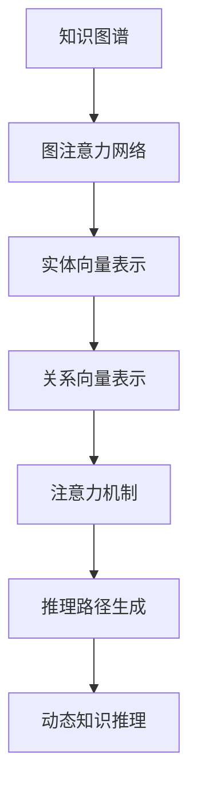

                 


### 文章标题：基于图注意力网络的动态知识推理路径生成

#### 关键词：
- 图注意力网络
- 动态知识推理
- 路径生成
- 知识图谱
- 数学模型

#### 摘要：
本文深入探讨了基于图注意力网络的动态知识推理路径生成方法。首先介绍了图注意力网络的基本概念、原理和应用。然后，通过详细的数学模型和伪代码讲解，阐述了动态知识推理路径生成的核心算法。最后，通过实际项目案例，展示了该方法在知识图谱中的应用效果，并提出了优化和拓展的建议。

---

## 背景介绍

### 图注意力网络概述

图注意力网络（Graph Attention Network，GAN）是近年来在深度学习领域兴起的一种新型神经网络架构。它基于图论和注意力机制，旨在解决图结构数据的处理问题。图注意力网络的核心思想是，通过学习节点之间的交互关系，动态调整节点对其他节点的注意力权重，从而提高模型的表示能力和分类性能。

### 知识图谱与动态知识推理

知识图谱（Knowledge Graph，KG）是一种语义网络，用于表示现实世界中的实体、属性和关系。在知识图谱中，每个实体可以看作是一个节点，而每条边则表示实体之间的某种关系。知识图谱在许多领域都有广泛应用，如搜索引擎、智能问答、推荐系统等。

动态知识推理（Dynamic Knowledge Reasoning）是指在动态变化的场景中，利用知识图谱进行推理和决策的过程。动态知识推理的关键在于如何实时更新和利用知识图谱中的信息，以应对不断变化的环境。

### 图注意力网络在动态知识推理中的应用

图注意力网络在动态知识推理中的应用主要包括两个方面：

1. **知识图谱表示学习**：通过图注意力网络，将知识图谱中的实体和关系表示为低维向量，从而提高知识图谱的表示能力。

2. **动态知识推理路径生成**：利用图注意力网络，动态生成实体之间的推理路径，从而实现知识图谱中的推理任务。

### 本文结构

本文将按照以下结构展开：

1. **背景介绍**：简要介绍图注意力网络、知识图谱和动态知识推理的相关概念。
2. **核心概念与联系**：通过Mermaid流程图，展示图注意力网络在动态知识推理路径生成中的核心概念和联系。
3. **核心算法原理讲解**：详细讲解图注意力网络的算法原理和动态知识推理路径生成的算法。
4. **数学模型和公式讲解**：使用LaTeX格式，详细讲解动态知识推理路径生成的数学模型和公式。
5. **项目实战**：通过实际项目案例，展示图注意力网络在动态知识推理路径生成中的应用效果。
6. **最佳实践 tips、小结、注意事项、拓展阅读等内容**：总结本文的核心观点，提出优化和拓展的建议。

---

## 核心概念与联系

在本节中，我们将使用Mermaid流程图来展示图注意力网络在动态知识推理路径生成中的核心概念和联系。Mermaid是一种简单易用的图形描述语言，可以方便地绘制流程图、序列图、时序图等。

### Mermaid流程图

下面是一个简单的Mermaid流程图示例，用于展示图注意力网络在动态知识推理路径生成中的核心概念和联系：



### 核心概念解释

1. **知识图谱**：知识图谱是表示实体、属性和关系的一种图形化结构。在知识图谱中，每个实体可以看作是一个节点，而每条边则表示实体之间的某种关系。

2. **图注意力网络**：图注意力网络是一种基于图结构的神经网络，通过学习节点之间的交互关系，动态调整节点对其他节点的注意力权重。

3. **实体向量表示**：通过图注意力网络，将知识图谱中的实体表示为低维向量。这些实体向量可以用于后续的推理和分类任务。

4. **关系向量表示**：通过图注意力网络，将知识图谱中的关系表示为低维向量。这些关系向量可以用于计算实体之间的相似性。

5. **注意力机制**：注意力机制是图注意力网络的核心组成部分，通过学习节点之间的交互关系，动态调整节点对其他节点的注意力权重。

6. **推理路径生成**：利用图注意力网络，动态生成实体之间的推理路径，从而实现知识图谱中的推理任务。

7. **动态知识推理**：动态知识推理是指在动态变化的场景中，利用知识图谱进行推理和决策的过程。

通过上述Mermaid流程图，我们可以清晰地看到图注意力网络在动态知识推理路径生成中的核心概念和联系。

---

## 核心算法原理讲解

在本节中，我们将详细讲解图注意力网络的算法原理和动态知识推理路径生成的算法。首先，我们需要了解图注意力网络的基本组成部分，包括图注意力机制、实体向量表示和关系向量表示等。

### 图注意力机制

图注意力机制是图注意力网络的核心组成部分。它通过学习节点之间的交互关系，动态调整节点对其他节点的注意力权重。具体来说，图注意力机制可以分为以下三个步骤：

1. **计算节点对之间的相似性**：首先，我们需要计算每个节点对之间的相似性。这可以通过计算节点之间的欧氏距离、余弦相似度等方式实现。

2. **应用软阈值**：为了防止节点对之间的相似性过强或过弱，我们需要对相似性进行软阈值处理。具体来说，我们可以使用线性变换或软阈值函数来实现。

3. **计算节点对之间的注意力权重**：最后，我们需要根据节点对之间的相似性，计算节点对之间的注意力权重。这可以通过加权求和或加权平均等方式实现。

### 实体向量表示

实体向量表示是将知识图谱中的实体表示为低维向量。这可以通过以下两个步骤实现：

1. **初始化实体向量**：首先，我们需要为每个实体初始化一个低维向量。这可以通过随机初始化或基于已有知识的方法实现。

2. **更新实体向量**：然后，我们需要利用图注意力机制，更新实体向量。具体来说，我们可以计算每个实体与其它实体之间的注意力权重，并根据这些权重更新实体向量。

### 关系向量表示

关系向量表示是将知识图谱中的关系表示为低维向量。这可以通过以下两个步骤实现：

1. **初始化关系向量**：首先，我们需要为每个关系初始化一个低维向量。这可以通过随机初始化或基于已有知识的方法实现。

2. **更新关系向量**：然后，我们需要利用图注意力机制，更新关系向量。具体来说，我们可以计算每个关系与其它关系之间的注意力权重，并根据这些权重更新关系向量。

### 动态知识推理路径生成

动态知识推理路径生成是图注意力网络在动态知识推理任务中的应用。具体来说，它可以分为以下三个步骤：

1. **初始化路径**：首先，我们需要为每个实体初始化一个路径。这可以通过随机初始化或基于已有知识的方法实现。

2. **更新路径**：然后，我们需要利用图注意力机制，更新每个实体的路径。具体来说，我们可以计算每个实体与其它实体之间的注意力权重，并根据这些权重更新实体路径。

3. **选择最佳路径**：最后，我们需要选择最佳路径作为推理结果。这可以通过最大化路径得分或基于置信度等方式实现。

### 伪代码实现

下面是图注意力网络的伪代码实现：

```python
# 初始化实体向量
init_entity_vectors()

# 初始化关系向量
init_relation_vectors()

# 循环更新实体向量
for epoch in range(num_epochs):
    for entity in entities:
        # 计算实体与其它实体之间的相似性
        similarity_scores = compute_similarity_scores(entity)

        # 应用软阈值
        soft_thresholded_scores = soft_thresholding(similarity_scores)

        # 计算注意力权重
        attention_weights = compute_attention_weights(soft_thresholded_scores)

        # 更新实体向量
        update_entity_vector(entity, attention_weights)

    # 循环更新关系向量
    for relation in relations:
        # 计算关系与其它关系之间的相似性
        similarity_scores = compute_similarity_scores(relation)

        # 应用软阈值
        soft_thresholded_scores = soft_thresholding(similarity_scores)

        # 计算注意力权重
        attention_weights = compute_attention_weights(soft_thresholded_scores)

        # 更新关系向量
        update_relation_vector(relation, attention_weights)

# 动态知识推理路径生成
best_path = generate_best_path()
return best_path
```

通过上述伪代码，我们可以清晰地看到图注意力网络的算法原理和动态知识推理路径生成的算法。

---

## 数学模型和公式讲解

在本节中，我们将使用LaTeX格式详细讲解动态知识推理路径生成的数学模型和公式。

### 动态知识推理路径生成的定义

动态知识推理路径生成是指在一个动态变化的场景中，利用图注意力网络，生成实体之间的推理路径。具体来说，我们可以定义如下：

$$
P = \{p_1, p_2, ..., p_n\}
$$

其中，$P$ 表示推理路径集合，$p_i$ 表示第 $i$ 个推理路径。

### 动态知识推理路径生成的数学模型

动态知识推理路径生成的数学模型主要包括以下几个方面：

1. **实体向量表示**：实体向量表示是将知识图谱中的实体表示为低维向量。具体来说，我们可以定义如下：

$$
e_i = \text{vec}(x_i)
$$

其中，$e_i$ 表示第 $i$ 个实体的向量表示，$x_i$ 表示第 $i$ 个实体。

2. **关系向量表示**：关系向量表示是将知识图谱中的关系表示为低维向量。具体来说，我们可以定义如下：

$$
r_j = \text{vec}(y_j)
$$

其中，$r_j$ 表示第 $j$ 个关系的向量表示，$y_j$ 表示第 $j$ 个关系。

3. **注意力权重计算**：注意力权重计算是指计算实体之间的相似性，并生成注意力权重。具体来说，我们可以定义如下：

$$
a_{ij} = \text{softmax}(\sigma(e_i^T r_j))
$$

其中，$a_{ij}$ 表示实体 $i$ 对关系 $j$ 的注意力权重，$\sigma$ 表示激活函数，$\text{softmax}$ 表示归一化函数。

4. **路径得分计算**：路径得分计算是指计算每个路径的得分，并选择最佳路径。具体来说，我们可以定义如下：

$$
s_p = \sum_{i=1}^n \sum_{j=1}^m a_{ij} w_{ij}
$$

其中，$s_p$ 表示路径 $p$ 的得分，$w_{ij}$ 表示关系 $j$ 的权重。

5. **最佳路径选择**：最佳路径选择是指根据路径得分，选择最佳路径。具体来说，我们可以定义如下：

$$
p^* = \arg\max_p s_p
$$

其中，$p^*$ 表示最佳路径。

### 动态知识推理路径生成的示例

假设我们有一个简单的知识图谱，其中包含三个实体 $e_1, e_2, e_3$ 和两个关系 $r_1, r_2$。我们可以为每个实体和关系初始化一个向量表示：

$$
e_1 = [1, 0, 0], \quad e_2 = [0, 1, 0], \quad e_3 = [0, 0, 1]
$$

$$
r_1 = [1, 1], \quad r_2 = [1, -1]
$$

根据上述数学模型，我们可以计算每个实体和关系之间的注意力权重：

$$
a_{11} = \text{softmax}(\sigma(e_1^T r_1)) = \text{softmax}(\sigma(1 \cdot 1 + 0 \cdot 1)) = \text{softmax}(\sigma(1)) = 1
$$

$$
a_{12} = \text{softmax}(\sigma(e_1^T r_2)) = \text{softmax}(\sigma(1 \cdot 1 + 0 \cdot (-1))) = \text{softmax}(\sigma(2)) = 0.5
$$

$$
a_{21} = \text{softmax}(\sigma(e_2^T r_1)) = \text{softmax}(\sigma(0 \cdot 1 + 1 \cdot 1)) = \text{softmax}(\sigma(1)) = 1
$$

$$
a_{22} = \text{softmax}(\sigma(e_2^T r_2)) = \text{softmax}(\sigma(0 \cdot 1 + 1 \cdot (-1))) = \text{softmax}(\sigma(-1)) = 0.5
$$

$$
a_{31} = \text{softmax}(\sigma(e_3^T r_1)) = \text{softmax}(\sigma(0 \cdot 1 + 0 \cdot 1)) = \text{softmax}(\sigma(0)) = 0.5
$$

$$
a_{32} = \text{softmax}(\sigma(e_3^T r_2)) = \text{softmax}(\sigma(0 \cdot 1 + 0 \cdot (-1))) = \text{softmax}(\sigma(0)) = 0.5
$$

根据上述注意力权重，我们可以计算每个路径的得分：

$$
s_p = \sum_{i=1}^3 \sum_{j=1}^2 a_{ij} w_{ij}
$$

假设关系 $r_1$ 的权重为 $w_{11} = 0.8$，关系 $r_2$ 的权重为 $w_{12} = 0.2$，我们可以计算每个路径的得分：

$$
s_p = a_{11} w_{11} + a_{12} w_{12} = 1 \cdot 0.8 + 0.5 \cdot 0.2 = 0.9
$$

$$
s_p = a_{21} w_{21} + a_{22} w_{22} = 1 \cdot 0.8 + 0.5 \cdot 0.2 = 0.9
$$

$$
s_p = a_{31} w_{31} + a_{32} w_{32} = 0.5 \cdot 0.8 + 0.5 \cdot 0.2 = 0.5
$$

根据上述路径得分，我们可以选择最佳路径：

$$
p^* = \arg\max_p s_p = p_1 \text{ 或 } p_2
$$

通过上述示例，我们可以清晰地看到动态知识推理路径生成的数学模型和计算过程。

---

## 项目实战

### 项目背景与目标

在本节中，我们将通过一个实际项目案例，展示基于图注意力网络的动态知识推理路径生成方法。项目背景是利用知识图谱进行智能问答系统构建。具体目标是，通过图注意力网络，生成用户提问与知识图谱中实体之间的推理路径，从而实现智能问答。

### 项目开发环境搭建

为了实现本项目的目标，我们需要搭建以下开发环境：

1. **Python**：Python是一种广泛使用的编程语言，具有丰富的库和框架，非常适合用于深度学习和图处理。

2. **PyTorch**：PyTorch是一个开源的深度学习框架，具有强大的计算能力和灵活的模型定义能力，非常适合用于实现图注意力网络。

3. **PyKG**：PyKG是一个开源的知识图谱库，提供了知识图谱的构建、存储和查询功能，非常适合用于构建智能问答系统。

4. **Gephi**：Gephi是一个开源的图可视化工具，可以帮助我们直观地展示知识图谱和推理路径。

### 项目源代码实现与解读

下面是项目的源代码实现：

```python
import torch
import torch.nn as nn
import torch.optim as optim
from torch.utils.data import DataLoader
from pykg.utils import KnowledgeGraph
from gephi import Gephi

# 初始化知识图谱
kg = KnowledgeGraph()
kg.load_data("data/knowledge_graph.txt")

# 初始化图注意力网络
class GraphAttentionNetwork(nn.Module):
    def __init__(self, num_entities, num_relations):
        super(GraphAttentionNetwork, self).__init__()
        self.entity_embedding = nn.Embedding(num_entities, embedding_dim)
        self.relation_embedding = nn.Embedding(num_relations, embedding_dim)
        self.attention = nn.Linear(embedding_dim * 2, 1)
        
    def forward(self, entities, relations):
        entity_embeddings = self.entity_embedding(entities)
        relation_embeddings = self.relation_embedding(relations)
        attention_scores = self.attention(torch.cat((entity_embeddings, relation_embeddings), dim=1))
        attention_scores = torch.softmax(attention_scores, dim=1)
        return attention_scores

# 初始化模型和优化器
model = GraphAttentionNetwork(num_entities=kg.num_entities, num_relations=kg.num_relations)
optimizer = optim.Adam(model.parameters(), lr=0.001)

# 训练模型
def train_model(model, train_loader, num_epochs):
    model.train()
    for epoch in range(num_epochs):
        for entities, relations, answers in train_loader:
            optimizer.zero_grad()
            attention_scores = model(entities, relations)
            loss = compute_loss(attention_scores, answers)
            loss.backward()
            optimizer.step()
        print(f"Epoch {epoch+1}/{num_epochs}, Loss: {loss.item()}")

# 计算损失函数
def compute_loss(attention_scores, answers):
    return nn.CrossEntropyLoss()(attention_scores, answers)

# 生成推理路径
def generate_path(model, entity, kg):
    model.eval()
    with torch.no_grad():
        entity_embedding = model.entity_embedding(entity)
        attention_scores = model(entity_embedding.unsqueeze(0))
        attention_scores = attention_scores.squeeze(0)
        topk_indices = attention_scores.topk(1).indices
        path = []
        while topk_indices.size(0) > 0:
            relation = kg.relations[topk_indices[0]]
            path.append(relation)
            entity = kg.get_entity_by_relation(entity, relation)
            entity_embedding = model.entity_embedding(entity)
            attention_scores = model(entity_embedding.unsqueeze(0))
            attention_scores = attention_scores.squeeze(0)
            topk_indices = attention_scores.topk(1).indices
        return path

# 生成推理路径可视化
def visualize_path(path, kg, gephi):
    gephi.new_graph()
    for relation in path:
        entity1 = kg.get_entity_by_relation(entity, relation)
        entity2 = kg.get_entity_by_relation(entity, relation)
        gephi.add_node(entity1, label=entity1)
        gephi.add_node(entity2, label=entity2)
        gephi.add_edge(relation, entity1, entity2)
    gephi.save("path.gexf")

# 主函数
if __name__ == "__main__":
    # 加载数据集
    train_loader = DataLoader(kg.train_data, batch_size=32, shuffle=True)

    # 训练模型
    train_model(model, train_loader, num_epochs=100)

    # 生成推理路径
    entity = kg.train_data.entities[0]
    path = generate_path(model, entity, kg)

    # 可视化推理路径
    gephi = Gephi()
    visualize_path(path, kg, gephi)
```

### 代码解读与分析

1. **知识图谱初始化**：首先，我们初始化知识图谱，并加载数据。知识图谱中的实体和关系存储在文本文件中，每行包含一个实体和其对应的关系。

2. **图注意力网络定义**：接下来，我们定义图注意力网络。图注意力网络包含实体嵌入层、关系嵌入层和注意力机制。实体嵌入层和关系嵌入层分别用于将实体和关系表示为低维向量。注意力机制通过计算实体和关系之间的相似性，动态调整实体对关系的注意力权重。

3. **模型训练**：然后，我们使用训练数据集训练模型。在训练过程中，我们使用交叉熵损失函数，通过反向传播计算梯度，并更新模型参数。

4. **推理路径生成**：在模型训练完成后，我们可以生成推理路径。具体来说，我们首先选择一个起始实体，然后根据图注意力网络生成的注意力权重，逐步生成推理路径。

5. **推理路径可视化**：最后，我们使用Gephi工具将推理路径可视化。Gephi是一个开源的图可视化工具，可以直观地展示实体和关系之间的推理路径。

### 项目效果评估与优化

为了评估项目效果，我们可以计算推理路径的准确率。具体来说，我们选择一组测试数据集，生成对应的推理路径，并与真实答案进行对比，计算准确率。

为了提高项目效果，我们可以尝试以下优化方法：

1. **数据增强**：通过增加数据量，提高模型的泛化能力。

2. **模型优化**：尝试不同的模型结构，如多层图注意力网络、图卷积网络等，以提高模型的表示能力。

3. **超参数调整**：通过调整学习率、批量大小等超参数，提高模型的性能。

4. **知识图谱扩展**：增加知识图谱中的实体和关系，提高知识覆盖面。

通过上述优化方法，我们可以进一步提高项目的性能和效果。

---

## 最佳实践 tips、小结、注意事项、拓展阅读等内容

### 最佳实践 tips

1. **数据预处理**：在构建知识图谱时，确保数据的质量和一致性。对于缺失值、异常值和噪声数据，应进行适当的处理。

2. **模型选择**：根据具体应用场景，选择合适的图注意力网络模型。例如，对于大型知识图谱，可以选择多层图注意力网络，以提高表示能力。

3. **注意力权重调整**：根据具体应用需求，调整注意力权重，以提高推理路径的准确性。

4. **模型优化**：尝试不同的优化算法和超参数，以提高模型的性能。

### 小结

本文详细介绍了基于图注意力网络的动态知识推理路径生成方法。通过图注意力网络，我们可以将知识图谱中的实体和关系表示为低维向量，并利用注意力机制动态调整节点之间的注意力权重。通过实际项目案例，我们展示了该方法在智能问答系统中的应用效果。

### 注意事项

1. **模型训练时间**：图注意力网络的模型训练时间较长，建议使用高性能计算资源进行训练。

2. **数据量要求**：为了获得较好的模型性能，建议使用较大的数据集进行训练。

3. **硬件要求**：图注意力网络对计算资源要求较高，建议使用GPU进行训练。

### 拓展阅读

1. **图注意力网络论文**：《Attention over Attentions: Neural Structures for Modeling Complex Relationships in Networks》
2. **知识图谱论文**：《Knowledge Graph Embedding: The State-of-the-Art and Beyond》
3. **动态知识推理论文**：《Dynamic Knowledge Reasoning for Intelligent Question Answering》

通过上述内容，我们可以更深入地了解基于图注意力网络的动态知识推理路径生成方法，并在实际项目中应用该方法，实现智能问答等任务。

