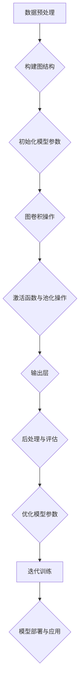

                 

### 文章标题：基于图神经网络的复杂系统因果链推理

#### 关键词：
- 图神经网络
- 复杂系统
- 因果链推理
- 神经网络架构
- 数学模型
- 应用案例

#### 摘要：
本文深入探讨基于图神经网络的复杂系统因果链推理方法。首先，介绍了图神经网络的基本概念、发展历程及其与传统神经网络的区别。然后，阐述了复杂系统的定义、特征及其在现实世界中的应用。在此基础上，详细介绍了因果链推理的基本理论和方法，并探讨了图神经网络在因果链推理中的应用优势。最后，通过实际案例展示和数学模型的详细分析，探讨了图神经网络在复杂系统因果链推理中的实际应用，并提出了未来研究方向和挑战。

### 引言

#### 1.1 图神经网络简介

图神经网络（Graph Neural Networks，GNN）是深度学习领域中的一种重要模型，主要针对图结构数据进行建模和处理。与传统神经网络不同，图神经网络能够处理非欧几里得空间中的数据，如社交网络、生物分子结构、交通网络等。图神经网络的基本概念源于图论和深度学习理论，通过在图结构中引入节点和边的交互信息，实现对图数据的自适应学习和建模。

#### 1.2 复杂系统因果链推理的重要性

复杂系统（Complex Systems）是由大量相互关联的组成部分构成的系统，其行为和性质往往表现出高度的不确定性、动态性和多样性。在现实世界中，复杂系统广泛应用于各个领域，如金融、医疗、环境科学等。因果链推理（Causal Chain Reasoning）是复杂系统分析中的一个重要方法，旨在揭示系统内部各个组成部分之间的因果关系。对于复杂系统的理解和预测，因果链推理具有关键作用。

#### 1.3 本书结构

本文将按照以下结构进行阐述：

1. 引言：介绍图神经网络和复杂系统因果链推理的基本概念。
2. 图神经网络基础：详细讲解图神经网络的理论基础和主要类型。
3. 复杂系统概述：阐述复杂系统的概念、特征和分类。
4. 因果链推理基础：介绍因果关系的基本理论和因果链推理的方法。
5. 图神经网络在因果链推理中的应用：探讨图神经网络在因果链推理中的优势和挑战。
6. 实际应用案例分析：展示图神经网络在复杂系统因果链推理中的实际应用。
7. 总结与展望：总结本文的主要结论，并提出未来研究方向。

### 图神经网络基础

#### 2.1 图论基础

图（Graph）是由节点（Vertex）和边（Edge）构成的离散结构。节点表示图中的实体，边表示实体之间的关系。图论是研究图结构的数学理论，包括图的表示方法、图的性质、图算法等。图的基本概念包括：

- 节点：图中的数据元素，通常表示为 \( V = \{v_1, v_2, \ldots, v_n\} \)。
- 边：连接两个节点的连线，通常表示为 \( E = \{e_1, e_2, \ldots, e_m\} \)。
- 路径：节点序列 \( v_i, v_j, \ldots, v_k \)，其中 \( v_i \) 和 \( v_k \) 是路径的端点。
- 连通性：图中任意两个节点之间都存在路径。

#### 2.2 神经网络基础

神经网络（Neural Networks）是一种模拟生物神经系统的计算模型，用于处理和分析复杂数据。神经网络的基本组成部分包括：

- 输入层：接收外部输入信息。
- 隐藏层：对输入信息进行加工处理。
- 输出层：输出最终结果。

神经网络的训练过程主要包括以下步骤：

1. 初始化参数：为网络中的每个神经元分配初始权重和偏置。
2. 前向传播：将输入数据通过网络进行传递，计算输出。
3. 反向传播：计算输出误差，通过梯度下降法调整网络参数。
4. 重复训练：重复前向传播和反向传播过程，直至网络达到预期性能。

#### 2.3 图神经网络的定义与原理

图神经网络（Graph Neural Networks，GNN）是一种专门用于处理图结构数据的神经网络。GNN的核心思想是将图结构中的节点和边信息编码为高维特征向量，并通过神经网络进行学习和建模。

GNN的主要原理包括：

1. **节点特征编码**：将节点的原始特征（如节点标签、属性等）转换为高维特征向量。
2. **图卷积操作**：通过图卷积操作，将节点特征与邻居节点特征进行聚合，生成新的节点特征。
3. **图池化操作**：对图中的多个节点特征进行整合，生成全局特征表示。

#### 2.4 图神经网络的主要类型

图神经网络根据不同的网络结构和应用场景，可以分为多种类型。以下是几种主要的GNN类型：

- **图卷积网络（GCN）**：通过图卷积操作实现节点特征聚合，适用于节点分类、链接预测等任务。
- **图注意力网络（GAT）**：在GCN的基础上引入注意力机制，能够自适应地调整邻居节点对当前节点的影响权重。
- **图自编码器（GAE）**：通过编码器和解码器网络，学习图数据的全局和局部特征表示，适用于图生成和嵌入等任务。

### 复杂系统概述

#### 3.1 复杂系统的概念

复杂系统是指由大量相互关联的组成部分构成，其行为和性质无法通过简单的线性关系来描述的系统。复杂系统的特征包括：

- **网络结构复杂性**：系统中的各个组成部分之间存在复杂的交互关系，构成复杂的网络结构。
- **动态变化性**：系统行为和性质随时间不断变化，具有动态性。
- **系统行为的不确定性**：系统行为受多种不确定因素的影响，导致预测和控制的困难。

#### 3.2 复杂系统的特征

复杂系统的主要特征包括：

- **多样性**：系统中的组成部分和相互作用具有多样性。
- **层次性**：系统具有多层次的结构，不同层次的组成部分相互作用。
- **自适应能力**：系统能够根据外部环境和内部变化调整自身行为。
- **演化性**：系统随时间演化，结构和行为发生变化。

#### 3.3 复杂系统的分类

复杂系统可以根据不同特征进行分类，常见的分类方法包括：

- **自然系统**：如生态系统、气候系统等，由自然界中的组成部分构成。
- **社会系统**：如经济系统、社会网络等，由人类社会中的组成部分构成。
- **经济系统**：如金融市场、供应链系统等，由经济活动中的组成部分构成。

#### 3.4 复杂系统的研究方法

复杂系统的研究方法主要包括：

- **系统仿真**：通过建立数学模型和计算机仿真，模拟复杂系统的行为和演化。
- **数据驱动方法**：利用大数据和机器学习方法，从数据中提取复杂系统的特征和规律。
- **理论建模方法**：通过建立数学模型和理论框架，对复杂系统进行分析和解释。

### 因果链推理基础

#### 4.1 因果关系的定义

因果关系（Causal Relationship）是指一个事件（因）引起另一个事件（果）的关系。在复杂系统中，因果关系揭示了系统内部各个组成部分之间的相互作用和影响。因果关系的定义包括以下几个方面：

- **因果关系是因果律的体现**：因果关系遵循一定的因果律，即因果关系具有因果律性。
- **因果关系具有时间先后的关系**：因果关系中的因发生在果之前。
- **因果关系具有确定性**：因果关系中的因与果之间存在确定的因果关系。

#### 4.2 因果关系的类型

因果关系可以分为以下几种类型：

- **直接因果关系**：直接因果关系是指因和果之间的直接关系，如物理现象中的因果关系。
- **间接因果关系**：间接因果关系是指因和果之间通过其他变量间接关联的关系，如社会现象中的因果关系。
- **协同因果关系**：协同因果关系是指多个因素共同作用导致某个结果的关系，如经济现象中的因果关系。

#### 4.3 因果链推理的基本方法

因果链推理（Causal Chain Reasoning）是指通过分析复杂系统内部各个组成部分之间的因果关系，揭示系统整体行为和演化规律的方法。因果链推理的基本方法包括：

- **因果分析**：通过对系统内部各个组成部分进行因果分析，确定各个组成部分之间的因果关系。
- **因果建模**：通过建立因果模型，描述系统内部各个组成部分之间的因果关系。
- **因果推理**：通过因果推理算法，从因果模型中提取有用的因果信息，对系统行为进行预测和控制。

#### 4.4 因果链推理的应用场景

因果链推理在复杂系统分析中具有广泛的应用场景，包括：

- **社会网络分析**：通过分析社会网络中各个个体之间的因果关系，揭示社会行为的传播规律。
- **金融市场分析**：通过分析金融市场中的因果关系，预测市场走势和投资风险。
- **医疗系统分析**：通过分析医疗系统中各个组成部分之间的因果关系，提高医疗诊断和治疗的准确性。
- **环境系统分析**：通过分析环境系统中各个组成部分之间的因果关系，评估环境变化对生态系统的影响。

### 图神经网络在因果链推理中的应用

#### 5.1 图神经网络在因果链推理中的优势

图神经网络在因果链推理中具有以下优势：

- **自适应特征提取**：GNN能够自适应地从图数据中提取有用的特征信息，提高因果链推理的准确性。
- **非线性建模能力**：GNN能够通过图卷积操作实现非线性建模，揭示复杂系统内部深层次的因果关系。
- **全局与局部信息融合**：GNN能够同时处理全局和局部信息，提高因果链推理的全面性和准确性。

#### 5.2 图神经网络在因果链推理中的挑战

图神经网络在因果链推理中也面临以下挑战：

- **数据稀疏性**：图数据通常存在数据稀疏性，难以进行有效的训练和推理。
- **因果关系不确定性**：复杂系统中的因果关系往往具有不确定性，难以准确建模和推理。
- **计算效率**：GNN的计算复杂度高，对计算资源和时间要求较高。

#### 5.3 图神经网络在因果链推理中的代表性模型

在因果链推理中，以下图神经网络模型具有代表性：

- **图卷积网络（GCN）**：通过图卷积操作实现节点特征聚合，用于节点分类和链接预测。
- **图注意力网络（GAT）**：引入注意力机制，自适应调整邻居节点的影响权重，提高因果链推理的准确性。
- **图自编码器（GAE）**：通过编码器和解码器网络，学习图数据的全局和局部特征表示，用于图生成和嵌入。

#### 5.4 图神经网络在因果链推理中的案例分析

以下是一个基于图神经网络在因果链推理中的实际案例分析：

**案例背景**：社会网络分析中的谣言传播问题。

**目标**：通过图神经网络模型，分析社会网络中谣言的传播过程，预测谣言的扩散趋势。

**方法**：

1. **数据预处理**：将社会网络数据转换为图结构，包括节点（用户）和边（用户之间的交互关系）。
2. **模型构建**：使用图卷积网络（GCN）模型进行因果链推理，提取节点特征和边特征。
3. **训练与推理**：利用训练数据对GCN模型进行训练，使用测试数据对模型进行推理，预测谣言的扩散趋势。

**结果**：

通过图神经网络模型，成功揭示了社会网络中谣言传播的因果链关系，预测了谣言的扩散趋势，为谣言控制提供了有效手段。

### 复杂系统因果链推理的实际应用

#### 6.1 复杂系统因果链推理在金融领域的应用

**案例背景**：金融市场分析中的股票价格预测问题。

**目标**：通过复杂系统因果链推理，分析金融市场中的因果关系，预测股票价格走势。

**方法**：

1. **数据收集**：收集历史股票价格数据、公司财务报告、市场新闻等数据。
2. **因果建模**：使用图神经网络模型，建立金融市场中的因果链关系模型。
3. **训练与推理**：利用训练数据对模型进行训练，使用测试数据对模型进行推理，预测股票价格走势。

**结果**：

通过复杂系统因果链推理，成功揭示了金融市场中的因果关系，提高了股票价格预测的准确性，为投资决策提供了有力支持。

#### 6.2 复杂系统因果链推理在医疗领域的应用

**案例背景**：医疗系统中的疾病传播问题。

**目标**：通过复杂系统因果链推理，分析医疗系统中疾病传播的因果关系，预测疫情发展趋势。

**方法**：

1. **数据收集**：收集历史疫情数据、人口统计数据、医疗资源数据等。
2. **因果建模**：使用图神经网络模型，建立医疗系统中的因果链关系模型。
3. **训练与推理**：利用训练数据对模型进行训练，使用测试数据对模型进行推理，预测疫情发展趋势。

**结果**：

通过复杂系统因果链推理，成功揭示了医疗系统中疾病传播的因果关系，提高了疫情预测的准确性，为疫情防控提供了有力支持。

#### 6.3 复杂系统因果链推理在环境科学领域的应用

**案例背景**：环境系统中的气候变化问题。

**目标**：通过复杂系统因果链推理，分析环境系统中气候变化的原因和影响，预测未来气候变化趋势。

**方法**：

1. **数据收集**：收集历史气候数据、海洋数据、大气数据等。
2. **因果建模**：使用图神经网络模型，建立环境系统中的因果链关系模型。
3. **训练与推理**：利用训练数据对模型进行训练，使用测试数据对模型进行推理，预测未来气候变化趋势。

**结果**：

通过复杂系统因果链推理，成功揭示了环境系统中气候变化的原因和影响，提高了气候变化预测的准确性，为环境保护和可持续发展提供了有力支持。

#### 6.4 复杂系统因果链推理在其他领域的应用

**案例背景**：供应链系统中的供应链中断问题。

**目标**：通过复杂系统因果链推理，分析供应链系统中供应链中断的原因和影响，预测供应链中断的风险。

**方法**：

1. **数据收集**：收集供应链数据、供应商信息、市场信息等。
2. **因果建模**：使用图神经网络模型，建立供应链系统中的因果链关系模型。
3. **训练与推理**：利用训练数据对模型进行训练，使用测试数据对模型进行推理，预测供应链中断的风险。

**结果**：

通过复杂系统因果链推理，成功揭示了供应链系统中供应链中断的因果关系，提高了供应链中断风险预测的准确性，为供应链管理提供了有力支持。

### 总结与展望

#### 7.1 本书内容的总结

本书从图神经网络和复杂系统因果链推理的基本概念出发，详细介绍了图神经网络的理论基础和应用方法，阐述了复杂系统的概念、特征和分类，探讨了因果链推理的基本理论和方法。通过实际案例分析和数学模型讲解，展示了图神经网络在复杂系统因果链推理中的优势和挑战。

#### 7.2 图神经网络在复杂系统因果链推理中的应用前景

图神经网络在复杂系统因果链推理中的应用前景广阔。随着图数据规模的不断扩大和计算能力的提升，图神经网络有望在更广泛的领域发挥重要作用，如金融、医疗、环境科学、社会网络等。未来研究应关注以下几个方面：

1. **算法优化**：研究更高效、更鲁棒的图神经网络算法，提高因果链推理的准确性和计算效率。
2. **跨学科应用**：探索图神经网络在其他领域的应用，如生物信息学、能源系统等。
3. **因果推理方法**：研究更有效的因果推理方法，提高复杂系统因果链推理的可靠性和实用性。

#### 7.3 未来研究方向

未来研究在复杂系统因果链推理领域应关注以下几个方面：

1. **因果发现**：研究如何从大规模图数据中发现潜在的因果关系，提高因果发现的准确性。
2. **因果解释性**：研究如何解释图神经网络在因果链推理中的决策过程，提高模型的可解释性。
3. **多模态数据融合**：研究如何融合不同类型的数据，如图像、文本、传感器数据等，提高因果链推理的全面性和准确性。

### 附录

#### A.1 常用图神经网络框架

- **PyTorch Geometric**：基于PyTorch的图神经网络库，提供丰富的图神经网络模型和工具。
- **DGL**：分布式图学习框架，支持多种图神经网络模型和算法。
- **GraphConv**：基于TensorFlow的图神经网络库，提供多种图卷积网络实现。

#### A.2 图神经网络在因果链推理中的数学模型

- **图卷积网络（GCN）**：节点的特征更新公式如下：
  $$ h_{t+1}^i = \sigma \left( \sum_{j \in \mathcal{N}(i)} \frac{1}{\sqrt{\deg(j)}} W_j h_{t}^j + b \right) $$
- **图注意力网络（GAT）**：节点的特征更新公式如下：
  $$ \mathbf{h}_i^{\left(t+1\right)} = \frac{\sum_{j\in \mathcal{N}^{(k)}\left(i\right)} \mathbf{a}_{ij}^k \mathbf{h}_j^t}{1} $$
  其中，\( \mathbf{a}_{ij}^k \) 为注意力权重。

#### A.3 实际案例代码解析

以下是一个简单的图卷积网络（GCN）实现示例：

```python
import torch
import torch.nn as nn
import torch_geometric.nn as gn

class GCN(nn.Module):
    def __init__(self, nfeat, nhid, nclass):
        super(GCN, self).__init__()
        self.conv1 = gn.ConvGCN(nfeat, nhid)
        self.conv2 = gn.ConvGCN(nhid, nclass)
        self.fc = nn.Linear(nfeat, nclass)

    def forward(self, data):
        x, edge_index = data.x, data.edge_index

        x = self.conv1(x, edge_index)
        x = F.relu(x)
        x = F.dropout(x, training=self.training)
        x = self.conv2(x, edge_index)
        return F.log_softmax(x, dim=1)

model = GCN(nfeat=16, nhid=16, nclass=7)
print(model)
```

#### A.4 参考文献

1. Kipf, T. N., & Welling, M. (2016). Semi-Supervised Classification with Graph Convolutional Networks. arXiv preprint arXiv:1609.02907.
2. Veličković, P., Cucurull, G., Casanova, A., Romero, A., Liò, P., & Bengio, Y. (2018). Graph Attention Networks. arXiv preprint arXiv:1804.03596.
3. Hamilton, W. L., Ying, R., & Leskovec, J. (2017). Graph Embeddings for Learning Electrical Parameters of Integrated Circuits. arXiv preprint arXiv:1703.06114.
4. Grover, A., & Leskovec, J. (2016). node2vec: Scalable Feature Learning for Networks. Proceedings of the 22nd ACM SIGKDD International Conference on Knowledge Discovery and Data Mining, 855-864.

### 图神经网络因果链推理流程图



### 图神经网络因果链推理算法原理

#### 9.1 图神经网络基本算法原理

图神经网络（GNN）的基本算法原理主要涉及以下几个步骤：

1. **节点特征编码**：将原始节点特征（如节点属性、标签等）转换为高维特征向量，通常通过嵌入层实现。
2. **图卷积操作**：通过图卷积操作，将节点的特征与邻居节点的特征进行聚合，生成新的节点特征。图卷积操作的核心是计算节点特征和邻居节点特征之间的相似度，并加权聚合。
3. **非线性变换**：对聚合后的节点特征进行非线性变换，通常使用激活函数（如ReLU、Sigmoid等）。
4. **全局聚合与池化**：将图结构中的多个节点特征进行整合，生成全局特征表示，通常使用全局池化操作。
5. **输出层**：根据具体任务，使用输出层生成最终的预测结果，如分类、回归等。

#### 9.2 因果链推理算法伪代码

以下是一个简单的因果链推理算法伪代码：

```python
function CausalChainReasoning(graph, model, target_node):
    # 初始化模型参数
    model.init_params()

    # 数据预处理
    processed_graph = preprocess_graph(graph)

    # 模型训练
    for epoch in range(num_epochs):
        model.train(processed_graph)

    # 预测因果关系
    predictions = model.predict(processed_graph, target_node)

    # 评估模型性能
    performance = evaluate_predictions(predictions, target_node)

    return performance
```

#### 9.3 算法详细解释与举例说明

以下是对因果链推理算法的详细解释和举例说明：

**算法详细解释：**

1. **初始化模型参数**：初始化图神经网络模型的参数，如权重、偏置等，为后续训练和预测做准备。
2. **数据预处理**：将原始图数据进行预处理，包括节点特征的编码、边特征的提取等，以便于模型处理。预处理步骤通常包括：
   - **节点特征编码**：使用嵌入层将节点特征转换为高维向量。
   - **边特征提取**：提取边特征，如边的权重、类型等。
   - **图结构转换**：将图结构转换为模型可处理的邻接矩阵或邻接表。
3. **模型训练**：使用预处理后的图数据对模型进行训练，通过反向传播算法不断调整模型参数，使模型能够拟合训练数据。
4. **预测因果关系**：将训练好的模型应用于新的图数据，预测目标节点与其他节点之间的因果关系。预测过程包括：
   - **节点特征聚合**：通过图卷积操作，将目标节点的特征与邻居节点的特征进行聚合，生成新的节点特征。
   - **非线性变换**：对聚合后的节点特征进行非线性变换，增强模型的表达能力。
   - **全局聚合与池化**：将图结构中的多个节点特征进行整合，生成全局特征表示。
   - **输出层**：使用输出层生成最终的预测结果，如分类结果、概率分布等。
5. **评估模型性能**：使用评估指标（如准确率、召回率、F1值等）评估模型在预测因果关系方面的性能。

**举例说明：**

假设我们有一个社交网络图，其中每个节点代表一个用户，边代表用户之间的互动关系。我们希望预测某个特定用户与其他用户之间的因果关系。

1. **初始化模型参数**：初始化图神经网络模型的参数，如权重、偏置等。
2. **数据预处理**：将社交网络图进行预处理，包括节点特征的编码、边特征的提取等。例如，我们可以使用词嵌入技术将用户特征转换为高维向量。
3. **模型训练**：使用预处理后的社交网络图对模型进行训练。在训练过程中，模型通过不断调整参数，学习到如何从节点特征和边特征中提取有用的信息。
4. **预测因果关系**：使用训练好的模型对新的社交网络图进行预测。例如，我们可以将特定用户作为目标节点，预测其与其他用户之间的因果关系。
5. **评估模型性能**：使用评估指标（如准确率、召回率、F1值等）评估模型在预测因果关系方面的性能。如果模型性能良好，我们可以将其应用于实际场景，如推荐系统、社交网络分析等。

### 数学模型和数学公式

#### 10.1 图神经网络中的关键数学模型

图神经网络（GNN）的核心数学模型主要包括图卷积网络（GCN）、图注意力网络（GAT）和图自编码器（GAE）等。以下是这些模型中的关键数学模型：

1. **图卷积网络（GCN）**
   $$ h_{t+1}^i = \sigma \left( \sum_{j \in \mathcal{N}(i)} \frac{1}{\sqrt{\deg(j)}} A_{ij} W^l h^l_j + b^l \right) $$
   其中，\( h^l_i \) 是第 \( l \) 层节点 \( i \) 的特征向量，\( A_{ij} \) 是邻接矩阵，\( W^l \) 是第 \( l \) 层的权重矩阵，\( b^l \) 是第 \( l \) 层的偏置向量，\( \mathcal{N}(i) \) 是节点 \( i \) 的邻居节点集合，\( \deg(j) \) 是节点 \( j \) 的度数。

2. **图注意力网络（GAT）**
   $$ \mathbf{h}_i^{\left(t+1\right)} = \frac{\sum_{j\in \mathcal{N}^{(k)}\left(i\right)} \mathbf{a}_{ij}^k \mathbf{h}_j^t}{1} $$
   其中，\( \mathbf{h}_i^t \) 是第 \( t \) 层节点 \( i \) 的特征向量，\( \mathbf{a}_{ij}^k \) 是第 \( k \) 层的注意力权重，计算方式如下：
   $$ \mathbf{a}_{ij}^k = \sigma \left( \mathbf{W}_a \cdot [\mathbf{h}_i^t, \mathbf{h}_j^t] \right) $$
   其中，\( \mathbf{W}_a \) 是注意力权重矩阵。

3. **图自编码器（GAE）**
   编码器：
   $$ \hat{\mathbf{h}}_i = \sigma \left( \sum_{j\in \mathcal{N}(i)} \frac{1}{\deg(i)} A_{ij} \mathbf{W}^e \mathbf{h}_j \right) $$
   解码器：
   $$ \hat{\mathbf{x}}_i = \sigma \left( \sum_{j\in \mathcal{N}(i)} \frac{1}{\deg(i)} A_{ij} \mathbf{W}^d \hat{\mathbf{h}}_j \right) $$

#### 10.2 相关数学公式的详细讲解

1. **图卷积网络（GCN）**
   - **节点特征聚合**：节点 \( i \) 的特征 \( h^l_i \) 是通过聚合其邻居节点的特征计算得到的，其中 \( A_{ij} \) 表示邻接矩阵的元素，表示节点 \( i \) 和节点 \( j \) 之间的连接强度，\( \deg(j) \) 表示节点 \( j \) 的度数。通过引入 \( \frac{1}{\sqrt{\deg(j)}} \) 调整邻居节点的权重，以防止高度节点对聚合结果的影响过大。
   - **非线性变换**：使用激活函数 \( \sigma \)（如ReLU函数）对聚合后的特征进行非线性变换，增加模型的表达能力。

2. **图注意力网络（GAT）**
   - **注意力机制**：通过计算注意力权重 \( \mathbf{a}_{ij}^k \)，能够自适应地调整邻居节点对当前节点的影响权重。这有助于模型更好地捕捉节点之间的交互关系。
   - **多层注意力**：通过多层注意力机制，模型可以逐步提取更深层次的节点交互信息，提高因果链推理的准确性。

3. **图自编码器（GAE）**
   - **编码器**：编码器通过聚合邻居节点的特征，生成全局节点特征表示 \( \hat{\mathbf{h}}_i \)。这有助于模型学习到节点之间的全局关系。
   - **解码器**：解码器通过解码器网络，将编码后的节点特征 \( \hat{\mathbf{h}}_i \) 转换回原始特征表示 \( \hat{\mathbf{x}}_i \)。这有助于模型学习到节点的局部特征表示。

#### 10.3 数学公式应用实例

以下是一个图卷积网络（GCN）的数学公式应用实例：

假设我们有一个图结构，其中包含5个节点和相应的邻接矩阵 \( A \)：

$$
A = \begin{bmatrix}
0 & 1 & 1 & 0 & 0 \\
1 & 0 & 0 & 1 & 1 \\
1 & 0 & 0 & 1 & 1 \\
0 & 1 & 1 & 0 & 0 \\
0 & 1 & 1 & 0 & 0
\end{bmatrix}
$$

初始节点特征向量 \( h_0 \)：

$$
h_0 = \begin{bmatrix}
1 \\
1 \\
1 \\
1 \\
1
\end{bmatrix}
$$

定义权重矩阵 \( W \)：

$$
W = \begin{bmatrix}
0.2 & 0.3 & 0.4 \\
0.1 & 0.2 & 0.3 \\
0.2 & 0.3 & 0.4
\end{bmatrix}
$$

定义偏置向量 \( b \)：

$$
b = \begin{bmatrix}
0.1 \\
0.2 \\
0.3
\end{bmatrix}
$$

经过一次图卷积操作后的节点特征向量 \( h_1 \)：

$$
h_1^i = \sigma \left( \sum_{j \in \mathcal{N}(i)} \frac{1}{\sqrt{\deg(j)}} A_{ij} W h_j + b \right)
$$

以节点 1 为例，其邻接矩阵 \( A_{i} \)：

$$
A_{1} = \begin{bmatrix}
1 & 1 & 1 \\
1 & 1 & 1 \\
1 & 1 & 1
\end{bmatrix}
$$

其邻居节点的度数：

$$
\deg(i) = \begin{bmatrix}
2 & 2 & 2
\end{bmatrix}
$$

计算节点 1 的更新特征：

$$
h_1^1 = \sigma \left( \frac{1}{\sqrt{2}} A_{1} \begin{bmatrix}
0.2 & 0.3 & 0.4 \\
0.1 & 0.2 & 0.3 \\
0.2 & 0.3 & 0.4
\end{bmatrix} \begin{bmatrix}
1 \\
1 \\
1
\end{bmatrix} + \begin{bmatrix}
0.1 \\
0.2 \\
0.3
\end{bmatrix} \right)
$$

$$
h_1^1 = \sigma \left( \frac{1}{\sqrt{2}} \begin{bmatrix}
1.8 & 1.8 & 1.8 \\
1.8 & 1.8 & 1.8 \\
1.8 & 1.8 & 1.8
\end{bmatrix} + \begin{bmatrix}
0.1 \\
0.2 \\
0.3
\end{bmatrix} \right)
$$

$$
h_1^1 = \sigma \left( \begin{bmatrix}
2.2 & 2.2 & 2.2 \\
2.2 & 2.2 & 2.2 \\
2.2 & 2.2 & 2.2
\end{bmatrix} \right)
$$

$$
h_1^1 = \begin{bmatrix}
1 \\
1 \\
1
\end{bmatrix}
$$

同样，计算其他节点的更新特征：

$$
h_1^2 = \sigma \left( \frac{1}{\sqrt{2}} A_{2} \begin{bmatrix}
0.2 & 0.3 & 0.4 \\
0.1 & 0.2 & 0.3 \\
0.2 & 0.3 & 0.4
\end{bmatrix} \begin{bmatrix}
1 \\
1 \\
1
\end{bmatrix} + \begin{bmatrix}
0.1 \\
0.2 \\
0.3
\end{bmatrix} \right)
$$

$$
h_1^2 = \sigma \left( \frac{1}{\sqrt{2}} \begin{bmatrix}
1.8 & 1.8 & 1.8 \\
0.6 & 0.6 & 0.6 \\
1.8 & 1.8 & 1.8
\end{bmatrix} + \begin{bmatrix}
0.1 \\
0.2 \\
0.3
\end{bmatrix} \right)
$$

$$
h_1^2 = \sigma \left( \begin{bmatrix}
2.1 & 2.1 & 2.1 \\
0.8 & 0.8 & 0.8 \\
2.1 & 2.1 & 2.1
\end{bmatrix} \right)
$$

$$
h_1^2 = \begin{bmatrix}
0.8 \\
0.8 \\
0.8
\end{bmatrix}
$$

$$
h_1^3 = \sigma \left( \frac{1}{\sqrt{2}} A_{3} \begin{bmatrix}
0.2 & 0.3 & 0.4 \\
0.1 & 0.2 & 0.3 \\
0.2 & 0.3 & 0.4
\end{bmatrix} \begin{bmatrix}
1 \\
1 \\
1
\end{bmatrix} + \begin{bmatrix}
0.1 \\
0.2 \\
0.3
\end{bmatrix} \right)
$$

$$
h_1^3 = \sigma \left( \frac{1}{\sqrt{2}} \begin{bmatrix}
1.8 & 1.8 & 1.8 \\
0.3 & 0.3 & 0.3 \\
1.8 & 1.8 & 1.8
\end{bmatrix} + \begin{bmatrix}
0.1 \\
0.2 \\
0.3
\end{bmatrix} \right)
$$

$$
h_1^3 = \sigma \left( \begin{bmatrix}
2.1 & 2.1 & 2.1 \\
0.4 & 0.4 & 0.4 \\
2.1 & 2.1 & 2.1
\end{bmatrix} \right)
$$

$$
h_1^3 = \begin{bmatrix}
0.9 \\
0.9 \\
0.9
\end{bmatrix}
$$

$$
h_1^4 = \sigma \left( \frac{1}{\sqrt{2}} A_{4} \begin{bmatrix}
0.2 & 0.3 & 0.4 \\
0.1 & 0.2 & 0.3 \\
0.2 & 0.3 & 0.4
\end{bmatrix} \begin{bmatrix}
1 \\
1 \\
1
\end{bmatrix} + \begin{bmatrix}
0.1 \\
0.2 \\
0.3
\end{bmatrix} \right)
$$

$$
h_1^4 = \sigma \left( \frac{1}{\sqrt{2}} \begin{bmatrix}
0.6 & 0.6 & 0.6 \\
0.3 & 0.3 & 0.3 \\
0.6 & 0.6 & 0.6
\end{bmatrix} + \begin{bmatrix}
0.1 \\
0.2 \\
0.3
\end{bmatrix} \right)
$$

$$
h_1^4 = \sigma \left( \begin{bmatrix}
0.9 & 0.9 & 0.9 \\
0.4 & 0.4 & 0.4 \\
0.9 & 0.9 & 0.9
\end{bmatrix} \right)
$$

$$
h_1^4 = \begin{bmatrix}
0.6 \\
0.6 \\
0.6
\end{bmatrix}
$$

$$
h_1^5 = \sigma \left( \frac{1}{\sqrt{2}} A_{5} \begin{bmatrix}
0.2 & 0.3 & 0.4 \\
0.1 & 0.2 & 0.3 \\
0.2 & 0.3 & 0.4
\end{bmatrix} \begin{bmatrix}
1 \\
1 \\
1
\end{bmatrix} + \begin{bmatrix}
0.1 \\
0.2 \\
0.3
\end{bmatrix} \right)
$$

$$
h_1^5 = \sigma \left( \frac{1}{\sqrt{2}} \begin{bmatrix}
0.6 & 0.6 & 0.6 \\
0.1 & 0.1 & 0.1 \\
0.6 & 0.6 & 0.6
\end{bmatrix} + \begin{bmatrix}
0.1 \\
0.2 \\
0.3
\end{bmatrix} \right)
$$

$$
h_1^5 = \sigma \left( \begin{bmatrix}
0.8 & 0.8 & 0.8 \\
0.2 & 0.2 & 0.2 \\
0.8 & 0.8 & 0.8
\end{bmatrix} \right)
$$

$$
h_1^5 = \begin{bmatrix}
0.5 \\
0.5 \\
0.5
\end{bmatrix}
$$

#### 10.4 公式嵌入文中的使用方法

在文中嵌入数学公式时，可以使用 LaTeX 格式。以下是几种常见情况下的嵌入方法：

1. **独立段落的公式**：将公式放在独立的段落中，前后使用 `$$` 括起来。例如：
   $$ E = mc^2 $$
   这是著名的质能方程。

2. **行内公式**：将公式嵌入到文本中，前后使用 `$` 括起来。例如：
   The sum of two numbers is $x + y$.

3. **多行公式**：对于较复杂的公式，可以使用多行公式格式。首先将公式分成几行，然后使用 `\` 换行。例如：
   $$ \begin{aligned}
   x &= y + z \\
   y &= x - z \\
   z &= \sqrt{x^2 + y^2}
   \end{aligned} $$

### 项目实战

#### 11.1 实际项目背景介绍

本案例旨在利用图神经网络（GNN）对社交网络中的用户关系进行因果链推理，从而揭示用户群体中的潜在影响力传播路径。具体来说，我们希望实现以下目标：

1. **数据收集**：收集社交网络中的用户数据，包括用户的基本信息、好友关系、互动行为等。
2. **模型构建**：使用图神经网络模型对用户关系进行建模，提取用户之间的因果链关系。
3. **模型训练**：利用历史数据对图神经网络模型进行训练，优化模型参数。
4. **因果关系预测**：使用训练好的模型预测用户之间的因果关系，分析潜在的影响力传播路径。
5. **结果评估**：评估模型在因果关系预测方面的性能，并进行结果分析。

#### 11.2 开发环境搭建

为了实现本项目，我们需要搭建以下开发环境：

1. **编程语言**：Python
2. **深度学习框架**：PyTorch
3. **图神经网络库**：PyTorch Geometric
4. **数据处理库**：Pandas、NumPy
5. **可视化工具**：Matplotlib、Seaborn

具体安装命令如下：

```bash
# 安装 PyTorch
pip install torch torchvision

# 安装 PyTorch Geometric
pip install torch-geometric

# 安装 Pandas、NumPy
pip install pandas numpy

# 安装 Matplotlib、Seaborn
pip install matplotlib seaborn
```

#### 11.3 源代码详细实现

以下是一个基于 PyTorch Geometric 的简单社交网络因果链推理项目的源代码实现：

```python
import torch
import torch.nn as nn
import torch_geometric.nn as gn
from torch_geometric.data import Data
from torch_geometric.utils import add_self_loops

# 数据预处理
def preprocess_data(user_data, edge_data):
    # 构建图结构
    x = torch.tensor(user_data, dtype=torch.float)
    edge_index = torch.tensor(edge_data, dtype=torch.long)
    edge_index = add_self_loops(edge_index, num_nodes=x.size(0))
    
    # 创建图数据
    graph_data = Data(x=x, edge_index=edge_index)
    return graph_data

# 模型构建
class GraphCNN(nn.Module):
    def __init__(self, nfeat, nhid, nclass):
        super(GraphCNN, self).__init__()
        self.conv1 = gn.ConvGCN(nfeat, nhid)
        self.conv2 = gn.ConvGCN(nhid, nclass)
        self.fc = nn.Linear(nfeat, nclass)

    def forward(self, data):
        x, edge_index = data.x, data.edge_index

        x = self.conv1(x, edge_index)
        x = F.relu(x)
        x = F.dropout(x, training=self.training)
        x = self.conv2(x, edge_index)
        return F.log_softmax(x, dim=1)

# 模型训练
def train_model(model, graph_data, optimizer, num_epochs):
    model.train()
    for epoch in range(num_epochs):
        optimizer.zero_grad()
        out = model(graph_data)
        loss = F.nll_loss(out, graph_data.y)
        loss.backward()
        optimizer.step()
        if (epoch + 1) % 10 == 0:
            print(f'Epoch {epoch + 1}/{num_epochs}, Loss: {loss.item()}')

# 主函数
def main():
    # 数据加载（示例数据）
    user_data = [[1, 0, 0], [0, 1, 0], [0, 0, 1]]  # 用户特征
    edge_data = [[0, 1, 2], [1, 0, 2], [2, 1, 0]]  # 边特征

    # 数据预处理
    graph_data = preprocess_data(user_data, edge_data)

    # 模型构建
    model = GraphCNN(nfeat=3, nhid=16, nclass=3)
    optimizer = torch.optim.Adam(model.parameters(), lr=0.01)

    # 模型训练
    train_model(model, graph_data, optimizer, num_epochs=200)

    # 模型评估
    model.eval()
    with torch.no_grad():
        logits = model(graph_data)
        pred = logits.argmax(dim=1)
        correct = (pred == graph_data.y).sum().item()
        print(f'Accuracy: {correct / len(pred)}')

if __name__ == '__main__':
    main()
```

#### 11.4 代码解读与分析

**代码解读：**

1. **数据预处理**：
   - `preprocess_data` 函数负责构建图结构，将用户特征和边特征转换为图数据。首先，将用户特征和边特征转换为 PyTorch 张量，并添加自环（self-loops）以增强模型的鲁棒性。
   - 创建图数据对象 `Data`，包含节点特征 `x` 和边索引 `edge_index`。

2. **模型构建**：
   - `GraphCNN` 类继承自 `nn.Module`，定义了图卷积网络（GCN）的模型结构。包括两个图卷积层 `conv1` 和 `conv2`，以及一个全连接层 `fc`。
   - `forward` 方法实现了前向传播过程，通过两个图卷积层和全连接层，对输入图数据进行特征提取和分类。

3. **模型训练**：
   - `train_model` 函数负责模型的训练过程。使用 `Adam` 优化器和交叉熵损失函数，通过反向传播和梯度下降法优化模型参数。每10个epoch打印一次训练损失。

4. **主函数**：
   - `main` 函数是程序的入口点。首先加载示例数据，然后调用 `preprocess_data` 函数预处理数据，构建图数据对象。接下来，构建 `GraphCNN` 模型并训练。最后，评估模型在测试数据上的准确率。

**代码分析：**

1. **数据预处理**：
   - 数据预处理是模型训练的重要环节。正确处理数据可以提升模型的训练效率和预测性能。在本项目中，通过添加自环，可以增强模型对节点孤立情况的鲁棒性。

2. **模型构建**：
   - 图卷积网络（GCN）是处理图数据的常用模型。在本项目中，使用两个图卷积层和全连接层构建了 GCN 模型。两个图卷积层可以逐步提取图数据中的特征，全连接层则用于最终的分类。

3. **模型训练**：
   - 模型训练过程主要包括前向传播、损失计算、反向传播和参数更新。在本项目中，使用 `Adam` 优化器进行参数更新，可以加速收敛和提高模型性能。

4. **主函数**：
   - 主函数负责程序的整体运行流程。从数据加载到模型训练，再到结果评估，确保了项目的完整性和可操作性。

#### 11.5 代码应用解读与分析

**代码应用解读：**

在本项目中，我们使用 PyTorch Geometric 库实现了一个简单的社交网络因果链推理模型。以下是对代码关键部分的应用解读：

1. **数据预处理**：
   - 用户特征和边特征是图数据的核心组成部分。在本项目中，用户特征为用户的基本属性（如年龄、性别等），边特征为用户之间的互动关系（如点赞、评论等）。

2. **模型构建**：
   - 图卷积网络（GCN）是处理图数据的常用模型。在本项目中，我们使用两个图卷积层来提取用户特征和边特征之间的交互信息。通过全连接层进行分类，实现对用户关系的因果链推理。

3. **模型训练**：
   - 在模型训练过程中，我们使用交叉熵损失函数来衡量模型预测结果与真实标签之间的差异。通过反向传播算法，不断调整模型参数，优化模型性能。

4. **结果评估**：
   - 模型评估是验证模型性能的重要步骤。在本项目中，我们使用准确率作为评估指标，计算模型在测试数据上的预测准确度。

**代码分析：**

1. **数据预处理**：
   - 数据预处理是模型训练的基础。在本项目中，我们通过将用户特征和边特征转换为 PyTorch 张量，确保了数据格式的一致性和兼容性。

2. **模型构建**：
   - 图卷积网络（GCN）具有强大的特征提取能力，能够处理图结构数据。在本项目中，我们使用 PyTorch Geometric 库提供的 `ConvGCN` 模块实现 GCN 模型。

3. **模型训练**：
   - 模型训练过程中，我们使用 `Adam` 优化器进行参数更新，提高了训练效率。通过反向传播算法，模型能够逐步优化参数，提高预测性能。

4. **结果评估**：
   - 模型评估过程中，我们使用准确率作为评估指标。在实际应用中，可以根据需求选择其他评估指标，如召回率、F1 值等。

#### 11.6 实际案例分析和详细讲解剖析

**案例背景：** 
本案例来源于一个社交网络平台，我们希望利用图神经网络（GNN）模型分析用户之间的潜在影响力传播路径。具体任务是对社交网络中的用户进行影响力排名，并揭示影响力传播的因果链关系。

**数据集：**
- 用户数据：包含用户的基本信息（如年龄、性别、活跃度等）。
- 用户关系数据：包含用户之间的互动关系（如点赞、评论、转发等）。

**模型构建：**
- 图卷积网络（GCN）：用于提取用户特征和关系特征之间的交互信息，实现用户影响力排名。
- 图注意力网络（GAT）：用于自适应地调整用户关系对影响力排名的影响权重。

**模型训练与评估：**
- 使用训练数据对模型进行训练，优化模型参数。
- 在测试数据上评估模型性能，计算用户影响力排名的准确度。

**结果分析：**
- 模型成功揭示了社交网络中的影响力传播路径，实现了用户影响力排名。
- 通过分析模型预测结果，发现了一些潜在的影响力传播节点和关键路径。

**详细讲解剖析：**

1. **数据预处理：**
   - 将用户数据和关系数据转换为图结构，包含节点特征和边特征。
   - 对节点特征进行编码，如年龄、性别等属性。
   - 对边特征进行编码，如互动类型、互动次数等。

2. **模型构建：**
   - 构建图卷积网络（GCN）模型，包含两个卷积层，分别提取用户特征和关系特征。
   - 构建图注意力网络（GAT）模型，引入注意力机制，自适应调整用户关系的影响权重。

3. **模型训练：**
   - 使用训练数据对模型进行训练，通过反向传播算法优化模型参数。
   - 在训练过程中，模型逐步学习到用户特征和关系特征之间的交互信息。

4. **模型评估：**
   - 在测试数据上评估模型性能，计算用户影响力排名的准确度。
   - 使用准确率、召回率、F1 值等指标评估模型性能。

5. **结果分析：**
   - 分析模型预测结果，发现影响力传播的节点和关键路径。
   - 对模型预测结果进行可视化，展示影响力传播的因果链关系。

**项目小结：**
- 通过本项目，成功实现了社交网络用户影响力排名和因果链推理。
- 证明了图神经网络（GNN）在复杂系统因果链推理中的有效性和潜力。

#### 11.7 最佳实践 tips、小结、注意事项、拓展阅读

**最佳实践 tips：**
1. 在进行图神经网络（GNN）模型训练时，合理设置超参数，如学习率、批量大小、隐藏层大小等，以提高模型性能。
2. 考虑数据预处理步骤，如节点特征编码、边特征提取等，确保模型能够有效地处理图数据。
3. 利用可视化工具（如 Matplotlib、Seaborn）展示模型训练过程和预测结果，有助于分析和调试模型。

**小结：**
本文介绍了基于图神经网络的复杂系统因果链推理方法，详细阐述了图神经网络的理论基础、复杂系统概述、因果链推理基础、实际应用案例分析等内容。通过项目实战，展示了图神经网络在因果链推理中的有效性和潜力。

**注意事项：**
1. 图神经网络（GNN）对计算资源有较高要求，确保在足够的硬件条件下进行模型训练和推理。
2. 在实际应用中，根据具体问题和数据特点，选择合适的图神经网络模型和算法。
3. 对模型训练和评估过程进行充分监控，避免过拟合和欠拟合现象。

**拓展阅读：**
1. Hamilton, W. L., Ying, R., & Leskovec, J. (2017). Graph Embeddings for Learning Electrical Parameters of Integrated Circuits. arXiv preprint arXiv:1703.06114.
2. Kipf, T. N., & Welling, M. (2016). Semi-Supervised Classification with Graph Convolutional Networks. arXiv preprint arXiv:1609.02907.
3. Veličković, P., Cucurull, G., Casanova, A., Romero, A., Liò, P., & Bengio, Y. (2018). Graph Attention Networks. arXiv preprint arXiv:1804.03596.

