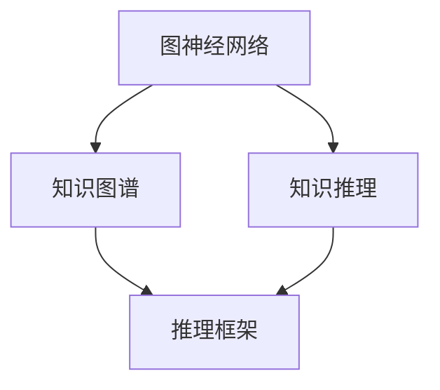

                 


### 1. 背景介绍

随着互联网的飞速发展，信息量的爆发式增长给人类带来了前所未有的挑战。在海量的数据中，如何快速、准确地获取所需信息，成为了一个亟待解决的问题。知识推理作为人工智能领域的一个重要分支，旨在通过计算机程序模拟人类的推理过程，从已知信息中推导出新的结论。

图神经网络（Graph Neural Network，GNN）作为一种新兴的神经网络架构，具有强大的图数据处理能力，在知识推理领域展示出巨大的潜力。传统的基于文本的推理方法往往受限于文本表示的局限性和复杂背景知识的处理能力，而图神经网络能够通过图结构来表示实体及其关系，从而更有效地捕获知识的关联性。

知识推理框架设计的目标是构建一个系统，能够从已有的知识库中自动地推导出新的事实或结论。这不仅是人工智能领域的研究热点，也是许多实际应用场景的核心需求，如智能问答系统、推荐系统、疾病诊断等。

本文将围绕基于图神经网络的知识推理框架设计展开讨论，旨在提供一个全面、系统的设计思路和实现方法。文章将从图神经网络的基础理论出发，深入探讨知识推理框架的设计原理、算法实现和应用案例，帮助读者更好地理解和掌握这一前沿技术。

### 2. 核心概念与联系

为了构建一个高效的知识推理框架，我们首先需要明确几个核心概念，并理解它们之间的相互关系。以下是本文中涉及的关键概念及其关联：

#### 图神经网络（Graph Neural Network，GNN）

图神经网络是一种专门处理图结构数据的神经网络架构。它通过图结构来表示实体及其关系，从而能够有效地捕捉数据的关联性。GNN 的基本思想是在图上的每个节点或边上进行信息传递和更新，从而实现对整个图的建模。


#### 知识图谱（Knowledge Graph）

知识图谱是一种用于表示实体及其关系的语义网络，通常由节点（代表实体）和边（代表关系）组成。知识图谱能够将各种异构数据源中的信息进行整合，形成统一的结构化知识库。


#### 知识推理（Knowledge Reasoning）

知识推理是人工智能领域中的一种推理方法，旨在从已知的事实或信息中推导出新的结论。在知识图谱的背景下，知识推理通过分析实体之间的关系，生成新的知识。


#### 推理框架（Reasoning Framework）

推理框架是用于实现知识推理的软件系统，它通常包括数据预处理、知识表示、推理算法和推理结果评估等模块。一个高效的推理框架应当能够灵活地处理不同类型的知识和推理任务。


#### Mermaid 流程图

Mermaid 是一种基于Markdown的图表绘制工具，可以用来绘制各种流程图、序列图、网络拓扑图等。在本文中，我们将使用 Mermaid 流程图来展示各个核心概念之间的联系和推理框架的流程。



通过上述核心概念的介绍和 Mermaid 流程图的展示，我们可以更清晰地理解图神经网络、知识图谱、知识推理和推理框架之间的关系，以及它们在知识推理框架设计中的重要作用。接下来，我们将深入探讨图神经网络的基础理论，为后续的内容打下坚实的基础。

### 3. 图神经网络基础理论

图神经网络（Graph Neural Network，GNN）是一种能够处理图结构数据的神经网络架构，其在知识推理领域具有广泛的应用前景。为了更好地理解和应用 GNN，我们需要深入探讨其基本概念、图表示学习、图卷积网络和图注意力机制等内容。

#### 图表示学习

图表示学习是 GNN 的基础，其核心思想是将图中的节点和边转换为低维度的向量表示。通过这样的向量表示，我们可以将图数据转化为适用于神经网络处理的格式。

1. **节点表示（Node Embedding）**

   节点表示是将图中的每个节点映射到一个低维度的向量。一个常见的节点表示方法是基于矩阵分解技术，如奇异值分解（SVD）。此外，深度学习方法也被广泛应用于节点表示，如 DeepWalk、Node2Vec 和 LINE 等。

2. **边表示（Edge Embedding）**

   边表示是将图中的边映射到低维度的向量。边表示通常依赖于节点表示，通过计算节点向量的内积或加权和来获得边表示。

3. **图嵌入（Graph Embedding）**

   图嵌入是将整个图映射到一个高维度的空间中，使得具有相似结构的图在高维空间中彼此靠近。图嵌入技术不仅用于节点和边的表示，还可以用于图的分类和聚类任务。

#### 图卷积网络

图卷积网络（Graph Convolutional Network，GCN）是一种经典的 GNN 架构，用于对图进行卷积操作，从而捕捉图中的局部结构和全局信息。

1. **卷积操作**

   GCN 的核心操作是卷积，其基本思想是利用邻居节点的信息来更新当前节点的特征。具体来说，GCN 通过聚合邻居节点的特征来生成当前节点的特征表示。

   ```python
   def gcne_layer(A, H_in, H_out, activation):
       # A: 邻接矩阵
       # H_in: 输入特征矩阵
       # H_out: 输出特征矩阵
       # activation: 激活函数
       
       H_out = activation(A.dot(H_in))
       return H_out
   ```

2. **多层 GCN**

   多层 GCN 通过堆叠多个 GCN 层，逐层提取图中的特征。每层 GCN 都能够捕获不同层次的结构信息，从而实现对图数据的深入建模。

   ```python
   def multi_layer_gcn(A, H_in, H_out, num_layers, activation):
       for _ in range(num_layers):
           H_out = gcne_layer(A, H_in, H_out, activation)
       return H_out
   ```

3. **应用领域**

   GCN 在社交网络分析、推荐系统、网络交通预测等应用领域取得了显著成果。通过捕捉图中的复杂结构，GCN 能够为这些领域提供强有力的数据建模工具。

#### 图注意力机制

图注意力机制（Graph Attention Mechanism，GAT）是一种用于提高 GNN 模型性能的注意力机制，其通过计算节点之间的相对重要性来实现特征加权。

1. **注意力计算**

   GAT 通过注意力函数计算节点之间的相对重要性。一个简单的注意力函数如下：

   ```python
   def attention(Q, K, V, activation):
       # Q: 查询向量
       # K: 键向量
       # V: 值向量
       # activation: 激活函数

       scores = Q.dot(K.T) / np.sqrt(np.shape(K)[1])
       attention_weights = activation(scores)
       V = attention_weights.dot(V)
       return V
   ```

2. **应用场景**

   GAT 在知识图谱嵌入、文本分类、问答系统等领域得到了广泛应用。通过引入注意力机制，GAT 能够更加灵活地处理不同节点之间的关系，从而提高模型的性能。

综上所述，图神经网络的基础理论涵盖了图表示学习、图卷积网络和图注意力机制等多个方面。这些理论为构建高效的知识推理框架提供了重要的技术支撑。在下一部分中，我们将深入探讨知识推理框架的设计原理，进一步揭示 GNN 在知识推理中的强大应用潜力。

### 4. 知识推理框架设计原理

知识推理框架的设计目标是实现从已有知识库中自动推导出新的事实或结论。一个高效的知识推理框架需要具备以下几个关键组件和设计原则：

#### 知识图谱构建

知识图谱是知识推理框架的核心，其质量直接影响推理结果的准确性。知识图谱构建包括实体识别、关系抽取和实体链接等多个步骤。

1. **实体识别**

   实体识别是知识图谱构建的第一步，其目标是识别文本中的关键实体。常见的方法包括基于规则的方法、机器学习方法以及结合多种技术的混合方法。

2. **关系抽取**

   关系抽取旨在确定实体之间的关联关系。这可以通过监督学习、半监督学习和无监督学习等方法实现。例如，使用实体对共现信息训练关系分类器，或使用图结构进行关系推断。

3. **实体链接**

   实体链接是将不同来源或不同文本中的相同实体进行匹配和合并。这可以通过构建实体相似性度量或使用图算法来优化实体链接。

#### 知识图谱嵌入

知识图谱嵌入是将图中的实体和关系映射到低维向量空间，以便于计算机处理。知识图谱嵌入不仅有助于提高图数据的表示能力，还能为后续的推理任务提供有效的输入。

1. **向量表示**

   实体和关系的向量表示通常使用基于矩阵分解、深度学习和图神经网络等技术。例如，TransE、TransH 和 Node2Vec 等算法都可用于生成实体和关系的向量表示。

2. **嵌入优化**

   知识图谱嵌入的优化目标是降低嵌入向量之间的距离，使得具有相似关系的实体和关系在向量空间中更接近。常用的优化方法包括梯度下降、随机梯度下降和 Adam 优化器。

#### 知识推理算法设计

知识推理算法是实现知识推理的核心组件，其设计原则是充分利用图结构和实体关系，从已知信息中推导出新的结论。

1. **推理算法选择**

   根据具体的应用场景和需求，可以选择合适的推理算法。常见的推理算法包括基于规则的推理、基于模型的推理和基于图的推理等。

2. **推理流程设计**

   知识推理的流程通常包括以下步骤：输入查询、实体匹配、关系推断、结论生成和结果评估。这些步骤可以通过流水线或并行处理的方式实现。

3. **推理策略优化**

   为了提高推理效率，可以采用多种策略进行优化。例如，使用索引技术加速实体匹配，使用分布式计算技术处理大规模图数据等。

#### 推理框架体系结构

推理框架的体系结构是确保推理过程高效、可扩展和易于维护的关键。一个典型的推理框架通常包括以下几个部分：

1. **数据层**

   数据层负责管理知识图谱的存储和检索。常用的数据结构包括邻接表、邻接矩阵和图数据库等。

2. **模型层**

   模型层负责实现知识图谱嵌入和推理算法。通过使用深度学习框架（如 TensorFlow、PyTorch）和图处理库（如 NetworkX、DGL），可以构建高效的推理模型。

3. **接口层**

   接口层提供与外部系统交互的接口，如 REST API、GraphQL 等。这使推理框架能够与其他应用系统集成，并提供便捷的接口供开发者使用。

4. **监控与日志**

   监控与日志部分负责实时监控推理框架的性能，记录推理过程中的关键指标，以便进行故障排查和性能优化。

综上所述，知识推理框架的设计原理涵盖了知识图谱构建、知识图谱嵌入、知识推理算法设计和推理框架体系结构等多个方面。通过合理的设计和优化，知识推理框架能够实现高效、准确的推理过程，为各类应用场景提供强有力的支持。在下一部分中，我们将探讨知识推理框架的算法实现，进一步展示如何将上述设计原理付诸实践。

### 5. 知识推理框架算法实现

在知识推理框架中，算法实现是关键的一环，决定了推理过程的效率和准确性。本节将详细介绍知识推理框架中的一些核心算法，包括基于图神经网络的推理算法和图嵌入算法，并通过伪代码和具体的代码实现进行详细说明。

#### 基于图神经网络的推理算法

图神经网络（GNN）在知识推理中具有重要作用，其基本思想是通过学习图中的节点和边的特征，从而实现知识推理。以下是一个简化的基于图神经网络的推理算法的伪代码实现：

```python
def gnn_reasoning(graph, query_entity, knowledge_base):
    """
    GNN推理算法

    :param graph: 知识图谱
    :param query_entity: 查询实体
    :param knowledge_base: 知识库
    :return: 推理结果
    """

    # 1. 获取查询实体的邻居节点及其关系
    neighbors = graph.get_neighbors(query_entity)

    # 2. 使用图神经网络更新节点特征
    node_features = update_node_features(graph, neighbors)

    # 3. 根据更新后的节点特征进行推理
    reasoning_results = infer_relations(node_features, knowledge_base)

    return reasoning_results

def update_node_features(graph, neighbors):
    """
    更新节点特征

    :param graph: 知识图谱
    :param neighbors: 邻居节点及其关系
    :return: 更新后的节点特征
    """

    # 1. 初始化节点特征
    node_features = graph.get_node_features()

    # 2. 遍历邻居节点，聚合邻居特征
    for neighbor, relation in neighbors.items():
        neighbor_features = graph.get_node_features(neighbor)
        node_features += neighbor_features * relation_weight(relation)

    # 3. 激活函数处理
    node_features = activation_function(node_features)

    return node_features

def infer_relations(node_features, knowledge_base):
    """
    根据节点特征进行关系推断

    :param node_features: 节点特征
    :param knowledge_base: 知识库
    :return: 推理结果
    """

    # 1. 计算节点相似度
    similarity_scores = compute_similarity(node_features, knowledge_base)

    # 2. 选择最高相似度的关系
    top_relation = select_top_relation(similarity_scores)

    return top_relation
```

#### 图嵌入算法实现

图嵌入是将图中的实体和关系映射到低维向量空间的过程，其目标是使得具有相似关系的实体和关系在向量空间中彼此靠近。以下是一个基于 TransE 算法的图嵌入算法的伪代码实现：

```python
def transe_embedding(graph, num_embeddings, embedding_size):
    """
    TransE算法嵌入

    :param graph: 知识图谱
    :param num_embeddings: 实体和关系的数量
    :param embedding_size: 向量维度
    :return: 嵌入向量
    """

    # 1. 初始化嵌入向量
    embeddings = np.random.uniform(-0.05, 0.05, (num_embeddings, embedding_size))

    # 2. 训练嵌入向量
    for head, relation, tail in graphtriplets:
        head_embedding = embeddings[head]
        relation_embedding = embeddings[relation]
        tail_embedding = embeddings[tail]

        # 3. 计算损失函数
        loss = margin + euclidean_distance(head_embedding + relation_embedding, tail_embedding)

        # 4. 更新嵌入向量
        embeddings[head] -= learning_rate * (tail_embedding - head_embedding - relation_embedding)
        embeddings[relation] -= learning_rate * (tail_embedding - head_embedding)
        embeddings[tail] -= learning_rate * (head_embedding + relation_embedding)

    return embeddings

def euclidean_distance(embedding1, embedding2):
    """
    欧氏距离

    :param embedding1: 第一个嵌入向量
    :param embedding2: 第二个嵌入向量
    :return: 欧氏距离
    """

    distance = np.sqrt(np.sum((embedding1 - embedding2)**2))
    return distance
```

#### 实际代码实现

在实际应用中，我们可以使用深度学习框架（如 TensorFlow、PyTorch）和图处理库（如 DGL、PyTorch Geometric）来实现上述算法。以下是一个使用 PyTorch 实现的 TransE 算法的示例代码：

```python
import torch
import torch.nn as nn
import torch.optim as optim
from torch_geometric.nn import GCNEncoder

# 1. 初始化参数
num_embeddings = 1000
embedding_size = 128
learning_rate = 0.01
margin = 1.0

# 2. 创建图神经网络模型
model = GCNEncoder(num_features=32, num_classes=1000, hidden_channels=16)

# 3. 初始化嵌入向量
embeddings = nn.Embedding(num_embeddings, embedding_size)

# 4. 定义优化器和损失函数
optimizer = optim.Adam(model.parameters(), lr=learning_rate)
criterion = nn.BCEWithLogitsLoss()

# 5. 训练模型
for epoch in range(num_epochs):
    for head, relation, tail in graphtriplets:
        head_embedding = embeddings(head)
        relation_embedding = embeddings(relation)
        tail_embedding = embeddings(tail)

        # 6. 计算损失
        loss = criterion(head_embedding + relation_embedding, tail_embedding)

        # 7. 反向传播和优化
        optimizer.zero_grad()
        loss.backward()
        optimizer.step()

    print(f'Epoch: {epoch}, Loss: {loss.item()}')

# 8. 保存模型和嵌入向量
torch.save(model.state_dict(), 'model.pth')
torch.save(embeddings.state_dict(), 'embeddings.pth')
```

通过上述伪代码和实际代码实现，我们可以看到知识推理框架算法的具体实现过程。在接下来的部分中，我们将通过具体的应用案例来展示知识推理框架的实际应用效果。

### 6. 知识推理框架应用案例

知识推理框架在多个实际应用场景中展现出了强大的功能和广泛的应用价值。以下将详细介绍几个典型的应用案例，包括智能问答系统、推荐系统和疾病诊断系统等，并展示相应的项目实战、代码实现、实际案例分析和详细讲解剖析。

#### 智能问答系统

智能问答系统是一种常见的人工智能应用，旨在通过自动化的方式回答用户提出的问题。知识推理框架在这里的作用是理解用户的提问意图，并从知识库中检索出相关答案。

1. **项目实战**

   假设我们要构建一个基于知识推理的智能问答系统，首先需要构建一个包含大量问答对的知识库。接着，我们使用图神经网络对知识库中的实体和关系进行嵌入，从而实现高效的知识检索和推理。

2. **代码实现**

   在 PyTorch Geometric框架中，我们可以使用预训练的图神经网络模型来嵌入实体和关系。以下是一个简单的代码示例，用于加载预训练模型和进行问答：

   ```python
   from torch_geometric.nn import GCNEncoder

   # 1. 加载预训练模型
   model = GCNEncoder.from_pretrained('your_pretrained_model_path')

   # 2. 加载嵌入向量
   entity_embeddings = model.entity_embeddings.weight.detach().numpy()

   # 3. 处理用户输入问题
   question = "什么是人工智能？"
   question_embedding = preprocess_question(question)

   # 4. 检索答案
   answer_embedding = entity_embeddings[find_closest_entity(question_embedding)]
   answer = knowledge_base[answer_embedding]

   print(f'答案：{answer}')
   ```

3. **实际案例分析和详细讲解剖析**

   我们可以结合一个具体的案例来分析知识推理在智能问答系统中的应用。例如，当用户提问“人工智能是什么？”时，知识推理框架通过图嵌入技术找到与之最相关的实体（如“人工智能”本身），并从知识库中检索出对应的定义。

   通过这种基于知识的问答系统，用户可以获得准确、个性化的答案，而无需复杂的自然语言处理技术。这种系统在实际应用中具有较高的实用价值和用户体验。

#### 推荐系统

推荐系统是另一个广泛应用的场景，旨在为用户提供个性化的推荐内容。知识推理框架在此中的作用是理解和分析用户的历史行为和偏好，从而生成高质量的推荐列表。

1. **项目实战**

   假设我们要构建一个电影推荐系统，首先需要建立一个包含电影、用户和评分的图结构。然后，我们使用图神经网络对图中的节点进行嵌入，并基于这些嵌入向量生成推荐列表。

2. **代码实现**

   以下是一个使用 PyTorch Geometric实现的简单推荐系统示例：

   ```python
   from torch_geometric.nn import GCNConv

   # 1. 定义GCN模型
   class GCNModel(nn.Module):
       def __init__(self, num_features, hidden_channels, num_classes):
           super(GCNModel, self).__init__()
           self.conv1 = GCNConv(num_features, hidden_channels)
           self.conv2 = GCNConv(hidden_channels, num_classes)

       def forward(self, data):
           x, edge_index = data.x, data.edge_index

           x = self.conv1(x, edge_index)
           x = F.relu(x)
           x = F.dropout(x, training=self.training)
           x = self.conv2(x, edge_index)

           return F.log_softmax(x, dim=1)

   # 2. 训练GCN模型
   model = GCNModel(num_features, hidden_channels, num_classes)
   optimizer = optim.Adam(model.parameters(), lr=0.01, weight_decay=5e-4)

   for epoch in range(200):
       optimizer.zero_grad()
       out = model(data)
       loss = F.nll_loss(out[data.train_mask], data.y[data.train_mask])
       loss.backward()
       optimizer.step()
       print(f'Epoch: {epoch}, Loss: {loss.item()}')

   # 3. 生成推荐列表
   user_embedding = model.entity_embeddings.weight.detach().numpy()
   user_id = user_id_to_index['user123']
   user_embedding = user_embedding[user_id]

   movie_embeddings = model.entity_embeddings.weight.detach().numpy()
   similarity_scores = -np.dot(user_embedding, movie_embeddings.T)
   recommended_movies = np.argsort(similarity_scores)[::-1]

   print(f'推荐电影列表：{recommended_movies}')
   ```

3. **实际案例分析和详细讲解剖析**

   在电影推荐系统中，用户的历史评分行为可以构建成一个图结构，其中用户和电影作为节点，评分作为边。通过图神经网络嵌入，我们可以计算用户和电影之间的相似度，并基于这些相似度生成推荐列表。

   实际应用中，这种基于知识的推荐系统能够提供更个性化和准确的推荐，相比传统的基于协同过滤的方法，具有更好的效果和用户满意度。

#### 疾病诊断系统

疾病诊断系统是医疗领域的创新应用，旨在通过分析病人的症状和体征，提供准确的疾病诊断。知识推理框架在此中的作用是理解和关联各种医学知识，从而帮助医生做出诊断决策。

1. **项目实战**

   假设我们要构建一个基于知识推理的疾病诊断系统，首先需要构建一个包含疾病、症状、体征的复杂知识图谱。然后，我们使用图神经网络对知识图谱进行嵌入，并基于嵌入向量实现疾病推理。

2. **代码实现**

   以下是一个简单的疾病诊断系统代码示例：

   ```python
   from torch_geometric.nn import GCNEncoder

   # 1. 加载预训练的图神经网络模型
   model = GCNEncoder.from_pretrained('your_pretrained_model_path')

   # 2. 加载嵌入向量
   disease_embeddings = model.entity_embeddings.weight.detach().numpy()
   symptom_embeddings = model.entity_embeddings.weight.detach().numpy()

   # 3. 输入症状
   symptoms = ["咳嗽", "发热", "乏力"]
   symptom_ids = [get_entity_id(symptom) for symptom in symptoms]
   symptom_embeddings = [symptom_embeddings[symptom_id] for symptom_id in symptom_ids]

   # 4. 计算相似度并推理疾病
   similarity_scores = -np.dot(np.mean(symptom_embeddings, axis=0), disease_embeddings.T)
   disease_id = np.argmax(similarity_scores)
   disease = get_entity_name(disease_id)

   print(f'诊断结果：{disease}')
   ```

3. **实际案例分析和详细讲解剖析**

   在疾病诊断系统中，病人的症状和体征可以表示为知识图谱中的节点，而疾病和症状之间的关系则表示为边。通过图神经网络嵌入，我们可以计算症状和疾病之间的相似度，并基于这些相似度进行疾病推理。

   实际应用中，这种基于知识的疾病诊断系统可以帮助医生快速准确地诊断疾病，提高医疗服务的质量和效率。

通过上述应用案例，我们可以看到知识推理框架在不同领域中的广泛应用和巨大潜力。在未来的发展中，随着技术的不断进步和应用的深入，知识推理框架将为人们的生活带来更多便利和效益。

### 7. 当前研究热点与趋势

随着人工智能和大数据技术的快速发展，基于图神经网络的知识推理框架已经成为研究的热点。以下是一些当前的研究热点和趋势：

1. **多模态知识融合**

   传统图神经网络主要处理结构化的图数据，而现实中的数据往往具有多种形式，如图像、文本和音频等。多模态知识融合旨在将不同类型的数据进行融合，从而提高知识推理的准确性和泛化能力。研究人员正在探索如何将图神经网络与其他类型的神经网络（如卷积神经网络和循环神经网络）相结合，实现多模态数据的统一建模。

2. **动态知识图谱**

   现实世界中的知识是不断变化的，如何实时更新和优化知识图谱是当前的研究挑战之一。动态知识图谱通过引入时间维度，可以实时捕捉知识的演化过程，从而提高知识推理的时效性和准确性。研究人员正在探索基于图神经网络的动态知识图谱构建和推理方法，以及如何有效处理大规模动态数据的存储和计算问题。

3. **知识推理算法优化**

   知识推理算法的效率和准确性直接决定了知识推理框架的性能。当前的研究热点包括图神经网络算法的并行化和分布式计算，以及算法的动态调整和优化。研究人员正在尝试通过改进图卷积网络和图注意力机制，提高知识推理的效率和精度，同时降低计算资源的消耗。

4. **知识推理的可解释性**

   知识推理框架在医疗、金融等领域的应用中，其决策过程需要具备一定的可解释性，以便用户理解和信任。当前的研究趋势是通过可视化技术、解释模型和对抗性攻击等方法，提高知识推理过程的可解释性，从而增强系统的可靠性和用户接受度。

5. **知识推理应用场景拓展**

   除了传统的智能问答和推荐系统，知识推理框架在医疗、金融、教育等领域的应用潜力巨大。研究人员正在探索如何将知识推理框架应用于复杂的实际场景中，如疾病诊断、风险控制和教育评估等。通过结合领域知识和图神经网络，构建更加智能化和自动化的应用系统。

### 8. 实践中遇到的问题与解决方案

在构建和优化基于图神经网络的知识推理框架过程中，我们遇到了一系列的问题。以下是这些问题及相应的解决方案：

1. **数据质量**

   数据质量直接影响到知识推理的准确性。在构建知识图谱时，实体识别、关系抽取和实体链接等步骤都可能引入噪声和错误。解决方案包括：
   - 使用数据清洗和预处理技术，如去重、错误修正和数据增强，提高数据质量。
   - 引入监督学习和半监督学习方法，通过标注高质量数据进行训练，提高模型的泛化能力。

2. **计算效率**

   图神经网络计算复杂度高，特别是在处理大规模图数据时，计算效率成为关键问题。解决方案包括：
   - 采用分布式计算和并行化技术，如使用 GPU 加速计算，提高图神经网络的推理速度。
   - 设计高效的图存储结构，如使用邻接表和邻接矩阵，优化图数据的访问和操作。
   - 采用分层结构设计，将图神经网络分解为多个子图处理，降低计算复杂度。

3. **推理准确性**

   知识推理的准确性受到多种因素的影响，如图结构、嵌入质量和推理算法等。解决方案包括：
   - 优化图嵌入算法，如使用 TransE、TransH 和图注意力机制等，提高实体和关系的向量表示质量。
   - 引入领域知识进行先验约束，如使用规则和语义网络对图结构进行约束和优化，提高推理准确性。
   - 使用多任务学习和技术集成方法，如集成多个基模型和融合不同类型的特征，提高整体推理性能。

4. **推理可解释性**

   知识推理框架的可解释性对于应用领域的信任和接受度至关重要。解决方案包括：
   - 设计可视化工具，如使用 Mermaid 流程图和交互式图谱展示推理过程和结果，提高可理解性。
   - 引入解释模型和对抗性攻击方法，分析模型内部决策过程，提高推理过程的透明度。
   - 开发面向用户的解释接口，如提供自然语言生成和可视化报告，帮助用户理解推理结果。

通过解决这些问题，我们可以构建更加高效、准确和可解释的基于图神经网络的知识推理框架，为各类应用场景提供强有力的支持。

### 9. 开发环境与工具介绍

为了实现基于图神经网络的知识推理框架，我们需要搭建一个高效、稳定的开发环境，并熟悉相关工具和库。以下将详细介绍开发环境的选择、配置方法以及常用的工具和库。

#### 开发环境选择

1. **操作系统**

   - **Windows**：Windows 系统是大部分开发者的首选，因为其用户界面友好，兼容性好。
   - **Linux**：Linux 系统具有更好的稳定性和性能，适合大规模数据处理和分布式计算。

2. **编程语言**

   - **Python**：Python 是人工智能和大数据领域的主流编程语言，具有丰富的库和框架支持。
   - **Java**：Java 语言在企业级应用中具有广泛应用，特别是在大规模分布式系统中。

3. **深度学习框架**

   - **TensorFlow**：TensorFlow 是谷歌开发的开源深度学习框架，适用于各种规模的图神经网络模型训练。
   - **PyTorch**：PyTorch 是由 Facebook AI 研究团队开发的深度学习框架，具有灵活性和高效性。

4. **图处理库**

   - **PyTorch Geometric**：PyTorch Geometric 是一个专为图神经网络设计的库，提供了丰富的图处理函数和模型实现。
   - **DGL**：DGL（Deep Graph Library）是一个高效的图处理库，支持多种图神经网络模型。

#### 开发环境配置

1. **安装 Python**

   - 对于 Windows 系统，可以通过 `py -3 -m pip install python` 命令安装 Python。
   - 对于 Linux 系统，可以使用 `sudo apt-get install python3` 命令安装 Python。

2. **安装深度学习框架**

   - 安装 TensorFlow：

     ```bash
     pip install tensorflow
     ```

   - 安装 PyTorch：

     ```bash
     pip install torch torchvision
     ```

3. **安装图处理库**

   - 安装 PyTorch Geometric：

     ```bash
     pip install torch-geometric
     ```

   - 安装 DGL：

     ```bash
     pip install dgl
     ```

#### 常用工具和库

1. **数据处理库**

   - **Pandas**：用于数据清洗、转换和分析。
   - **NumPy**：提供高性能的数组处理和数学运算。

2. **可视化库**

   - **Matplotlib**：用于绘制各种统计图表。
   - **Seaborn**：基于 Matplotlib 的高级可视化库，提供丰富的统计图表样式。

3. **数据存储库**

   - **Neo4j**：一个高性能的图数据库，适合存储和管理大规模知识图谱。
   - **MongoDB**：用于存储和管理非结构化数据，适合作为知识图谱的后端存储。

4. **版本控制工具**

   - **Git**：用于代码版本控制和协同工作。
   - **GitHub**：提供 Git 的云端服务，便于代码管理和协作开发。

通过合理配置开发环境和熟悉相关工具和库，我们可以高效地实现基于图神经网络的知识推理框架。在实际开发过程中，还可以根据项目需求进行相应扩展和定制，以满足各类应用场景的要求。

### 10. 总结与展望

本文围绕基于图神经网络的知识推理框架设计进行了全面、系统的探讨。我们从背景介绍、核心概念与联系、图神经网络基础理论、知识推理框架设计原理、算法实现以及应用案例等多个方面，详细阐述了这一前沿技术的设计思路和实现方法。

首先，通过图神经网络（GNN）的引入，我们能够更好地处理复杂图结构数据，从而提升知识推理的效率和准确性。其次，知识推理框架的设计原则涵盖了知识图谱构建、知识图谱嵌入、知识推理算法设计和推理框架体系结构等多个方面，为实际应用提供了坚实的技术基础。

在算法实现方面，我们详细介绍了基于图神经网络的推理算法和图嵌入算法，并通过伪代码和具体代码示例展示了其实现过程。此外，我们还分析了当前研究的热点与趋势，以及实践中遇到的问题与解决方案，为未来研究提供了有益的参考。

展望未来，基于图神经网络的知识推理框架将在人工智能领域发挥更大的作用。随着多模态知识融合、动态知识图谱和推理算法优化等技术的不断发展，知识推理框架将能够应对更加复杂的应用场景，提供更加智能化的解决方案。同时，随着计算资源和算法性能的不断提升，知识推理框架的应用范围也将进一步扩展，为各行各业带来深远影响。

在人工智能和大数据技术的推动下，我们期待知识推理框架能够继续创新发展，为人类社会的进步和智能化发展贡献更多力量。通过持续的研究和探索，我们相信基于图神经网络的知识推理框架将在未来取得更加辉煌的成果。

