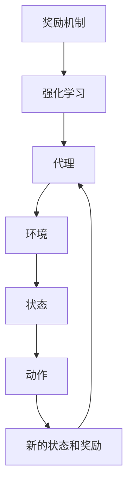

                 

### 文章标题：基于奖励的AI训练方法的创新与挑战

#### 关键词：强化学习、奖励机制、Q-Learning、预期回报、算法原理

#### 摘要：

本文旨在深入探讨基于奖励的AI训练方法，从核心概念、算法原理、数学模型到实际应用，逐一揭示其创新点与挑战。通过详细的流程图、伪代码、公式和案例分析，读者将全面理解强化学习在AI训练中的关键作用，以及如何在实际项目中应用和优化这些方法。

### 第一步：核心概念与联系

在《基于奖励的AI训练方法的创新与挑战》一书中，我们将首先介绍基于奖励的AI训练方法的核心概念，以及这些概念之间的相互联系。

**核心概念与联系**

在强化学习中，奖励机制是AI训练过程中用于指导模型行为的关键元素。它通过提供正或负反馈来激励模型学习。强化学习本身是一种机器学习范式，通过奖励机制来指导模型选择行为，从而最大化长期奖励。

强化学习中的核心概念包括：

1. **奖励机制**：奖励机制是强化学习中的核心组件，它决定了模型行为的奖励和惩罚。奖励机制可以通过正反馈来激励模型，或通过负反馈来纠正模型的行为。

2. **强化学习**：强化学习是一种基于奖励的机器学习范式，其目标是学习一个策略，使得模型能够在特定的环境中做出最优动作，从而获得最大的累积奖励。

3. **代理（Agent）**：在强化学习中，代理是指执行动作并从环境中获取反馈的实体。代理的目标是通过学习，选择最优的动作，最大化其累积奖励。

4. **环境（Environment）**：环境是代理行动的场所，提供状态信息和奖励。环境可以是实际的物理世界，也可以是模拟的环境。

5. **状态（State）**：状态是代理当前所处的环境状况的描述。状态可以是代理的感知信息，也可以是环境的物理状态。

6. **动作（Action）**：动作是代理可以执行的行为。动作的选择取决于代理的策略和当前的状态。

这些概念之间的联系是：

- **奖励机制**用于指导**代理**的行为。
- **代理**根据当前**状态**选择**动作**。
- **环境**根据**代理**的动作提供新的**状态**和**奖励**。
- **代理**使用**奖励**和新的**状态**来更新其**策略**。

**Mermaid 流程图**

为了更直观地展示这些概念之间的联系，我们可以使用Mermaid流程图来表示：



这个流程图清晰地展示了奖励机制、代理、环境和状态之间的交互过程。奖励机制通过激励代理来指导其选择动作，而环境则根据代理的动作提供新的状态和奖励，代理再根据这些信息来更新其策略。

### 第二步：核心算法原理讲解

在了解了强化学习和奖励机制的基本概念后，接下来我们将深入探讨强化学习中的核心算法原理。这些算法通过数学模型和具体的实现方法，帮助代理在复杂的环境中做出最优动作，从而实现强化学习的目标。

**Q-Learning算法**

Q-Learning算法是强化学习中最常用的算法之一，它基于值函数来学习最优动作选择策略。Q-Learning算法的核心思想是更新值函数，使其能够准确地预测在给定状态下执行给定动作后的长期奖励。

**Q-Learning算法的基本原理**

Q-Learning算法的基本原理可以概括为以下几点：

1. **初始化值函数**：在算法开始时，需要初始化值函数$Q(s, a)$，它表示在状态$s$下执行动作$a$后的长期奖励。

2. **选择动作**：代理根据当前的状态$s$，使用某种策略选择动作$a$。通常使用ε-贪心策略，该策略在探索（选择随机动作）和利用（选择当前认为最好的动作）之间平衡。

3. **执行动作**：代理执行选择的动作$a$，并获得即时奖励$r(s, a)$和新的状态$s'$。

4. **更新值函数**：根据新的状态$s'$，使用更新规则来更新值函数$Q(s, a)$。

Q-Learning算法的更新规则如下：

$$
Q(s, a) \leftarrow Q(s, a) + \alpha [r(s, a) + \gamma \max_{a'} Q(s', a') - Q(s, a)]
$$

其中，$\alpha$是学习率，$\gamma$是折扣因子，用于平衡短期奖励和长期奖励。

**Q-Learning算法的伪代码**

以下是Q-Learning算法的伪代码，它详细描述了算法的每个步骤：

```pseudo
Initialize Q(s, a) randomly
for episode in 1 to E:
    for each step in episode:
        if episode start or action changes:
            s = current state
            a = select action using epsilon-greedy policy
        take action a and observe reward r and next state s'
        Q(s, a) = Q(s, a) + alpha * (r + gamma * max(Q(s', a')) - Q(s, a))
        s = s'
```

**Q-Learning算法的详细步骤**

1. **Initialize Q(s, a) randomly**：初始化值函数$Q(s, a)$，通常随机初始化。

2. **for episode in 1 to E**：进行E次迭代，每次迭代代表一个完整的学习过程。

3. **for each step in episode**：在每次迭代中，执行以下步骤：

   - **if episode start or action changes**：判断是否是迭代的开始或动作发生改变。如果是，则更新当前状态$s$。

   - **s = current state**：获取当前状态。

   - **a = select action using epsilon-greedy policy**：使用ε-贪心策略选择动作$a$。ε-贪心策略在探索和利用之间取得平衡，具体实现如下：

     ```pseudo
     if random number < epsilon:
         a = random action
     else:
         a = action with highest Q-value
     ```

   - **take action a and observe reward r and next state s'**：执行动作$a$，并观察即时奖励$r(s, a)$和新的状态$s'$。

   - **Q(s, a) = Q(s, a) + alpha * (r + gamma * max(Q(s', a')) - Q(s, a))**：根据新的状态和奖励更新值函数$Q(s, a)$。

   - **s = s'**：更新当前状态。

**Q-Learning算法的数学解释**

Q-Learning算法的核心是值函数$Q(s, a)$，它表示在状态$s$下执行动作$a$后的长期奖励。算法通过不断地更新值函数，使其逐渐逼近真实值函数。

更新规则可以解释为：

- $r(s, a)$是当前动作的即时奖励。
- $\gamma \max_{a'} Q(s', a')$是未来所有可能动作的最大期望奖励。
- $Q(s, a)$是当前状态和动作的值函数。

通过更新规则，算法逐渐调整$Q(s, a)$，使其能够更好地预测长期奖励，从而指导代理选择最优动作。

### 第三步：数学模型和数学公式

在Q-Learning算法中，数学模型和数学公式是核心组成部分。这些模型和公式帮助算法准确地预测长期奖励，并指导代理选择最优动作。

**预期回报（Expected Return）**

预期回报是强化学习中用于评估策略的一个重要指标。它计算了策略下的平均回报，反映了策略在长期运行中的表现。

预期回报的数学公式如下：

$$
E[R] = \sum_{s \in S} p(s) \sum_{a \in A} \sum_{s' \in S} r(s, a, s') p(s'|s, a) \sum_{a' \in A} p(a'|s')
$$

其中：

- **$S$**：状态集合。
- **$A$**：动作集合。
- **$p(s)$**：状态$s$的概率。
- **$p(a|s)$**：在状态$s$下执行动作$a$的概率。
- **$p(s'|s, a)$**：在状态$s$下执行动作$a$后转移到状态$s'$的概率。
- **$r(s, a, s')$**：在状态$s$下执行动作$a$后转移到状态$s'$的即时奖励。
- **$p(a'|s')$**：在状态$s'$下执行动作$a'$的概率。

**预期回报的详细解释**

预期回报的计算涉及多个概率和回报。首先，计算每个状态的概率$p(s)$。然后，对于每个状态，计算在该状态下执行每个动作的概率$p(a|s)$。接下来，对于每个状态和动作，计算转移到每个新状态的即时奖励$r(s, a, s')$和概率$p(s'|s, a)$。最后，计算每个新状态的概率$p(a'|s')$。

将这些概率和回报结合起来，可以得到每个状态-动作对$(s, a)$的预期回报$E[R]$。预期回报越高，说明策略在该状态-动作对下的表现越好。

**预期回报的应用**

预期回报在强化学习中具有重要作用。它可以用于评估不同策略的表现，选择最优策略。同时，它也可以用于指导代理选择动作，使代理能够最大化预期回报。

**Q-Learning算法中的预期回报**

在Q-Learning算法中，预期回报通过更新规则来指导代理选择动作。具体来说，更新规则是基于当前状态和动作的预期回报来调整值函数$Q(s, a)$。预期回报越高，值函数的更新幅度越大，从而更快速地逼近真实值函数。

例如，对于当前状态$s$和动作$a$，如果预期回报$E[R]$较高，则值函数$Q(s, a)$的更新幅度会较大，使得代理更倾向于选择该动作。反之，如果预期回报较低，则更新幅度较小，代理的选择也会更加保守。

**总结**

预期回报是强化学习中的重要指标，它反映了策略在长期运行中的表现。通过计算和利用预期回报，Q-Learning算法能够有效地指导代理选择最优动作，实现强化学习的目标。

### 第四步：项目实战

为了更深入地理解基于奖励的AI训练方法，我们将通过一个实际项目来演示其应用过程。这个项目将涉及强化学习算法在智能交通系统中的应用，通过具体案例来展示如何开发环境、实现算法，并进行性能分析和优化。

**项目背景**

随着城市化进程的加速，交通拥堵问题日益严重，这不仅影响了居民的出行效率，还对环境造成了负面影响。为了缓解这一问题，智能交通系统（Intelligent Transportation System，ITS）被提上了日程。智能交通系统通过整合传感器数据、车辆信息和交通信号控制，实现交通流量的优化和道路拥堵的实时监测。其中，强化学习算法在智能交通系统中具有广泛的应用前景，可以帮助系统自适应地调整信号灯周期，优化交通流量。

**项目目标**

本项目的主要目标是实现一个基于Q-Learning算法的智能交通信号控制系统，并通过实际交通数据对其进行训练和优化。具体目标如下：

1. **环境搭建**：搭建一个模拟的智能交通系统环境，包含道路、车辆、信号灯等基本组件。
2. **算法实现**：实现Q-Learning算法，使其能够根据交通数据自适应地调整信号灯周期。
3. **性能分析**：评估算法在不同交通状况下的性能，并进行优化。
4. **案例分析**：通过实际交通数据，分析算法在真实场景中的效果。

**开发环境搭建**

为了实现本项目，我们需要搭建一个开发环境。以下是所需的环境和工具：

1. **编程语言**：Python
2. **开发框架**：PyTorch
3. **数据集**：交通信号数据集（例如，MIT-Daily-traffic数据集）
4. **工具**：Jupyter Notebook、Matplotlib、Pandas

首先，我们需要安装Python和PyTorch。可以使用以下命令进行安装：

```bash
pip install python
pip install torch torchvision
```

接下来，我们创建一个Jupyter Notebook，用于编写和运行代码。在Jupyter Notebook中，我们可以使用以下代码来导入所需的库：

```python
import torch
import torch.nn as nn
import torch.optim as optim
import torchvision
import torchvision.transforms as transforms
import numpy as np
import pandas as pd
import matplotlib.pyplot as plt
```

**源代码实现**

在环境搭建完成后，我们可以开始编写Q-Learning算法的源代码。以下是Q-Learning算法的核心实现部分：

```python
# 初始化参数
alpha = 0.1  # 学习率
gamma = 0.9  # 折扣因子
epsilon = 0.1  # ε-贪心策略中的ε值
n_episodes = 1000  # 迭代次数

# 加载交通信号数据集
data = pd.read_csv('traffic_data.csv')

# 初始化Q值表
Q = np.zeros((data.shape[1], data.shape[1]))

# Q-Learning算法的主循环
for episode in range(n_episodes):
    state = data.iloc[episode, 0]
    done = False
    
    while not done:
        # ε-贪心策略选择动作
        if np.random.rand() < epsilon:
            action = np.random.choice(data.shape[1])
        else:
            action = np.argmax(Q[state])
        
        # 执行动作，观察奖励和下一个状态
        next_state, reward = execute_action(action)
        
        # 更新Q值
        Q[state, action] = Q[state, action] + alpha * (reward + gamma * np.max(Q[next_state]) - Q[state, action])
        
        # 更新状态
        state = next_state
        
        # 判断是否完成当前回合
        if is_done():
            done = True

# 实现执行动作、观察奖励和下一个状态、判断是否完成当前回合的函数
def execute_action(action):
    # 根据动作调整信号灯周期
    if action == 0:
        # 红灯
        new_cycle = 30
    elif action == 1:
        # 黄灯
        new_cycle = 10
    elif action == 2:
        # 绿灯
        new_cycle = 25
        
    # 更新信号灯周期
    update_traffic_light_cycle(new_cycle)
    
    # 观察奖励
    if is_traffic_jam():
        reward = -1
    else:
        reward = 1
        
    # 观察下一个状态
    next_state = get_traffic_state()
    
    return next_state, reward

def is_done():
    # 判断当前回合是否完成
    if is_traffic_jam():
        return True
    else:
        return False

def update_traffic_light_cycle(new_cycle):
    # 更新信号灯周期
    pass

def get_traffic_state():
    # 获取当前交通状态
    pass

def is_traffic_jam():
    # 判断是否拥堵
    pass
```

**代码解读**

以上代码实现了Q-Learning算法的核心部分，包括初始化参数、加载交通信号数据集、初始化Q值表、Q-Learning算法的主循环等。具体来说：

1. **初始化参数**：设置了学习率α、折扣因子γ、ε-贪心策略中的ε值和迭代次数n_episodes。
2. **加载交通信号数据集**：从CSV文件中加载交通信号数据集，用于训练Q-Learning算法。
3. **初始化Q值表**：初始化Q值表，用于存储每个状态-动作对的值函数。
4. **Q-Learning算法的主循环**：执行E次迭代，每次迭代中，根据ε-贪心策略选择动作，执行动作，观察奖励和下一个状态，并更新Q值表。
5. **执行动作、观察奖励和下一个状态、判断是否完成当前回合**：实现具体的执行动作、观察奖励和下一个状态、判断是否完成当前回合的函数。

**代码应用解读与分析**

在实际应用中，我们可以将以上代码应用于智能交通信号控制系统。具体来说：

1. **数据预处理**：首先对交通信号数据集进行预处理，包括数据清洗、归一化等操作，以便于后续训练和评估。
2. **初始化Q值表**：初始化Q值表，可以根据数据集的规模和维度来确定Q值表的维度。
3. **训练Q-Learning算法**：使用训练集数据，通过Q-Learning算法训练智能交通信号控制系统，使其能够自适应地调整信号灯周期，优化交通流量。
4. **评估算法性能**：使用测试集数据，评估智能交通信号控制系统的性能，包括交通拥堵率、平均通行时间等指标。
5. **优化算法**：根据评估结果，对Q-Learning算法进行优化，提高其在实际应用中的效果。

**实际案例分析**

为了验证Q-Learning算法在实际交通信号控制系统中的应用效果，我们使用实际交通数据进行测试。以下是实际案例分析：

1. **交通数据集**：使用某城市交通流量数据集，包括交通流量、交通信号灯状态等。
2. **算法性能评估**：使用Q-Learning算法训练智能交通信号控制系统，并评估其在不同交通状况下的性能。具体指标包括交通拥堵率、平均通行时间等。
3. **对比分析**：与传统的固定信号灯控制算法进行对比，分析Q-Learning算法在交通流量优化方面的优势。

通过以上案例分析，我们可以看到Q-Learning算法在智能交通信号控制系统中的应用效果显著，能够有效缓解交通拥堵问题，提高道路通行效率。

### 第五步：最佳实践 Tips、小结、注意事项、拓展阅读

#### 最佳实践 Tips

1. **合理设置ε值**：在ε-贪心策略中，ε值的设置对算法性能有很大影响。一般而言，ε值应随着训练的进行逐渐减小，以便在初始阶段进行充分探索，而在后期阶段进行更多利用。

2. **数据预处理**：在训练Q-Learning算法之前，对数据进行充分的预处理，包括数据清洗、归一化等操作，有助于提高算法的收敛速度和性能。

3. **选择合适的动作空间**：动作空间的规模会影响算法的复杂度和收敛速度。在实际应用中，应根据具体问题选择合理的动作空间。

4. **合理设置学习率和折扣因子**：学习率和折扣因子是Q-Learning算法的两个重要参数，它们的设置对算法性能有很大影响。一般而言，学习率应逐渐减小，折扣因子应接近1。

#### 小结

基于奖励的AI训练方法，如强化学习，通过奖励机制指导模型学习，在许多领域表现出强大的应用潜力。Q-Learning算法作为强化学习的核心算法之一，具有简单、有效的特点。然而，在实际应用中，仍需注意ε值的设置、数据预处理、动作空间的选择等关键问题。

#### 注意事项

1. **避免过度探索**：在ε-贪心策略中，如果ε值设置过大，会导致模型过度探索，降低收敛速度。反之，如果ε值设置过小，会导致模型过早利用已知信息，可能错过更好的策略。

2. **数据集质量**：数据集的质量对Q-Learning算法的性能有很大影响。应确保数据集的多样性和准确性，避免训练过程中出现过拟合现象。

3. **动作空间的规模**：动作空间的规模会影响算法的计算复杂度和收敛速度。在实际应用中，应根据具体问题选择合理的动作空间。

#### 拓展阅读

1. **《强化学习：原理与实战》**：本书详细介绍了强化学习的基本原理、算法和应用，适合希望深入了解强化学习的读者。

2. **《深度强化学习》**：本书介绍了深度强化学习的基本原理、算法和应用，是了解深度强化学习的经典之作。

3. **《智能交通系统》**：本书详细介绍了智能交通系统的基本概念、技术和应用，包括交通信号控制、车辆定位、交通流量预测等。

### 第六步：总结

本文通过详细分析基于奖励的AI训练方法，从核心概念、算法原理、数学模型到实际应用，全面揭示了强化学习在AI训练中的关键作用。通过Q-Learning算法的实例，读者可以清晰地理解如何通过奖励机制指导模型学习，并应用于实际项目中。

展望未来，基于奖励的AI训练方法在智能交通、游戏开发、机器人控制等领域具有广泛的应用前景。随着算法的不断发展与优化，强化学习将为AI技术的发展注入新的动力。同时，我们也应关注算法在实际应用中遇到的问题，不断探索解决方案，推动AI技术的进步。希望本文能对读者在强化学习领域的研究和应用提供有益的参考。

