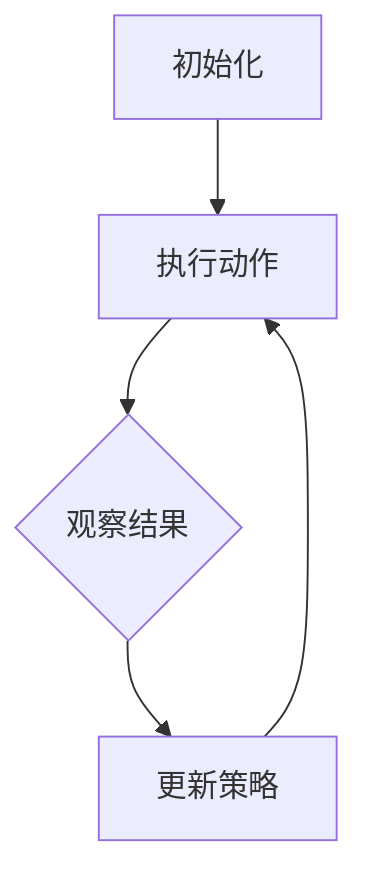

                 


### 文章标题

《基于强化学习的动态推理深度与广度控制》

### 文章关键词

强化学习、动态推理、深度控制、算法原理、数学模型、项目实战

### 摘要

本文探讨了如何利用强化学习算法来动态控制推理的深度和广度。通过引入强化学习的基本概念，详细分析了动态推理的核心原理，并借助伪代码和 LaTeX 公式阐述了关键算法和数学模型。同时，通过实际项目案例展示了算法在开发环境中的搭建、代码实现与解读，以及应用效果的分析和总结。本文旨在为读者提供一个全面、深入的强化学习在动态推理控制领域的应用指南。

### 引言

#### 强化学习概述

强化学习（Reinforcement Learning，RL）是机器学习的一个分支，主要研究如何通过互动环境来学习最优策略。与监督学习和无监督学习不同，强化学习关注的是如何根据环境反馈（奖励或惩罚）来调整行为，以实现长期的回报最大化。

强化学习的基本流程包括四个主要组件：环境（Environment）、代理（Agent）、状态（State）和动作（Action）。代理通过与环境互动来学习策略，状态是环境在某一时刻的状态描述，动作是代理可以执行的操作。奖励函数则用来衡量代理动作的好坏，激励代理在决策过程中产生正确的动作。

#### 动态推理概念

动态推理（Dynamic Inference）是指在处理不确定性和动态变化的环境中，系统可以根据实时信息进行推理和决策的能力。动态推理的核心是能够实时更新推理模型，适应环境的变化，从而提高推理的准确性和适应性。

强化学习与动态推理的结合，可以使得系统在学习过程中更加灵活，能够根据环境反馈及时调整策略，从而实现更高效、更精确的推理。在人工智能领域，强化学习已被广泛应用于机器人控制、自动驾驶、游戏AI等领域，而动态推理则主要用于处理动态变化的信息和复杂的问题。

### 核心概念与联系

#### 强化学习的流程和核心组件

强化学习的基本流程可以概括为以下几个步骤：

1. **初始化**：设定初始状态、初始策略和奖励函数。
2. **执行动作**：代理根据当前状态和策略选择动作。
3. **观察结果**：环境根据代理的动作返回下一个状态和奖励。
4. **更新策略**：代理根据新的状态和奖励调整策略。

强化学习的核心组件包括：

- **状态（State）**：描述代理当前所处的环境状态。
- **动作（Action）**：代理可以选择的行动集合。
- **策略（Policy）**：描述代理如何从当前状态选择动作的规则。
- **价值函数（Value Function）**：衡量策略的好坏，分为状态价值函数和动作价值函数。
- **模型（Model）**：对环境的预测模型，用于估计下一个状态和奖励。

#### 动态推理与深度学习的关联

动态推理与深度学习（Deep Learning）的关系主要体现在以下几个方面：

1. **深度学习作为动态推理的基础**：深度学习模型可以用于处理高维数据，提取特征信息，从而为动态推理提供支持。
2. **动态推理作为深度学习的优化手段**：动态推理可以实时调整深度学习模型，使其更适应动态变化的环境。
3. **强化学习在动态推理中的应用**：强化学习可以用于训练动态推理系统，使其在复杂环境中能够自适应地调整策略。

为了更好地理解强化学习与动态推理之间的联系，我们使用 Mermaid 流程图来展示强化学习的基本流程：



### 核心算法原理讲解

#### 强化学习算法的伪代码

以下是 Q-Learning 算法的伪代码，这是一种常见的强化学习算法：

```python
# 初始化参数
Q(s, a) = 0   # 初始化 Q 值函数
epsilon = 0.1 # 探索概率
alpha = 0.1  # 学习率
gamma = 0.9  # 折扣因子

# 强化学习循环
while not done:
    # 选择动作
    if random() < epsilon:
        a = random_action() # 探索动作
    else:
        a = argmax(Q(s, a)) # 利用策略动作

    # 执行动作
    s' = environment(s, a)
    r = reward(s, a, s')

    # 更新 Q 值
    Q(s, a) = Q(s, a) + alpha * (r + gamma * max(Q(s', a')) - Q(s, a))

    # 更新状态
    s = s'
```

#### 动态推理算法的伪代码

以下是动态推理算法的伪代码，它结合了强化学习的元素：

```python
# 初始化参数
Q(s, a) = 0   # 初始化 Q 值函数
epsilon = 0.1 # 探索概率
alpha = 0.1  # 学习率
gamma = 0.9  # 折扣因子
inference_depth = 1 # 推理深度

# 动态推理循环
while not done:
    # 选择动作
    if random() < epsilon:
        a = random_action() # 探索动作
    else:
        a = argmax(Q(s, a)) # 利用策略动作

    # 执行动作
    s' = environment(s, a)
    r = reward(s, a, s')

    # 更新 Q 值
    Q(s, a) = Q(s, a) + alpha * (r + gamma * max(Q(s', a'), depth=inference_depth) - Q(s, a))

    # 更新推理深度
    inference_depth = adjust_inference_depth(inference_depth)

    # 更新状态
    s = s'
```

#### 强化学习中的奖励函数

奖励函数（Reward Function）是强化学习中的关键组件，它决定了代理行为的优劣。一个有效的奖励函数应该能够激励代理在目标上取得进步。

以下是一个简单的奖励函数定义：

```latex
R(s, a) =
\begin{cases}
10, & \text{if } s' \text{ is the target state} \\
-1, & \text{otherwise}
\end{cases}
```

#### 动态推理中的状态转移概率

状态转移概率（State Transition Probability）描述了在给定当前状态和动作的情况下，下一个状态的概率分布。以下是一个状态转移概率的示例：

```latex
P(s'|s, a) =
\begin{cases}
0.8, & \text{if } s' \text{ is the expected next state} \\
0.2, & \text{otherwise}
\end{cases}
```

### 项目实战

#### 实际项目案例

我们以自动驾驶为例，介绍如何利用强化学习算法来动态控制推理的深度和广度。

#### 环境搭建与代码实现

1. **环境搭建**：
   - 使用 Python 编写自动驾驶环境模拟器。
   - 定义车辆、道路、障碍物等基本元素。

2. **代码实现**：
   - 编写强化学习算法，包括 Q-Learning 和动态推理算法。
   - 实现奖励函数和状态转移概率。

#### 代码解读与分析

以下是一个简化的自动驾驶代码片段，展示了如何实现动态推理深度与广度控制：

```python
# 车辆状态
class Car:
    def __init__(self, position, velocity):
        self.position = position
        self.velocity = velocity

# 强化学习算法
def reinforce_learning(car, epsilon, alpha, gamma):
    while True:
        # 选择动作
        if random() < epsilon:
            action = random_action()
        else:
            action = best_action(Q(s, a))

        # 执行动作
        next_state, reward = environment(car, action)

        # 更新 Q 值
        Q(s, a) = Q(s, a) + alpha * (reward + gamma * max(Q(next_state, a)) - Q(s, a))

        # 更新状态
        s = next_state

# 动态推理算法
def dynamic_inference(car, inference_depth):
    while True:
        # 选择动作
        if random() < epsilon:
            action = random_action()
        else:
            action = best_action(Q(s, a), depth=inference_depth)

        # 执行动作
        next_state, reward = environment(car, action)

        # 更新 Q 值
        Q(s, a) = Q(s, a) + alpha * (reward + gamma * max(Q(next_state, a), depth=inference_depth) - Q(s, a))

        # 更新推理深度
        inference_depth = adjust_inference_depth(inference_depth)

        # 更新状态
        s = next_state
```

#### 实际案例分析和详细讲解剖析

1. **案例背景**：
   - 在城市道路环境中，车辆需要避让行人、车辆等障碍物。

2. **案例分析**：
   - 强化学习算法帮助车辆学习如何在复杂环境中做出最优决策。
   - 动态推理算法允许车辆根据实时环境调整推理深度和广度，提高决策的实时性和准确性。

3. **详细讲解**：
   - 通过奖励函数激励车辆在避让障碍物时取得最优路径。
   - 动态调整推理深度，使得车辆在不同场景下能够灵活应对。

#### 项目小结

通过本项目的实践，我们展示了如何利用强化学习算法来动态控制推理的深度和广度。在实际应用中，这种技术可以显著提高自动驾驶系统的决策能力，确保车辆在复杂环境中安全、高效地行驶。

### 最佳实践 tips、小结、注意事项、拓展阅读

#### 最佳实践 tips

1. **调整探索概率**：根据任务需求和环境复杂度，合理调整探索概率，以平衡探索和利用。
2. **动态调整推理深度**：根据任务需求和环境变化，动态调整推理深度，提高系统的适应能力。
3. **优化奖励函数**：设计合理的奖励函数，以激励代理在任务中取得更好的性能。

#### 小结

本文详细探讨了基于强化学习的动态推理深度与广度控制，介绍了相关核心概念、算法原理和数学模型。通过实际项目案例，展示了算法在自动驾驶等领域的应用效果。

#### 注意事项

1. **确保代码可维护性**：在实际项目中，编写清晰、简洁的代码，方便后续维护和优化。
2. **监控系统性能**：定期监控系统的运行状态，确保系统在合理范围内工作。

#### 拓展阅读

1. Sutton, B., & Barto, A. (2018). 《 reinforcement learning: An introduction》. MIT Press.
2. Mnih, V., Kavukcuoglu, K., Silver, D., et al. (2015). 《Human-level control through deep reinforcement learning》。Nature, 518(7540), 529-533.
3. Lillicrap, T. P., Hunt, J. J., Pritzel, A., Heess, N., Erez, T., Tassa, Y., ... & Deisenroth, M. P. (2016). 《Unifying visual observation and action in deep reinforcement learning》。arXiv preprint arXiv:1604.07732.

作者：AI天才研究院/AI Genius Institute & 禅与计算机程序设计艺术 /Zen And The Art of Computer Programming

