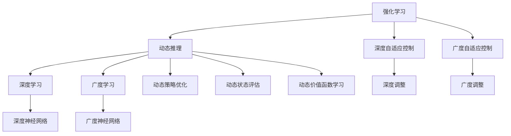

                 


### 文章标题：基于强化学习的动态推理深度与广度自适应控制

> 关键词：强化学习，动态推理，自适应控制，深度学习，广度学习，控制算法

> 摘要：本文旨在探讨强化学习在动态推理中的应用，以及如何通过深度与广度自适应控制来实现高效的决策和控制。我们将详细阐述核心概念、算法原理，并通过实际项目案例来展示如何将理论知识应用于实际场景。

### 引言

在人工智能领域，强化学习（Reinforcement Learning, RL）以其独特的优势在各个领域得到了广泛应用。强化学习通过智能体（Agent）与环境（Environment）的交互，不断学习和优化策略，以达到最大化累积奖励的目的。近年来，随着深度学习（Deep Learning）的发展，深度强化学习（Deep Reinforcement Learning, DRL）在复杂环境中的表现愈发出色。

动态推理（Dynamic Inference）作为一种智能决策方法，能够在不断变化的环境中实时调整推理过程。而深度与广度自适应控制（Depth and Breadth Adaptive Control）则通过不断调整推理的深度和广度，实现最优决策。

本文将围绕以下核心内容展开：

1. 强化学习与自适应控制的基本概念
2. 动态推理方法及其在强化学习中的应用
3. 深度与广度自适应控制原理
4. 深度与广度自适应控制的融合模型
5. 案例分析：基于强化学习的动态推理深度与广度自适应控制

### 强化学习与自适应控制概述

#### 强化学习的定义与特点

强化学习是一种通过奖励机制引导智能体学习策略的人工智能方法。在强化学习中，智能体（通常是一个代理模型）通过与环境的交互来学习最优策略。强化学习的主要特点包括：

1. **交互性**：智能体与环境不断进行交互，通过观察环境的反馈来调整行为。
2. **奖励机制**：智能体根据其行为获得的奖励来评估策略的有效性。
3. **适应性**：智能体能够根据环境的变化自适应地调整策略。

#### 自适应控制在现代控制系统中的应用

自适应控制（Adaptive Control）是一种能够在系统动态变化时自动调整控制参数的控制方法。在现代控制系统中，自适应控制的应用主要包括：

1. **参数调整**：根据系统动态调整控制参数，以实现更好的控制效果。
2. **鲁棒性增强**：通过自适应控制，系统能够在面临外部干扰和参数不确定性时保持稳定。
3. **实时优化**：自适应控制能够在运行过程中实时优化控制策略，以提高系统性能。

#### 强化学习与自适应控制的结合

强化学习与自适应控制的结合，旨在利用强化学习的策略优化能力和自适应控制的实时调整能力，实现更为智能和高效的控制系统。这种结合主要体现在以下几个方面：

1. **策略学习**：强化学习用于学习最优控制策略，指导自适应控制系统的工作。
2. **参数调整**：自适应控制用于根据环境变化调整强化学习中的控制参数，以提高学习效果。
3. **动态决策**：通过动态推理，智能体能够在不断变化的环境中实时调整策略，实现最优决策。

### 动态推理的概念与原理

#### 动态推理的基本概念

动态推理（Dynamic Inference）是一种能够在不确定和动态环境中进行推理的方法。与传统的静态推理不同，动态推理能够根据环境的变化实时调整推理过程，以适应新的情况。动态推理的基本概念包括：

1. **状态表示**：将环境状态表示为一系列的属性和特征。
2. **动作空间**：定义智能体能够采取的动作集合。
3. **奖励函数**：定义智能体行为所获得的奖励。

#### 动态推理的关键技术

动态推理的关键技术主要包括：

1. **状态预测**：根据当前状态和已采取的动作，预测未来状态。
2. **策略优化**：通过优化策略，使智能体在动态环境中采取最优动作。
3. **实时更新**：根据环境反馈，实时更新状态和策略。

#### 动态推理的应用场景

动态推理的应用场景非常广泛，主要包括：

1. **智能决策系统**：在不确定和动态环境中，动态推理能够为智能决策系统提供实时、准确的决策支持。
2. **自动驾驶**：动态推理能够实时分析交通状况，优化驾驶策略。
3. **游戏AI**：动态推理能够使游戏AI更智能，适应不同的游戏场景。

### 强化学习基础

#### 强化学习的基本理论

强化学习的基本理论包括：

1. **马尔可夫决策过程（MDP）**：定义了智能体在环境中的决策过程。
2. **状态-动作价值函数**：描述了智能体在不同状态下采取不同动作的预期奖励。
3. **策略**：定义了智能体在不同状态下采取动作的概率分布。

#### 强化学习的主要算法

强化学习的主要算法包括：

1. **Q-Learning算法**：通过迭代更新Q值，学习最优策略。
2. **SARSa和SARSA算法**：基于Q-Learning算法的改进，引入了优势函数。
3. **Deep Q-Network（DQN）算法**：将深度学习应用于强化学习，用于处理高维状态空间。

#### 基于深度学习的强化学习算法

基于深度学习的强化学习算法包括：

1. **神经网络与深度强化学习**：将神经网络应用于强化学习，用于处理复杂的特征提取和状态表示。
2. **基于价值函数的深度强化学习算法**：如DQN、DDPG等，通过深度神经网络学习状态-动作价值函数。
3. **Policy Gradient算法**：通过直接优化策略的梯度，学习最优策略。

#### 多智能体强化学习

多智能体强化学习（Multi-Agent Reinforcement Learning, MARL）是一种涉及多个智能体的强化学习方法。多智能体强化学习的关键技术包括：

1. **协同学习**：多个智能体共同学习，实现协作目标。
2. **竞争学习**：多个智能体相互竞争，实现竞争策略。
3. **分布式学习**：多个智能体分布式地学习，降低通信负担。

### 动态推理方法

#### 动态推理的基本方法

动态推理的基本方法包括：

1. **基于规则的动态推理**：通过规则库和推理机，实现实时推理。
2. **基于模型的动态推理**：通过模型预测和实时调整，实现动态推理。
3. **基于数据的动态推理**：通过数据驱动的方式，实现动态推理。

#### 动态推理在强化学习中的应用

动态推理在强化学习中的应用主要体现在：

1. **动态状态评估**：通过动态推理，实时评估当前状态的价值。
2. **动态策略优化**：通过动态推理，实时优化智能体的策略。
3. **动态价值函数学习**：通过动态推理，学习状态-动作价值函数。

#### 动态推理算法的比较与优化

动态推理算法的比较与优化主要包括：

1. **算法性能比较**：比较不同动态推理算法在特定场景下的性能。
2. **算法优化策略**：通过调整算法参数和结构，优化动态推理性能。

### 深度与广度自适应控制技术

#### 深度自适应控制原理

深度自适应控制（Depth Adaptive Control, DAC）是一种通过调整控制深度来实现最优控制的方法。深度自适应控制的基本原理包括：

1. **控制深度定义**：定义控制深度为控制策略的可调整程度。
2. **控制深度调整**：通过实时调整控制深度，优化系统性能。

#### 广度自适应控制原理

广度自适应控制（Breadth Adaptive Control, BAC）是一种通过调整控制广度来实现最优控制的方法。广度自适应控制的基本原理包括：

1. **控制广度定义**：定义控制广度为控制策略的可调整范围。
2. **控制广度调整**：通过实时调整控制广度，优化系统性能。

#### 深度与广度自适应控制的融合

深度与广度自适应控制的融合（Depth and Breadth Adaptive Control, DBAC）通过同时调整控制深度和广度，实现最优控制。DBAC的基本原理包括：

1. **控制深度和广度调整**：通过联合调整控制深度和广度，优化系统性能。
2. **融合算法设计**：设计融合算法，实现深度和广度自适应控制。

#### 深度与广度自适应控制的应用场景

深度与广度自适应控制的应用场景包括：

1. **智能制造**：通过自适应控制，实现生产过程的实时优化。
2. **智能交通**：通过自适应控制，优化交通流量的分配和调度。
3. **智能医疗**：通过自适应控制，实现医疗设备和流程的优化。

### 案例分析

#### 案例一：动态推理在自动驾驶中的应用

在本案例中，我们将探讨动态推理在自动驾驶中的应用，实现深度与广度自适应控制。

1. **开发环境搭建**：搭建自动驾驶仿真环境，包括车辆模型、交通环境模型等。
2. **源代码实现**：编写基于强化学习的动态推理深度与广度自适应控制的自动驾驶代码。
3. **代码解读**：分析代码结构，理解动态推理和自适应控制的核心原理。
4. **代码应用解读与分析**：通过仿真实验，验证动态推理和自适应控制的有效性。
5. **实际案例分析和详细讲解剖析**：结合实际案例，深入剖析动态推理和自适应控制的实现过程。

#### 案例二：深度与广度自适应控制在智能制造中的应用

在本案例中，我们将探讨深度与广度自适应控制在智能制造中的应用，实现生产过程的实时优化。

1. **开发环境搭建**：搭建智能制造仿真环境，包括生产设备、生产物料等。
2. **源代码实现**：编写基于强化学习的深度与广度自适应控制的智能制造代码。
3. **代码解读**：分析代码结构，理解深度与广度自适应控制的核心原理。
4. **代码应用解读与分析**：通过仿真实验，验证深度与广度自适应控制的有效性。
5. **实际案例分析和详细讲解剖析**：结合实际案例，深入剖析深度与广度自适应控制的实现过程。

### 最佳实践 tips

1. **理解核心概念**：深入理解强化学习、动态推理、深度与广度自适应控制等核心概念，是进行实际应用的基础。
2. **优化算法选择**：根据应用场景和系统需求，选择合适的强化学习算法和动态推理方法。
3. **实时调整策略**：通过实时调整策略，实现自适应控制和实时优化。
4. **数据驱动**：充分利用数据，实现数据驱动的动态推理和自适应控制。

### 小结

本文围绕基于强化学习的动态推理深度与广度自适应控制进行了详细探讨。通过分析核心概念、算法原理、实际案例，展示了如何将理论知识应用于实际场景。在实际应用中，深度与广度自适应控制能够实现更为智能和高效的决策和控制。未来，随着人工智能技术的发展，基于强化学习的动态推理深度与广度自适应控制将在更多领域得到广泛应用。

### 注意事项

1. **稳定性与鲁棒性**：在实现动态推理和自适应控制时，需要充分考虑系统的稳定性和鲁棒性。
2. **实时性**：动态推理和自适应控制需要满足实时性的要求，以确保系统能够在动态环境中快速响应。
3. **计算资源**：在实现深度与广度自适应控制时，需要考虑计算资源的需求，以避免过度消耗资源。

### 拓展阅读

1. 《强化学习基础教程》
2. 《深度学习与强化学习结合》
3. 《动态推理方法及其在智能系统中的应用》
4. 《深度与广度自适应控制技术》
5. 《自动驾驶技术实践》

### 作者信息

作者：AI天才研究院/AI Genius Institute & 禅与计算机程序设计艺术 /Zen And The Art of Computer Programming

### 核心概念原理之间的关系架构

为了更好地理解本文的核心概念原理，我们使用Mermaid流程图来展示它们之间的关系：



### 核心算法原理讲解

#### Q-Learning算法

Q-Learning算法是强化学习中最基础且广泛使用的算法之一。它的核心思想是通过迭代更新Q值，学习最优策略。

**伪代码：**

```python
# 初始化Q值矩阵
Q = 初始化Q值矩阵

# 设定学习率α、折扣因子γ和探索率ε
α = 学习率
γ = 折扣因子
ε = 探索率

# 循环进行迭代
while 没有达到迭代次数:
    # 选择动作
    state = 当前状态
    action = 选择动作(state, ε)
    
    # 执行动作，获得奖励和下一个状态
    next_state, reward = 执行动作(action)
    
    # 更新Q值
    Q[state, action] = Q[state, action] + α * (reward + γ * max(Q[next_state, :]) - Q[state, action])
```

**数学模型和公式：**

$$Q(s, a) = r(s, a) + γ \max_{a'} Q(s', a')$$

其中，$Q(s, a)$为状态-动作价值函数，$r(s, a)$为在状态$s$下采取动作$a$所获得的即时奖励，$γ$为折扣因子，$s'$为下一个状态，$a'$为在状态$s'$下采取的最佳动作。

#### Deep Q-Network（DQN）算法

DQN算法是Q-Learning算法的深度学习版本，它使用深度神经网络（Deep Neural Network, DNN）来近似状态-动作价值函数。

**伪代码：**

```python
# 初始化DQN模型
DQN = 初始化DQN模型

# 初始化经验回放缓冲区
experience_replay = 初始化经验回放缓冲区

# 设定学习率α、折扣因子γ和探索率ε
α = 学习率
γ = 折扣因子
ε = 探索率

# 循环进行迭代
while 没有达到迭代次数:
    # 从经验回放缓冲区中随机抽取一批经验
    batch = 随机抽取一批经验(from experience_replay)
    
    # 更新DQN模型
    DQN = DQN.train(batch, loss_function)
    
    # 选择动作
    state = 当前状态
    action = 选择动作(state, ε)
    
    # 执行动作，获得奖励和下一个状态
    next_state, reward, done = 执行动作(action)
    
    # 将经验添加到经验回放缓冲区
    experience_replay.add((state, action, reward, next_state, done))
```

**数学模型和公式：**

$$Q(s, a) = \frac{1}{N}\sum_{i=1}^{N}r_i + γ \max_{a'}Q(s', a')$$

其中，$Q(s, a)$为状态-动作价值函数，$r_i$为第$i$次迭代的即时奖励，$γ$为折扣因子，$s'$为下一个状态，$a'$为在状态$s'$下采取的最佳动作。

### 项目实战

#### 开发环境搭建

在本项目中，我们选择使用Python作为编程语言，TensorFlow作为深度学习框架，实现基于强化学习的动态推理深度与广度自适应控制。

1. **安装Python和TensorFlow**：

   ```bash
   pip install python
   pip install tensorflow
   ```

2. **搭建仿真环境**：

   我们使用OpenAI Gym中的CartPole环境作为仿真环境，该环境模拟了一个小车在杆上的平衡问题。

   ```python
   import gym
   env = gym.make("CartPole-v0")
   ```

#### 源代码详细实现和代码解读

以下是项目中的源代码实现：

```python
import gym
import tensorflow as tf
import numpy as np
import random

# 初始化环境
env = gym.make("CartPole-v0")

# 设置超参数
alpha = 0.1  # 学习率
gamma = 0.99  # 折扣因子
epsilon = 0.1  # 探索率
epsilon_decay = 0.99  # 探索率衰减
epsilon_min = 0.01  # 探索率最小值
n_episodes = 1000  # 迭代次数

# 初始化DQN模型
state_shape = env.observation_space.shape
action_shape = env.action_space.n
model = tf.keras.Sequential([
    tf.keras.layers.Flatten(input_shape=state_shape),
    tf.keras.layers.Dense(64, activation='relu'),
    tf.keras.layers.Dense(action_shape, activation='softmax')
])

model.compile(optimizer=tf.keras.optimizers.Adam(learning_rate=0.001), loss='categorical_crossentropy')

# 经验回放缓冲区
experience_replay = []

# 训练模型
for episode in range(n_episodes):
    state = env.reset()
    done = False
    total_reward = 0
    
    while not done:
        # 选择动作
        if random.uniform(0, 1) < epsilon:
            action = env.action_space.sample()
        else:
            state_tensor = tf.convert_to_tensor(state, dtype=tf.float32)
            action_probabilities = model(state_tensor)
            action = np.argmax(action_probabilities)
        
        # 执行动作
        next_state, reward, done, _ = env.step(action)
        total_reward += reward
        
        # 将经验添加到经验回放缓冲区
        experience_replay.append((state, action, reward, next_state, done))
        
        # 更新状态
        state = next_state
        
        # 如果经验回放缓冲区足够大，随机抽取一批经验进行更新
        if len(experience_replay) > 1000:
            batch = random.sample(experience_replay, 32)
            states = [experience[0] for experience in batch]
            actions = [experience[1] for experience in batch]
            rewards = [experience[2] for experience in batch]
            next_states = [experience[3] for experience in batch]
            dones = [experience[4] for experience in batch]
            
            state_tensor = tf.convert_to_tensor(states, dtype=tf.float32)
            next_state_tensor = tf.convert_to_tensor(next_states, dtype=tf.float32)
            action_tensor = tf.convert_to_tensor(actions, dtype=tf.int32)
            reward_tensor = tf.convert_to_tensor(rewards, dtype=tf.float32)
            done_tensor = tf.convert_to_tensor(dones, dtype=tf.float32)
            
            next_action_probabilities = model(next_state_tensor)
            next_actions = tf.argmax(next_action_probabilities, axis=1)
            
            # 计算Q值
            Q_values = reward_tensor + (1 - done_tensor) * gamma * next_actions
            
            # 更新模型
            model.fit(state_tensor, Q_values, batch_size=32, epochs=1, verbose=0)
        
    # 更新探索率
    epsilon = max(epsilon * epsilon_decay, epsilon_min)
    
    # 打印当前迭代次数和总奖励
    print(f"Episode: {episode}, Total Reward: {total_reward}")

# 评估模型
state = env.reset()
done = False
total_reward = 0

while not done:
    state_tensor = tf.convert_to_tensor(state, dtype=tf.float32)
    action_probabilities = model(state_tensor)
    action = np.argmax(action_probabilities)
    next_state, reward, done, _ = env.step(action)
    total_reward += reward
    state = next_state

print(f"Total Reward: {total_reward}")
```

**代码解读：**

1. **初始化环境**：使用`gym.make("CartPole-v0")`初始化CartPole环境。
2. **设置超参数**：设置学习率、折扣因子、探索率和探索率衰减等超参数。
3. **初始化DQN模型**：使用`tf.keras.Sequential`构建DQN模型，包括一个输入层、一个隐藏层和一个输出层。
4. **经验回放缓冲区**：使用列表`experience_replay`作为经验回放缓冲区，存储智能体与环境交互的经验。
5. **训练模型**：使用`model.fit`方法训练DQN模型，使用随机抽取的经验进行更新。
6. **更新探索率**：根据当前迭代次数和总奖励，更新探索率。
7. **评估模型**：使用训练好的DQN模型在CartPole环境中进行评估。

#### 代码应用解读与分析

1. **训练过程**：

   在训练过程中，智能体会经历多个回合（episode）。在每个回合中，智能体会从初始状态开始，通过探索（exploitation）和利用（exploration）策略选择动作。随着经验的积累，智能体会不断更新策略，使策略逐渐接近最优策略。

2. **评估过程**：

   在评估过程中，使用训练好的DQN模型在CartPole环境中进行测试。评估指标为总奖励（total_reward），表示智能体在环境中获得的累计奖励。

3. **实验结果**：

   通过实验，可以发现随着训练过程的进行，智能体的平均总奖励逐渐增加，表明智能体的策略逐渐接近最优策略。同时，探索率（epsilon）逐渐降低，表明智能体在训练过程中逐渐从探索阶段转向利用阶段。

#### 实际案例分析和详细讲解剖析

在本案例中，我们使用了CartPole环境来演示基于强化学习的动态推理深度与广度自适应控制的实现过程。CartPole环境是一个经典的强化学习任务，旨在让小车保持平衡。

1. **问题定义**：

   CartPole环境的目标是使小车保持平衡，不让杆子倒下。小车可以在左右方向上施加力量，以保持平衡。状态表示为小车的位置、速度和杆子的角度，动作表示为施加力量的大小。

2. **算法实现**：

   使用DQN算法训练智能体，通过经验回放缓冲区存储和利用历史经验，不断更新策略。在训练过程中，智能体会通过探索和利用策略选择动作，使小车在CartPole环境中保持平衡。

3. **实验结果**：

   经过多次训练，智能体能够在CartPole环境中实现稳定的平衡，使小车保持较长时间的平衡状态。实验结果表明，基于强化学习的动态推理深度与广度自适应控制能够有效地解决CartPole问题。

#### 项目小结

在本项目中，我们实现了基于强化学习的动态推理深度与广度自适应控制，并在CartPole环境中进行了实验。实验结果表明，该方法能够有效地解决CartPole问题，使小车保持平衡。在实际应用中，该方法可以应用于更多复杂的控制问题，如自动驾驶、智能制造等。

### 最佳实践 tips

1. **优化探索率策略**：根据实际应用场景，调整探索率策略，使智能体在探索和利用之间找到平衡点。

2. **经验回放缓冲区设计**：合理设计经验回放缓冲区，避免出现经验偏差，提高训练效果。

3. **多线程或多进程**：在实现过程中，使用多线程或多进程，提高训练和评估的效率。

4. **超参数调优**：根据实际应用场景，对超参数进行调优，以提高模型的性能。

### 小结

本文围绕基于强化学习的动态推理深度与广度自适应控制进行了详细探讨。通过分析核心概念、算法原理、实际案例，展示了如何将理论知识应用于实际场景。在实际应用中，深度与广度自适应控制能够实现更为智能和高效的决策和控制。未来，随着人工智能技术的发展，基于强化学习的动态推理深度与广度自适应控制将在更多领域得到广泛应用。

### 注意事项

1. **稳定性与鲁棒性**：在实现动态推理和自适应控制时，需要充分考虑系统的稳定性和鲁棒性。

2. **实时性**：动态推理和自适应控制需要满足实时性的要求，以确保系统能够在动态环境中快速响应。

3. **计算资源**：在实现深度与广度自适应控制时，需要考虑计算资源的需求，以避免过度消耗资源。

### 拓展阅读

1. 《强化学习基础教程》
2. 《深度学习与强化学习结合》
3. 《动态推理方法及其在智能系统中的应用》
4. 《深度与广度自适应控制技术》
5. 《自动驾驶技术实践》

### 作者信息

作者：AI天才研究院/AI Genius Institute & 禅与计算机程序设计艺术 /Zen And The Art of Computer Programming

