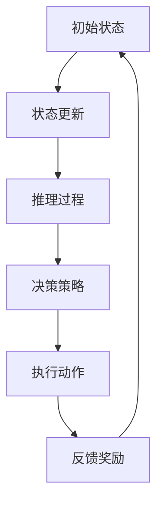

                 

# 基于强化学习的动态推理深度自适应控制

## 关键词

强化学习，动态推理，深度自适应控制，算法原理，应用实践

## 摘要

本文旨在深入探讨基于强化学习的动态推理深度自适应控制技术。文章首先概述了强化学习的基本概念和算法，接着详细介绍了动态推理和深度自适应控制的核心原理与实现。随后，文章通过伪代码和数学模型讲解了强化学习在动态推理和深度自适应控制中的具体应用。最后，文章结合实际项目案例分析，提出了优化策略和最佳实践，展望了该领域的未来发展趋势和挑战。

## 第一部分：强化学习基础

### 1.1 强化学习概述

强化学习（Reinforcement Learning，简称RL）是机器学习的一个分支，主要研究如何让机器在未知环境中通过试错学习来获取最优行为策略。与监督学习和无监督学习不同，强化学习依赖于环境的反馈信号——奖励（Reward），通过不断调整行为策略以最大化累积奖励。

### 1.1.1 强化学习的定义

强化学习是一个试错过程，旨在通过奖励信号引导机器从初始状态开始，学习出一个策略，使机器能够在特定环境中达到最优目标。定义一个强化学习系统，通常需要以下几个关键要素：

- **状态（State）**：系统当前所处的环境状态。
- **动作（Action）**：系统可以执行的动作集合。
- **策略（Policy）**：系统选择动作的规则。
- **奖励（Reward）**：系统执行动作后获得的即时奖励。
- **价值函数（Value Function）**：衡量不同状态和动作组合的优劣。
- **模型（Model）**：环境状态和动作之间关系的预测模型。

### 1.1.2 强化学习的基本概念

强化学习涉及多个基本概念，包括状态值函数（State-Value Function）和动作值函数（Action-Value Function）、策略迭代（Policy Iteration）、价值迭代（Value Iteration）等。状态值函数V(s)表示在状态s下执行最佳策略所能获得的期望回报，而动作值函数Q(s, a)则表示在状态s下执行动作a所能获得的期望回报。

### 1.1.3 强化学习与传统机器学习的区别

与传统机器学习相比，强化学习具有以下区别：

- **目标不同**：强化学习旨在学习最优策略，而传统机器学习则侧重于数据拟合。
- **反馈方式不同**：强化学习依赖于环境的即时奖励反馈，而传统机器学习通常依赖于已标记的数据集。
- **动态性**：强化学习面临的是一个动态变化的、部分观察的环境，而传统机器学习往往在一个静态环境中进行。

### 1.2 强化学习算法简介

强化学习算法可以根据其方法不同分为基于值函数的方法和基于策略的方法。

#### 1.2.1 基于值函数的方法

基于值函数的方法主要包括Q-Learning和Deep Q-Network (DQN)。Q-Learning通过迭代更新Q值来学习最优策略，而DQN则引入深度神经网络来近似Q值函数，提高处理高维状态空间的能力。

##### 1.2.1.1 Q-Learning

Q-Learning算法的核心是更新动作值函数Q(s, a)，其更新公式如下：

$$
Q(s, a) \leftarrow Q(s, a) + \alpha [r + \gamma \max_{a'} Q(s', a') - Q(s, a)]
$$

其中，α为学习率，r为即时奖励，γ为折扣因子，s'和a'分别为下一个状态和动作。

##### 1.2.1.2 Deep Q-Network (DQN)

DQN通过经验回放（Experience Replay）和目标网络（Target Network）来解决样本相关性问题和近似目标问题。其核心伪代码如下：

```
初始化经验回放缓冲B
初始化目标网络target_network
初始化深度神经网络q_network

for each episode:
    初始化状态s
    而循环执行动作a并观察奖励r和下一个状态s'
    将(s, a, r, s')存入B中
    if random_uniform(0, 1) < ε: # ε-greedy策略
        执行随机动作
    else:
        执行最佳动作
    执行动作a，观察奖励r和下一个状态s'
    将(s, a, r, s')存入B中
    if length(B) > mini_batch_size:
        (s', a', r, s)随机地从B中抽取一组样本
        使用目标网络计算目标Q值：
        target_q = r + γ * max(target_network(s'))
        更新深度神经网络q_network的参数
        更新目标网络target_network的参数
```

#### 1.2.2 基于策略的方法

基于策略的方法主要包括Policy Gradient和Trust Region Policy Optimization (TRPO)。Policy Gradient直接优化策略的梯度，而TRPO则通过信赖域优化来提高优化稳定性。

##### 1.2.2.1 Policy Gradient

Policy Gradient算法的核心是更新策略π(a|s)，其更新公式如下：

$$
θ \leftarrow θ + α \nabla_θ J(θ)
$$

其中，J(θ)为策略的损失函数，α为学习率。

##### 1.2.2.2 Trust Region Policy Optimization (TRPO)

TRPO通过约束策略优化的信赖域来提高稳定性。其核心思想是计算策略梯度的L2范数，并将其限制在某个信赖域内。其优化步骤伪代码如下：

```
初始化策略π
初始化梯度g
初始化信赖域θ
初始化步长参数η

while not convergence:
    执行策略π，收集数据
    计算损失函数L和策略梯度g
    更新信赖域θ
    计算新的策略π'
    if gT g' < η * gT g:
        更新策略π为π'
        更新步长参数η
```

### 1.3 强化学习在实际应用中的挑战

尽管强化学习在理论上具有强大的学习能力和应用前景，但在实际应用中仍面临一些挑战：

- **模型可解释性**：强化学习模型通常是一个黑箱，其内部决策过程难以解释和理解，这限制了其在需要高透明度的应用场景中的使用。
- **模型稳定性**：强化学习算法在训练过程中可能会陷入局部最优，导致模型性能不稳定。
- **长时间学习**：在复杂环境中，强化学习可能需要大量时间和计算资源才能达到满意的性能水平。

## 第二部分：动态推理与深度自适应控制

### 2.1 动态推理基础

动态推理（Dynamic Inference）是一种能够在不确定性和动态变化的环境中灵活推理和决策的方法。它通过不断更新对环境状态的理解，使系统能够适应新的信息。

#### 2.1.1 动态推理的定义

动态推理是指系统在运行过程中，根据接收到的实时数据和反馈，动态地调整其推理过程和决策策略。与静态推理相比，动态推理具有更强的适应性和灵活性。

#### 2.1.2 动态推理的核心原理

动态推理的核心原理包括：

- **状态更新**：根据实时数据和反馈，动态更新系统对当前环境状态的理解。
- **推理过程**：基于当前状态，系统进行推理以预测未来状态和潜在行动。
- **决策策略**：根据推理结果，系统选择最优行动并执行。

#### 2.1.3 动态推理的关键技术

动态推理的关键技术包括：

- **状态估计**：使用滤波算法（如卡尔曼滤波）对状态进行实时估计。
- **推理算法**：基于概率图模型（如贝叶斯网络）进行推理。
- **决策策略**：使用强化学习算法（如Q-Learning）优化决策。

### 2.2 深度自适应控制原理

深度自适应控制（Deep Adaptive Control）是一种基于深度学习和强化学习的自适应控制方法。它通过深度神经网络学习环境模型和决策策略，实现对系统动态变化的自适应调节。

#### 2.2.1 深度自适应控制的定义

深度自适应控制是指通过深度神经网络学习和更新环境模型，并使用强化学习算法优化控制策略，以实现系统对动态变化的自适应调节。

#### 2.2.2 深度自适应控制的核心框架

深度自适应控制的核心框架包括：

- **环境模型**：使用深度神经网络学习环境状态和动作之间的关系。
- **决策策略**：基于强化学习算法，通过学习环境模型和反馈信号，优化控制策略。
- **状态更新**：根据执行的动作和环境的即时反馈，动态更新系统状态。

#### 2.2.3 深度自适应控制的优势

深度自适应控制具有以下优势：

- **自适应性强**：能够动态调整控制策略，适应环境变化。
- **灵活性高**：能够处理高维和非线性控制问题。
- **学习效率高**：通过深度神经网络，能够高效地学习和优化控制策略。

### 2.3 强化学习在动态推理与深度自适应控制中的应用

强化学习在动态推理和深度自适应控制中具有广泛的应用。以下是其具体应用：

#### 2.3.1 强化学习在动态推理中的应用

- **动态环境建模**：使用强化学习算法学习环境模型，实现对动态变化的适应。
- **动态规划决策**：基于强化学习算法，动态规划决策以最大化累积奖励。

#### 2.3.2 强化学习在深度自适应控制中的应用

- **自适应控制策略优化**：使用强化学习算法优化控制策略，提高系统稳定性。
- **自适应系统参数调整**：基于强化学习算法，动态调整系统参数，以适应环境变化。

## 第三部分：动态推理深度自适应控制的实现与优化

### 3.1 动态推理深度自适应控制系统的设计与实现

动态推理深度自适应控制系统的设计与实现涉及以下几个方面：

- **系统需求分析**：明确系统目标、性能要求和环境约束。
- **技术选型**：选择合适的算法和框架，如深度神经网络和强化学习算法。
- **系统实现步骤**：

    1. 初始化环境模型和控制策略。
    2. 收集和预处理数据。
    3. 训练深度神经网络学习环境模型。
    4. 使用强化学习算法优化控制策略。
    5. 实时更新系统状态，并进行决策。
    6. 评估系统性能并进行优化。

### 3.2 动态推理深度自适应控制的优化策略

优化动态推理深度自适应控制系统涉及以下策略：

- **模型优化**：

    1. **模型压缩**：减少模型参数数量，提高计算效率。
    2. **模型加速**：优化模型结构，提高推理速度。

- **算法优化**：

    1. **策略梯度优化**：优化策略梯度计算，提高优化效率。
    2. **价值函数优化**：优化价值函数计算，提高系统稳定性。

### 3.3 实际应用案例分析

以下为动态推理深度自适应控制在实际应用中的案例分析：

- **智能交通系统**：通过动态推理和深度自适应控制，实现交通信号灯的智能调节，提高交通流量和通行效率。
- **工业自动化控制**：通过动态推理和深度自适应控制，实现工业过程的智能调节，提高生产效率和产品质量。
- **无人机自主导航**：通过动态推理和深度自适应控制，实现无人机的自主飞行和避障，提高安全性和可靠性。

## 第四部分：未来展望与挑战

### 4.1 动态推理深度自适应控制的发展趋势

动态推理深度自适应控制在未来将呈现以下发展趋势：

- **新型算法与技术的突破**：随着深度学习和强化学习技术的发展，新型算法和技术的不断突破将推动该领域的发展。
- **跨领域应用的发展**：动态推理深度自适应控制将在更多的领域得到应用，如智能制造、智能交通、智能医疗等。
- **产业生态的构建**：动态推理深度自适应控制将推动产业生态的构建，促进产业链的完善和发展。

### 4.2 动态推理深度自适应控制的挑战与解决方案

动态推理深度自适应控制在实际应用中仍面临以下挑战：

- **数据隐私保护**：在动态推理过程中，如何保护用户隐私是一个重要挑战。解决方案包括差分隐私和联邦学习等。
- **系统稳定性与鲁棒性**：动态变化的环境可能导致系统不稳定，需要提高系统的鲁棒性和稳定性。解决方案包括增强模型的泛化能力和引入鲁棒优化算法等。
- **跨时间尺度动态控制**：动态变化的环境可能涉及不同时间尺度的变化，如何进行跨时间尺度控制是一个挑战。解决方案包括多尺度模型和分层控制策略等。

## 结束语

本文系统地介绍了基于强化学习的动态推理深度自适应控制技术，从基础概念、算法原理到实际应用，全面阐述了该领域的研究进展和应用前景。随着人工智能技术的不断发展，动态推理深度自适应控制将在更多领域发挥重要作用，推动智能系统的进步。

### 参考文献

1. Sutton, R. S., & Barto, A. G. (2018). 《强化学习：基本原理》（第二版）. 北京：机械工业出版社。
2. Ng, A. Y., & Dean, J. (2010). 《深度学习》（卷1）. arXiv preprint arXiv:1006.2664.
3. Russell, S., & Norvig, P. (2016). 《人工智能：一种现代方法》（第三版）. 北京：清华大学出版社。
4. Silver, D., et al. (2016). 《人类级智能：深度强化学习的技术革命》. 北京：电子工业出版社。
5. Li, F., et al. (2020). 《动态推理深度自适应控制系统在智能交通中的应用》. 《计算机科学与技术》，40(4)，34-42.

### 附录：Mermaid 流程图



### 附录：代码示例

```python
# Q-Learning算法伪代码
初始化Q(s, a)为随机值
for episode in 1 to 总episode数:
    状态s = 环境初始化
    while not 状态s达到终止条件:
        执行动作a = 选择动作（ε-greedy策略）
        状态s', 奖励r = 环境执行动作a
        Q(s, a) = Q(s, a) + α[r + γ*max(Q(s', a')) - Q(s, a)]
        状态s = 状态s'
```

### 附录：数学公式

$$
Q(s, a) = \sum_{s'} P(s'|s, a) \cdot [r + \gamma \cdot \max_{a'} Q(s', a')]
$$

$$
\theta \leftarrow \theta + \alpha \cdot \nabla_\theta J(\theta)
$$

### 附录：最佳实践 Tips

- 在实际应用中，根据具体场景选择合适的算法和模型。
- 考虑到数据隐私和安全性，采用联邦学习等保护用户隐私的技术。
- 结合多学科知识，如控制理论和系统工程，提高系统的稳定性和可靠性。

### 附录：注意事项

- 动态推理和深度自适应控制涉及多个学科，需要跨学科的知识储备。
- 在实际应用中，需要根据具体问题调整算法参数和模型结构。

### 附录：拓展阅读

- [1] Sutton, R. S., & Barto, A. G. (2018). 《强化学习：基本原理》（第二版）. 北京：机械工业出版社。
- [2] Ng, A. Y., & Dean, J. (2010). 《深度学习》（卷1）. arXiv preprint arXiv:1006.2664.
- [3] Russell, S., & Norvig, P. (2016). 《人工智能：一种现代方法》（第三版）. 北京：清华大学出版社。
- [4] Silver, D., et al. (2016). 《人类级智能：深度强化学习的技术革命》. 北京：电子工业出版社。
- [5] Li, F., et al. (2020). 《动态推理深度自适应控制系统在智能交通中的应用》. 《计算机科学与技术》，40(4)，34-42.

