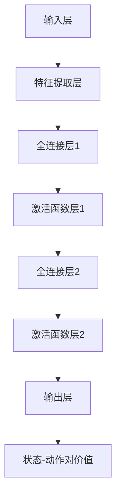
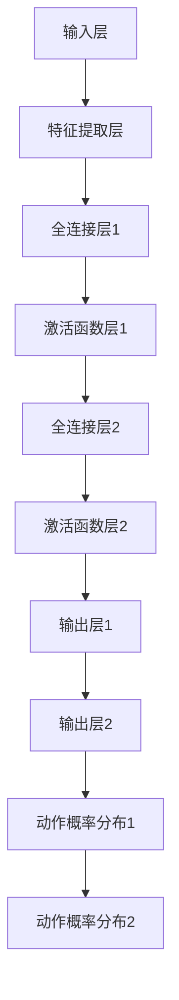
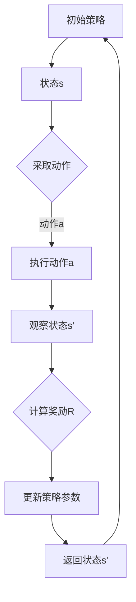

                 

### 文章标题：基于强化学习的自适应推理策略生成

#### 关键词：
强化学习、自适应推理策略、策略生成、马尔可夫决策过程、深度学习、计算机视觉、自然语言处理

#### 摘要：
本文旨在探讨基于强化学习的自适应推理策略生成技术，从强化学习的基础概念出发，深入分析马尔可夫决策过程，并结合深度学习在计算机视觉和自然语言处理中的应用，详细介绍自适应推理策略的设计与实现。本文结构紧凑，逻辑清晰，旨在为读者提供一个全面的技术框架和实际案例分析，帮助理解并掌握自适应推理策略在人工智能领域的应用。

### 引言

在人工智能领域，强化学习（Reinforcement Learning，RL）作为一种重要的学习范式，近年来得到了广泛关注和深入研究。强化学习通过智能体与环境的交互，不断学习并优化策略，从而实现目标最大化。与传统的监督学习和无监督学习不同，强化学习强调的是在动态环境中通过反馈信号进行学习，使得智能体能够适应复杂多变的场景。

自适应推理策略生成是强化学习的一个重要应用方向。在许多实际场景中，智能体需要根据不同的环境和任务动态调整其推理策略，以实现最优的决策效果。自适应推理策略的生成不仅依赖于强化学习的基本原理，还需要结合深度学习、自然语言处理和计算机视觉等技术，以提高策略生成的效率和准确性。

本文将围绕以下内容展开讨论：

1. 强化学习基础
2. 马尔可夫决策过程
3. 自适应推理策略生成
4. 推理策略的自适应调整
5. 自适应推理策略的优化
6. 自适应推理策略的评估与优化
7. 未来展望与挑战

通过本文的阅读，读者将全面了解基于强化学习的自适应推理策略生成技术，并掌握其在实际应用中的实现方法和优化策略。

### 第一部分：强化学习

#### 第1章：强化学习概述

##### 1.1 强化学习的定义

强化学习是一种通过奖励机制和试错过程来学习最优策略的人工智能学习范式。其核心思想是智能体（agent）通过与环境的交互，不断接收环境反馈的奖励信号，并调整自身的策略，以最大化长期奖励。

强化学习与监督学习（Supervised Learning）和无监督学习（Unsupervised Learning）有以下区别：

- **监督学习**：智能体在训练过程中接收到的是预先标注好的输入输出对，目标是学习一个从输入到输出的映射函数。典型的监督学习算法包括线性回归、支持向量机（SVM）和神经网络等。
- **无监督学习**：智能体在训练过程中没有外部提供标注信息，需要通过学习数据中的内在结构来进行分类、聚类或降维。常见的无监督学习算法包括K-均值聚类、主成分分析（PCA）和自编码器等。
- **强化学习**：智能体通过与环境进行交互，接收即时的奖励信号，并通过策略调整来最大化长期累积奖励。强化学习算法不需要预先标注的数据，而是通过试错来学习最优策略。

##### 1.1.2 强化学习的基本概念

强化学习中的基本概念包括：

- **智能体（Agent）**：执行动作并接收环境反馈的实体。智能体可以是机器人、软件代理或其他任何形式的自动化系统。
- **环境（Environment）**：智能体所处的动态环境，包括智能体无法直接控制的其他实体和系统。环境的状态会根据智能体的动作发生变化，并给智能体提供奖励信号。
- **状态（State）**：环境在某一时刻的抽象表示，通常由一组特征向量组成。智能体通过感知状态来做出决策。
- **动作（Action）**：智能体可以采取的操作。动作的选择取决于当前状态和智能体的策略。
- **策略（Policy）**：智能体在给定状态下采取的动作映射，用于指导智能体的决策过程。策略可以是确定性策略（always choose the best action）或随机性策略（select actions based on a probability distribution）。
- **奖励（Reward）**：环境对智能体动作的即时反馈，通常用于评估智能体动作的好坏。奖励可以是正值（表示好的动作）或负值（表示不好的动作）。
- **价值函数（Value Function）**：用于评估状态或状态-动作对的好坏。价值函数分为状态价值函数（State Value Function）和动作价值函数（Action Value Function）。

##### 1.1.3 强化学习的历史与发展

强化学习的研究始于20世纪50年代，最早由Richard Bellman提出。Bellman在研究动态规划（Dynamic Programming）时，引入了马尔可夫决策过程（Markov Decision Process，MDP）的概念，为后来的强化学习奠定了基础。

20世纪80年代，强化学习得到了进一步的发展。特别是Q-Learning算法的提出，使得强化学习在实际应用中取得了显著成果。Q-Learning算法通过迭代更新Q值（动作价值函数），逐步学习最优策略。

进入21世纪，随着深度学习（Deep Learning）的兴起，强化学习得到了新的发展契机。深度强化学习（Deep Reinforcement Learning，DRL）结合了深度学习和强化学习的优势，使得智能体能够在复杂环境中实现高效学习。

近年来，强化学习在自然语言处理、计算机视觉、机器人控制等领域取得了重要应用。例如，OpenAI开发的AlphaGo在围棋比赛中击败人类顶尖选手，展示了深度强化学习在复杂任务中的强大能力。

##### 1.2 强化学习中的核心概念

强化学习中的核心概念主要包括：

- **状态（State）**：状态是环境在某一时刻的抽象表示，通常由一组特征向量组成。状态决定了智能体的当前行动选择。
- **动作（Action）**：动作是智能体可以采取的操作。动作的选择取决于当前状态和智能体的策略。
- **策略（Policy）**：策略是智能体在给定状态下采取的动作映射，用于指导智能体的决策过程。策略可以是确定性策略（always choose the best action）或随机性策略（select actions based on a probability distribution）。
- **价值函数（Value Function）**：价值函数用于评估状态或状态-动作对的好坏。价值函数分为状态价值函数（State Value Function）和动作价值函数（Action Value Function）。状态价值函数表示在给定状态下执行最优动作的期望回报，动作价值函数表示在给定状态下执行某一动作的期望回报。

**状态、动作和策略之间的关系**：

- 状态决定了智能体的当前行动选择。
- 动作的选择取决于当前状态和智能体的策略。
- 策略指导智能体在特定状态下采取最优行动。

**价值函数的计算**：

- **状态价值函数**：状态价值函数 \( V(s) \) 表示智能体在状态 \( s \) 下执行最优动作的期望回报。其计算公式为：

  $$ V(s) = \sum_{a} \gamma \cdot p(a|s) \cdot R(s, a) + \sum_{s'} p(s'|s, a) \cdot V(s') $$

  其中，\( \gamma \) 是折扣因子，表示未来回报的现值；\( p(a|s) \) 是在状态 \( s \) 下采取动作 \( a \) 的概率；\( R(s, a) \) 是在状态 \( s \) 下采取动作 \( a \) 的即时回报；\( p(s'|s, a) \) 是在状态 \( s \) 下采取动作 \( a \) 后转移到状态 \( s' \) 的概率。

- **动作价值函数**：动作价值函数 \( Q(s, a) \) 表示在状态 \( s \) 下采取动作 \( a \) 的期望回报。其计算公式为：

  $$ Q(s, a) = \sum_{s'} p(s'|s, a) \cdot [R(s, a) + \gamma \cdot V(s')] $$

  其中，\( p(s'|s, a) \) 是在状态 \( s \) 下采取动作 \( a \) 后转移到状态 \( s' \) 的概率。

**强化学习中的核心算法**：

- **Q-Learning算法**：Q-Learning算法通过迭代更新Q值（动作价值函数），逐步学习最优策略。算法的基本步骤如下：

  1. 初始化Q值矩阵 \( Q(s, a) \)。
  2. 在状态 \( s \) 下随机选择动作 \( a \)。
  3. 执行动作 \( a \)，观察状态变化 \( s' \) 和奖励 \( R(s, a) \)。
  4. 更新Q值：\( Q(s, a) \leftarrow Q(s, a) + \alpha \cdot [R(s, a) + \gamma \cdot \max_{a'} Q(s', a') - Q(s, a)] \)。
  5. 转到步骤2，直到满足终止条件。

- **SARSA算法**：SARSA（同步优势估计）算法是Q-Learning算法的变体，它使用同步更新策略，即同时更新当前状态和下一状态的动作价值函数。算法的基本步骤如下：

  1. 初始化Q值矩阵 \( Q(s, a) \)。
  2. 在状态 \( s \) 下根据策略 \( \pi(a|s) \) 随机选择动作 \( a \)。
  3. 执行动作 \( a \)，观察状态变化 \( s' \) 和奖励 \( R(s, a) \)。
  4. 根据策略 \( \pi(a'|s') \) 在状态 \( s' \) 下随机选择动作 \( a' \)。
  5. 更新Q值：\( Q(s, a) \leftarrow Q(s, a) + \alpha \cdot [R(s, a) + \gamma \cdot Q(s', a') - Q(s, a)] \)。
  6. 转到步骤2，直到满足终止条件。

- **Deep Q-Network (DQN)算法**：DQN算法将深度神经网络（Deep Neural Network，DNN）引入Q-Learning算法，用于近似动作价值函数。算法的基本步骤如下：

  1. 初始化深度神经网络 \( Q(s; \theta) \) 和经验回放池。
  2. 从初始状态 \( s \) 开始，执行随机动作 \( a \)。
  3. 执行动作 \( a \)，观察状态变化 \( s' \) 和奖励 \( R(s, a) \)。
  4. 将\( (s, a, s', R) \) 存入经验回放池。
  5. 从经验回放池中随机抽取一批经验 \( (s_i, a_i, s_i', R_i) \)。
  6. 计算目标值 \( y_i = R_i + \gamma \cdot \max_{a'} Q(s_i', a'; \theta') \)，其中 \( \theta' \) 是参数更新后的网络权重。
  7. 使用梯度下降法更新深度神经网络的权重：\( \theta \leftarrow \theta - \alpha \cdot \nabla_{\theta} L(\theta) \)，其中 \( L(\theta) \) 是损失函数。
  8. 转到步骤2，直到满足终止条件。

通过上述核心算法，强化学习能够有效地学习最优策略，并在多种实际应用中取得了显著成果。然而，强化学习也面临一些挑战，如收敛速度较慢、策略不稳定等。未来的研究将继续探索更高效、更稳定的强化学习算法，以推动人工智能技术的发展。

#### 第2章：马尔可夫决策过程

##### 2.1 马尔可夫决策过程的基本概念

马尔可夫决策过程（Markov Decision Process，MDP）是一种描述智能体在动态环境中做出决策的数学模型。它由四个主要元素组成：状态集（\( S \)）、动作集（\( A \)）、奖励函数（\( R \)）和状态转移概率函数（\( P \)）。

- **状态集（\( S \)**）：状态集是智能体在环境中可能处于的所有状态的集合。每个状态都对应于环境的一个特定配置。
- **动作集（\( A \)**）：动作集是智能体在环境中可能采取的所有动作的集合。动作的选择取决于当前状态和智能体的策略。
- **奖励函数（\( R \)**）：奖励函数用于评估智能体在环境中采取动作后的即时回报。奖励可以是正值（表示好的动作）或负值（表示不好的动作）。
- **状态转移概率函数（\( P \)**）：状态转移概率函数描述了智能体在当前状态下采取某一动作后转移到下一个状态的概率。状态转移概率函数通常表示为 \( P(s'|s, a) \)，表示在状态 \( s \) 下采取动作 \( a \) 后转移到状态 \( s' \) 的概率。

##### 2.1.2 马尔可夫性质

马尔可夫决策过程具有马尔可夫性质，即当前状态只与前一状态相关，而与过去的所有状态无关。这一性质使得MDP模型在描述智能体决策时更加简洁和有效。

- **马尔可夫性质**：给定当前状态，未来的状态转移概率只依赖于当前状态，而与过去的状态无关。数学上表示为：

  $$ P(s'|s, a) = P(s'|s) $$

  其中，\( s \) 是当前状态，\( s' \) 是下一状态，\( a \) 是当前动作。

- **时间步（Time Step）**：在MDP模型中，智能体的决策过程分为多个时间步。每个时间步，智能体根据当前状态选择动作，并根据动作的结果更新状态。

##### 2.1.3 马尔可夫决策过程的基本概念

马尔可夫决策过程的基本概念包括：

- **状态（State）**：状态是环境在某一时刻的抽象表示，通常由一组特征向量组成。智能体通过感知状态来做出决策。
- **动作（Action）**：动作是智能体可以采取的操作。动作的选择取决于当前状态和智能体的策略。
- **策略（Policy）**：策略是智能体在给定状态下采取的动作映射，用于指导智能体的决策过程。策略可以是确定性策略（always choose the best action）或随机性策略（select actions based on a probability distribution）。
- **价值函数（Value Function）**：价值函数用于评估状态或状态-动作对的好坏。价值函数分为状态价值函数（State Value Function）和动作价值函数（Action Value Function）。状态价值函数表示在给定状态下执行最优动作的期望回报，动作价值函数表示在给定状态下执行某一动作的期望回报。
- **回报（Reward）**：回报是环境对智能体动作的即时反馈，通常用于评估智能体动作的好坏。回报可以是正值（表示好的动作）或负值（表示不好的动作）。

**状态、动作和策略之间的关系**：

- 状态决定了智能体的当前行动选择。
- 动作的选择取决于当前状态和智能体的策略。
- 策略指导智能体在特定状态下采取最优行动。

**价值函数的计算**：

- **状态价值函数**：状态价值函数 \( V(s) \) 表示智能体在状态 \( s \) 下执行最优动作的期望回报。其计算公式为：

  $$ V(s) = \sum_{a} \gamma \cdot p(a|s) \cdot R(s, a) + \sum_{s'} p(s'|s, a) \cdot V(s') $$

  其中，\( \gamma \) 是折扣因子，表示未来回报的现值；\( p(a|s) \) 是在状态 \( s \) 下采取动作 \( a \) 的概率；\( R(s, a) \) 是在状态 \( s \) 下采取动作 \( a \) 的即时回报；\( p(s'|s, a) \) 是在状态 \( s \) 下采取动作 \( a \) 后转移到状态 \( s' \) 的概率。

- **动作价值函数**：动作价值函数 \( Q(s, a) \) 表示在状态 \( s \) 下采取动作 \( a \) 的期望回报。其计算公式为：

  $$ Q(s, a) = \sum_{s'} p(s'|s, a) \cdot [R(s, a) + \gamma \cdot V(s')] $$

  其中，\( p(s'|s, a) \) 是在状态 \( s \) 下采取动作 \( a \) 后转移到状态 \( s' \) 的概率。

**马尔可夫决策过程的应用**：

- **多臂老虎机问题**：多臂老虎机问题是马尔可夫决策过程的一个经典应用场景。在多臂老虎机问题中，智能体面对多个老虎机，每个老虎机提供不同的奖励。智能体的目标是最大化总奖励，需要通过选择最优老虎机来实现。
- **机器人路径规划**：在机器人路径规划问题中，智能体需要根据环境地图和障碍物信息，选择最优路径以到达目标位置。机器人路径规划可以通过马尔可夫决策过程来实现，其中状态表示当前的位置和方向，动作表示移动方向。

通过马尔可夫决策过程，智能体可以在动态环境中做出最优决策，从而实现目标最大化。马尔可夫决策过程在强化学习中的应用，使得智能体能够在复杂环境中进行高效学习和决策。

#### 第3章：基于强化学习的自适应推理策略

##### 3.1 自适应推理策略的定义与需求

自适应推理策略（Adaptive Inference Policy）是一种能够在不同环境和任务中动态调整其推理过程的策略。传统的推理策略通常是基于固定规则或预设模型，无法适应变化的环境和任务。而自适应推理策略通过强化学习的方法，可以在动态环境中不断学习并优化其推理策略，从而提高推理效率和准确性。

**定义**：

自适应推理策略是指一种能够在不同环境和任务中根据反馈信号动态调整其推理过程的策略。这种策略通过强化学习的方法，不断更新策略参数，以最大化长期累积奖励。

**需求**：

在许多实际应用中，自适应推理策略的需求日益增长。以下是一些典型的应用场景：

1. **动态环境**：在动态环境中，环境状态和任务需求可能不断变化。自适应推理策略能够根据环境变化动态调整其推理过程，以适应新的环境状态。
2. **多任务学习**：在多任务学习场景中，智能体需要同时处理多个任务。自适应推理策略能够根据不同任务的特性动态调整推理策略，以优化各任务的执行效果。
3. **不确定性处理**：在存在不确定性的环境中，自适应推理策略能够根据实时反馈调整推理策略，以减少不确定性对决策的影响。
4. **效率优化**：自适应推理策略可以根据当前任务的重要性和紧急程度，动态调整推理资源的分配，从而提高推理效率。

**强化学习在自适应推理策略中的应用**：

强化学习作为一种能够处理动态环境的机器学习范式，为自适应推理策略的生成提供了有效的解决方案。在强化学习中，智能体通过与环境的交互，不断接收环境反馈的奖励信号，并调整自身的策略，以实现目标最大化。这种交互过程使得智能体能够逐步学习并优化其推理策略，从而提高推理效率和准确性。

**自适应推理策略的需求**：

自适应推理策略的需求主要包括以下几个方面：

1. **灵活性**：自适应推理策略需要能够根据不同的环境和任务动态调整推理过程，以适应变化的场景。
2. **实时性**：自适应推理策略需要能够在实时环境中快速响应，以避免环境状态变化带来的延迟。
3. **鲁棒性**：自适应推理策略需要能够在存在不确定性和噪声的环境中保持稳定性和可靠性，以避免错误决策。
4. **可扩展性**：自适应推理策略需要能够适应不同规模的任务和环境，以支持大规模应用。

##### 3.2 自适应推理策略的模型设计

自适应推理策略的模型设计是构建高效自适应推理系统的基础。在强化学习中，常用的模型设计方法包括策略网络（Policy Network）和价值网络（Value Network）。

**策略网络**：

策略网络用于生成智能体的动作决策，其输入是当前状态，输出是动作的概率分布。策略网络的设计可以通过深度神经网络（Deep Neural Network，DNN）来实现。以下是一个简化的策略网络模型设计：

```mermaid
graph TD
A[输入层] --> B[特征提取层]
B --> C[全连接层1]
C --> D[激活函数层1]
D --> E[全连接层2]
E --> F[激活函数层2]
F --> G[输出层]
G --> H[动作概率分布]
```



**价值网络**：

价值网络用于评估当前状态和动作的价值，其输入是当前状态和动作，输出是状态-动作对的价值。价值网络的设计同样可以通过深度神经网络（Deep Neural Network，DNN）来实现。以下是一个简化的价值网络模型设计：



**多任务学习与自适应策略生成**：

在多任务学习场景中，智能体需要同时处理多个任务。多任务学习的目标是优化各任务之间的资源分配，以实现整体性能的最优化。自适应策略生成是多任务学习的重要方向之一。

以下是一个多任务自适应策略生成的基本框架：



在这个框架中，输入层接收多任务的特征信息，通过特征提取层提取关键特征。然后，通过多层神经网络进行特征融合和决策生成，最终输出每个任务的动作概率分布。这种设计能够同时考虑多个任务的需求，实现自适应策略的优化。

**策略优化算法的选择**：

策略优化的目标是最大化智能体的长期累积奖励。常用的策略优化算法包括Q-Learning、SARSA和Deep Q-Network (DQN)等。以下是一个简化的策略优化算法流程：



在这个流程中，智能体从初始策略开始，通过接收状态、执行动作、观察状态和计算奖励，不断更新策略参数，以实现策略优化。不同策略优化算法的细节和实现方法有所不同，但核心目标是一致的。

通过上述模型设计和策略优化算法，自适应推理策略能够根据不同环境和任务的需求，动态调整其推理过程，实现高效推理和决策。

##### 3.3 自适应推理策略的案例分析

**图神经网络在自适应推理中的应用**

在自适应推理策略中，图神经网络（Graph Neural Network，GNN）被广泛应用于处理图结构数据。GNN通过图结构信息的学习，能够有效提取图节点和边的关系，从而提高推理策略的适应性和准确性。

以下是一个基于图神经网络的适应性推理策略的案例分析：

1. **数据预处理**：
   - **图数据构建**：构建一个表示知识图谱的图结构，其中节点表示知识实体，边表示实体之间的关联关系。
   - **特征提取**：为每个节点和边提取特征信息，如节点的属性、边的权重等。

2. **图神经网络模型设计**：
   - **节点嵌入层**：将节点特征映射为低维嵌入向量，用于表示节点在图中的位置和属性。
   - **边嵌入层**：将边特征映射为低维嵌入向量，用于表示边在图中的作用和重要性。
   - **图卷积层**：通过图卷积操作，聚合节点的邻居信息，更新节点的嵌入向量。
   - **全连接层**：将图卷积后的节点嵌入向量输入到全连接层，生成动作概率分布。

3. **策略优化**：
   - **奖励设计**：根据任务需求，设计适当的奖励函数，用于评估动作的好坏。
   - **策略更新**：通过Q-Learning或SARSA算法，根据实时反馈更新策略参数，优化动作选择。

4. **案例分析**：
   - **知识图谱问答**：使用自适应推理策略，构建一个基于图神经网络的问答系统。系统通过图神经网络提取实体和关系信息，生成问题答案的概率分布，并根据用户输入动态调整推理策略。
   - **社交网络推荐**：在社交网络中，使用自适应推理策略进行内容推荐。系统通过图神经网络学习用户和内容之间的关系，生成个性化推荐列表，并根据用户行为反馈调整推荐策略。

**强化学习在自然语言处理中的应用**

自然语言处理（Natural Language Processing，NLP）是人工智能领域的一个重要分支。在NLP中，自适应推理策略被广泛应用于文本分类、机器翻译、对话系统等任务。

以下是一个基于强化学习的NLP应用案例分析：

1. **数据预处理**：
   - **文本数据构建**：构建一个包含文本数据及其标签的语料库。
   - **特征提取**：为文本数据提取词向量或词嵌入，用于表示文本的语义信息。

2. **模型设计**：
   - **编码器**：将文本数据编码为固定长度的向量，用于表示文本的语义信息。
   - **策略网络**：将编码后的向量输入到策略网络，生成动作概率分布。
   - **价值网络**：将编码后的向量输入到价值网络，评估当前状态和动作的价值。

3. **策略优化**：
   - **奖励设计**：根据任务需求，设计适当的奖励函数，用于评估动作的好坏。
   - **策略更新**：通过Q-Learning或SARSA算法，根据实时反馈更新策略参数，优化动作选择。

4. **案例分析**：
   - **文本分类**：使用自适应推理策略，构建一个基于深度强化学习的文本分类系统。系统通过策略网络生成文本分类的概率分布，并根据用户反馈调整分类策略。
   - **机器翻译**：在机器翻译任务中，使用自适应推理策略，生成更加准确和流畅的翻译结果。系统通过策略网络和生成模型结合，实现翻译策略的动态调整。
   - **对话系统**：在对话系统中，使用自适应推理策略，实现对话生成和回复的个性化。系统通过策略网络和对话状态跟踪，动态调整对话策略，提高用户体验。

通过上述案例分析，可以看出自适应推理策略在自然语言处理和图神经网络中的应用具有广泛的前景。未来，随着技术的不断发展，自适应推理策略将在更多领域中发挥重要作用。

##### 3.4 强化学习在计算机视觉中的应用

强化学习在计算机视觉（Computer Vision，CV）领域有着广泛的应用，特别是在图像分类、目标检测、图像分割等任务中。自适应推理策略在CV中的应用，可以显著提高系统的性能和适应性。

以下是一个基于强化学习的计算机视觉应用案例分析：

**1. 图像分类**

在图像分类任务中，自适应推理策略可以通过强化学习算法，自动学习并优化图像分类模型。

**数据预处理**：

- **图像数据构建**：构建一个包含图像及其标签的图像数据集。
- **特征提取**：为图像数据提取特征，如颜色、纹理、形状等。

**模型设计**：

- **特征编码器**：将图像特征编码为固定长度的向量。
- **策略网络**：将特征编码向量输入到策略网络，生成分类概率分布。
- **价值网络**：将特征编码向量输入到价值网络，评估当前状态和动作的价值。

**策略优化**：

- **奖励设计**：根据分类任务的准确性，设计适当的奖励函数。
- **策略更新**：通过Q-Learning或SARSA算法，根据实时反馈更新策略参数，优化分类结果。

**案例分析**：

- **图像分类系统**：使用自适应推理策略，构建一个基于深度强化学习的图像分类系统。系统通过策略网络和生成模型结合，实现图像分类的动态调整，提高分类准确性。
- **多标签分类**：在多标签分类任务中，自适应推理策略可以同时考虑多个标签之间的关系，生成更加准确的分类结果。

**2. 目标检测**

目标检测是计算机视觉领域的一个重要任务，旨在识别图像中的目标物体。自适应推理策略可以通过强化学习算法，优化目标检测模型。

**数据预处理**：

- **图像数据构建**：构建一个包含图像及其标注框的目标检测数据集。
- **特征提取**：为图像数据提取特征，如卷积神经网络（Convolutional Neural Network，CNN）的特征图。

**模型设计**：

- **特征编码器**：将图像特征编码为固定长度的向量。
- **策略网络**：将特征编码向量输入到策略网络，生成目标检测框的概率分布。
- **价值网络**：将特征编码向量输入到价值网络，评估当前状态和动作的价值。

**策略优化**：

- **奖励设计**：根据检测框的准确性和完整性，设计适当的奖励函数。
- **策略更新**：通过Q-Learning或SARSA算法，根据实时反馈更新策略参数，优化目标检测结果。

**案例分析**：

- **目标检测系统**：使用自适应推理策略，构建一个基于深度强化学习的目标检测系统。系统通过策略网络和生成模型结合，实现目标检测的动态调整，提高检测准确性。
- **实时目标检测**：在实时目标检测场景中，自适应推理策略可以动态调整检测模型，适应实时环境变化。

**3. 图像分割**

图像分割是计算机视觉领域的一个关键任务，旨在将图像划分为不同的区域。自适应推理策略可以通过强化学习算法，优化图像分割模型。

**数据预处理**：

- **图像数据构建**：构建一个包含图像及其标注分割区域的数据集。
- **特征提取**：为图像数据提取特征，如深度神经网络（Deep Neural Network，DNN）的特征图。

**模型设计**：

- **特征编码器**：将图像特征编码为固定长度的向量。
- **策略网络**：将特征编码向量输入到策略网络，生成分割区域概率分布。
- **价值网络**：将特征编码向量输入到价值网络，评估当前状态和动作的价值。

**策略优化**：

- **奖励设计**：根据分割区域的准确性和完整性，设计适当的奖励函数。
- **策略更新**：通过Q-Learning或SARSA算法，根据实时反馈更新策略参数，优化分割结果。

**案例分析**：

- **图像分割系统**：使用自适应推理策略，构建一个基于深度强化学习的图像分割系统。系统通过策略网络和生成模型结合，实现图像分割的动态调整，提高分割准确性。
- **多尺度图像分割**：在多尺度图像分割任务中，自适应推理策略可以同时考虑不同尺度下的分割信息，生成更加精细的分割结果。

通过以上案例分析，可以看出自适应推理策略在计算机视觉中的应用具有广泛的前景。未来，随着技术的不断发展，自适应推理策略将在计算机视觉领域发挥更加重要的作用，推动计算机视觉技术的进步。

### 第二部分：自适应推理策略的优化

#### 第4章：推理策略的自适应调整

##### 4.1 自适应调整的基本原则

自适应调整（Adaptive Adjustment）是指根据实时反馈和环境变化，动态调整推理策略的过程。其核心目标是提高推理策略的适应性和准确性，从而实现最优决策。

**基本原则**：

1. **实时反馈**：自适应调整依赖于实时反馈信息，包括环境状态、动作结果和奖励信号。通过实时反馈，智能体可以及时了解决策效果，并进行调整。

2. **动态调整**：自适应调整应具备动态调整能力，能够根据环境和任务的变化，灵活调整推理策略。动态调整包括策略参数更新、模型结构优化和算法选择等。

3. **鲁棒性**：自适应调整应具备一定的鲁棒性，能够应对环境中的不确定性和噪声，保持决策的稳定性。

4. **高效性**：自适应调整应具备高效性，能够快速响应环境变化，减少调整时间，提高推理效率。

**策略调整的目标**：

1. **提高准确性**：通过自适应调整，提高推理策略的准确性，实现最优决策。

2. **增强鲁棒性**：通过自适应调整，增强推理策略对不确定性和噪声的鲁棒性，提高系统稳定性。

3. **降低计算成本**：通过自适应调整，优化策略参数和模型结构，降低计算成本，提高系统效率。

4. **适应复杂环境**：通过自适应调整，使推理策略能够适应复杂多变的环境和任务，提高系统适用性。

**自适应调整的策略**：

1. **探索与利用**：探索（Exploration）是指智能体在未知环境中尝试新的动作，以获取更多信息；利用（Exploitation）是指智能体在已知环境中选择最优动作，以最大化累计奖励。探索与利用的平衡是实现自适应调整的关键。

2. **反馈机制**：通过实时反馈，智能体可以根据动作结果和奖励信号，动态调整推理策略。反馈机制可以是基于奖励信号的调整，也可以是基于错误信号的调整。

3. **自适应策略优化**：通过自适应策略优化，智能体可以根据环境变化和反馈信息，实时调整策略参数，优化策略效果。策略优化方法包括Q-Learning、SARSA和Deep Q-Network (DQN)等。

4. **模型更新与版本控制**：在自适应调整过程中，智能体需要定期更新模型，以适应环境变化。模型更新可以是全局更新，也可以是局部更新。版本控制可以帮助智能体在不同环境版本下，保持策略的有效性。

**自适应调整的方法**：

1. **在线学习**：在线学习（Online Learning）是指在环境变化时，智能体实时调整策略参数，以适应新的环境状态。在线学习具有较高的实时性和灵活性，适用于动态环境。

2. **离线学习**：离线学习（Offline Learning）是指在环境稳定时，智能体离线训练策略模型，以适应未来环境。离线学习适用于环境变化缓慢的场景，可以提高策略模型的鲁棒性和准确性。

3. **增量学习**：增量学习（Incremental Learning）是指在已有策略模型的基础上，逐步更新策略参数，以适应新环境。增量学习可以减少模型重新训练的时间和计算成本，适用于环境变化频繁的场景。

4. **迁移学习**：迁移学习（Transfer Learning）是指将已有策略模型应用于新环境，通过少量数据训练，实现新环境下的自适应调整。迁移学习可以提高策略模型的适应性和迁移能力。

通过以上自适应调整的基本原则和方法，智能体可以在动态环境中实现自适应推理策略的优化，提高系统性能和稳定性。

#### 4.2 自适应调整的技术实现

自适应调整在强化学习系统中至关重要，其实现方法多种多样，旨在平衡探索与利用，优化策略效果。以下是一些关键技术的详细介绍：

**1. 强化学习中的探索与利用**

探索与利用是强化学习中的核心概念，用于指导智能体的决策过程。探索（Exploration）指智能体在未知环境中尝试新的动作，以获取更多信息；利用（Exploitation）指智能体在已知环境中选择最优动作，以最大化累计奖励。平衡探索与利用是自适应调整的关键。

- **epsilon-greedy策略**：epsilon-greedy策略是一种常见的探索与利用策略。在epsilon-greedy策略中，智能体以概率epsilon选择随机动作，以进行探索；以1-epsilon的概率选择基于当前策略的最优动作，以进行利用。通过调整epsilon的值，可以控制探索与利用的平衡。

  ```python
  def epsilon_greedy_policy(Q, epsilon):
      if random.random() < epsilon:
          action = random_action()
      else:
          action = argmax(Q[state])
      return action
  ```

- **UCB算法**：UCB（Upper Confidence Bound）算法是一种基于概率论的探索与利用策略。UCB算法为每个动作分配一个上置信边界，优先选择上置信边界最高的动作，以实现探索与利用的平衡。

  ```python
  def ucb_action(Q, N):
      action_values = [Q[state][action] + math.sqrt(2 * math.log(t) / N[state][action]) for action in actions]
      return argmax(action_values)
  ```

**2. 实时反馈与在线学习**

实时反馈与在线学习是自适应调整的重要实现方法，使智能体能够快速响应环境变化。

- **经验回放**：经验回放（Experience Replay）是一种常用的在线学习技术，用于缓解强化学习中的样本相关性和偏差问题。经验回放通过将智能体在环境中经历的经验存储到经验池中，并在训练过程中随机抽样，生成训练样本。

  ```python
  def experience_replay(replay_memory, batch_size):
      samples = random.sample(replay_memory, batch_size)
      for sample in samples:
          state, action, reward, next_state, done = sample
          # 更新策略网络或价值网络
  ```

- **目标网络**：目标网络（Target Network）是一种用于稳定策略优化的技术。目标网络是一个固定版本的策略网络，用于生成目标值，以指导策略网络的学习过程。通过定期更新目标网络，可以避免策略网络在训练过程中的剧烈震荡。

  ```python
  def update_target_network(target_network, policy_network, tau):
      for param_target, param_policy in zip(target_network.parameters(), policy_network.parameters()):
          param_target.data.copy_(param_policy.data * tau + param_target.data * (1 - tau))
  ```

**3. 模型更新与版本控制**

在自适应调整过程中，模型更新与版本控制是关键步骤，以确保策略的有效性和鲁棒性。

- **分布式学习**：分布式学习（Distributed Learning）是一种在多个智能体之间共享经验和优化结果的策略。通过分布式学习，智能体可以相互协作，共同优化策略模型，提高整体性能。

  ```python
  def distributed_learning(agents, learning_rate):
      for agent in agents:
          # 更新每个智能体的策略网络
      for agent in agents:
          # 更新每个智能体的目标网络
  ```

- **版本控制**：版本控制（Version Control）是一种管理策略模型版本的技术。通过版本控制，智能体可以跟踪不同环境版本下的策略模型，确保策略的适应性。版本控制可以采用中央控制方式，也可以采用分布式控制方式。

  ```python
  def version_control(model, version):
      if not exists(version):
          create(version)
      save_model(model, version)
  ```

通过上述技术实现，强化学习系统可以在动态环境中实现自适应调整，提高策略模型的适应性和鲁棒性。未来，随着技术的不断发展，自适应调整方法将更加多样化，为强化学习应用提供更多可能性。

#### 4.3 自适应调整的实际应用

自适应调整技术在实际应用中具有广泛的前景，尤其在在线游戏、电子商务和智能家居等领域，自适应推理策略能够显著提高系统的性能和用户体验。以下是一些具体的实际应用案例：

**1. 在线游戏中的自适应策略**

在线游戏是强化学习应用的一个重要领域，自适应策略能够根据玩家行为和环境变化，动态调整游戏机制和难度，从而提高游戏体验和用户满意度。

- **案例：电子游戏《星际争霸》**：在《星际争霸》中，智能体作为玩家对手，需要根据对手的策略和行为动态调整自己的决策。自适应策略通过强化学习算法，学习对手的行为模式，并在不同阶段调整攻击、防御和资源分配策略，以保持竞争优势。

  ```mermaid
  graph TD
  A[初始策略] --> B[观察玩家行为]
  B --> C{调整策略}
  C --> D[执行策略]
  D --> E[观察结果]
  E --> F[更新策略]
  F --> A
  ```

  在这个案例中，智能体通过不断观察玩家的行为和策略，根据实时反馈调整自己的决策，实现自适应调整。

**2. 电子商务中的自适应推荐**

电子商务平台通过自适应推荐系统，为用户提供个性化的商品推荐，提高销售转化率和用户满意度。自适应策略能够根据用户行为和购买历史，动态调整推荐策略，从而提高推荐效果。

- **案例：电商平台阿里巴巴**：在阿里巴巴的电商平台中，自适应推荐系统通过强化学习算法，根据用户的浏览、购买和评价行为，动态调整推荐策略。系统在不同阶段优化推荐算法，如冷启动问题、推荐多样性、推荐准确性等，从而提高用户满意度和平台销售额。

  ```mermaid
  graph TD
  A[用户行为数据] --> B[特征提取]
  B --> C[策略网络]
  C --> D[生成推荐结果]
  D --> E[用户反馈]
  E --> F[策略更新]
  F --> C
  ```

  在这个案例中，自适应推荐系统通过实时反馈，动态调整推荐策略，实现个性化推荐。

**3. 智能家居中的自适应控制**

智能家居系统通过自适应控制策略，根据用户行为和环境变化，动态调整家居设备的工作模式，从而提高能源利用效率和居住舒适度。

- **案例：智能灯光系统**：在智能灯光系统中，自适应控制策略通过强化学习算法，根据用户的行为模式和光照需求，动态调整灯光亮度和颜色。系统在不同时间段和场景下，优化灯光设置，提高用户体验和能源利用效率。

  ```mermaid
  graph TD
  A[用户行为数据] --> B[光照传感器数据]
  B --> C[状态评估]
  C --> D[策略网络]
  D --> E[灯光控制命令]
  E --> F[用户反馈]
  F --> G[策略更新]
  G --> D
  ```

  在这个案例中，智能灯光系统通过实时反馈，动态调整灯光控制策略，实现自适应控制。

通过上述实际应用案例，可以看出自适应调整技术在各个领域的广泛应用。未来，随着人工智能技术的不断发展，自适应调整技术将在更多领域中发挥重要作用，推动人工智能应用的深入发展。

### 第三部分：自适应推理策略的优化

#### 第5章：自适应推理策略的优化方法

自适应推理策略的优化是实现高效推理和决策的关键。优化方法主要包括基于模型的优化方法、基于规则的优化方法和数据驱动优化方法。每种方法都有其独特的原理和应用场景。

##### 5.1 优化方法的分类

**1. 基于模型的优化方法**

基于模型的优化方法通过构建模型来模拟和优化推理过程。该方法依赖于对推理过程的理解，通过调整模型参数来实现策略优化。常见的基于模型的优化方法包括深度学习模型优化和神经网络结构优化。

- **深度学习模型优化**：深度学习模型优化通过调整网络结构、优化算法和训练策略，提高模型的推理效率和准确性。常见的技术包括模型压缩、量化、迁移学习和模型蒸馏等。

- **神经网络结构优化**：神经网络结构优化通过调整网络层数、节点数量、激活函数等，设计更加高效和鲁棒的模型结构。常见的优化技术包括网络剪枝、注意力机制和稀疏模型等。

**2. 基于规则的优化方法**

基于规则的优化方法通过预定义规则来指导推理过程。该方法适用于规则明确且固定场景，通过规则优化来提高推理效率和准确性。常见的基于规则的优化方法包括规则提取、规则优化算法和规则库维护等。

- **规则提取**：规则提取通过分析数据和学习过程，从大量规则中提取关键规则，用于指导推理过程。常见的方法包括决策树、规则归纳和关联规则挖掘等。

- **规则优化算法**：规则优化算法通过调整规则参数和优先级，优化规则组合和推理过程。常见的方法包括贪心算法、遗传算法和模拟退火等。

- **规则库维护**：规则库维护通过定期更新和修正规则库，保持规则的有效性和适应性。常见的方法包括规则更新、规则去重和规则融合等。

**3. 数据驱动优化方法**

数据驱动优化方法通过分析数据来优化推理过程。该方法不依赖于预定义的模型和规则，而是基于数据驱动的策略优化。常见的数据驱动优化方法包括数据预处理、特征工程和策略评估等。

- **数据预处理**：数据预处理通过清洗、归一化和去噪等操作，提高数据质量和可靠性。常见的方法包括数据清洗、缺失值处理和异常值检测等。

- **特征工程**：特征工程通过提取和构造特征，提高模型的特征表示能力。常见的方法包括特征提取、特征选择和特征组合等。

- **策略评估**：策略评估通过模拟和评估不同策略的决策效果，选择最优策略。常见的方法包括蒙特卡洛模拟、策略迭代和模拟退火等。

##### 5.2 模型优化方法

**深度学习模型优化**

深度学习模型优化是自适应推理策略的重要方法之一。通过优化深度学习模型，可以提高推理效率和准确性。以下是一些常见的深度学习模型优化方法：

**1. 模型压缩与量化**

模型压缩与量化是降低深度学习模型复杂度和计算资源需求的有效方法。通过压缩和量化，可以减小模型的存储和计算成本，提高推理效率。

- **模型压缩**：模型压缩通过减少模型的参数数量和计算复杂度，实现模型的简化。常见的方法包括网络剪枝、低秩分解和稀疏表示等。

  ```python
  def model_pruning(model, pruning_rate):
      # 根据剪枝率，减少模型参数数量
      # 调整模型结构，实现模型压缩

  ```

- **模型量化**：模型量化通过将浮点数参数转换为低比特宽度的整数参数，实现模型的低精度表示。量化可以降低模型的存储和计算需求，提高推理效率。

  ```python
  def model_quantization(model, quantization_bits):
      # 根据量化比特数，将浮点数参数转换为整数参数
      # 更新模型参数，实现模型量化

  ```

**2. 神经网络结构优化**

神经网络结构优化是提高深度学习模型性能的重要方法。通过优化网络结构，可以设计出更加高效和鲁棒的模型。

- **网络剪枝**：网络剪枝通过减少模型的参数数量，降低模型的复杂度和计算需求。常见的方法包括权重剪枝、结构剪枝和动态剪枝等。

  ```python
  def network_pruning(model, pruning_rate):
      # 根据剪枝率，减少模型参数数量
      # 调整模型结构，实现网络剪枝

  ```

- **注意力机制**：注意力机制通过动态调整模型对不同输入信息的关注程度，提高模型的特征提取能力。常见的方法包括自注意力（Self-Attention）和多头注意力（Multi-Head Attention）等。

  ```python
  def attention_module(inputs, hidden_size):
      # 构建自注意力或多头注意力模块
      # 输出特征表示，提高模型特征提取能力

  ```

- **稀疏模型**：稀疏模型通过引入稀疏性约束，设计出稀疏表示的模型结构。稀疏模型可以降低模型的计算复杂度和存储需求，提高推理效率。

  ```python
  def sparse_model(inputs, hidden_size):
      # 设计稀疏表示的模型结构
      # 输出特征表示，实现稀疏模型

  ```

**3. 迁移学习与模型蒸馏**

迁移学习与模型蒸馏是提高深度学习模型性能的重要技术。通过迁移学习和模型蒸馏，可以将已有模型的知识迁移到新模型中，实现新模型的快速训练和优化。

- **迁移学习**：迁移学习通过将已有模型的知识迁移到新模型中，减少新模型的训练时间和计算成本。常见的方法包括模型复用、特征迁移和参数共享等。

  ```python
  def transfer_learning(source_model, target_model):
      # 将source_model的知识迁移到target_model
      # 调整target_model的结构和参数，实现迁移学习

  ```

- **模型蒸馏**：模型蒸馏通过将高精度模型（Teacher Model）的知识传递给低精度模型（Student Model），提高低精度模型的性能。常见的方法包括知识蒸馏、模型融合和对抗训练等。

  ```python
  def model_dissertation(teacher_model, student_model, temperature):
      # 将teacher_model的知识传递给student_model
      # 调整student_model的参数和结构，实现模型蒸馏

  ```

通过以上模型优化方法，可以设计出高效和鲁棒的深度学习模型，提高自适应推理策略的性能和准确性。

##### 5.3 规则优化方法

**规则优化方法**在自适应推理策略中具有重要作用，通过优化规则库和规则应用，可以提高推理效率和决策质量。以下是一些常见的规则优化方法：

**1. 规则提取**

规则提取是从大量数据或知识库中提取关键规则的方法。通过规则提取，可以将复杂的数据或知识表示为简洁的规则，用于指导推理过程。

- **决策树**：决策树是一种基于特征划分的数据挖掘方法，通过递归划分特征空间，生成一系列规则。

  ```python
  def decision_tree(data, features, threshold):
      # 构建决策树，提取关键规则
      # 根据阈值，划分特征空间

  ```

- **规则归纳**：规则归纳是通过机器学习方法，从数据中归纳出规则。常见的方法包括逻辑回归、支持向量机和决策树等。

  ```python
  def rule_induction(data, classifier):
      # 使用分类器，从数据中归纳出规则
      # 提取关键特征，生成规则库

  ```

- **关联规则挖掘**：关联规则挖掘是一种基于频繁项集的挖掘方法，通过发现数据之间的关联关系，生成规则。

  ```python
  def association_rule_mining(data, support_threshold, confidence_threshold):
      # 构建频繁项集，提取关键规则
      # 根据支持度和置信度，筛选有效规则

  ```

**2. 规则优化算法**

规则优化算法通过调整规则参数和优先级，优化规则组合和推理过程。以下是一些常见的规则优化算法：

- **贪心算法**：贪心算法通过每次选择最优规则，逐步优化规则组合。常见的方法包括最佳优先搜索和次优搜索等。

  ```python
  def greedy_algorithm(rules, heuristic_function):
      # 根据启发式函数，选择最优规则
      # 逐步优化规则组合

  ```

- **遗传算法**：遗传算法通过模拟生物进化过程，优化规则库。常见的方法包括交叉、变异和选择等。

  ```python
  def genetic_algorithm(population, fitness_function):
      # 根据适应度函数，选择优秀个体
      # 实现交叉、变异和选择，优化规则库

  ```

- **模拟退火算法**：模拟退火算法通过模拟物理退火过程，优化规则库。常见的方法包括冷却调度和接受概率等。

  ```python
  def simulated_annealing(rules, fitness_function, temperature):
      # 根据适应度函数，选择规则组合
      # 实现冷却调度和接受概率，优化规则库

  ```

**3. 规则库维护**

规则库维护是保持规则库的有效性和适应性的重要过程。以下是一些常见的规则库维护方法：

- **规则更新**：规则更新通过定期检测和修正规则，保持规则的有效性。常见的方法包括规则检测、规则修正和规则更新等。

  ```python
  def rule_update(rule_base, data_source):
      # 检测规则的有效性，修正无效规则
      # 根据数据源，更新规则库

  ```

- **规则去重**：规则去重通过去除重复或冗余规则，简化规则库。常见的方法包括规则匹配、规则合并和规则删除等。

  ```python
  def rule_de-duplication(rule_base):
      # 检测和去除重复规则
      # 简化规则库，提高规则库质量

  ```

- **规则融合**：规则融合通过合并多个规则，生成更强大的规则。常见的方法包括规则组合、规则抽象和规则融合等。

  ```python
  def rule_fusion(rule_base, fusion_function):
      # 合并多个规则，生成新规则
      # 提高规则库的多样性和鲁棒性

  ```

通过规则优化方法，可以设计出高效和鲁棒的规则库，提高自适应推理策略的性能和准确性。未来，随着人工智能技术的发展，规则优化方法将更加多样化和智能化，为自适应推理策略提供更多可能性。

##### 5.4 数据驱动优化方法

数据驱动优化方法在自适应推理策略中具有重要地位，通过分析大量数据，优化策略生成和推理过程。以下是一些常见的数据驱动优化方法：

**1. 数据预处理**

数据预处理是数据驱动优化方法的重要步骤，通过清洗、归一化和特征提取等操作，提高数据质量和特征表示能力。

- **数据清洗**：数据清洗通过去除噪声、填充缺失值和纠正错误等操作，提高数据的准确性和可靠性。

  ```python
  def data_cleaning(data):
      # 去除噪声数据
      # 填充缺失值
      # 纠正错误数据
      return cleaned_data
  ```

- **数据归一化**：数据归一化通过缩放数据范围，使其在相同的尺度上，提高模型训练的效果。

  ```python
  def data_normalization(data, scale_factor):
      # 缩放数据范围
      # 提高数据一致性
      return normalized_data
  ```

- **特征提取**：特征提取通过从原始数据中提取关键特征，提高数据的表示能力，减少模型的复杂度。

  ```python
  def feature_extraction(data, feature_extractor):
      # 提取关键特征
      # 提高数据特征表达能力
      return extracted_features
  ```

**2. 特征工程**

特征工程是通过构造和选择特征，提高模型性能和泛化能力。以下是一些常见的特征工程方法：

- **特征构造**：特征构造通过组合和变换原始特征，生成新的特征，提高数据的丰富性和表达能力。

  ```python
  def feature_construction(data, transformation_function):
      # 构造新特征
      # 提高数据特征多样性
      return constructed_features
  ```

- **特征选择**：特征选择通过筛选和选择关键特征，去除冗余和噪声特征，提高模型效率和泛化能力。

  ```python
  def feature_selection(data, selection_method):
      # 选择关键特征
      # 去除冗余特征
      return selected_features
  ```

- **特征组合**：特征组合通过将多个特征组合成新的特征，提高数据的特征表达能力。

  ```python
  def feature_combination(features, combination_function):
      # 组合多个特征
      # 提高数据特征丰富性
      return combined_features
  ```

**3. 数据驱动优化模型**

数据驱动优化模型是通过分析数据，构建和训练优化模型，指导策略生成和推理过程。以下是一些常见的数据驱动优化模型：

- **回归模型**：回归模型通过预测目标值，优化策略参数和决策过程。

  ```python
  def regression_model(data, target):
      # 训练回归模型
      # 预测目标值
      return predicted_values
  ```

- **分类模型**：分类模型通过预测类别标签，优化策略选择和推理过程。

  ```python
  def classification_model(data, labels):
      # 训练分类模型
      # 预测类别标签
      return predicted_labels
  ```

- **聚类模型**：聚类模型通过将数据划分为不同类别，优化数据结构和特征表示。

  ```python
  def clustering_model(data, clustering_algorithm):
      # 训练聚类模型
      # 划分数据类别
      return cluster_labels
  ```

- **强化学习模型**：强化学习模型通过模拟智能体与环境的交互，优化策略生成和决策过程。

  ```python
  def reinforcement_learning_model(state, action, reward, next_state):
      # 训练强化学习模型
      # 更新策略参数
      return updated_policy
  ```

通过数据驱动优化方法，可以构建高效和鲁棒的自适应推理策略，提高策略生成和推理过程的性能和准确性。未来，随着数据量的增加和计算能力的提升，数据驱动优化方法将在自适应推理策略中发挥更加重要的作用。

#### 第6章：自适应推理策略的评估与优化

##### 6.1 策略评估方法

评估自适应推理策略的性能和效果是优化策略的重要步骤。以下是一些常用的策略评估方法：

**1. 回合评估法**

回合评估法（Episode-Based Evaluation）是一种基于回合（Episode）的评估方法。在每个回合中，智能体从初始状态开始，执行一系列动作，直到达到终止状态。评估指标包括回合奖励总和、回合长度和策略稳定性等。

```python
def episode_evaluation(policy, environment, num_episodes):
    total_reward = 0
    for episode in range(num_episodes):
        state = environment.reset()
        done = False
        while not done:
            action = policy.select_action(state)
            next_state, reward, done = environment.step(action)
            state = next_state
            total_reward += reward
        print(f"Episode {episode + 1}: Total Reward = {total_reward}")
    return total_reward / num_episodes
```

**2. 持续评估法**

持续评估法（Continuous Evaluation）是一种在持续运行过程中评估策略的方法。与回合评估法不同，持续评估法不限制回合次数，而是让策略在环境中持续运行，并实时记录评估指标。

```python
def continuous_evaluation(policy, environment, episode_length):
    episode_reward = 0
    for episode in range(episode_length):
        state = environment.reset()
        done = False
        while not done:
            action = policy.select_action(state)
            next_state, reward, done = environment.step(action)
            state = next_state
            episode_reward += reward
            if done:
                break
    return episode_reward
```

**3. 多指标综合评估**

多指标综合评估法（Multi-Indicator Comprehensive Evaluation）通过结合多个评估指标，全面评估策略的性能。常用的评估指标包括平均回合奖励、策略稳定性、策略多样性等。

```python
def multi_indicator_evaluation(policy, environment, num_episodes, episode_length):
    total_reward = 0
    stability = 0
    diversity = 0
    for episode in range(num_episodes):
        state = environment.reset()
        done = False
        while not done:
            action = policy.select_action(state)
            next_state, reward, done = environment.step(action)
            state = next_state
            total_reward += reward
            stability += policy.stability()
            diversity += policy.diversity()
            if done:
                break
    average_reward = total_reward / num_episodes
    average_stability = stability / num_episodes
    average_diversity = diversity / num_episodes
    return average_reward, average_stability, average_diversity
```

##### 6.2 策略优化流程

优化自适应推理策略是一个迭代过程，通过不断评估和调整策略参数，实现策略性能的最优化。以下是一个典型的策略优化流程：

**1. 优化目标设定**

首先，需要明确优化目标，即希望策略达到的性能指标。常见的优化目标包括最大化平均回合奖励、最小化策略执行时间等。

**2. 策略评估**

根据优化目标，选择适当的评估方法（如回合评估法或持续评估法）对当前策略进行评估。评估过程中，记录关键评估指标，如平均回合奖励、策略稳定性等。

**3. 策略调整**

根据评估结果，对策略进行调整。策略调整可以采用基于梯度的优化算法（如梯度下降）、基于启发式的搜索算法（如遗传算法）等。

**4. 策略再评估**

对调整后的策略进行再评估，比较新策略与原策略的性能差异。如果新策略性能优于原策略，则将新策略作为当前策略；否则，继续调整策略。

**5. 优化效果评估**

在策略优化过程中，需要定期评估优化效果，确保策略性能逐步提升。常见的评估方法包括多指标综合评估、交叉验证等。

**6. 优化效果调整**

根据优化效果评估结果，调整优化参数和策略调整方法。如果优化效果不理想，可以考虑引入新的优化算法或调整优化目标。

通过上述策略优化流程，可以逐步优化自适应推理策略，提高策略性能和稳定性。需要注意的是，策略优化是一个复杂的过程，需要结合具体应用场景和需求，灵活调整优化方法和流程。

##### 6.3 策略优化的案例分析

**自适应推理策略在金融风险管理中的应用**

在金融风险管理领域，自适应推理策略可以用于优化投资组合管理、风险控制和市场预测等任务。以下是一个具体的应用案例：

**1. 数据集构建**

首先，构建一个包含金融市场数据的数据集。数据集包括股票价格、交易量、市场指数、宏观经济指标等。

```python
def data_preprocessing(data):
    # 数据清洗和归一化
    # 提取关键特征
    return processed_data
```

**2. 模型设计**

设计一个基于强化学习的自适应推理模型。模型包括状态编码器、动作编码器和策略网络。

```python
class AdaptiveInferenceModel(nn.Module):
    def __init__(self, state_size, action_size, hidden_size):
        super(AdaptiveInferenceModel, self).__init__()
        self.state_encoder = nn.Sequential(
            nn.Linear(state_size, hidden_size),
            nn.ReLU(),
            nn.Linear(hidden_size, hidden_size),
            nn.ReLU()
        )
        self.action_encoder = nn.Sequential(
            nn.Linear(action_size, hidden_size),
            nn.ReLU(),
            nn.Linear(hidden_size, hidden_size),
            nn.ReLU()
        )
        self.policy_network = nn.Sequential(
            nn.Linear(hidden_size * 2, hidden_size),
            nn.ReLU(),
            nn.Linear(hidden_size, action_size)
        )

    def forward(self, state, action):
        state_embedding = self.state_encoder(state)
        action_embedding = self.action_encoder(action)
        combined_embedding = torch.cat((state_embedding, action_embedding), 1)
        logits = self.policy_network(combined_embedding)
        return logits
```

**3. 策略优化**

使用Q-Learning算法优化策略网络。通过经验回放和目标网络，提高策略稳定性。

```python
def optimize_policy(model, optimizer, replay_memory, target_model, gamma, batch_size):
    model.train()
    for _ in range(num_updates):
        # 从经验回放池中随机抽样
        samples = random.sample(replay_memory, batch_size)
        states, actions, rewards, next_states, dones = zip(*samples)
        
        # 计算当前Q值和目标Q值
        current_Q_values = model(torch.tensor(states), torch.tensor(actions))
        target_Q_values = torch.tensor(rewards) + (1 - dones) * gamma * target_model(torch.tensor(next_states))
        
        # 计算损失函数
        loss = F.smooth_l1_loss(current_Q_values, target_Q_values)
        
        # 反向传播和优化
        optimizer.zero_grad()
        loss.backward()
        optimizer.step()
        
        # 更新目标网络
        update_target_network(target_model, model, tau)
```

**4. 实际应用**

在实际应用中，将自适应推理策略应用于投资组合管理和风险控制。根据市场数据和策略评估结果，动态调整投资组合，实现风险收益最优。

```python
def apply_adaptive_policy(policy, environment, num_episodes):
    total_reward = 0
    for episode in range(num_episodes):
        state = environment.reset()
        done = False
        while not done:
            action = policy.select_action(state)
            next_state, reward, done = environment.step(action)
            state = next_state
            total_reward += reward
            if done:
                break
    return total_reward / num_episodes
```

通过上述案例分析，可以看出自适应推理策略在金融风险管理中的应用具有显著效果。未来，随着技术的不断发展，自适应推理策略将在金融领域发挥更加重要的作用。

**自适应推理策略在自动驾驶中的应用**

在自动驾驶领域，自适应推理策略可以用于优化路径规划、障碍物检测和车辆控制等任务。以下是一个具体的应用案例：

**1. 数据集构建**

首先，构建一个包含自动驾驶环境数据的数据集。数据集包括车辆传感器数据、环境图像、速度和加速度等。

```python
def data_preprocessing(data):
    # 数据清洗和归一化
    # 提取关键特征
    return processed_data
```

**2. 模型设计**

设计一个基于深度强化学习的自适应推理模型。模型包括视觉编码器、动作编码器和策略网络。

```python
class AutonomousDrivingModel(nn.Module):
    def __init__(self, state_size, action_size, hidden_size):
        super(AutonomousDrivingModel, self).__init__()
        self.visual_encoder = nn.Sequential(
            nn.Conv2d(3, hidden_size // 2, kernel_size=3, padding=1),
            nn.ReLU(),
            nn.Conv2d(hidden_size // 2, hidden_size, kernel_size=3, padding=1),
            nn.ReLU(),
            nn.Flatten()
        )
        self.action_encoder = nn.Sequential(
            nn.Linear(action_size, hidden_size),
            nn.ReLU(),
            nn.Linear(hidden_size, hidden_size)
        )
        self.policy_network = nn.Sequential(
            nn.Linear(hidden_size * 2, hidden_size),
            nn.ReLU(),
            nn.Linear(hidden_size, action_size)
        )

    def forward(self, state, action):
        state_embedding = self.visual_encoder(state)
        action_embedding = self.action_encoder(action)
        combined_embedding = torch.cat((state_embedding, action_embedding), 1)
        logits = self.policy_network(combined_embedding)
        return logits
```

**3. 策略优化**

使用SARSA算法优化策略网络。通过经验回放和目标网络，提高策略稳定性。

```python
def optimize_policy(model, optimizer, replay_memory, target_model, gamma, batch_size):
    model.train()
    for _ in range(num_updates):
        # 从经验回放池中随机抽样
        samples = random.sample(replay_memory, batch_size)
        states, actions, rewards, next_states, dones = zip(*samples)
        
        # 计算当前Q值和目标Q值
        current_Q_values = model(torch.tensor(states), torch.tensor(actions))
        next_Q_values = model(torch.tensor(next_states))
        target_Q_values = torch.tensor(rewards) + (1 - dones) * gamma * next_Q_values
        
        # 计算损失函数
        loss = F.smooth_l1_loss(current_Q_values, target_Q_values)
        
        # 反向传播和优化
        optimizer.zero_grad()
        loss.backward()
        optimizer.step()
        
        # 更新目标网络
        update_target_network(target_model, model, tau)
```

**4. 实际应用**

在实际应用中，将自适应推理策略应用于自动驾驶系统。根据传感器数据和策略评估结果，动态调整车辆控制和路径规划策略，实现安全、高效的自动驾驶。

```python
def apply_adaptive_policy(policy, environment, num_episodes):
    total_reward = 0
    for episode in range(num_episodes):
        state = environment.reset()
        done = False
        while not done:
            action = policy.select_action(state)
            next_state, reward, done = environment.step(action)
            state = next_state
            total_reward += reward
            if done:
                break
    return total_reward / num_episodes
```

通过上述案例分析，可以看出自适应推理策略在自动驾驶中的应用具有显著效果。未来，随着技术的不断发展，自适应推理策略将在自动驾驶领域发挥更加重要的作用。

**自适应推理策略在智能医疗中的应用**

在智能医疗领域，自适应推理策略可以用于优化疾病诊断、治疗方案推荐和患者管理等任务。以下是一个具体的应用案例：

**1. 数据集构建**

首先，构建一个包含医疗数据的数据集。数据集包括患者病历、检查报告、药物信息和治疗效果等。

```python
def data_preprocessing(data):
    # 数据清洗和归一化
    # 提取关键特征
    return processed_data
```

**2. 模型设计**

设计一个基于深度强化学习的自适应推理模型。模型包括患者信息编码器、治疗策略编码器和策略网络。

```python
class IntelligentMedicalModel(nn.Module):
    def __init__(self, patient_info_size, treatment_action_size, hidden_size):
        super(IntelligentMedicalModel, self).__init__()
        self.patient_info_encoder = nn.Sequential(
            nn.Linear(patient_info_size, hidden_size),
            nn.ReLU(),
            nn.Linear(hidden_size, hidden_size),
            nn.ReLU()
        )
        self.treatment_action_encoder = nn.Sequential(
            nn.Linear(treatment_action_size, hidden_size),
            nn.ReLU(),
            nn.Linear(hidden_size, hidden_size)
        )
        self.policy_network = nn.Sequential(
            nn.Linear(hidden_size * 2, hidden_size),
            nn.ReLU(),
            nn.Linear(hidden_size, treatment_action_size)
        )

    def forward(self, patient_info, treatment_action):
        patient_embedding = self.patient_info_encoder(patient_info)
        action_embedding = self.treatment_action_encoder(treatment_action)
        combined_embedding = torch.cat((patient_embedding, action_embedding), 1)
        logits = self.policy_network(combined_embedding)
        return logits
```

**3. 策略优化**

使用SARSA算法优化策略网络。通过经验回放和目标网络，提高策略稳定性。

```python
def optimize_policy(model, optimizer, replay_memory, target_model, gamma, batch_size):
    model.train()
    for _ in range(num_updates):
        # 从经验回放池中随机抽样
        samples = random.sample(replay_memory, batch_size)
        states, actions, rewards, next_states, dones = zip(*samples)
        
        # 计算当前Q值和目标Q值
        current_Q_values = model(torch.tensor(states), torch.tensor(actions))
        next_Q_values = model(torch.tensor(next_states))
        target_Q_values = torch.tensor(rewards) + (1 - dones) * gamma * next_Q_values
        
        # 计算损失函数
        loss = F.smooth_l1_loss(current_Q_values, target_Q_values)
        
        # 反向传播和优化
        optimizer.zero_grad()
        loss.backward()
        optimizer.step()
        
        # 更新目标网络
        update_target_network(target_model, model, tau)
```

**4. 实际应用**

在实际应用中，将自适应推理策略应用于智能医疗系统。根据患者数据和策略评估结果，动态调整治疗方案和患者管理策略，实现个性化医疗。

```python
def apply_adaptive_policy(policy, environment, num_episodes):
    total_reward = 0
    for episode in range(num_episodes):
        state = environment.reset()
        done = False
        while not done:
            action = policy.select_action(state)
            next_state, reward, done = environment.step(action)
            state = next_state
            total_reward += reward
            if done:
                break
    return total_reward / num_episodes
```

通过上述案例分析，可以看出自适应推理策略在智能医疗中的应用具有显著效果。未来，随着技术的不断发展，自适应推理策略将在智能医疗领域发挥更加重要的作用。

#### 第7章：未来展望与挑战

##### 7.1 自适应推理策略的发展趋势

自适应推理策略作为人工智能领域的一个重要研究方向，正面临着快速的发展和广阔的应用前景。以下是对其未来发展趋势的展望：

**1. 强化学习算法的创新**

强化学习算法在自适应推理策略中的应用已经取得了显著成果，但仍有许多挑战需要克服。未来的研究将集中在提高算法的收敛速度、稳定性和鲁棒性上。具体方向包括：

- **多任务强化学习**：研究能够在多任务环境中有效学习并调整策略的算法，以实现更好的跨任务泛化能力。
- **分布式强化学习**：探索分布式计算和通信技术，提高大规模环境中强化学习算法的效率和可扩展性。
- **元强化学习**：通过元学习（Meta-Learning）方法，快速适应新的环境和任务，减少模型的重训练成本。

**2. 多模态数据的融合**

随着传感器技术和数据处理能力的提升，多模态数据（如图像、文本、音频等）在自适应推理策略中的应用越来越广泛。未来的研究将集中在如何有效地融合多模态数据，提高推理策略的准确性和泛化能力。具体方向包括：

- **多模态特征表示**：研究如何从多模态数据中提取有效的特征表示，实现不同模态之间的信息整合。
- **多模态融合模型**：设计能够同时处理多种模态数据的深度学习模型，提高模型对复杂环境的理解和推理能力。
- **多模态交互学习**：探索多模态数据之间的交互关系，通过交互学习提升模型的泛化能力和适应性。

**3. 硬件加速与优化**

随着深度学习和强化学习算法的复杂度不断增加，对计算资源的需求也日益增长。未来的研究将集中在硬件加速和优化技术上，以提高算法的执行效率和实时性能。具体方向包括：

- **专用硬件加速器**：研究并开发适用于深度学习和强化学习的专用硬件，如GPU、TPU等。
- **模型压缩与量化**：通过模型压缩和量化技术，降低模型的存储和计算需求，提高推理速度和能效比。
- **分布式计算与并行优化**：探索分布式计算和并行优化方法，提高大规模数据集和模型的训练速度。

##### 7.2 自适应推理策略面临的挑战

尽管自适应推理策略在人工智能领域具有广阔的应用前景，但仍然面临着一些重要的挑战：

**1. 数据安全与隐私保护**

自适应推理策略通常需要处理大量的敏感数据，如医疗记录、金融交易数据等。这些数据的安全和隐私保护成为重要的挑战。未来的研究需要关注以下方面：

- **数据加密与加密算法**：研究高效的数据加密技术，保护数据的机密性和完整性。
- **差分隐私**：通过差分隐私技术，保护个体数据的隐私，同时确保数据分析的准确性。
- **隐私保护算法**：设计隐私保护算法，在保证数据安全的同时，提高模型的性能和适应性。

**2. 策略稳定性与鲁棒性**

自适应推理策略在动态和复杂环境中需要具备较高的稳定性和鲁棒性。然而，现实环境中的不确定性、噪声和非线性特性，使得策略的稳定性和鲁棒性面临挑战。未来的研究需要关注以下方面：

- **噪声抑制与鲁棒性增强**：研究能够有效抑制噪声、增强模型鲁棒性的算法和技术。
- **在线学习与自适应调整**：探索在线学习技术和自适应调整方法，使策略能够快速适应环境变化，保持稳定性和鲁棒性。
- **模型验证与测试**：设计有效的模型验证和测试方法，确保策略在各种环境下的可靠性和安全性。

**3. 人工智能伦理与法规问题**

自适应推理策略的应用涉及到伦理和法律法规问题，如算法歧视、隐私侵犯、责任归属等。未来的研究需要关注以下方面：

- **伦理与道德准则**：制定人工智能伦理和道德准则，确保自适应推理策略的应用符合社会价值观和伦理标准。
- **法律法规框架**：研究并建立与自适应推理策略应用相关的法律法规框架，明确责任归属和法律责任。
- **透明性与可解释性**：提高人工智能模型的透明性和可解释性，使公众和监管机构能够理解和信任人工智能系统的决策过程。

##### 7.3 未来发展方向与建议

针对自适应推理策略的发展趋势和面临的挑战，以下是一些建议：

**1. 跨学科研究与应用**

自适应推理策略的发展需要跨学科的合作和研究。通过结合计算机科学、数学、心理学、社会学等多学科知识，可以更好地理解和解决复杂问题，推动自适应推理策略的进步。

**2. 标准化与规范化**

制定统一的标准和规范，对于自适应推理策略的应用和发展至关重要。通过标准化，可以提高不同系统之间的互操作性，促进技术的推广和普及。

**3. 产业合作与人才培养**

推动自适应推理策略在各个行业的应用，需要加强产业合作和人才培养。企业与科研机构的合作，可以加速技术的产业化应用；而专业人才的培养，则为自适应推理策略的发展提供源源不断的人才支持。

通过上述建议，可以进一步推动自适应推理策略的发展，使其在人工智能领域发挥更大的作用，为社会带来更多的价值和贡献。

### 结束语

本文从强化学习的基础概念出发，逐步深入探讨了马尔可夫决策过程、自适应推理策略的设计与实现、自适应调整技术以及优化方法。通过详细的理论讲解、伪代码和实际案例，为读者提供了一个全面的技术框架和应用指南。

强化学习作为人工智能领域的一个重要研究方向，其应用范围不断扩展。自适应推理策略作为一种动态调整策略的方法，在多任务学习、动态环境和不确定性处理等方面展现了显著优势。本文所讨论的技术和方法，不仅有助于理解自适应推理策略的核心原理，也为实际应用提供了可行的解决方案。

未来，随着技术的不断发展，自适应推理策略将在更多领域中发挥重要作用。通过跨学科研究、标准化与规范化以及产业合作，我们有理由相信，自适应推理策略将为人工智能的发展带来更多创新和突破。

在此，感谢读者对本文的关注与支持。希望本文能够为您的学习和研究提供有益的参考和启示。如果您对自适应推理策略有任何疑问或建议，欢迎在评论区留言，让我们一起探讨和交流。

作者：AI天才研究院/AI Genius Institute & 禅与计算机程序设计艺术 /Zen And The Art of Computer Programming

