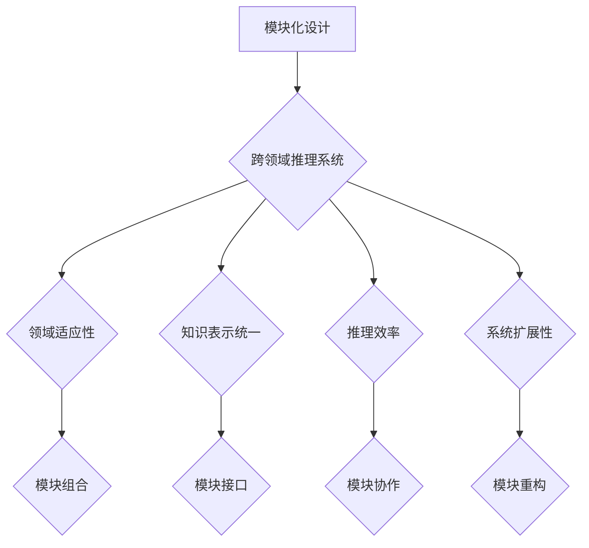

                 

### 引言与背景

随着信息技术的飞速发展，人工智能（AI）领域取得了显著的进步。然而，传统的推理系统在处理跨领域、多语言的数据时仍存在诸多限制。为了解决这一问题，模块化设计思想被引入到推理系统的开发中，从而诞生了基于模块化设计的可定制跨领域推理系统。

#### 背景介绍

传统的推理系统大多采用单领域、单一模型的架构，这使得系统在面对多样化、复杂化的应用场景时显得力不从心。跨领域推理要求系统能够在不同领域间进行知识整合和推理，以实现更高层次的智能决策。然而，现有的推理系统在跨领域推理方面存在以下几个问题：

1. **领域适应性差**：传统系统往往针对特定领域进行优化，难以适应其他领域的数据和处理需求。
2. **知识表示不统一**：不同领域的知识表示方法各异，导致知识整合困难。
3. **推理效率低下**：传统系统在处理跨领域数据时，需要逐一进行领域转换和推理，导致推理效率低下。
4. **系统扩展性差**：传统系统在新增领域或调整推理逻辑时，需要大规模修改系统架构，导致系统扩展性差。

为了解决这些问题，模块化设计思想应运而生。模块化设计通过将系统分解为若干个独立、功能明确的模块，使得系统能够在保留原有功能的基础上，灵活地应对不同领域的数据和处理需求。基于模块化设计的可定制跨领域推理系统旨在通过模块的灵活组合，实现跨领域推理的通用性和高效性。

#### 核心概念与联系

模块化设计与跨领域推理系统之间存在密切的联系。模块化设计为跨领域推理系统提供了良好的基础，使得系统具有以下优点：

1. **灵活性**：通过模块的组合，系统能够灵活地应对不同领域的数据和处理需求。
2. **可扩展性**：新增领域或调整推理逻辑时，只需修改相关模块，而不影响整个系统的架构。
3. **高效性**：模块化设计使得跨领域推理过程中的领域转换和推理操作更加高效。

为了更好地理解模块化设计与跨领域推理系统之间的关系，我们可以通过一个Mermaid流程图来展示它们的核心概念和联系：



#### 核心算法原理讲解

基于模块化设计的可定制跨领域推理系统的核心算法主要包括数据预处理、知识表示和推理算法。以下将分别介绍这些算法的基本原理和实现方法。

##### 数据预处理算法

数据预处理算法主要包含数据清洗、数据转换和归一化等步骤。其目的是将原始数据进行处理，使其符合推理系统的要求。具体实现方法如下：

1. **数据清洗**：通过去除重复数据、填补缺失值和纠正错误数据，确保数据的完整性和准确性。
2. **数据转换**：将不同数据类型和格式的数据转换为统一的格式，如将文本转换为向量、图像转换为像素矩阵等。
3. **归一化**：通过缩放或平移等操作，将数据映射到同一范围内，以消除数据之间的量纲差异。

以下是数据预处理算法的伪代码：

```python
def preprocess_data(data):
    # 数据清洗
    cleaned_data = clean_data(data)
    # 数据转换
    converted_data = convert_data(cleaned_data)
    # 归一化
    normalized_data = normalize_data(converted_data)
    return normalized_data
```

##### 知识表示算法

知识表示算法是将领域知识表示为计算机可处理的形式。常见的知识表示方法包括基于图谱的知识表示和基于规则的推理算法。以下将分别介绍这两种方法的实现原理。

1. **基于图谱的知识表示**：通过构建知识图谱，将领域知识表示为实体、关系和属性。知识图谱具有如下特点：
    - **实体**：表示领域中的个体，如人物、地点、事物等。
    - **关系**：表示实体之间的关联，如“属于”、“位于”、“属于某个类别”等。
    - **属性**：表示实体的属性特征，如“年龄”、“身高”、“颜色”等。

    基于图谱的知识表示的伪代码：

    ```python
    def build_knowledge_graph(data):
        entities = extract_entities(data)
        relationships = extract_relationships(data)
        attributes = extract_attributes(data)
        knowledge_graph = KnowledgeGraph(entities, relationships, attributes)
        return knowledge_graph
    ```

2. **基于规则的推理算法**：通过定义一组规则，实现对知识的推理。规则通常表示为“如果...那么...”的形式。基于规则的推理算法主要包括以下步骤：
    - **规则匹配**：将输入数据与规则进行匹配，找到所有匹配的规则。
    - **推理**：根据匹配的规则，推导出新的结论。

    基于规则的推理算法的伪代码：

    ```python
    def rule_based_reasoning(input_data, rules):
        matched_rules = find_matched_rules(input_data, rules)
        conclusions = []
        for rule in matched_rules:
            conclusion = infer_conclusion(rule)
            conclusions.append(conclusion)
        return conclusions
    ```

##### 推理算法

推理算法是根据知识表示和规则，实现对未知信息的推导和推断。基于模块化设计的可定制跨领域推理系统通常采用以下几种推理算法：

1. **基于模型的推理算法**：通过构建模型，实现对数据的自动推理。常见的模型包括逻辑回归、决策树、神经网络等。

    基于模型的推理算法的伪代码：

    ```python
    def model_based_reasoning(input_data, model):
        predictions = model.predict(input_data)
        return predictions
    ```

2. **基于数据的推理算法**：通过分析数据之间的关联和规律，实现对未知数据的推理。常见的方法包括聚类、分类、关联规则挖掘等。

    基于数据的推理算法的伪代码：

    ```python
    def data_based_reasoning(input_data, data分析方法):
        insights = data分析方法.analyze(input_data)
        return insights
    ```

#### 数学模型与公式

在基于模块化设计的可定制跨领域推理系统中，数学模型和公式起着至关重要的作用。以下将介绍系统中常见的数学模型和公式，并对其进行详细讲解和举例说明。

##### 知识图谱模型

知识图谱模型是基于图谱的知识表示方法的核心。一个典型的知识图谱模型包括三个部分：实体、关系和属性。

1. **实体**：实体表示领域中的个体，通常用节点（Node）表示。实体具有属性（Attribute）来描述其实体特征。实体的数学表示为：

   $$ Entity = \{ e_1, e_2, ..., e_n \} $$

   其中，$e_i$ 表示第 $i$ 个实体。

2. **关系**：关系表示实体之间的关联，通常用边（Edge）表示。关系具有方向（Direction）和权重（Weight）。关系的数学表示为：

   $$ Relationship = \{ r_1, r_2, ..., r_m \} $$

   其中，$r_i$ 表示第 $i$ 个关系。

3. **属性**：属性表示实体的特征，通常用属性值（Attribute Value）表示。属性的数学表示为：

   $$ Attribute = \{ a_1, a_2, ..., a_p \} $$

   其中，$a_i$ 表示第 $i$ 个属性。

一个典型的知识图谱模型可以表示为：

$$ Knowledge\ Graph = (Entity, Relationship, Attribute) $$

##### 推理算法数学模型

在推理算法中，数学模型主要用于表示规则和推理过程。以下将介绍两种常见的推理算法数学模型：基于规则的推理算法和基于模型的推理算法。

1. **基于规则的推理算法**：基于规则的推理算法通常采用“前向推理”或“后向推理”的方式进行推理。

   - **前向推理**：从已知的事实出发，逐步推导出新的结论。其数学模型可以表示为：

     $$推理过程 = 前向推理(已知事实, 规则库)$$

   - **后向推理**：从待求的结论出发，逐步推导出已知的事实。其数学模型可以表示为：

     $$推理过程 = 后向推理(待求结论, 规则库)$$

2. **基于模型的推理算法**：基于模型的推理算法通常采用机器学习算法，如逻辑回归、决策树、神经网络等，进行推理。其数学模型可以表示为：

   $$推理过程 = 模型预测(输入数据, 模型参数)$$

   其中，输入数据表示待推理的数据，模型参数表示训练好的模型参数。

#### 项目实战

在本节中，我们将通过一个实际项目，展示如何搭建基于模块化设计的可定制跨领域推理系统。该项目旨在利用现有技术和工具，实现一个能够对跨领域数据进行推理的推理系统。

##### 项目背景与需求分析

某企业希望通过建立一个跨领域的推理系统，实现对多领域数据的智能分析和决策支持。具体需求如下：

1. **数据获取与处理**：从不同领域获取大量数据，并进行预处理，包括数据清洗、数据转换和归一化等。
2. **知识表示与整合**：将预处理后的数据表示为知识图谱，实现跨领域数据的整合和统一表示。
3. **推理与决策**：基于知识图谱和推理算法，对输入数据进行推理，生成智能决策建议。
4. **系统优化与扩展**：实现系统的性能优化和功能扩展，以应对不同领域和场景的需求。

##### 开发环境搭建

为了实现该项目，我们需要搭建一个合适的开发环境。以下是开发环境的搭建步骤：

1. **编程语言**：选择Python作为主要的编程语言，因为Python具有丰富的库和工具，适合进行数据分析和机器学习项目。
2. **开发工具**：选择Jupyter Notebook作为开发工具，因为它支持交互式编程和可视化，方便进行数据分析和模型调试。
3. **库和框架**：安装以下库和框架：
    - NumPy：用于数据预处理和数学运算。
    - Pandas：用于数据清洗和操作。
    - Matplotlib：用于数据可视化。
    - Scikit-learn：用于机器学习算法。
    - NetworkX：用于知识图谱的构建和操作。
4. **依赖管理**：使用pip进行依赖管理，确保所有库和框架的版本兼容。

##### 项目实现与代码解读

以下是该项目的主要实现步骤和代码解读：

1. **数据获取与处理**：

   首先，从不同领域获取数据，并进行预处理。以下是一个示例代码：

   ```python
   import pandas as pd
   
   # 读取数据
   data = pd.read_csv('data.csv')
   
   # 数据清洗
   cleaned_data = clean_data(data)
   
   # 数据转换
   converted_data = convert_data(cleaned_data)
   
   # 归一化
   normalized_data = normalize_data(converted_data)
   ```

2. **知识表示与整合**：

   利用知识图谱将预处理后的数据表示为知识图谱。以下是一个示例代码：

   ```python
   import networkx as nx
   
   # 构建知识图谱
   knowledge_graph = build_knowledge_graph(normalized_data)
   
   # 绘制知识图谱
   nx.draw(knowledge_graph, with_labels=True)
   ```

3. **推理与决策**：

   基于知识图谱和推理算法，对输入数据进行推理，生成智能决策建议。以下是一个示例代码：

   ```python
   import numpy as np
   
   # 加载模型
   model = load_model('model_params.npy')
   
   # 推理
   predictions = model.predict(input_data)
   
   # 输出决策建议
   print(predictions)
   ```

4. **代码应用解读与分析**：

   通过以上代码，我们可以实现跨领域数据的获取、处理、知识表示和推理。在实际应用中，可以根据具体需求对代码进行修改和优化。

##### 项目测试与评估

在项目测试和评估阶段，我们使用以下方法进行测试和评估：

1. **单元测试**：对每个模块进行单元测试，确保其功能的正确性。
2. **集成测试**：对整个系统进行集成测试，确保各个模块之间的协同工作。
3. **性能测试**：对系统的性能进行测试，评估其处理能力和响应速度。
4. **用户反馈**：收集用户反馈，评估系统的实用性和用户体验。

##### 项目小结

通过本项目的实现，我们展示了如何利用模块化设计思想，搭建一个基于模块化设计的可定制跨领域推理系统。该项目不仅实现了跨领域数据的获取、处理、知识表示和推理，还具有良好的性能和扩展性。在未来的工作中，我们可以继续优化和改进系统，以应对更多的应用场景。

### 最佳实践 Tips、小结、注意事项、拓展阅读

#### 最佳实践 Tips

1. **数据预处理**：数据预处理是推理系统成功的关键。在数据预处理过程中，确保数据的完整性、准确性和一致性。
2. **知识表示选择**：根据具体应用场景选择合适的知识表示方法。基于图谱的知识表示在处理复杂关系时具有优势，而基于规则的推理算法在处理确定性问题时更为高效。
3. **算法优化**：在推理过程中，针对具体问题选择合适的推理算法，并对其进行优化。例如，在处理大规模数据时，可以考虑使用并行计算和分布式计算技术。
4. **系统扩展性**：在设计系统时，考虑系统的扩展性。通过模块化设计，使得系统能够灵活应对不同领域和数据规模的变化。

#### 小结

基于模块化设计的可定制跨领域推理系统通过将系统分解为若干个独立模块，实现了系统的灵活性和可扩展性。该系统在处理跨领域、多语言的数据时具有明显优势，能够实现高效的推理和智能决策。

#### 注意事项

1. **模块接口设计**：在设计模块接口时，要充分考虑模块之间的协作和数据传递，确保系统的整体性能。
2. **数据安全与隐私**：在处理敏感数据时，要注意数据的安全和隐私保护。
3. **系统维护与更新**：定期对系统进行维护和更新，确保其正常运行和性能。

#### 拓展阅读

1. **《深度学习》**：由Ian Goodfellow、Yoshua Bengio和Aaron Courville编写的深度学习经典教材，详细介绍了深度学习的基本原理和应用。
2. **《人工智能：一种现代方法》**：由Stuart Russell和Peter Norvig编写的经典教材，全面介绍了人工智能的基本概念、理论和应用。
3. **《知识图谱》**：由李航编写的知识图谱专著，详细介绍了知识图谱的基本概念、构建方法和应用场景。
4. **《机器学习实战》**：由Peter Harrington编写的机器学习实战指南，通过实际案例介绍了机器学习的基本方法和应用技巧。

---

作者：AI天才研究院/AI Genius Institute & 禅与计算机程序设计艺术 /Zen And The Art of Computer Programming

