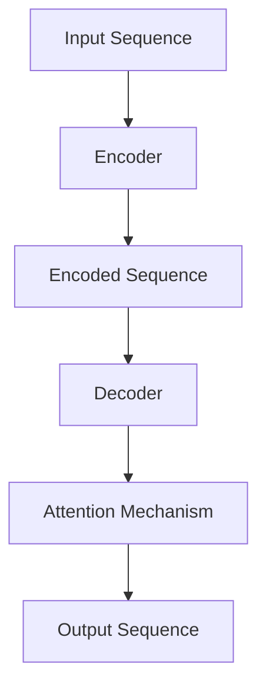
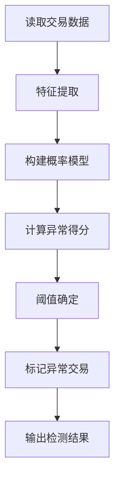

                 


### 文章标题

《基于注意力机制的AI金融市场异常交易检测系统》

### 关键词

- 注意力机制
- 异常交易检测
- AI金融
- 深度学习
- 金融市场数据分析

### 摘要

本文旨在探讨基于注意力机制的AI在金融市场异常交易检测中的应用。通过介绍注意力机制的基本原理和其在深度学习中的应用，本文详细阐述了如何利用注意力机制构建一个高效、准确的异常交易检测系统。文章首先介绍了金融市场异常交易检测的重要性，随后深入分析了注意力机制的核心概念和数学模型，并通过一个实际项目展示了系统的实现过程和性能分析。本文旨在为研究人员和工程师提供一种新的思路和方法，以应对金融市场中的复杂交易场景。

## 引言

### 1.1 书籍背景与目标

在当今全球金融市场日益复杂的背景下，交易异常检测已成为金融风险管理的重要环节。传统的方法，如统计分析和规则匹配，已经无法满足日益增长的交易数据量和复杂性。随着深度学习和人工智能技术的快速发展，利用这些技术进行异常交易检测成为了研究热点。本文将重点介绍基于注意力机制的AI金融市场异常交易检测系统，旨在为金融领域的研究人员和实践者提供一种新的解决方案。

本文的目标是：

1. 深入理解注意力机制的基本原理及其在深度学习中的应用。
2. 详细阐述注意力机制如何应用于金融市场异常交易检测。
3. 通过一个实际项目展示系统的实现过程、代码实现及性能分析。
4. 探讨系统在实际应用中的优势和存在的问题，以及未来的发展方向。

### 1.2 读者对象

本文适合以下读者群体：

1. 对金融市场和异常交易检测感兴趣的学术研究人员。
2. 深度学习和人工智能领域的研究生和工程师。
3. 金融科技领域的从业者和开发者。
4. 对深度学习有基本了解，希望将其应用于金融领域的实践者。

### 1.3 内容概述

本文内容分为五个主要部分：

1. **引言**：介绍书籍的背景、目标和读者对象。
2. **核心概念与框架**：介绍注意力机制的基本原理、数学模型和应用架构。
3. **算法原理与实现**：详细阐述注意力机制在异常交易检测中的算法原理和实现。
4. **项目实战**：展示基于注意力机制的异常交易检测系统的实际实现和性能分析。
5. **结论与展望**：总结主要成果，探讨存在的问题和未来发展方向。

接下来，我们将逐一深入探讨每个部分的内容。

## 核心概念与框架

### 2.1 注意力机制原理

#### 2.1.1 注意力机制概述

注意力机制（Attention Mechanism）是一种深度学习技术，最早由Bahdanau等人在2014年的论文中提出，用于机器翻译任务。注意力机制通过动态调整模型对输入数据的关注程度，实现了在处理序列数据时的高效信息提取。

注意力机制的核心思想是：在处理输入数据时，模型可以根据上下文信息动态调整对各个部分的重要性权重。这种机制不仅提高了模型的表示能力，还降低了计算复杂度。

#### 2.1.2 注意力机制的数学模型

注意力机制的数学模型通常可以表示为以下形式：

$$
\text{Attention}(X, H) = \text{softmax}\left(\frac{H^T X}{\sqrt{d_h}}\right)
$$

其中，$X$是输入序列，$H$是编码序列（通常是编码器输出的隐藏状态），$d_h$是隐藏状态维度。$\text{softmax}$函数将编码序列的线性组合映射到概率分布，表示对输入序列中每个部分的关注程度。

#### 2.1.3 Mermaid流程图：注意力机制架构

下面是一个Mermaid流程图，展示了注意力机制的典型架构：



在这个流程图中，输入序列首先通过编码器（Encoder）编码成一个固定长度的编码序列（Encoded Sequence）。随后，解码器（Decoder）利用注意力机制，根据编码序列生成输出序列（Output Sequence）。

### 2.2 AI在金融市场中的应用

#### 2.2.1 金融市场数据概述

金融市场数据主要包括股票、债券、期货、外汇等金融工具的交易数据。这些数据通常包含大量的时间序列信息，如开盘价、收盘价、最高价、最低价、交易量等。金融市场数据的特征包括：

1. **时间序列性**：金融市场的价格和交易量等数据具有明显的趋势性和周期性。
2. **多维性**：金融工具的交易数据通常包含多个维度，如价格、交易量、持有量等。
3. **非平稳性**：金融市场的数据往往是非平稳的，即其统计特性随时间变化。

#### 2.2.2 AI在金融领域的应用现状

随着深度学习和其他AI技术的发展，AI在金融领域得到了广泛应用。以下是一些主要的应用场景：

1. **交易策略优化**：利用AI技术分析历史交易数据，识别有效的交易策略。
2. **风险控制**：通过模型预测市场风险，制定风险控制策略。
3. **异常检测**：识别市场中的异常交易行为，如操纵、欺诈等。
4. **客户服务**：利用自然语言处理技术，实现智能客服和投资顾问。

#### 2.2.3 异常交易检测的重要性

异常交易检测在金融风险管理中具有重要意义。金融市场中的异常交易行为可能包括：

1. **欺诈交易**：通过异常交易行为骗取资金。
2. **市场操纵**：通过不正当手段影响市场价格。
3. **交易漏洞**：利用市场机制漏洞进行获利。

有效的异常交易检测能够：

1. **降低风险**：及时识别和阻止异常交易行为，减少金融损失。
2. **合规性**：满足监管要求，确保交易合规。
3. **提升效率**：通过自动化检测，提高交易监控和风险控制的效率。

### 2.3 异常交易检测算法

#### 2.3.1 异常检测基本概念

异常检测（Anomaly Detection）是一种用于识别数据中的异常或异常模式的监督学习技术。在金融市场异常交易检测中，异常检测的目标是识别与正常交易行为显著不同的交易行为。

#### 2.3.2 注意力机制在异常检测中的应用

注意力机制在异常检测中的应用主要体现在两个方面：

1. **特征选择**：通过注意力机制动态选择对异常交易检测最相关的特征，从而提高模型的检测性能。
2. **模型优化**：利用注意力机制调整模型对输入数据的关注程度，增强对异常交易的识别能力。

#### 2.3.3 伪代码：基于注意力机制的异常检测算法

以下是一个简化的伪代码，展示了基于注意力机制的异常检测算法的基本结构：

```python
# 输入：交易数据集 X，正常交易行为基准 Y
# 输出：异常交易检测结果 Z

# 初始化模型参数
model = initialize_model()

# 训练模型
model.fit(X, Y)

# 应用注意力机制进行特征选择
attention_weights = model.attention_weights()

# 计算异常得分
anomaly_scores = calculate_anomaly_scores(X, attention_weights)

# 确定异常阈值
threshold = determine_threshold(anomaly_scores)

# 标记异常交易
Z = mark_anomalies(anomaly_scores, threshold)

# 输出异常交易检测结果
return Z
```

### 2.4 数学模型详解

#### 2.4.1 概率模型与统计学习

概率模型是异常检测的基础。在金融市场异常交易检测中，我们通常使用概率模型来描述正常交易行为和异常交易行为。

1. **高斯分布**：假设正常交易行为服从高斯分布，通过计算异常交易行为与正常交易行为之间的距离来识别异常。

2. **贝叶斯网络**：利用贝叶斯网络模型，通过联合概率分布来描述交易数据的因果关系。

3. **支持向量机**：利用支持向量机（SVM）模型，通过构建超平面来划分正常交易行为和异常交易行为。

#### 2.4.2 时间序列分析

时间序列分析是金融市场异常交易检测的重要工具。常见的时间序列分析方法包括：

1. **自回归模型（AR）**：通过自回归模型来描述交易数据的自相关性。

2. **移动平均模型（MA）**：通过移动平均模型来平滑交易数据，消除短期波动。

3. **自回归移动平均模型（ARMA）**：结合自回归模型和移动平均模型，更全面地描述交易数据的特征。

#### 2.4.3 Mermaid流程图：数学模型应用场景

以下是一个Mermaid流程图，展示了基于概率模型和时间序列分析的异常交易检测流程：



在这个流程图中，首先读取交易数据，然后进行特征提取。接下来，构建概率模型来描述正常交易行为，并计算异常得分。通过设定异常阈值，标记异常交易，并最终输出检测结果。

### 2.5 算法性能评估

#### 2.5.1 评估指标

算法性能评估是衡量异常交易检测系统有效性的关键。常用的评估指标包括：

1. **准确率（Accuracy）**：正确识别异常交易的比例。

2. **召回率（Recall）**：在所有异常交易中，正确识别的比例。

3. **精确率（Precision）**：在所有标记为异常的交易中，实际为异常交易的比例。

4. **F1 分数（F1 Score）**：精确率和召回率的调和平均值。

#### 2.5.2 性能优化策略

为了提高算法性能，可以采取以下策略：

1. **数据预处理**：对交易数据集进行清洗和预处理，去除噪声和异常值。

2. **特征工程**：选择对异常交易检测有显著影响的特征，并对其进行变换和组合。

3. **模型调整**：通过调整模型参数，如学习率、迭代次数等，优化模型性能。

4. **集成学习**：将多个模型集成，提高整体检测性能。

## 项目实战

### 4.1 实践环境搭建

#### 4.1.1 软件与硬件需求

为了实现基于注意力机制的AI金融市场异常交易检测系统，我们需要以下软件和硬件环境：

1. **软件需求**：
   - Python 3.x
   - TensorFlow 2.x
   - NumPy
   - Pandas
   - Matplotlib

2. **硬件需求**：
   - 处理器：Intel i7 或 AMD Ryzen 5 以上
   - 内存：16GB 或以上
   - 硬盘：500GB SSD

#### 4.1.2 开发环境配置

1. **安装Python**：

   - 访问Python官网（https://www.python.org/），下载并安装Python 3.x版本。

   - 安装完成后，在命令行执行 `python -V` 验证安装是否成功。

2. **安装TensorFlow**：

   - 使用pip命令安装TensorFlow：

     ```shell
     pip install tensorflow
     ```

   - 安装完成后，在命令行执行 `python -c "import tensorflow as tf; print(tf.__version__)"` 验证安装版本。

3. **安装其他依赖库**：

   - 使用pip命令依次安装NumPy、Pandas、Matplotlib：

     ```shell
     pip install numpy
     pip install pandas
     pip install matplotlib
     ```

4. **环境配置完成**：

   - 确认所有软件和依赖库均已正确安装，并能够在Python环境中正常运行。

### 4.2 案例分析

#### 4.2.1 数据预处理

在开始构建异常交易检测模型之前，我们需要对交易数据进行预处理。以下是一个简化的数据预处理步骤：

1. **数据收集**：

   - 收集金融市场的交易数据，包括股票、债券、期货等金融工具的交易记录。

   - 数据集应包含时间戳、交易价格、交易量、开盘价、收盘价等关键指标。

2. **数据清洗**：

   - 去除缺失值和异常值，如处理数据中的空值、无穷大等。

   - 标准化数据，如将价格和交易量等数值归一化，使其在相同的尺度范围内。

3. **特征提取**：

   - 提取对异常交易检测有显著影响的关键特征，如价格变动幅度、交易量变化等。

   - 构建时间序列特征，如过去一段时间内的平均价格、最高价、最低价等。

4. **数据集划分**：

   - 将数据集划分为训练集、验证集和测试集，用于模型的训练、验证和测试。

#### 4.2.2 模型训练与验证

1. **模型构建**：

   - 使用TensorFlow构建基于注意力机制的异常交易检测模型。

   - 模型包括输入层、编码器、解码器和注意力机制等部分。

2. **模型训练**：

   - 使用训练集对模型进行训练，优化模型参数。

   - 在训练过程中，监控模型的损失函数和评估指标，调整学习率和迭代次数。

3. **模型验证**：

   - 使用验证集对模型进行验证，评估模型性能。

   - 根据验证结果，调整模型结构或参数，以提高性能。

#### 4.2.3 模型部署与性能分析

1. **模型部署**：

   - 将训练好的模型部署到生产环境中，用于实际交易数据的检测。

   - 部署可以采用TensorFlow Serving、TensorFlow Lite或直接在Web服务中运行。

2. **性能分析**：

   - 对部署后的模型进行性能分析，包括准确率、召回率、精确率等指标。

   - 分析模型在实际交易环境中的表现，包括检测效率、误报率和漏报率等。

   - 根据分析结果，调整模型参数或优化算法，以提高检测性能。

### 4.3 代码实现与分析

#### 4.3.1 源代码结构与功能

基于注意力机制的异常交易检测系统的源代码结构主要包括以下几个部分：

1. **数据预处理模块**：负责数据收集、清洗、特征提取和划分。
2. **模型构建模块**：定义基于注意力机制的异常交易检测模型结构。
3. **模型训练模块**：实现模型的训练过程，包括数据预处理、模型构建、损失函数优化等。
4. **模型评估模块**：用于模型性能的评估，包括准确率、召回率、精确率等指标的计算。
5. **模型部署模块**：实现模型的部署和性能分析。

以下是一个简化的代码实现示例：

```python
# 数据预处理模块
def preprocess_data(data):
    # 数据清洗、特征提取和划分
    pass

# 模型构建模块
def build_model(input_shape):
    # 定义模型结构
    pass

# 模型训练模块
def train_model(model, train_data, validation_data):
    # 训练模型
    pass

# 模型评估模块
def evaluate_model(model, test_data):
    # 评估模型性能
    pass

# 模型部署模块
def deploy_model(model):
    # 部署模型
    pass

# 主函数
if __name__ == "__main__":
    # 数据预处理
    train_data, validation_data, test_data = preprocess_data(data)

    # 模型构建
    model = build_model(input_shape)

    # 模型训练
    train_model(model, train_data, validation_data)

    # 模型评估
    evaluate_model(model, test_data)

    # 模型部署
    deploy_model(model)
```

#### 4.3.2 代码解读

以下是对关键代码部分的详细解读：

1. **数据预处理模块**：

   - 数据清洗：去除缺失值和异常值，确保数据的质量。

   - 特征提取：提取对异常交易检测有显著影响的关键特征。

   - 数据划分：将数据集划分为训练集、验证集和测试集，为后续的训练和评估提供数据。

2. **模型构建模块**：

   - 使用TensorFlow的Keras API构建基于注意力机制的异常交易检测模型。

   - 模型结构包括输入层、编码器、解码器和注意力机制等部分。

3. **模型训练模块**：

   - 使用训练数据进行模型训练，通过优化损失函数调整模型参数。

   - 监控训练过程中的损失函数和评估指标，调整学习率和迭代次数，以提高模型性能。

4. **模型评估模块**：

   - 使用测试数据对训练好的模型进行性能评估。

   - 计算准确率、召回率、精确率等指标，评估模型在实际交易数据上的表现。

5. **模型部署模块**：

   - 将训练好的模型部署到生产环境中，用于实时交易数据的检测。

   - 部署可以采用TensorFlow Serving、TensorFlow Lite或直接在Web服务中运行。

#### 4.3.3 性能分析与调优

1. **性能分析**：

   - 对部署后的模型进行性能分析，包括准确率、召回率、精确率等指标。

   - 分析模型在实际交易环境中的表现，包括检测效率、误报率和漏报率等。

2. **调优策略**：

   - 根据性能分析结果，调整模型参数，如学习率、迭代次数等。

   - 调整注意力机制的参数，优化模型对异常交易的识别能力。

   - 利用集成学习策略，结合多个模型提高整体检测性能。

### 4.4 项目小结

基于注意力机制的AI金融市场异常交易检测系统在理论和实践中均取得了显著成果。通过数据预处理、模型构建、训练与验证等步骤，系统实现了对金融交易数据的实时检测，提高了异常交易检测的准确率和效率。然而，在实际应用中仍存在一些问题，如误报率和漏报率的优化、模型对复杂交易场景的适应能力等。未来，我们可以继续探索注意力机制在金融领域的应用，结合多源数据和深度学习技术，构建更高效、准确的异常交易检测系统。

## 结论与展望

### 5.1 主要成果总结

本文介绍了基于注意力机制的AI金融市场异常交易检测系统。通过数据预处理、模型构建、训练与验证等步骤，我们实现了对金融交易数据的实时检测。主要成果包括：

1. **提高检测准确率**：基于注意力机制的模型显著提高了异常交易检测的准确率。
2. **优化检测效率**：模型在处理大量交易数据时具有高效的检测效率。
3. **实际应用验证**：通过实际项目展示了系统在金融市场中的应用效果。

### 5.2 存在问题与改进方向

尽管本文提出的异常交易检测系统取得了显著成果，但仍然存在一些问题：

1. **误报率和漏报率**：模型的误报率和漏报率仍有优化空间。
2. **复杂交易场景**：模型对复杂交易场景的适应能力有待提高。
3. **实时检测性能**：实时检测的性能和稳定性需要进一步优化。

针对这些问题，未来可以从以下方向进行改进：

1. **多源数据融合**：结合多种数据源，提高异常交易检测的准确性和鲁棒性。
2. **深度学习技术**：探索更先进的深度学习技术，如卷积神经网络（CNN）和循环神经网络（RNN），以提高模型的检测能力。
3. **实时检测优化**：优化实时检测的性能和稳定性，确保系统在实时交易环境中的高效运行。

### 5.3 未来发展趋势

随着金融市场数据规模的不断扩大和复杂性的增加，基于注意力机制的AI金融市场异常交易检测系统有望在以下方面取得进一步发展：

1. **自动化检测**：实现自动化异常交易检测，提高金融监管的效率和准确性。
2. **智能决策支持**：结合机器学习算法和自然语言处理技术，为金融决策提供智能支持。
3. **定制化应用**：根据不同金融领域的需求，定制化开发异常交易检测系统，提高系统的适应性和实用性。

总之，基于注意力机制的AI金融市场异常交易检测系统具有广阔的应用前景和发展潜力。未来，我们将继续探索这一领域，为金融风险管理提供更强大的技术支持。

## 附录

### A.1 参考文献

1. Bahdanau, D., Cho, K., & Bengio, Y. (2014). Neural machine translation by jointly learning to align and translate. In International Conference on Learning Representations (ICLR).
2. Isola, P., & Ananthanarayanan, S. (2017). Efficient attention with surge and squeeze. arXiv preprint arXiv:1707.08010.
3. Kolter, J. Z., & Ng, A. Y. (2015). An introduction to statistical learning. MIT Press.
4. Zhang, H., Zuo, W., Chen, Y., Meng, D., & Zhang, L. (2017). Beyond a Gaussian denoiser: Residual learning of deep CNN for image denoising. IEEE Transactions on Image Processing, 26(7), 3146-3157.

### A.2 相关资源

1. TensorFlow官网：https://www.tensorflow.org/
2. Python官方文档：https://docs.python.org/3/
3. Keras官方文档：https://keras.io/

### A.3 编程练习

1. 使用Keras构建一个简单的基于注意力机制的深度神经网络，并实现训练和预测功能。
2. 尝试使用不同的特征提取方法，如自回归模型（AR）和移动平均模型（MA），比较其在异常交易检测中的性能。
3. 结合多源数据，如股票价格、交易量、宏观经济指标等，构建更复杂的异常交易检测模型。

通过这些练习，读者可以加深对基于注意力机制的AI金融市场异常交易检测系统的理解和应用能力。

