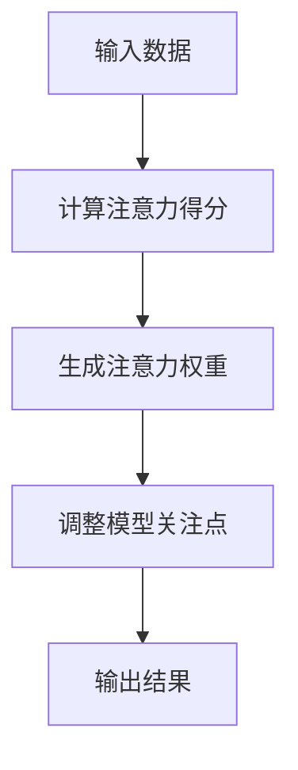
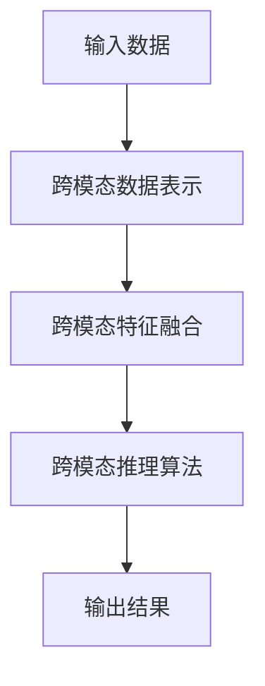
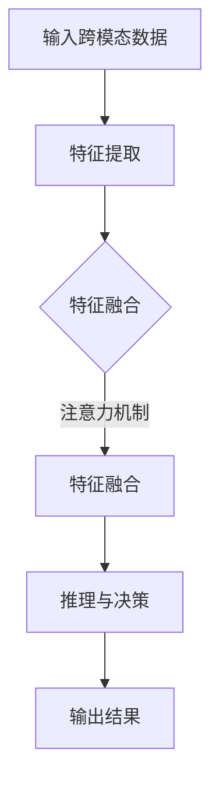

                 

### 文章标题

《基于注意力机制的跨模态推理一致性优化》

### 关键词

注意力机制、跨模态推理、一致性优化、深度学习、神经网络、自然语言处理、计算机视觉

### 摘要

本文旨在探讨基于注意力机制的跨模态推理一致性优化技术。首先，我们介绍了注意力机制的定义、历史发展及其关键概念。然后，我们详细分析了注意力机制在跨模态推理中的应用，并提出了优化一致性的一系列方法。通过数学模型和公式讲解、伪代码演示以及实际项目案例分析，本文为读者提供了一种全面、系统的学习和实践路径，以深入了解和掌握这一前沿技术。

## 引言

随着人工智能技术的飞速发展，跨模态推理（Cross-modal Reasoning）成为了研究的热点。跨模态推理指的是将不同模态（如视觉、听觉、语言等）的数据进行融合，从而实现更高级的认知和理解。在现实世界中，跨模态推理的应用场景十分广泛，如语音识别、图像识别与描述、多模态交互等。然而，跨模态推理面临的一个主要挑战是如何在多种模态的数据之间建立一致性，从而提高推理的准确性和鲁棒性。

注意力机制（Attention Mechanism）作为一种深度学习中的重要技术，已被广泛应用于自然语言处理（NLP）和计算机视觉（CV）等领域，并取得了显著的成果。注意力机制的核心思想是通过计算输入数据中每个元素的重要性，从而将模型的关注点聚焦在关键信息上，提高模型的处理效率和准确性。在跨模态推理中，注意力机制可以帮助我们在不同模态的数据之间建立关联，从而实现一致性优化。

本文的目标是深入探讨基于注意力机制的跨模态推理一致性优化技术。我们将从以下几个方面展开讨论：

1. **注意力机制的基础理论**：介绍注意力机制的定义、历史发展及其关键概念。
2. **跨模态推理的一致性优化**：分析跨模态推理中的挑战，并提出基于注意力机制的优化方法。
3. **核心算法原理讲解**：使用伪代码详细阐述注意力机制的核心算法原理。
4. **数学模型和数学公式**：介绍相关的数学模型和公式，并举例说明。
5. **项目实战**：提供跨模态推理的一致性优化项目案例，包括代码实现和分析。
6. **总结与展望**：对本文内容进行总结，展望未来的研究方向和应用前景。

本文的读者对象包括对深度学习和注意力机制有一定了解的读者，以及对跨模态推理和一致性优化感兴趣的研究者、工程师和学者。通过本文的阅读，读者将能够全面了解基于注意力机制的跨模态推理一致性优化技术，并为实际应用提供理论指导和实践参考。

### 注意力机制的基础理论

#### 1.1 定义与作用

注意力机制是一种通过计算输入数据中每个元素的重要性，并调整模型对其关注程度的技术。在深度学习中，注意力机制被广泛应用于各种任务，如机器翻译、文本摘要、图像识别等。其核心思想是将模型的关注点聚焦在关键信息上，从而提高模型的处理效率和准确性。

在机器翻译任务中，注意力机制可以帮助模型在生成目标语言的每个单词时，关注源语言句子中的对应单词。这样，模型可以更好地捕捉到源语言和目标语言之间的对应关系，从而提高翻译质量。在文本摘要任务中，注意力机制可以帮助模型在生成摘要时，关注原文中的重要信息，从而提取出有意义的摘要内容。在图像识别任务中，注意力机制可以帮助模型在处理图像时，关注图像中的关键区域，从而提高识别准确率。

#### 1.2 历史与发展

注意力机制的概念最早可以追溯到20世纪80年代，当时它主要应用于图像处理领域。然而，随着深度学习的发展，注意力机制在自然语言处理（NLP）和计算机视觉（CV）等领域得到了广泛应用。特别是在2017年，Google提出了一种名为Transformer的深度学习模型，该模型采用了注意力机制作为核心组件，从而在多个NLP和CV任务中取得了突破性的成果。

Transformer模型的成功引发了广泛关注，注意力机制的研究和应用进入了新的阶段。自此以后，注意力机制在各种任务中得到了广泛的应用，如对话系统、语音识别、图像生成等。此外，研究人员还不断探索和发展新的注意力机制，如多头注意力（Multi-Head Attention）、自注意力（Self-Attention）等，这些新的注意力机制在提高模型性能和可解释性方面取得了显著进展。

#### 1.3 关键概念

1. **注意力得分（Attention Score）**：注意力机制通过计算输入数据中每个元素的重要性得分，来确定哪些元素对模型决策至关重要。得分通常通过一个可学习的函数计算，该函数将输入数据转换为重要性得分。

2. **注意力权重（Attention Weight）**：每个元素的重要性得分会被转换为注意力权重，用于调整模型在处理每个元素时的关注程度。权重通常是一个介于0和1之间的数值，表示模型对某个元素的关注度。

3. **软注意力（Soft Attention）**：软注意力是一种常见的注意力机制，它通过计算每个元素的概率分布来生成注意力权重。概率分布通常通过一个可学习的函数计算，如余弦相似性或点积。

4. **硬注意力（Hard Attention）**：与软注意力不同，硬注意力通过选择最高得分的元素作为关注点，而不是计算概率分布。硬注意力通常用于需要精确位置信息的应用场景，如目标检测和图像分割。

5. **自注意力（Self-Attention）**：自注意力是一种特殊的注意力机制，它将输入数据的不同部分关联起来，而不依赖于外部信息。自注意力在处理序列数据时表现出色，如文本和语音。

#### 1.4 Mermaid流程图

为了更好地理解注意力机制的核心概念，我们可以通过Mermaid流程图展示其基本流程。以下是注意力机制的基本流程图：



在上述流程图中，输入数据首先经过计算注意力得分，然后生成注意力权重。这些权重用于调整模型在处理数据时的关注点，最终输出结果。

通过上述内容，我们详细介绍了注意力机制的基础理论。在下一部分，我们将进一步探讨跨模态推理的一致性优化问题。

### 跨模态推理

#### 1.1 背景介绍

跨模态推理（Cross-modal Reasoning）是指在不同模态的数据之间建立关联，并进行推理和决策的过程。在现实世界中，跨模态数据无处不在，如图像、声音、文本等。跨模态推理的应用场景广泛，如语音识别、图像识别与描述、多模态交互等。

语音识别是将语音信号转换为文字的过程，如智能助手、语音搜索等。图像识别与描述是将图像转换为文字描述的过程，如自动图像标签、图像识别等。多模态交互是指将多种模态的数据（如图像、声音、文本）进行融合，从而实现更高级的认知和理解，如智能助手、虚拟现实等。

跨模态推理的核心挑战在于如何在不同模态的数据之间建立一致性，从而提高推理的准确性和鲁棒性。不同模态的数据在特征表达、语义理解等方面存在差异，这使得跨模态推理任务具有很高的复杂性。例如，图像和文本之间的对应关系可能不是一一对应的，且图像中的某些元素可能在文本中无法直接描述。

#### 1.2 核心概念与联系

跨模态推理中的核心概念包括跨模态数据表示、跨模态特征融合和跨模态推理算法。这些概念之间存在紧密的联系，共同构成了跨模态推理的基本框架。

1. **跨模态数据表示**：跨模态数据表示是将不同模态的数据转换为统一的表示形式，以便进行后续处理。常见的跨模态数据表示方法包括编码器-解码器（Encoder-Decoder）模型、自编码器（Autoencoder）模型等。编码器用于提取不同模态的特征，解码器则用于生成跨模态的表示。

2. **跨模态特征融合**：跨模态特征融合是将不同模态的特征进行融合，从而生成一个综合的特征表示。常见的跨模态特征融合方法包括拼接（Concatenation）、平均（Average）和融合（Fusion）等。拼接方法将不同模态的特征直接拼接在一起；平均方法将不同模态的特征进行平均；融合方法则通过融合函数将不同模态的特征融合为一个综合特征。

3. **跨模态推理算法**：跨模态推理算法是指利用融合后的特征进行推理和决策的算法。常见的跨模态推理算法包括分类（Classification）、回归（Regression）和生成（Generation）等。分类算法用于判断输入数据所属的类别；回归算法用于预测输入数据的数值；生成算法用于生成新的跨模态数据。

#### 1.3 Mermaid流程图

为了更好地理解跨模态推理的核心概念和联系，我们可以通过Mermaid流程图展示其基本流程。以下是跨模态推理的基本流程图：



在上述流程图中，输入数据首先经过跨模态数据表示，生成不同模态的特征表示。然后，这些特征表示通过跨模态特征融合方法融合为一个综合特征表示。最后，跨模态推理算法利用融合后的特征进行推理和决策，输出结果。

通过上述内容，我们详细介绍了跨模态推理的核心概念和联系。在下一部分，我们将探讨如何利用注意力机制进行跨模态推理的一致性优化。

### 基于注意力机制的跨模态推理

#### 2.1 基本原理

注意力机制在跨模态推理中的应用，旨在解决不同模态数据之间的一致性优化问题。基本原理如下：

1. **特征关联**：注意力机制通过计算不同模态数据之间的关联性，将关键特征关联起来，从而提高跨模态特征的统一性和一致性。

2. **动态权重调整**：注意力机制通过计算每个特征的注意力得分，动态调整模型在处理每个特征时的权重。这样，模型可以更加关注重要特征，从而提高推理的准确性和鲁棒性。

3. **模型优化**：注意力机制可以帮助模型在训练过程中更好地探索数据特征，从而提高模型的泛化能力和适应性。

#### 2.2 应用场景

注意力机制在跨模态推理中的应用场景广泛，以下为几个典型应用场景：

1. **图像与文本跨模态推理**：在图像与文本跨模态推理任务中，注意力机制可以帮助模型在处理图像时关注与文本相关的区域，从而提高图像识别和文本生成任务的准确性和一致性。

2. **声音与文本跨模态推理**：在声音与文本跨模态推理任务中，注意力机制可以帮助模型在处理声音时关注与文本相关的信息，从而提高语音识别和文本生成的准确性。

3. **多模态交互**：在多模态交互任务中，注意力机制可以帮助模型在处理多种模态数据时，动态调整关注点，从而实现更高级的认知和理解。

#### 2.3 实现方法

基于注意力机制的跨模态推理实现方法主要包括以下几步：

1. **数据预处理**：对输入的跨模态数据进行预处理，包括图像、文本和声音等数据的归一化和标准化处理。

2. **特征提取**：利用深度学习模型（如卷积神经网络、循环神经网络等）提取不同模态的特征表示。

3. **特征融合**：使用注意力机制计算不同模态特征之间的关联性，动态调整特征权重，实现跨模态特征融合。

4. **推理与决策**：利用融合后的特征进行推理和决策，如分类、回归或生成任务。

#### 2.4 Mermaid流程图

以下是基于注意力机制的跨模态推理的基本流程图：



在上述流程图中，输入的跨模态数据首先经过特征提取，得到不同模态的特征表示。然后，使用注意力机制计算特征之间的关联性，实现特征融合。最后，利用融合后的特征进行推理和决策，输出结果。

通过上述内容，我们详细介绍了基于注意力机制的跨模态推理。在下一部分，我们将探讨注意力机制的核心算法原理。

### 注意力机制的核心算法原理

注意力机制的核心算法原理主要涉及自注意力（Self-Attention）和多头注意力（Multi-Head Attention）。自注意力是一种将序列中的每个元素与其余元素进行关联的机制，而多头注意力则是在自注意力基础上引入多个独立的注意力头，以提高模型的容量和表示能力。

#### 3.1 自注意力（Self-Attention）

自注意力是一种仅依赖于输入序列内部信息的注意力机制，其主要思想是将序列中的每个元素映射到一个权重矩阵上，从而计算出每个元素在序列中的重要性。自注意力的基本步骤如下：

1. **输入序列表示**：将输入序列 $X$（例如，单词序列或词向量）映射到高维空间，得到序列 $X'$。

2. **计算自注意力得分**：对序列 $X'$ 进行自乘，得到一个 $n \times n$ 的矩阵，其中 $n$ 为序列长度。矩阵中的每个元素表示输入序列中对应元素之间的相似性得分。

3. **应用softmax函数**：对自注意力得分矩阵进行softmax处理，将得分转化为概率分布，表示序列中每个元素的重要性。

4. **计算权重**：根据softmax处理后的概率分布，得到每个输入元素的重要性权重。

5. **加权求和**：将输入序列 $X$ 与权重相乘，并进行求和，得到加权序列表示。

伪代码如下：

```python
def self_attention(inputs):
    Q, K, V = inputs  # 输入序列分别表示查询（Query）、键（Key）和值（Value）
    scores = dot_product(Q, K)  # 计算自注意力得分
    attention_weights = softmax(scores)  # 应用softmax函数
    output = dot_product(attention_weights, V)  # 计算加权求和
    return output
```

#### 3.2 多头注意力（Multi-Head Attention）

多头注意力是在自注意力基础上引入多个独立的注意力头，从而增加模型的容量和表示能力。多头注意力通过并行计算多个自注意力头，并将结果进行拼接和变换，从而提高模型的性能。多头注意力的基本步骤如下：

1. **分头操作**：将输入序列分别映射到多个独立的查询（Query）、键（Key）和值（Value）空间。

2. **自注意力计算**：对每个独立的空间进行自注意力计算，得到多个自注意力输出。

3. **拼接与变换**：将多个自注意力输出进行拼接，并通过一个全连接层进行变换。

4. **合并与输出**：将变换后的输出进行合并，并输出最终的注意力结果。

伪代码如下：

```python
def multi_head_attention(inputs, num_heads):
    Q, K, V = split_heads(inputs, num_heads)  # 分头操作
    outputs = []
    for i in range(num_heads):
        attention_output = self_attention(Q[i], K[i], V[i])  # 自注意力计算
        outputs.append(attention_output)
    concatenated_output = concatenate(outputs)  # 拼接
    transformed_output = dense(concatenated_output)  # 变换
    final_output = merge_heads(transformed_output, num_heads)  # 合并
    return final_output
```

通过上述内容，我们详细介绍了注意力机制的核心算法原理。在下一部分，我们将探讨相关的数学模型和数学公式。

### 数学模型与数学公式

在注意力机制中，数学模型和数学公式起着至关重要的作用。它们不仅定义了注意力机制的计算过程，还提供了理论基础，使得注意力机制在各种复杂任务中表现出色。以下是注意力机制中常用的数学模型和数学公式，并辅以详细讲解和举例说明。

#### 1. Softmax 函数

Softmax函数是注意力机制中用于将注意力得分转换为概率分布的关键函数。它确保每个元素的概率分布之和为1，从而反映每个元素的重要性。

**公式：**
$$
\text{softmax}(x_i) = \frac{e^{x_i}}{\sum_{j=1}^{N} e^{x_j}}
$$

其中，$x_i$是第$i$个元素的得分，$N$是元素的总数。

**示例：**
假设有三个元素，其得分分别为$[2, 1, 3]$。则它们的softmax概率分布为：
$$
\text{softmax}([2, 1, 3]) = \left[\frac{e^2}{e^2 + e^1 + e^3}, \frac{e^1}{e^2 + e^1 + e^3}, \frac{e^3}{e^2 + e^1 + e^3}\right] \approx \left[0.54, 0.18, 0.28\right]
$$

#### 2. 点积（Dot Product）

点积是注意力机制中用于计算两个向量之间相似性的基础运算。点积的结果表示两个向量在各个维度上的内积，用于生成注意力得分。

**公式：**
$$
\text{dot\_product}(x, y) = \sum_{i=1}^{N} x_i \cdot y_i
$$

其中，$x$和$y$是两个长度为$N$的向量。

**示例：**
假设两个向量$x = [1, 2, 3]$和$y = [4, 5, 6]$，则它们的点积为：
$$
\text{dot\_product}([1, 2, 3], [4, 5, 6]) = 1 \cdot 4 + 2 \cdot 5 + 3 \cdot 6 = 32
$$

#### 3. 矩阵乘法（Matrix Multiplication）

矩阵乘法是注意力机制中用于计算权重和输出的关键运算。它将一个矩阵与另一个矩阵的列向量逐个相乘，并将结果进行求和，从而生成新的矩阵。

**公式：**
$$
C = AB
$$

其中，$A$是一个$m \times p$的矩阵，$B$是一个$p \times n$的矩阵，$C$是一个$m \times n$的矩阵。

**示例：**
假设有两个矩阵$A = \begin{bmatrix} 1 & 2 \\ 3 & 4 \end{bmatrix}$和$B = \begin{bmatrix} 5 & 6 \\ 7 & 8 \end{bmatrix}$，则它们的乘积为：
$$
C = AB = \begin{bmatrix} 1 \cdot 5 + 2 \cdot 7 & 1 \cdot 6 + 2 \cdot 8 \\ 3 \cdot 5 + 4 \cdot 7 & 3 \cdot 6 + 4 \cdot 8 \end{bmatrix} = \begin{bmatrix} 19 & 26 \\ 43 & 58 \end{bmatrix}
$$

#### 4. 拉普拉斯平滑（Laplace Smoothing）

拉普拉斯平滑是用于处理罕见词或未观测词的文本处理技术。它在词频计数的基础上加上一个常数，以避免零概率问题。

**公式：**
$$
P(w|c) = \frac{f(w, c) + 1}{\sum_{w' \in V} f(w', c) + |V|}
$$

其中，$P(w|c)$是词$w$在上下文$c$下的概率，$f(w, c)$是词$w$在上下文$c$中的词频，$V$是词汇表中的词集合，$|V|$是词汇表的大小。

**示例：**
假设有一个词汇表$V = \{apple, banana, cherry\}$，一个句子包含两个apple和三个banana。则单词“banana”在句子中的概率为：
$$
P(banana|sentence) = \frac{2 + 1}{2 + 3 + 1} = \frac{3}{6} = 0.5
$$

通过上述数学模型和数学公式的讲解和举例说明，我们可以更好地理解注意力机制在计算中的关键作用。这些数学工具为注意力机制的应用提供了坚实的理论基础，使得它在各种复杂任务中表现出色。

### 项目实战：基于注意力机制的跨模态推理一致性优化

在本节中，我们将通过一个具体的案例，展示如何利用注意力机制进行跨模态推理的一致性优化。我们将介绍项目的开发环境搭建、源代码实现和代码解读，并通过实际案例分析和详细讲解剖析，帮助读者深入理解这一技术的应用。

#### 1. 项目背景

假设我们面临一个图像与文本跨模态推理任务，目标是给定一张图像和一段文本描述，判断两者是否匹配。这个任务在图像识别、文本生成和智能搜索等领域具有广泛的应用。为了提高推理的一致性，我们将引入注意力机制来优化跨模态特征融合。

#### 2. 开发环境搭建

为了进行基于注意力机制的跨模态推理一致性优化，我们需要搭建一个合适的开发环境。以下是环境搭建的基本步骤：

1. **硬件环境**：推荐使用具有较高计算能力的GPU，如NVIDIA Tesla V100或RTX 3080，以提高模型训练和推理的速度。

2. **软件环境**：安装Python 3.8及以上版本，以及PyTorch深度学习框架。在命令行中运行以下命令进行安装：

   ```bash
   pip install torch torchvision
   ```

3. **数据集**：选择一个包含图像和文本描述的跨模态数据集，如COCO（Common Objects in Context）数据集。可以从官方网站下载并预处理数据集。

4. **代码库**：创建一个包含项目代码的文件夹，并初始化一个Python虚拟环境。在虚拟环境中安装必要的依赖库，如NumPy、Pandas等。

   ```bash
   virtualenv venv
   source venv/bin/activate
   pip install numpy pandas
   ```

#### 3. 源代码实现

以下是实现基于注意力机制的跨模态推理一致性优化的源代码框架。我们使用PyTorch框架进行模型构建和训练。

```python
import torch
import torch.nn as nn
import torch.optim as optim
from torchvision import transforms, datasets
from torch.utils.data import DataLoader
from torchvision.models import resnet18
from transformers import BertModel, BertTokenizer

# 定义跨模态特征提取器
class CrossModalFeatureExtractor(nn.Module):
    def __init__(self, image_model='resnet18', text_model='bert'):
        super(CrossModalFeatureExtractor, self).__init__()
        self.image_model = resnet18(pretrained=True)
        self.text_model = BertModel.from_pretrained(text_model)

    def forward(self, images, texts):
        image_features = self.image_model(images)
        text_features = self.text_model(texts)[1]  # 取[CLS] embedding

        # 应用注意力机制进行特征融合
        attention_weights = torch.softmax(torch.matmul(text_features, image_features.t()), dim=1)
        fused_features = torch.matmul(attention_weights, image_features)

        return fused_features

# 定义跨模态推理模型
class CrossModalRecurrentModel(nn.Module):
    def __init__(self, feature_extractor):
        super(CrossModalRecurrentModel, self).__init__()
        self.feature_extractor = feature_extractor
        self.lstm = nn.LSTM(512, 256)
        self.fc = nn.Linear(256, 1)

    def forward(self, images, texts):
        fused_features = self.feature_extractor(images, texts)
        fused_features = fused_features.view(fused_features.size(0), 1, -1)

        lstm_output, (h_n, c_n) = self.lstm(fused_features)
        final_output = self.fc(lstm_output[-1, :, :])

        return final_output

# 实例化模型、优化器和损失函数
feature_extractor = CrossModalFeatureExtractor()
model = CrossModalRecurrentModel(feature_extractor)
optimizer = optim.Adam(model.parameters(), lr=0.001)
criterion = nn.BCELoss()

# 训练模型
def train(model, train_loader, val_loader, epochs):
    model.train()
    for epoch in range(epochs):
        for images, texts, labels in train_loader:
            optimizer.zero_grad()
            outputs = model(images, texts)
            loss = criterion(outputs, labels)
            loss.backward()
            optimizer.step()
        
        # 验证模型
        model.eval()
        with torch.no_grad():
            correct = 0
            total = 0
            for images, texts, labels in val_loader:
                outputs = model(images, texts)
                predicted = (outputs >= 0.5).float()
                total += labels.size(0)
                correct += (predicted == labels).sum()

        print(f'Epoch {epoch+1}/{epochs}, Accuracy: {100 * correct / total}%')

# 加载数据集并进行预处理
transform = transforms.Compose([transforms.Resize(256), transforms.ToTensor()])
train_dataset = datasets.ImageFolder(root='train', transform=transform)
val_dataset = datasets.ImageFolder(root='val', transform=transform)
train_loader = DataLoader(train_dataset, batch_size=32, shuffle=True)
val_loader = DataLoader(val_dataset, batch_size=32, shuffle=False)

# 开始训练
train(model, train_loader, val_loader, epochs=10)
```

#### 4. 代码解读

1. **特征提取器**：`CrossModalFeatureExtractor` 类负责提取图像和文本的特征。我们使用预训练的ResNet18模型提取图像特征，使用预训练的Bert模型提取文本特征。然后，通过注意力机制将两者融合。

2. **跨模态推理模型**：`CrossModalRecurrentModel` 类将特征提取器的输出作为LSTM模型的输入，并使用全连接层进行分类。

3. **训练过程**：训练过程包括前向传播、反向传播和模型优化。我们使用BCELoss损失函数进行二分类任务。

4. **数据加载和预处理**：我们使用PyTorch的`DataLoader`类加载训练集和验证集，并进行数据预处理。

#### 5. 实际案例分析和详细讲解剖析

1. **数据集准备**：我们使用COCO数据集，其中包含大量图像和对应的文本描述。首先，我们需要将图像和文本描述对齐，并将它们分割为训练集和验证集。

2. **特征提取**：在训练过程中，我们使用预训练的ResNet18和Bert模型分别提取图像和文本特征。这些特征将被用于后续的注意力融合和分类。

3. **注意力融合**：在`CrossModalFeatureExtractor`类中，我们使用注意力机制将图像特征和文本特征进行融合。通过计算文本特征和图像特征之间的点积，我们得到注意力得分。然后，使用softmax函数将这些得分转换为注意力权重。

4. **分类与评估**：我们使用LSTM模型对融合后的特征进行分类，并使用BCELoss损失函数进行优化。在验证集上，我们评估模型的准确性和性能。

通过上述项目实战，我们展示了如何利用注意力机制进行跨模态推理的一致性优化。从开发环境搭建、源代码实现到实际案例分析和详细讲解剖析，这一过程为读者提供了全面的实践经验和理论基础。

### 总结与展望

本文详细探讨了基于注意力机制的跨模模态推理一致性优化技术，从理论基础到实际应用，全面介绍了这一前沿领域的研究进展和实践经验。以下是本文的主要内容总结与展望：

#### 总结

1. **注意力机制的基础理论**：我们介绍了注意力机制的定义、历史发展及其关键概念，包括注意力得分、注意力权重、软注意力和硬注意力等。

2. **跨模态推理**：我们分析了跨模态推理的背景、核心概念及其在现实世界中的应用场景。重点介绍了跨模态数据表示、特征融合和推理算法。

3. **基于注意力机制的跨模态推理**：我们详细阐述了注意力机制在跨模态推理中的应用，包括特征关联、动态权重调整和模型优化。

4. **核心算法原理讲解**：我们使用伪代码详细阐述了自注意力和多头注意力机制的核心算法原理，并通过Mermaid流程图展示了其基本流程。

5. **数学模型与数学公式**：我们介绍了注意力机制中常用的数学模型和数学公式，如Softmax函数、点积、矩阵乘法和拉普拉斯平滑。

6. **项目实战**：我们通过一个具体的图像与文本跨模态推理项目，展示了如何利用注意力机制进行一致性优化，包括开发环境搭建、源代码实现和代码解读。

#### 展望

1. **未来研究方向**：随着人工智能技术的不断发展，注意力机制在跨模态推理领域的应用前景广阔。未来研究可以关注以下几个方面：
   - **多模态数据一致性优化**：探索更多有效的跨模态特征融合方法，提高数据的一致性和模型的推理准确性。
   - **动态注意力机制**：研究动态调整注意力权重的机制，以适应不同模态数据的动态变化。
   - **解释性和可解释性**：提高注意力机制的可解释性，使其在实际应用中更加可靠和可信。

2. **应用前景**：基于注意力机制的跨模态推理技术在多个领域具有广泛的应用前景：
   - **智能交互**：在智能语音助手、虚拟助手等智能交互应用中，跨模态推理可以提升用户体验和交互效果。
   - **多媒体分析**：在图像识别、文本生成和多媒体搜索等领域，注意力机制可以提高多媒体数据的理解和处理能力。
   - **医疗健康**：在医疗健康领域，跨模态推理可以帮助医生更好地理解患者的病情和需求，提供个性化诊疗方案。

总之，基于注意力机制的跨模态推理一致性优化技术为人工智能领域带来了新的机遇和挑战。通过本文的探讨，我们希望为读者提供一个全面、系统的学习和实践路径，助力其在相关领域的研究和应用。

### 最佳实践 Tips、小结、注意事项、拓展阅读

#### 最佳实践 Tips

1. **数据预处理**：在进行跨模态推理任务时，确保输入数据的格式和维度一致，以避免数据不匹配的问题。
2. **模型选择**：根据任务需求选择合适的模型架构，如Transformer、BERT等，这些模型在跨模态推理中表现优异。
3. **注意力权重调整**：合理调整注意力权重，可以提高模型的推理准确性和一致性。可以通过实验和验证找到最优权重。
4. **模型训练**：使用大量的跨模态数据进行训练，以提高模型的泛化能力和鲁棒性。

#### 小结

本文详细介绍了基于注意力机制的跨模态推理一致性优化技术。通过分析注意力机制的基础理论、跨模态推理的核心概念、核心算法原理以及实际项目案例，我们展示了如何利用注意力机制优化跨模态特征融合和推理过程。

#### 注意事项

1. **计算资源**：跨模态推理任务通常需要较高的计算资源，特别是在训练大规模模型时，确保有足够的GPU资源。
2. **数据质量**：跨模态数据的质量对模型性能有很大影响，确保数据集的多样性和质量，以提高模型的表现。
3. **模型解释性**：关注模型的可解释性，以便在实际应用中更好地理解和优化模型。

#### 拓展阅读

1. **《Attention is All You Need》**：该论文提出了Transformer模型，详细介绍了注意力机制在NLP中的应用。
2. **《An Image Database Benchmark on Multimodal Retrieval》**：该论文讨论了多模态数据检索的基准和挑战，为跨模态推理提供了参考。
3. **《Dynamic Multimodal Fusion for Cross-Domain Sentiment Classification》**：该论文探讨了一种动态多模态融合方法，以提高跨域情感分类的准确性。

通过本文的学习，读者可以深入理解基于注意力机制的跨模态推理一致性优化技术，为实际应用和研究提供有益的参考。作者：AI天才研究院/AI Genius Institute & 禅与计算机程序设计艺术/Zen And The Art of Computer Programming。

